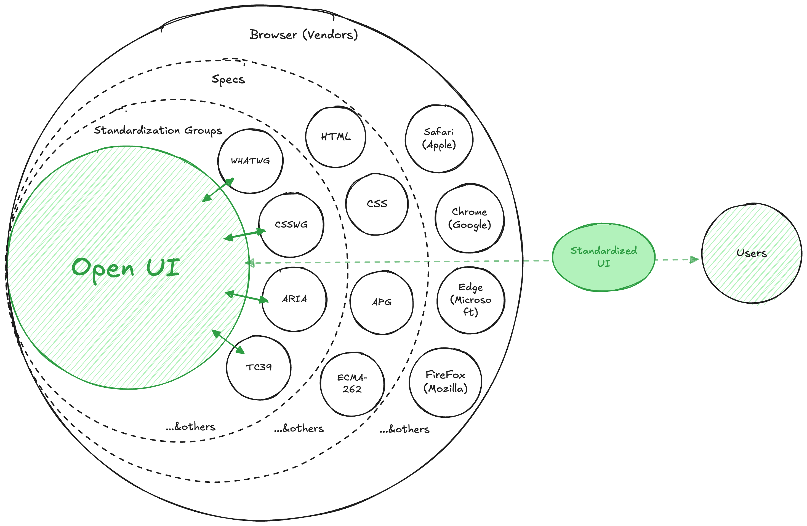
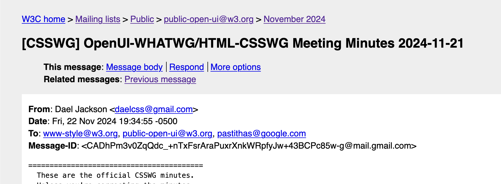

## Table of Contents

## はじめに

:::note{.message}
🎄 この記事は[Open UI Advent Calendar](https://adventar.org/calendars/10293)の 1 日目の記事です。
:::

今日から早速、Open UI についての話を進めていきます。

1 日目は、Open UI の概要、そして調査方法です🧤

## OpenUIとは

Open UI は、[W3C Community Group](https://www.w3.org/groups/cg/)の一つで、正式には[Open UI Community Group](https://www.w3.org/groups/cg/)です。端的にまとめると、Open UI は、Web プラットフォームの Interoperability を実現するための技術の標準化を検討することに取り組んでいます。

具体的には、独自 UI を作るにはどう HTML, CSS, JS, Web API を組み合わせるのが適切なのかを決めたり、標準を決める具体的なグループ（WHATWG, CSSWG, TC39 など）向けの推奨事項を作成したりします。

ここで注意したいのは、**Open UI自体は「標準そのものの決定はしない」こと**です。

Open UI は、Web 全体の UI コンポーネントやコントロールをリサーチし、Interoperability を実現するための技術の標準化を検討し、その過程で標準化団体と議論を重ね、策定された仕様を各ブラウザに実装してもらいます。
筆者の解釈では、 Open UI の担当範囲は次のグリーンの部分にあたります。

*Open UIの影響イメージ*

## Open UIがやること

- 標準 Web コンポーネント・コントロールのリサーチ
- デザインシステム、フレームワーク、Web プラットフォームの Interoperability を実現するための技術の標準化を検討
- WHATWG や W3C などの標準化団体と協力し、HTML、ARIA、CSS などに実際に仕様を追加
- Chromium、WebKit、Gecko などのブラウザエンジンチームと協力し、仕様に基づく機能をブラウザエンジンに実装してもらう

## Open UIの動向調査方法

Open UI の情報は次のリンクから得ることができます。

- Open UI Telecon Agendas: <https://github.com/openui/open-ui/tree/main/meetings/telecon>
- Discord server: <https://discord.gg/DEWjhSw>
- Mailing List: <https://lists.w3.org/Archives/Public/public-open-ui/>
- Open UI Github: <https://github.com/openui/open-ui>

### Telecon

Telecon（電話会議）が毎週午前 11 時（PST）に Discord の#teleconference チャンネルでおこなわれており、事実上は誰でも参加できます。

その週の Telecon の Agenda には、GitHub の[OpenなIssueで`agenda+`とラベル付けしてあるもの](https://github.com/openui/open-ui/issues?q=is%3Aopen+is%3Aissue+label%3Aagenda%2B)が上がってきます。どんな内容が今週議論されそうか事前に知っておきたい場合は、こちらを参照すると良いでしょう。
また、[openui/meetings/telecon](https://github.com/openui/open-ui/tree/main/meetings/telecon)からも、過去の Agenda を見ることができます。

隔週の Telecon の議事録は、GitHub リポジトリの[openui/meetings/telecon](https://github.com/openui/open-ui/tree/main/meetings/telecon)で Minutes として公開されています。しかし、Minutes のリンクが[openui/meetings/telecon](https://github.com/openui/open-ui/tree/main/meetings/telecon)に反映されるには時差があるため、最新の Minutes の内容が知りたい場合は、`https://www.w3.org/YYYY/MM/DD-openui-minutes.html`の URL を Telecon がおこなわれた日付に編集し、該当する Minutes を参照すると良いでしょう。

:::note{.memo}
e.g.）

[openui/meetings/telecon/2024-11-14.md](https://github.com/openui/open-ui/blob/main/meetings/telecon/2024-11-14.md)の Minutes を参照したい場合は、<https://www.w3.org/2024/11/14-openui-minutes.html> を開く。
:::

### Discord

雑多な議論は、Discord の各チャンネルで行われているようです。Issue に上がる背景を把握できたり、時には CG 外からの意見や質問が飛び込んできたりしています。

### Mailing List

Open UI の場合、メーリングリストは CSSWG など、外部 Working Group との Meeting Invitation や Minutes の共有に使われているようです。

***

W3C のメーリングリストでは、W3C の標準化活動に関する情報を受け取ることができます。
メーリングリストの活用方法は、W3C が次のリンクで紹介しています。

<https://www.w3.org/ja/email/>

メーリングリスト内を検索したい場合は、[W3C mailing list search service](https://www.w3.org/Search/Mail/Public/search)を利用することができます。

:::note{.memo}
e.g.）

Open UI のパブリックメーリングリストから「select」のキーワードを含むメールを検索したい場合は、次のように検索オプションを設定することができます。
<https://www.w3.org/Search/Mail/Public/search?lists=public-open-ui&keywords=select>
:::

さらに、[Message-Id redirection Service](https://www.w3.org/mid/)を使用することで、特定のメールが複数のメーリングリストに送信された場合も網羅できます。

:::note{.memo}
e.g.）

たとえば、`message-id`が`<CADhPm3v0ZqQdc_+nTxFsrAraPuxrXnkWRpfyJw+43BCPc85w-g@mail.gmail.com>`のメールを検索したい場合は、<https://www.w3.org/mid/CADhPm3v0ZqQdc_+nTxFsrAraPuxrXnkWRpfyJw+43BCPc85w-g@mail.gmail.com> となります。

*message-idはメールヘッダーから確認できる*
すると、そのメールが`public-open-ui@w3.org`と`www-style@w3.org`に送信されていることがわかります。同じ ID のメールでも、送信先が複数ある場合はそれぞれの場所で異なる前後関係となるため、議論を網羅的に追うためには、[Message-Id Redirection Service](https://www.w3.org/mid/)を活用すると良いでしょう。
:::

***

重複する部分があると思いますが、以前の登壇で OpenUI Community Group について話したものがあるので、そちらも参照してみてください。

<https://sakupi01.github.io/slides/ja/2024_frontendo2024_aftertalk/>

それでは、また明日⛄

See you tomorrow!

***

## Appendix

- [irc cheat sheet](https://gist.github.com/xero/2d6e4b061b4ecbeb9f99)
- [HTML Standard](https://html.spec.whatwg.org/multipage/)
- [All CSS specifications](https://www.w3.org/Style/CSS/specs.en.html)
- [ARIA - Accessibility | MDN](https://developer.mozilla.org/en-US/docs/Web/Accessibility/ARIA#standardization_efforts)
- [メーリングリスト - Wikipedia](https://ja.wikipedia.org/wiki/%E3%83%A1%E3%83%BC%E3%83%AA%E3%83%B3%E3%82%B0%E3%83%AA%E3%82%B9%E3%83%88)
