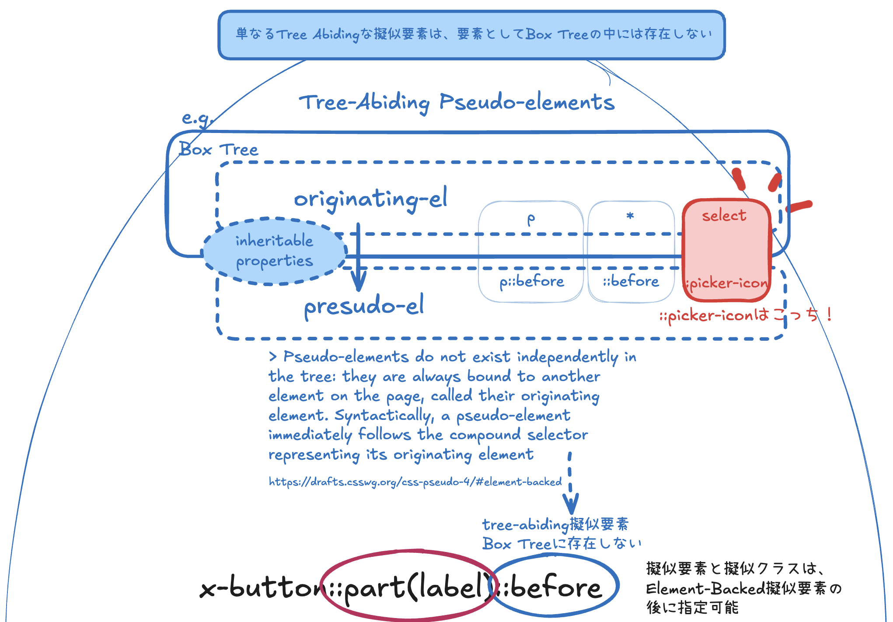
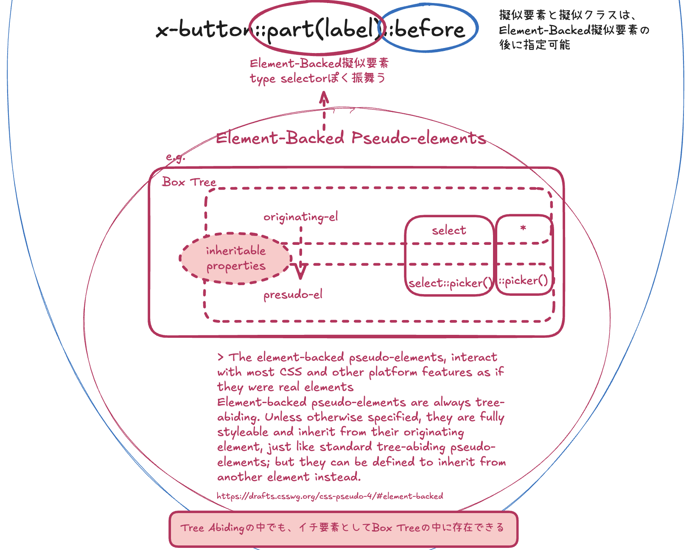

## Table of Contents

## はじめに

:::note{.message}
🎄 この記事は[Open UI Advent Calendar](https://adventar.org/calendars/10293)の 11 日目の記事です。
:::

[Customizable Select Element Ep.9](https://blog.sakupi01.com/dev/articles/2024-openui-advent-8)から、 `appearance: base-select;`で提供される、CSE のデフォルトの見た目が決定された背景の議論をお話ししています。

Ep.9 では、`<option>::checkmark`が現状の見た目となった背景について深掘りました。
今回は、`::picker-icon`部分について取り上げます。


_2024/12/9時点でのselectの各パーツの定義_

## Customizable Select Elementの関連仕様

### ボタン要素右の矢印アイコン

CSE のデフォルトのスタイルでは、ポップオーバー部分をトリガーする`<button>`の右に「▼」矢印アイコンが表示されます。

初期段階では、この矢印アイコンは`select::after`として実装されていましたが、後に`::select-arrow`となり、現在では`::picker-icon`となっています。

デフォルトスタイルを決める[Issue](https://github.com/w3c/csswg-drafts/issues/10857)の初期段階では、`select::after`という既存の擬似要素をそのまま使用して提案されていました。（現在はこの Issue の親コメントの内容は最新のものに変わっている）

もともと`::before`や`::after`で実装されていたのは、`::before`や`::after`が「`diplay: none;`などで簡単に上書きできる」という要件を満たしつつ、UA スタイルシートでの実装も容易だったためです。

- [[css-ui] Pseudo-elements for checkmark and dropdown icon for appearance base `<select>` · Issue #10908 · w3c/csswg-drafts](https://github.com/w3c/csswg-drafts/issues/10908)

しかし、デフォルトの擬似要素に加えて、`::before``::after`を要素に当てたいというユースケースも考えられます。
例えば、`<li>`のデフォルトの行頭文字は Bullet で`::marker`としてレンダーされますが、`<li>`に`::marker`だけでなく`::before`でも「何か別の要素（🎄）」を配置したい場合、次のように記述できます。

```css
li::marker {
  font-size: 1.5rem;
  color: orange;
}
li::before {
  content: "\1F384";
  margin-right: 10px;
}
```


_`::marker`を上書きする_

しかし、もし`::marker`が存在せず、UA スタイルシートに`li::before`で Bullet が実装されていた場合はどうでしょうか。`<li>`の`::before`はもう UA によって使われているため、Bullet と「何か別の要素（🎄）」の二つを配置することは困難です。

---

これに関して、デフォルトでは`::select-arrow`などの新しい擬似要素を提案するべきとの[指摘](https://github.com/w3c/csswg-drafts/issues/10857#issuecomment-2347867882)があり、TPAC 2024 の Open UI と CSSWG の Joint Session で話し合われる運びになりました。

- [Cascading Style Sheets (CSS) Working Group Teleconference – 24 September 2024](https://www.w3.org/2024/09/24-css-minutes.html#t07)

先ほどの`::marker`のようなケースのみならず、既存の`::before``::after`を UA で使用するとさまざまな考慮事項が発生します。

例えば、Author スタイルシートの`::after`を使ってボタン要素右の矢印アイコンを全く独自のものに置き換えるケース考えてみましょう。
次のように、UA スタイルシートがボタン要素右の矢印アイコンを`::after`で実装すると、以下をやらねばならなくなります。

1. UA スタイルシートの`select::after`に何が当たっているか DevTools を開いて確認する
2. Author スタイルシートで次の 3 つのプロパティを上書きする
3. 独自のアイコンにするためのスタイルを当てる

```css title={UAスタイルシート}
select::after {
  margin-inline-start: auto;
  display: block;
  content: counter(fake-counter-name, disclosure-open);
}
```

一方、UA が、`::before` `::after`ではなく新しい擬似要素で実装すると、新しい擬似要素を`display: none;`するだけで、デフォルトの矢印アイコンを削除でき、Author スタイルシートでの上書きが容易になります。

加えて、目的に沿った命名の擬似要素を定義することで、要素の目的を明確にできるという利点もあります。

こうした議論の結果、既存の`::after`ではなく、新しく擬似要素を定義するという結論に至りました。

> RESOLUTION: create new pseudo elements for checkmark and dropdown icon for base appearance select instead of using ::before and ::after in the UA stylesheet
> ACTION: Tab and fantasai to make better words for this in the css-pseudo spec

#### 擬似要素のカテゴリ

新しい擬似要素を実際に仕様書に記載する際、擬似要素を Tree-Abiding とするか Element-Backed にするかという話がありました。

擬似要素は 2 種類に大別でき、Tree-Abiding と Element-Backed はそれぞれ次のような特徴があります。

- `tree-abiding`な擬似要素: Tree に Abide（従う・倣らう）要素。それ自体は要素として Box Tree の中には存在しない。レンダーするコンテンツは、`content`プロパティ内に指定する e.g. `::before`, `::after`, `::select-arrow`（`::picker-icon`）
  - [CSS Pseudo-Elements Module Level 4](https://www.w3.org/TR/css-pseudo-4/#treelike)


_Tree-Abiding擬似要素_

- `element-backed`な擬似要素: Tree Abiding の中でも、Box Tree 内のイチ要素となるもの e.g. `::part()`, `::picker`
  - [CSS Pseudo-Elements Module Level 4](https://drafts.csswg.org/css-pseudo-4/#element-backed)


_Element-Backed擬似要素_

`::selected-arrow`は、元々`select::after`として定義＆実装されていたように、それ自体は Box Tree の中には存在しない`tree-abiding`な擬似要素なので、仕様書にも`tree-abiding`な擬似要素とカテゴライズされることになりました。

> gregwhitworth RESOLVED: add pseudo-elements for the select button and option checkmarks which are **fully stylable pseudo-elements** **with content specified by the content property**
> <https://logs.csswg.org/irc.w3.org/css/2024-10-24/>

- [[css-forms-1] Add new pseudo-elements for customizable select by josepharhar · Pull Request #10986 · w3c/csswg-drafts](https://github.com/w3c/csswg-drafts/pull/10986)

#### `::selected-arrow`、`::picker-icon`に決定される

`::selected-arrow`は暫定的な名前だったため、要素に対する議論＆投票が行われ、最終的に`::picker-icon`に決定され、Chromium の実装に反映されました。

> RESOLVED: go with ::picker-icon
> <https://github.com/w3c/csswg-drafts/issues/10908#issuecomment-2489173316>

- [6065538: Rename ::select-arrow to ::picker-icon](https://chromium-review.googlesource.com/c/chromium/src/+/6065538)

以下は、デフォルトの`::picker-icon`をカスタマイズした例です。

```css
.customized-picker-select {
  appearance: base-select;
  &::picker(select) {
    appearance: base-select;
  }
  /* デフォルトの::picker-iconは簡単に消せる */
  &::picker-icon {
    display: none;
  }
  /* ::afterを使って独自のドロップダウンボタンを実装できる */
  &::after {
    content: "";
    display: inline-block;
    width: 35px;
    height: 35px;
    background-image: url(https://blog.sakupi01.com/icon.svg);
    background-size: contain;
    vertical-align: middle;
  }
}
```

デモ：

<p class="codepen" data-height="300" data-default-tab="html,result" data-slug-hash="YPKyOyP" data-pen-title="Customized Select Element - Playground" data-user="sakupi01" style="height: 300px; box-sizing: border-box; display: flex; align-items: center; justify-content: center; border: 2px solid; margin: 1em 0; padding: 1em;">
  <span>See the Pen <a href="https://codepen.io/sakupi01/pen/YPKyOyP">
  Customized Select Element - Playground</a> by saku (<a href="https://codepen.io/sakupi01">@sakupi01</a>)
  on <a href="https://codepen.io">CodePen</a>.</span>
</p>
<script async src="https://public.codepenassets.com/embed/index.js"></script>

<br />

---

今回はポップオーバーを開閉するボタン要素右の矢印アイコン、`::picker-icon`を取り上げました。

- [ ] `appearance: base-select;`の見た目は、どのようにして決まったのか
  - [x] 選択された`<option>`のデフォルトチェックマーク
  - [x] ポップオーバーを開閉するボタン要素右の矢印アイコン
  - [ ] ボタン要素や選択肢ポップオーバーの色
  - [ ] その他のスタイル

上記 Issue に記されているデフォルトスタイルになった背景について、次回からも引き続き見ていこうと思います。

それでは、また明日⛄

See you tomorrow!

### Appendix

- [6024158: Update customizable select UA styles](https://chromium-review.googlesource.com/c/chromium/src/+/6024158)
- [6065538: Rename ::select-arrow to ::picker-icon](https://chromium-review.googlesource.com/c/chromium/src/+/6065538)
- [Bug 1934981 [wpt PR 49499] - Rename ::select-arrow to ::picker-icon, … · mozilla/gecko-dev@8426dc5](https://github.com/mozilla/gecko-dev/commit/8426dc5cc270a53e4a5483d8084047b3f65bd990#diff-d05e7899d421ed4baeab371c3fb033fc4844bf46780313a6ae6b4c1d265dc883)
