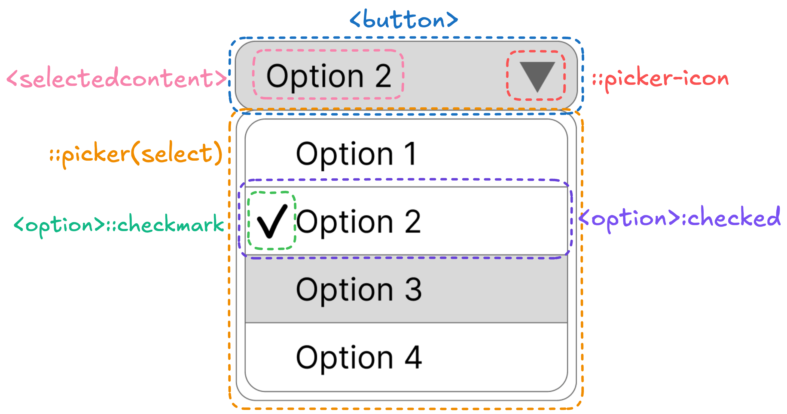
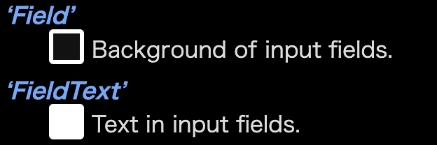

## Table of Contents

## はじめに

:::note{.message}
🎄 この記事は[Open UI Advent Calendar](https://adventar.org/calendars/10293)の 12 日目の記事です。
:::

Customizable Select Element Ep.9 から、 `appearance: base-select;`で提供される、CSE のデフォルトの見た目が決定された背景の議論をお話ししてきました。

[Ep.9](https://blog.sakupi01.com/dev/articles/2024-openui-advent-11)では、`<option>::checkmark`が現状の見た目となった背景について、[Ep.10](https://blog.sakupi01.com/dev/articles/2024-openui-advent-12)では、ポップオーバーを開閉するボタン要素右の矢印アイコン`::picker-icon`について深掘りました。 今回は、CSE がデフォルトで使用する「色」の関連技術について理解を深めていきます。


_2024/12/9時点でのselectの各パーツの定義_

## Customizable Select Elementの関連仕様

CSE の主に`::picker()`部分のデフォルトカラーには`<system-color>`が使用されています。

### `<system-color>`キーワードとは

`<system-color>`は、**ユーザのカラーテーマ設定や`color-scheme`によって適用される色が決まるキーワード**です。

身近な例として、`<textarea>`要素の背景色である「Field」やその文字色である「FieldText」などがあり、多くのシステムカラーが定義されています。


_system-colorの例_

- [CSS Color Module Level 4](https://drafts.csswg.org/css-color/#css-system-colors)

この`<system-color>`にどのような色が適用されるかは、**ユーザのカラーテーマ設定や`color-scheme`によって変化**します。

### `color-scheme`プロパティ

`color-scheme`プロパティは、**ページ実装者（以下、Author）が設定したカラーテーマ**を反映できる CSS プロパティです。

`<select>`のみならず、多くの Form Control やスクロールバーなどは、歴史的背景から Author によるスタイルが困難なものばかりです。
そうした Author スタイルシートからスタイルが困難な要素が、カラーテーマに対応できるよう、`color-scheme`プロパティが存在しています。

> While the prefers-color-scheme media feature allows an author to adapt the page’s colors to the user’s preferred color scheme, many parts of the page are not under the author’s control (such as form controls, scrollbars, etc). The color-scheme property allows an element to indicate which color schemes it is designed to be rendered with. These values are negotiated with the user’s preferences, resulting in a used color scheme that affects things such as the default colors of form controls and scrollbars. (See § 2.2 Effects of the Used Color Scheme.)
> <https://drafts.csswg.org/css-color-adjust/#color-scheme-prop>

`color-scheme`プロパティは次のような値を取ります。

```css
/* OSのライトテーマのみをサポートする */
color-scheme: light;
/* OSのダークテーマのみをサポートする */
color-scheme: dark;
/* 両方サポートする */
color-scheme: light dark;
/* ライトテーマを強制する */
color-scheme: only light;
/* ダークテーマを強制する */
color-scheme: only dark;
/* ページデフォルトのカラーテーマを使用する */
color-scheme: normal;
```

### `@media(prefers-color-scheme: <light | dark>)`

`color-scheme`で Author が設定したカラーテーマを反映できるのに対し、`@media(prefers-color-scheme: <light | dark>)`を使用すると、**ユーザが設定したカラーテーマ**を、`prefers-color-scheme`を用いてページに反映することができます。

> The prefers-color-scheme media feature reflects the user’s desire that the page use a light or dark color theme.
> <https://drafts.csswg.org/mediaqueries-5/#prefers-color-scheme>

例えば、Mac のシステム設定などで、OS にユーザが設定したカラーテーマがダークテーマだった場合、`@media(prefers-color-scheme: dark)`中に記述した、ダークテーマの CSS が適用されます。

```css
@media (prefers-color-scheme: light) {
  :root {
    color: var(--light);
    background-color: var(--light-bg);
  }
}

@media (prefers-color-scheme: dark) {
  :root {
    color: var(--dark);
    background-color: var(--dar-bg);
  }
}
```

このように、`prefers-color-scheme` Media Query を用いると、ユーザがブラウザや OS に適用したカラーテーマを、コンテンツに反映することができます。反映させるのはあくまで Author で、 Author が`prefers-color-scheme`を CSS でクエリして、そこにスタイルをあてて始めてコンテンツに反映されます。ユーザがカラーテーマ変えたからといって、Media Query にスタイルが当たっていなければ、ページのスタイルが変わるとは限りません。

`color-scheme` は、Author が要素やページ自体に対して、対応しているカラーテーマを宣言するプロパティです。例えば、ユーザが OS にはダークテーマを設定してる場合に、Author がページに Dark/Light 切り替え機能を用意して、`color-scheme: light` を設定すれば全体を light に、`color-scheme: dark` を設定すれば全体を dark にすることができます。

### カラースキーマの計算方法

ユーザは、Chrome の Automatic Dark Mode を用いて、Color Scheme を変更することができます。

:::note{.memo}
📝 カラーテーマを設定する方法は、例えば次のような方法があります。

1. ユーザが Preferred Color Scheme を変更する設定：Mac OS のシステム設定
2. ユーザが Preferred Color Scheme を変更する設定：Chrome の Preferrs Color Scheme
3. ユーザが Color Scheme を変更する設定：Chrome の Automatic Dark Mode
4. Author が Preferred Color Scheme を要素に反映する設定: prefers-color-scheme Media Query
5. Author が Color Scheme を要素・ページに反映する設定: color-scheme

:::

`color-scheme`は Author が適用する色を決める CSS プロパティですが、ユーザが Color Scheme を変更する設定していた場合、実際に適用される色はどのようにして決まるのでしょうか？

> To **determine the used color scheme** of an element:
>
> 1. If the user’s preferred color scheme, as indicated by the prefers-color-scheme media feature, is present among the listed color schemes, and is supported by the user agent, that’s the element’s used color scheme.
> 2. Otherwise, if the user has indicated an overriding preference for their chosen color scheme, and the only keyword is not present in color-scheme for the element, the user agent must override the color scheme with the user’s preferred color scheme. See § 2.3 Overriding the Color Scheme.
> 3. Otherwise, if the user agent supports at least one of the listed color schemes, the used color scheme is the first supported color scheme in the list.
> 4. Otherwise, the used color scheme is the browser default. (Same as normal.)
>    <https://drafts.csswg.org/css-color-adjust/#color-scheme-prop>

つまり、次の順番でどのような色が適用されるか決まります。

1. ユーザの設定した色が`color-scheme`によってサポートされる場合：ユーザの設定した Color Scheme が適用される
2. そうでない場合、つまり`color-scheme`で「only」を使用せずに「light/dark」が適用されている場合：ユーザの設定した Color Scheme で上書き適用される
3. そうでない場合、つまり`color-scheme`に「only」を使用して「light/dark」が適用されている場合：`color-scheme`の色が適用され、ユーザの設定した Color Scheme では上書きできない
4. 上記いずれでもない場合：[`color-scheme: normal;`](https://drafts.csswg.org/css-color-adjust-1/#valdef-color-scheme-normal)の色が適用される。ページデフォルトの色が[`<meta name="color-scheme" content=<"dark" | "light">`](https://html.spec.whatwg.org/multipage/semantics.html#meta-color-scheme)で指定されている場合はその色が適用され、指定されていない場合はページデフォルトの色（通常はライトテーマ）が適用される

### `light-dark()`関数

2024 年の CSS 新機能として登場した、`light-dark()`関数は、`@media(prefers-color-scheme: <light | dark>)`を使用せずとも、`color-scheme`を要素に反映することができる CSS 関数です。

```css
:root {
  color: light-dark(var(--light), var(--dark));
  background-color: light-dark(var(--light-bg), var(--dark-bg));
}
```

`color-scheme`のテーマに依存した色の変更は、ブラウザが UA スタイルシートに定義している`<system-color>`の利用でのみ可能でしたが、`light-dark()`関数の登場により、Author の定義した色が`color-scheme`プロパティのテーマに依存して変更可能になりました。

> System colors have the ability to react to the current used color-scheme value. The light-dark() function exposes the same capability to authors.

`light-dark()`関数は、`color-scheme`がライトテーマか不明な場合は第一引数の`<color>`値を、ダークテーマの場合は第二引数の`<color>`値を適用します。

---

上記で理解した、カラースキーマの適用順序を`light-dark()`関数で確認できるデモを作成しました。長いので Copepen リンクのみ記載します。

デモ：

<p class="codepen" data-height="300" data-default-tab="html,result" data-slug-hash="MYgjvwy" data-pen-title="which colour scheme? - light-dark()" data-user="sakupi01" style="height: 300px; box-sizing: border-box; display: flex; align-items: center; justify-content: center; border: 2px solid; margin: 1em 0; padding: 1em;">
  <span>See the Pen <a href="https://codepen.io/sakupi01/pen/MYgjvwy">
  which colour scheme? - light-dark()</a> by saku (<a href="https://codepen.io/sakupi01">@sakupi01</a>)
  on <a href="https://codepen.io">CodePen</a>.</span>
</p>
<script async src="https://public.codepenassets.com/embed/index.js"></script>

---

このように、`<system-color>`キーワードを使用すると、ユーザのカラーテーマ設定や`color-scheme`の値を反映した色でレンダリングされ、UA スタイルシート外部の設定と調和を保てます。この目的のために、`<system-color>`は定義（あるいは、既存実装から共通化して仕様化）され、UA スタイルシートで利用されているのです。

### ボタン要素や`::picker()`の色

そういうわけで、CSE の`::picker()`の色には、`<system-color>`を使用することに決まりました。

```css
::picker(select) {
  /* Same properties as popover and dialog */
  color: CanvasText;
  background-color: Canvas;
  border: 1px solid;
}
/* https://github.com/w3c/csswg-drafts/issues/10857 */
```

加えて、ボタン部分を表す、`<select>`の色に関しては、次の議論の結果、`<select>`には透明な`background-color`を使用し、`color`, `border-color`は親要素から継承するという決定がなされました。

> RESOLVED: Use currentColor for borders, inherit the color, transparent background color (for in-page controls). Use system colors for pickers.
> <https://github.com/w3c/csswg-drafts/issues/10909#issuecomment-2491769385>

今回はそこまで追えなかったのですが、`<select>`の各状態に応じたスタイルも議論されており、現状は次のような`<select>`のスタイルが提案されています。

```css
select {
  border: 1px solid currentColor;
  background-color: transparent;
  color: inherit;
}
select:enabled:hover {
  background-color: color-mix(in lab, currentColor 10%, transparent);
}
select:enabled:active {
  background-color: color-mix(in lab, currentColor 20%, transparent);
}
select:disabled {
  color: color-mix(in srgb, currentColor 50%, transparent);
}

select option:enabled:hover {
  background-color: color-mix(in lab, currentColor 10%, transparent);
}
select option:enabled:active {
  background-color: color-mix(in lab, currentColor 20%, transparent);
}
select option:disabled {
  color: color-mix(in lab, currentColor 50%, transparent);
}

/* https://github.com/w3c/csswg-drafts/issues/10909#issuecomment-2491769385 */
```

---

今回は、ボタン要素や選択肢ポップオーバーの「色」に関して取り上げました。

- [x] `appearance: base-select;`の見た目は、どのようにして決まったのか
  - [x] 選択された`<option>`のデフォルトチェックマーク
  - [x] ポップオーバーを開閉するボタン要素右の矢印アイコン
  - [x] ボタン要素や選択肢ポップオーバーの色
  - [ ] ~その他のスタイル~

その他のスタイルについては、現時点では不確定要素が多いため、今後確定してきた段階で調査していきたいと思います。

`appearance: base-select;`に関して、今回紹介した以外の、現状検討されているその他スタイルに関しては、[こちらのIssue](https://github.com/w3c/csswg-drafts/issues/10857#issue-2514699640)を参照ください。

それでは、また明日⛄

See you tomorrow!

### Appendix

- [CSS System Colors - Jim Nielsen’s Blog](https://blog.jim-nielsen.com/2021/css-system-colors/)
- [Media Queries Level 5](https://drafts.csswg.org/mediaqueries-5/#prefers-color-scheme)
- [CSS Color Module Level 5](https://drafts.csswg.org/css-color-5/)
- [CSS Color Adjustment Module Level 1](https://drafts.csswg.org/css-color-adjust-1/#color-scheme-prop)
- [Colors to use for appearance base `<select>`](https://lists.w3.org/Archives/Public/www-style/2024Oct/0012.html)
- [[css-ui] Colors to use for appearance base `<select>` · Issue #10909 · w3c/csswg-drafts](https://github.com/w3c/csswg-drafts/issues/10909#issuecomment-2491769385)
