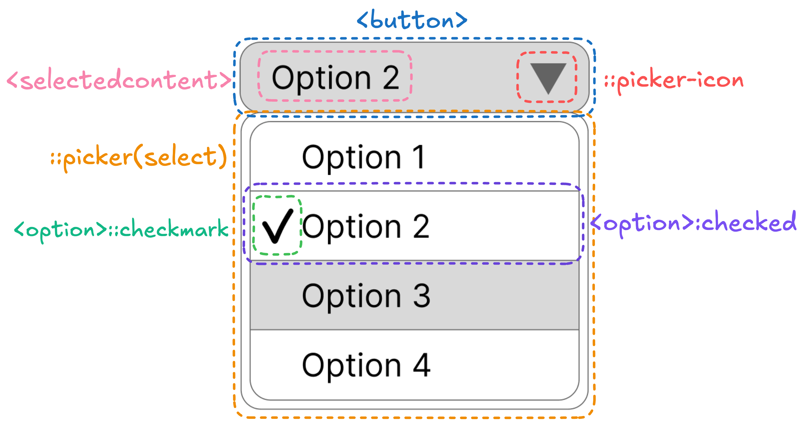

## Table of Contents

## はじめに

:::note{.message}
🎄 この記事は[Open UI Advent Calendar](https://adventar.org/calendars/10293)の 13 日目の記事です。
:::

[Customizable Select Element Ep.8](https://blog.sakupi01.com/dev/articles/2024-openui-advent-10)から[Ep.10](https://blog.sakupi01.com/dev/articles/2024-openui-advent-12)まで、 `appearance: base-select;`で提供される、CSE のデフォルトの見た目が決定された背景をお話ししてきました。

今回からは、`<selectedcontent>`が、どうして仕様に入ることになったのか、どういった技術的背景があるのかをお話ししていきます。


*2024/12/9時点でのselectの各パーツの定義*

## Customizable Select Elementの関連仕様

### `<selectedcontent>`とは

`<selectedcontent>`は、現在選択されている`<option>`のテキストを含む要素です。ユーザーがオプションを選択するたびに、ブラウザは`<selectedcontent>`の子要素を、新しく選択された `<option>` で `cloneNode()` を呼び出した結果に置き換えます。

`<selectedcontent>` を使用すると、選択された `<option>` のコンテンツを宣言的にボタンに複製することができます。これによって、`<selectedcontent>`内には、`<option>`内部コンテンツとは別のスタイリング・DOM 操作を適用できます。

次の使用例では、`<selectedcontent>`内のコンテンツに、`<option>`内部コンテンツとは異なる方法のスタイリングを適用しています。

```html
<select>
  <button>
    selected option: <selectedcontent></selectedcontent>
  </button>
  <option>Ponyo one</option>
  <option>Ponyo two</option>
</select>
```

```css
select {
  &::picker(select) {
    appearance: base-select;
  }
  selectedcontent {
    .label {
      display: none;
    }
  }
  img {
    width: 80px;
  }
}
```


*selectedcontent内部に、選択したoptionの要素がクローンされている。selectecontent内部のオプションは画像だけを表示する*

こうした、「DOM をクローンして、別の DOM の内部要素として挿入し、レンダリングする」という仕組みを提供する HTML 要素は、筆者の調査範囲では、`<selectedcontent>`が初めての仕様となります。

そもそも現在の`<select>`には「選択された`<option>`内のコンテンツを`<button>`に表示する」という仕様すらないのですが、どうして CSE を実現する上で`<selectedcontent>`が必要となり、仕様策定されることになったのでしょうか？

### `<selectedcontent>`の背景

`<selectedcontent>`のきっかけとなった提案は、もともと「[select]Inconsistent CSS handling when the "selected" attribute has been set on an option ?」というタイトルで 2022 年に登録された次の Issue でした。

- [[select] Should the inner HTML & styles of the selected option be copied into selected-value? · Issue #571 · openui/open-ui](https://github.com/openui/open-ui/issues/571)

この Issue の当初の期待としては、「選択された`<option>`のスタイルが、`<select>`自体のスタイルよりも優先されて表示されるようにするべき」というものでした。

具体的には、次のような場合に、選択された`<option>`のスタイルを`<select>`にも反映すべきではないか、ということです。


*選択された要素のスタイルがボタン部分に反映されない*

現状の`<select>`では、`<select>`が閉じた状態（つまり、選択肢が表示されていない状態）では、`<option>`のスタイルが`<select>`に直接反映されることはありません。これは、`<select>`要素の基本スタイリングが UA に任されており、`<select>`と`<option>`は異なる要素であるためです。
選択されたオプションのスタイルを`<select>`要素に反映させるとなると、JavaScript を使って命令的にスタイルを変更する必要があります。

実は、当時`<selectmenu>`（CSE の前身）が提案されていた段階では、`<selectmenu>`の内部に選択された`<option>`のスタイルを反映する仕組みが提案されていました。

それが`behavior`属性と`slot`属性であり、その前身として`part`属性と`slot`属性の利用が提案がありました。

### `part`属性と`slot`属性

MS で CSE の初期 Explainer が提案された時代、`<select>`コントロール（現 Anatomy では`<button>`の部分）をカスタマイズするために、`part`属性と`slot`属性を使用することが提案されていました。

- [Hooking up native controller code to user-provided UI parts - MSEdgeExplainers/ControlUICustomization/explainer.md at main · MicrosoftEdge/MSEdgeExplainers](https://github.com/MicrosoftEdge/MSEdgeExplainers/blob/main/ControlUICustomization/explainer.md#hooking-up-native-controller-code-to-user-provided-ui-parts)

`part`属性は Shadow DOM の仕様であり、`::part()`は CSS Shadow Parts として既に提案されています。
また、`slot`属性も Shadow DOM の仕様であり、今回特に新しく定義されたものというわけではありません。

端的にいうと、`part`属性は Shadow DOM にスタイルを適用するための属性で、`::part()`を使用して、Shadow DOM にスタイルを適用することができます。
また、`slot`属性は Shadow Root 内の特定の`<slot>`に、特定の Light DOM を挿入するための手法です。

上記 MS Explainer の`<selectmenu>`を例にとると、`slot`属性を使用して、`<selectmenu>`内の`<slot name="button">`に、`<div slot="button">`を挿入することができます。
そして、`::part()`を用いて、`<selectmenu>`内の`<slot name="button">`にスタイルを適用することができます。

```html
<selectmenu>
  <div slot="button" part="button">Custom button</div>
  <option>Cat</option>
  <option>Dog</option>
</selectmenu>

<!-- selectmenuのShadow DOMマークアップのイメージ -->
<template shadowrootmode="open">
  <slot name="button"><!-- ここにslot="button" part="button"を持つdivが入って、カスタマイズ可能なコントロールとして振る舞う --></slot>
  <!-- option -->
</template> 
```

しかし、この`part`属性と`slot`属性を使用する仕様には問題がありました。

***

それでは、また明日⛄

See you tomorrow!

### Appendix

- [MSEdgeExplainers/ControlUICustomization/explainer.md at main · MicrosoftEdge/MSEdgeExplainers](https://github.com/MicrosoftEdge/MSEdgeExplainers/blob/main/ControlUICustomization/explainer.md)
