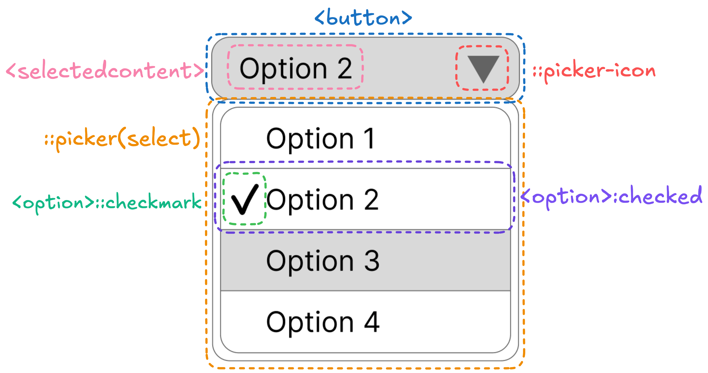

## Table of Contents

## はじめに

:::note{.message}
🎄 この記事は[Open UI Advent Calendar](https://adventar.org/calendars/10293)の 16 日目の記事です。
:::

[Ep.13](https://blog.sakupi01.com/dev/articles/2024-openui-advent-15)では、選択された`<option>`をクローンして`<button>`に反映する提案が仕様策定中止になり、`<selectmenu>`は引き続き、`slot`属性と`behavior`属性を使用してカスタマイズする方針となったことについてお話ししました。
今回は、そんな中で提起された、`slot`属性と`behavior`属性使用への疑念についてお話しします。


*2024/12/9時点でのselectの各パーツの定義*

## Customizable Select Elementの関連仕様

### `slot`属性と`behavior`属性使用への疑念

innerHTML のクローンに関する[議論](https://github.com/openui/open-ui/issues/571)が一旦収束し、`<selectmenu>`では、`slot`属性と`behavior`属性を使用してカスタマイズする方針に固まった後、別 Issue として、Domeninc から`slot`属性と`behavior`属性使用への疑念が提示されます。

これは、`slot`属性と`behavior`属性の使用方法が HTML の慣習に合っていないことを、問題として指摘したものでした。

- [[select] Don't reuse slot="" and ::part(); behavior="" is also strange · Issue #702 · openui/open-ui](https://github.com/openui/open-ui/issues/702)

Domenic は、`slot`属性と`::part()`は、**ユーザが作成したShadow DOM**を扱うために、**任意の要素**に使用できるように設けられており、**ネイティブのHTML要素**は、特定の親要素を持ち、子要素や疑似要素を通じてカスタマイズされることが一般的だと述べます。

以下などは、特定の親要素のコンテキストのもと、意味を持つ子要素や擬似要素の例です。

- `<details>`のための`<summary>`
- `<details>`のための`::marker`
- `<select>`のための`<option>`や`<optgroup>`
- `<fieldset>`のための`<legend>`
- `<dialog>`のための`::backdrop`
- `<input>`のための`::placeholder`

しかし、`behavior`属性は、**ネイティブのHTML要素**の Shadow DOM を**ユーザが**スタイルするために設けられているのと、特定の親要素のコンテキスト内（`<selectmenu>`内）でのみしか意味を持たないにも関わらず、任意の要素に使用できるため、HTML の慣習に沿っていないと主張しました。

（※ `behavior`属性が Shadow Root 内の任意要素に使えるのは、もともと`<selectmenu>`をカスタマイズするための`part`属性が名前を変えたものだからです。`::part()`は Shadow Root 内の任意の要素に使えるので、`behavior`属性も同じ範囲で使えるようになっています。）

したがって、より HTML の慣習に沿った方法、例えば子要素パターンを使用する方法に置き換えることができないかが問われました。

***

これを受けて、Jarhar は、`slot`属性と`behavior`属性を使用しているもの全てを、新しい要素に置き換える提案をしました。

- `<div popover=auto slot=listbox behavior=listbox>`を`<listbox>`に置き換える。
- `<button slot=button behavior=button>`を`<selectmenubutton>`のようなものに置き換える。
  - ただし、`<button>`要素を selectmenu の他の部分で使用したい場合があるため、単に`<button>`を使用することはできないかもしれない。
- `<span slot=selected-value behavior=selected-value>`を`<selectedvalue>`に置き換える。
- `<span slot=marker behavior=marker>`を`<marker>`に置き換えるか、疑似要素で置き換えることを検討する

その後、「HTML の慣習への準拠と Web Components に慣れていない開発者にとっての利用しやすさを優先するため、新しい要素を定義する主張の Domenic」vs、「ネイティブ HTML 要素を Web Components を扱う感覚でカスタマイズするという試みを推す Open UI 側」での議論が白熱します。

Open UI 側の主張：

- `<selectmenu>`は、Shadow DOM を持ち、それを扱う方法が明確に定義された最初のネイティブ HTML 要素になる
- slot を利用することで、意味的に適切な要素（例えば、`<button>`や`<input>`）を直接使用できる
- `::part()`は、そもそも、Web Components 技術を採用しようとしたために MS で提案された。`::part()`や`slot`を使用することで、ネイティブ HTML 要素を使用しながら、Web Component に触れてもらえるきっかけになる

Domenic の主張：

- `<selectmenu>`は Shadow DOM を含むべきではない。もし、`<input type=date>`や`<details>`, `<select>`のように、UA 側で Shadow Root を持つように実装されたとしても、これは実装の詳細に過ぎないため、外部向けに公開されるべきではない
  - 重ねて、`::part()`と`slot`は**ユーザーが作成する**Shadow DOM の領域に留まるべきであり、ネイティブ HTML 要素のカスタマイズにこれらを使用するべきではない
- 意味的に適切な要素は、`<selectmenu>`が期待する動作をする要素になる
  - 例えば、`<button>`は任意の動作を持つことができるが、`<summary>`はそうでばないので、`<button>`ではなく、`<summary>`を用いて`<details>`を展開/折りたたむ動作をする。`<selectmenu>`とそのボタン（e.g. `<selectmenubuton>`）も同様の関係を持つべき
- `::part()`や`slot`は Shadow DOM を作成したことがない開発者にとって新しい概念になる可能性がある

これら一連の議論を経て、Mason Freed を中心とする Open UI 側は、Domenic 側に倒れ、新しい要素を定義する方向で考えがまとまり、一旦 Issue を Close します。([comment](https://github.com/openui/open-ui/issues/702#issuecomment-1652199439))

***

しかし、この Close された Issue には、Web Components を活用するという期待が裏切られたことや、CSS の長年の課題に対する解決策として Web Components の役割が果たされなかったことへの悲痛なコメントが続きます。

e.g. [comment](https://github.com/openui/open-ui/issues/702#issuecomment-1654235474)
> For what it's worth, I'm pretty sad about the conclusion that we're not going to use Web Components technologies to describe pieces of the web that are implemented in browsers. In my mind, this was one of the major goals of Web Components (and thinking that is not a new opinion for me). There was admittedly a very long history leading to Web Components (including HTML Components, XBL 1, RCC, and XBL 2), and I was involved more in some of the earlier parts and had gotten tired of it before the parts that actually succeeded in building the pieces that have become a part of the Web. But being able to describe builtin controls formally was, I think, the main reason I thought that work was important in the first place.

e.g. [comment](https://github.com/openui/open-ui/issues/702#issuecomment-1656805455)
> I presume that you've read this thread and you'll find that that is not desired by at least one editor of the HTML specification. We additionally heard some general push back to this notion during the F2F CSSWG held 1.5 weeks ago. Suffice it to say, it's a lot of paddling upstream for that vision to come to fruition.

話は少し逸れるのですが、筆者は、WHATWG 側ですら、標準となって長い Web Components 機能の認知・利用拡大どころか、ユーザランドでの利用には極めて慎重な姿勢だということを、本 Issue で感じました。また、Open UI は、やはり「提案」という立ち位置で、その提案が受け入れられるかは、標準化団体の方針に大きく依存することも実感しました。

### `slot`属性と`behavior`属性使用の廃止へ

同 Issue は、再度 Open となり、`slot`属性と`behavior`属性の使用を廃止することが提案されます。

<https://github.com/openui/open-ui/issues/702#issuecomment-1662708138>

```html title="slotとbehavior時代"
<selectmenu>
  <div slot=button>
    <span>split button</span>
    <button behavior=button>
      <span behavior=selected-value />
    </button>
  </div>
  <div slot=listbox behavior=listbox popover=auto>
    <option>one</option>
    <option>two</option>
  </div>
</selectmenu>
```

```html title="提案された手法（ボタンは下記3を採用）"
<selectmenu>
  <span>split button</span>
  <button type=selectmenu>
    <selectedvalue />
  </button>
  <listbox>
    <option>one</option>
    <option>two</option>
  </listbox>
</selectmenu>
```

- 選択された要素
  - `<selectedvalue>` = `slot=selected-value`, `behavior=selected-value`
- ボタン
  1. `<selectmenubuttoncontainer>`, `<selectmenubutton>` = `slot=button`, `behavior=button`
  2. `<selectmenu>`中の最初の`<button>` = `slot=button`, `behavior=button`
  3. `<listbox>`と`<option>`以外の全ての要素, `<selectmenubutton>`または`<button type=selectmenu>` = `slot=button`, `behavior=button`
- Listbox
  - `<listbox>` = `slot=listbox`, `behavior=listbox`
  - `<datalist>` = `slot=listbox`, `behavior=listbox`

これをもって、Open UI 内で再度話し合われ、`<selectmenu>`の`slot`属性と`behavior`属性の使用を廃止が決定されました。
（※その間にちょうど[`<selectmenu>`から`<selectlist>`へのRename](https://github.com/openui/open-ui/issues/773#issuecomment-1664421419)があったため、次の`RESOLVED`となっています。）

> RESOLVED: **move forward with the "elements" approach** for `<selectlist>`,**abandoning the "slots" approach**. Open fresh issues for any new questions.
> <https://github.com/openui/open-ui/issues/702#issuecomment-1664464531>

`<selectlist>`の`slot`属性と`behavior`属性の使用が廃止されたことにより、一旦は中止と判断された「選択された`<option>`を`<button>`にクローンしてカスタマイズできるようにする」の結論が揺らぐことになります。

次回は、その後の「選択された`<option>`の反映とカスタマイズ」についてお話しします。

***

それでは、また明日⛄

See you tomorrow!

### Appendix
