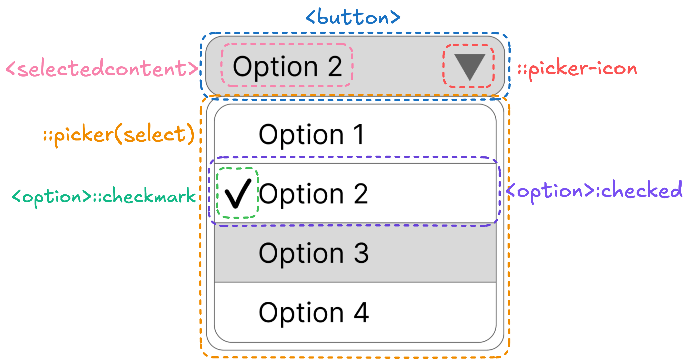

## Table of Contents

## はじめに

:::note{.message}
🎄 この記事は[Open UI Advent Calendar](https://adventar.org/calendars/10293)の 17 日目の記事です。
:::

[Ep.14](https://blog.sakupi01.com/dev/articles/2024-openui-advent-16)では、`<selectlist>`の`slot`属性と`behavior`属性の使用が廃止された経緯をお話ししました。`slot`属性と`behavior`属性は「選択された`<option>`を`<button>`にスロットしてカスタマイズできるようにする」ための手段だったのですが、この手段が廃止されたことにより、これからどう話が進むのかをみていきます。


*2024/12/9時点でのselectの各パーツの定義*

## Customizable Select Elementの関連仕様

### ここまでの整理

ここまでの経緯を一旦整理しておきます。`slot`属性と`behavior`属性が廃止されるまで、主に 4 つの Issue が関連しあっていました。

- [Hooking up native controller code to user-provided UI parts - MSEdgeExplainers/ControlUICustomization/explainer.md at main · MicrosoftEdge/MSEdgeExplainers](https://github.com/MicrosoftEdge/MSEdgeExplainers/blob/main/ControlUICustomization/explainer.md#hooking-up-native-controller-code-to-user-provided-ui-parts)
  - `slot`属性と`part`属性を使って「選択された`<option>`を`<button>`にスロットしてカスタマイズできるようにする」手法が、初期に MS の Explainer で提案される
- [[SELECT] The use of "part" clashes with custom elements containing <selectmenu> · Issue #354 · openui/open-ui](https://github.com/openui/open-ui/issues/354)
  - `part`属性を使うと、`<selectmenu>`が Shadow DOM でラップされていた場合に、外部からスタイルが適用される問題が指摘される。ここで`part`属性が`behavior`属性に変更される
- [[select] Should the inner HTML & styles of the selected option be copied into selected-value? · Issue #571 · openui/open-ui](https://github.com/openui/open-ui/issues/571)
  - `slot`属性と`behavior`属性を使用せず、選択された`<option>`のクローンを作成して`<button>`に反映することが提案＆議論されるが、一旦取り下げられる。そのまま`slot`属性と`behavior`属性の使用は続行
- [[select] Don't reuse slot="" and ::part(); behavior="" is also strange · Issue #702 · openui/open-ui](https://github.com/openui/open-ui/issues/702)
  - WHATWG 側から、`slot`属性と`behavior`属性の使用への疑問が呈され、結果として`slot`属性と`behavior`属性の廃止が決定。暫定代替案として、選択された`<option>`のクローンを反映する`<selectedvalue>`が提案される

という流れを辿って、`<selectedvalue>`が提案されるところまで来ました。

### 新しい`<selectlist>`のAnatomy

`slot`属性と`behavior`属性の廃止後に出された新しい Explainer では、[Issueでのコメント](https://github.com/openui/open-ui/issues/702#issuecomment-1662708138)に基づき、次のような Anatomy となりました。

- [Use new selectmenu anatomy in explainer by josepharhar · Pull Request #798 · openui/open-ui](https://github.com/openui/open-ui/pull/798)

`slot`属性と`behavior`属性の廃止によりでた差分のみにフォーカスしてみます。

> - button (slot) - The portion of the element which is rendered in the position of the button which opens the listbox. It should contain a button to open the listbox. If this part is not provided by the author, then `<selectlist>` will automatically create one. All child elements of the `<selectlist>`, except `<listbox>`, `<option>`s, and `<optgroup>`s will be slotted into this slot.
> - `<button type=selectlist>` - The button which opens the listbox when clicked. The `type=selectlist` attribute indicates to the browser that this button should open the listbox.
> - `<selectedvalue>` - The element which contains the text of the currently selected option. Every time that the user selects an option, the browser will replace the text content of this element with the text content of the selected option.
> - `<listbox>` - The wrapper that contains the `<option>`(s) and `<optgroup>`(s). If this part was not provided by the author, then `<selectlist>` will automatically create one.
>
> ***
>
> - button (slot) - listboxが開くbuttonが配置されるスロット部分。このスロットには、listboxを開くためのbuttonが配置される。もしAuthorがこの部分を提供しない場合、`<selectlist>`が自動的に作成する。`<selectlist>`の子要素で、**`<listbox>`、`<option>`、`<optgroup>`以外の全ての要素は、このスロットに配置される**。
> - `<button type=selectlist>` - クリックされたときにlistboxを開くbutton。`type=selectlist`属性値は、このボタンがlistboxを開くことをブラウザに示す。
> - `<selectedvalue>` - 現在選択されているoptionのテキストを含む要素。ユーザがoptionを選択するたびに、ブラウザはこの要素のテキストコンテンツを選択されたoptionのテキストコンテンツで置き換える。
> - `<listbox>` - `<option>`と`<optgroup>`を含むラッパー。もしAuthorがこの部分を提供しない場合、`<selectlist>`が自動的に作成する。

使用例も、次のようになっています。

```html
<selectlist>
  <button type=selectlist>
    <span>selected option:</span>
    <selectedoption></selectedoption>
  </button>
  <listbox>
    <option>one</option>
    <option>two</option>
  </listbox>
</selectlist>
```

この差分を見る限り、かなり現在の CSE の仕様に近い形になったように見えます。

しかし、この段階では、`<selectedvalue>`は選択された`<option>`の中身をまるっとクローンしてくる現在の仕様とは異なり、まだ単にプレーンテキストで置換するのみというふうに読み取れます。

要素クローンの話はどうなったのかを探る前に、`<selectedvalue>`は”`<selectedvalue>`”ではなくなるので、一旦軽く確認しておきます。

### `<selectedvalue>`、`<selectedoption>`へ

そもそも`<selectedvalue>`で提案されたのは、以前同等の機能を持っていたが、`behavior`の廃止とともに消えてしまった`behavior=selected-value`属性値に由来するためでした。

- [Naming of the selected value element · Issue #808 · openui/open-ui](https://github.com/openui/open-ui/issues/808)

上記 Issue では、`<selectedoption>`が有力候補として挙げられ、特に大きな反対もなく、`<selectedoption>`が採用されて[Explainerに反映](https://github.com/openui/open-ui/pull/833)されます。

:::note{.memo}

📝 小話: Open UI の Issue で管理されてる select は、実は２種類ある

- [select](https://github.com/openui/open-ui/labels/select): 単一選択の`<select>`として Ship しようとしているもの。現段階の CSE はこのタグに該当。議論中は「select-v1」とされることもある。
- [select-v2](https://github.com/openui/open-ui/labels/select-v2): 複数選択の`<select>`の意。select-v1 の Ship 後、仕様策定しようとしているもの。まだあまり議論は進んでいない。

:::

***

ここで再び、元々[選択された`<option>`のクローンが検討された背景のあるIssue](https://github.com/openui/open-ui/issues/571)に戻ります。

ここで Jarhar が提案した、**「プレーンテキストだけではない、選択された`<option>`の中身をまるっとクローンする`<selectedoption>`の実装」が、HTMLで初めて採用される実装の出発点でもあり、現在の`<selectedcontent>`の元**となります。

（※ これ以前の時点で、`<selectedmenu>`→`<selectlist>`に変更されているので、この先は`<selectlist>`と記述します）

### 選択された`<option>`の子要素を`<selectedoption>`にクローンする提案の再出発

Jarjar のコメントが非常によくまとまっているので、この節はコメントを意訳したものです。

この提案は、Mason Freed と Domenic と話し合われた結果、至った結論のまとめです。

- [comment](https://github.com/openui/open-ui/issues/571#issuecomment-1696637459)

**TL;DR: ブラウザが、選択された`<option>`の内容を`<selectedoption>`に`cloneNode()`して、その子Nodeを置き換えるべきだと考えている。標準化に向けてより良い解決策が見つかれば、それに切り替えることも考えているが、現在は、Chromiumで`cloneNode()`を用いたプロトタイプを実装している。**

次に、上記結論の過程で考慮された、実装方針の比較検討をしています。

#### 1. 選択された`<option>`の子Nodeを`<selectedoption>`のShadowRootにクローンする

`<selectedoption>`は UA の ShadowRoot を持ち、選択された`<option>`が変わるたびに`<selectedoption>`の ShadowRoot のすべての子を削除し、`<option>`を`cloneNode()`して、そのクローンの各子 Node を`<selectedoption>`の**ShadowRootに**追加します。

また、Author 側から UA ShadowRoot 内の`<selectedoption>`のスタイルをする上で、`<selectedoption>`の ShadowRoot 内のコンテンツをターゲットに指定するための、`::selectedoption()`のような疑似要素を提供する必要があります。

これは、SVG の[`<use>`](https://developer.mozilla.org/en-US/docs/Web/SVG/Element/use)の使い方に似ています。

この手法の問題点:

- スクリプトが UA ShadowRoot である`<selectedoption>`や`<selectlist>`にアクセスできてしまいます。
- `document.querySelector(::selectedoption)`は、UA ShadowRoot 内の Node にスクリプトでアクセスする口となり得ます。そこから ShadowTree を遡ることもできます。
- `<script>`要素をクローンした場合はどうなるでしょうか？（`currentScript`を使用してツリー内の Node にアクセスできる）
- `<script>`をクローンしないようにすることもできますが、`<iframe>`はどうでしょうか？（`frameElement`を使用できる）
- クローン/追加中にスクリプトが同期的に実行されないようにするために、[Side effects due to tree insertion or removal (script, iframe) #808](https://github.com/whatwg/dom/issues/808)を解決する必要があるかもしれません。

#### 2. 選択された`<option>`の子Nodeを`<selectedoption>`のLight DOMにクローンする

1 のように、クローン先に ShadowRoot を持つ代わりに、`<selectedoption>`の Light DOM 子 Node をクローンされた Node で置き換えます。

この手法の問題点:

- HTML には現在、Light DOM をこのように変更するものはありません。仕様は`<selectedoption>`の子 Node を設定することを、Author の Conformance Error とすることができます。
- クローン/追加中にスクリプトが同期的に実行されないようにするために、[Side effects due to tree insertion or removal (script, iframe) #808](https://github.com/whatwg/dom/issues/808)を解決する必要があるかもしれません。

:::note{.memo}
📝 Light DOM

Shadow Root がアタッチされている Host が Light tree と呼ばれることから、Light tree を構成する Node は一般的に Light DOM と呼ばれます。
>
> - The node tree of a shadow root’s host is sometimes referred to as the **light tree**.
> [DOM - Shadow Tree](https://chromium.googlesource.com/chromium/src/+/HEAD/third_party/blink/renderer/core/dom/README.md#shadow-tree)

:::

:::note{.memo}
📝 Conformance Error

Conformance Error とは、仕様に従っていない状態を指します。HTML や CSS などの仕様には、どのように要素や属性を使用すべきかが定義されていますが、これに従わない場合、Conformance Error となります。例えば、次のようなサイトでチェックすることができます。

[The W3C Markup Validation Service](https://validator.w3.org/)

:::

#### 3. CSSでコンテンツを内部的にミラーリングするための`element()`のサポート

Firefox は CSS でコンテンツを**ミラーリング**する方法を実装しています:

<https://developer.mozilla.org/en-US/docs/Web/CSS/element>

これと同等の機能を実装し、選択された`<option>`のレンダリング結果を`<selectedoption>`にミラーリングすることができます。

この手法の問題点:

- `<selectedoption>`と`<option>`それぞれに、別のスタイリングを適用できない。
- Listbox に表示される`<option>`のボックスサイズは、`<selectlist>`の`<button>`部分のボックスサイズとは通常異なります。そのため、ミラーリングされた画像は crop または stretch してフィットさせる必要があります。
- `<selectedoption>`に DOM の実態を提供しないため、`<selectedoption>`の中身が何であるかを知る術がありません。支援技術はこれを読み取れないか、対処するための修正が必要です。
- Chromium と WebKit にはこれの実装がないため、実装コストがかかります。

#### 4. Magical mirroring

3 のような、単なる画像としてのミラーリングではなく、選択された`<option>`の子 Node が`<selectedoption>`の**Flat treeまたはLayout treeにも現れるようにミラーリング**する方法を見つけることができるかもしれません。

:::note{.memo}
📝 Flat tree, Layout tree, etc

- [Node tree](https://chromium.googlesource.com/chromium/src/+/HEAD/third_party/blink/renderer/core/dom/README.md#node-and-node-tree): DOM ツリーの基本的な構造で、Node クラスから構成されるツリー。
- [Shadow tree](https://chromium.googlesource.com/chromium/src/+/HEAD/third_party/blink/renderer/core/dom/README.md#shadow-tree): Shadow Root がルートのツリー。host を通じて、必ず別の Node tree と接続されている。
- Light tree: Shadow Root の host となるツリー
- [**Flat tree**](https://chromium.googlesource.com/chromium/src/+/HEAD/third_party/blink/renderer/core/dom/README.md#flat-tree): Shadow tree を含む、複合的なツリーをフラット化して、単一の Node Tree にしたもの。

*Tree Flattening - 出典: chromium.googlesource.com /[DOM](https://chromium.googlesource.com/chromium/src/+/HEAD/third_party/blink/renderer/core/dom/README.md#flat-tree)*
- **Layout tree**: LayoutObject を Node として構成される Node tree。Viewport 内での Node の正確な位置やサイズなどが計算された、Paint の input となるツリー。つまり、ブラウザレンダリングフェーズの中でも、Layout フェーズ時に構築される。

:::

類似のアイデアが提案されていますが、同じものを意図するかは不明です: [`<mirror>` element, like `<slot>`, but not limited to ShadowDOM, elements from anywhere can be assigned to it · Issue #6507 · whatwg/html](https://github.com/whatwg/html/issues/6507)

この手法の問題点:

- 実装が難しいか不可能かもしれません。
- Node が DOM ツリー、Flat tree、Layout tree に一度だけ現れるという不変条件を達成する必要があります。
- ミラーリングでは、「同じ Node」が<`selectedoption>`と`<option>`の両方の子として現れます。CSS セレクタではどうなるでしょうか？例えば、`selectedoption > .foo { ... }`と`option > .foo { ... }`は、異なるスタイリングの目標を達成するために異なる動作を与えることが期待されていますが、CSS セレクタは「Node」を選択するため、「同じ Node」をターゲットにします。

#### 5. あきらめて全員にスクリプトを追加させる

「Light DOM へのクローン」を実現するために必要な、次のようなスクリプトを開発者に提供します:

```js
selectlist.addEventListener('change', () => {
  while (selectedoption.firstChild) {
    selectedoption.firstChild.remove();
  }
  for (const newChild of selectmenu.selectedOption.cloneNode(true)) {
    selectedoption.appendChild(newChild);
  }
  selectedoption.className = selectmenu.selectedOption.className;
});
```

この手法の問題点:

- 開発者の 80%が、`<selectlist>`のユースケースがこの動作をすることを期待しているとされています。そんな中、このスクリプトをコピー＆ペーストして動作させる必要があるならば、`<selectlist>`の持つ価値が失われてしまいます。宣言的な解決策の提供は重要で、もしできなければ、開発者は`<selectlist>`を使用しないかもしれません。

***

このように、一口にクローンすると言ってもさまざまな手法が考えられ、それぞれに pros/cons があることがわかります。単にクローンするにしても Light DOM にクローンするのか、Shadow DOM にクローンするのかに判断の余地があったり、ミラーリングは実装や DOM 的な懸念があったりします。

これに対して、Domenic は、クローンによる Light DOM の変更というのは前例のないことではあるが、このユースケースを達成するための唯一の合理的な選択肢であると考えている、とフィードバックします。

Light DOM に別の要素の Light DOM をクローンすると、`<selectedoption>`は具体的には次のような挙動をすることになります。

次の図では、選択された`<option>`の子 Node が、`<selectedoption>`の**Light DOM**にクローンされる様子を示しています。
Light DOM に直接挿入されるため、クローンされた要素は、Author Style Sheet の適用が可能となります。


*UAによってLight DOMにクローンされたNodeが直接挿入される様子*

こうした、要素が自身の Light DOM を変更するという挙動は、他の長年の HTML 機能に対するリクエストを解決するためにも必要かもしれないと Domenic は述べます。

例えば、上記のように、UA が Light DOM を変更して良いのであれば、これまで実現できなかった次のようなユースケースもカバーできるようになるかもしれません:

- `<include src="foo.html"></include>` のように、foo.html の内容が`<include>`の Light DOM 内に入るようにする機能
  - [Client side include feature for HTML · Issue #2791 · whatwg/html](https://github.com/whatwg/html/issues/2791)
- `<relativetime>2023-08-28T00:00:00Z</relativetime>`のように、Author 側からの input に対して、UA が内部的に日時を計算し、動的に Light DOM を変更することで結果を表示する機能。`<p>`のように、Author の input がそのまま表示されるのではなく、UA が能動的に Light DOM を変更する必要があるのがポイント。
  - [Proposal: measurement or number or quantity semantic HTML tag · Issue #9294 · whatwg/html](https://github.com/whatwg/html/issues/9294)
  - [A tag to display date and/or time to the user in his preferred format. · Issue #2404 · whatwg/html](https://github.com/whatwg/html/issues/2404)

Domenic は、この実装によって、プラットフォームが長年苦しんできた「Light DOM は完全に Author の領域であり、UA スクリプトによって変更されるべきではない」という制約に対して、今回意識的にその境界を越えることができれば、今後の新しい選択肢が開けるかもしれないという証拠を提供したい、と述べています。

- [comment](https://github.com/openui/open-ui/issues/571#issuecomment-1696744818)

***

こうして、`<selectedoption>`の提案が再スタートを切り、選択された`<option>`を`<selectedcontent>`の Light DOM にクローンする仕様が策定＆実装されていくことになります。

HTML 史上初となる、UA から Light DOM へのクローン追加実装。CSE のみならず、HTML の新たな可能性を切り開くきっかけと言え、非常に興味深いものとなっていきそうです！

次回からは、この`<selectedoption>`について、どのような実装上の課題があり、どう解決されていくのかを見ていきます。

それでは、また明日⛄

See you tomorrow!

### Appendix

- [Render-tree Construction, Layout, and Paint  |  Articles  |  web.dev](https://web.dev/articles/critical-rendering-path/render-tree-construction)
- [5370555: Implement <selectedoption> for StylableSelect](https://chromium-review.googlesource.com/c/chromium/src/+/5370555)
