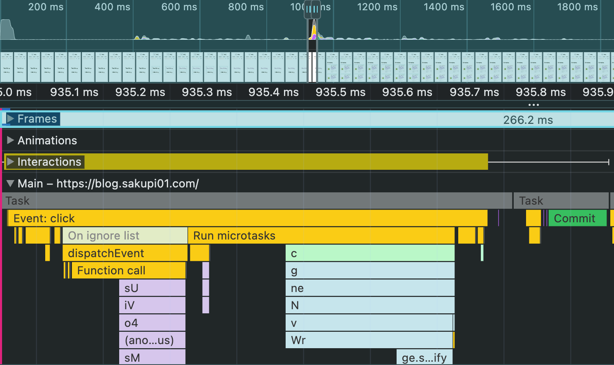
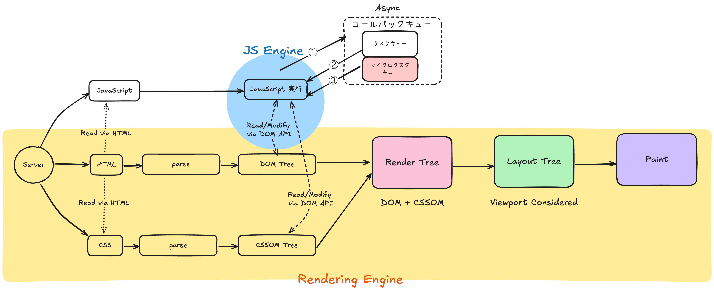

## Table of Contents

## はじめに

:::note{.message}
🎄 この記事は[Open UI Advent Calendar](https://adventar.org/calendars/10293)の 19 日目の記事です。
:::

[Customizable Select Element Ep.16](https://blog.sakupi01.com/dev/articles/2024-openui-advent-18)からは、`<selectedcontent>`が、どうして仕様に入ることになったのか、どういった技術的背景があるのかをお話ししています。

_2024/12/9時点でのselectの各パーツの定義_

[Ep.16](https://blog.sakupi01.com/dev/articles/2024-openui-advent-18)では、UA による Light DOM への Node クローン実装について、CSSWG との合意を得た詳細についてお話ししました。

今回からは、Light DOM での実装の中でも肝となる、「どのタイミングでクローンするのか」の議論を具体的に見ていきます。

## Timing of cloning for the `<selectedoption>` element

前回までで、Light DOM への Node クローンは CSSWG との合意を得ましたが、その実装については未確定でした。

:::note{.info}
👍🏻 この時点で固まっている仕様

- 選択された`<option>`で、`cloneNode()`を Call する
- 選択された`<option>`の、`<option>`を除く`<option>`内の全ての DOM をクローンする
- `<selectedcontent>`を用いて、宣言的な方法で、クローンされた DOM を`<selectedcontent>`の**Light DOM内に追加する**
- 選択された`<option>`が変更されるたびに、`<selectedcontent>`内の DOM を更新する

:::

具体的には、前回の CSSWG と Open UI の[会合](https://lists.w3.org/Archives/Public/www-style/2024Jul/0011.html)の中で、「`<option>`の子 Node を”どのタイミングで”クローンして、`<selectedoption>`に反映するのか」という議論が発散してしまいました。
そのため、今回次の Issue が WHATWG に切り出されます。

- [Timing of cloning for the `<selectedoption>` element · Issue #10520 · whatwg/html](https://github.com/whatwg/html/issues/10520)

まず、クローンするタイミングの候補として、以下が挙げられました。

1. 同期的にクローンする
2. マイクロタスク実行時にクローンする
3. Custom Element Reaction 実行時にクローンする

Jarhar が行った Blink の初期実装では、マイクロタスクを使用したかったことから、そのタイミングで発火する MutationObserver を使用していました。

では、そもそもどうしてマイクロタスクで実行したかったのでしょうか？

### JS実行タイミングとブラウザレンダリングの仕組みの関係を理解する

マイクロタスクは、「マイクロタスクを呼び出す関数が実行された後、コールスタックが空になった後にのみ実行される短い関数」のことですが、詳細には、「**コールバックキュー**内の**タスクキュー**が空になった後にのみ実行される短いタスク」と説明することがきます。

「コールバックキュー」とは、非同期処理の結果をキューイングするためのキューで、コールバックキュー内のタスクを実行するためのキューが、「タスクキュー」です。

「タスクキュー」とは、文字通り、タスクのキューです。そのキューを構成するのが「タスク」で、MDN では次のように説明されています。

> A task is any JavaScript scheduled to be run by the standard mechanisms such as initially starting to execute a program, an event triggering a callback, and so forth. Other than by using events, you can enqueue a task by using setTimeout() or setInterval().
> <https://developer.mozilla.org/en-US/docs/Web/API/HTML_DOM_API/Microtask_guide/In_depth>

つまり、タスクは「プログラムの実行開始やイベントが、コールバックをトリガーするなどの標準的なメカニズムにより実行されるよう、**スケジューリングされた JavaScript のこと**」です。

具体的なタスクの例としては、次のようなものがあります。

- イベントリスナの、コールバック関数
- `setTimeout()`や`setInterval()`で登録されたコールバック関数

そして、本題の「マイクロタスク」は「**コールバックキュー内のタスクキューが空になった後にのみ実行される短いタスク**」と説明できました。

例えば、Devtools の Performance タブで JavaScript の実行順序を観察してみると、`dispatchEvent`というコールバックキュー内のタスクが実行された後に、「Run microtasks」でマイクロタスクが実行されていることがわかります。

_JSでのマイクロタスクの実行タイミング_

そして、このマイクロタスクの実行タイミングが、ブラウザレンダリングの過程でどこに当たるのかを図で表すと次のようになります。

_JS実行タイミングとレンダリングの相関図_

同期的な処理はそのまま実行されますが、非同期な処理は一旦コールバックキューに入れ、タスクキューのタスクが終わったあとに順次処理されます。コールバックキューは、「タスクキュー」と「マイクロタスクキュー」に分けられ、タスクキューから優先的に消化され、最後にマイクロタスクキューに入っているマイクロタスクが処理されます。

### マイクロタスクを使うメリット

つまり、マイクロタスクキューは、JS 一連の実行タイミングの中でも最後に非同期実行されるキューです。

マイクロタスクは、タスクキューのタスクが完了するたびに実行され、短期間で多くの小さな非同期処理を効率的に処理する特性を持っています。これにより、例えば、複数の DOM 変更を一度にまとめて処理することで、レンダリングのオーバーヘッドを減少させることができます。そのため、パフォーマンスの点で優れた実装が見込めます。

それをすでにある仕様で実現できるのが MutationObserver であっため、Blink での初期実装は MutationObserver でクローンタイミングを制御していました。

### 同期的なMutationObserver： CEReactions MutationObserverの提案

これに対して、Custom Element の文脈で利用される`attributeChangedCallback`や`connectedCallback`などの「CEReaction タイミング」での変更を検知する、CEReactions MutationObserver の実装を提案する意見もありました。

CEReactions は、Custom Element のライフサイクルに関連するタイミングで発火するコールバック関数のことです。このタイミングを利用することで、Custom Element のライフサイクルに合わせて**同期的に**クローンを行うことができます。

[Ep.16](https://blog.sakupi01.com/dev/articles/2024-openui-advent-18)でも述べたように、非同期的に変更検知を行う MutationObserver では、Layout Flash 時に同期的に変更を検知することができません。つまり、非同期的な処理では、Layout Tree との整合性が保たれない恐れがあります。これは、マイクロタスクタイミングを使った非同期処理のデメリットでもあり、CEReactions タイミングを使って解決することができる問題でもあります。

CEReactions を使った手法を主張する Mozilla の[smaug](https://github.com/smaug----)は、次のように述べています。

> The over-cloning would happen only if one mutates the content of the selected option, no? The normal case is that user selects one option and the contents get cloned once. So CEReaction or even more synchronous cloning might not be too bad in this case.
>
> ほとんどのケースでは、ユーザーは1つの`<option>`を選択し、コンテンツが1回だけクローンされる。したがって、CEReactionタイミングで同期的にクローンすればいいのでは？
>
> Microtasks were designed for MutationObserver, and the reason was to improve performance in cases when one does lots of DOM mutation all over the place. That is not quite the case here.
>
> マイクロタスクはほぼMutationObserverのために設計されたと言っても過言ではなく、目的は、あちこちでたくさんのDOM変更を行う場合にパフォーマンスを向上させることにある。ここではそいうケースじゃないだろうから使わなくていいのでは？
>
> comment on [2255746553](https://github.com/whatwg/html/issues/10520#issuecomment-2255746553)

MutationObserver は、キューイングによるパフォーマンス向上が利点でしたが、CEReactions は同期的な処理で、Layout Tree との整合性を保つことができます。

---

最終的に、クローンタイミング実装の初期勘案では、主に２つの方法が挙げられましたが、Jarhar は、最終的にマイクロタスクを使った MutationObserver を使う方向を示します。

> I think we should go with microtasks instead of CEReactions for the following reasons:
>
> - MutationObservers already use microtasks, so trying to create an alternate type of CEReactions MutationObserver would be harder to spec and harder to implement.
> - -> MutationObserverはすでにマイクロタスクを使っているので、別のCEReactions MutationObserverを作成しようとすると、仕様を作成する必要があり、実装するのも難しい。
> - Performance will be better when imperatively building or modifying option elements due to fewer calls to clone all of the options contents into selectedoption elements.
> - → 選択された`<option>`の内容をクローンする回数を減らせるため、`<option>`を命令的に構築または変更する際のパフォーマンス向上が期待できる。
> - As @dandclark said in the call, it will be easier to understand how this works because it matches the author defined API of MutationObserver. I think this also increases the likelihood that this element is polyfillable.
> - → MutationObserverのAuthor定義APIと一致するため、どう機能するか理解しやすい。これにより、この要素がポリフィル可能である可能性も高まると思う。
>
> comment on [2265868320](https://github.com/whatwg/html/issues/10520#issuecomment-2265868320)

以下が、これまでの議論結果を含めた Blink での再実装です。

- [5758741: Improve <selectedoption> performance](https://chromium-review.googlesource.com/c/chromium/src/+/5758741)

ここまでが、[議論](https://github.com/whatwg/html/issues/10520)の 1/3 程度の内容でした。

---

それでは、また明日⛄

See you tomorrow!

### Appendix

- [select: Should `<selectedoption>` respond to mutations in the selected `<option>` · Issue #825 · openui/open-ui](https://github.com/openui/open-ui/issues/825)
- [Add `<selectedcontent>` element by josepharhar · Pull Request #528 · w3c/html-aria](https://github.com/w3c/html-aria/pull/528)
- [Define the `<selectedcontent>` element by josepharhar · Pull Request #10633 · whatwg/html](https://github.com/whatwg/html/pull/10633)
- [[html-aam] Addition: selectedoption element by scottaohara · Pull Request #2344 · w3c/aria](https://github.com/w3c/aria/pull/2344)
- [5370555: Implement <selectedoption> for StylableSelect](https://chromium-review.googlesource.com/c/chromium/src/+/5370555)
- [JS Visualizer 9000](https://www.jsv9000.app/)
- [Accessibility Object Model | aom](https://wicg.github.io/aom/explainer.html)
- [HTML Standard - Custom Element Reaction](https://html.spec.whatwg.org/#concept-custom-element-reaction)
- [In depth: Microtasks and the JavaScript runtime environment - Web APIs | MDN](https://developer.mozilla.org/en-US/docs/Web/API/HTML_DOM_API/Microtask_guide/In_depth)

Standard Positions

- WebKit
  - [Customizable select element · Issue #386 · WebKit/standards-positions](https://github.com/WebKit/standards-positions/issues/386)
- Mozilla
  - [Customizable select element · Issue #1060 · mozilla/standards-positions](https://github.com/mozilla/standards-positions/issues/1060)
