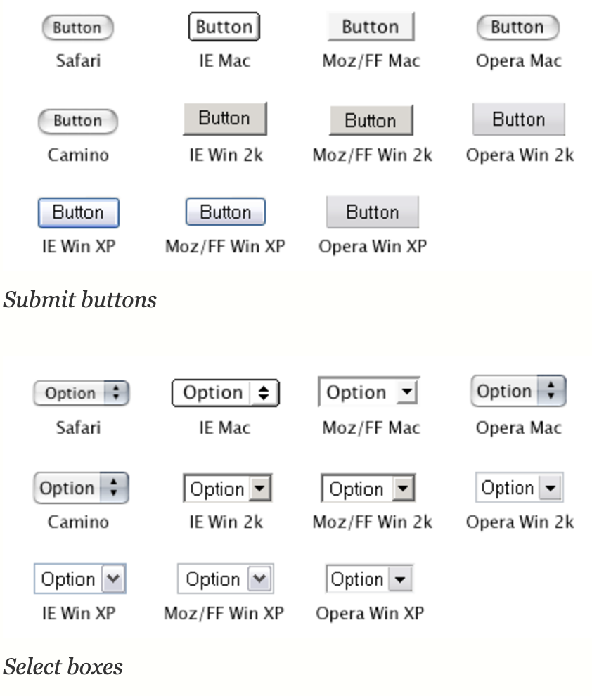

## Table of Contents

## はじめに

:::note{.message}
🎄 この記事は[Open UI Advent Calendar](https://adventar.org/calendars/10293)の 2 日目の記事です。
:::

2 日目は、Open UI の発足背景についてです🧤

主に[Charter | Open UI](https://open-ui.org/charter/)の部分を元に、どのような背景で Community Group が発足し、どのようなあゆみを経てきたのかを見ていきます。

## Open UI発足の背景: 現代のWeb UIの抱える課題

1993 年に、HTML に[最初のForm Control](https://www.w3.org/MarkUp/HTMLPlus/htmlplus_1.html)が発表されました。（のちに Web Form 1.0 となる）
これを使用することで、Web ページ上でテキストの入力、ボタンのクリック、ファイルのアップロード、チェックボックスやラジオボタンでの選択が可能になりました。

しかし、Form Control のスタイルはブラウザによって決まっており、OS にも依存していました。加えて、開発者からスタイルの上書きもできない/大幅に制限されていました。

2004 年から 2010 年にかけて Draft と Recommendation のステータスを行き来した[CSS2.1の仕様](https://www.w3.org/TR/CSS21/conform.html#q3.0)においては、次のように述べられています。Form Control への CSS 適用は実験的であったようです。

> CSS 2.1 does not define which properties apply to form controls and frames, or how CSS can be used to style them. User agents may apply CSS properties to these elements. Authors are recommended to treat such support as experimental. A future level of CSS may specify this further. - [UA Conformance](https://www.w3.org/TR/CSS21/conform.html#q3.0), CSS 2.1 Specification, W3C

_Styling form controls - <https://www.456bereastreet.com/archive/200409/styling_form_controls/>_

---

2004 年から 2008 年にかけての「Web2.0」の流行を経て、Form Control の黎明から 10 年以上経過した Web は、Interactivity が向上し、よりリッチな UI が求められるようになりました。
これらのデザインを実装するために、Flash や Action Script、ActiveX などのツール/言語や、jQuery などのフレームワークが使用されるようになりました。
このように、Web を使用する文化が広がるにつれ、求められる UI パターンも変化していきました。

そんな中、2008 年に発表された次世代 HTML である[HTML5](https://html.spec.whatwg.org/multipage/)は、そのようなパターンを HTML 自体に組み込んだものでした。

HTML5 の登場により、`<input>` への date, email, color type の入力や、`<select>` でのドロップダウン選択などが可能になりました。これにより、より高速で、信頼できる、アクセシブルでリッチなフォームを簡単に作成できるようになりました。

W3C による[HTML5](https://www.w3.org/TR/2011/WD-html5-20110405/)の仕様策定、WHATWG による[HTML Living Standard](https://html.spec.whatwg.org/)の運用開始から 15 年以上が経過した現在、多くの Web サイトは、HTML5 による Form Control や UI Control が提供する以上のものを必要とするようになっています。
そのために、重たい JavaScript フレームワークに頼ったり、アクセシビリティを犠牲にしたりすることも往々にしてあります。
それによって、ページの読み込み速度が低下したり、セキュリティの脆弱性が生じたり、アクセシブルでなくなることも珍しくありません。

---

そこで、HTML をもう一度モダナイズし、現代のニーズに応える UI パターンを標準化する動きが立ち上がりました。それが Open UI の発足です。

> It’s time to modernize HTML once again, and standardize the underlying technology needed by web developers to create the most common patterns of form and website-level UI controls. - [Vision](https://open-ui.org/charter/), Charter, Open UI

Open UI は、HTML、CSS、JavaScript など、Web UI を取り巻く技術全般に関わる標準化を目指しています。
そして、それらを組み合わせた UI を作成するアーキテクチャ自体の標準化も視野に入れています。

### Wrap-up

- 1993 年に定義された HTML の Form Control では、ブラウザや OS に依存したスタイルが適用され、スタイルの上書きもできない/大幅に制限されていた
- 2008 年に発表された HTML5 により、HTML だけでよりリッチなフォームを簡単に作成できるようになった
- HTML5 や HTML Living Standard の登場から 15 年以上が経過し、多くの Web サイトは HTML5 による Form Control や UI Control が提供する以上のものを必要とするようになった。Form Control や UI Control が提供する以上の UI を実現する上での問題も顕在化した。
- Open UI は、現代の Web UI が持つ課題を解決するために以下に関して取り組む
  - HTML、CSS、JavaScript、Web API など、**Web UIを取り巻く技術全般に関わる標準化**
  - 特定のユーザインターフェースのみを標準化の対象とするだけでなく、**カスタムのUIを作成するために必要なアーキテクチャの標準化**

---

それでは、また明日⛄

See you tomorrow!

### Appendix

- [The History of Web Browsers](https://www.mozilla.org/en-US/firefox/browsers/browser-history/)
- [The Evolution of Web Forms](https://ventureharbour.com/the-evolution-of-web-forms/)
- [Standardizing Select And Beyond: The Past, Present And Future Of Native HTML Form Controls — Smashing Magazine](https://www.smashingmagazine.com/2020/11/standardizing-select-native-html-form-controls/)
- [Styling form controls | 456 Berea Street](https://www.456bereastreet.com/archive/200409/styling_form_controls/)
- [17. Flash と ActionScript - JavaScript: 最初の 20 年 (翻訳) - inzkyk.xyz](https://inzkyk.xyz/js_20_years/failed_reformations/flash_and_actionscript/)
- [HTML Living StandardとHTMLの歴史 - とほほのWWW入門](https://www.tohoho-web.com/html/memo/htmlls.htm)
