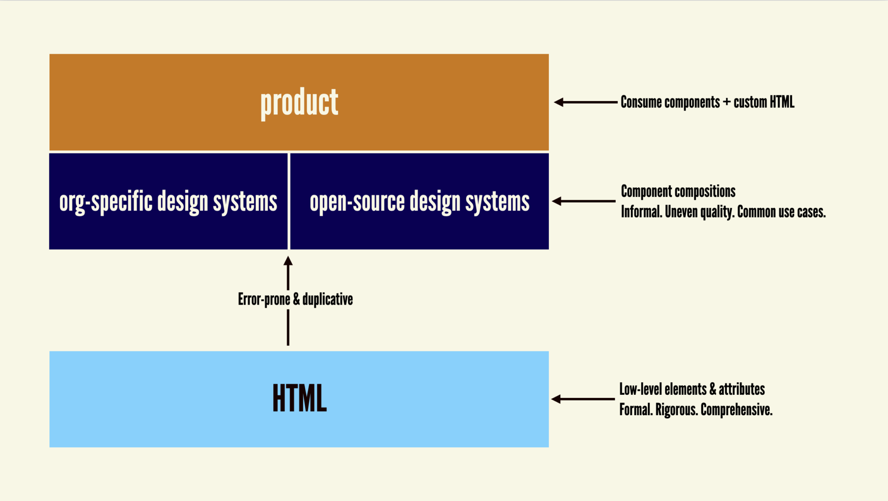
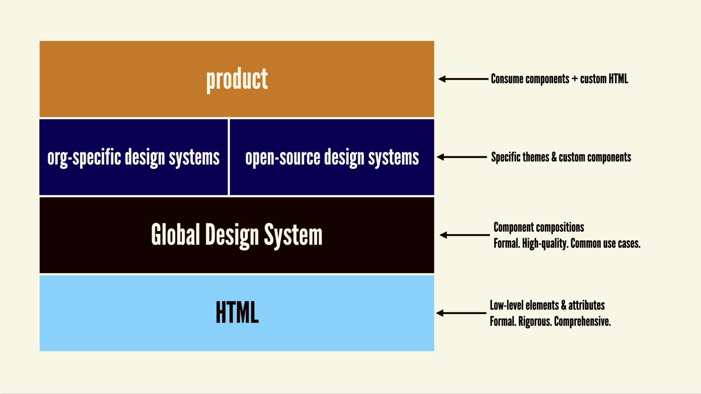
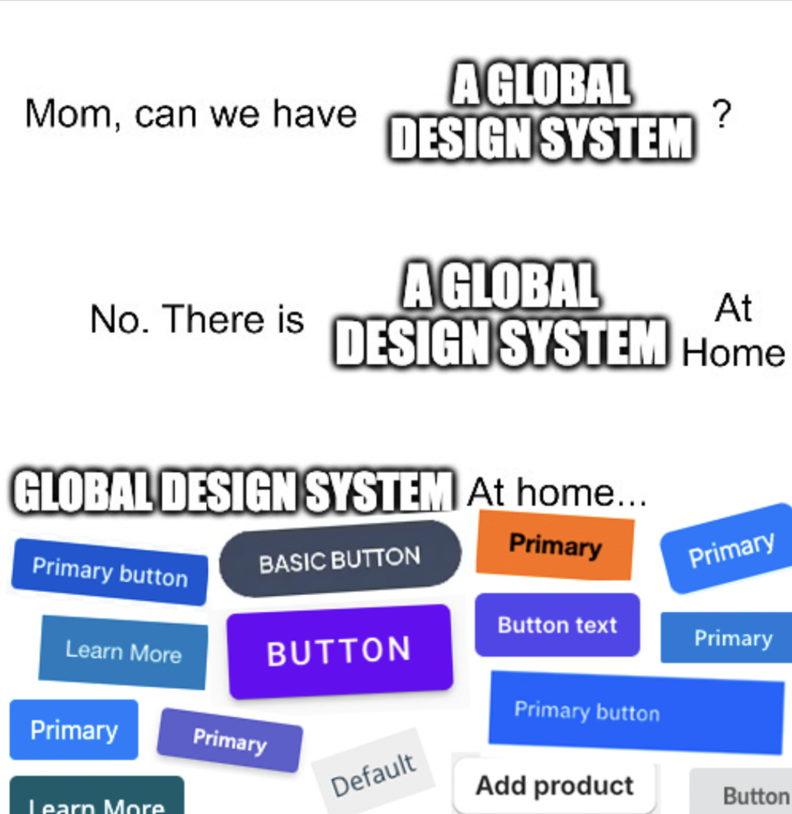

## Table of Contents

## はじめに

:::note{.message}
🎄 この記事は[Open UI Advent Calendar](https://adventar.org/calendars/10293)の 23 日目の記事です。
:::

本アドベントカレンダーの締めくくりとして、Open UI 内で最近プロジェクトとして確立した、「[Global Design System](https://github.com/openui/design-system)」を取り上げます。

## デザインシステムの開発を加速させる、堅牢で柔軟なGlobal Design System とは

Global Design System は、2024 年初めに、Brad Frost によって提唱された、新しいレイヤーでのデザインシステムの概念です。2024 年末現在、Global Design System は Brad 個人ではなく、W3C Open UI Community Group のプロジェクトとして動き始めています。

## 提案背景

ことの発端となったのは、今年初めに投稿された Brad の記事でした。ここで初めて、Global Design System の基本的な概念が提唱されます。（参考：[Global Design Systemにおける３つのコアメンタル](https://blog.sakupi01.com/dev/articles/2024-openui-advent-23#global-design-systemにおける３つのコアメンタル)）

- [A Global Design System | Brad Frost](https://bradfrost.com/blog/post/a-global-design-system/)

この記事を受けて、[Shop Talk](https://open.spotify.com/show/2PUoQB330ft0sTzSNoCPrH?si=rljg0AXLRaqlSLlgGbuxww) を運営する Chris Coyier らが、Brad をゲストに招いて、記事に関する対談を行います。

<https://open.spotify.com/episode/3Mp4aV1j44qzIZ4b7XSJmX?si=xXkP_LMIRUqqwTmUrTLVzA>

対談では、基本的に Brad の提唱記事に沿った GDS のコンセプトが話されていました。その中で、GDS は Brad が過去に提唱した Atomic Design の Atom や Molecule のレイヤーに位置するものとなることや、GDS がすべてのユースケースに対応する難しさに課題があることなどが議論されていました。

:::note{.memo}
📝 Frostapalooza

（Podcast のタイトルにある「Frostapalooza」は、Brad の 40 歳の誕生日企画として開催される音楽イベントのことでした...）

[FROSTAPALOOZA - A CONCERT/PARTY/HAPPENING ON AUGUST 17th, 2024](https://frostapalooza.bradfrost.com/)
:::
その後日記として Chris は次の記事を投稿します。

- [Thoughts on a Global Design System – Chris Coyier](https://chriscoyier.net/2024/02/05/thoughts-on-a-global-design-system/)

上記 Podcast で上がった疑問も含めて、記事ではざっと次のようなことが述べられています、これは GDS の概念をより確固たるものにする上で、非常にいい意味での批判となっていました。

- OSS のデザインシステムと何が違う？: 既存の OSS デザインシステムも抽象化された設計されているが、それが失敗しているとすれば、その理由は何か。
- 採用率の目標値は？: GDS がどの程度採用されるべきか、その理想的な割合は何か。
- どこまで対応するのか？: システムがあまりにも多くのニーズに応えようとすると、結局誰のニーズも満たさない可能性があるのではないか。
- 既存のコンポーネントの利用: もし完璧なコンポーネントが存在するなら、すでに広く使われているはず。
- Web Components の利用: Web Components は、まだ成熟しきっておらず、GDS の配布手段として適しているかどうか判断しかねる。
- スタイルの問題: スタイルがないことが要件となっている GDS において、多くの人々はデザインシステムのデザイン性を求めているため、スタイルのないシステムに興味を持たない可能性があるのでは。
- 意思決定の難しさ: GDS が多くの組織に採用されるためには、非常に強力な原則とオーナーシップが必要。

Chris の記事やコミュニティからのフィードバックを受け、Global Design System の概念を固めた上で、Brad は回答となる記事を改めて自身のブログに投稿します。（参考：[Global Design Systemにおける３つのコアメンタル](https://blog.sakupi01.com/dev/articles/2024-openui-advent-23#global-design-systemにおける３つのコアメンタル)）

- [What’s Next for a Global Design System | Brad Frost](https://bradfrost.com/blog/post/whats-next-for-a-global-design-system/)

こうして固まった Global Design System の概念を、Brad は Open UI の Chair である Greg を中心に持ちかけます。Global Design System の概念は、ここで初めて Open UI に打ち出されました。（2024/3/12）

- [A design system, component library for the web? · Issue #1017 · openui/open-ui](https://github.com/openui/open-ui/issues/1017)

---

元々は一個人の提案から始まった Global Design System ですが、どうして Open UI のプロジェクトとして確立されるに至ったのでしょうか？そもそも、Global Design System の本質とは何なのでしょうか？

※ 以下、GDS = Global Design System とします

## Global Design Systemにおける３つのコアメンタル

GDS が本質的に何を目指すのかを理解し、これからどう動いてくのかを推測する上で、GDS のメンタルモデルを理解しておくことは重要です。

この節は、GDS の提唱者である Brad の記事や Discord を含めた Open UI での議論をもとに、GDS のメンタルモデルを筆者が解釈してまとめたものになります。

<https://bradfrost.com/blog/post/a-global-design-system/>

<https://bradfrost.com/blog/post/whats-next-for-a-global-design-system/>

### HTMLの上に構築されるレイヤー

**GDSは、HTML（標準）の代替をとなるものではありません**。
HTML をベースとして構築されるデザインシステムと HTML レイヤーの間に欠けているものを埋めることが、GDS の役割です。


_HTMLレイヤー（標準）と各デザインシステムの間にギャップがあることで、共通部分の機械的な複製や、意図しない欠損が生じる可能性がある_

**組織が何度も構築&再構築しているコンポーネントの共通部分が、Web の適切な組織によって承認された成果物として管理され、それがHTMLと既存のデザインシステムの間のギャップを補完するレイヤーとなる**ことで、開発者はより効率的に堅牢なデザインシステムを構築できるようになります。


_HTMLレイヤー（標準）と各デザインシステムの間をGDSが埋めることで、より堅牢で信頼できるデザインシステムを、効率的に作成できる_

つまり、競合する標準を作成することではなく、現状の HTML と各デザインシステムとのギャップを埋めるために、新しいレイヤーを導入することが目標となります。

GDS が標準の一部でないことは、GDS の概要にも明記されています。

> A W3C Standard - The OpenUI Design System is an incubation for possible future enhancements to the web platform but they are not standardized components.
> [openui/design-system](https://github.com/openui/design-system)

### 特定の見た目と技術に依存しない、スタンドアロンなデザインシステムとなる

**GDSは、ブラウザデフォルトのスタイルのみを含むスタンドアロンなデザインシステム**です。言い換えれば、堅牢なセマンティクスと機能を提供し、かつ見た目の技術の柔軟性を保った、いわば「**特定の見た目と技術に依存しない、スタンドアロンなデザインシステム**」です。

故に、開発者は GDS をプロジェクトに取り込み、ブランドの**あらゆる**デザインや機能を、**あらゆる**言語・ライブラリ・フレームワーク（CSS、JS、JSX、Web Components、Tailwind、React、Vue、Angular etc）を用いて拡張できます。

前述したように、GDS の目標は、既存のデザインシステムの兄弟を作成することではなく、**既存システムを拡張するための、オフィシャルなレイヤー**を導入することです。

独自のブランドスタイルや言語に依存した 3rd Party/組織のデザインシステムと GDS との相違点は、”GDS の Brand&Tech Agnostic さ”にあります。


_OSSコンポーネントライブラリや独自デザインシステムは、そのコンテキストのみでしかGlobalではない_

共通コンポーネントには、必ず共通かつ一般的なセマンティクスと動作がありますが、スタイルは大きく異なります。

こうした、コンポーネントのコアとなるセマンティクスや機能を、イチから設計、構築、拡張、結合、テストして、独自デザインシステムを作成するのは、どう考えても非効率でした。そこで、GDS が適切な組織によって承認された堅牢なセマンティクスや動作を提供することで、それを拡張した、堅牢で信頼できる独自のデザインシステムを効率よく構築できるようになります。

堅牢なセマンティクスや動作を提供するデザインシステムに加え、開発者が独自の見た目や機能を組み合わせることで、独自デザインシステムを構築する良い例として、[Design System + CSS Zen Garden](https://bradfrost.com/blog/post/creating-themeable-design-systems/)が参考になります。

### 全てのUI要件の包括的なソリューションにはならない

GDS はそもそも、すべてのユースケースに対応するとを目的としていません。特定のコンポーネントのユースケースの**大部分に対応するソリューションを提供できれば、大きな成果として評価されます**。

例えば、クリックするとバックフリップして、SVG の星を撒き散らすようなボタンコンポーネントを作成する必要があるとしましょう。
こういった場合、開発者は、**素のHTML, CSS, JS**を構成して、独自の UI を作成すれば良いです。

先にも述べたように、**GDSは、HTML自体を拡張するのではなく、HTMLの上レイヤーに存在するというアプローチ**を取っています。
それゆえ、**HTML はGDSでカバーできないようなすべてのユースケースに対応できる必要があります**が、**GDS（特にWeb Components ライブラリ）は最も一般的と考えられるユースケースのみを対象にできます**。

つまり、開発者は、GDS を利用できる場面では利用し、そうでない場面ではビルトインの HTML, CSS, JS を駆使しすれば良いのです。

とはいえ、GDS 自体は非常に保守的なものとし、真に一般的なユースケースに重点を置くためのリサーチと検討が重ねられた上で構築されます。

## Global Design Systemが提供するもの

こうしたメンタルモデルを持った GDS は、具体的に次のようなものを成果物として提供することが想定されています。

### 1. コンポーネントライブラリ

GDS のコンポーネントライブラリは、次の 6 つの原則に則って作成されます。

> 1. **アクセシビリティやその他のフロントエンドのベストプラクティスの手段**であり、一般的な UI コンポーネントの”Single Source of Truth”となる
> 2. あらゆるブランドやデザインに合わせて**簡単にテーマを設定できる**ようにする
> 3. **直感的**に使用でき、一貫したAPI、論理的な構造、わかりやすい構文を開発者に提供する
> 4. **Interoperable**で、あらゆる Web サイトやアプリを強化できる
> 5. 言語、記述方法などの多様性に対応するために**国際化されている**
> 6. **ComposableかつExtensible**であるため、開発者は特別なハックをすることなく変更または拡張できる
>
> [A Global Design System | Brad Frost](https://bradfrost.com/blog/post/a-global-design-system/)

これらを達成するための技術的手段として、Web Components を用いることが提案されており、次のような使用方法が想定されています。

```html
<w3c-button-group>
  <w3c-button variant="primary">Log In</w3c-button>
  <w3c-button>Cancel</w3c-button>
</w3c-button-group>
```

また、GDS のコンポーネントライブラリは、npm などの 3rd Party パッケージレジストリを通じて、開発者が利用できる形で提供される予定です。

### 2. デザインライブラリ

Figma や Sketch などのデザインツールで構築されたデザインライブラリも、GDS の一部として提供されることが期待されます。

### 3. リファレンスサイト

GDS のコンポーネントライブラリやデザインライブラリに関するドキュメントは、リファレンスサイトとして提供されるとしています。

## デザイナーやエンジニアはどう変わるのか

GDS によって、デザインシステムを構築するチームは、**単なるコンポーネントの構築ではなく、デザインや機能のより深い側面に集中できるようになります**。

デザインシステムチームは、組織/製品レベルのコンテキストを包含したコンポーネントや、それに関するガイドラインなどを成果物として作成する必要が依然としてあり、それらが GDS によって吸収されることはありません。

---

Part2 では、GDS と Open UI の具体的なインテグレーションと、彼らが実現する未来についてお話しします。

それでは、また明日⛄

See you tomorrow!

### Appendix

- [A Global Design System | Brad Frost](https://bradfrost.com/blog/post/a-global-design-system/)
- [Thoughts on a Global Design System – Chris Coyier](https://chriscoyier.net/2024/02/05/thoughts-on-a-global-design-system/)
- [What’s Next for a Global Design System | Brad Frost](https://bradfrost.com/blog/post/whats-next-for-a-global-design-system/)
- [A design system, component library for the web? · Issue #1017 · openui/open-ui](https://github.com/openui/open-ui/issues/1017)
- [Thoughts on a Global Design System](https://www.gwhitworth.com/posts/2024/my-thoughts-on-global-design-system/)
- [927: Thoughts on a Global Design System](https://bkardell.com/blog/927.html)
- [Open UI Component Certified Checklist - Google ドキュメント](https://docs.google.com/document/d/1eTSxCWd3yRMxTCAs3a74NzQ6C9gikYQLZeVdCMODwOg/edit?tab=t.0#heading=h.jjvcvbvmo8v1)
- [Comparing design systems to find the best qualities | hidde.blog](https://hidde.blog/re-global-design-system/)
- [Nue 1.0 (Beta) - Nue](https://nuejs.org/blog/nue-1-beta/)
- [Foundation for the Global Design System component library · Issue #1066 · openui/open-ui](https://github.com/openui/open-ui/issues/1066)
- [openui/design-system](https://github.com/openui/design-system)
- [Introducing new HTML elements that are pay-for-what-you-use · Issue #4697 · whatwg/html](https://github.com/whatwg/html/issues/4697)
- [Design Tokens Format Module](https://tr.designtokens.org/format/)
- [Front-of-the-front-end and back-of-the-front-end web development | Brad Frost](https://bradfrost.com/blog/post/front-of-the-front-end-and-back-of-the-front-end-web-development/)
- [Let’s talk about web components | Brad Frost](https://bradfrost.com/blog/post/lets-talk-about-web-components/)
- [HTML is a Global Design System](https://designsystems.wtf/html-is-a-global-design-system/)
- [What's ‘normative’ in WCAG? | hidde.blog](https://hidde.blog/whats-normative-in-wcag/)
- [Definition of a "control"? · Issue #81 · openui/open-ui](https://github.com/openui/open-ui/issues/81)
- [601: Brad Frost on A Global Design System + Frostapalooza – ShopTalk](https://shoptalkshow.com/601/)

Notable comments found in Didcord:

- [Should this be a design system only and not include a component library?](https://discord.com/channels/714891843556606052/1216793626290421814/1217243783226462350)
- [What would `<www-button>` do that html `<button>` doesn't do?](https://discord.com/channels/714891843556606052/1216793626290421814/1217820806306988062)
- [can you give us a list of 10 components you envision would be ideal for this, but wouldn't probably be a native HTML element?](https://discord.com/channels/714891843556606052/1216793626290421814/1218216435831017482)
