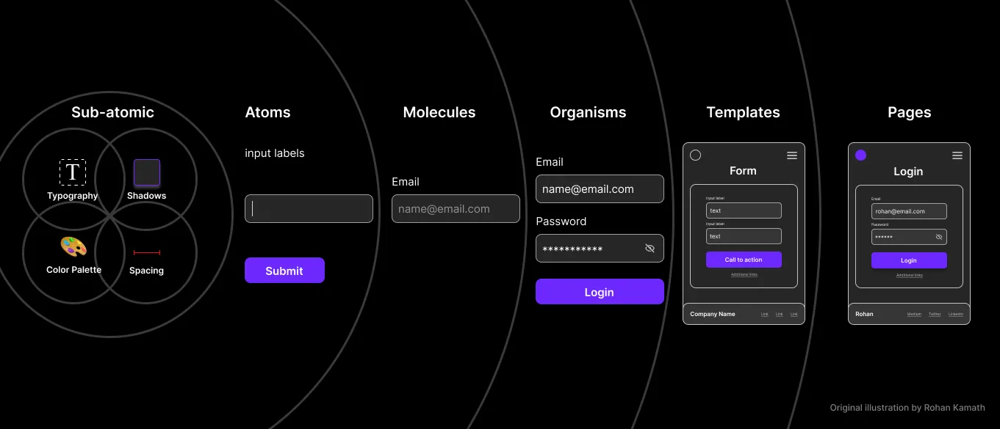

## Table of Contents

## はじめに

:::note{.message}
🎄 この記事は[Open UI Advent Calendar](https://adventar.org/calendars/10293)の 24 日目の記事です。
:::

[Part1](https://blog.sakupi01.com/dev/articles/2024-openui-advent-23)では、Brad の初期主張に基づき、GDS のコアメンタルをまとめました。

今回は、どうして Global Design System が Open UI で議論されるに至ったのか、具体的に Open UI でどのように進められているのか、そして今後どうなっていきそうかをお話しします。

※ 以下、GDS = Global Design System

## なぜ、Open UIでGlobal Design Systemを議論するのか。どう、議論するのか

Open UI は、Web プラットフォームの UI における Interoperability を実現するための**技術の標準化を検討する**ことに取り組む団体であり、その結果として標準化されたビルトインの UI コントロールによって、**世の中のデザインシステムに利益をもたらす**ことが目標の一つとされています。とはいえ、Open UI のコアメンバーには、プラットフォーム側の特性を持った人物が多く、フロントエンドやデザインの専門家が多いわけではありません。

> Today, component frameworks and design systems reinvent common web UI controls to give designers full control over their appearance and behavior. We hope to make it unnecessary to reinvent built-in UI controls, but for those who choose to do so, **we expect that these design systems will benefit from Open UI’s specifications and test suites**.
>
> 今日、コンポーネントフレームワークやDesign Systemは、デザイナーが外観と動作を完全に制御できるように、一般的なWeb UIコントロールを再発明しています。私たちは、ビルトインUIコントロールを再発明する必要がなくなることを期待しており、**Design Systemが、Open UIの仕様とテストスイートから利益を得ることを期待しています**。
>
> ー [Home | Open UI](https://open-ui.org/)

Brad が提唱する GDS は、HTML と組織レベルデザインシステムとの間に介在する「高度に抽象化された Design System」であり、Open UI の取り組みとして検討される価値が十分にありました。しかし、提案初期は、**GDSを実現する人物像とOpen UIに属する現メンバーの特徴のミスマッチの可能性が指摘**されていました。

> **I would also question whether this is the best forum for this.** To build a design system, global or otherwise, **you would need frontend developers and people deeply invested in UX, accessibility, documentation and frontend best-practices.** Do you need people with knowledge of browser internals and the web standardization process for such a task? Not so much.
>
> @Ollie Williams from #openui-design-system [comment](https://discord.com/channels/714891843556606052/1216793626290421814/1217601051767865546)
>
> ---
>
> aww, even if this is a difficult task, **I hope that OpenUI can be a place where browser developers and frontend professionals can get together and work it out together (whether that's through a web components library, new HTML elements or [my hope/prediction] a combination)**
>
> @littledan from #openui-design-system [comment](https://discord.com/channels/714891843556606052/1216793626290421814/1217651717538320428)

そこで、GDS に関する初めての Telecon では、GDS を Open UI で持つことの正当性に関して話し合われます。

- [最初のTelecon](https://github.com/openui/open-ui/issues/1017#issuecomment-1998149015)

この Telecon の結果を受け、Open UI は W3C の一部であり、アクセシビリティや国際化の専門家を巻き込む強みを持つため、GDS を進めるための適切なプラットフォームであるという合意が取れます。

> gregwhitworth: because we're part of the W3C we have the potential to pull in experts re accessibility and internationalisation
>
> masonf: I think Open UI is a great place to do it and has the right kind of people for it
>
> comment on [1998149015](https://github.com/openui/open-ui/issues/1017#issuecomment-1998149015)

その Next Action として、「Global Design System」を Open UI 内の新しいプロジェクトとして設け、その構成部品として「コンポーネントライブラリ」を作成することが提案されます。

- [comment](https://github.com/openui/open-ui/issues/1017#issuecomment-2109117089)

> RESOLVED: Create a Global Design System workstream in Open UI and do not start from zero with a component library(s) (TBD)
> ー [IRC](https://github.com/openui/open-ui/issues/1017#issuecomment-2115955452)

---

こうして、Brad 個人の提案から始まった GDS は、Open UI のプロジェクトとして確立されるに至ります。

以下は、Telecon での議論や、Greg のコメント・[記事](https://www.gwhitworth.com/posts/2024/my-thoughts-on-global-design-system/)をもとに、Open UI で進められる GDS の方針についてまとめたものです。

## Global Design System powered by Open UI

Open UI で GDS が進められていくことにより、[Part1](https://blog.sakupi01.com/dev/articles/2024-openui-advent-23)で示した GDS のメンタルモデルとの相乗効果が期待されます。

### Open UIが実現できなかった提案をGDS引き継ぎ、将来的な標準化に貢献する

Open UI はデザインシステムの基本的な構成要素（下図の Sub-Atomic, Atomic, Molecule にあたるレイヤー）をカバーするため、同様のレイヤーをカバーする GDS は、Open UI が既に行っている作業の延長として機能できます。

_Open UIとGDSの扱うレイヤーはマッチする （出典: [Atomic Design methodology for building design systems | by Rohan Kamath | Medium](https://blog.kamathrohan.com/atomic-design-methodology-for-building-design-systems-f912cf714f53)）_

これにより、過去に Open UI で議論された[Card](https://github.com/openui/open-ui/issues/151)や[Skelton](https://github.com/openui/open-ui/issues/139)などのコンポーネントは、自然と GDS の対象とすることができます。

この過程で、GDS は Open UI が実現しなかった提案を引き継ぎ、将来的な標準化に貢献する可能性もあります。

> Serve as an incubator for potential future HTML elements, attributes and APIs.
>
> ー [README.md openui/design-system](https://github.com/openui/design-system)

### 標準化プロセスをスキップすることによる、高速な検討と提供のイテレーション

Open UI は、提案が標準化され、UA に実装されることを最終目標としているため、提案の Ship までに多大なプロセスと時間を要します。
しかし、GDS はコンポーネントやコントロールの機能的および非機能的要件を定義し、**標準化プロセスやUAの実装とは独立した検討・実装を行います**。これにより、長い標準化のプロセスをスキップし、価値を素早く開発者に提供することが可能です。

> gregwhitworth: the majority of us in openui have been focused on landing them in browsers
>
> gregwhitworth: there are things in the select explainer that are specific to landing them in whatwg, but not about this is a foo component that anybody could implement
>
> gregwhitworth: the separate workstream would be focused on that
>
> commented on [2115955452](https://github.com/openui/open-ui/issues/1017#issuecomment-2115955452)

GDS を Opne UI の新しいプロジェクトとして設けることで、Open UI が提案・標準化の検討に携わったコンポーネントやコントロールが、開発者にとってより使いやすくなり、より多くのフィードバックを高速に受けるといった付加価値も期待できます。

### 適切な組織で検討された、堅牢で信頼できる柔軟なコンポーネントライブラリ

GDS の構成要素として、コンポーネントライブラリが挙げられ、現在、以下で検討が進んでいます。

- [Foundation for the Global Design System component library · Issue #1066 · openui/open-ui](https://github.com/openui/open-ui/issues/1066)

先に述べたように、GDS は標準化プロセスを介さないことから、その成果物は**標準ではありません**。Open UI は GDS のコンポーネントライブラリを**実装、提供、推奨**することを目指しています。

とはいえ、このコンポーネントライブラリは、**パフォーマンス、アクセシビリティ、拡張性、スタイル適用性、国際化という観点において、W3C Open UI CGに所属する専門家によって十分に検討が重ねられた成果物**となります。

> This work-stream within Open UI will provide a blue-print that defines the following:
>
> - Accessibility
> - Internationalization
> - Privacy
> - Security
> - User experience for different input modalities
> - Default base styling
> - Default events
> - Variations
>
> ー [Thoughts on a Global Design System](https://www.gwhitworth.com/posts/2024/my-thoughts-on-global-design-system/)

**[Open UI Component Certified Checklist](https://docs.google.com/document/d/1eTSxCWd3yRMxTCAs3a74NzQ6C9gikYQLZeVdCMODwOg/edit?tab=t.0#heading=h.jjvcvbvmo8v1)は、GDSコンポーネントライブラリの具体的な品質を図る指標として作成**されました。GDS の各コンポーネントは、このチェックリストに基づいた監査が行われて出荷されます。

W3C Open UI CG で然るべき検討がなされた GDS コンポーネントライブラリは、W3C の[著作権](https://www.w3.org/copyright/intellectual-rights/)に基づき、**オープンソース**として提供されることが期待されます。

:::note{.info}
ℹ️ GDS コンポーネントライブラリの原則

コンポーネントライブラリを具体的に進めていくプロセスは、原則的に以下に基づきます。

> 1. **Ships as web components** (This does not preclude Open UI from including a library that help facilitate abstractions, utility methods or polyfills)
> 2. **Meets [W3C Intellectual Rights](https://www.w3.org/copyright/intellectual-rights/)**
> 3. **Run as an Open Source solution** (This does NOT mean that there will not be consensus driven resolutions as key topics will be brought to the Open UI CG telecon for resolution but many of the capabilities should be able to land within a PR with asynchronous review.)
> 4. **Align implementations with Open UI global design system blueprints**
> 5. **Adopts Open UI primitives** as they become available for increased adoption and feedback
> 6. Has decent adoption and web developer/designer community support (monetary funding is a positive but not required)
>
> ー [Foundation for the Global Design System component library · Issue #1066 · openui/open-ui](https://github.com/openui/open-ui/issues/1066)
> :::

これまで Open UI が取り組んできたのは、あくまで「Web UI における標準化団体への推奨事項作成」であったのに対し、GDS のコンポーネントライブラリは、GDS での検討に基づいたコンポーネントを実際に実装し、開発者が独自のデザインシステムを構築する際の参考として機能することを目的としています。

よって、コンポーネントライブラリのコンポーネントが UA にビルトインで実装されることはありません。npm などの 3rd Party レジストリを通じて、開発者が利用できる形で提供されることが想定されています。

## Global Design Systemが切り拓く未来

世の中に存在する数多くのデザインシステムの共通点を抽出し、堅牢で、アクセシブルで、国際化されていて、プライバシーに配慮したデザインシステムとなることを目指す、Global Design System。

コンポーネントライブラリにおいては、あらゆるライブラリやフレームワークから使用可能な Web Components ベースのものが想定されており、GDS の取り組みが、Web Components の抱える[大量の提案](https://github.com/WICG/webcomponents/tree/gh-pages/proposals)や Web Components 自体の普及を推し進める原動力となり得ます。

また、GDS は[デザイントークンの提供](https://github.com/openui/design-system?tab=readme-ov-file#theming)も視野に入れているため、[Design Tokens Community Group](https://www.w3.org/community/design-tokens/)の、[Design Tokens Format Module](https://tr.designtokens.org/format/)の仕様策定に拍車がかかるかもしれません。

加えて、GDS からテストスイートを提供することも提案されており、任意のコンポーネントライブラリが、GDS の定義に準拠しているかどうかを判断できるようになる展望も示唆されています。

> Testing solution: Will enable any component library determine adherence to the blueprint's defined by Open UI (similar to web platform tests). This will allow component libraries to be implemented in other languages but leverage the research and resolutions provided by Open UI in a tangible way.
>
> ー [Thoughts on a Global Design System](https://www.gwhitworth.com/)
> まだまだ動き始めたばかりのプロジェクトですが、[来年の第3四半期までには複数のWeb Componentsを提供することを目指している](https://www.w3.org/2024/11/21-openui-minutes.html)ようです。

広範な Web の進化へ寄与する可能性を秘める Global Design System の動きに、今後も注目していきたいと思います。

---

それでは、また明日⛄

See you tomorrow!

### Appendix

- [A Global Design System | Brad Frost](https://bradfrost.com/blog/post/a-global-design-system/)
- [Thoughts on a Global Design System – Chris Coyier](https://chriscoyier.net/2024/02/05/thoughts-on-a-global-design-system/)
- [What’s Next for a Global Design System | Brad Frost](https://bradfrost.com/blog/post/whats-next-for-a-global-design-system/)
- [A design system, component library for the web? · Issue #1017 · openui/open-ui](https://github.com/openui/open-ui/issues/1017)
- [Thoughts on a Global Design System](https://www.gwhitworth.com/posts/2024/my-thoughts-on-global-design-system/)
- [927: Thoughts on a Global Design System](https://bkardell.com/blog/927.html)
- [Open UI Component Certified Checklist - Google ドキュメント](https://docs.google.com/document/d/1eTSxCWd3yRMxTCAs3a74NzQ6C9gikYQLZeVdCMODwOg/edit?tab=t.0#heading=h.jjvcvbvmo8v1)
- [Comparing design systems to find the best qualities | hidde.blog](https://hidde.blog/re-global-design-system/)
- [Nue 1.0 (Beta) - Nue](https://nuejs.org/blog/nue-1-beta/)
- [Foundation for the Global Design System component library · Issue #1066 · openui/open-ui](https://github.com/openui/open-ui/issues/1066)
- [openui/design-system](https://github.com/openui/design-system)
- [Introducing new HTML elements that are pay-for-what-you-use · Issue #4697 · whatwg/html](https://github.com/whatwg/html/issues/4697)
- [Design Tokens Format Module](https://tr.designtokens.org/format/)
- [Front-of-the-front-end and back-of-the-front-end web development | Brad Frost](https://bradfrost.com/blog/post/front-of-the-front-end-and-back-of-the-front-end-web-development/)
- [Let’s talk about web components | Brad Frost](https://bradfrost.com/blog/post/lets-talk-about-web-components/)
- [HTML is a Global Design System](https://designsystems.wtf/html-is-a-global-design-system/)
- [What's ‘normative’ in WCAG? | hidde.blog](https://hidde.blog/whats-normative-in-wcag/)
- [Definition of a "control"? · Issue #81 · openui/open-ui](https://github.com/openui/open-ui/issues/81)
- [601: Brad Frost on A Global Design System + Frostapalooza – ShopTalk](https://shoptalkshow.com/601/)
- [Comparing design systems to find the best qualities | hidde.blog](https://hidde.blog/re-global-design-system/)
