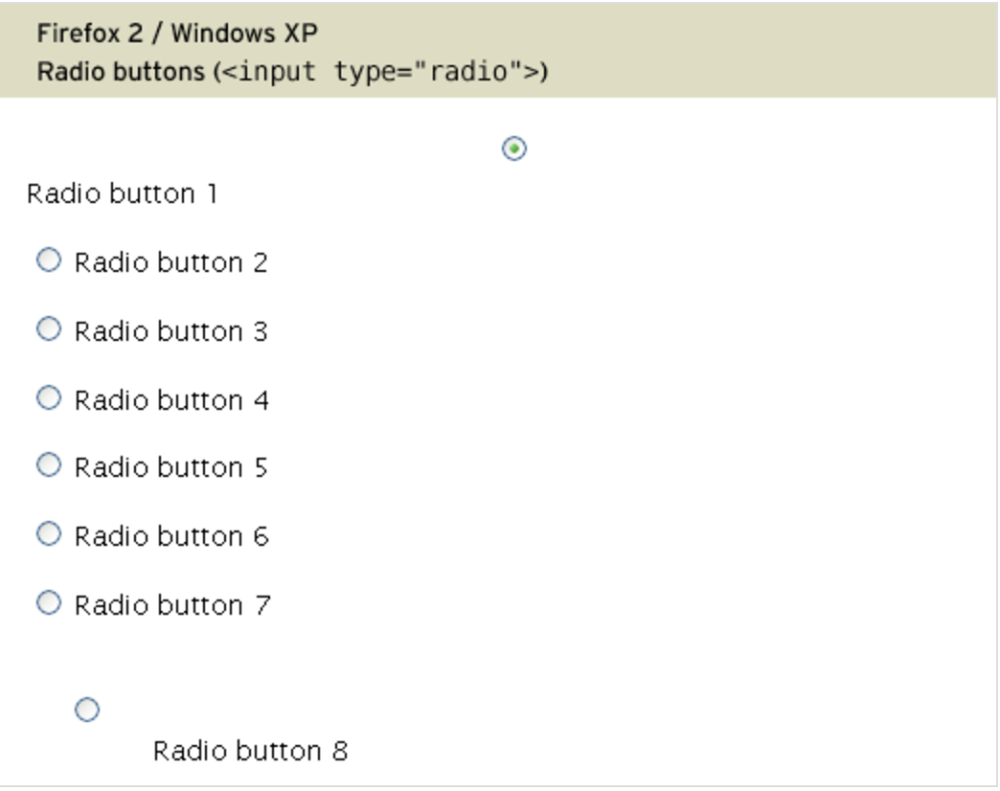
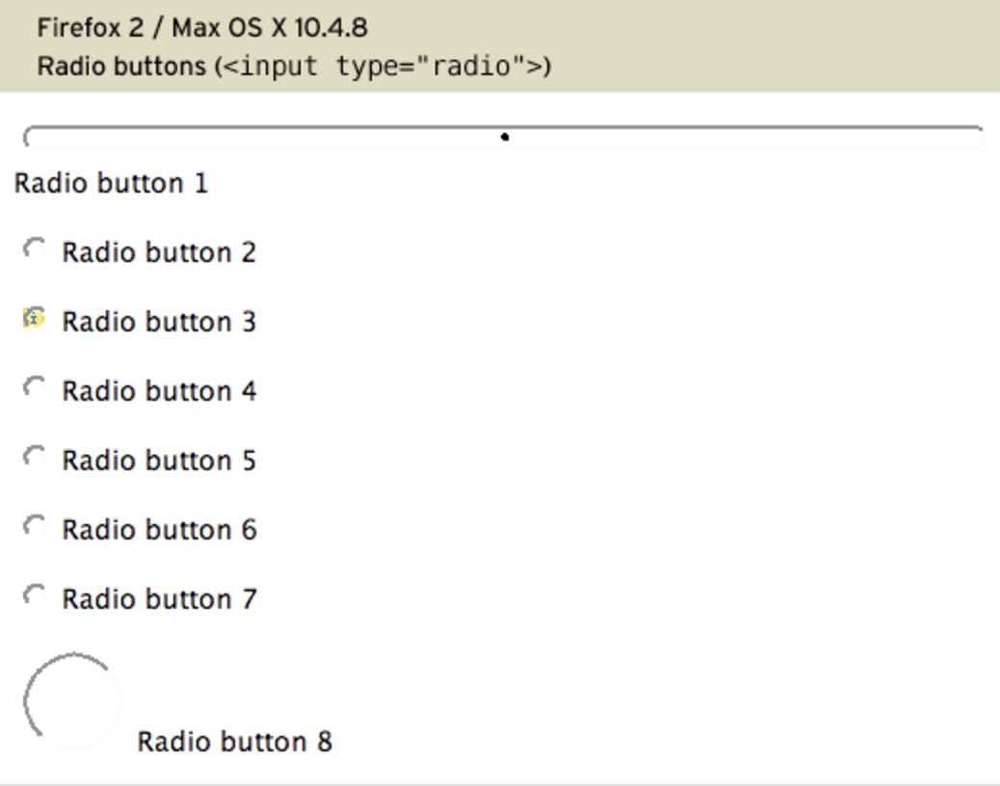

## Table of Contents

## はじめに

:::note{.message}
🎄 この記事は[Open UI Advent Calendar](https://adventar.org/calendars/10293)の 3 日目の記事です。
:::

今日から[Customizable Select Element](https://open-ui.org/components/customizableselect/)についてみていきます🧤

[Customizable Select Element](https://open-ui.org/components/customizableselect/)の仕様がどのような背景から検討され、何が可能となり、これからどのように利用されていくべきなのかをシリーズ形式で書いていきます。途中で寄り道したり、深入りしたりするかもしれませんが、その過程も楽しみつつ読んでいただければ幸いです。

※ 本当は[Open UI Working Mode](https://open-ui.org/working-mode/)のことを書こうと思っていたのですが、あまりにも機能していないのでやめました。

## Prologue: Customizable Select Element

`<select>`は、スタイル設定や機能の拡張に関しての制限が大きく、これまで多くの開発者を悩ませてきました。

現在、HTML の`<select>`や`<selectedoption>`要素、`::picker(select)`擬似要素などに関連する様々な仕様が策定され、プロトタイプが実装され始めています。

<https://developer.chrome.com/blog/rfc-customizable-select?hl=ja>

`<select>`とそれに付随する様々な新機能を活用することで、今まで実現が難しかった`<select>`という Form Control に対して、柔軟なスタイリングや機能追加が可能となります。

どうしてこれまで`<select>`のカスタマイズが難しかったのでしょうか？どのような議論の末に Customizable Select Element が追加されるのでしょうか？それによって私たちはどのような恩恵を受けることができるのでしょうか？

## HTML Form Controlの歴史

Form Control とは、`<input>`、`<button>`、`<select>`、`<option>`、`<textarea>`など、Web 上の Interactivity の基盤を提供する要素のことを指します。

1990 年代初頭に Tim Berners-Lee が WWW（WorldWideWeb）という最初の Web ブラウザをリリースした後、複数のブラウザが登場しました。
この当時の HTML は、非常にシンプルなマークアップ言語であり、リンクや画像、テキストのみを表示することができるものでした。


_出典：[Tim Berners-Lee: WorldWideWeb, the first Web client](https://www.w3.org/History/1994/WWW/Journals/CACM/screensnap2_24c.gif)_

その後、各ブラウザベンダーがブラウザに独自の HTML タグを実装し始めましたが、当時はまだ HTML に標準というものがなかったため、ブラウザ間で HTML タグの実装に差が生まれていきました。

### HTML 2.0

1995 年に HTML Working Group が設立され、HTML 標準の基礎となる[HTML 2.0](https://datatracker.ietf.org/doc/html/rfc1866)が策定されました。

HTML 2.0 には、Form Control に関する仕様も盛り込まれており、具体的には次のような要素が追加されました。

- [RFC 1866 - Hypertext Markup Language - 2.0 - Forms](https://datatracker.ietf.org/doc/html/rfc1866#section-8)

RFC 1866 に目を通すと、HTML2.0 の Form Control の仕様では、次のことが定義されているとわかります。

- どのようなデータが入力できるのか
- データをどう使ってどのようなアクションを実行するのか

逆に、それ以外のことについては言及されておらず、`<input>`の仕様だけみても、HTML2.0 と現在の HTML Living Standard で定義されている内容の差は歴然です。

- [RFC 1866 - Hypertext Markup Language - 2.0 - Input Field: INPUT](https://datatracker.ietf.org/doc/html/rfc1866#section-8.1.2)
- [HTML Standard - The input element](https://html.spec.whatwg.org/multipage/input.html)

## CSSの登場とForm Controlにおけるスタイリングの制限

### CSS

HTML2.0 が仕様策定された 1995 年当時、今日の CSS は確立していませんでした。1996 年の CSS のリリース後も、'90 年代に登場したすべてのブラウザが CSS をサポートしていたわけではありませんでした。

- [Cascading Style Sheets, level 1](https://www.w3.org/TR/REC-CSS1-961217)

### Form Controlにおけるスタイリングの制限

ブラウザが CSS をサポートしない中、Form Control のスタイルとレンダリングは OS に依存していました。

Web が普及して、ブラウザが CSS をサポートしてからも、当時の開発者が CSS を駆使して Form Control の一貫した見た目を実現できたわけではありません。

[Roger Johansson](https://x.com/rogerjohansson)が、CSS を使用して Form Control のスタイルをブラウザーやプラットフォーム間でまったく同じにすることは不可能であることを示す実験をしており、同じ CSS でもブラウザや OS 間で異なる見た目になることがあることがわかります。

※ 次の HTML に対して、次の CSS を適用した場合、ブラウザや OS によって見た目が異なることがわかる

```html title="html"
<input type="radio" name="radiogroup" id="radio-1" />
<label for="radio-1">Radio button 1</label>
```

```css title="css"
#el01 {
  width: 100%;
} /* Width */
#el02 {
  /* Text and background colour, blue on light gray */
  color: #00f;
  background-color: #ddd;
}
#el03 {
  background: url(/i/icon-info.gif) no-repeat 100% 50%;
} /* Background image */
#el04 {
  border-width: 6px;
} /* Border width */
#el05 {
  border: 2px dotted #00f;
} /* Border width, style and colour */
#el06 {
  border: none;
} /* No border */
#el07 {
  padding: 1em;
} /* Increase padding */
#el08 {
  /* Change width and height */
  width: 4em;
  height: 4em;
}
```

e.g. 同じブラウザでも OS 間で見た目が違う

| FireFox2/ Windows XP                            | FireFox2 Mac OS X 10.4.8                        |
| ----------------------------------------------- | ----------------------------------------------- |
|  |  |

_出典:<https://www.456bereastreet.com/lab/styling-form-controls-revisited/radio-button/>_

だからと言って、ブラウザや OS 間で見た目を統一できるようにしようという動きが W3C 側にあったかというと、それに関しては消極的だったようです。見慣れた Form Control の外観を変えることに関しての懸念があり、Form Control のスタイリングに関しては、[CSS2.1の仕様](https://www.w3.org/TR/CSS21/conform.html#q3.0)においても次のように述べられています。

> CSS 2.1 does not define which properties apply to form controls and frames, or how CSS can be used to style them. User agents may apply CSS properties to these elements. Authors are recommended to treat such support as experimental. A future level of CSS may specify this further. - [UA Conformance](https://www.w3.org/TR/CSS21/conform.html#q3.0), CSS 2.1 Specification, W3C

つまり、この時点までは、Form Control のスタイルは CSS から制御することができず、ブラウザや OS に依存していました。

---

それでは、また明日⛄

See you tomorrow!

### Appendix

- [Tim Berners-Lee: WorldWideWeb, the first Web client](https://www.w3.org/People/Berners-Lee/WorldWideWeb.html)
- [第1回 Webの歴史 - Tatsuya Hagino](https://web.sfc.keio.ac.jp/~hagino/dis23/01.pdf)
- [Hypertext Markup Language - 2.0 - Table of Contents](https://www.w3.org/MarkUp/html-spec/html-spec_toc.html)
- [ウェブフォームへのスタイル設定 - ウェブ開発を学ぶ | MDN](https://developer.mozilla.org/ja/docs/Learn/Forms/Styling_web_forms)
- [Styling form controls with CSS, revisited | 456 Berea Street](https://www.456bereastreet.com/archive/200701/styling_form_controls_with_css_revisited/)
- [20 Years of CSS](https://www.w3.org/Style/CSS20/)
- [CSS Properties Index · Jens Oliver Meiert](https://meiert.com/en/indices/css-properties/)
