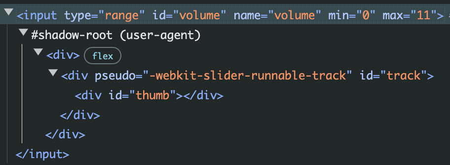
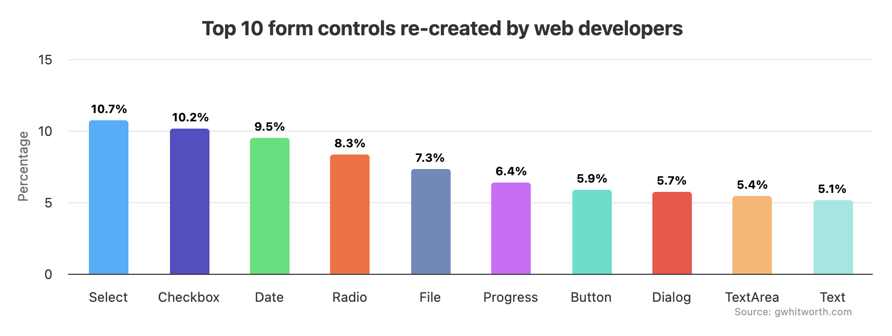
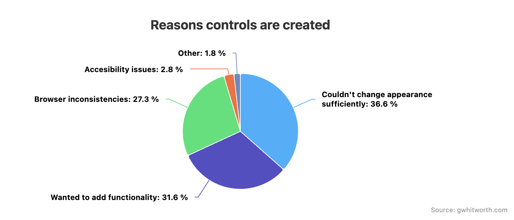
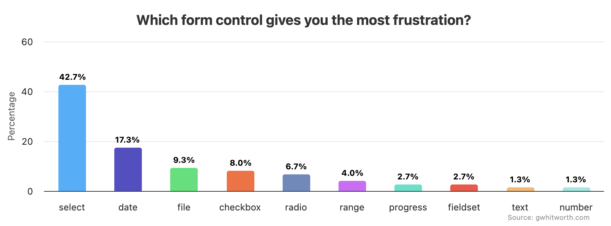

## Table of Contents

## はじめに

:::note{.message}
🎄 この記事は[Open UI Advent Calendar](https://adventar.org/calendars/10293)の 5 日目の記事です。
:::

[Customizable Select Element Ep.2](https://blog.sakupi01.com/dev/articles/2024-openui-advent-4)では、ブラウザエンジンの発展と、Web 標準の台頭、より柔軟なスタイリングを可能にした歴史を見ていきました。

### ほとんどのForm Controlのスタイリングが可能に

OS への技術的な依存が解消されて、標準に則ったブラウザレンダリングエンジンによる描画がおこなわれるようになったことに加え、CSS3 の登場により、ほとんどの Form Control に対してスタイリングが可能になりました。

例えば、次の要素ではほとんどのスタイリングが可能です。

- `<form>`
- `<fieldset>`、`<legend>`
- `<input>`（type = text, url, email）`<input type="search">` 以外
- `<textarea>`
- ボタン（`<input>` と `<button>` の両方とも）
- `<label>`
- `<output>`

しかし、レンダリングの OS への依存が解消されてからも、`<select>`などの「入力時になんらかの特殊要素を必要とするもの」に関しては、スタイリングが困難なままでした。

### CustomizableでないForm Controlたち

Customizable でない Form Control が存在する根幹の原因は、1995 年に HTML2.0 に定義された Form Control の仕様まで遡ります。

- [RFC 1866 - Hypertext Markup Language - 2.0  - Forms](https://datatracker.ietf.org/doc/html/rfc1866#section-8)

[Ep.1](https://blog.sakupi01.com/dev/articles/2024-openui-advent-3)でも見たように、当初の仕様では、HTML ドキュメントにデータを入力する方法、そのデータを使用してアクションを実行する方法のみが定義され、Form Control の具体的な構築方法は各ブラウザに委ねられていました。

標準化されていなければ、クロスブラウザの互換性を保つことができないため、Form Control をスタイリング可能にする改善を加えることも現実的ではなくなります。

例えば、`<input>`の type 属性に”range”を指定するとスライダーを表示させることができますが、ブラウザ・OS 間で見た目が一貫しておらず、かといってスタイリングしたり内部の DOM を制御したりすることはできません。

```html
<input type="range" id="volume" name="volume" min="0" max="11"></input>
```


*スライダー内部はShadow DOMとしてレンダリングされるため、外部から変更できない*

- [CSS property compatibility table for form controls - Learn web development | MDN](https://developer.mozilla.org/en-US/docs/Learn/Forms/Property_compatibility_table_for_form_controls#range)

初期の仕様策定の段階で、具体的な実装方法が詰められることがなく、各ブラウザで実装が進められてきた結果、ネイティブの見た目の一貫性・スタイル可能性と拡張性が著しく欠けたままの Form Control は多く存在しています。

かといって、ネイティブ Form Control を使用せずにイチから実装しようとすると、アクセシビリティやパフォーマンス、セキュリティなど、非常に多くの考慮事項が発生します。
もし仮に、完璧な ARIA ロールを持ち合わせ、パフォーマンスもセキュリティも問題ないようなカスタム Form Control を実装できたとしても、長期的にその独自 Form Control が動作するかというと、それは保証されていません。

独自 Form Control を構築する上で必要だった実装の一部が、いつの日か Web プラットフォームから廃止されてしまうリスクも考えられます。

例えば以下は、代替手段が出現したり、後方互換性の維持のために一時的に存続しているものの、いつ Web 標準から削除されるかわからない技術といえます：

- XHR が Fetch API へ移行される
- `-webkit-`や`-moz-`のようなベンダープレフィックス付きの CSS プロパティが、標準プロパティに置き換えられる
- [`<font>`](https://developer.mozilla.org/en-US/docs/Web/HTML/Element/font), [`<center>`](https://developer.mozilla.org/en-US/docs/Web/HTML/Element/center)などの HTML 要素が CSS プロパティ（`font`・`align`・Flex Box・）によって代替される
- [3rd Party Cookie の Deprecation](https://blog.jxck.io/entries/2023-12-20/deprecation.html)

それに加えて、アクセシビリティの要件もアップデートされ続けます。独自で実装したものを中長期的に運用していくコストは、非常に高いと言えるでしょう。

## Form Controlの抱える問題を解決する動き

Open UI の Chair である Greg Whitworth は Form Control について、「何が扱いにくいのか」、「それはどうしてなのか」を調べるため、1,400 人の回答者を対象にサーベイを行いました。

<https://www.gwhitworth.com/posts/2019/form-controls-components/>

- どの Form Control を独自で実装したか
  1. `<select>`
  2. `<input type="checkbox">`
  3. `<input type="date">`



- どうして独自で実装したか
  1. スタイリングできなかったから
  2. 機能拡張したかったから
  3. クロスブラウザでの一貫性がなかったから



- どの Form Control が最も扱いにくいか
  1. `<select>`
  2. `<input type="date">`
  3. `<input type="file">`



このサーベイの結果から、`<select>`の扱いにくさは特に顕著だとわかります。独自実装している理由としては、スタイリングや機能拡張、クロスブラウザでの一貫性の無さが挙げられています。

この問題に立ち向かうべく、Open UI に提案された新しい仕様が、Customizable Select Element だったのです。

***

それでは、また明日⛄

See you tomorrow!

### Appendix

- [Styling web forms - Learn web development | MDN](https://developer.mozilla.org/en-US/docs/Learn/Forms/Styling_web_forms)
- [Styling form controls with CSS, revisited | 456 Berea Street](https://www.456bereastreet.com/archive/200701/styling_form_controls_with_css_revisited/)
- [20 Years of CSS](https://www.w3.org/Style/CSS20/)
- [CSS Properties Index · Jens Oliver Meiert](https://meiert.com/en/indices/css-properties/)
