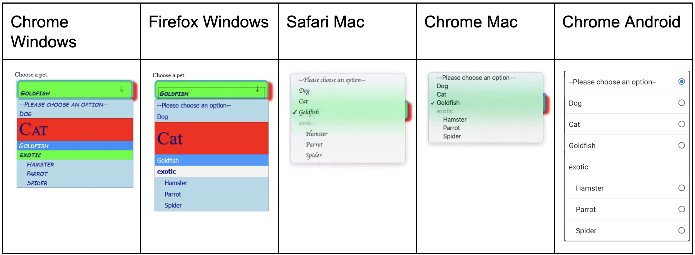

## Table of Contents

## 🎄はじめに

:::note{.message}
🎄 この記事は[OpenUI Advent Calendar](https://adventar.org/calendars/10293)の 6 日目の記事です。
:::

[Customizable Select Element Ep.3](https://blog.sakupi01.com/dev/articles/2024-openui-advent-5)では、Form Control が抱える課題と、Customizable Select Element 提案の契機となったサーベイを紹介しました。

※以降、CSE = Customizable Select Element とします。

## Open UIでの初期提案

筆者の観測範囲では、Open UI 内で CSE に関する最初の提案は以下によって行われました。

- [Thoughts on an incremental approach to `<select>`/`<input>` + `<datalist>` · Issue #3 · openui/open-ui](https://github.com/openui/open-ui/issues/3)

### `<select>`のスタイルしにくさ

まず、現状の問題点の整理をしておきます。

`<select>`と一口に言っても、いろいろな種類の`<select>`（またはその部品）があって、具体的には次のように分類できます。

- `<select>`: 単一選択の button
- `<select multiple>`: 複数選択の button
- `<select size="n">`: n 個の選択肢が表示される button
- `<option>`: `<select>`のドロップダウン
  - `<optgroup>`: `<option>`をグループ化する要素
  - `<datalist>`: `<option>`をグループ化する要素。`<input type="text" list="datalist-id">`で使用して Combobox を作るのによく使われる
- `<input type="text" list="datalist-id">`: `<datalist>`を組み合わせた Combobox のテキストフィールド

基本的に上記のような`<select>`（またはその部品）は、標準的なレンダリング方法が確立していないことから、クロスブラウザ・プラットフォームで見た目が一貫していなかったり、スタイルが難しかったりします。

例えば、`<select>`の button に関しては、具体的に次のような制約があります：

1. そもそもネイティブの見た目が一貫していない問題

各ブラウザは、`<select>`を独自の方法でレンダリングするため、`<select>`をそのまま使用すると、ブラウザごとに見た目が異なる

1. スタイリングのされ方が一貫していない問題

ブラウザ間でのスタイルの差分を埋めようとしたり、角丸や枠線つきのアレンジされた`<select>`を実現しようとしたりすると、ブラウザごとにスタイルのされ方が異なる

3. モバイルでの特殊な制約

iOS Safari では、`<select>`のフォントサイズが 16px 未満だとページがズームインされてしまうという、デバイス固有の特殊な制約がある

4. 十分な多言語対応がされていない問題

ネイティブの`<select>`は、右から左に書く言語（アラビア語、ヘブライ語など）をサポートしているが、独自のスタイリングをする場合は追加で考慮が必要

などの制約があり、これらを解決しようとクロスブラウザ互換でカスタマイズされた見た目の`<select>`の button を作ろうとなると、次のような CSS が必要になります。

- [デモ](https://filamentgroup.github.io/select-css/demo/)
  - [select-css/src/select-css.css at master · filamentgroup/select-css](https://github.com/filamentgroup/select-css/blob/master/src/select-css.css)

これらが`<select>`の button 部分のスタイリングに関する制約です。

これはまだいい方で、`<select multiple>`や、`<option>`などのドロップダウン要素となると、あるプラットフォームではスタイルされるが、別のプラットフォームではスタイルされないといった現象も発生します。

*出典: Stylability of Form Controls*

これに関しては、[Mason Freed](https://x.com/mfreed777)が詳細をまとめてくれているので、参考にしてみてください。

- [Stylability of Form Controls - Google ドキュメント](https://docs.google.com/document/d/1Xa_k_MKfw4QnqHjjOKUW0HWGvgHmZeo7YWWCxTjKWBI/edit?tab=t.0#heading=h.97wudakpmohg)

### Domenic DenicolaによるCSEの初期提案

これらの詳細な調査結果を受けて、Google の[Domenic](https://x.com/domenic)は、`<select>`のスタイリングに関する問題を解決するためのインクリメンタルなアプローチを切り出しました。

- [Thoughts on an incremental approach to `<select>`/`<input>` + `<datalist>` · Issue #3 · openui/open-ui](https://github.com/openui/open-ui/issues/3)

彼の主張をまとめると、次のようになります。

#### 1. CSSプロパティの拡張

1. `<select>`/`<option>`/`<optgroup>`に適用可能な CSS プロパティのリストを作成
2. padding, margin, background-image など、より広範囲のスタイリングを可能にする
3. クロスブラウザでの一貫性を確保するため、これらのスタイルのブラウザ間での合意と標準化を目指す

#### 2. `<datalist>`と`<select>`の統一

1. `<input>` + `<datalist>`（Combobox）の見た目と機能を`<select>`に近づける
2. 開発者が両者を「わずかな違いのある同じ Form Control」として認識できるようにする

#### 3. 小さく絞って拡張していく

1. `::dropdown-button`や`::marker`のような、ドロップダウンの矢印を指定できる疑似要素の追加
2. `<select>`のプレースホルダーを`placeholder=""`などとして、スタイル可能なより柔軟なサポートを追加
3. ドロップダウンが「open な状態」を示す疑似クラスの追加
4. モバイルとデスクトップで、ポップアップ表示かドロップダウン表示か区別する擬似クラス的な仕組みを追加

#### 4. UXの改善

1. 主にタイピング検索における UX 改善を提案している
   1. 現状の`<input>` + `<datalist>`でも、確かにタイピング検索ができるが、`<datalist>`が必ずしも絞り込みのデータソースではない。`<input>`には`<datalist>`中の値以外も入力できる
2. `<input type=text list=somedatalist constrained>`のような、制約付きの Combobox を提案

#### 新規要素との比較検討

基本的には既存の`<select>`や`<input>` + `<datalist>`を拡張していくアプローチを主張していますが、`<superselect>`という完全な新規要素作成との比較検討もしています。

##### インクリメンタルアプローチの利点

- 段階的な改善が可能
- 既存のコードとの互換性を維持できる

##### 新規要素アプローチの利点

- 現状酷似したパターンを提供する`<select>`や`<input>` + `<datalist>`に囚われることなく、`<superselect>`という単一の要素だけ学習すれば良くなる
- より高度な機能の導入が容易
  - サーバー駆動の自動補完やオプション内での任意の HTML 表示など

***

Greg や Mason による一連の調査が、Domenic による`<select>`の問題提起を導き、これを契機に Open UI で本格的に`<select>`のリサーチがなされていくことになります。

- [Can we please style the `<select>` control?!](https://www.gwhitworth.com/posts/2019/can-we-please-style-select/)
- [Add initial curated page and research for `<select>` by wdencker · Pull Request #19 · openui/open-ui](https://github.com/openui/open-ui/pull/19)

***

それでは、また明日⛄

See you tomorrow!

### Appendix

- [Initial thoughts on standardizing form controls](https://www.gwhitworth.com/posts/2019/form-controls-components/)
- [`<datalist>`: The HTML Data List element - HTML: HyperText Markup Language | MDN](https://developer.mozilla.org/en-US/docs/Web/HTML/Element/datalist)
