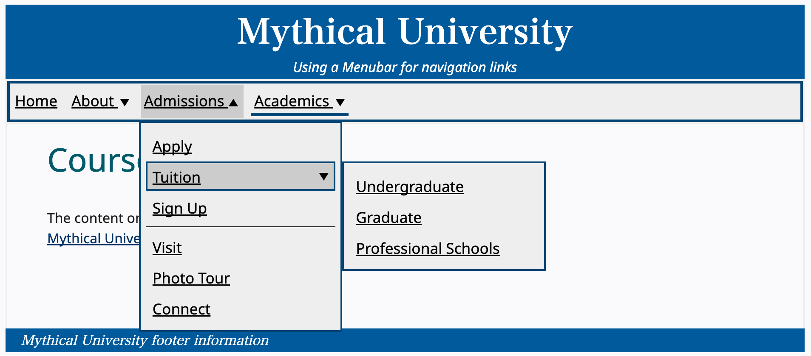
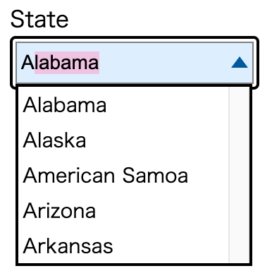
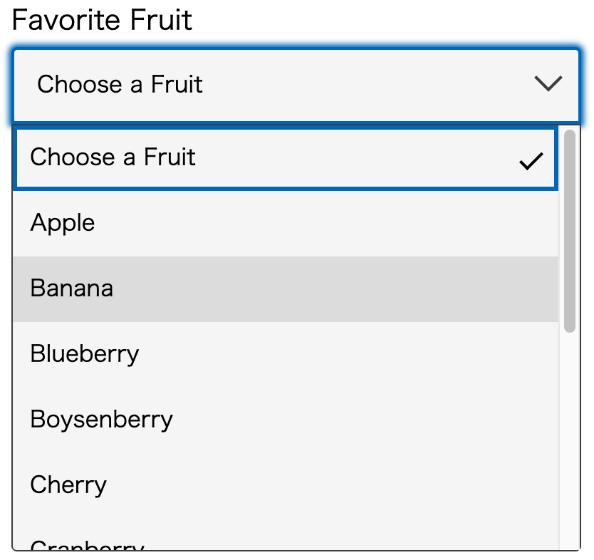
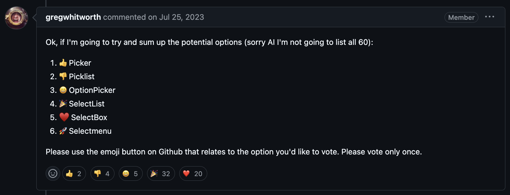

## Table of Contents

## はじめに

:::note{.message}
🎄 この記事は[Open UI Advent Calendar](https://adventar.org/calendars/10293)の 8 日目の記事です。
:::

[Customizable Select Element Ep.5](https://blog.sakupi01.com/dev/articles/2024-openui-advent-7)では、CSE の Explainer が MS 内で考案され、`<selectmenu>`として Intent to Prototype が出たところまでお話ししました。

## `<selectmenu>`のその後: `<selectlist>`へ

`<selectmenu>`は 2023 年 5 月の Google I/O で発表され、Chrome Canary の Experimental Web Platform Features フラグを有効にすることで、試すことができました。

- [What's new in CSS and UI: I/O 2023 Edition  |  Blog  |  Chrome for Developers](https://developer.chrome.com/blog/whats-new-css-ui-2023#selectmenu)
- [selectmenu prototype | Open UI](https://open-ui.org/prototypes/selectmenu/)

この時点で、[Intent to Prototype](https://groups.google.com/a/chromium.org/g/blink-dev/c/9TcfjaOs5zg/m/WAiv6WpUAAAJ)が出されてから実に 3 年の月日が経っていました。

`<selectmenu>`には、Popover API と CSS Anchor Positioning という新しい Web の機能が使用されるなど、技術的な挑戦が仕様に組み込まれており、当時は注目を集めました。
（※ 一旦命名の変遷にのみ着目しているため、その間に起こった技術的な出来事は後回しにします）

---

しかし、そんな`<selectmenu>`が改名の提案を受けたのは、その発表からわずか 1 ヶ月後の 6 月半ばのことでした。

- [Rename `selectmenu` to `selectbox` · Issue #773 · openui/open-ui](https://github.com/openui/open-ui/issues/773)

この提案の初期主張は次の通りです。

- 「Menu」は通常、サブメニューやアクションなどの追加機能を持つ、選択可能なオプションのリストを指すことが多い
  - 「Menu」という用語はポップアップインタラクション全般を指すこともある
- しかし、「selectmenu」は Combobox パターンに近く、これはドロップダウンリストと入力フィールドを組み合わせた UI である
- 「Menu」と「Combobox」の認識差異による誤解が、アクセシブルかつ一貫性のある UI を設計する際に問題となりかねない
- `<selectmenu>`を`<selectbox>`に改名することで、より Combobox パターンに近しい選択ツールであることを明確にできる

確かに、[APG](https://www.w3.org/WAI/ARIA/apg/)にも Menu パターンは次のように定義されており、何らかのアクションを伴う要素のリストを提供するものであることが一般的であるとわかります。

> A menu is a widget that offers a list of choices to the user, **such as a set of actions or functions**. Menu widgets behave like native operating system menus, such as the menus that pull down from the menubars commonly found at the top of many desktop application windows.
> ー [Menu and Menubar Pattern | APG | WAI | W3C](https://www.w3.org/WAI/ARIA/apg/patterns/menubar/)

_画面遷移のアクションを伴うMenuの例 - 出典: APG | WAI | W3C [Navigation Menubar Example](https://www.w3.org/WAI/ARIA/apg/patterns/menubar/examples/menubar-navigation/)_

:::note{.memo}
📝 [APG (ARIA Authoring Practices Guide)](https://www.w3.org/WAI/ARIA/apg/)

アクセシブルなウェブ体験を作成するための、 Accessible Rich Internet Application (ARIA) 仕様書で定義されたセマンティクスのガイド。一般的なデザインパターンとウィジェットにアクセシビリティセマンティクスを適用する方法を記述し、デザインパターンと機能例を提供しています。
（出典：[ウェブ制作者のためのアクセシビリティ情報 - アクセシビリティ | MDN](https://developer.mozilla.org/ja/docs/Web/Accessibility/Information_for_Web_authors#%E3%82%AC%E3%82%A4%E3%83%89%E3%83%A9%E3%82%A4%E3%83%B3%E3%81%A8%E8%A6%8F%E5%AE%9A)）
:::

一方の Combobox パターンは、値の選択肢がリストなってポップアップで表現さると定義されています。また、入力フィールドとリストを組み合わせた UI であったり、選択のみの UI であったりしても Combobox と見なされます。

> A combobox is an input widget that has an associated popup. **The popup enables users to choose a value for the input from a collection**. The popup may be a listbox, grid, tree, or dialog.
>
> ...
>
> The combobox pattern supports several optional behaviors. The one that most shapes interaction is text input. **Some comboboxes allow users to type and edit text in the combobox and others do not. If a combobox does not support text input, it is referred to as select-only, meaning the only way users can set its value is by selecting a value in the popup.**
> ー [Combobox Pattern | APG | WAI | W3C](https://www.w3.org/WAI/ARIA/apg/patterns/combobox/)

| 入力フィールドのあるCombobox                                                  | 選択のみ可能なCombobox                                                   |
| ----------------------------------------------------------------------------- | ------------------------------------------------------------------------ |
|  |  |

_Comboboxの例 - 出典: APG | WAI | W3C [Editable Combobox With List Autocomplete Example](Chttps://www.w3.org/WAI/ARIA/apg/patterns/combobox/examples/combobox-autocomplete-list/), [Select-Only Combobox Example](https://www.w3.org/WAI/ARIA/apg/patterns/combobox/examples/combobox-select-only/)_

APG を踏まえると、「`<selectmenu>`は Menu パターンではない」という初期主張には一定納得でき、Open UI のメンバーの多くもこの提案に興味を示すことになります。

しかし、「`<selectmenu>`は Combobox パターンに近いので`<selectbox>`にすべき」という主張に関してはどうでしょうか。
Combobox の APG によると、Combobox は「Listbox と input を組み合わせた UI パターン」、または「select そのもの」を指すと言えます。

この定義に基づくと、Combobox は「Listbox を input の入力値によって変更した結果得られる UI である」ということができ、`<selectbox>`という命名をしてしまうと、Listbox や Combobox など、他の「box」との混同を招く可能性があると指摘されています。
しかしながら、Combobox は「select そのもの」を指すこともできるため、`<selectbox>`には一定の正当性があるという意見もありました。

`<selectbox>`の提案に関する指摘の最終的な結論としては、将来的に Menu パターンに利用されることも考えて、とりあえず`<selectmenu>`はやめておこうとなりました。

---

具体的な命名に関しては、Telecon で話し合われた結果、次の 6 つが提案されました。

- `<selectmenu>`
- `<selectbox>`
- `<selectlist>`
- `<choose>`
- `<picker>`
- `<picklist>`

この後のコメントは議論というか、気に入った名前と好きな理由をお互い自由に述べていってて（[AIに聞いた結果を共有してる人](https://github.com/openui/open-ui/issues/773#issuecomment-1646927265)もいて）、なんだかはちゃめちゃしていました。

埒が開かないので、絵文字投票が行われ、その時点で多くの票が`<selectlist>`と`<selectbox>`に集まりました。

_絵文字投票 - 参考: <https://github.com/openui/open-ui/issues/773#issuecomment-1649976535>_

その上でもう一度[Telecon](https://github.com/openui/open-ui/issues/773#issuecomment-1654169425)で話し合われ、その時点で Google DevRel の[Una Kravets](https://x.com/una)は次のように主張しました。

> As I mentioned in the conversation last week, I think SelectList is more descriptive than SelectBox because:
>
> - It's not always a "box" in shape
> - It's a container for a list of options
> - Possible confusion with ListBox if we propose that as a separate element
>
> By the definition we've discussed thus far, these components cannot contain other interactive components, so they are always a list of options.
> <https://github.com/openui/open-ui/issues/773#issuecomment-1654179956>

そして、多くの票を集めた`<selectlist>`と`<selectbox>`に関する[Telecon](https://github.com/openui/open-ui/issues/773#issuecomment-1664421419)がもう一度行われ、次の内容が話されました。

- `<selectlist>`の方が「リスト」という意味でより明示的であり、「box」は形状を示すだけで適切に機能を説明できない
- `<listbox>`という要素が将来的に登場する可能性が否めないため、`<selectbox>`と`<listbox>`が共存すると混乱を招く可能性がある
- 非英語ネイティブスピーカーにとっても「list」の方が理解しやすい

この結果を以って、最終的に`<selectlist>`が採用されることになりました。

---

本当は`<select>`にいくところまで書きたかったんですが、十分な長さになってしまったので、次回に持ち越しということで。

それでは、また明日⛄

See you tomorrow!

### Appendix

- [Advanced Form Control Styling With Selectmenu And Anchoring API — Smashing Magazine](https://www.smashingmagazine.com/2023/06/advanced-form-control-styling-selectmenu-anchoring-api/)
