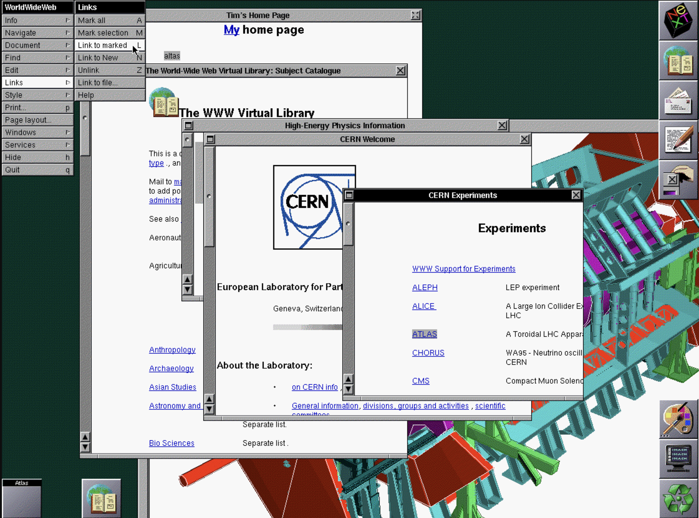
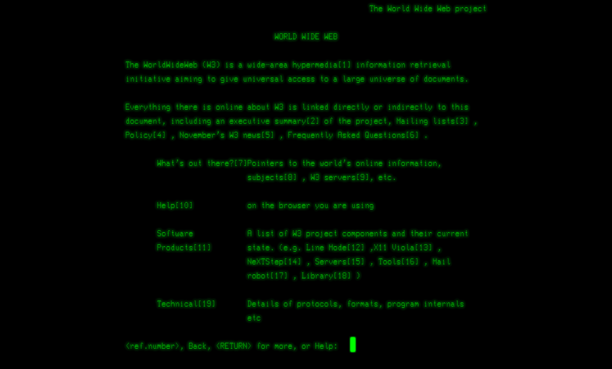
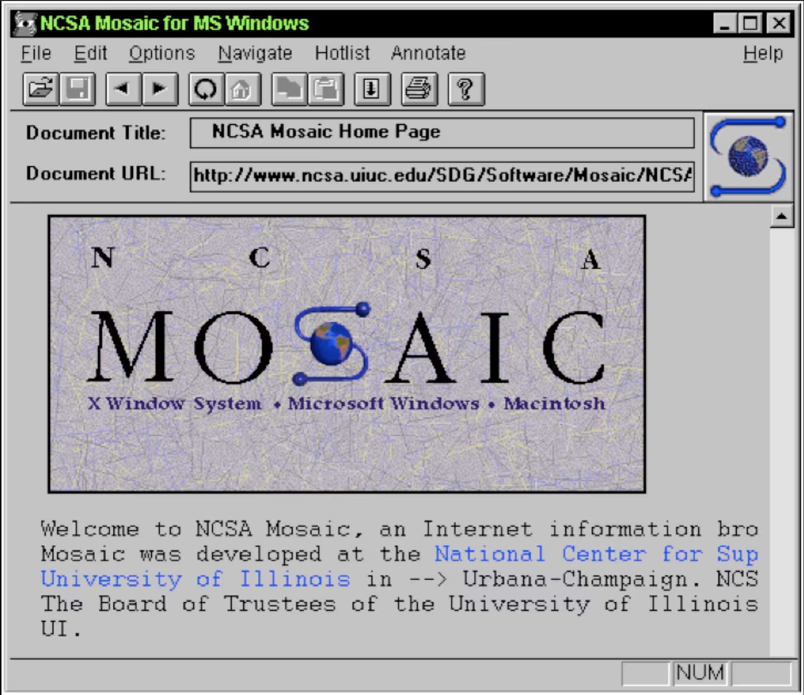

## Table of Contents

## はじめに

:::note{.message}
🎨 この記事は CSS Advent Calendar の 1 日目の記事です。
:::

## The Web was not stylable

1989年に CERN で Tim Berners-Lee が World Wide Web というコンセプトを提唱し、1990年に彼自身のコンピュータである NeXT で動作する最初の Web ブラウザ、 WorldWideWeb（later, Nexus） を開発しました。

_出典：[Tim Berners-Lee: WorldWideWeb, the first Web client](https://www.w3.org/History/1994/WWW/Journals/CACM/screensnap2_24c.gif)_

:::note{.memo}

CERN 2019 WorldWideWeb Rebuild

WorldWideWeb ブラウザの生誕 30 年を記念して、現代のブラウザで WorldWideWeb を再現するプロジェクトがあります。
自分の Web サイトを WorldWideWeb ブラウザで表示してみると面白いかもしれません。

- [CERN 2019 WorldWideWeb Rebuild](https://worldwideweb30.com/)
- [About this project | Restoring the first website](https://first-website.web.cern.ch/about-project.html)

:::

WWW は、CERN に散らばっていた論文を、個別にメールで問い合わせたりなどすることなく、効率的に共有したいという Tim の思いから生まれました。その実現のため、研究者が好きなときに、誰の許可も得ることなく、自由に情報にアクセスできる仕組みを考える必要がありました。

当時のドキュメントツールとしては、SGML、LaTex、Microsoft Word などがありました。しかし、多くは商用だったり記法が複雑だったりで、Tim が目指す「誰でも簡単に情報を共有できる」という理想には適していませんでした。そこで Tim は、シンプルで万人に受け入れられるような記法と、それを共有するための仕組みを同時に考案する必要がありました。

その結果として Tim が提案したのが、**HTTP**（HyperText Transfer Protocol）と、HTTP で共有する用のテキストフォーマットとしての **HTML**（HyperText Markup Language）です。

混乱を避けるために予め述べておきますが、この時点の HTML はあくまで Tim が考案したもので、標準化団体などにより国際標準として認められたものではありません。

Tim が提案した、世界で最初の HTML の提案は、1989年に書かれた以下であるとされています。

- [The original proposal of the WWW, HTMLized](https://www.w3.org/History/1989/proposal.html)

:::note{.memo}

Anchor Element

HTML は、当時最も国際的に認められていたテキストマークアップを構造化する方法だった SGML（Standard Generalized Markup Language）をベースにしたとされています。
例えば、`<TITLE>` `</TITLE>` のような構造化は SGML から直接影響を受けたものです。Timの HTML では、 SGML 要素の、P（Paragraph）、H1からH6（Headings）、OL（Ordered List）、UL（Unordered List）、LI（List）などが含まれています。

そんな中、唯一 Tim 自身が考案しなければならなかった要素があります。リンクです。
ドキュメント同士をリンクする HREF 属性を持つ **AnchorElement というアイデア**は、他でもなく、Tim 自身が WorldWideWeb のために考案したものです。

- [Anchors - Tags used in HTML](https://info.cern.ch/hypertext/WWW/MarkUp/Tags.html#:~:text=NOT%20CURRENTLY%20USED-,Anchors,-The%20format%20of)

:::

ブラウザと、ドキュメントフォーマットとしての HTML と、それを共有するためのプロトコルである HTTP が揃ったことで、World Wide Web の基礎が誕生しました。

しかし、このブラウザは Tim の NeXT コンピュータだけで動作するものかつ、CERN の内部ネットワークで実験的に公開されていたものでした。Tim は Nicola Pellow を雇用し、2 つ目のブラウザである [line-mode browser](https://www.w3.org/LineMode/Browser.html) を開発します。これで、NeXT 以外のインターネットに接続されているコンピュータから CERN のサーバに接続して、HTML ドキュメントを表示することが可能になりました。line-mode browser は Web で最初にパブリックからのアクセスを可能にしたブラウザです。

:::note{.memo}
世界初の Web ページ

ちなみに、この line-mode browser を介して公開された世界初の Web ページ以下だと言われています。30 年たった今でももちろん閲覧可能です。

- [The World Wide Web project](https://info.cern.ch/hypertext/WWW/TheProject.html)

:::

_line-mode browser_

とはいえ、line-mode browser はグラフィックないしは複雑なスタイルを持たないブラウザでした。当時のスペックのコンピュータやあらゆる OS で上で動作させ、Web ブラウザを広く使ってもらうことを目標として作られた、高互換のシンプルな CLI ベースのブラウザのため、当然のことでしょう。

しかし、Web ブラウザがあらゆる OS で利用可能になったこと自体が、これから先の Web 技術を発展させる上でも非常に重要なターニングポイントだったのかもしれません。これが、W3C の Mission Statement, Design Principle の思想が歴史上初めて実現した瞬間と言っても過言ではないと思います。

> Making the web work, for **everyone**.
>
> ー [Our mission](https://www.w3.org/mission/) | W3C

> The Web for **All**. Web of trust. Web on **everything**.
>
> ー [Our design principles](https://www.w3.org/mission/#principles) | W3C

line-mode browser の登場によって、「The Web for All.」の思想が、「開発者からユーザにとって」のみならず、「開発者から開発者にとって」も実現されていき、それが Web を取り巻くエコシステムを発展させる根源となっていきます。

---

米国 NCSA（National Center for Supercomputing Applications）で働いていた研究者 が Tim のブラウザに興味を示し、米国のイリノイからスイスのジュネーブにある CERN のコンピュータに接続、CERN の Web ブラウザのコピーをダウンロードすることに成功します。
そして、ブラウザの重要性に気づいて NCSA が開発し始めたのが **Mosaic ブラウザ** です。

当時はまだ、ブラウザをコントロールする方法は Tim の考案した HTML しかありませんでした。
そして、HTML には「各ダグや属性の機能」をまとめた程度の[非常にシンプルな定義](https://info.cern.ch/hypertext/WWW/MarkUp/Tags.html)しかありませんでした。つまり、ブラウザがどう `<H1>` を表示するか、どう `<A>` を表示するかは、ブラウザがどう実装するかに委ねられていました。

## The `` tag Proposal

スタイルに関しての議論がまだ出てきていない頃、Mosaic の開発チームに所属していた Marc Andreessen が唐突に **`` を提案**します。

> I'd like to propose a new, optional HTML tag:
>
> IMG
>
> Required argument is SRC="url".
>
> ー [WWW-Talk Jan-Mar 1993: proposed new tag: IMG](http://1997.webhistory.org/www.lists/www-talk.1993q1/0182.html)

今後の展開からすると、この提案は Mosaic によるやや恣意的で軽率なものであったようにも捉えられるものでした。
しかし、結局のところ Web はオープンなものであり、理論上はあらゆる人からの貢献や提案が歓迎されます。Web は当初からこうして発展してきたことが顕著に現れている提案のひとつです。

そしてこの頃から、**HTML にスタイルを適用する、Web で見た目をコントロールする需要**が叫ばれるようになります。

## Request for Comments: STYLESHEETS

1993年に www-talk メーリングリストで Robert Raisch が提案した以下の RFC が、Web におけるスタイルに関する最初の提案です。

> This RFC proposes **an easily parsable format to deliver stylistic information** along with Web documents.
>
> - [WWW-Talk Apr-Jun 1993: Request for Comments: STYLESHEETS](http://1997.webhistory.org/www.lists/www-talk.1993q2/0445.html)

:::note{.memo}
www-talk mailing list

1993年から1996年くらいまでアクティブだった、World Wide Web の開発者やユーザーが参加するメーリングリストです。Web の初期の歴史において重要な役割を果たしたものとして、今回の考古学でも非常にお世話になります。
:::

この RFC に関する詳細は Day2 で触れるとして、こういったドキュメントのスタイルに関する提案がありつつも、Marc や当時の Mosaic チームにとっての最優先事項は、事業インパクトの強い `` の実装でした。

そもそも、Web は Tim が CERN で研究論文を効率的に共有するために生まれたものです。研究論文の共有という原点に立ち返れば、必要なのは構造化された情報の伝達であり、「見た目の美しさ」は二の次という考え方は理解できます。Marc は Robert の StyleSheet RFC に[反応](http://1997.webhistory.org/www.lists/www-talk.1993q4/0266.html)を示したり、外部からの根強い需要を認識しつつも、ドキュメントをスタイリングすることについて否定的な意見を持っていたようでした。

> HTML is the kind of thing that can only be loved by a computer scientist.
> Yes, it expresses the underlying structure of a document, but **documents are more than just structured text databases; they have visual impact**.
>
> **HTML totally eliminates any visual creativity that a document’s designer might have.**
>
> Roy Smith
>
> ー [Roy Smith WWW-Talk Jul-Sep 1993: Re: Adobe's PDF](http://1997.webhistory.org/www.lists/www-talk.1993q3/0238.html)
>
> > only be loved by a computer scientist.
> >
> > Yup. Marc
>
> ー [Marc Andreessen WWW-Talk Jul-Sep 1993: Re: Adobe's PDF](http://1997.webhistory.org/www.lists/www-talk.1993q3/0239.html)

> In fact, it has been a constant source of delight for me over the past year to get to continually tell hordes (literally) of people who want to – strap yourselves in, here it comes – control what their documents look like in ways that would be trivial in TeX, Microsoft Word, and every other common text processing environment: **“Sorry, you’re screwed.”**
>
> Ah well, live and learn. Or not.
>
> ー [Marc Andreessen WWW-Talk Jan-Mar 1994: Indented `<MENU>`s](http://1997.webhistory.org/www.lists/www-talk.1994q1/0648.html)

## The birth of Web Design?

`` は、Mosaic が実装を急いだため、www-talk の議論半ばの段階で Mosaic に Ship されます。この当時は標準化団体やこれといった HTML の仕様も存在しなかったため、こうした独自仕様が実装されました。

Mosaic が **``** を実装したことにより、これまでテキストベースだった Web に初めてグラフィックが導入されることになりました。

_IMG Tag の実装された Mosaic_

任意のツールで装飾したドキュメントを、画像として正確 Web に表示できるようになったという展開は、Web で装飾することを渇望していた当時の人々にとって非常に心踊る出来事だったに違いありません。

## The `` `
` tag &c

その後の HTML にスタイルする手法が全く生まれなかったのかというと、実は HTML を HTML で装飾する手法が編み出されました。

Marc は Mosaic の NCSA を去り、Jim Clark と共に Netscape Communications を設立します。Netscape Communications が開発した Netscape Navigator は、後に Firefox の前身となるブラウザです。

その過程で、さらなる進化と差別化を求め、他の Web のコミュニティと事前に議論することなく、独自 HTML タグを好き勝手に発明し、Netscape Navigator に実装し始めました。そこで生まれたのが、`` や、`
` に代表される、「スタイルするための HTML タグ」です。
結果として、Netscape Navigator は、大成功を収め、市場で [90%以上のシェア](https://en.wikipedia.org/wiki/Netscape#:~:text=Its%20Netscape%20web%20browser%20was,than%20one%20percent%20in%202006.)を誇るブラウザとなりました。
単なるテキストドキュメントだった HTML が装飾可能になったことは、Web を一般に普及させる上で大きな役割を果たしたといえるでしょう。

とはいえ、Netscape （Marc Andreessen）は、装飾のためだけに言語を増やすことを嫌いました。
当初は StyleSheet の代わりに、スタイルを定義する HTML タグを定義する道が選ばれたのです。

> Then why don't you just implement one of the many style sheet proposals that are on the table. This would pretty much solve the problem if done correctly.
> So then I get to tell people, **"Well, you get to learn this language to write your document, and then you get to learn that language for actually making your document look like you want it to." Oh, they'll love that.**
>
> ー Marc Andreessen [WWW-Talk Jan-Mar 1994: Re: Indented `<MENU>`s](http://1997.webhistory.org/www.lists/www-talk.1994q1/0683.html)

---

Mosaic には `` が存在し、その直後にはこれといった装飾手法がなかったこと、`` や `
` などが Netscape に実装されたとしても柔軟な装飾が難しかったことから、
**「Web で装飾が必要なもの全部画像にして `` で表示しよう！」** という考えが些かの間に広まってしまう。

そこに危機感を覚えた人々が「Web でドキュメントをスタイルする方法」を続々と提案し始めました。
その中の一人が Håkon Wium Lie であり、彼が提案したものが、いうまでもなく **CHSS**（Cascading HTML Style Sheets）でした。

## Appendix

- [The birth of the Web | CERN](https://www.home.cern/science/computing/birth-web)
- [The World Wide Web project](https://info.cern.ch/hypertext/WWW/TheProject.html)
  - [People who have contributed to the World Wide Web project](https://www.w3.org/People.html)
  - [WWW Project History](https://info.cern.ch/hypertext/WWW/History.html)
- [1. Introduction to the World Wide Web Chapter 1 - Dave Raggett](https://www.w3.org/People/Raggett/book4/ch01.html)
- [2 - A history of HTML Chapter 2 - Dave Raggett](https://www.w3.org/People/Raggett/book4/ch02.html)
- [Line Mode Browser](https://en.wikipedia.org/wiki/Line_Mode_Browser)
- [The Origin of the IMG Tag - The History of the Web](https://thehistoryoftheweb.com/the-origin-of-the-img-tag/)
- [The Languages Which Almost Became CSS](https://blog.cloudflare.com/the-languages-which-almost-became-css/)
- [Vision for W3C](https://www.w3.org/TR/w3c-vision/#vision-web)
- [Tim Berners-Lee: WorldWideWeb, the first Web client](https://www.w3.org/People/Berners-Lee/WorldWideWeb.html)

---

<advent-calendar-2025 />
