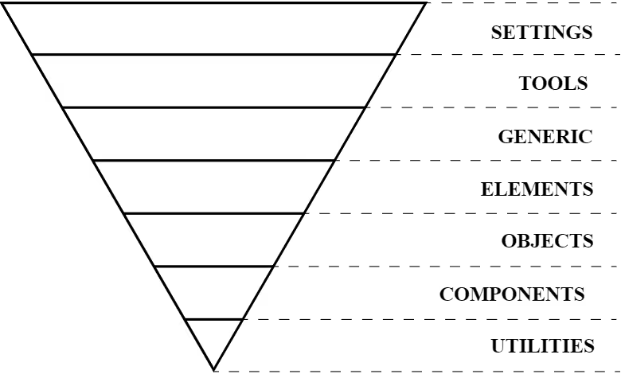

## Table of Contents

## はじめに

:::note{.message}
🌏 この記事は CSS Advent Calendar の 14 日目の記事です。
:::

[前回の記事](https://blog.sakupi01.com/dev/articles/2025-css-advent-13)では、npm エコシステムの広がりによって、
CSS プリプロセッサや PostCSS といったツールが普及し、CSS の開発体験に変化が現れた様子を見てきました。

一方で、Web サイトの複雑化とともに大規模な CSS をいかに管理するかという課題が顕在化してきました。

BEM を考案した Yandex社は、[2006年ごろから HTML/CSS 分離の模索](https://en.bem.info/methodology/history/#the-introduction-of-blocks)を始め、さらに 2008年頃からは、Natalie Downe の [CSS Systems](https://blog.natbat.net/post/46614243624/css-systems) や Nicole Sullivan の [OOCSS](https://github.com/stubbornella/oocss/wiki) が提唱されます。
こうして、2000年後半は、「デザインをどうシステマティックに扱うか」や「CSS アーキテクチャ」に繋がるさまざまな方法論が登場し始めました。

それぞれが後の「コンポーネント志向」や CSS 設計、デザインシステムという方法論につながる思想を含んでいるため、ここで一度、初期の CSS 設計論を整理しておきます。

## The Problem to Large-Scale CSS

Web サイトが複雑化するにつれて CSS ファイルが肥大化し、管理が困難になる状況が露呈し始めました。
以下に示すような CSS を書いていると、規模が大きくなるにつれ、さまざまな問題が発生することは想像に易いです。

- **詳細度のバトル**: ID セレクタやネストの深さでスタイルの上書くことによる詳細度バトル
- **グローバルでのクラス名の無秩序さ**: クラス名に秩序がないことによるグローバルでの命名衝突リスク
- **再利用性の欠如**: 使い回しが未考慮な、特定の HTML 構造に依存したスタイル
- **予測不可能性**: どこでどのスタイルが適用されるか把握が困難

```css
/* 無秩序にネストされたセレクタ */
#header .nav ul li a.active {
  color: red;
  font-weight: bold;
}

#sidebar .widget h3 {
  font-size: 18px;
  border-bottom: 1px solid #ccc;
}

/* どこかで詳細度バトルが発生... */
#content .article #sidebar .widget h3 {
  font-size: 16px !important;
}
```

Web サイトの大規模化に伴い、コードの大規模化が進む中、とってつたけたようなセレクタがあちこちに散らばるといった問題が発生していました。
本来ならそのスタイルに優先順位や秩序が設けられ、スタイルが要素に閉じていれば解決するであろう諸問題ですが、それができない「扱いづらさ」が露見していました。

これに対応するための具体的なアプローチとして、発端となったのは Nicole Sullivan の OOCSS (Object-Oriented CSS) でした。

## Express Scopes and States

### OOCSS - Object-Oriented CSS

2008年、Nicole Sullivan は [OOCSS](https://github.com/stubbornella/oocss/wiki) という「オブジェクト指向の考え方を CSS に適用した設計モデル」を提案しました。

CSS を「オブジェクト」として捉え、「**再利用可能な部品として設計**」し、 Class セレクタを用いて「構造とスタイル」・「コンテナとコンテンツ」の「関心の分離」を行うものです。
OOCSS は以下２つの基本原則から成り立っています。

- Principle 1: Separate structure and skin: 繰り返し使われる視覚的特徴（background, border, gradation ...）を「Skin」として定義し、異なるコンテナ（OOCSS では Module）間で適用できるようにしています。
- Principle 2: Separate container and content: DOM 構造に依存したスタイルを避け、コンポーネントがどこに置かれても同じスタイルを適用できるようにします。ネストしたセレクタを使用せず、コンポーネントに対してセマンティックな Class 名を作成します。異なる DOM 構造を持っていても、全体に一貫したスタイルを適用できるようにするための原則です。

```css
/* Module - Container - Structure */
.bd {
  flex: 1;
}

.mod {
  display: flex;
  align-items: flex-start;
}

.inner {
  margin-right: 10px;
}

/* Skin */
.featured {
  border: 2px solid gold;
  background: #fffacd;
}
```

位置・レイアウト・大きさなどの構造系のプロパティと、色・装飾などの見た目に関するプロパティを、同じクラス内に記述しないようにする命名規則だと言えます。

### BEM - Component-Based Naming

同じく2000年代後半、ロシアの Yandex 社は [Block, Element, Modifier (BEM)](https://en.bem.info/methodology/) という命名規則を提案しました。

- [Lego 2.0. Birth of BEM - History / Methodology / BEM](https://en.bem.info/methodology/history/#lego-20-birth-of-bem)

```css
/* Block - Independent component */
.search-form {
  padding: 20px;
  background: #f5f5f5;
}

/* Element - Part of Block */

.search-form__button {
  background: blue;
  color: white;
}

/* Modifier - Variation */
.search-form--dark {
  background: #333;
}

.search-form__button--disabled {
  opacity: 0.5;
  cursor: not-allowed;
}
```

`block__element--modifier` というシンプルな命名規則は、以下に示すメリットを明確に提供したため、広く受け入れられていたのではないでしょうか。

- **名前空間の明確化**: どのスタイルブロックに属するのか一目瞭然
- **低い詳細度**: すべてクラスセレクタで済むため詳細度が一定
- **予測可能性**: HTML を見ただけで適用されるスタイルが推測可能

```html
<article class="article-card article-card--featured">
  <header class="article-card__header">
    <h2 class="article-card__title">CSS アーキテクチャの重要性</h2>
    <p class="article-card__meta">2025年8月14日</p>
  </header>
  <div class="article-card__body">
    <p class="article-card__excerpt">大規模な CSS を管理するための方法論...</p>
  </div>
  <footer class="article-card__footer">
    <a href="#" class="article-card__link article-card__link--primary">
      続きを読む
    </a>
  </footer>
</article>
```

詳細度を低く保つとともに、BEM はコンポーネントベースの「セマンティックな命名規則」を提供します。
つまり、HTML の**コンテンツの性質**や構造に基づいて、CSS の命名規則を定義しているというのが、単に構造と見た目で Class 名を分離する OOCSS との差です。

興味深いことに、HTML Standard でも「Class 名はコンテンツの性質を説明するのが望ましい」と推奨されています。これは BEM のアプローチと一致する考え方です。

> There are no additional restrictions on the tokens authors can use in the class attribute,
> but**authors are encouraged to use values that describe the nature of the content**,
> **rather than values that describe the desired presentation of the content**.
>
> ー [HTML Standard](https://html.spec.whatwg.org/multipage/dom.html#classes)

### Semantic CSS?

これらの方法論では、低い詳細度に命名規則を与えて構造化することで「関心の分離」を行なっています。
「関心の分離」つまり、「HTML にはコンテンツや構造についての知識のみを含めるべきで、スタイルの定義はすべて CSS に任せよう」という考え方が根底に存在します。

OOCSS は構造系セレクタと見た目を表現するセレクタで分離する発想のためまだしも、BEM のような「セマンティックな命名」、つまり 「HTML がどういった**コンテンツの性質**を表現しているか」に基づいた命名をしていると、特定のコンテンツに依存した名前空間を定義することになります。

例えば、`.box` や `.media-object` といった「見た目ベースのクラス」であれば、ニュース/製品情報/ユーザープロフィールなど「同じ見た目が必要なあらゆる場所」で使い回せるものの、
`.news` という「セマンティックなクラス」はニュース記事という「特定のコンテンツ」でしか使えません。

```html
<!-- Content-based naming -->
<div class="news">
  <h2 class="news-title">最新ニュース</h2>
</div>

<!-- Visual-based naming -->
<div class="box">
  <h2 class="box-title">最新ニュース</h2>
</div>
```

つまり、BEM の「関心の分離」では、構造やコンテンツの性質がスタイルに依存していないだけで、**スタイルはコンテンツの性質やマークアップ構造に依存した命名規則**を持っている --
要は、**構造やコンテンツの性質とスタイルを双方向から完全に分離しよう**と主張したのが、 Nicolas Gallagher
[About HTML semantics and front-end architecture](https://nicolasgallagher.com/about-html-semantics-front-end-architecture/) です。

特定の構造やコンテンツに依存しない「高度に汎化された Class 名」を使うことで、**デザインの幅に一定の制限を設けながら**、CSS の記述量の大幅な削減を可能にするというアイディアの提唱でした。

これは、のちに「高度に汎化された Class 名」の極地として登場する、 Tailwind CSS に代表されるユーティリティファースト CSS の考え方に影響を与えるものとなります。

- [CSS Utility Classes and "Separation of Concerns"](https://adamwathan.me/css-utility-classes-and-separation-of-concerns/)

## Organize CSS into a Logical Structure

### SMACSS - Introducing CSS Categories

2011年に Jonathan Snook が発表した [Scalable and Modular Architecture for CSS (SMACSS)](https://smacss.com/) は、スタイルシート全体の設計についての方法論を提示するものでした。

SMACSS では CSS を base, layout, modules, state という 5つのカテゴリに分類します。

- Base： Reset と要素のデフォルトスタイル
- Layout：サイト全体にわたる要素の配置や、グリッドなどの汎用的なレイアウト utils
- Modules：再利用可能なビジュアル要素
- State：JavaScript経由でオン/オフを切り替え可能なスタイリング
- Theme：Layout や Modules のバリエーション用のスタイル

Modules (コンポーネントと呼んでいるものに相当) が CSS Rules の大部分を構成しているため、Modules を抽象的なテンプレートに細分化することもあります。

SMACSS がもたらしたものとして重要なのが、CSS の役割を明確にし、「どこに何を書くべきかという**カテゴライズの方法論**」を導入したことです。

### ITCSS - Scalable and Maintainable CSS Categories

2014年に Harry Roberts が提案した [Inverted Triangle CSS (ITCSS)](https://www.xfive.co/blog/itcss-scalable-maintainable-css-architecture) は、CSS を「逆三角形」の層として、詳細度のレイヤーを分けてカテゴライズする手法です。


_Inverted Triangle CSS_

```css
/* 1. Settings - font, colors, variables */
--primary-color: #333;

/* 2. Tools - globally used mixins and functions */
@mixin clearfix() { ... }

/* 3. Generic - **Reset and/or Normalize** CSS - This is the first layer which generates actual CSS */
* { box-sizing: border-box; }

/* 4. Elements - Styling for bare **HTML elements** */
h1 { font-size: 2em; }

/* 5. Objects - class-based selectors which define undecorated design **patterns** */
.o-media { display: flex; }

/* 6. Components - specific UI **components** */
.c-card { border: 1px solid #ccc; }

/* 7. Utilities - helper classes with ability to override anything */
.u-text-center { text-align: center !important; }
```

```css
/* Organize layers to subfolders */

@import "settings";
@import "tools";
@import "generic";
@import "elements";
@import "objects";
@import "components";
@import "utilities";
```

ITCSS で特徴的な点は、**CSS の詳細度を用いて、優先度が自動的に上から下へ増加していくように設計されている**ことでしょう。
ITCSS が、カスケード（特に詳細度アルゴリズム）の特性を活かしながら、詳細度の管理をより予測可能なものにしたことは、当時の標準技術で、CSS に "レイヤー" という構造化をもたらしました。

## CSS Architecture - How to express Layers, Scopes, and States

ここまでで、OOCSS、BEM、SMACSS、ITCSS とそれらの設計思想について解説してきました。

Philip Walton が [CSS Architecture](https://philipwalton.com/articles/css-architecture/) で示すように、これらの CSS アーキテクチャは共通して以下に示す原則に基づいています。

1. **予測可能性**: どのスタイルがどこに適用されるか明確に
2. **再利用性**: 一度書いたスタイルを様々な場所で使い回せる
3. **保守性**: 変更の影響範囲を限定的に
4. **スケーラビリティ**: 大規模なプロジェクトでも破綻しない

---

こうしてみると、2015年頃までに確立されたこれらの設計思想は、その後の 「CSS アーキテクチャ」や「デザインシステム」に影響を与える要素を含んでいることがわかります。

例えば、「再利用可能なスタイルを作る」という考え方は、「コンポーネント志向」につながる考え方です。

それを実現する BEM などの命名規則は、後に CSS Modules などのツールによって自動化される部分も出てきますが、「名前空間によって構造を作る」という点で「スコープ」の考え方につながるものとなってきます。

命名における関心の分離の解釈にも、粒度の差が生まれていました。
BEM や SMACSS はコンポーネントという「セマンティクスを含んだ単位」で名前空間を分離します。
しかし、OOCSS や Nicolas Gallagher の考え方は、、構造やコンテンツの性質とスタイルを完全に分離し、「見た目のみの単位」でしか名前空間を持ちません。
後の Utility-First CSS (Tailwind CSS など) やデザイントークンにも接続される、「関心の分離」の思想の根源がここに接続されてくるでしょう。

また、SMACSS や ITCSS に見られた「スタイルのカテゴライズ」は、詳細度を用いた「レイヤー」という構造化を提示し、カスケードの特性を活かした優先度制御の可能性を示しています。

こうした「CSS アーキテクチャ」、または「デザインをシステマティックに扱う方法論」は、Web デザインを「予測可能」「再利用可能」「保守的」「スケーラブル」にする進化を後押しする基盤となっていきます。

## Appendix

- [Home · stubbornella/oocss Wiki](https://github.com/stubbornella/oocss/wiki)
- [VimeoJina Bolton | CSS Workflow | Fronteers 2010](https://vimeo.com/15982903)
- [CSS Systems for writing maintainable CSS | Natalie Downe](https://blog.natbat.net/post/46614243624/css-systems)
- [Practical, maintainable CSS | Natalie Downe](https://blog.natbat.net/post/46613977728/practical-maintainable-css)
- [Adactio: Journal—Pattern primer](https://adactio.com/journal/5028)
- [Home - Scalable and Modular Architecture for CSS](https://smacss.com/)
- [BEM](https://en.bem.info/)
  - [History / Methodology / BEM](https://en.bem.info/methodology/history/#layout-with-independent-blocks)
  - [Methodology / BEM](https://en.bem.info/methodology/)
- [About HTML semantics and front-end architecture – Notes by Nicolas Gallagher](https://nicolasgallagher.com/about-html-semantics-front-end-architecture/)
- [CSS Architecture — Philip Walton](https://philipwalton.com/articles/css-architecture/)
- [ITCSS: Scalable and Maintainable CSS Architecture - Insights - xfive](https://www.xfive.co/blog/itcss-scalable-maintainable-css-architecture)
- [BEMIT: Taking the BEM Naming Convention a Step Further – CSS Wizardry](https://csswizardry.com/2015/08/bemit-taking-the-bem-naming-convention-a-step-further/)
- [MindBEMding – getting your head ’round BEM syntax – CSS Wizardry](https://csswizardry.com/2013/01/mindbemding-getting-your-head-round-bem-syntax/)
- [The media object saves hundreds of lines of code – Nicole Sullivan](https://www.stubbornella.org/2010/06/25/the-media-object-saves-hundreds-of-lines-of-code/)
- [Scope donuts – Nicole Sullivan](https://www.stubbornella.org/2011/10/08/scope-donuts/)
- [Side Effects in CSS — Philip Walton](https://philipwalton.com/articles/side-effects-in-css/)

---

<advent-calendar-2025 />
