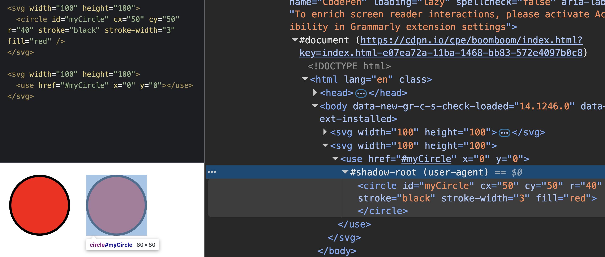
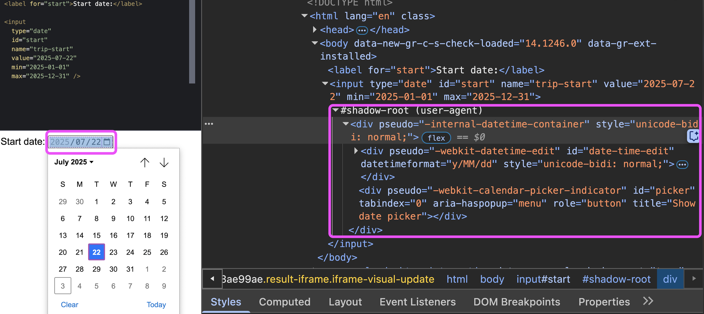
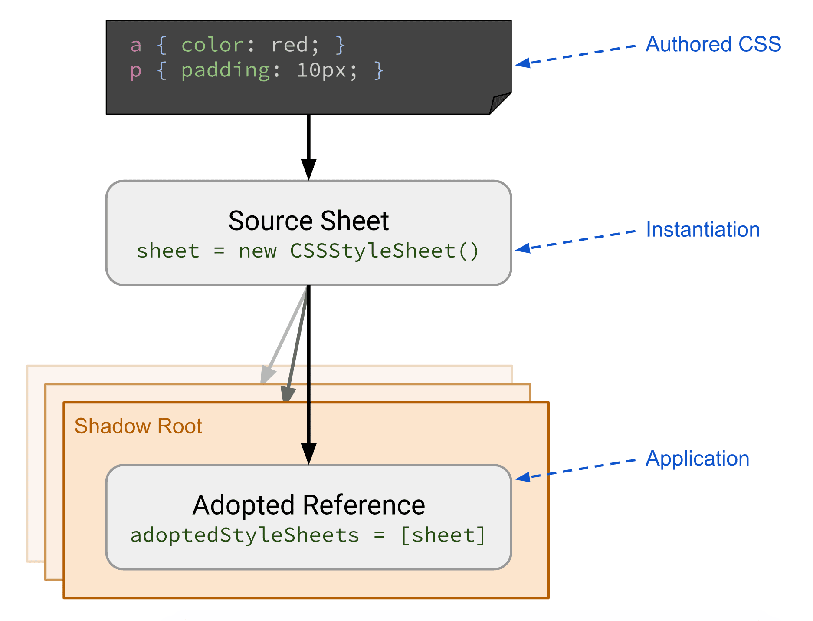

## Table of Contents

## はじめに

:::note{.message}
🌏 この記事は CSS Advent Calendar の 16 日目の記事です。
:::

これまでに、エコシステム側で「スタイルのカプセル化」、具体的には「セレクタスコーピング」する手段を見てきました。

「スタイルのカプセル化」であれば、Web 標準でも実現する方法がいくつか存在します。

## Shadow DOM

Web 標準で「カプセル化」を実現する手段として真っ先に上がるのは、おそらく Shadow DOM でしょう。

例えば、SVG 要素をクローンする `<use>` は、SVG を Shadow DOM の中に Clone します。

:::note{.memo}
📝 なぜ Light DOM にクローンしないのか

要するに、ブラウザが勝手に DOM をいじらないようにするためです。

正確には、敢えて `#shadow-root` を作成し、その中に元の SVG を Clone しているのは、User Agent が Author 領域である Light DOM を直接触らないようにするためです。
仕様が Conformance Error を示すことができる Author の領域は、基本的に Author の責任しか所在しないようにするという意図があります。
（UA からの Light DOM（Author 領域）の操作は、Customizable Select Element の `<selectedoption>` で初めて可能になりましたが）

Conformance Error とは、仕様に従っていない状態を指します。HTML や CSS などの仕様には、どのように要素や属性を使用すべきかが定義されていますが、これに従わない場合、Conformance Error となります。例えば、次のようなサイトでチェックすることができます。

[The W3C Markup Validation Service](https://validator.w3.org/)
:::


_use タグを用いて SVG をクローンした時に用いられる Shadow DOM_

---

Form Controls の In-Page 要素も Shadow DOM を利用してカプセル化されている良い例です。

:::note{.memo}
📝 In-Page Controls

Form Controls の議論では、しばしば「In-Page Controls」という用語が用いられます。

「In-Page Controls」は、ページ内に直接挿入され、レイアウトに影響するようなコントロールを指します。
例えば、`<input>` や `<select>` などの入力ボックスやトリガーとなる要素がこれに相当します。

対して、「Pickers」は、オーバレイとして表示されるコントロールを指します。
例えば、カレンダーやカラーピッカーなどの OS に依存したウィジェットがこれに相当します。（Form Controls が完全にスタイラブルではない現段階では）

- [p3, Treminology, Stylable form controls - A vision for `appearance:base`, annevk](https://web.archive.org/web/20240814140940/https://lists.w3.org/Archives/Public/www-archive/2024May/att-0004/stylable-form-controls.pdf)

:::


_Form Controls の In-Page 要素に使われる Shadow DOM_

このほか一部の Form Controls の In-Page 部分や、 `<details>`&`<summary>` などでも Shadow DOM が利用されています。

---

以下の例では、Shadow DOM 内ユニバーサルセレクタが、 Light DOM 要素に影響を与えず、Light DOM からのスタイルが Shadow DOM 内の要素に影響を与えないことを示しています。
このように、Shadow DOM は「スタイルのカプセル化」を実現する手段として、特に Web Components の文脈で耳にすることが多いのではないでしょうか。

<p class="codepen" data-height="300" data-default-tab="html,result" data-slug-hash="myeWjKG" data-pen-title="Untitled" data-user="sakupi01" style="height: 300px; box-sizing: border-box; display: flex; align-items: center; justify-content: center; border: 2px solid; margin: 1em 0; padding: 1em;">
  <span>See the Pen <a href="https://codepen.io/sakupi01/pen/myeWjKG">
  Untitled</a> by saku (<a href="https://codepen.io/sakupi01">@sakupi01</a>)
  on <a href="https://codepen.io">CodePen</a>.</span>
</p>
<script async src="https://public.codepenassets.com/embed/index.js"></script>

## Shadow DOM Style Sharing

複数のスタイルシートを DOM に適用/共有する方法の模索も進んでいます。

Shadow DOM とスタイルを共有する以上、そのスタイルはカプセル化されている必要があり、スタイルのスコーピングに関連してくるので、ここで現状を整理しておきます。

### `<link rel="stylesheet">` & `@import`

Shadow Tree 内で外部スタイルシートを読み込ませる方法として、 `<link rel="stylesheet">` や `@import` を利用することができます。

```html
<!-- link rel="stylesheet" -->
<my-element>
  <template shadowrootmode="open">
    <!-- スタイルシート 1 -->
    <link rel="stylesheet" href="/theme.css" />
    <!-- スタイルシート 2 -->
    <link rel="stylesheet" href="/component.css" />
  </template>
</my-element>

<!-- @import -->
<my-element>
  <template shadowrootmode="open">
    <style>
      /* スタイルシート 3 */
      @import url("/theme.css");
      /* スタイルシート 4 */
      @import url("/component.css");
    </style>
  </template>
</my-element>
```

ただ、複数のスタイルを適用/共有する際、同じスタイルシートでも各コンポーネントのスタイルシート毎にロードが発生するため、大量の Web Components 全てに共通スタイルを当てたい場合などは特にパフォーマンスの懸念がありました。

- [Why are CSS Modules needed? webcomponents/proposals/css-modules-v1-explainer.md at gh-pages · WICG/webcomponents](https://github.com/WICG/webcomponents/blob/gh-pages/proposals/css-modules-v1-explainer.md#why-are-css-modules-needed)

### Constructable StyleSheets & `adoptedStyleSheets`

そこで、「共通の Constructable なスタイルシートを作成し、同期的に複数の DOM に適用可能にする」、[Constructable StyleSheet](https://www.w3.org/TR/cssom-1/#dom-cssstylesheet-cssstylesheet)（スタイルシートを CSSOM としてプログラムから操作可能にするインスタンス）と [`adoptedStyleSheets`](https://www.w3.org/TR/cssom-1/#extensions-to-the-document-or-shadow-root-interface) の実装が 2023年に揃いました。

<baseline-status featureId="constructed-stylesheets"></baseline-status>

基本的な使い方としては、Shadow/Light 問わず DOM 間で共通したスタイルシートインスタンスである Constructable StyleSheet を、`new CSSStyleSheet()` で作成し、その中にスタイルを書き込み、`adoptedStyleSheets` プロパティに追加することで、DOM に適用します。

```js
const css = new CSSStyleSheet();
css.replaceSync(`
p {
  color: #00f;
}
`);

class AdoptedCss extends HTMLElement {
  constructor() {
    super();
    this.attachShadow({ mode: "open" });
    this.shadowRoot.adoptedStyleSheets = [css];
  }

  connectedCallback() {
    this.render();
  }

  render() {
    this.shadowRoot.innerHTML = `<p>Adopted CSS</p>`;
  }
}

customElements.define("adopted-css", AdoptedCss);
```

ただし、新たな課題として、JS 側で定義した CSS のみからしか Constructable StyleSheet を作成するため、CSS のパースを JS/CSS どちら側でも行う必要があります。

これへの対応としては、JS ではなく、`.css` で CSS を記述し、Constructable StyleSheet を作成する方法として提案されている、CSS Module Scripts(Imperative/Declarative)が利用できます。

### CSS Module Scripts - Load Constructable StyleSheets Imperatively

コミュニティベースの CSS Module Scripts ではなく、標準側において ES Modules として Constructable StyleSheet を読み込む手段です。

<baseline-status featureId="css-modules"></baseline-status>

:::note{.info}

📝 CSS Module Scripts の背景

元はと言えば、ECMA 側で ES Modules ができたことを契機に、Domenic Denicola がそれを JS 以外でもできるようにしようと
[Synthetic Modules](https://github.com/tc39/proposal-built-in-modules/pull/44) として提案したのが始まりでした。

セキュリティ上の懸念から、インポートするリソース type を特定する必要が出て、結果として最初にきたのは Chrome, Node, Deno に実装された
[Import Assertions](https://github.com/tc39/proposal-import-attributes?tab=readme-ov-file#history:~:text=of%20the%20proposal.-,2021%2D05%E2%80%932022%2D02,-%3A%20The%20proposal%2C%20with) でした。
構文は `assert` を用いるものです：`import { x } from "./mod" assert { type: "json" };`。

その後、キーワードが [with](https://github.com/tc39/proposal-import-attributes/issues/3) に戻り、
[Import Attributes](https://github.com/tc39/proposal-import-attributes) として `import json from './foo.json' with { type: 'json' };` のように、with 指定で type を明示してリソースをインポートできるよう再出発しました。（[JSON Module](https://github.com/tc39/proposal-json-modules)）

- [History tc39/proposal-import-attributes: Proposal for syntax to import ES modules with assertions](https://github.com/tc39/proposal-import-attributes?tab=readme-ov-file#history)

JSON で Import Attributes ができるようになったのであれば、それを他にも適用できるのではないか？
として進められてきたのが [CSS Modules v1](https://github.com/WICG/webcomponents/blob/gh-pages/proposals/css-modules-v1-explainer.md)です。
MS を中心に WHATWG側で[CSS Module Scripts](https://github.com/whatwg/html/pull/4898/)として話が進められ、2025/8 現在は Chrome のみ実装があり、[WebKit](https://webkit.org/standards-positions/#position-77) と [Firefox](https://github.com/mozilla/standards-positions/issues/541) の position が Positive となっています。

- [Intent to Ship: CSS module scripts](https://groups.google.com/a/chromium.org/g/blink-dev/c/iT0bQjzD04k/m/VkHPoOFLBAAJ)
- [CSS module scripts - Chrome Platform Status](https://chromestatus.com/feature/5948572598009856)

コミュニティの CSS Modules がきっかけで提案が出て、進んだ話なのかは、筆者は預かり知れません。

:::

CSS Module Scripts で Constructable StyleSheet としてスタイルシートをインポートし、`adoptedStyleSheets` プロパティでコンポーネントに適用します。

```js
/*non-Declarative CSS Moudule Scripts*/
import themeSheet from "./theme.css" with { type: "css" };
import componentSheet from "./component.css" with { type: "css" };
// Constructable StyleSheet を adoptedStyleSheets で同期的に適用する
document.adoptedStyleSheets = [themeSheet, componentSheet];
shadowRoot.adoptedStyleSheets = [themeSheet, componentSheet];
```


_出典：[Constructable Stylesheets  |  Articles  |  web.dev](https://web.dev/articles/constructable-stylesheets)_

CSS Module Scripts + Constructable StyleSheet + Adopted StyleSheets を組み合わせることで、特定のスタイルシートを同期的にコンポーネントに適用するだけでなく、Light DOM と Shadow DOM の両方でスタイルシートを共有することができます。
Web Components の文脈においては、Light DOM のグローバルスタイルのみを Shadow DOM （Web Components）に適用したいといった需要があるため、CSS Module Scripts は Web Components の文脈で特に重要になってきます。

## Declarative Shadow DOM Style Sharing - CSS Module Scripts? or ... `@sheet`

とはいえ、CSS Module Scripts は JS-way です。
2024年に Declarative Shadow DOM の実装が揃ったこともあり、宣言的なユースケースに対応した方法の需要が高まっているのが昨今です。
複数のスタイルシートを宣言的に DOM に適用する方法として、現状では主に以下の２つが議論中です。

#### Declarative CSS Module Scripts & Declarative Shadow DOM `adoptedstylesheets` attribute

まず、宣言的に Constructable StyleSheet を作成し、`adoptedStyleSheets` 属性で DOM にスタイルシートを適用する方法です。

- `<script type="css-module" specifier="/foo.css">` : `type="css-module"` と `specifier` の指定で、CSS Module Scripts でスタイルシートを Constructable StyleSheet としてインポートしていたものの Declarative 版
- `<template shadowrootmode="open" adoptedstylesheets="/foo.css">` : `adoptedstylesheets`属性で、JS `adoptedStyleSheets` プロパティで Shadow DOM にスタイルシートを適用していたものの Declarative 版

```html
<!-- module specifier(.css) を import attribute の代わりに使って、 -->
<!-- 宣言的に Constructable StyleSheet を作成し、 -->
<script type="css-module" specifier="/foo.css">
  #content {
    color: red;
  }
</script>
<script type="css-module" specifier="/bar.css">
  #content {
    font-family: sans-serif;
  }
</script>
<my-element>
  <!-- adoptedstylesheets 属性で Constructable StyleSheet を参照する -->
  <template shadowrootmode="open" adoptedstylesheets="/foo.css, /bar.css">
    <!-- blah blah... -->
  </template>
</my-element>
```

- [MSEdgeExplainers/ShadowDOM/explainer.md at main · MicrosoftEdge/MSEdgeExplainers](https://github.com/MicrosoftEdge/MSEdgeExplainers/blob/main/ShadowDOM/explainer.md)
- [Declarative CSS Module Scripts · Issue #939 · WICG/webcomponents](https://github.com/WICG/webcomponents/issues/939)
- [Declarative CSS Modules and Declarative Shadow DOM `adoptedstylesheets` attribute · Issue #1000 · w3ctag/design-reviews](https://github.com/w3ctag/design-reviews/issues/1000)
- [Support fragment references in the `<link>` tag's `href` attribute · Issue #11019 · whatwg/html](https://github.com/whatwg/html/issues/11019)

#### `@sheet`

また、そもそも Constructable StyleSheet を経由せず、複数のスタイルシートを直接 DOM に適用する宣言的な方法として、 `@sheet` が存在します。

`@sheet` は、ひとつのCSSファイル内で複数のシートを宣言できる at-rule です。

`@sheet` で特徴的なのは、スタイルシートの実質的な「**ネイティブ手動バンドル**」を可能にしている点です。
これにより、複数のスタイルシートを最小のネットワークリクエストで読み込むことができ、1つの通信で複数のスタイルシートが一回の通信で供給可能になることが `@sheet` の旨みです。

ただし、`@sheet` で複数のスタイルシートを一つにまとめるので、それらを取り出す手段が必要になります。
これに関しては、`<link>` に `sheet` 属性を追加し、 `#fragment-identifier` を指定することで、特定の `@sheet` を参照可能にする [Local References In `<link>` Tags](https://github.com/MicrosoftEdge/MSEdgeExplainers/blob/main/LocalReferenceLinkRel/explainer.md) の議論が進んでいます。

```css
@sheet foo {
  div {
    color: red;
  }
}

@sheet bar {
  div {
    font-family: sans-serif;
  }
}

div {
  color: blue;
}
```

```html
<style id="sheet">
  /* 以下のインポートは、単一のネットワークリクエストで済む */
  @import "external.css#foo";
  @import "external.css#bar";
</style>
<template shadowrootmode="open">
  <!-- foo.css 内の bar sheet だけを参照  -->
  <link rel="stylesheet" href="#sheet" sheet="foo" />
  <!-- blah blah... -->
</template>
```

- [MSEdgeExplainers/AtSheet/explainer.md at main · MicrosoftEdge/MSEdgeExplainers](https://github.com/MicrosoftEdge/MSEdgeExplainers/blob/main/AtSheet/explainer.md)
- [Multiple stylesheets per file · Issue #5629 · w3c/csswg-drafts](https://github.com/w3c/csswg-drafts/issues/5629#issuecomment-1498299448)
- [Support fragment references in the `<link>` tag's `href` attribute · Issue #11019 · whatwg/html](https://github.com/whatwg/html/issues/11019)

## Scoped CSS (`<style scoped>`)

かつて HTML に存在していた `<style scoped>` についても触れておきます。

`<style scoped>` は、HTML において、特定の要素内でのみスタイルを適用するための属性として提案されていました。

`<style scoped>` は、特定の HTML 区間にスタイルの適用範囲を限定する機能として提案されていました。
Shadow DOM とは異なり、外部からのスタイルは引き続き影響を与えることができ、内部のスタイルが外部に漏れ出さないようにする、いわゆる「片方向」のカプセル化を実現するものです。

```html
<div>
  <!-- 親要素からのスタイルの影響は受ける -->
  <style scoped>
    /* このスタイルは親要素とその子孫にのみ適用される */
    p {
      color: red;
    }
  </style>
  <p>このテキストは赤色</p>
</div>
<p>このテキストは赤色ではない</p>
```

しかし、`<style scoped>` は 2016年に HTML から削除されています。

大きな理由としては、実装の複雑さと、より強力なカプセル化を実現する Shadow DOM の仕様策定が同時期に進んでいたことが挙げられます。

- [Remove `<style scoped>` · Issue #552 · whatwg/html](https://github.com/whatwg/html/issues/552)

しかし、興味深いことに、CSS 側の [`@scope`](https://developer.chrome.com/docs/css-ui/at-scope) では、`<style scoped>` と似たようなカプセル化を提供しながらも、仕様策定・実装に至っています。
HTML で Removal となり、CSS で実現した背景に関しては、また後日見て行こうと思います。

## `<iframe>`

最後に、`<iframe>` もスタイルをカプセル化する手段の一つであると言えます。

```html
<!DOCTYPE html>
<html lang="ja">
  <head>
    <meta charset="UTF-8" />
    <meta name="viewport" content="width=device-width, initial-scale=1.0" />
    <link rel="styelesheet" href="i-want-to-override.css" />
    <style>
      iframe {
        width: 50%;
      }
    </style>
  </head>
  <body>
    <main>
      <iframe
        src="https://i-cannot-be-overridden.com"
        style="border: none; width: 100%; height: 500px;"
      ></iframe>
    </main>
  </body>
</html>
```

`<iframe>` にはセキュリティ上の理由から、スタイルの授受に関して閉塞的です。

`<iframe>` に対して外部からスタイルを適用することはできませんし、`<iframe>` が外部のスタイルに影響を与えることもできないため、実態としてはスタイルを「カプセル化」していると言えます。

## Appendix

- [Using CSS Module Scripts to import stylesheets  |  Articles  |  web.dev](https://web.dev/articles/css-module-scripts)
- [CSS Object Model (CSSOM)](https://drafts.csswg.org/cssom-1/)
- [Import attributes · V8](https://v8.dev/features/import-attributes)
- [CSS Modules · Issue #29 · w3c/tpac2024-breakouts](https://github.com/w3c/tpac2024-breakouts/issues/29)

---

<advent-calendar-2025 />
