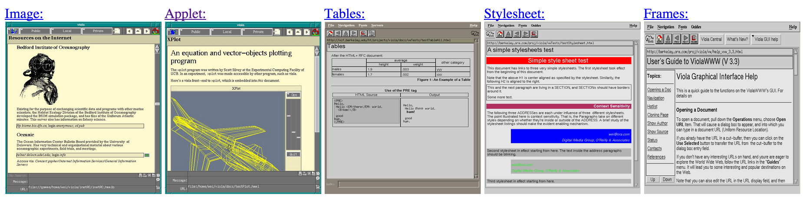

## Table of Contents

## はじめに

:::note{.message}
🎨 この記事は CSS Advent Calendar の 2 日目の記事です。
:::

## CSS “to save HTML”

「Web では font も color もカスタマイズできないなら、`` で画像として表示すればいい。」

そうなれば、リンクは動作せず、ユーザとのインタラクションも不可能になり、画像のロードに失敗すれば全てのコンテンツを失う可能性だってある。だが、きちんと読み込まれれば、思い描いた通りに装飾されたドキュメントがインターネットで共有できる。それでいい。

これに対し、「そんなわけがない。」として、多くのプロポーザルが出され始めることになります。

- [Historical Style Sheets Proposals](https://www.w3.org/Style/History/Overview.en.html)

`` の急速な広まりが、物理印刷との混同を招き、 HTML の特性が失われるようなことは避けなければならない、という危機感ゆえの提案だったのでしょう。

> **The web would have become a giant fax machine** where pictures of text would be passed along.
>
> [Dev.Opera — CSS: It was twenty years ago today — an interview with Håkon Wium Lie](https://web.archive.org/web/20240105013339/https://dev.opera.com/articles/css-twenty-years-hakon/)

そのうち Håkon Wium Lie が提案したものが、CSS（Cascading Style Sheets）の前身となる、**CHSS**（Cascading HTML Style Sheets）でした。

実は、CHSS の全身となったのが、Day1 でも紹介した、 Robert Raisch 提案の StyleSheet RFC です。これが Web の歴史において最も古い CSS の提案であるため、まずは Robert Raisch の RFC から見ていこうと思います。

## Robert Raisch's Request for Comments: STYLESHEETS

1993年に www-talk メーリングリストで Robert Raisch が提案した以下の RFC が、Web 史上最初のスタイルに関する提案です。

- [WWW-Talk Apr-Jun 1993: Request for Comments: STYLESHEETS](http://1997.webhistory.org/www.lists/www-talk.1993q2/0445.html)

*"an easily parsable format"* として提案されたこの RFC では、例えば H1 タグのスタイルには以下のような記法を使うとされていました。

`@H1 fo(fa=ti,si=32,we=bo)`

何を意味しているのかまるで理解不能ですが、[`fo` は `font` の略](http://1997.webhistory.org/www.lists/www-talk.1993q2/0445.html#:~:text=font(family%2Cspacing%2Csize%2Cweight%2Cslant%2Cforeground%2Cbackground%2Cline%2Clongname)(fo))で、fa は family、si は size、we は weight、bo は bold を表しているとのことです。つまり、`@H1 fo(fa=ti,si=32,we=bo)` は、H1 タグのフォントファミリーを Times、サイズを 32、太字にするということになります。

人間にとって *"an easily parsable format"* とはとてもいえなそうな文法ですが、ファイル圧縮がされておらず、接続速度が 14.4k 前後だった当時に誕生したことを鑑みると、理にかなったフォーマットだったのかもしれません。

よくみると、この記法には、フォントサイズに単位が指定されていません。それどころか、この RFC には単位に関する言及がまったくなく、数値は状況に応じて解釈されるようです。

> Describes the size of the character representation in general UNITS, which **could** be interpreted as a typographic 'point' size.

さらに、フォントファミリーに関しても以下のように、あくまで”提案”であるという記述があります。

> This is **not meant as a font name**, per se. Rather it is a **suggestion** of a particular style of character representation.

この StyleSheet の提案が実際にブラウザに実装されることはありませんでしたが、この提案には後に Håkon Wium Lie が提案した今日の CSS を支える、非常に重要な概念が含まれています。

## Pei Wei's Proposal & The first stylesheet-supporting Browser

スタイルシートを最初にサポートしたブラウザは Pei-Yuan Wei によってわずか 4日で開発された ViolaWWW です。


*スタイルシートを最初にサポートしたブラウザ ViolaWWW*

Pei Wei は Robert Raisch の RFC とは別で、同年に独自のスタイルシートを考案します。このスタイルシートでは、セレクタ、それに応じた Rules、プロパティと Value の Declaration が明確に確認でき、現在の CSS の形に非常に近いものを感じます。

- [WWW-Talk Oct-Dec 1993: Stylesheet Language](https://www.w3.org/Style/History/www.eit.com/www.lists/www-talk.1993q4/0264.html)

```lisp
(HEAD,BODY fontSize=normal
  BGColor=white
  FGColor=black
  (H1 fontSize=largest
    BGColor=red
    FGColor=white)
  (H2 fontSize=large)
  (P)
  (A FGColor=red)
  (CMD,KBD,SCREEN,LISTING,EXAMPLE fontFamily=fixed)
  (BOLD,EMPH,STRONG fontWeight=bold)
  (I fontSlant=italic)
  (ADDRESS
    (P fontSlant=italic))
  (OL
    (LI numStyle=roman
      (LI numStyle=number
        (LI numStyle=alpha)
      )
    )
  )
  (FOOTNOTE fontSize=small
    (P)
  )
)
```

さらに注目すべき点は、入れ子構造や Inheritance の概念が導入されていることです。

> Note that properties are inherited down the tree, unless overridden.
> So, the color information that is specifed at the top is used all over,
> except for `<H1>` which redefines its own colors.
>
> Having this inheritance behaviour also helps to keep the description short, as lots of information can be derived by the context in the tree structure.
>
> [WWW-Talk Oct-Dec 1993: Stylesheet Language](https://www.w3.org/Style/History/www.eit.com/www.lists/www-talk.1993q4/0265.html)

また、Pei-Yuan Wei の提案は、今日でも使われている Link タグでの外部スタイルシート参照を提案しているのも、特筆すべき点です。

```html
<LINK REL="STYLE" HREF="URL_to_a_stylesheet">
```

今日の我々からするとどことなく自然、当時の人々にとっては非常に画期的な記法の StyleSheet の提案の4日後に、Steven Heaney がコメントを返します。
端的にいうと、車輪の再発明をするのではなく、SGML文書をスタイリングするために既に存在した、 FOSI という言語をベースにするのが最適だというものでした。

- [WWW-Talk Oct-Dec 1993: Re: Stylesheet Language](https://www.w3.org/Style/History/www.eit.com/www.lists/www-talk.1993q4/0295.html)

メールの内容を見てもらうとわかると思いますが、FOSI 自体が SGML で書かれているため、StyleSheet とは縁遠い記法に見えます。しかし、当時の Web を開発する人々が SGML の派生形である HTML に最も精通していたとすると、当時はこれが理にかなった提案だったのかもしれません。

とはいえ、ViolaWWW は残念ながら Unix システム上でのみ普及していた X Window System をメインの動作環境としていたため、Mosaic が Windows に移植されるとすぐにその座を Mosaic に明け渡すことになります。

## CHSS: Cascading HTML Style Sheets

2 つのスタイルシートの提案ののち、Mosaic の `` のサポートを引き金として、1994年に Håkon Wium Lie が提案したものが、**CHSS（Cascading HTML Style Sheets）** でした。

- [Cascading HTML Style Sheets -- A Proposal](https://www.w3.org/People/howcome/p/cascade.html)

CHSS には今日の CSS の主要概念である Cascade (Origin & Importance) の構想が初めて含まれます。この概念こそが CHSS を CHSS たらしめた唯一の特徴と言っても過言ではなく、CSS を *"Cascading"* Style Sheet として Web において生き残らせ、発展させた最大の要因でもあると思います。

そんな超重要概念である 「Cascade」 は Håkon Wium Lie の閃きによって偶然生まれたものなのか、それとも必然だったのか。
「Cascade」は 「Web」 を説明することができるほどの深いコンテキストが含められた、必然の産物だったのではないかと思います。

## Appendix

- [Historical Style Sheets Proposals](https://www.w3.org/Style/History/Overview.en.html)
- [PhD Thesis: Cascading Style Sheets](https://www.wiumlie.no/2006/phd/)
- [A Brief(ish) History of the Web Universe: Part III The Early Web | briankardell](https://briankardell.wordpress.com/2016/02/05/a-briefish-history-of-the-web-universe-part-iii-the-early-web/)
