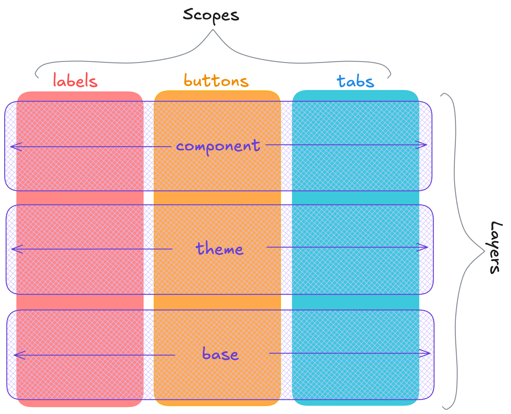
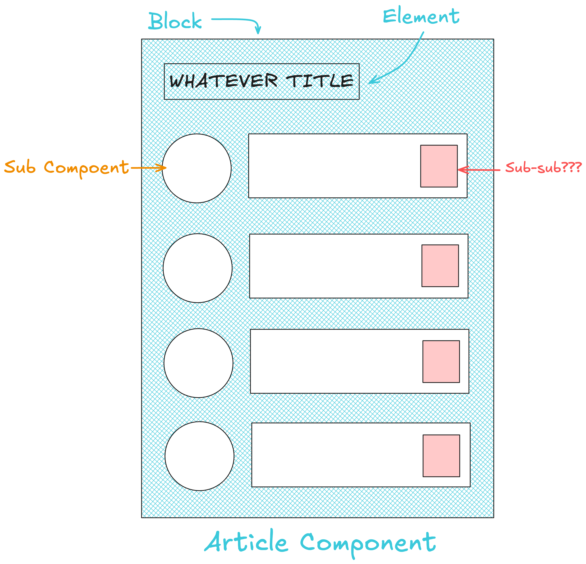

## Table of Contents

## はじめに

:::note{.message}
🌏 この記事は CSS Advent Calendar の 20 日目の記事です。
:::

前回までは Cascade Layers の提案に至るまでの経緯やメンタルモデル、具体的なユースケースを解説しました。
これまで詳細度でワークアラウンドしていた部分に対して、Cascade Layers がどのような解決策となるかも紹介しています。

今回は、Cascade Layers 関連して CSS Scope がどのように機能するものなのか、その仕様策定の背景とともに詳しく解説します。

単なる「使い方」ではなく、なぜこの仕様が必要になり、どのような議論を経て現在の形になったのかを追いながら、CSS Scope の本質を理解するきっかけになればと思います。

## Cascade Layers for name-spacing (or even Scoping) styles? No!

CSS における Scope を見ていく前に、Cascade Layers と Scope の関心の線引きを明確にしておきたいです。

そもそも、Cascade Layers はセレクタの影響、特に「セレクタが競合する場合の影響をコントロールするもの」として機能する節があります。

Cascade Layers で思いつきそうなこととして、**各コンポーネント**に対して `@layer` を作成することが挙げられます。
例えば、以下のように `@layer whatever-component` を作成することを考えてみます。

```css
@layer whatever-component {
  .title {
    color: blue;
  }
}
```

これにより、詳細度時代に `.whatever-component-title` としていたものを `@layer whatever-component` 内の `.title` とシンプルに表現できます。

そのため、Cascade Layers は名前空間を管理、または影響範囲を「スコーピング」するためのソリューションであると捉えようとするのは、起こり得る思いつきかもしれません。

ただ、ここで強調しておきたいのは、**Cascade の競合は名前空間の競合と同じではなく、Cascade Layers はこの種のスコープ用に適切に設計されているものではない**ということです。

Cascade Layers は、セレクタが「HTML のどの範囲で一致するか」はコントロールせず、セレクタが **「どのようにカスケードされるか」のみコントロールする**ものとして設計されています。

各コンポーネントに対して `@layer` を作成する例に戻ります。
whateverA-component が常に whateverB-component をオーバーライドするものと確定していない限り、A/B 個々の `@layer whatever-component` を作成しても、あまり役に立たない/レイヤリングの仕方が不明なものになってしまうと思います。

これは、Cascade Layers が 「DOM ツリーフラグメントを**跨いだ**スタイル優先順位の解決策」として機能するためです。

これに対して、Scope は「特定の DOM ツリーフラグメントに**結び付いた**スタイリングを行う解決策」として機能します。

表現を変えれば、Scope にはスタイル設定の「**対象** (なぜ、その範囲なのか)」を記述し、レイヤーにはスタイル設定の「**理由** (なぜ、その優先順位/レイヤーなのか)」を記述できるものとも言えます。

よって、「スコープなしのレイヤー」「レイヤーなしのスコープ」それぞれにユースケースが存在し、両者は相補的に機能できるため、どちらかがあればどちらかが不要とは言えません。

以上を踏まえると、Cascade Layers と Scope の関係は以下の図のように表現できるでしょう。



---

Scope に関しては、DOM ツリーフラグメントに結び付いたスタイリングを行う「だけ」の Scope であれば、ShadowDOM や JS toolings でやってきたスコーピングもこれに該当します。

しかし、今回 [Cascade Level 6](https://drafts.csswg.org/css-cascade-6/#scoped-styles) で定義されている `@scope` は、それ以外にこれまで CSS の Scope として必要と語られてきた要件を満たすものとして設計されています。

その要件こそが「**近接性（Proximity）**」「**ドーナツスコープ**」「**グローバルスタイルとの共存**」で、これらすべての要件を満たすものは標準にも JS toolings にも存在してきませんでした。

## Proximity

約 15年前に Nicole Sullivan が OOCSS を提唱する中で「近接性」に強く関連する _"css wish"_ を述べていました。
筆者の観測範囲では、これが Scope Proximity に接触する最も古いリソースです。

- [Object Oriented CSS | KEY | Web Design and HTML | Internet](https://www.slideshare.net/slideshow/object-oriented-css/990405#62)

Cascade は Specificity が同じ場合は単に後に書かれたルールを優先します。

```css
/* theme に応じたリンクの色を設定*/
.light-theme a {
  color: purple;
}
.dark-theme a {
  color: plum;
}
```

そのため、例えば以下のような指定をしても、直感に反して `.light-theme` のリンクは `plum` になります。

```html
<div class="dark-theme">
  <a href="#">I am plum.</a>
  <div class="light-theme">
    <a href="#">I expect to be purple, but I am plum🥹</a>
  </div>
</div>
```

OOCSS に代表される、フラグメント単位の _"Modular なスタイル"_ を実現するにおいては、「順序」よりも「どれだけ対象とする要素に近いか」という情報がの方が、自然かつ有効です。

しかし、CSS において「どれだけ近いか」という概念は Specificity など他での代替が存在せず、Cascade において「最も近い祖先」という基準も存在しないため、直感に応じたスタイリングはできませんでした。

そこで、`@scope` では、Modular なスタイリングにおいて尊重されるべき「**近接性/Proximity**」を導入しています。

例えば、以下のように記述することで、それぞれのスコープに対して hop 数の小さい（近い）方のスタイルが優先されるようになります。

```css
@scope (.light-theme) {
  a {
    color: purple;
  }
}
@scope (.dark-theme) {
  a {
    color: plum;
  }
}
```

```html
<div class="dark-theme">
  <a href="#">I am plum.</a>
  <div class="light-theme">
    <a href="#">I am purple!</a>
  </div>
</div>
```

## Donut Scoping

前節の「Proximity」は主に「どのスコープルートに近いか」という問題を扱いましたが、実際のコンポーネントでは「コンポーネントの内部要素」と「ネストされた子コンポーネント」を区別する必要がしばしばあります。



コンポーネントを BEM 風に表現すると、以下のような要素で構成が考えられます。

- コンポーネント外側の「Block」（コンポーネントのラッパー部分）
- その Block に結びついた内部の「Element」
- サブコンポーネントをネストできる「Slot」または「**Donut Hole**」

```html
<div class="component">
  <!-- Component Block -->
  <h2 class="component__title">...</h2>
  <!-- Component Element -->
  <div class="sub-component">Button, Input, etc...</div>
  <!-- Donut Hole -->
</div>
```

ここで重要なのは、ある要素が「どのコンポーネントに属しているか」を明確にすることです。
その要素の「所有権」がどこにあるかによって、それが「Element」なのか「Donut Hole」なのかが決まります。
BEM はこの所有権を命名規則で表現しようとしたものとも言えます。

```css
/* コンポーネントツリー内のすべてのタイトル */
.component .title {
  /* 範囲が広い */
}

/* コンポーネントの直接の子であるタイトルのみ */
.component > .title {
  /* DOM 構造に依存しすぎている */
}

/* BEM: コンポーネントに属するタイトルというセマンティクスを持つ */
.component__title {
  /* 命名規則で所有権を表現できていそう */
}
```

Nicole Sullivan はこのコンポーネント内の所有権からくるスコープの分離を「ドーナツスコープ」と名付けました。

- [Scope donuts – Nicole Sullivan](https://www.stubbornella.org/2011/10/08/scope-donuts/)

この DOM フラグメントの「所有権」を命名規則ではなく、標準の CSS で表現できるようにしようというのが、`@scope` の「下限境界」（scoping limits）の発端です。

`@scope` を用いると、ドーナツスコープは以下のように表現できます。

```css
@scope (.component) to (.sub-component) {
  .title {
    color: blue;
  }
}
```

`@scope` による「所有権の範囲」の明確化は、BEM や CSS Modules、 CSS in JS で実現し難かった、「A から B の範囲まででしか適用されないスタイル」というドーナツ構造を実現できる点で、非常に強力です。

## Two approaches of "scope" -- Global embracing Scope

[Day14](https://blog.sakupi01.com/dev/articles/2025-css-advent-14) ~ [Day16](https://blog.sakupi01.com/dev/articles/2025-css-advent-16) でみてきたように、CSS における Scope には、これまで様々なアプローチ編み出されてきました。

その上で、これらのアプローチは、主に以下の2つに大別されます。

1. **Isolation**: グローバルの影響を**受けず**、グローバルには影響を与えない。DOM フラグメント（いわゆるコンポーネント）をグローバル（ホスト）から完全に分離した名前空間。
2. **Containment**: グローバルの影響を**受ける**が、グローバルには影響を与えない。DOM フラグメント（いわゆるコンポーネント）をグローバル（ホスト）の中で分離した ”より弱い” 名前空間。

これまでに標準側で存在していた [`<style scoped>`](https://developer.chrome.com/blog/a-new-experimental-feature-style-scoped) や [Scoped Styles(CSS Scoping Module Level 1)](https://www.w3.org/TR/css-scoping-1/) は、スタイルをフラグメント単位で分離するというユースケースには対処する設計でした。

しかし、[`<style scoped>`](https://developer.chrome.com/blog/a-new-experimental-feature-style-scoped) においては、HTML でスコープを表現する仕様だったため、スコープの再利用性や、HTML で宣言されたスコープと CSS との結び付けが実装上の課題となっていました。

[Scoped Styles(CSS Scoping Module Level 1)](https://www.w3.org/TR/css-scoping-1/) に関しては、`@scope` を用いて CSS でスコープを記述できるものとされていましたが、ドーナツスコープの欠如やスコープの強さが Specificity よりも強く、`!important` による逆転も仕様に含まれていたため、Isolation の性質が滲み出ていたものでした。

これらの策定をしている中、標準化の優先度が ShadowDOM に移り、最終的に Isolation の性質を持った ShadowDOM を除いてスコープを実現するものがでていない状態でした。

2 のようなスコープを達成するソリューションが標準側にないまま、LightDOM におけるスコープを求めて BEM などの規約や CSS Modules などのサードパーティ製ツールが発展します。

こうした LightDOM におけるスコープをネイティブ CSS で対処したいという需要は高まっており、以下などはそれに該当するものです。

- [[css-scoping] Support for CSS namespaces · Issue #270 · w3c/csswg-drafts](https://github.com/w3c/csswg-drafts/issues/270)
- [[css-selectors] Proposal: Selector Boundary · Issue #5057 · w3c/csswg-drafts](https://github.com/w3c/csswg-drafts/issues/5057)
- [[css-scoping] Please bring back scoped styles · Issue #3547 · w3c/csswg-drafts](https://github.com/w3c/csswg-drafts/issues/3547)

しかし、これまでの議論では、Isolation か Containment か、スコープに対する 2 つのアプローチが混同されることがままありました。

これまで命名規則や JS tooling で解決してきた、グローバルの影響を受ける「Containment」に主眼を置いた標準側のソリューションを設けようと再出発したのが、[CSS Scope](https://css.oddbird.net/scope/explainer/) です。

- [[css-scoping] Proposal for light-dom scoping/namespacing with re-designed `@scope` rule · Issue #5809 · w3c/csswg-drafts](https://github.com/w3c/csswg-drafts/issues/5809)

## Where to put Proximity in the Cascade?

この前提のもと、Scope の近接性（Proximity）を Cascade のどこに配置すべきかという問題に対して、主に 2つのアプローチが検討されました。

- [[css-scoping] Proposal for light-dom scoping/namespacing with re-designed `@scope` rule · Issue #5809 · w3c/csswg-drafts](https://github.com/w3c/csswg-drafts/issues/5809)

### 1: Strong Proximity

元々、標準側で提示されていた [Scoped Styles(CSS Scoping Module Level 1)](https://www.w3.org/TR/css-scoping-1/) や Shadow DOM に近いもので、スコープの **Proximity が Specificityよりも優先される設計**です。

```css
/* グローバルスタイル */
aside#sidebar p {
  color: red;
} /* 高い詳細度 */

/* スコープ内のスタイル */
@scope (aside) {
  p {
    color: green;
  } /* 低い詳細度だが、近い */
}
```

Proximity が Specificityよりも優先される設計では、`p` 要素により近いスコープのスタイルが、詳細度に関係なく優先されます。
よって、例の場合の `p` 要素は green になります。

---

Specificity よりも Cascade における優先順位が高いということは、基本的に Specificity を利用している現状からすると、ある種 (Shadow)Context を作らずに Shadow DOM のようなスタイルのカプセル化を実現しているということができます。

今回の Scope 標準化が、「コンポーネント内のスタイルは外部からの干渉を受けにくくし、強いカプセル化を実現する」というものであれば、Proximity を Specificity よりも高優先度にするという選択だったでしょう。

しかし、グローバルスタイルやユーティリティクラスをコンポーネントに適用したい場合、その都度 `@scope` の中で明示的な対応が必要になります。

Tailwind などを利用していると、`.text-red-500` のようなクラスをコンポーネント内でも使うことになり、都度 `@scope` の中で宣言するのは、スマートなやり方とは言えません。

Shadow DOM では Custom Properties や `::part()` などの仕組みで解決策が存在しはする一方、Light DOM でのスコープにそのような複雑な仕組みを持ち込むのは避けたいという意見も多くありました。

グローバルの影響を受け、グローバルには影響を与えない、「Containment」 なスコープを実現する目的の上では、Specificity より強い Proximity はスコープとして強すぎました。

### 2: Weak Proximity

一方、Weak Proximity は、Cascade において Proximity は Specificity よりも低優先度の位置に配置する案です。

あくまで Specificity を主要な優先度判定基準として機能させ、Proximity は Specificity が同じ場合のみ考慮される、CSS Scope で新たに出てきた Scope の立ち位置となります。

上記と同じ例で Weak Proximity では、 `aside#sidebar p` の高い詳細度が優先され、`p` 要素は red になります。

Weak Proximity を採用するメリットとしては、主に2つ挙げられています。

まず、Weak Proximity だと、`@scope` の中に Specificity が干渉できるため、グローバルスタイルやユーティリティクラスがコンポーネントに「流れる」ように適用されます。

また、CSS Modules や styled-components といった、詳細度ベースで優先順位を判断している既存手法からの移行もしやすくなります。
詳細度よりも弱い Proximity であれば、詳細度前提の挙動を大きく変えることなく、これらのツールから標準の `@scope` への移行を考えることができます。

以上を踏まえて Proximity は、Specificity より低優先、Order of Appearance より高優先となる位置に配置される運びとなりました。

以下が、Cascade Layers と Proximity を踏まえた、執筆時点で最も新しい Cascade です。

<cascade-accordion disabled show-layers="true" show-scope-proximity="true"></cascade-accordion>

---

- より堅牢に Modular なスタイルを実現するための Proximity という概念
- コンポーネントの「所有権の範囲」を明確化する「ドーナツスコープ」に対する標準的なソリューション
- グローバルスタイルと共存可能かつ「Specificity が同じ場合のフォールバック」としても機能する Cascade 上での Proximity の位置付け

これらを実現する `@scope` は [Interop 2025 で注力される Focus Areas の一つ](https://wpt.fyi/interop-2025)となっており、今年中に主要ブラウザでの実装が揃うことが期待されます。

---

ただっ広い「Cascade」の一部である「詳細度」にプラクティスが留まらなくなった、アプリ時代の Web 開発。

Cascade Layers や `@scope` によって、アプリ時代の Web で我々が確立してきた設計思想/プラクティスに、「hints」であり「suggestions」であり「balance」をとるという Cascade の特性を活かすことが可能になります。

ところで、「hints/suggestions」という CSS の言語特性は、CSS が「Declarative」であるということを CSS-way で表現しているものだと捉えることもできます。

昨今の CSS の進化を俯瞰すると、「Declarative」であるという CSS の特性は、Cascade に留まってなされる話ではなくなってきていると思います。
Web における UI を構築するあらゆる手段が、より分かりやすく、より強力な形で、「hints/suggestions」を体現する「Declarative」な特性を滲み出してきているように感じます。

しかし我々は、この特性を「どう活かすか」ということを、プラクティスベースであまり考えてこられなかったように思います。

本連載の終盤では、Web における UI の「Declarative」な特性と今後の Web Design のあり方について、考察していければと思います。

## Appendix

- [CSS Scope Proposal & Explainer](https://css.oddbird.net/scope/explainer/)
- [Scope in the Cascade](https://css.oddbird.net/scope/cascade/)
- [Scope Syntax Options](https://css.oddbird.net/scope/syntax/)
- [Nesting, Scoping, and Proximity (a FAQ)](https://css.oddbird.net/scope/nesting/)
- [CSS Cascade 6 (Scope) | Miriam Eric Suzanne](https://www.miriamsuzanne.com/specs/cascade-6/)
- [CSS Scope & Encapsulation](https://css.oddbird.net/scope/)
- [Early design review of light-DOM CSS Scope proposal · Issue #593 · w3ctag/design-reviews](https://github.com/w3ctag/design-reviews/issues/593)
- [CSS Scoping Solutions Brainstorming - Google Docs](https://docs.google.com/document/d/1hhjmuQE6BTTnAyKP3spDr8sU6lpXArh8LDfihZh78hw/edit?tab=t.0#heading=h.ux941gvq45mf)
