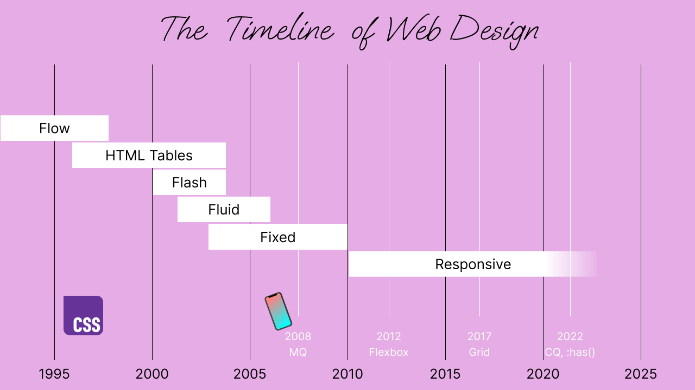
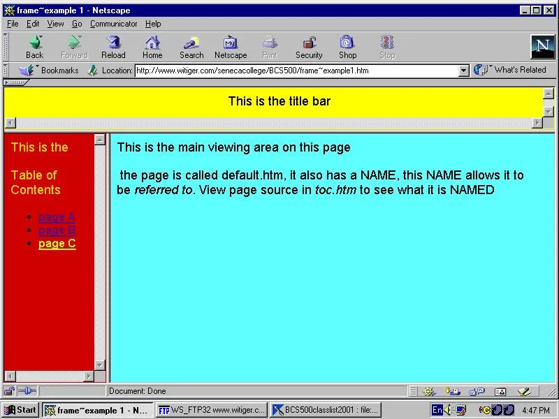
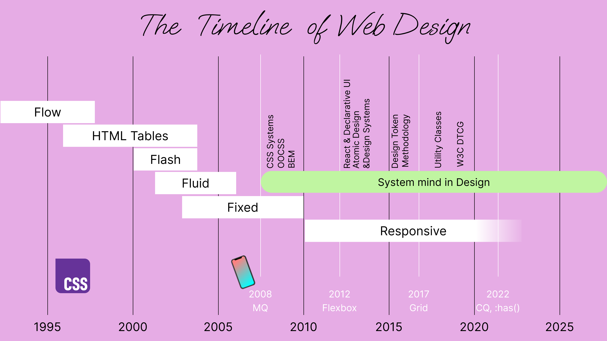

## Table of Contents

## はじめに

:::note{.message}
🌏 この記事は CSS Advent Calendar の 21 日目の記事です。
:::

ただっ広い「Cascade」の一部である「詳細度」にプラクティスが留まらなくなった、アプリ時代の Web 開発。

Cascade Layers や `@scope` によって、アプリ時代の Web で我々が確立してきた設計思想/プラクティスに、「hints」であり「suggestions」であり「balance」をとるという **Cascade** の特性を活かすことが可能になります。

ところで、「hints/suggestions」という CSS の言語特性は、CSS が「**Declarative**」であるということを CSS-way で表現しているものだと言い換えることができます。

Flexbox、Grid、Box Alignment、Relative Units、Intrinsic Sizing、Aspect Ratios、Min/Max/Clamp、Logical Properties、Container Queries、`:has()`、`@scope`、`sibling-index`、`calc-size()`、Reading Flow ...

昨今の CSS の進化を俯瞰すると、「Declarative」であるという CSS の特性がより色濃く表現されるようになってきていることがわかります。

Web における UI を構築する手段 -- レイアウトとコンテンツが、より分かりやすく、より強力な形で、「hints/suggestions」を体現する「Declarative」な特性で可能になってきているのが、ここ数年の CSS の進化の特徴です。

しかし、これらの機能に対する「思考の変換」の追従はできているのでしょうか。

本連載の終盤では、Web における UI の「Declarative」な特性と今後の Web Design のあり方について、考察していきます。

その前談として、Web Design の歴史を振り返り、これまで Web Design における「思考の変換」がどのようにされてきたのかを振り返っていきます。

## A Quick History of Web Design

Web におけるこれまでのデザインの歴史を解釈すると、**レイアウトとコンテンツにおけるデザイン思想史**として語ることができます。

詳細に入る前に、これまでの Web Design 史の Overview を提示しておきます。



### Flow Layout

CSS も JavaScript もまだ登場していなかった時代、Web で使えるのは HTML のみでした。
この時代にページのレイアウトとして利用できたのは、現在の CSS 仕様でいうところの「[Normal Flow](https://www.w3.org/TR/CSS2/visuren.html#normal-flow)」です。
Box（コンテナ）が Content を参照し、Content が Box を参照する「レイアウトにおいて Box とその Content が互いに参照し合う関係性にある集合」のことを [Flow](https://www.w3.org/TR/CSS2/visuren.html#normal-flow:~:text=The%20flow%20of%20an%20element%20A%20is%20the%20set%20consisting%20of%20A%20and%20all%20in%2Dflow%20elements%20whose%20nearest%20out%2Dof%2Dflow%20ancestor%20is%20A.) と呼びます。
Normal Flow では、 Inline 要素はインライン方向、つまり writing-mode の方向に配置され、Block 要素は、段落方向に配置されます。

例えば以下のシンプルな HTML の画面幅を伸縮させると、それに応じてコンテンツが wrap されたり、段落は別の行に配置されています。
このレイアウトは、HTML が Normal Flow に従って、Box とその Content が互いに参照し合うために可能なものです。

<p class="codepen" data-height="300" data-default-tab="html,result" data-slug-hash="raOdZdr" data-pen-title="Untitled" data-user="sakupi01" style="height: 300px; box-sizing: border-box; display: flex; align-items: center; justify-content: center; border: 2px solid; margin: 1em 0; padding: 1em;">
  <span>See the Pen <a href="https://codepen.io/sakupi01/pen/raOdZdr">
  Untitled</a> by saku (<a href="https://codepen.io/sakupi01">@sakupi01</a>)
  on <a href="https://codepen.io">CodePen</a>.</span>
</p>
<script async src="https://public.codepenassets.com/embed/index.js"></script><br />

Normal Flow による Web のデフォルトのレイアウト、いわゆる 「**Flow Layout**」が Web Design における最初のレイアウトです。

### Table Layout

その次に Web Design に変化を起こすのが HTML Table の登場です。

Table には Columns/Rows があり、ヘッダがあり、セルがあることで、表形式のデータを表現する目的があります。
当時のデザイナは、この二次元構造を画像やコンテンツの配置に利用することで、Flow Layout ではできなかった二次元的なレイアウトを実現できるのではないかと考えました。
これが「**Table Layout**」の時代です。


*出典： [Tables for Layout? Absurd. - The History of the Web](https://thehistoryoftheweb.com/tables-layout-absurd/)*

ただし、Table Layout では、Table の構造に依存したレイアウトのみしか実現できず、二次元構造以上の見た目を実現したいという欲求が発生します。

加えて当時は、ブラウザ戦争の影響によるブラウザ間の互換性の問題もありました。
IE で動作しても Netscape では動作しない、またその逆もあるという状況です。
資金的余裕があれば、IE と Netscape の両方に対応した Web サイトを作ることができましたが、そうでない場合は、どちらか一方のブラウザへの対応を迫られるということが起こっていました。
問題の原因として、実装する上での詳細を仕様が握れていなかったことがあったため、Chrome や Firefox などのモダンブラウザが登場してもなお、Web Design をする上で**互換性の問題が大きい**ままでした。

### Flash Web Design

このような状況の中で、「どのブラウザでも動作し、思い描いたデザインを実現できる」手段が「Flash」でした。

Flash では、画像や図形、文字、音声、動画などを組み合わせ、タイムラインに沿って変化するアニメーションを組むことができ、ユーザの操作や入力を動作に反映させることもできました。
Adobe が JavaScript を拡張したものである ActionScript を用いることで、動作をカスタマイズすることも可能でした。
Flash は Adobe が提供するプラグインソフトである「Flash Player」を組み込んだ Web ブラウザ上で動作します。

よって、Flash は、当時のブラウザ間の互換性の問題を解決し、デザイナが思い描いた通りのデザインを実現できる手段として利用されました。
これが、「**Flash Web Design**」の時代です。

Flash によってデザインされた Web サイトは、例えば以下のようなページに残っています。

- [Flash Websites - Web Design Museum](https://www.webdesignmuseum.org/flash-websites)
- [Beautifl - Flashのギャラリーサイト](https://beautifl.net/)

Flash の問題として、Flash はブラウザのプラグインとして動作し、コンテンツのレンダリングにブラウザの処理を利用できないことがありました。
つまり、Flash はブラウザと対話できないため、画面幅に応じたレイアウトやスクロールバーの出現の制御など、ブラウザが本来担うレンダリング処理の恩恵が全く受けられませんでした。
加えて、Flash によって作られたコンテンツのセキュリティ、パフォーマンス、SEO、アクセシビリティなどの担保が難しいことも問題として露見しました。

そこで、やはり Web Design は "Web" を使ってなされるべきだという考え方に帰結します。

2003年、Jeffrey Zeldman による「[Designing with Web Standards](https://www.google.co.jp/books/edition/Designing_with_Web_Standards/zZ4K3-vdN3oC?hl=en&gbpv=0)」が出版され、Web 標準に基づいた開発の重要性が広く認識され始めました。
この中で、デザイナたちは CSS の限られた機能でレイアウトを実現する必要に迫られるようになります。

### Float Web Desgin

Float は本来、画像の周りにテキストを回り込ませるための機能です。
しかし、当時の CSS にはレイアウトのための専用機能が存在しなかったため、この Float を「hack」として転用し、ページ全体のレイアウトを構築する手法が考えられました。

Float によるレイアウトには、大きく分けて「Fluid」と「Fixed」の 2つのアプローチが存在しました。

#### Fluid Layout with Float

パーセンテージベースの「Fluid Layout」は、 Web の本質的な特性である「流動性」を尊重しようとする試みでした。

```css
.container {
  width: 100%;
}
.sidebar {
  float: left;
  width: 45%; /* container 内コンテンツ合計で 100% 以内になるよう指定する */
}
.main-content {
  float: right;
  width: 45%; /* container 内コンテンツ合計で 100% 以内になるよう指定する */
}
```

Fluid Layout の利点は、様々な画面サイズに柔軟に対応できることでした。
コンテンツは利用可能な幅に応じて流動的に調整されます。

しかし、実際にはデザイン上の課題が多く残る手法であった側面がありました。

- 大きな画面では行長が極端に長くなり、読みづらくなる
- 固定サイズの画像がレイアウトを破壊する可能性がある
- 画面サイズによって見た目が大きく変わってしまう

Jen Simmons も当時を振り返り、次のように述べています。

> So a lot of people were advocating very hard that fluid web design was the core essence of the web, and that's how we should be doing it.
> But there were a lot of other people who were saying—and I was one of these people—**it's ugly**.
>
> Jen Simmons [An Event Apart video - YouTube](https://www.youtube.com/watch?v=jBwBACbRuGY)

#### Fixed Layout with Float

Fluid Layout の課題を受けて、「Fixed-Width Layout」、という選択肢が登場します。
これは、ピクセル単位で幅を固定することで、その範囲で思い描いた Float Web Design を実現しようとするものです。

<p class="codepen" data-height="300" data-default-tab="html,result" data-slug-hash="azvYRGv" data-pen-title="Untitled" data-user="sakupi01" style="height: 300px; box-sizing: border-box; display: flex; align-items: center; justify-content: center; border: 2px solid; margin: 1em 0; padding: 1em;">
  <span>See the Pen <a href="https://codepen.io/sakupi01/pen/azvYRGv">
  Untitled</a> by saku (<a href="https://codepen.io/sakupi01">@sakupi01</a>)
  on <a href="https://codepen.io">CodePen</a>.</span>
</p>
<script async src="https://public.codepenassets.com/embed/index.js"></script><br />

しかし、Fixed-Width Layout 上でのデザインでは、小さな画面では横スクロールが発生し、大きな画面では不自然な余白が生まれ、多様なデバイスに対応できないという問題がありました。

### Responsive Web Design

2010年、Ethan Marcotte が「[Responsive Web Design](https://alistapart.com/article/responsive-web-design/)」を提唱しました。
これは「Fluid vs Fixed」の論争に終止符を打ち、マルチデバイスにサイトを対応させるための解決策となるものでした。

Responsive Web Design は3つの技術要素から構成されます。

1. **Flexible Grid**: パーセンテージベースの流動的なグリッドシステム
2. **Flexible Images**: コンテナに合わせて伸縮する画像とメディア
3. **Media Queries**: ブレークポイントでレイアウトを切り替える仕組み

Responsive Web Design は、モバイルデバイスの急速な普及という時代背景にマッチし、「One Web」という理念のもと、単一のコードベースであらゆるデバイスに対応できる手法として広く採用されました。

### Limitation of Responsive & Dependency to Framework

しかし、Responsive Web Design も万能ではありませんでした。
Float を使った複雑なレイアウトは脆弱で、少しの変更でレイアウト全体が崩れる可能性があったからです。

この危険性に対して、 Bootstrap や Foundation といった CSS Framework で、レイアウトのルールを握る手段が生まれました。
Framework は安定したレイアウトシステムを提供しましたが、同時に Web サイトが画一的に見えてしまうという問題も生むことになりました。

さらに、Responsive Web Design の実装において、基本的にデザイナは 3つの静的なカンプ（Mobile/Tablet/Desktop）を作成し、開発者がその間を Media Query で補間するという作業フローが定着しました。
これは **「離散的」なアプローチ**であり、「連続的」に変化する画面サイズに対して、段階的な対応しかできませんでした。

### Thoughts of Web Design has been changing in between...

ここまでの歴史を振り返ると、デザインと Web というメディア間進化のせめぎ合いで、Web Design の思想転換が起こってきたことがわかります。

**1. グラフィックデザインの理想**

- ピクセルパーフェクトな表現
- 印刷物のような精密なコントロール
- デザイナの意図を100%再現

**2. Web メディアの制約と特性**

- デバイス、ViewPort、設定、etc の多様性
- 互換性
- アクセシビリティとセマンティクス
- パフォーマンスと SEO

Table Layout 時代は、グラフィックデザインの理想を Table のセル構造で実現しようとしました。
Flash 時代は、Web の制約から完全に逃れることでデザインの理想を追求しました。
Float Layout 時代は、CSS の hack を駆使して Fluid と Fixed 両者の妥協点を探りました。
Responsive Web Design 時代は、Web の多様性を受け入れつつ、段階的な適応でデザインの一貫性を保とうとしました。

つまり、「**アートとしてのデザイン**」と「**Web というメディアとしてのデザイン**」の交差の中で、Web Design の思想転換が起こってきました。

### Component-Based Design の台頭

Responsive Web Design の普及と並行して、Web 開発は「Component-Based」なアプローチへとシフトしていきました。
本アドベントカレンダーでも述べた BEM、SMACSS、OOCSS といった CSS 設計手法が登場し、再利用可能なコンポーネントを組み合わせてページを構築する手法が主流となりました。



React、Vue、Angular といったコンポーネントベースの JS Framework の登場により、この流れはさらに加速しました。
コンポーネントは独立した再利用可能な単位として設計され、デザインをシステマティックに組み立てることが、アタリマエの時代になったと言っても良いでしょう。

### Extrinsic Design の限界

しかし、Component-Based Design においても、レイアウトの根底にあるのは依然として「Extrinsic（外部的）」なアプローチでした。
Media Query で画面幅に応じた離散的なスタイルを組み、root を基準に rem で font-size を指定し、Breakpoint による離散的にスタイルを切り替える。

このアプローチでは、すべてのスタイリングが「外部の基準値」に依存します。
View Port の幅、root の font-size、グローバルな Breakpoint など、コンポーネントの外側にある値を参照してレイアウトを決定していることが特徴です。

Responsive Web Design が提唱されてから実に8年以上もの間、この「Extrinsic（外部）」に基づいた Web Design が主流でした。
Sketch や Figma などのデザインツールもこの間に出現し、デザインツールとしてもExtrinsic なアプローチをサポートする流れが続きます。
しかし、Extrinsic なアプローチでは、下記に挙げるような問題が残ります。

1. 外部の基準値に依存するため、本当の意味で外部から独立した再利用可能なコンポーネントか不明
2. Breakpoint での切り替えは段階的であり、連続的な変化に対応できない
3. コンテンツの量や性質に関わらず、外部の基準でレイアウトが決まる

### Respect the Content!

2010年代、CSS の新機能は、これまでの hack やワークアラウンドなしに、ネイティブで強力なレイアウト機能を提供しました。
特に強調しておきたいのは、これらの機能が「コンテンツ」や「コンテナ」自身の性質に基づいてレイアウトを決定できることです。

- `min-content`、`max-content`、`fit-content` などの内在的なサイズ指定
- `fr` 単位による柔軟な空間配分
- Grid によるコンテンツに基づいた二次元のレイアウト
- Flexbox によるコンテンツに基づいた一次元のレイアウト
- `aspect-ratio` による内在的な比率の維持
- `clamp()`、`min()`、`max()` などの比較関数
- `ch`、`ex` などのフォント相対単位
- （Container Queries によるコンテナベースの適応）

これらの登場によって、hack を使わずに、初めて柔軟なレイアウトを実現できる術が整い始めました。

> "I think for the first time, we don't have to choose hacks versus boring layout. **We get to have both at the same time.**"
>
> Jen Simmons [An Event Apart video - YouTube](https://www.youtube.com/watch?v=jBwBACbRuGY)

### Demand for a New Paradigm Shift

Web Design の歴史を振り返ると、CSS の大きな転換点では常に「**思考の転換**」が必要だったことが読み取れます。

Table Layout から CSS Layout への移行時、我々は「Table」という思考から「Box Model」という思考への転換が必要でした。
Fixed Layout から Responsive Web Design への移行時、我々は「Fixed」から「Responsive」への思考の転換が必要でした。

Responsive Web Design が提唱されてから、実に長い間、View Port や画面全体の基準値など、「Extrinsic（外部）」に基づいて Web をデザインをするスタイルが主流になっていました。
そして、この「Extrinsic」な思考により、抜け出せない課題がいくつも残されているのが実情でした。

- View Port 基準の設計では、真に独立したコンポーネントが作れない
- Media Query による離散的な対応では、連続的な変化に対応できない
- 外部の基準値に依存することで、コンテンツとレイアウトが乖離する
- CSS Framework への過度な依存により、画一的なデザインしかできなくなる
- ...

これらの課題を解決するには、単に新しい CSS プロパティを学ぶだけでは不十分です。

外部の基準ではなく、コンテンツの性質に基づいてデザインすること。
そのために、「hints」や「suggestions」として CSS を書き、ブラウザとコンテンツに判断を委ねること。
それによって、CSS の「Declarative」な特性を理解し、活用すること。

こうした Web Design における「思考の転換」が求められます。

その先駆けとして、柔軟なレイアウトを実現できる術が整い始めた変化を踏まえ、2018年に「Web Design のパラダイムシフト」として Jen Simmons が提案したのが「**Intrinsic Web Design**」です。

## Appendix

- [Transcript: Intrinsic Web Design with Jen Simmons – The Big Web Show](https://zeldman.com/2018/05/02/transcript-intrinsic-web-design-with-jen-simmons-the-big-web-show/)
- [328: Jen Simmons on Intrinsic Web Design - ShopTalk](https://shoptalkshow.com/328-jen-simmons-intrinsic-web-design/)
- [Patterns Day: Jen Simmons - adactio](https://adactio.com/journal/14889)
- [The ideal viewport doesn't exist](https://viewports.fyi/)
- [Five years of Figma](https://www.figma.com/five-years-of-figma/)
- [Adobe Flash](https://developer.mozilla.org/ja/docs/Glossary/Adobe_Flash)
- [Flash Tutorial: Create A Simple Flash Website -HD- - YouTube](https://www.youtube.com/watch?v=vqKIwTF2Zk4)
- [How to Program in Flash (Basic Actionscript 2.0): 10 Steps](https://www.wikihow.tech/Program-in-Flash-%28Basic-Actionscript-2.0%29)
- State of CSS
  - [2022](https://2023.stateofcss.com/en-US/)
  - [2023](https://2024.stateofcss.com/en-US/)
  - [2024](https://2025.stateofcss.com/en-US/)
  - [2025](https://2026.stateofcss.com/en-US/)
- What's New in Web UI/CSS
  - [2022](https://developer.chrome.com/blog/insider-july-2022)
  - [2023](https://developer.chrome.com/blog/whats-new-css-ui-2023)
  - [2024](https://developer.chrome.com/blog/new-in-web-ui-io-2024)
  - [2025](https://developer.chrome.com/blog/new-in-web-ui-io-2025-recap)
