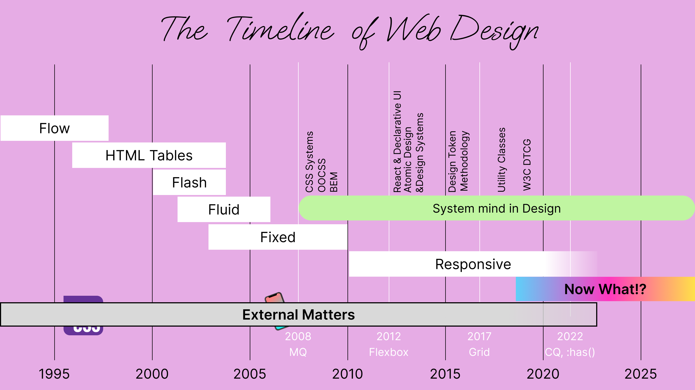

## Table of Contents

## はじめに

:::note{.message}
🌏 この記事は CSS Advent Calendar の 22 日目の記事です。
:::

Responsive Web Design の普及と並行して、アプリケーションとしての Web 開発は「Component-Based」なアプローチへとシフトしていきました。

BEM、SMACSS、OOCSS といった CSS 設計手法が登場し、再利用可能なコンポーネントを組み合わせてページを構築する手法が主流となり、
React/Vue/Angular といったコンポーネントベースの JS Framework の登場がこの流れをさらに加速させたことは、本アドベントカレンダーでも述べてきました。

コンポーネントは独立した再利用可能な単位として設計され、デザインをシステマティックに組み立てることが、アタリマエの時代になったと言っても良いでしょう。

ここまでの構図をまとめると、以下のようになります。


## Can we query by container...? - No, this is never going to happen!

Component-Based なアプローチが主流となる中で、「コンテナに応じてスタイルを変えたい」という要望が出るようになりました。
親コンテナを Query する「Container Queries」の皮切りとなった欲求は、直近の「Container Queries」が出る以前からも存在し、コンポーネント思考が浸透してきたあたりからずっと議論されてきました。

- [[css-selectors] `:stuck` pseudo-class feature suggestion · Issue #1656 · w3c/csswg-drafts](https://github.com/w3c/csswg-drafts/issues/1656)
- [[selectors-5] Proposal for pseudo-selector `:overflowed-content` · Issue #2011 · w3c/csswg-drafts](https://github.com/w3c/csswg-drafts/issues/2011)
- [[selectors4][css-round-display] Suggest a new type of pseudo class to support scrolling in rounded viewports from Jihye Hong on 2016-01-27](https://lists.w3.org/Archives/Public/www-style/2016Jan/0255.html)
- [Re: [selectors4][css-round-display] Suggest a new type of pseudo class to support scrolling in rounded viewports from Florian Rivoal on 2016-01-28](https://lists.w3.org/Archives/Public/www-style/2016Jan/0282.html)

ただ、当初は Container Queries の実現は難しいと考えられていました。
これは、レンダリングエンジンでの CSS 処理プロセスに起因するレイアウトの循環のためです。

- [[css-conditional] Applying styles based on an elements size (@media for elements, container queries) · Issue #3852 · w3c/csswg-drafts](https://github.com/w3c/csswg-drafts/issues/3852#issuecomment-484976611)

CSS はレンダリングエンジンにおいて「セレクターのマッチング → スタイルの適用 → レイアウト」という一方向の流れで処理されます。
そして、Day21 でも触れたよう、Flow のレイアウト（デフォルトのレイアウト法）では、Box（コンテナ）は Content を参照し、Content は Box を参照します。

通常であれば、この相互参照は問題になりません。
なぜなら、スタイル計算の段階で、**すべてのスタイルルールが既に確定しているから**です。
例えば、子要素に `width: 100%` が指定されている場合、これは「親要素の幅の 100%」という計算**ルール**として確定できます。
親要素が `width: auto` であっても、これは「コンテンツに応じたサイズ」という**ルール**として確定します。
レイアウト計算の段階では、これらの**確定したルール**に従って実際のピクセル値を計算するだけです。
重要なのは、レイアウトの結果によって新たなスタイルルールが適用されることはないという点です。
つまり、親子間のサイズの相互参照は「計算式の参照」であって、「計算結果による条件分岐」はないため、一方向の処理で解決可能です。

しかし、当時 Container Queries を実現しようとした場合、以下のように処理されることが懸念されていました。

1. 親要素の Sizing （レイアウト）
2. 親要素のレイアウト結果に対して子要素のスタイルが決定される
3. 子要素の Sizing （レイアウト）
4. 親要素の Sizing に子要素が影響を与える可能性（**循環レイアウト**）

つまり、Container Queries ではレイアウトの結果（親の実際のサイズ）がスタイルルールの適用条件となるため、「**スタイルの決定がレイアウトに依存する**（[Selectors that Depend on Layout](https://wiki.csswg.org/faq#selectors-that-depend-on-layout)）」ことになってしまいます。
Flow により、親の幅が確定できない循環が発生し、親のサイズに基づいて子要素のスタイルを決定することができないということが Container Queries の仕様策定を堰き止める要因でした。

### Intrinsic Web Design - Are we only Designing with Fluid?

Container Queries は実現が難しいと考えられていましたが、コンポーネント、つまり画面を構成する「コンテンツ」を尊重する CSS の機能は着々と増え始めていました。

しかし、Web Design の思想は、実に長い間、Fluid または Fixed と地続きの Responsive Web Design として考えられてきました。



---

2018年の An Event Apart において、Jen Simmons は、「コンテンツ」に重心を置く CSS の機能の仕様策定や利用に関わる中で、現状の CSS が Responsive Web Design の枠組みにとらわれなくなってきたと主張します。
Responsive Design の枠組みにとらわれなくなった Web Design の在り方、これを再定義したのが「**Intrinsic Web Design**」です。

- [“Designing Intrinsic Layouts” by Jen Simmons—An Event Apart video - YouTube](https://www.youtube.com/watch?v=AMPKmh98XLY)

「Intrinsic Web Design」の原則として、Jen は 6つの原則を示しました。

## 1. Truly Two-Dimensional Layouts

Responsive Web Design の時代において、レイアウトの構築は主に Float や Flexbox といった一次元的な手法に依存していました。
Float は本来テキストの回り込みのための機能であり、Flexbox はひとつの軸（main axis）に沿った一方向の配置に特化した設計です。
これらの手法では、行と列を同時に制御する二次元的なレイアウトが困難でした。

CSS Grid の登場により、**行と列を同時に**定義し、アイテムを二次元空間内の任意の位置に配置することが可能になりました。

この変化により、従来の「上から下」「左から右」といった単一の方向の思考ではなく、ページ全体を二次元的な空間として捉えることができます。
Grid によって、要素の配置順序が DOM 構造に縛られることなく、意図に従って自由に配置できる方法が用意されるようになりました。

DOM に依存しないレイアウトの実現は、別途アクセシビリティの問題も生じていくことになり、のちに [Reading Flow](https://developer.chrome.com/blog/reading-flow) によって解決されていくことになります。

## 2. Combine Fluid and Fixed

Float Layout の時代には、「Fluid」と「Fixed」が対立する概念として存在していました。
Fluid Layout はパーセンテージベースで流動性を重視する一方、Fixed Layout はピクセル単位の固定幅で見た目の整いを重視していました。
しかし、この両極端なアプローチでは、コンテンツの性質に応じた最適な配置を実現することが困難でした。

Grid への `fr` の導入は、利用可能な「空間」を表現し、この「Fluid」と「Fixed」の境界を埋める手段となりました。
例えば `grid-template-columns: 200px 1fr 100px` と記述することで、左端に 200px 固定エリア、右端に 100px 「固定」エリア、中央に残りの空間を占める流動的なメインコンテンツエリアという具合に、**「Fixed」と「Fluid」を同時に**定義できます。

Grid の `fr` により、コンテンツの特性に応じて「固定すべき部分は固定し、流動すべき空間は流動させる」という、より包括的なレイアウトを考えることが可能になりました。

## 3. Stages of Squishiness

「Stages of Squishiness」は、（画面）幅の変化に対してコンテンツがどのように段階的に適応するかを扱います。

従来の Responsive Web Design では、Media Query による画面幅に応じた急激なサイズ変更が中心でした。
例えば「768px 以下では 1 カラム、769px 以上では 2 カラム」といった、画面幅による二分法的な切り替えがこれにあたります。
しかし、実際のデバイスの多様性に対して、このような離散的なアプローチでは対応しきれない場面が増加していました。

従来の Responsive Web Design では、Media Query による画面幅に応じた離散的な切り替えが中心でした。

例えば「768px 以下では `font-size: 16px`、769px 以上では `font-size: 24px`」といった段階的な変更です。
この離散的なアプローチでは、ブレークポイント間の中間的なサイズに対して最適な表示ができません。
600px の画面では 16px が小さすぎ、900px の画面では 24px が大きすぎる、といった状況が発生します。
より多くのブレークポイントを追加することも可能ですが、管理が複雑になり、それでも連続的な変化は実現が困難です。

Intrinsic Web Design の「Stages of Squishiness」では、コンテンツタイプごとに異なる「潰れやすさ/Squishiness」の段階を定義します。
Utopia のように `clamp()` 関数を利用して、上限/下限を持ちつつ各要素が幅に応じてどう流動的に変化するかを制御するイメージです。

- [Fluid Responsive Design | Utopia](https://utopia.fyi/)

`min-width`、`max-width`、`clamp()` 関数などを組み合わせて `clamp(1rem, 4vw, 2rem)` のように記述することにより、**上限/下限と流動的な値を同時に**宣言できます。

この手法により、コンテンツが自身の性質に応じて自律的かつ段階的に変化し、Media Query に頼らずとも自然で連続的なレスポンシブを考える余地が生まれました。

## 4. Nested Contexts

Float では、Float 自体が Normal Flow から外れるため、（Flow の一部ではあるものの）親要素がその高さを認識できないことが問題となっていました。

[clearfix](https://css-tricks.com/snippets/css/clear-fix/) は、この問題を解決するためのハックで、一般的に以下のような実装がされていました。
clearfix により、親要素が Float された子要素を含むように強制的に高さを確保するというものです。

```css
.clearfix::after {
  content: "";
  display: table;
  clear: both;
}
```

しかし Float を使わずとも、「Normal Flow 内で」それぞれ独立した [Formatting Context](https://developer.mozilla.org/en-US/docs/Web/CSS/CSS_display/Introduction_to_formatting_contexts) でレイアウトできる機能が整い始めました。

- **Flow**（Formatting Context）
- **Flexbox**（Formatting Context）
- **Grid**（Formatting Context）  
- **Multi-column**（Formatting Context）

これらは互いに入れ子にでき、Formatting Context は Normal Flow 内で独立して機能します。
例えば、Grid の中に Flexbox を配置するなど、Formatting Context が Normal Flow 内で互いを知った状態でレイアウト可能です。

## 5. Expand and Contract Content

Fixed Layout の時代には、コンテンツの変化に対応した実装をする手段が限られていました。
よって、テキストの長さが想定より長くなったり、画像のサイズが異なったり、多言語対応や動的コンテンツに対応することが難しく、それゆえにコンテンツの可変性に応じれずにレイアウト全体が崩れるようなことが起こっていました。

Intrinsic Web Design では、コンテンツの特性に基づいた自然なレイアウトをすることを重視します。

Grid や Flexbox が Fluid や Fixed なレイアウト手法と異なる点として、コンテンツの量や性質に応じて配置を自動的に調整できる点があります。
例えば、Grid の `auto-fit` や `auto-fill`、`minmax()` 関数を活用することで、コンテンツの量に応じてグリッドアイテムが自動的に配置されるレイアウトを構築することが挙げられます。

Grid 以前、一次元配置しかできなかった時代において、グリッドレイアウトを実現するには、Media Query を用いて手動で列数を調整する必要がありました。

```css
.card-container {
  display: flex;
  flex-wrap: wrap;
}
.card {
  width: 33.333%;  /* 常に3列 */
}
/* Media Queryで命令的に調整 */
@media (max-width: 768px) {
  .card { width: 50%; }  /* 2列 */
}
@media (max-width: 480px) {
  .card { width: 100%; }  /* 1列 */
}
```

しかし、CSS Grid を用いると、コンテンツの量や幅に応じてグリッドアイテムの調整がなされた、 Intrinsic なグリッドレイアウトが実現されます。

```css
.card-container {
  display: grid;
  /* Media Query不要で、250px以上を保ちながら自動的に列数が調整される */
  grid-template-columns: repeat(auto-fit, minmax(250px, 1fr));
  gap: 1rem;
}
```

さらに、`fit-content` や `max-content`、`min-content` といった Intrinsic Sizing Keywords も、コンテンツ自体のサイズに基づいたレイアウト制御を可能にする機能です。
コンテンツが持つ内在的（Intrinsic）な性質を用いることで、コンテンツを尊重しながら変化するレイアウトを実現できるようになり始めました。

## 6. Media Queries, as Needed

Responsive Web Design では、多数の Media Query が必要となります。
すべての Viewport を網羅することは、現実的には不可能です。
サポートする Viewport を選択するということは、それ以外の Viewport を持つデバイスを切り捨てることを意味します。

- [The ideal viewport doesn’t exist](https://viewports.fyi/)

Intrinsic Web Design では、これまでに紹介してきた Grid、Flexbox、そして各種の Sizing/Calc 機能を組み合わせることで、多くの場面で Media Query に依存しないレイアウトが実現できるようになることを主張しています。
これらの機能により、コンテンツとコンテナの関係性に基づいて自動的に適応するレイアウトを構築できるため、明示的なブレークポイントの定義が不要になる場面が増加しました。

ただし、 Intrinsic Web Design は Media Query が不要になったということを意味するものではありません。
重要なのは、Intrinsic な CSS 機能で解決できる部分については、それを優先し、そうでない画面幅に応じた離散的な切り替えが必要な場合には Media Query を利用するということです。

---

このように、Web というメディアが本来持っている内在的な性質/値を最大限に活かし、画面コンテンツ自体が本来持つサイズや振る舞いによって、真に Web 的なデザイン思想を表現する考え方が「**Intrinsic Web Design**」です。

> Intrinsic: belonging to **the essential nature or constitution of a thing**
>
> -- [intrinsic - Merriam-Webster](https://www.merriam-webster.com/dictionary/intrinsic)

## Appendix

- [“Designing Intrinsic Layouts” by Jen Simmons—An Event Apart video - YouTube](https://www.youtube.com/watch?v=AMPKmh98XLY)
- [Adactio: Journal—Everything You Know About Web Design Just Changed by Jen Simmons](https://adactio.com/journal/13671)
- [Know About Web Design Just Changed | Jen Simmons-Hooked on code](https://hookedoncode.com/2018/04/everything-you-know-about-web-design-just-changed-jen-simmons/)
- [Styling the Intrinsic Web | OddBird](https://www.oddbird.net/talks/intrinsic-web/)
- [W3C Developer Meetup 2022 - Miriam Suzanne, on CSS Container Queries](https://www.w3.org/2022/09/meetup/speaker-miriam.html)

---

<advent-calendar-2025 />
