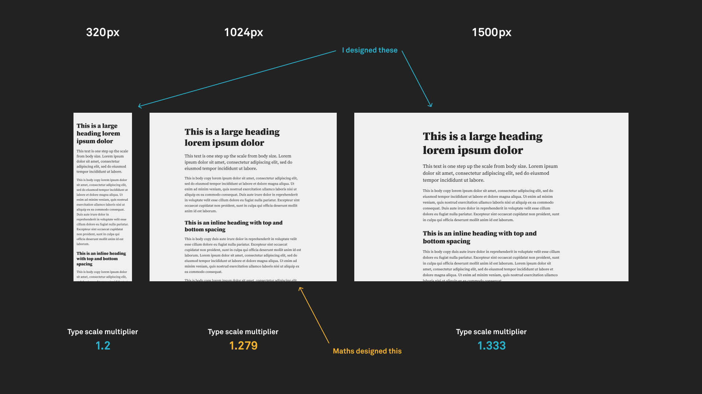
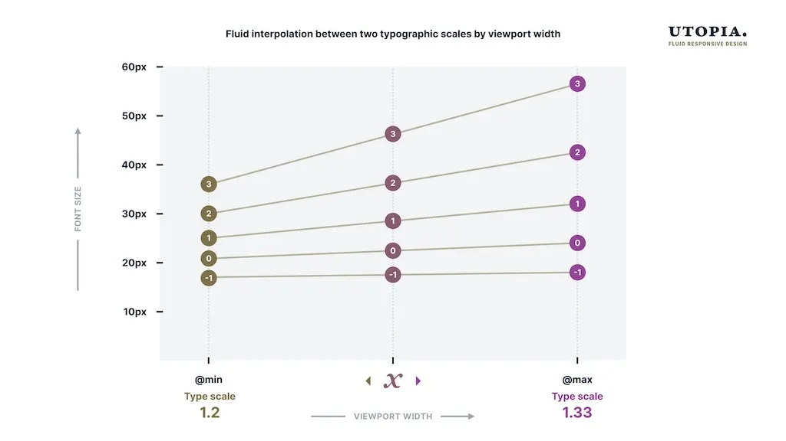
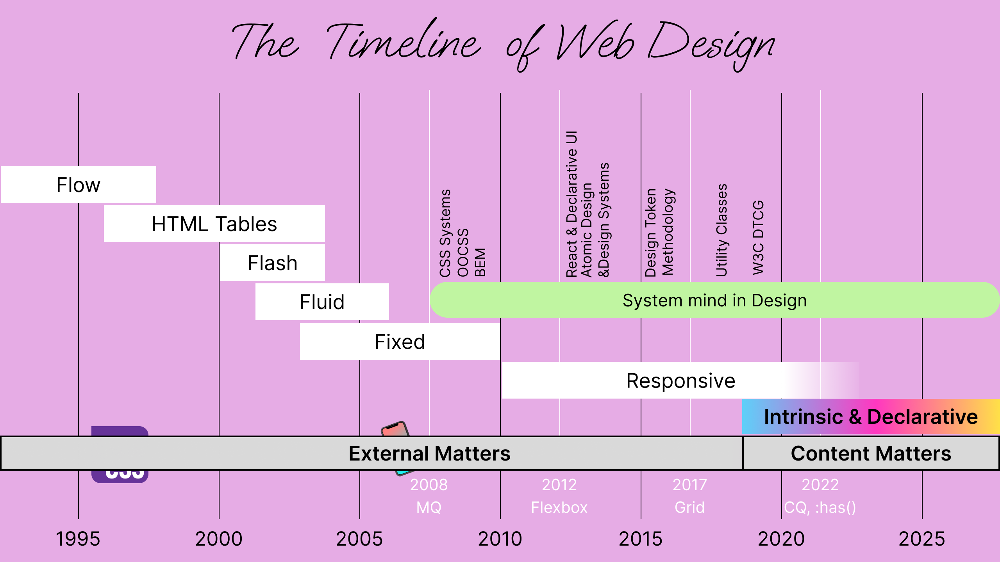

## Table of Contents

## はじめに

:::note{.message}
🌏 この記事は CSS Advent Calendar の 23 日目の記事です。
:::

## Thoughts in Common around Recent Web Design -- Intrinsic Web Design/Every Layout/Utopia

Intrinsic Web Design が Jen Simmons によって提唱されたあたりから、単なる Breakpoint ベースの Responsive から脱却した Web Design に関する考察が活発になり、様々な思想や理論が提唱されるようになりました。

[Every Layout](https://every-layout.dev/) や [Utopia](https://utopia.fyi/) のアプローチはその代表的な例です。

Intrinsic Web Design は、Web Design における「コンテンツ自体が本来持つ性質や値を利用する」という考え方でした。

Every Layout は、CSS 固有の性質を生かしながら、いかにして効率的で堅牢なレイアウトの実装が可能かをパターン化して提示したものでした。

- [Axioms: Every Layout](https://every-layout.dev/rudiments/axioms/)

Utopia は、Web Design における「上限から下限のスケーリング」を計算式として表現したものでした。


_出典： [Designing with fluid type scales | Utopia](https://utopia.fyi/blog/designing-with-fluid-type-scales)_

そして、これら Intrinsic Web Design や Every Layout、Utopia のアプローチには、いくつかの共通点が存在することを、2022年に Jeremy Keith が示します。

### 1. Give up Control

まず、これらの考え方では、意図的に「**制御を手放すこと**」をしています。

Utopia のスケーリングを例にとると、最小値と最大値を指定するだけで、中間の値はすべて計算式によって決まります。
Viewport が 768px のとき何px かどうかは不明ですが、最小 1rem・最大 1.5rem の間において流動的な変化になるよう、 Viewport に合わせたスケーリング式が導出されます。

```css
font-size: clamp(1.2rem, 0.5rem + 0.666vw, 1.33rem);
```


_出典： [Designing with fluid type scales | Utopia](https://utopia.fyi/blog/designing-with-fluid-type-scales)_

Intrinsic Web Design にも一貫して同様の特徴がありました。
例えば、カラムレイアウトを実現する際、Media Query を用いて、それぞれの画面幅の場合に要素の幅を指定するといったことは行いません。
**コンテンツの量や幅に応じる**ことができる、Grid などの利用を推奨しています。

- [Day 22 / Intrinsic Web Design - Beyond Responsive and Embrace the nature of the Web | @sakupi01.com](https://blog.sakupi01.com/dev/articles/2025-css-advent-22)

特定の画面幅や状況における結果の出力を目指すのではなく、**ルールのみを設定し、あとはシステムに最適化を委ねる**ことを重視している点が共通です。

### 2. Remove Assumptions

これは、デザインに潜在する「**前提や制約を取り除く**」ことにも繋がります。

従来のデザインは「Viewport は 1024px」「デフォルト font-size は 16px」「writing-mode は左から右」といった前提の上に成り立っていました。
rem や logical property が登場する前の CSS では、こうした前提なしにデザインを表現する手段が限られていたことに加え、
デザインツールは、ブラウザのように実際の表示環境を変数として知ることもできなければ、それらを利用したレンダリングエンジン内で行われる複雑な計算をシミュレートすることもできません。

例えば、ボタンを以下のようにスタイルするとします。
font-size が 16px、左側の padding が 16px のボタンのスタイルであり、特に何の問題もないかもしれません。

```css
button {
  font-size: 16px;
  padding-left: 16px;
}
```

しかし、16px は、本当に「16px」を意図しているのでしょうか？ padding-left は、本当に「左側」に付与したいのでしょうか？

もし、デフォルト font-size が 16px であることや、LTR であることを前提としているのであれば、`writing-mode: vertical-rl;` といった想定外の状況でデザインが破綻するでしょう。

現在の CSS では、本来のデザインの意図を「文章の始まりに、ブラウザのデフォルト font-size 分だけ padding を設ける」というようにセマンティックに解釈できれば、以下のように書くことができます。

```css
button {
  font-size: 1rem;
  padding-inline-start: 1rem;
}
```

このように**セマンティックな宣言**にできると、様々な表示環境においても、**ブラウザに意図した結果の導出を委ねる**ことができます。

### 3. Fault Tolerance

想定外の状況に対応できるということは、言い換えるならば「**Fault Tolerance（耐障害性）**」 があるということです。

Responsive Web Design では、「Viewport が 320px から 1920px の間で変化する」といった、「想定された範囲内」での変化に対して、Media Query を用いて対応してきました。
しかし実際には、Media Query 定義外の画面幅やユーザ設定の変更、アクセシビリティ機能の利用など、想定/表現できない状況は計り知れないほど存在します。
そうした想定外の状況に直面した時、Media Query によって定義されたルールは適用されず、`padding-left` は左側に固定され、`font-size: 16px;` はユーザ設定を反映しきれないかもしれません。

Intrinsic Web Design や Every Layout、Utopia では、コントロールを手放し、特定の前提に依存しないことで、**想定外の状況においても、バグを生みにくいデザインにする**ことを目指しているとも言えます。

## Declarative Design

これらの共通項を、**Declarative（宣言的）** という単語によって表現したのが、Jeremy Keith の提唱した **Declarative Design** です。

- [Jeremy Keith: Declarative Design - YouTube](https://www.youtube.com/watch?v=pzRsvoyQGsg)

### Imperative vs Declarative

プログラミングには、Imperative と Declarative の大きく分けて二つのアプローチがあります。

Imperative なアプローチでは、「配列を作り、ループして、条件をチェックし、結果を返す」ように、**具体的な手順を逐一指示するもの**です。
多くのプログラミング言語はこれにあたり、JavaScript もその一つです。

```js
const results = [];
for (let i = 0; i < items.length; i++) {
  if (items[i].condition === true) {
    results.push(items[i]);
  }
}
return results;
```

対して、Declarative なアプローチは、欲しい結果だけを記述し、具体的な処理はシステムに委ねます。
つまり、Declarative であるということは、「出力」を制御しようとするのではなく、**「適切な入力」を「宣言する」こと**に焦点を当てているともいうことができます。

例えば、SQL のようなクエリ言語は、「条件が真の項目を選択する」のように記述する、典型的に Declarative な言語です。

```sql
SELECT * FROM items WHERE condition = true
```

### CSS is Declarative and Fault Tolerant

「適切な入力」を「宣言」し、具体的な処理をブラウザに委ねる -- これは、ブラウザに「Hints」を「Suggest」し、「Influence」を与える、CSS の本質と同義であると捉えることができます。

- [CSS is Hints. CSS is Suggestions. CSS is Optional. / Day 3 / CSS is Optional. Protect the Content! | @sakupi01.com](https://blog.sakupi01.com/dev/articles/2025-css-advent-3#css-is-hints-css-is-suggestions-css-is-optional)

よって、CSS は宣言的な言語であるといえます。

CSS は宣言的な言語として、「何を達成したいか」を記述し、「どのように達成するか」はブラウザに委ねます。
この宣言的な性質により、異なる環境や条件下でも、ブラウザが最適な方法で意図を実現できる柔軟性を持っています。

---

Media Query/Container Query/`if()`/etc のような条件分岐、`calc()`/`sin()`/`pow()`/`sign()`/etc の計算を行う関数なども、最終的にはこの宣言的な性質の一部として解釈できます。

条件分岐を例にとると、Imperative な言語では「A の場合には B を実行する」という条件分岐が制御フローの一部として存在し、その値を以て処理が実行されます。
そして、最終的な出力は、条件分岐の結果に依存して決定されます。

しかし、CSS には、**「実行する」という概念がありません**。
「A の場合には B を有効とする」という条件は存在しても、その値が後続の何かの実行や活性に影響を与えるわけではありません。
さらに、出力（スタイルルールが適用されるかどうか）の最終決定権は、ブラウザにあります。

例えば、`@media` や `@container` は [Conditional Group Rules](https://drafts.csswg.org/css-conditional-3/#conditional-group-rule) であり、Rules ([Qualified Rule](https://drafts.csswg.org/css-syntax/#qualified-rule)) は「宣言のチャンク」です。

> qualified rule
>
> A qualified rule has a prelude consisting of a list of component values, **a list of declarations**, and a list of child rules.
>
> [CSS Syntax Module Level 3](https://drafts.csswg.org/css-syntax/#qualified-rule)

「宣言」のチャンクに対する条件であるため、条件分岐の結果が後続の何かの実行/活性に影響を与えることもなければ、最終的な値として採用されるかを制御することもできません。

最終的な値を制御できないことは、実際のコードで考えてもわかります。

```css
/* stylesheet.css */

@media (width > 768px) {
  .card {
    padding: 2rem;
  }
}

@container (width > 500px) {
  .card {
    padding: 3rem;
  }
}

.card {
  padding: if(style(--condition: true): 4rem; else: 1rem;);
  padding: 5rem;
}
```

- "画面幅が" 768px 以上の時は 2rem に
- "コンテナが" 500px 以上の時は 3rem に
- `--condition` が true の時は 4rem に
- それ以外は 1rem に
- だけど、宣言順序によって**最終的には 5rem に**

よって、条件分岐や関数も、CSS においては制御フローの一部ではなく、適用される宣言をブラウザに委ねるための「宣言」という立ち位置で論じることとします。

### Being Declarative achieves Full Flexibility in Designing on the Web

Intrinsic Web Design や Every Layout、Utopia のメンタルモデルには、次のような考え方が含まれています。

> To design “adaptable pages” (Allsopp’s term), we must relinquish control to the algorithms (like text wrapping) browsers use to lay out web pages automatically.
> But that’s not to say there’s no place for _influencing_ layout.
>
> **Think of yourself as the browser’s mentor, rather than its micro-manager.**
>
> Andy Bell -- [Axioms: Every Layout](https://every-layout.dev/rudiments/axioms/)

> We say CSS is “declarative”, but the more and more I write breakpoints to accommodate all the different ways a design can change across the viewport spectrum, the more I feel like I’m writing imperative code.
> **At what quantity does a set of declarative rules begin to look like imperative instructions?**
>
> In contrast, one of the principles of Utopia is to **be declarative and “describe what is to be done rather than command how to do it”**.
> This approach declares a set of rules such that you could pick any viewport width and, using a formula, derive what the type size and spacing would be at that size.
>
> Jim Nielsen -- [Thoughts on Exerting Control With Media Queries - Jim Nielsen’s Blog](https://blog.jim-nielsen.com/2022/exerting-control-with-media-queries/)

> Intrinsic: belonging to **the essential nature or constitution of a thing**
>
> -- [intrinsic - Merriam-Webster](https://www.merriam-webster.com/dictionary/intrinsic)

**「何をするか」を宣言するブラウザのメンター**として振る舞い、「どのようにするか」の具体的な手順を指示するマネージャになることを避ける -- つまり、**宣言的になる**ことで、CSS の**本質（Intrinsic）に基づいた**、 真に**Fault Tolerant な柔軟性**を持つデザインが可能になるということができます。

### Mindset Shift

このアプローチを実現するためには、デザインに「**マインドセットの転換**」を求めなければなりません。

デザインツールは、特定の条件下でのビジュアル結果を作成することに特化しています。
実際のユーザー環境の多様性（OS、デバイス、ユーザー設定、アクセシビリティ機能、etc）をすべてシミュレートすることは困難です。

しかし、前提をコントロールしていては、CSS の本質（Intrinsic）に基づけず、Fault Tolerant で柔軟なデザインは実現できません。
よって、想定外の状況において、期待したデザインをユーザに届けることができない可能性が否めなくなります。

従って、前提をコントロールせず、期待した出力をブラウザに委ねるための「**宣言をデザインする**」ことが求められます。

これを実現するために、Every Layout では、「ビジュアル的な成果物を作成する代わりに、**成果物の特徴**を構成する」ものとして Web Design を考えると表現しています。

> Designing without seeing:
>
> Designing by axiom requires something of a **mental shift**.
> Axioms do not directly create visual artefacts, **only the characteristics of artefacts** that might emerge.
>
> Andy Bell -- [Axioms: Every Layout](https://every-layout.dev/rudiments/axioms/)

このデザインのマインドセットを示したのが、**Declarative Design** です。



## Can't be Declarative to the Containers ... Now, Resolved.

Declarative Design は、CSS が宣言的であることを前提に主張可能な考え方です。
そして、CSS の宣言的な性質が露出されればされるほど、Declarative Design は実現しやすくなります。
なぜならば、宣言の方法に幅が広がるほど、**「適切な入力」を「宣言する」** ことが容易になるからです。

コンポーネント志向が定着して以来、この「宣言方法」として圧倒的に欠落していたのが、「**コンテナに対してコンテンツが宣言的になる**」機能でした。

Box（コンテナ）と Content（コンテンツ）は、Flow によって実装レベルで非常にタイトに結びついており、それが原因となって、コンテナを Query してコンテンツを制御することが困難でした。（Day 22 を参照）

この問題に対して対処する議論が、2020年ごろから本格的に始まり、David Baron の `@container` と Brian Kardell の `switch()` の2つのアプローチが検討されました。

- [dbaron/container-queries-implementability: Proposal for container queries designed to be implementable in web browsers](https://github.com/dbaron/container-queries-implementability)
- [All Them Switches: Responsive Elements and More](https://bkardell.com/blog/AllThemSwitches.html)

この中でも、CSS Containment を利用する `@container` のアプローチを継承して提案されたのが、Miriam Suzanne の提案です。

- [[css-conditional] [css-contain] Fleshing out @container queries with single-axis containment · Issue #5796 · w3c/csswg-drafts](https://github.com/w3c/csswg-drafts/issues/5796)

[CSS Containment](https://developer.mozilla.org/en-US/docs/Web/CSS/CSS_containment) は、要素の内部で発生する変更が外部に影響を与えないよう「封じ込める」仕組みです。

通常、CSS では子要素のサイズやスタイルの変更が親要素に影響を与えます（e.g. 子要素のテキストが増えると親要素の高さも増える）。
これは Flow レイアウトの基本的な性質ですが、Container Queries では「親のサイズを基準に子のスタイルを変更する」必要があるため、循環参照の問題が生じていました。

CSS Containment の `contain: size layout style;` を使用すると、Flow によって生じる Size/Layout/Style における双方向の依存関係を断ち切ることが可能です。

- **Size Containment**: 子要素のサイズ変更が親要素のサイズに影響しない
- **Layout Containment**: 要素内部のレイアウト変更が外部に影響しない
- **Style Containment**: カウンターなどのスタイル情報が要素の境界を越えない

これにより、Box と Content の間の双方向の依存関係を断ち切り、これまで Container Queries で問題になっていたレイアウト時の循環を防ぐことが可能になると考えられました。

しかし、Size Containment は Intrinsic な Sizing を完全に制限してしまうため、Content が Container のサイズを決定できなくなってしまいます。

例えば、以下にて、`contain: size layout style;` のコメントアウトを外すと、Size Containment が有効になり、Container の Sizing に「CSS is Awesome」のコンテンツサイズが利用されなくなることがわかります。

<p class="codepen" data-height="300" data-default-tab="css,result" data-slug-hash="empKmOg" data-pen-title="CSS is Awesome" data-user="sakupi01" style="height: 300px; box-sizing: border-box; display: flex; align-items: center; justify-content: center; border: 2px solid; margin: 1em 0; padding: 1em;">
  <span>See the Pen <a href="https://codepen.io/sakupi01/pen/empKmOg">
  CSS is Awesome</a> by saku (<a href="https://codepen.io/sakupi01">@sakupi01</a>)
  on <a href="https://codepen.io">CodePen</a>.</span>
</p>
<script async src="https://public.codepenassets.com/embed/index.js"></script><br />

循環を断ち切るために Size Containment を利用しては、コンテンツがコンテナを overflow してしまうような、望ましくない結果を招いてしまいます。
これは、Size Containment がブロック方向・インライン方向の両方を封じ込めてしまうため、封じ込められたら絶対に Flow する余地がなくなってしまうからです。

そこで考えられたのが、コンテナのインラインサイズのみ封じ込め、ブロック方向には Flow を許可する、`contain: inline-size;` でした。

`contain: inline-size layout style;` とすることで、ブロック方向に Flow する余地を残して overflow を防ぎつつ、レイアウトの循環を断ち切ることが可能になります。

```css
.container {
  contain: inline-size layout style;
}
```

煩雑な Value 指定を避け Declarative にコンテナをクエリするため、Container Queries では以下のように `container-type` を指定します。
Containment の機能としては、上記と変わりません。

```css
.container {
  container-type: inline-size;
}
```

Container Size Queries を利用する際に記述する `container-type: inline-size;` は、Box が Content のインラインサイズに依存することをキャンセルし、Content が Box のインラインサイズをクエリ可能にすることを意味します。

このような背景により、CSS Container Queries は [CSS Containment Module](https://www.w3.org/TR/css-contain-3/#container-queries) の一部として仕様策定されています。

実装上の課題を CSS Containment によって克服し、「コンテナに対して宣言的なコンテンツ」を実現可能にした CSS Container Queries は、Declarative な Design の幅を大きく広げる機能です。

## Appendix

- [Adactio: Journal—Declarative design](https://adactio.com/journal/18982)
- [Adactio: Journal—Declarative design systems](https://adactio.com/journal/19131)
- [Adactio: Journal—Design systems roundup](https://adactio.com/journal/16400)
- [Declarative Design. A presentation given at the final An… | by Jeremy Keith | Medium](https://adactio.medium.com/declarative-design-a8c363e70bbd)
- [Be the browser’s mentor, not its micromanager. - Build Excellent Websites](https://buildexcellentwebsit.es/)
- [CSS Container Query Proposal & Explainer](https://css.oddbird.net/rwd/query/explainer/)

---

<advent-calendar-2025 />
