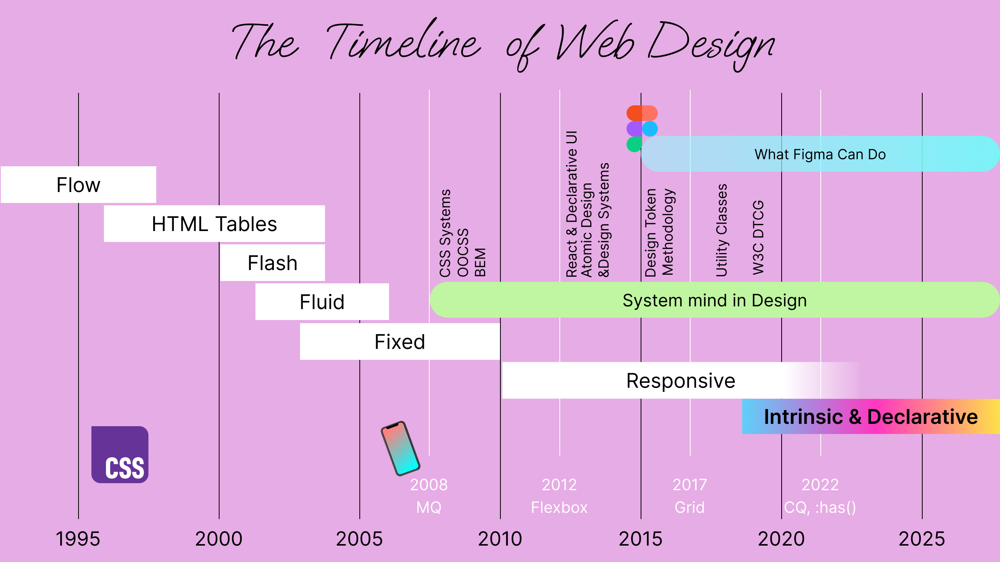
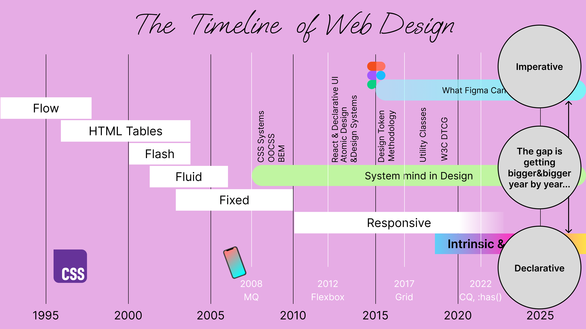
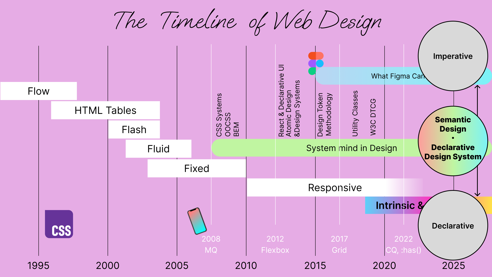

## Table of Contents

## はじめに

:::note{.message}
🌏 この記事は CSS Advent Calendar の 24 日目の記事です。
:::

[Day23](/dev/articles/2025-css-advent-23) では、CSS が Declarative であること、その特徴を活かした Declarative な Web Design をすることで、Declarative であるという CSS の性質に基づいた、Fault Tolerant で柔軟性を備えたデザインが可能になると述べました。

Declarative な Web Design というマインドセットのシフトに対して、実際にどのようなアプローチをとっていけるのでしょうか。
今回は、デザインツールの現状と、Design System を通じて、Declarative な Web Design を実現するための一つのアプローチを考察しています。

## Design Tools

デザインツールと言っても様々ですが、今回論じたい内容はどのツールを取ってもほとんど変わらないため、ここでは Figma を例に話します。

Figma においては、Layer や Component, Property, Swap Component などといった形で、Component-driven に即したデザインを可能にする機能をうまく実装しています。

こうした「情報・データの整理」は、Web アプリケーションの得意とするところであり、デザインツールによって、コンポーネント単位でデザインの再利用が容易になりました。



しかしながら、デザインツールで作成したコンポーネントが、コンポーネントの実装時にそのまま参照可能かというと、そうではありません。
なぜならば、そこにはデザインツールとブラウザの間で、目的と制約が異なるからです。

これまでに見てきたように、ブラウザは、ユーザのあらゆる状況という「未知の変数」を入力としています。
CSS だけでも Value Processing や Cascade と、その他膨大な計算がレンダリングエンジンでなされており、それの計算結果が画面に出力されています。

そして、デザインツールがこの出力を完全に再現することは、現時点では困難です。
デザインツールは静的なデザインの作成と管理に最適化、ブラウザは動的なコンテンツの実行と表示に最適化されており、互いに相補的な関係にあります。

## The Gap

Web Design という文脈において、CSS が「Declarative なツール」であれば、デザインツールは値やフレームサイズなどの表示要件を具体的に指示する「Imperative なツール」であるといえます。
いくら Auto Layout や Grid、Hug/ Fill Container のような機能が Figma に追加されても、背後の処理はブラウザエンジンのそれと異なり、機能は CSS の仕様に従っているわけではありません。
こうした事情があるため、デザインツールの Flexbox/Grid/Intrinsic Sizing/etc は CSS のような Declarative さを再現して機能しません。

デザインツールは Imperative であるという制約とその目的から、Declarative な CSS の進化に追いつくことは困難です。
CSS で Declarative に表現できることが増えれば増えるほど、その差は拡大していく一方でしょう。



このような技術的制約により、デザインツール単体では CSS の持つ Declarative な特性を完全に表現することは難しく、「Declarative Design」の実現には別のアプローチが必要となります。

## Bridging the Gap between Design and CSS

ここで、これまで本連載で触れてこなかった「Design System」という存在ついて触れておきます。
なぜならば、CSS とデザインの仲立ちとなる要素である Design System は、理論的には、この問題を打開するために役立つ可能性があるからです。

### Design System

Design System という言葉自体は非常に幅を持っており、組織やチームによって異なる解釈をすることができます。

Figma の表現を引用すると、Design System の役割は「一貫した製品や体験の外観と感触を維持するための、構成要素と標準のセット」です。

> At its core, a design system is **a set of building blocks and standards** that help **keep the look and feel of products and experiences consistent**.
>
> [What Is a Design System | Design Systems 101 | Figma Blog](https://www.figma.com/blog/design-systems-101-what-is-a-design-system/)

また、Jeremy Keith の言葉を借りると、Design System は「Outer Circle」であり、パターンとその連携を伝えるためのさまざまな要素を包含することができるものです。

> The generally-accepted definition of a design system is that **it’s the outer circle** — it encompasses pattern libraries, style guides, and any other artefacts. But there’s something more.
> Just because you have a collection of design patterns doesn’t mean you have a design system.
> **A system is a framework.**
> **It’s a rulebook.**
> **It’s what tells you how those patterns work together.**
>
> Jeremy Keith -- [Design Systems | Brad Frost](https://bradfrost.com/blog/link/design-systems/)

具体的には、以下のような要素で構成されることが一般的です。

- コンポーネントライブラリ: 再利用可能な UI パーツとその振る舞いの定義
- デザイントークン: Color、Typography、Spacing などの最小単位の値を定義したもの
- ガイドライン: アクセシビリティガイド、スタイルガイド、ブランドガイド、レイアウトガイドなど、原則や指針を示したもの
- ドキュメンテーション：デザインシステム構成要素の使い方やベストプラクティスを説明した資料
- etc

デザイントークンに関しては、W3C の Community Group が存在し、フォーマットの標準化が進められています。
DTCG(Design Token Community Group) の定義を引用すると、デザイントークンは「プラットフォームに依存しない方法でデザインの決定を表現するための方法論」です。

> Design tokens are **a methodology for expressing design decisions in a platform-agnostic way** so that they can be shared across different disciplines, tools, and technologies.
> They help establish **a common vocabulary across organisations**.
>
> [Design Tokens Format Module](https://second-editors-draft.tr.designtokens.org/format/#introduction)

Salesforce Lightning Design System の創設者であり、DTCG の Chair でもある Jina Anne の説明も、デザイントークンを理解する上で参考になります。

- [WTF are Design Tokens? - YouTube](https://www.youtube.com/watch?v=q5qIowMyVt8&t=16s)

本記事では、上記のような要素から構成されるものを Design System として扱います。

この Design System のコンポーネントやデザイントークンを、予め「正しく」構築しておけば、あらゆる状況において一貫したデザインをすばやく展開することができます。
しかしこの、「正しい」という言葉には解釈の余地があります。

### Design System has to be ...

**Imperative な考え方**で Design System を構築すると、「正しい」は「緻密な」という意味合いになります。
デザインツールと強く結合した Design System では、Imperative な考え方の Design System になりやすいです。
この場合、特定の Viewport に基づいたピクセル値でのスペーシングや rem でのフォントサイズ、hex でのカラー指定など、デザインツールが表現できる範囲で「**緻密な Design System**」が定義されます。

**Declarative な考え方**で Design System を構築すると、「正しい」は「柔軟な」という意味合いになります。
Declarative であるという CSS の性質を利用した Design System は、Declarative な考え方の Design System になりやすいです。
この場合、あらゆる Viewport でもコンテナに対して違和感のないように変化するスペーシングや、コンテナの幅に応じて変化するフォントサイズ、ユーザの環境において最適な色域など、CSS の Declarative なポテンシャルを最大限に活かした「**Fault Tolerant で柔軟な Design System**」が定義されます。

---

例として、カードコンポーネントの作成を考えます。

Imperative な考え方のコンポーネントでは、出力結果の完璧さが問われます。
特定の Viewport に対して完璧なスタイルを実現するためには、「Media Queries」を利用してコンポーネントを構築するのが最適です。
よって、Imperative な Design System のコンポーネントでは、Media Queries の利用をしたり、モバイルと PC で異なるスタイルシートやデザイントークンを適用したりするでしょう。

一方、Declarative な考え方でコンポーネントを作ると、Viewport やデバイスによってスタイルシートを変更したくなることはありません。
なぜならば、その画面やデバイスでない場合に適用したスタイルが壊れてしまい、Fault Tolerant でないコンポーネントになるからです。
よって、Declarative な Design System では、コンテナに対して柔軟なコンテンツを宣言するために「Container Queries」を利用したり、`min()`, `max()`, `clamp()` などの関数を利用したりして、Viewport に依存したスタイルを避けるでしょう。

以下の例では、Media Queries を利用した Imperative なコンポーネントと、Container Queries を利用した Declarative なコンポーネントを示しています。

<p class="codepen" data-height="600" data-default-tab="result" data-slug-hash="MYaXoPw" data-pen-title="Media or Container" data-user="sakupi01" style="height: 600px; box-sizing: border-box; display: flex; align-items: center; justify-content: center; border: 2px solid; margin: 1em 0; padding: 1em;">
  <span>See the Pen <a href="https://codepen.io/sakupi01/pen/MYaXoPw">
  Media or Container</a> by saku (<a href="https://codepen.io/sakupi01">@sakupi01</a>)
  on <a href="https://codepen.io">CodePen</a>.</span>
</p>
<script async src="https://public.codepenassets.com/embed/index.js"></script>

---

Design System の別の構成要素である、デザイントークンも例にとってみましょう。

Imperative な考え方のデザイントークンでは、出力の完璧さが重要になるため、出力結果がそのままデザイントークンに反映されるでしょう。
カラーであれば `--button-color-primary: #ff4081;` 、`--button-color-secondary: #ff4081;` 加えて、それぞれに対するホバー状態やフォーカス状態などのバリエーションも定義されるかもしれません。

対して、Declarative な考え方のデザイントークンでは、出力の完璧さは、ルールセットほど重要視されません。
あらゆる状況でデザイントークンの意図が保たれるように、より抽象的な値でデザイントークンを定義するでしょう。
以下の例では、button の Color には次のような意図があります。

「通常状態では、Primary Color または Secondary Color のいずれかを使用する。ホバー状態では、背景色を元の色より 20% ダークにすることで、インタラクティブであることを示す。」

極端な例を挙げると、これは CSS で以下のようにエンコードできます。

```css
:root {
  /* global tokens */
  --pink-color-hue: 10;
  --pink-color-saturation: 80%;
  --pink-color-lightness: 80%;
  --green-color-hue: 70;
  --green-color-saturation: 40%;
  --green-color-lightness: 80%;

  /* semantic tokens */
  --semantic-primary-color: hsl(
    var(--pink-color-hue) var(--pink-color-saturation)
      var(--pink-color-lightness)
  );
  --semantic-secondary-color: hsl(
    var(--green-color-hue) var(--green-color-saturation)
      var(--green-color-lightness)
  );
}

button {
  --button-color: if(
    style(--state: primary): var(--semantic-primary-color) ;
      else: var(--semantic-secondary-color)
  );
  --state: primary; /* or secondary */
  background-color: var(--button-color);

  &:hover {
    --button-color-hover: color-mix(in hsl, var(--button-color) 90%, black 10%);
    background-color: var(--button-color-hover);
  }
}
```

---

これら2つの Design System のアプローチは根本的に異なるものですが、いずれの成果物も「Design System」になり得ます。

もしデザイナや開発者が Imperative な考え方を持っていて、Figma が Single Source of Truth と考えられているなら、Imperative Design System の方が適しているかもしれません。

しかし、CSS や HTML の観点からデザインを考えることができるチームがあるのであれば、Declarative Design System を構築できるポテンシャルがあると思います。

### How Declarative Design System relates to Design?

混乱を避けるため、ここで扱う用語の整理をしておきます。

1. **Design**: Figma で作成される個別の画面や UI。現状では、 Imperative に作成されるもの。
2. **Web Design**: Web 上のデザインのあり方に関するマインドセットや哲学。
3. **Design System**: デザインの一貫性を保つためのコンポーネント・トークン・ガイドライン・etc の集合体。

Web の特性上、Web を完全に制御することができない点は、本連載でも度々触れてきました。

[Day23](/dev/articles/2025-css-advent-23) で詳しく述べましたが、Declarative Web Design の核心は、**前提に基づいた制御を排除**し、出力のための詳細を**ブラウザに委ねる**ための「**宣言をデザインする**」ことです。
Web を前提とした Design System ならば、Web の持つ「未知の変数」に対しても柔軟に・最適に対応することを目指す Declarative な Design System は目指すべきものであると、個人的には考えています。

しかし、Design System 自体が Declarative であっても、それだけで Declarative な Web Design という哲学が達成されるわけではありません。
なぜならば、Design System は Design を捉えたルールの集合体であるからです。

では、Declarative Design System を通じて、Declarative Web Design を実現するには、どのように Design を捉えれば良いのでしょうか？

## Design has to be Semantic

ここ数年で、CSS の機能は飛躍的に増え、これまで Imperative に実装していた/できなかったことを、Declarative に表現できる幅が広がりました。

そんな CSS をフル活用した「Declarative な Design System」を構築するためには、CSS で「**何を**」Declare しているのかを明確にすることが大事です。

例えば、Form Input のデザインで考えてみます。
「入力欄の幅を 280px にしたい！」というデザインがあったとき、デザインをそのまま CSS に翻訳すると、以下のようになります。

```css
.input {
  width: 280px;
}
```

しかし、なぜ 280px なのか？
この「デザインの意図」を考えると、「フォーム全体の幅の約半分にしたかった」あるいは「長すぎず短すぎない、ちょうど良い幅にしたかった」などといった理由が見えてくる可能性があります。
そうして、「デザインの意図」を解釈できると、より適切な CSS に翻訳できます。

```css
.input {
  width: min(50cqw, 20rem);
}
```

こうすることで、コンテナの幅が変わってもフォームの意図に従った適切な幅を保つことができます。

---

別の例として、カードコンポーネントの間のスペーシングを考えてみましょう。

「カード同士の間隔を 16px にする」というデザインも同様です。
デザインをそのまま CSS に翻訳すると、以下のようになります。

```css
.card + .card {
  margin-top: 16px;
}
```

しかし、この固定値の背景には、「適度な余白で見やすくしたかった」あるいは「画面サイズに関係なく調和を保ちたかった」という、何かしらの「デザインの意図」が存在するはずです。
「デザインの意図」をここまで解釈できると、より適切な CSS に翻訳できます。

```css
.card-container {
  container-type: inline-size;
  display: grid;
  gap: clamp(0.5rem, 2cqw, 1.5rem);
}
```

このように、デザインの「意図」を理解することで、デザインを、 CSS で Declare するルールに「翻訳」することができます。
結果、意図に沿った適切な CSS を適用できるようになり、Declarative な Design System の構築が望めます。

---

注意しなければならないのは、デザインの「意味づけ」のレベルは、 CSS でサポートできる機能に合わせて調整されるということです。

例えば、「コンテンツに応じて柔軟に変化する幅」という理想的な意図があった場合、Container Queries & Units が利用可能なら、個々のコンポーネントを `width: clamp(20ch, 50cqw, 30ch)` のように表現できます。
しかし、Container Queries が利用可能でないならば、Flexbox を用いて `flex: 1 1 20ch; max-width: 30ch` と表現するかもしれません。
つまり、CSS の持ち得る表現の幅に合わせて、適切な粒度でデザインを「意味づけ」することが必要です。
言い換えると、**CSS が Declare できるレベルまで**、デザインの「意味」を解釈し続ける必要があるということです。

## Semantic Design is the Foundation of Declarative Design Systems & Declarative Web Design

ここまでの例から、Declarative な Design System や Web Design を実現するには、デザインが「なぜそうなっているのか」という**意味（Semantic）**を理解することが不可欠だと言えます。



Container Queries や `:has()` の登場によって、「コンポーネントの設計の仕方が変わる」という主張もあるかもしれませんが、Declarative な Design System や Web Design を実現する上での基本的な考え方は変わりません。

例えば、デザインの意図が「いかなる状況でも 300px で固定であること」である場合、それを単純に `width: 300px` と翻訳すれば十分です。
Container Queries が利用可能になったからといって、コンテナが固定幅のコンポーネントに対して、Container Queries に翻訳できるまでデザインを意味づけしても旨みがありません。

新しい CSS の機能は、その機能が「デザインの意図」をより適切に表現できるのであれば使用できると思います。
CSS の新機能を絶対的な技術として捉えるのではなく、「デザインの意図を適切に宣言するための手段」として捉えることが重要だと、筆者は考えています。

## Appendix

- [Adactio: Journal—Declarative design systems](https://adactio.com/journal/19131)
- State of CSS
  - [2022](https://2023.stateofcss.com/en-US/)
  - [2023](https://2024.stateofcss.com/en-US/)
  - [2024](https://2025.stateofcss.com/en-US/)
  - [2025](https://2026.stateofcss.com/en-US/)
- What's New in Web UI/CSS
  - [2022](https://developer.chrome.com/blog/insider-july-2022)
  - [2023](https://developer.chrome.com/blog/whats-new-css-ui-2023)
  - [2024](https://developer.chrome.com/blog/new-in-web-ui-io-2024)
  - [2025](https://developer.chrome.com/blog/new-in-web-ui-io-2025-recap)

---

<advent-calendar-2025 />
