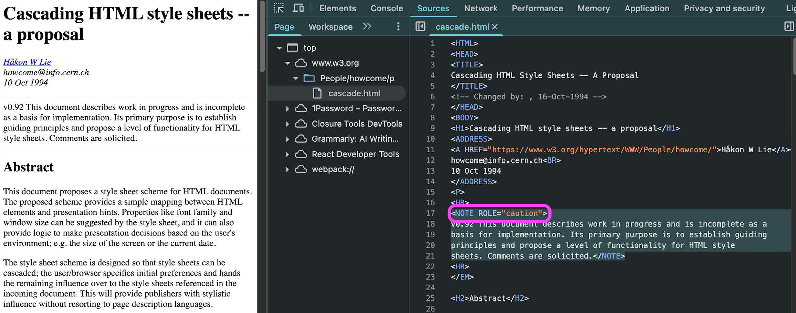
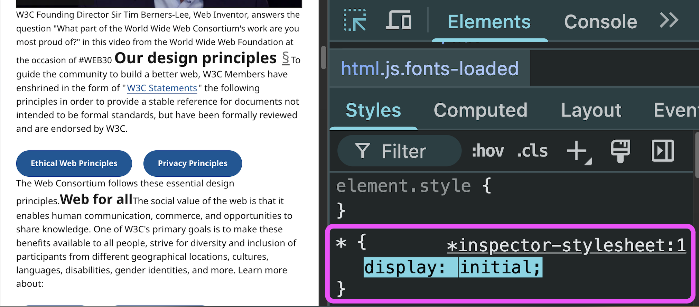

## Table of Contents

## はじめに

:::note{.message}
🎨 この記事は CSS Advent Calendar の 3 日目の記事です。
:::

## CSS is *Hints*. CSS is *Suggestions*. CSS is *Optional*

CHSS では、今日の CSS の主要概念である 「Cascade」が導入されました。CHSS のプロポーザルを読んでいくと、あるニュアンスが繰り返し伝えられているように感じられます。

- [Cascading HTML Style Sheets -- A Proposal](https://web.archive.org/web/20231228175110/https://www.w3.org/People/howcome/p/cascade.html)

> The proposed scheme provides a simple mapping between HTML elements and presentation **hints**.

> Properties like font family and window size **can be suggested** by the style sheet, and it **can** also provide logic to make presentation decisions based on the user's environment

> the user/browser specifies initial preferences and hands the remaining **influence** over to the style sheets referenced in the incoming document.
>
> This will provide publishers with stylistic **influence** without resorting to page description languages.

> Indeed, if conflicts arise **the user should have the last word**, but one should also allow the author to attach style **hints**.

「Hints」「Suggest」「Influence」といった単語が頻出しているのが見て取れます。

実はこの表現が出てきたのは CHSS が始めてのことではなく、 Web 史上最初のスタイルシートとして紹介した、Robert Raisch の RFC でも同様の表現が見られました。時には ALL CAPS で書かれているなど、明らかな強調っぷりで繰り返されているように思います。

- [WWW-Talk Apr-Jun 1993: Request for Comments: STYLESHEETS](https://web.archive.org/web/20240527105838/https://www.w3.org/Style/History/www.eit.com/www.lists/www-talk.1993q2/0445.html)

> an attempt has been made to support a simple subset of generally useful style **HINTS or SUGGESTIONS**.

> **In no way should this proposal be considered an attempt to stipulate *required* behavior**. **The sole purpose of the included format is to suggest behavior** which will allow a browser to render a specific document in a form which more closely **resembles** the document as envisioned by it's creator.

> Styles are **suggestions or hints** about behavior, **not rules**.

> Rather, this is really a set of **HINTS or SUGGESTIONS** to the renderer which **might be used** to display particular HTML objects in the fashion the author of a document originally intended.
>
> [font-family] is not meant as a font name, per se. Rather it is a **suggestion** of a particular style of character representation.

Hints, Hints, Hints...

なぜスタイルシートはあくまで「hint」であり、「force」ではないというニュアンスが繰り返し伝えられているのか。

Håkon Lie のプロポーザルでは以下のような記述があります。

> While **the author** (or publisher) often wants to give the documents **a distinct look and feel**, **the user** will set **preferences to make all documents appear more similar**.
>
> **Designing a style sheet notation that fill both groups' needs is a challenge.**

「個性的な表現を求める Author」と、「一貫性を求める User」という、本質的に対立する 2 つのニーズを同時に満たす記法の設計は非常に困難です。
そのために、CSS はあくまで「hints」として振る舞うものとし、この時点でデザインを "完全に" コントロールする手段となることを諦めていると言っても良いでしょう。

但し、他にはなく Håkon Lie のプロポーザルで特筆すべきは、このゼロサムゲーム的な関係にある2つの要求を可能な限り技術的に解決しようとした点です。

> Indeed, if conflicts arise **the user should have the last word, but one should also allow the author to attach style hints.**
>
> [This] point has especially been a source of much **frustration** among professions that are used to be in control of paper-based publishing. This proposal tries to **soften the tension between the author and the reader** by:
>
> **a)** giving **readers** a richer visual (or auditory and tactile) environment while **they retain control** if necessary, and
>
> **b)** providing **authors and publishers** with **stylistic influence** without resorting to page description languages.
>
> The proposed scheme is **balanced** in the sense that it provides author and reader with **the same notation for specifying style**.

「User も Author も同じスタイル言語で記述するが、User ファーストであることを前提に、Author の意図を尊重しつつ、両者のバランスをとる」

これを実現するために発明されたのが、他でもない **「Cascade」** です。

## The entire Web cannot be broken

ところで、ブラウザはパースできない HMTL タグを無視するようにできています。

`<html>` 配下の要素を全消しして、`<hoge />` などという超適当なタグを挿入しても、なぜかご親切に `<head>` が入り、`<body>` が入り、`<hoge />` が `<hoge></hoge>` に変換されて、その中に文字列なんか入れていてもその文字列がちゃんと表示されます。

*HOGE というタグを使ってコンテンツを表示させている*

`<hoge>` という仕様上存在しないタグを使用しても、ブラウザがエラーを吐いてレンダーが止まるということはなく、ブラウザは黙ってパースできる部分をパースし、できる限りのコンテンツを表示してくれます。

### 30 years old document, yet we can still read it on the Web

line-mode browser で世界初の Web ページとして公開された [World Wide Web](https://info.cern.ch/hypertext/WWW/TheProject.html) のリンク先には、HTML の仕様も含まれています。つまり、これは Web ほぼ初期の HTML 仕様です。

そこには以下のような記述があります。

> WWW parsers[Browsers or Rendering Engines] **should ignore tags** which they do not understand, and **ignore attributes** which they do not understand of tags which they do understand.
>
> [HyperText Mark-up Language](https://info.cern.ch/hypertext/WWW/MarkUp/MarkUp.html)

ここに Web の根本的な設計思想が現れていると思います。

仕様になく、実装もされていないようなタグや属性に遭遇しても、ブラウザは処理を停止せず、理解できる部分を可能な限り表示し続ける。新しい要素や属性が追加されても、古いブラウザでコンテンツが完全に表示されなくなることはない。この 30 年で、HTML は何度もバージョンアップし、パーサすら変え、ブラウザは劇的に進化し、CSS や JavaScript といった技術が誕生したにも関わらず、初期の HTML ドキュメントは今日のモダンブラウザで完璧に表示される。

1991年に公開されたこの世界初の Web ページが、30年以上経った今でも問題なく読むことができるのは、「理解不能なものは無視する」という Web 初期からの設計思想があったからです。

- [The World Wide Web project](https://info.cern.ch/hypertext/WWW/TheProject.html)

*NOTE という今は亡きタグだが、コンテンツは表示される [Cascading HTML Style Sheets -- A Proposal](https://www.w3.org/People/howcome/p/cascade.html)*

### Protect the Content

これは HTML のみに適用される設計思想ではありません。

CSS の Design Principles でも、以下のような記述があります。

> 4.5. **Content should be viewable and accessible by default**
>
> Design CSS properties or CSS layout systems (which are typically values of the display property), to **preserve the content as viewable, accessible and usable by default.**
>
> [Web Platform Design Principles](https://www.w3.org/TR/design-principles/#css-content-should-be-visible)

ゆえに CSS は、デフォルトで「すべてのコンテンツが隠れず表示」されるようなデフォルト値に設定されています。

たとえば、UA スタイルシートが適用される前の display 、（`* { display: initial;}`）でページを表示させると、すべての要素が `display: inline;` にフォールバックします。

- [CSS Display Module Level 3](https://drafts.csswg.org/css-display/#the-display-properties)

*display initial は inline にフォールバックする*

もし display の初期値が `display: block;` であれば、見切れたり、overflow したりするページが発生するでしょう。
しかし、display の初期値は `display: inline;` であるため、見切れることなく、**すべてのコンテンツが表示されることが保証されます**。

これは、**"Content should be viewable and accessible by default"** という Design Principle に基づいた例の一つです。

---

HTML パーサが理解できないものは無視し、CSS が適用できないプロパティがあってもレンダリングを続け、デフォルトではコンテンツの表示を保証し、JavaScript でエラーが発生してもページの表示は保たれる。

つまり、我々が User や Author (または UA 実装者)として書く、 HTML/CSS/JS は、あくまで "Hints" であるということです。

そしてこの "Hints" という思想は、「Protect the Content」という共通の目標から生まれています。この目標からの共通思想が、Web を for **All** であり、 of **trust** であり、 on **everything** にさせ得る所以だと思います。

> The Web for **All**. Web of **trust**. Web on **everything**.
>
> [Our design principles](https://www.w3.org/mission/#principles) | W3C

---

これらの背景を踏まえると、「Cascade」が今日まで生き残り、最重要概念とされる理由が自ずと見えてきます。

Cascade が異なる Origin（(Rendering Results,) User Agent, User, Author）に、**"Hints"** として、スタイルを **"Suggest"** するものだと捉えると、Cascade は CSS のみならず、Web にとっても重要な概念であることがわかります。

したがって、Cascade は Web を Web たらしめる概念を包括するため、我々がそれと調和を図ろうとしないことはタブーとみなすことができます。

しかし、我々にとって CSS は「扱いづらい」ものであったり、それゆえにハックやツールによって「強制する」ものであったり、結果として「いや、もうなんかよくわかんないけどこれでいいや」なものであったりしました。

CSS は本来「hints」として設計されたにも関わらず、我々は長年にわたって CSS を「コントロールする」ものとして扱おうとしてきました。
Cascade の思想を無視した `!important` の乱用、Specificity を力づくで上げる深いセレクタ、命名規則やツールによるグローバルスコープ衝突を避けるための解決策。
これらはすべて、CSS のメンタルモデルである「hints」を「force」に変えるような試みだったと思います。

我々が感じてきた「CSS の扱いづらさ」は、Cascade との調和を図らずにいた（または、Cascade を実用する方法が存在しなかった）ゆえの、苦悩の結果だったのかもしれません。

これからは数回に分けて、我々が Cascade との調和と逆行する形で辿ってきた CSS の歴史から、Cascade Layer が誕生した今までを振り返ろうと思います。
途中全く関係ないような話も出てくるかもしれませんが、帰結に向かうための "Hints" になるものだと思って読んでいただけると幸いです。

## Appendix

- [Historical Style Sheets Proposals](https://www.w3.org/Style/History/Overview.en.html)
- [Web Platform Design Principles](https://www.w3.org/TR/design-principles/)
