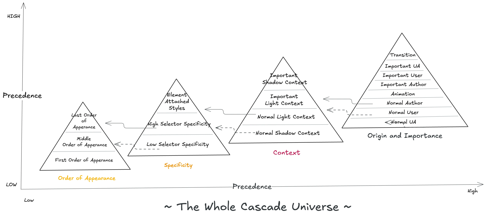

## Table of Contents

## はじめに

:::note{.message}
🌏 この記事は CSS Advent Calendar の 6 日目の記事です。
:::

前回までで、Cascade が「Suggest/Influence」するものであり、`!important` が「create a balance」するものであるという、Cascade の基本思想を解説してきました。
これを踏まえた上で、2025年現在、我々が慣れ親しんでいる CSS の Cascade について、改めて整理したいと思います。

Cascade に関しての詳説は、すでに日本語でも良質なものが多く存在します。よって、本エントリでは、あくまで CSS や Cascade の根幹となる思想を理解していくものにできればと思います。（Cascade に関する詳細は [MDN などのドキュメント](https://developer.mozilla.org/en-US/docs/Web/CSS/CSS_cascade/Cascade)を参照ください。）

CSS Snapshot 2024（執筆時点で最新） によると、現在の主要なブラウザや WPT は、基本的には CSS Cascading and Inheritance Level 4 を実装しているべきとされています。よって、今回参照するのは、2025 年現在、 Stable な Candidate Recommendation Snapshot でとして勧告されている Level4 の仕様です。

- [CSS Cascading and Inheritance Level 4](https://web.archive.org/web/20250524044012/https://www.w3.org/TR/css-cascade-4/)
- [CSS Snapshot 2024](https://www.w3.org/TR/css-2024/#css-official)

なぜ、Candidate Recommendation や Level4 を参照するのかに関する詳細は、以下の note を参照ください。

:::note{.info}

Candidate Recommendation - The W3C Recommendation Track

<details>

<summary>CSS Cascading and Inheritance Level 4 は、 W3C の Recommendation Track の中でも「Candidate Recommendation Snapshot」のステータスにあるものです</summary>

W3C の全ての Technical Report は、Recommendation Track に従って、以下のようなステータスがつけられています。


*Recommendation Track*

**Candidate Recommendation（CR）** は、Recommendation Track において、技術要件を満たし広範なレビューを受けた文書のことです。広範なコミュニティに最終レビューを促し、実装経験を収集することを目的として公開されます。

Candidate Recommendation は以下の2つのカテゴリに分類されます。

1. **Candidate Recommendation Snapshot（CRS）**
2. **Candidate Recommendation Draft（CRD）**

このうち CRS は、W3C の特許ポリシー (Patent Policy) に基づく CR のことで、W3C の特許保護手続きが完了した「公式のスナップショット」として機能します。

前提として、Working Group の参加者は、参加条件として「Essential Claims」（仕様実装に必要な特許）を Royalty-free でライセンスすることに合意しています。しかし、仕様が CR に到達し、特許ポリシーの審査が開始されると、実装に必要な特許に対して「やっぱりこの特許だけは無料にしたくない」を言える機会が発生します。「Call for Exclusions」と呼ばれる期間です。

要するに、仕様の策定に参加したら基本的に特許は無料開放、でも重要なものは「Call for Exclusions」の期間で守れるという仕組みがあります。
このプロセスを経て、Patent Policy に基づけるようになったのが CRS であり、これによって、実装する人は「特許料を心配せずに実装できる」ようになるわけです。

W3C が、特許保護を確保しながら（CRS）、同時に仕様の継続的な改善（CRD）を両立させている CR の仕組みです。

[W3C Process Document](https://www.w3.org/policies/process/#RecsCR)

</details>

:::

:::note{.message}

<details>

<summary>「Level」 という仕組み </summary>
CSS の仕様は、基本的にカテゴリごとに 「Module」で分割されています。そして「Module」は、Recommendation Track(RT) で同一ステータスとして括るのが妥当な区切りで「Level」分けされる仕組みになっています。Editors Draft でない限り、各 Module の 各 Level に RT のステータスが紐づく仕組みです。

本エントリで参照するのは、執筆時点で最新の 2024年に公開された CSS Snapshot で「Official Definition」とマークされている CSS Cascading and Inheritance「Level 4」です。だだ、同 Module としては、「Fairly Stable Modules with limited implementation experience」とマークされている CRS の「[Level 5](https://www.w3.org/TR/css-cascade-5/)」や、のちに紹介する「Cascade Layers」「Scope」などの機能を盛り込んだ、WD の「[Level 6](https://www.w3.org/TR/css-cascade-6/)」も存在します。

同じ「CSS Cascading and Inheritance」というカテゴリではありますが、RT で同一のステータスとして管理されるに相応しくなく、それぞれの実装状況や仕様の安定具合に応じて異なる進捗を持たせるのが妥当であれば、異なる Level に分類されます。

</details>

:::

## The Cascade - Cascade Sorting Order

現在、皆さんがみているこのページのスタイルは、CSS ルールの競合が完全に解決され、計算された結果です。

2025/07/12 現在、CSS には全 638 プロパティあり、その全てに対して、最終的には単一の値（[Actual Value](https://www.w3.org/TR/css-cascade-4/#actual)）が決定されます。

> 638 distinct property names from 92 technical reports and 92 editors' drafts.
>
> [Index of CSS properties](https://www.w3.org/Style/CSS/all-properties.en.html)

後日詳細に解説しますが、 Actual Value の導出には、多くの競合解決・計算過程を経ることになります。

e.g. 値の指定されていない `width` の Actual Value 導出まで：

1. Winning declaration (none)
2. Cascaded value (none)
3. Specified value (auto (initial value))
4. Computed value (auto)
5. Used Value (120px)
6. Actual Value (120px)

その内の Cascade というステップで利用するアルゴリズムが、仕様でいうところの「[Cascade Sorting Order](https://www.w3.org/TR/css-cascade-4/#cascade-sort)」です。Cascade Sorting Order によって、 [Cascaded Value](https://www.w3.org/TR/css-cascade-4/#cascaded) が導出されます。Cascaded Value は、Cascade Sorting Order によって CSS ルールの競合が解決された状態の値を指します。

CSS Cascading and Inheritance Level 4 時点での Cascade Sorting Order を図解すると、以下のようになります。


*The Whole Cascade Universe*

図が示す通り、[Origin and Importance](https://www.w3.org/TR/css-cascade-4/#cascade-origin) が、Cascade Sorting Order の中で最も優先度の高い競合解決です。どんなに Specificity が高くとも、それは同一 Origin and Importance の中でのみ効力を持ち、低い Specificity でもより高い Origin and Importance に属する場合は、そちらが優先されるということになります。

## Origin and Importance

 [Origin and Importance](https://www.w3.org/TR/css-cascade-4/#cascade-origin) について詳しく見ていきます。

### Origin

「Origin（Cascade Origin）」は、「どこから」そのスタイルが Cascade の世界に入るのかを示します。

[Cascade Origin](https://www.w3.org/TR/css-cascade-4/#origin) には 5 種類あり、シンプルに示すと以下のようになります。

- [Author](https://www.w3.org/TR/css-2024/#author) Origin: ページの Author が指定したスタイル
- [User](https://www.w3.org/TR/css-2024/#user) Origin: ページの閲覧者が指定したスタイル
- [User Agent](https://www.w3.org/TR/css-2024/#user-agent) Origin: ブラウザが指定したスタイル
- Animation Origin: Animation によって指定されたスタイル
- Transition Origin: Transition によって指定されたスタイル

そして、これらの Origin は、**デフォルトでは**以下の順に Cascade Sorting Order に追加され、下に行くほど優先度は高くなります。(現時点で、Importance や Animation/Transition は考慮しないものとします)

1. Normal User Agent Declarations
2. Normal User Declarations
3. Normal Author Declarations

#### Normal User Agent Declarations - Suggestions to the PURE HTML Rendering Result

UA/User/Author 3 つの Origin がありますが、UA StyleSheet は、**「素の HTML の見た目」に対して "Suggest" するスタイルシート**ということができます。

UA StyleSheet は、各ブラウザがそれぞれ持っています。

- [Gecko](https://web.archive.org/web/20250629185530/https://searchfox.org/mozilla-central/source/layout/style/res/html.css)
- [Chromium](https://web.archive.org/web/20250712055652/https://chromium.googlesource.com/chromium/src/+/refs/heads/main/third_party/blink/renderer/core/html/resources/html.css)
- [WebKit](https://web.archive.org/web/20250703050221/https://github.com/WebKit/WebKit/blob/main/Source/WebCore/css/html.css)

これらは、ブラウザベンダの嗜好で決まっているわけではなく、一定のルールに従って実装されており、現在は [HTML Living Standard の Rendering セクション](https://html.spec.whatwg.org/multipage/rendering.html#rendering)にて基準が設けられています。（[CSS1, 2 では、HTML4 に対するスタイルシート](https://www.w3.org/TR/CSS2/sample.html)が設けられていました）

だだし、仕様にもある通り、これらのデフォルトの見た目は ”Suggestion” であり、強制されているものでもありません。CSS で表現できない見た目も存在し、テキストによる説明が記載されているものもあります。

#### How much UA Style modifies the Rendering Result?

では、UA StyleSheet がなければ、どんなスタイルが吐き出されるのか。
今からちょっとした手順を踏んで、素の HTML のスタイルを見てみましょう。

使用する[ページ](https://studio.sakupi01.com/)は、シンプルな HTML と CSS で構成されているものにします。ページは筆者の Chrome Dev 140 で画像のように表示されています。これは、UA StyleSheet + User Style + Author Style の組み合わせによるものです。


*UA Style + User Style + Author Style*

まず、できる限り Author Style を取り除いて、UA Style + User Style に近づけます。

```js
// 以下を devtool で実行し、できる限り Author Style を削除する
document.querySelectorAll('style, link[rel="stylesheet"]').forEach(e => e.remove());
document.querySelectorAll('[style]').forEach(e => e.removeAttribute('style'));
```

すると、以下のような表示になります。ほぼ UA Style + User Style の組み合わせです。


*UA Style + User Style*

次に、個人的でブラウザで設定したフォントや色などの User Style をオフにします。


*UA Style*

これが、UA StyleSheet のみ当たったページの見た目です。

最後に、`all: initial` を用いて、全てのプロパティの値を仕様上のデフォルト値に指定します。（これが究極の CSS Reset なのでは）

```css
* {
  all: initial !important;
}
```

こうしてようやく、（ほぼ）一切の CSS が当たっていない、素の HTML の見た目が得られました。


*Rendering Result Style*

ここでは特に完璧な HTML レンダリング結果のスタイルを得ることは目指していませんので、この程度でやめておきますが、UA StyleSheet が HTML のレンダリング結果をどれだけ整えてくれているのか、おわかりいただけたのではないでしょうか。

UA StyleSheet がなければ、我々はもっと冗長で大規模なスタイルシートを書かねばならなかったと考えると、UA StyleSheet の存在が大きなものに感じられます。

---

本当は、Day6 で少なくとも Origin and Importance の話を終わらせるつもりだったのですが、Origin and Importance の UA Origin の話にとどまりました。
次回以降では、残りの Origin と Importance の話と、Cascade Sorting Order 全体の解説を行う予定です。To be continued...

## Appendix

- [CSS Cascading and Inheritance Level 5 publication history | Standards | W3C](https://www.w3.org/standards/history/css-cascade-5/)
- [CSS Cascading and Inheritance Level 6 publication history | Standards | W3C](https://www.w3.org/standards/history/css-cascade-6/)
- [Levels, snapshots, modules…](https://www.w3.org/Style/2011/CSS-process.en.html)
- [CSS Snapshot 2024](https://www.w3.org/TR/css-2024/)
- [15.2 The CSS user agent style sheet and presentational hints | HTML Standard](https://html.spec.whatwg.org/multipage/rendering.html#the-css-user-agent-style-sheet-and-presentational-hints)


---

<advent-calendar-2025 />

