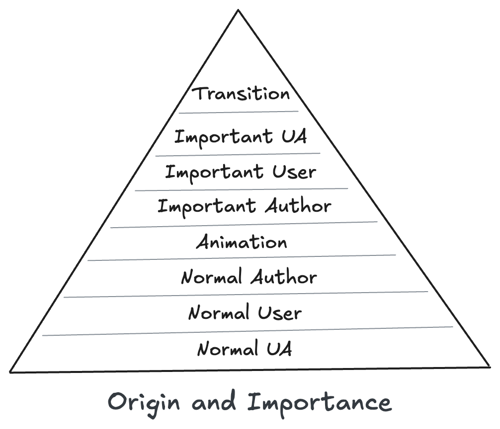

## Table of Contents

## はじめに

:::note{.message}
🌏 この記事は CSS Advent Calendar の 7 日目の記事です。
:::

前回までで、Cascade の本体である Cascade Sorting Order アルゴリズムについての前置きを行い、その中でも最も優先度の高い Origin and Importance を確認しました。

今回は、Origin の続き、User / Author Declarations と `!important` から、 Cascade Sorting Order の全体像までを解説します。

### （続）Origin

#### Normal User Declarations - Suggestions to the User Agent

User Declarations は、ユーザがブラウザの設定で行うスタイルのことです。

利用しているブラウザによって、どこまでカスタマイズできるかは変わってきますが、一般的には、フォントのサイズや色、背景色などを設定できるようになっています。

- FireFox: `about:preferences`
- Safari: `Safari > Settings > Advanced > Style Sheet`
- Edge: `edge://settings/appearance`
- Chrome: `chrome://settings/appearance`

例えば、「1rem = 16px」という説明を耳にすることがたまにあると思いますが、これは多くのブラウザで User StyleSheet のデフォルトフォントサイズが 16px となっているためです。ブラウザの設定が違えば、1rem の指す値も変わるのは、User StyleSheet が Cascade に存在しているためです。

#### Normal Author Declarations - Suggestions to the User

最後に、ページの開発者（Author）が "Suggest" するのが、Author Declarations です。

Cascade Sorting Order の Origin のみをとると、User Agent < User < Author となり、Author が最も優先度が高いスタイルシートとなります。

### Importance - "I am `!important`! Please DO NOT override me!"

Origin and Importance の Origin のみの世界だと、Author が絶対的な優先度を持っていることになります。

しかし、[Day 5](2025-css-advent-5) でも説明した通り、CSS 2.1 から Cascade に Importance が導入されました。

`!important` の役割は、Author が最優先だった Cascade に、User や UA が自身のスタイルを「守る」仕組みを提供することで、**バランスをとる**ことでした。

- [Assigning property values, Cascading, and Inheritance](https://www.w3.org/TR/1998/PR-CSS2-19980324/cascade.html#important-rules)

> ... **for balance**, an "!important" declaration (the keywords "!" and "important" follow the declaration) takes precedence over a normal declaration. Both author and user style sheets may contain "!important" declarations, and **user "!important" rules override author "!important" rules**.

故に、`!important` は Origin のデフォルトオーダーを逆転させます。

そして、Transition と Animation の Origin を含め、最終的に完成する Origin and Importance は以下のようになります。


_Origin and Importance_

## The Whole Cascade Sorting Order

ここまで、Cascade Sorting Order の Origin and Importance ついて紹介してきました。

最後に、「[CSS Cascading and Inheritance Level 4](https://web.archive.org/web/20250524044012/https://www.w3.org/TR/css-cascade-4/)」に基づき、Cascade Sorting Order を構成する他の要素について軽く確認し、全体像をまとめます

なお、詳細な説明はここでは割愛します。詳細を知りたい場合は、 [MDN のドキュメント](https://developer.mozilla.org/en-US/docs/Web/CSS/CSS_cascade/Cascade)などを参照してください。

### Origin and Importance

Cascade Sorting Orderの先頭に位置し、最も優先して判断されます。Origin and Importance に関しては、[Day6](2025-css-advent-6) から [Day7](2025-css-advent-7) で説明してたものです。

### Context

Context 内の優先度付けは、 Origin and Importance に似た側面を持ちます。

Shadow DOM の内か外かという Context 間での比較が生じた場合、通常では外側からの宣言が優先されます。

以下に示す Shadow DOM を用いた Web Components の例では、`:host`擬似クラスの指定よりも、外部からのスタイル指定が優先されることになります。
よって、Shadow DOM 内 Context でデフォルトのスタイルを定義し、Shadow DOM 外 Context からスタイルを上書きして利用するといった用途が考えられます。

```html
<hoge-element>
  <template shadowrootmode="closed">
    <style>
      :host {
        background-color: lightblue;
        border: 5px solid black;
        padding: 8px;
      }
    </style>
    <div>HOGE HOGE HOGE</div>
  </template>
</hoge-element>
```

```css
hoge-element {
  background-color: pink;
  border: 5px solid black;
  padding: 8px;
}
```

基本的に、Context 外部からのスタイル指定の方が Context 内のスタイルよりも優先度は高くなりますが、Shadow DOM 内のスタイルに `!important` を付与することで、外部スタイルからの上書きを防ぐことができます。
「`!important` は守りの手段」という考え方は Context にも適用されるものです。

### Specificity

[Specificity のアルゴリズム](https://web.archive.org/web/20250524044012/https://www.w3.org/TR/selectors/#specificity)によってセレクタの重み付けが行われ、詳細度が高いものから順に優先度も高くなります。

Context を用いない状況下においては、CSS の適用順序をコントロールする手段として広く利用されるかと思います。
ただ、それよりも先に Origin and Importance や Context によって判断がされた上で Specificity の優先度が動作していることを把握しておくと良いでしょう。

:::note{.message}

Specificity in [CSS Cascading and Inheritance Level 4](https://web.archive.org/web/20250524044012/https://www.w3.org/TR/css-cascade-4/)

現段階で参照している [CSS Cascading and Inheritance Level 4](https://web.archive.org/web/20250524044012/https://www.w3.org/TR/css-cascade-4/) では、Specificity の定義に以下のような記述があります

> declarations that do not belong to a style rule (such as the contents of a style attribute) are considered to have a specificity higher than any selector

HTMLElement の style 属性が、Specificity の定義に含まれていますね。後日触れますが、Cascade Layers が導入される Level5 以降の仕様では、style 属性は 「Element Attached Styles」 として扱われ、Specificity の定義からは外れるので、注意が必要です。

:::

### Order of Appearance

同じ詳細度のセレクタが複数存在する場合は、後に宣言されたものが優先されます。

---

以上を踏まえ、最終的に完成する Cascade Sorting Order を図解すると以下のようになります。

<cascade-accordion disabled show-layers="false" show-scope-proximity="false"></cascade-accordion>

これにより、例えば以下のようなよくある CSS の適用順序は、Cascade Sorting Order で説明がつきます。

- 同じ詳細度の場合、後の宣言が優先される：Order of Appearance
- 後に宣言されていても、詳細度が高いほうが優先される：Specificity > Order of Appearance
- style 属性が付与されていても、Shadow DOM 内の宣言が優先される：Context > Specificity
- `!important` を付与すると、style 属性より優先される：Origin and Importance > The Style Attribute > Specificity

## Appendix

- [Cascading Style Sheets, level 1](https://www.w3.org/TR/WD-css1-951117.html)
- [CSS history](https://www.w3.org/Style/CSS/history.html)
- [Thinking about style sheets](https://www.w3.org/Style/mail/kh-2-may-95.html)

---

<advent-calendar-2025 />
