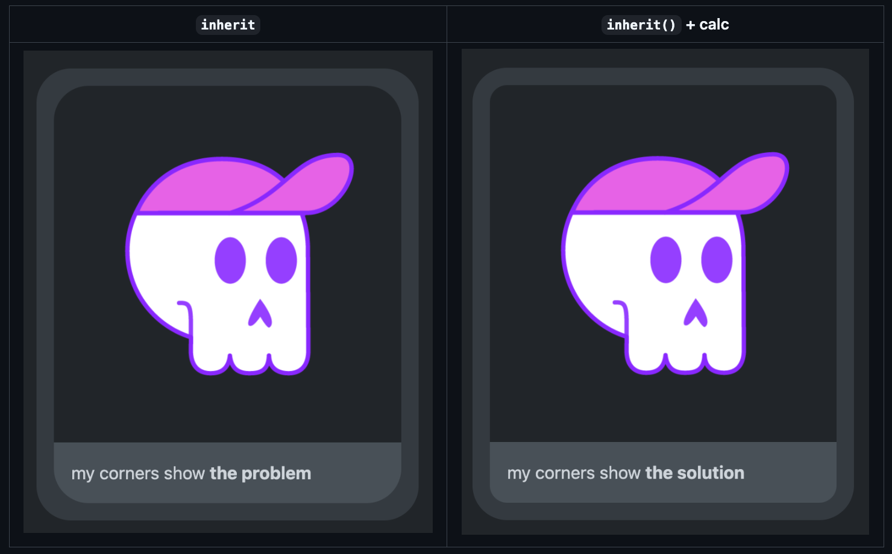
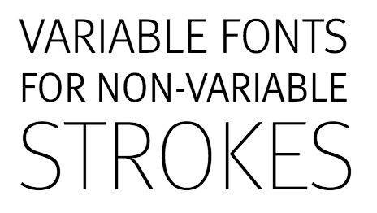

## Table of Contents

## はじめに

:::note{.message}
この記事で紹介する仕様は現在策定段階であり、これから変更される可能性があることに注意してください
:::

`var()` は Custom Properties を参照する関数ですが、CSS に「親要素の任意プロパティ」にアクセスする手段は存在しません。

`inherit()` は、「プロパティの（自己）参照」を参照する手段として、プロポーザル の Original Post でも大きな注目を集め、現在仕様策定中の [CSS Values and Units Module Level 5](https://www.w3.org/TR/css-values-5/) に盛り込まれる予定の提案です。

`inherit()` は、CSS の Custom Properties を経由せず、親要素のプロパティを子要素から直接自己参照できるようにすることで、ネストの深さに応じたスタイリングや、親に依存した動的なスタイリング、利用側の環境に適応したアダプティブな UI コンポーネントの実装が可能になることが期待されています。

- [[css-values-5] `inherit()` function: like `var()` for parent value, for any property · Issue #2864 · w3c/csswg-drafts](https://github.com/w3c/csswg-drafts/issues/2864)

本エントリでは、`var()` の持つ仕様/実装上の制限から、`inherit()` が提案された背景、`inherit()` によって解決される様々なユースケースを紹介し、ネストや動的なスタイルの実現がどのように容易になっていくのかを述べています。

## Pain points

CSS の Custom Properties は、`var()` を用いて親要素から子要素へ値を継承することができますが、`var()` には仕様上の制限があります。

### Background

Custom Properties は `var()` を用いて自己を参照することができません。

> This, finally, is a cyclic substitution context, since it matches the substitution context from the first substitution, causing the substitution to just produce the [guaranteed-invalid value](https://drafts.csswg.org/css-variables-2/#guaranteed-invalid). This percolates back up the nested invocations, eventually resulting in `--one` becoming [invalid at computed-value time](https://drafts.csswg.org/css-values-5/#invalid-at-computed-value-time).
> ー [CSS Values and Units Module Level 5](https://drafts.csswg.org/css-values-5/#cyclic-substitution-contexts)

それゆえ、以下のような`var()` を介した Custom Properties の自己参照を行うコードは無効と判定されます。

```css
/* invalid */
.element {
    --depth: calc(var(--depth) + 1);
}
```

もし、自己参照することができれば、親の値を基準とした計算（ネストの深さを追跡したり、親の値を継承した count 処理したり）ができ、その値をスタイルに用いることできるはずです。

しかし、`var()` では自己参照ができないため、例えば、ネストの深さに応じたスタイリングをするには、以下のような心温まる手作業で Custom Properties を要素ごとに指定するに等しい手法が妥当でした。

```html
<div class="nested-item" style="--depth: 1">Level 1
  <div class="nested-item" style="--depth: 2">Level 2
    <div class="nested-item" style="--depth: 3">Level 3
      <div class="nested-item" style="--depth: 4">Level 4</div>
    </div>
  </div>
</div>

<style>
.nested-item {
  padding-left: calc(var(--depth, 0) * 1em);
  background: hsl(calc(var(--depth, 0) * 60), 50%, 90%);
}
</style>
```

単純に考えると、`var()`のもつ自己参照の制限を緩め、任意のプロパティを `var()` で参照できるように仕様を拡張すれば良いように思えます。

しかし、`var()` は、 **「任意の親要素から」** から定義された Custom Properties の参照が可能であり、`inherit()` では **「自己参照を可能にする」** 可能性を踏まえると、`var()` を拡張して **「任意の親要素から」** **「自己参照を可能にする」** 場合、参照元の検出にかかる計算コストが増大する可能性があります。

詳細: [#limitation-or-implementation-details](#limitation-or-implementation-details)

---

また、`var()` の持つ明確な制限として、「親要素の**プロパティに直接アクセス**ができない」という問題があり、そもそもこれが `inherit()` が提案された背景の白眉なところでした。

親要素の値を子要素で使用するには、明示的に Custom Properties という変数に格納したのち、親子共通で仕様する必要があります。
親子で共通のプロパティ値を持つには、Custom Propertiesという変数を必ず経由することが必須条件となり、参照したいものを直接参照したくなるのも不思議ではないでしょう。

```css
.parent {
  --parent-width: 200px;
  width: var(--parent-width);
}

.child {
  width: calc(var(--parent-width) * 0.5);
}
```

`var()` で自己参照ができないことと、親のプロパティを直参照したいという条件を踏まえ、 `inherit()` は「直近の親要素から」「自己参照が可能」な状態で「直接プロパティを参照できる」関数として検討されます。

### Summary of pain points & requirements

問題を掘り下げると、具体的には以下のような項目が浮かび上がります。

- Self-Referencing: ネストの深さを追跡したり、値を継承した count 処理をしたい
- Dynamic Styling: 親のスタイルに基づいて子のスタイルを決定したい
- Value Bridging to 3rd Party UI Components: 3rd Party 製ライブラリやフレームワークから利用側のスタイル継承をして、利用側のスタイル状況に合わせたコンポーネントを作りたい

これらの要求を満たすための要件として、議論の過程で以下が明らかになりました。

- レイアウトエンジンにおける計算コストの観点から、自己参照しない実装になる仕様である必要
- 任意プロパティからの値取得である必要
- Custom Properties の参照をする必要もあるため、`var()` と同様のトークンレベルでの動作が必要
- フォールバック機能を提供する必要

## ✨ The Proposal: CSS `inherit()` Function

エンジン側の計算コストを抑えつつ、任意のプロパティから値の参照を可能にするものとして提案されたのが、`inherit()` です。

### Defining and using `inherit()`

`inherit()` は、**指定された任意プロパティ**の**親要素**での計算値を取得し、それを現在の要素で使用できるようにします。

（Current Proposed Syntax:）

```css
inherit(<(custom-)property-name>)
inherit(<(custom-)property-name>, <declaration-value>?)
```

- [CSS Values and Units Module Level 5](https://www.w3.org/TR/css-values-5/#inherit-notation)

```css
.parent {
  font-size: 16px;
  background-color: #007acc;
}

.child {
  /* 20% bigger than parent font size */
  font-size: calc(inherit(font-size) * 1.2);

  /* inherit parent background color */
  color: inherit(background-color);
}
```

---

ここからは、`inherit()` の利用例をいくつか紹介し、どのようなユースケースで有用かをいくつか列挙します。

### Usecase 1: Self-Referencing Custom Properties

#### Track nest depth

`inherit()` が自己参照可能なことを利用し、親の値を基準とした計算ができるようになると、ネストレベルの深度を自動的に追跡することができるようになります。
この手法により、HTMLの構造を変更することなく、CSSだけでネストレベルに応じた動的なスタイリングが可能になります。

```html
<!-- HTML is super simple as it should be! -->
<div class="nested-item">
  <div class="nested-item">
    <div class="nested-item">
      <div class="nested-item"></div>
    </div>
  </div>
</div>

<style>
    * {
    /* self reference to track depth */
    --depth: calc(inherit(--depth, 0) + 1);
    }

    .nested-item {
    /* calc padding based on depth */
    padding-left: calc(var(--depth) * 1em);

    /* calc background color hue based on depth */
    background: hsl(calc(var(--depth) * 60), 50%, 90%);

    /* display depth as a counter */
    counter-reset: depth var(--depth);
    }
</style>
```

#### Swapping Custom Properties

`var()`では自己参照不可能なため困難な2つの変数の値のスワップも、`inherit()` では可能です。

```css
:root {
  --primary-color: hsl(220, 70%, 50%);
  --secondary-color: hsl(160, 60%, 45%);
}

.theme-swapped {
  /* swap variables */
  --primary-color: inherit(--secondary-color);
  --secondary-color: inherit(--primary-color);
}
```

### Usecase 2: Dynamic Styling

#### Responsive Borders

親要素の `border-radius` に合わせて、子要素の `border-radius` を自動調整すると、視覚的に整った Nested Border のデザインが実現できることは知られています。

特に、カードコンポーネントやモーダルダイアログ、アイコンなど、Nested Border を含む UI で特に有用なパターンとなり得るでしょう。

```css
.card {
  border-radius: 12px;
  padding: 16px;
  background: #f5f5f5;
}

.nested-card {
  /* calculate border radius based on parent border radius,
   so that it perfectly matches the parent's shape! */
  border-radius: calc(inherit(border-radius) - inherit(padding));
  padding: 12px;
  background: white;
  margin: 4px;
}
```


*親のborder-radius と親和した radius*

- [[css-borders-4] New `border-radius` value for perfectly matching nested radii · Issue #7707 · w3c/csswg-drafts](https://github.com/w3c/csswg-drafts/issues/7707)

#### Swapping foreground and background colors

例えば、親要素の前景色と背景色を入れ替えて、反転したテーマを作成できます。
`inherit()` を使うと、**親要素の具体的な色を基準**とした、ボタンのホバー状態やコントラスト切り替えに活用できます。

```css
.theme-primary {
  color: light-dark(#333, #fff);
  background: light-dark(#fff, #333);
}

.theme-inverted {
  /* color to be parent background color */
  color: inherit(background-color);

  /* background color to be parent color */
  background-color: inherit(color);
}
```

- [[css-color-5] Add `currentBackgroundColor` Variable · Issue #5292 · w3c/csswg-drafts](https://github.com/w3c/csswg-drafts/issues/5292)

#### Font Properties

親要素のフォントプロパティを基準とした、相対的なフォント値の調整も可能になります。

```css
.base-text {
  font-weight: 400;
  font-size: 16px;
}

.emphasized {
  /* 1.2 times bigger than parent font-weight but clamped from 600 to 900 */
  font-weight: clamp(600, calc(inherit(font-weight) * 1.2), 900);
  
  /* 1.125 times bigger than parent font-size */
  font-size: calc(inherit(font-size) * 1.125);
}
```


*異なる`font-size`のweightを一定にしたい*

- [[css-fonts-4] Percentages in font-weight for relative weights · Issue #2690 · w3c/csswg-drafts](https://github.com/w3c/csswg-drafts/issues/2690)
- [[css-fonts] font-weight: bolder and lighter are counter-intuitive · Issue #2764 · w3c/csswg-drafts](https://github.com/w3c/csswg-drafts/issues/2764)

### Value Bridging to 3rd Party UI Components

また、`inherit()` を用いると、「利用側の環境に自動的に適応するコンポーネント」が作成できます。

例えば、利用側の親要素の background-color や border-radius を基準に、3rd Party の UI コンポーネントが自動的に適応するようなスタイルを実装できます。

e.g.2, 利用側のスタイルに応じた Card

```css
.lib-card {
  /* 親の背景色に基づいて自動でカードの色を決定 */
  background: color-mix(
    in srgb,
    inherit(background-color) 95%,
    light-dark(white, black) 5%
  );
  
  /* 親のborder-radiusと調和 */
  border-radius: max(
    calc(inherit(border-radius, 0px) * 0.8),
    4px
  );
  
  /* 親のpadding基準で内部余白を設定 */
  padding: max(inherit(padding, 16px), 12px);
}
```

e.g.2, 利用側のスタイルに応じた Tooltip

```css
.lib-tooltip {
  /* 親要素の背景色とコントラスト比を保ったカラーでツールチップを表示 */
  background: contrast-color(inherit(background-color));
  
  color: contrast-color(contrast-color(inherit(background-color)));
  
  /* 親のz-indexより上に表示 */
  z-index: calc(inherit(z-index, 0) + 1000);
}
```

## Limitation or Implementation details

パフォーマンスとスタイル無効化の範囲を限定するため、`inherit()` は**直接の親要素のみ**にアクセス可能です。

多くのレイアウトエンジンでは、**スタイルの無効化（Style Invalidation）**が重要な最適化の手段となっています。
プロパティが変更された際、その影響を受ける要素のみを再計算することで、パフォーマンスを維持しています。

```md
- 親→子のみの場合: Parent [color変更] → 直接の子要素のみ無効化
- 祖先アクセスありの場合: Ancestor [color変更] → 全子孫要素を探索・広範囲の無効化が必要
```

`inherit()` が祖先にアクセスできてしまうと、親から子への単純な伝播と比べて計算量が大幅に増加するため、`inherit()` が直接参照できるのは親要素のみに制限されています。

- [Servo/StyleUpdateOnDOMChange - MozillaWiki](https://wiki.mozilla.org/Servo/StyleUpdateOnDOMChange)
- [CSS Style Invalidation in Blink](https://chromium.googlesource.com/chromium/src/+/master/third_party/blink/renderer/core/css/style-invalidation.md)
- [Reduce the scope and complexity of style calculations](https://web.dev/articles/reduce-the-scope-and-complexity-of-style-calculations)
- [How Blink invalidates styles when `:has()` in use? - Byungwoo's Blog](https://blogs.igalia.com/blee/posts/2023/05/31/how-blink-invalidates-styles-when-has-in-use.html)

とはいえ、祖先要素の値が必要な場合は、Custom Properties を変数として介すことで対応することができるようです。

```css
.intermediate {
  --grandparent-value: inherit(some-property);
}

.descendant {
  some-property: var(--grandparent-value);
}
```

## Other ideas explored

### idea 1: Expand `toggle()` in CSS Module Level 5

CSS Values and Units Module Level 5 には既に [`toggle()`](https://www.w3.org/TR/css-values-5/#toggle-notation) が標準化されることになっており、これは値のサイクリックな切り替えを提供します。

```css
em {
  font-style: toggle(italic, normal);
}
```

しかし、`toggle()` には以下のような制限があります。

- `attr()` や `calc()` との組み合わせができない
- CSS 仕様でいうところの Rule 単位でのみ使用可能
- `toggle()` 内で指定した値しか使えない

`inherit()` はこれらの制限をつべきではなく、toggle からこれらの制限を緩めることも難しいということより、`inherit()` が `toggle()` の拡張となることはありませんでした。

### idea 2: Mark with `!inheritable` flag

プロパティに `!inheritable` フラグを付けることで、親要素の値を子要素で参照できるようにする提案もありました。
しかし、この手法は、親要素にも構文の記述を強制するため、例えば 3rd Party ライブラリとして `inherit()` を用いたコンポーネントを提供する際に運用が破綻する可能性があります。

```css
/* 3rd Party UI Component */
.ex-button {
  /* user's parent element's color will decide the component's colors */
  color: inherited(background-color);
  border: 1px solid inherited(background-color);
  padding: 0.5em 1em;
}
```

```html
<style>
/* User has to write !inheritance and this has to be well documented...  */
.parent-container {
  background-color: #007acc !inheritable; /* ← */
}
</style>

<div class="parent-container">
  <button class="ex-button">3rd Party Button Component</button>
</div>
```

### idea 3: Container Style Queries workaround

[Roman Komarov](https://github.com/kizu) が Container Style Queries を用いて`inherit()`の挙動を一部再現した、ワークアラウンドも存在します。

```html
<!-- Level1 is the case of @container not style(--is-alternate: )  -->
<!-- --depth: calc(var(--inherited, 0) + 1);  /* 0 + 1 = 1 */
--inherit: var(--depth);                 /* --inherit = 1 */ -->
<div class="element">Level 1
    <!-- Level2 is the case of @container style(--is-alternate: )  -->
  <div class="element">Level 2</div>
</div>

<style>
    * {
    @container not style(--is-alternate: ) {
        --is-alternate: ;
        --inherited--even: var(--inherit);
        --inherited: var(--inherited--odd);
    }
    @container style(--is-alternate: ) {
        --is-alternate: initial;
        --inherited--odd: var(--inherit);
        --inherited: var(--inherited--even);
    }
    }

    .element {
    --depth: calc(var(--inherited, 0) + 1);
    --inherit: var(--depth);
    }
</style>
```

この手法は `inherit()` の多くのユースケースをカバーしますが、Custom Properties の自己参照にしか対応しておらず、
Computed Values、つまりプロパティの値を直接参照することはできません。

実装の詳細は以下に詳しいです。

- [Self-Modifying Variables: the `inherit()` Workaround](https://kizu.dev/self-modifying-variables/)

---

`inherit()` は今後 Custom Properties の実装から進み、段階的にプロパティの参照に実装が進む予定となっています。
まだ Standard Position も出ておらず、実装の Intent があるわけでもありませんが、「プロパティ値の（自己）参照」が可能になることで、
長年望まれてきた非常に多くのユースケースが一挙に解決されることが期待されます。

<https://x.com/LeaVerou/status/1350491359745077248>

- [[css-borders-4] New `border-radius` value for perfectly matching nested radii · Issue #7707 · w3c/csswg-drafts](https://github.com/w3c/csswg-drafts/issues/7707)
- [[css-color-5] Add `currentBackgroundColor` Variable · Issue #5292 · w3c/csswg-drafts](https://github.com/w3c/csswg-drafts/issues/5292)
- [[css-fonts-4] Percentages in font-weight for relative weights · Issue #2690 · w3c/csswg-drafts](https://github.com/w3c/csswg-drafts/issues/2690)
- [[css-fonts] font-weight: bolder and lighter are counter-intuitive · Issue #2764 · w3c/csswg-drafts](https://github.com/w3c/csswg-drafts/issues/2764)
- [[css-variables] define custom property based on parent's (inherited) value · Issue #1962 · w3c/csswg-drafts](https://github.com/w3c/csswg-drafts/issues/1962)

## Appendix

- [[css-values-5] `inherit()` function: like `var()` for parent value, for any property · Issue #2864 · w3c/csswg-drafts](https://github.com/w3c/csswg-drafts/issues/2864)
- [[css-values-5] Allow `inherit` in `calc()` (and friends), `color-mix()`, RCS · Issue #9757 · w3c/csswg-drafts](https://github.com/w3c/csswg-drafts/issues/9757)
- [Alternating Style Queries](https://kizu.dev/alternating-style-queries/)
- [CSS Values and Units Module Level 5](https://www.w3.org/TR/css-values-5/#inherit-notation)
- [CSS Cascading and Inheritance Level 3](https://www.w3.org/TR/css-cascade-3/)
- [Servo/StyleUpdateOnDOMChange - MozillaWiki](https://wiki.mozilla.org/Servo/StyleUpdateOnDOMChange)
- [CSS Style Invalidation in Blink](https://chromium.googlesource.com/chromium/src/+/master/third_party/blink/renderer/core/css/style-invalidation.md)
- [Reduce the scope and complexity of style calculations](https://web.dev/articles/reduce-the-scope-and-complexity-of-style-calculations)
- [How Blink invalidates styles when `:has()` in use? - Byungwoo's Blog](https://blogs.igalia.com/blee/posts/2023/05/31/how-blink-invalidates-styles-when-has-in-use.html)
