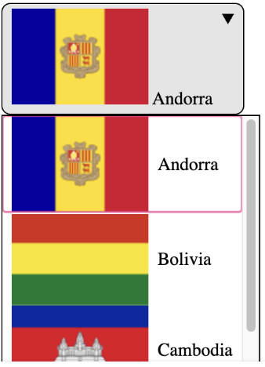
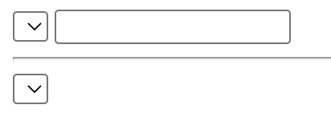
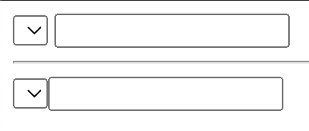

## Table of Contents

## はじめに

`<select>`のスタイルや機能拡張を行うために、これまでに多くの関連機能が提案され、仕様策定され、実装されてきました。
その中でも特に、Customizable Select Element を実現する上で欠かせなかった、HTML Parser の緩和に関するバグが、後方互換性の心配が非常に低くなる程度に修正され、Ship の[Intent](https://groups.google.com/a/chromium.org/g/blink-dev/c/kN5LTzuTLVs/m/6HqTsmk3EQAJ)が発表されました。

- [Feature: Customizable `<select>` Element](https://chromestatus.com/feature/5737365999976448)

本エントリでは、今回の Intent に影響を与えた、Parser Relaxation について見ていきます。

## Parser Relaxation

新しい`<select>`では、次のように、カスタムの`<button>`を設置したり、`<option>`の中に任意のタグを挿入したりすることができます。これによって、独自のボタンで`::picker`（選択肢のポップアップ）をトリガーしたり、`<option>`の中に``や任意のコンテンツを入れて、選択肢として表示することが可能になります。

```html
<style>
select,
::picker(select) {
  appearance: base-select;
}
option::checkmark {
  display: none;
}
</style>
<select>
  <button>
    <selectedcontent></selectedcontent>
  </button>
  <option value="andorra">
    
    <span>Andorra</span>
  </option>
  ...
</select>
```


*Country select with Flags*

- [Codepen: Country select with Flags](https://codepen.io/sakupi01/pen/EaYOqRL)

しかし、現状の`<select>`では`<option>`, `<optgroup>`, `<hr>`のみを内部要素として許可しているため、これらの要素以外を含む`<select>`がうまくパースされるよう、`<select>`の Content Model を変更し、それに応じて HTML パーサに変更を加える必要があります。

> Content model:
> Zero or more option, optgroup, hr, and script-supporting elements.
> <https://html.spec.whatwg.org/multipage/form-elements.html#the-select-element>

- [HTML parser changes for customizable `<select>` · Issue #10310 · whatwg/html](https://github.com/whatwg/html/issues/10310)
- [Content model and 'what' to render for stylable `<select>` elements · Issue #10317 · whatwg/html](https://github.com/whatwg/html/issues/10317)
- [[selectmenu] Restricting interactive content in `<selectmenu>` listbox · Issue #540 · openui/open-ui](https://github.com/openui/open-ui/issues/540)

## Parser RelaxationはChrome 131でShipされていた

この Parser Relaxation は、Chrome 131 で Ship の Intent が出ており、実際に Chrome 131 で Ship されていました。

この時点では、パーサの変更による既存の`<select>`との後方互換性が懸念されていたため、まず一度 Parser Relaxation を Ship してみて、ユーザからのフィードバックを受けつつ、適切な対処がされるというモチベーションでした。

> This change is in support of the customizable `<select>` feature but is being shipped first because it can be done separately and has some compat risk which I'd like to get feedback on.
> ...
> If there are major issues with this change, I will reassess and make adjustments to the parser as needed.

- [Intent to Ship: Select parser relaxation](https://groups.google.com/a/chromium.org/g/blink-dev/c/5_9-Qkvlj2M/m/Q96A126vAAAJ)
- [Feature: Select parser relaxation](https://chromestatus.com/feature/5145948356083712?gate=5114873999261696)

## Parser Relaxation無効化の背景

Chrome 131 で Ship 後、選択肢ドロップダウンが正常に動作しない問題が複数報告されます。

- [Chrome v131.0.6778.70 - Select2 Dropdown Displaying Blank Information #10](https://issues.chromium.org/issues/379034733#comment10)

このバグは、`<option>`が`<div>`など任意の HTML 要素の子要素となっていた場合、ドロップダウンが開かないというものでした。

> Basically if options inside select element are wrapped in other HTML tag like astro-slot (Astro/SolidJS setup) or even a simple DIV, dropdown does not open. Reproducible only on Chrome 131, after this <https://chromestatus.com/feature/5145948356083712>
>
> ref: <https://issues.chromium.org/issues/379034733#comment10>

この問題は、Parser Relaxation の変更によって発生したものであることが判明し、Chrome 131, 132 で Parser Relaxation を無効化することで対応されました。

> I disabled this new parser behavior in chrome 131 due to a bug with one of multiple code paths which collects options to render in the select's popup which doesn't exist in the spec.
> ...
>
> > I think it makes sense to wait with merging this PR until it has been shipping in Stable for a bit.
>
> That sounds reasonable to me especially since shipping this change in chrome is not blocked by merging this PR.
>
> ref: <https://github.com/whatwg/html/pull/10557#issuecomment-2515300782>

- [M131: Disable SelectParserRelaxation by default (6042039) · Gerrit Code Review](https://chromium-review.googlesource.com/c/chromium/src/+/6042039)
- [M132: Disable SelectParserRelaxation by default (6039296) · Gerrit Code Review](https://chromium-review.googlesource.com/c/chromium/src/+/6039296)

## Parser Relaxationの有効化

一時は無効化された機能でしたが、上記のバグは以下で修正され、これまでに、Parser Relaxation によるその他リグレッションのほとんども解消されてきました。

- [Update ListBoxSelectType slotting (6036311) · Gerrit Code Review](https://chromium-review.googlesource.com/c/chromium/src/+/6036311)

Chrome 133 からは Parser Relaxation は Finch されており、その他 Customizable Select Element 関連の実装も Chrome 134 で Ship されることに繋がります。

- [Disable SelectParserRelaxation by default (6092097) · Gerrit Code Review](https://chromium-review.googlesource.com/c/chromium/src/+/6092097)

## そのほかの懸念

Relaxation 以前のパーサの挙動では動作していた`<select /> <input />`といった書き方が、Parser Relaxation によって動作しなくなるという懸念は、現時点でも依然として残るようです。

- [Input element after `<select />` is not rendered [379612186] - Chromium](https://issues.chromium.org/issues/379612186)

たとえば、次のような HTML で、`<input>`がレンダーされる/されないという挙動の違いが確認されています。

- [Codepen: Self-closing Select Parse🫤](https://codepen.io/sakupi01/pen/QwLqJxw)

```html
<select></select> <input />

<hr />

<select /> <input />
```

*Experimental Web Platform features enabled*

| Chrome Canary 134 | Chrome 131 |
| ---- | ---- |
|  |  |

これに関しては、専用のフラグが用意されているため、もしロールアウトして問題があっても、Chrome のリリースを伴わずに機能を無効にすることができます。

- [Add InputClosesSelect flag (5936092) · Gerrit Code Review](https://chromium-review.googlesource.com/c/chromium/src/+/5936092)

***

数多くの構文と動作変更を繰り返してきた Customizable Select Element の Ship は、[Joey Arhar](https://github.com/josepharhar)による、辛抱強い繰り返しの実装の末に実現されています。

- [owner: jarhar@chromium.org · Gerrit Code Review](https://chromium-review.googlesource.com/q/owner:jarhar@chromium.org)

Web の開発体験を大きく変えるたくさんの機能の実現にも貢献してきた、Customizable Select Element。長年実現が待ち望まれていた新しい機能のリリースなだけ、とてもワクワクさせられます🎉
