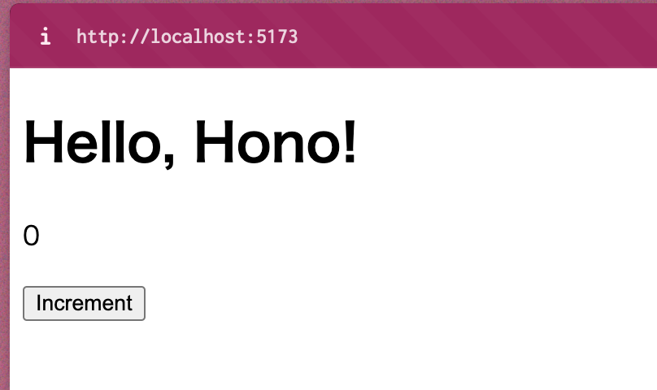
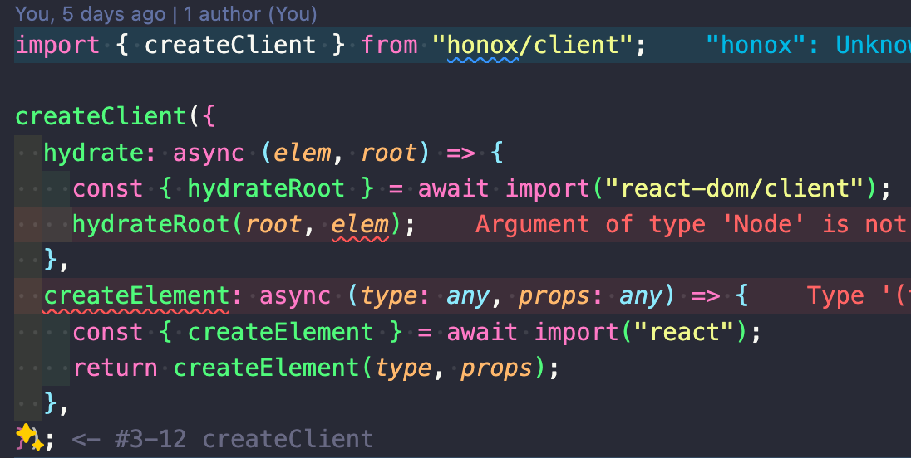
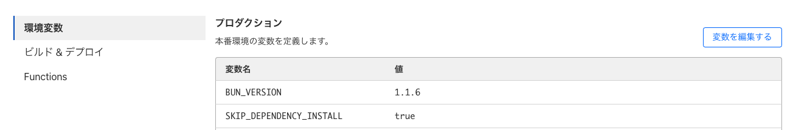
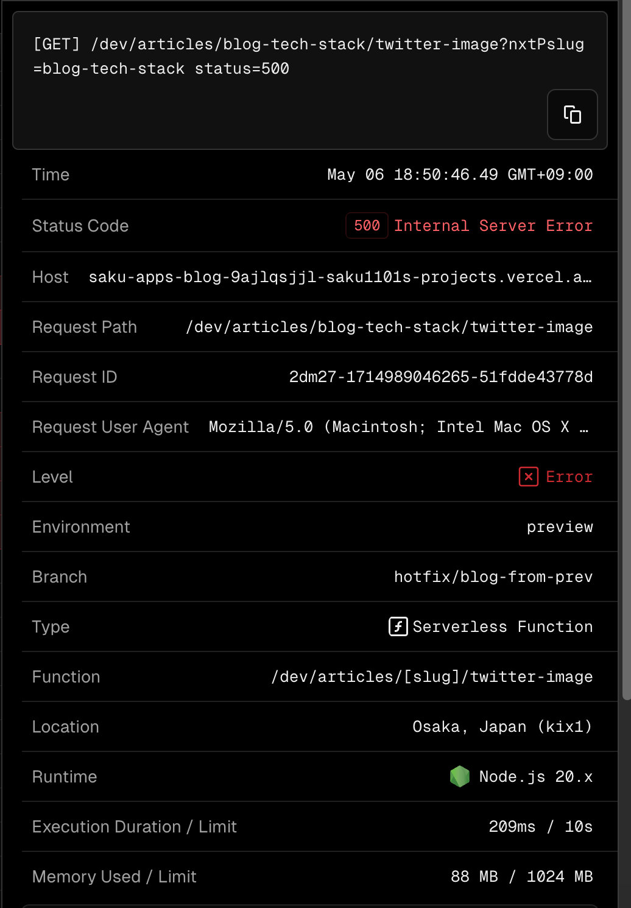

## Table of Contents

## はじめに

[Hono](https://hono.dev/)のフルスタックメタフレームワークである[HonoX](https://github.com/honojs/honox)に[react-renderer](https://github.com/honojs/middleware/tree/main/packages/react-renderer)ミドルウェアを適用して、React ベースの UI フレームワークである[YamadaUI](https://yamada-ui.com/)と[React Flow](https://reactflow.dev/)を使用してポートフォリオサイトを作成しました。

本記事では、作成したポートフォリオサイトを Cloudflare Pages にデプロイするまでの方法をまとめています。

<https://sakupi01.com/>

([リポジトリ](https://github.com/sakupi01/sakupi01.com/tree/main/apps/sakupi01.com))

## HonoXとは

HonoX は、Hono と Vite を組み合わせてできた Hono のメタフレームワークです。ファイルベースルーティングや Island アーキテクチャによる Client Component と Server Component の棲み分け、SSR を実現し、Next.js のようなフルスタック Web フレームワークの書き心地を実現した Hono アプリを作成できます。

詳細は、次の yusukebe さんの記事を参照ください。

<https://zenn.dev/yusukebe/articles/724940fa3f2450>

### セットアップ

[Starter template](https://github.com/honojs/honox?tab=readme-ov-file#starter-template)に倣って、次のコマンドを実行し、`x-basic`を選択します。(※今回はパッケージマネジャに bun を使用しています)

```bash
bun create hono@latest
```

## ディレクトリの構造と役割

実行完了すると、次のようなディレクトリ構成で HonoX アプリが作成されます。

```
.
├── app
│   ├── global.d.ts // global type definitions
│   ├── routes
│   │   ├── _404.tsx // not found page
│   │   ├── _error.tsx // error page
│   │   ├── _renderer.tsx // renderer definition
│   │   ├── about
│   │   │   └── [name].tsx // matches `/about/:name`
│   │   └── index.tsx // matches `/`
│   └── server.ts // server entry file
├── package.json
├── tsconfig.json
└── vite.config.ts
```

<https://github.com/honojs/honox?tab=readme-ov-file#project-structure>

上記の構成とコメントからわかるように、ファイルベースのルーティングや Error Boundary の設置ができることがわかります。

このディレクトリで`bun install`->`bun run dev`を実行し、<http://localhost:5173> にアクセスすると次のように初期画面が表示されます。

_HonoXアプリの初期画面_

## レンダリングの仕組み

レンダーは`_renderer.tsx`で設定されたレンダラーによって行なわれます。デフォルトの場合だと、`hono/jsx-renderer`のレンダラーであることがわかります。

```tsx showLineNumbers {1, 3} title="./app/routes/_renderer.tsx"
import { jsxRenderer } from "hono/jsx-renderer";

export default jsxRenderer(({ children, title }) => {
  return (
    <html lang="en">
      <head>
        <meta charset="UTF-8" />
        <meta name="viewport" content="width=device-width, initial-scale=1.0" />
        {title ? <title>{title}</title> : <></>}
      </head>
      <body>{children}</body>
    </html>
  );
});
```

レンダラーの引き数や戻り値は`global.d.ts`で定義されています。

```ts showLineNumbers title="./app/global.d.ts"
import type {} from "hono";

type Head = {
  title?: string;
};

declare module "hono" {
  interface ContextRenderer {
    (
      content: string | Promise<string>,
      head?: Head
    ): Response | Promise<Response>;
  }
}
```

このように、デフォルトの設定では`hono/jsx-renderer`のレンダラーが使用されており、アプリケーション全体を通して`hono/jsx`コンポーネントが使用されています。
例えば、`hono/jsx`からインポートされた`useState`を使用して、次のように`[route]/app/islands/counter.tsx`を実装できます。

```tsx showLineNumbers {1} title="./app/islands/counter.tsx"
import { useState } from "hono/jsx";

export default function Counter() {
  const [count, setCount] = useState(0);
  return (
    <div>
      <p>{count}</p>
      <button onClick={() => setCount(count + 1)}>Increment</button>
    </div>
  );
}
```

---

しかし、今回は React ベースの UI ライブラリを使用するため、**`hono/jsx`をレンダーする`hono/jsx-renderer`は使用できません。ReactベースのUIライブラリを使用するためには、`react`のJSX(`ReactNode`)をレンダーするための`react-dom/client`が必要です。**

そこで、次のステップでは、`ReactNode`のレンダラーを提供する`react-dom/client`にレンダラーを変更し、使用する JSX を`react`から提供されている`ReactNode`にします🏃🏻‍♀️

## React化する

### レンダラーを変更する

HonoX の面白い特徴として、レンダラーとして Hono 純正の`hono/jsx-renderer`以外の任意のレンダラーを使用できます。

今回は、HonoX で React のレンダラーを用いることで React ベースの UI ライブラリである YamadaUI や React Flow を使用可能にしていきます。

まず、HonoX で ReactNode をレンダリングするために必要なモジュールをインストールします。

```bash
bun add @hono/react-renderer react react-dom hono --exact
bun add -D @types/react @types/react-dom --exact
```

`./app/client.ts`ではクライアントでコンポーネントをレンダリングするためのレンダラーの生成を行なっています。

引数を渡さない場合のデフォルト`createClient`だと、レンダラーは`hono/jsx-renderer`、コンポーネントは`hono/jsx`として生成されます。

今回は、レンダラーを`react-dom/client`、コンポーネントを`react`コンポーネントとして生成するように設定します。

```ts showLineNumbers {5, 9} title="./app/client.ts"
import { createClient } from "honox/client";

createClient({
  hydrate: async (elem, root) => {
    const { hydrateRoot } = await import("react-dom/client");
    hydrateRoot(root, elem);
  },
  createElement: async (type: any, props: any) => {
    const { createElement } = await import("react");
    return createElement(type, props);
  },
});
```

このように設定すると次のような型エラーが出ると思いますが、こちらは Known Issue として確認されており、後続のリリースで修正されると思われますので、現時点では黙認しておきます。

_Known Type Error in the use of react-renderer_

<https://github.com/honojs/honox/issues/87>

次に、`@hono/react-renderer`のレンダラーが受け取る props を定義します。今回はページごとに`title`と`description`を head に設定したかったので次のように定義しました。

```ts showLineNumbers title="./app/global.d.ts"
import "@hono/react-renderer";

type Head = {
  title?: string;
  description?: string;
};

declare module "@hono/react-renderer" {
  interface Props {
    head?: Head;
  }
}
```

最後に、React レンダラーを適用して完成です。

```tsx showLineNumbers {1, 3} title="./app/routes/_renderer.tsx"
import { reactRenderer } from "@hono/react-renderer";

export default reactRenderer(({ children, head }) => {
  return (
    <html lang="en">
      <head>
        <meta charSet="UTF-8" />
        <meta name="viewport" content="width=device-width, initial-scale=1.0" />
        {import.meta.env.PROD ? (
          <script type="module" src="/static/client.js"></script>
        ) : (
          <script type="module" src="/app/client.ts"></script>
        )}
        {head.title ? <title>{head.title}</title> : ""}
        {head.title ? (
          <meta name="description" content={`${head.description}`} />
        ) : (
          ""
        )}
      </head>
      <body>{children}</body>
    </html>
  );
});
```

各 root では`global.d.ts`で定義した props を渡して、次のようにレンダリングを構成できます。

```tsx showLineNumbers title="./app/routes/index.tsx"
import { createRoute } from "honox/factory";
import FlowArea from "@/islands/portal/flowarea";

export default createRoute((c) => {
  return c.render(<FlowArea />, {
    head: {
      // 該当ページのheadをpropsとして渡している
      title: "saku's Portfolio - Home",
      description: "saku's Portfolio",
    },
  });
});
```

### ライブラリを使用する

vite はデフォルトではすべての依存関係を外部化、つまり、開発中にバンドルは行なわずプログラムの配布前にのみ行なうということをします。これにより、ビルドの高速化しています。

しかし、Vite の**SSR**ではリンクされた依存関係は HMR をするために外部化しない、つまり SSR ではリンクされたパッケージをバンドルに含めてビルドします。([Vite - 外部 SSR](https://ja.vitejs.dev/guide/ssr.html#ssr-externals))

しかし、外部化したい、つまりリンクされたパッケージでもバンドルに含めずビルドしたい場合には`ssr.externals`に入れる必要があります。

具体的に`ssr.externals`に含めるパッケージとしては次のようなものが考えられるでしょう。

**1. ブラウザ環境でのみ使用されるパッケージ**

クライアントサイドレンダリング用のライブラリは、サーバー側レンダリング時には不要だからです。
例えば、YamadaUI の場合は次のようなエラーが出ます。

```bash
...
11:17:53 AM [vite] Error when evaluating SSR module /@fs/Users/s002996/Develop/sakupi01.com/node_modules/@yamada-ui/core/dist/index.mjs: failed to import "/@fs/Users/s002996/Develop/sakupi01.com/node_modules/react-fast-compare/index.js"
|- ReferenceError: module is not defined
    at eval (/Users/s002996/Develop/sakupi01.com/node_modules/react-fast-compare/index.js:125:1)
    at instantiateModule (file:///Users/s002996/Develop/sakupi01.com/node_modules/vite/dist/node/chunks/dep-DkOS1hkm.js:55036:15)

...
```

**2. Node.js依存のパッケージ**

Node.js 依存のコードには、Node.js 固有の API、グローバル変数、モジュールシステムなどが使われており、これらはブラウザ環境では存在しません。そのため、Vite が Node.js 依存コードをそのままトランスパイルしようとするとエラーになります。

そのため、Node.js 依存のパッケージは `ssr.external` に含める必要があるでしょう。
これにより、Vite はそのパッケージをバンドル化せずに、Node.js 実行環境から直接読み込むようになります。

`ssr.external` に含めないと、逆に Vite はそのパッケージをバンドル化しようとしてエラーとなってしまいます。

<https://ja.vitejs.dev/config/ssr-options#ssr-%E3%82%AA%E3%83%95%E3%82%9A%E3%82%B7%E3%83%A7%E3%83%B3>

---

従って、`vite.config.ts`の`ssr.external`を次のように追加して、YamadaUI と React Flow をクライアントサイドで使用できるようにします。

```ts
export default defineConfig(({ mode }) => {
    ...
      return {
      ssr: {
        external: [
          "react",
          "react-dom",
          "@yamada-ui/react",
          "@yamada-ui/core",
          "reactflow",
        ],
      },
      ...
    };
});
```

これで、HonoX で React や React に依存している UI コンポーネントを使用できるようになりました🎉

YamadaUI や React Flow は、各ライブラリの公式ドキュメントに従うことで使用できます。

- [YamadaUI - Getting Started with Hono](https://yamada-ui.com/getting-started/frameworks/hono)
- [React Flow](https://reactflow.dev/)

## bunでCloudflare Pagesにデプロイする

Cloudflare Pages のプロジェクトを作成し、GitHub と統合します。これにより、`main`ブランチに変更があった際、Cloudflare Pages へ自動デプロイされるようになります。

しかし、初期設定のまま、パッケージマネジャとして bun を使用して Cloudflare Pages で依存関係をインストールすると次の状態から進行しませんでした。

```bash
10:44:26.853 Installing project dependencies: bun install --frozen-lockfile
10:44:27.101 bun install v1.0.1 (32abb4eb)
```

パッケージマネジャに bun を用いる場合は、現状次の環境変数の設定が必要なようです。

_Cloudflare Pagesでbunを使用する環境変数設定_

<https://gist.github.com/Hebilicious/88e5a444f42b8dc09fb86dfa865c6ed3>

上記の事情により、`SKIP_INSTALL_DEPENDENCY=true`としているのでビルドコマンドに`bun install`を含めます。

あとは、上記を含めたビルドコマンドを構成し、ビルド出力ディレクトリなどを設定したら Cloudflare Pages にデプロイされるはずです🚀

---

## おまけ - モノリポにおける依存関係との仁義なき戦い

本当は２日前くらいにデプロイ＆この記事を書いていて、「よーし、ツイートして終わり〜〜」と思っていたのですが、投稿時に og 画像がいつものようにうまく表示されなくなっていました。

ブログアプリは Vercel にデプロイしているので、Vercel のログを確認してみたところ、og 画像生成のためのファイルにうまくアクセスできていないようでした。

_OG画像にアクセスした時のServerless Functionsでのエラー_

```
⨯ Error: ENOENT: no such file or directory, open '/var/task/articles/_dev/blog-tech-stack.md'
    at Object.readFileSync (node:fs:457:20)
    at c (/var/task/apps/blog.sakupi01.com/.next/server/app/dev/articles/[slug]/twitter-image/route.js:1:4090)
    at w (/var/task/apps/blog.sakupi01.com/.next/server/app/dev/articles/[slug]/twitter-image/route.js:1:1018)
    at F (/var/task/apps/blog.sakupi01.com/.next/server/app/dev/articles/[slug]/twitter-image/route.js:1:2527)
    at /var/task/node_modules/next/dist/compiled/next-server/app-route.runtime.prod.js:6:34672
    at /var/task/node_modules/next/dist/server/lib/trace/tracer.js:140:36
    at NoopContextManager.with (/var/task/node_modules/next/dist/compiled/@opentelemetry/api/index.js:1:7062)
    at ContextAPI.with (/var/task/node_modules/next/dist/compiled/@opentelemetry/api/index.js:1:518)
    at NoopTracer.startActiveSpan (/var/task/node_modules/next/dist/compiled/@opentelemetry/api/index.js:1:18093)
    at ProxyTracer.startActiveSpan (/var/task/node_modules/next/dist/compiled/@opentelemetry/api/index.js:1:18854) {
  errno: -2,
  code: 'ENOENT',
  syscall: 'open',
  path: '/var/task/articles/_dev/blog-tech-stack.md'
}
```

原因を調査したところ、`./apps/blog.sakupi01.com`と`./apps/sakupi01.com`間での依存関係に整合性が取れてなかったことが問題だとわかりました。

具体的には、`./apps/sakupi01.com`を付け足しで作った際にインストールした`@hono/react-renderer`の内部依存パッケージ A が、別マイクロサービスである`./apps/blog.sakupi01.com`で`^x.y.z`としてインストールしていたパッケージ A とバッティングして、元々`./apps/blog.sakupi01.com`で動いていたパッケージ A のバージョンが上書きされてしまったことが原因でした。

解決方法としては、`npm list --depth=0 --prod`で実際に使用されているパッケージのバージョンを全て吐き出し、`^`を外して、そのバージョンを exact インストールすることで事なきを得ました......

特にモノリポ開発では、範囲を持ったままパッケージをインストールすることはキケンということを再認識させられるいい機会でした🙇🏻

---

## 参考

[honojs/honox: HonoX - Hono based meta framework](https://github.com/honojs/honox)

[フルスタック Web フレームワーク HonoX を使ってみる](https://azukiazusa.dev/blog/full-stack-web-framework-honox/)

[Viteでの開発中のSSR対応の仕組み | 東京工業大学デジタル創作同好会traP](https://trap.jp/post/1863/)

[middleware/packages/react-renderer at main · honojs/middleware](https://github.com/honojs/middleware/tree/main/packages/react-renderer)

[yusukebe/honox-react-nested-islands at island-in-island](https://github.com/yusukebe/honox-react-nested-islands/tree/island-in-island)

[createRoot – React](https://react.dev/reference/react-dom/client/createRoot)

[HonoX+Cloudflare Pagesで静的ファイルを読み込む](https://hono.dev/getting-started/cloudflare-pages)
