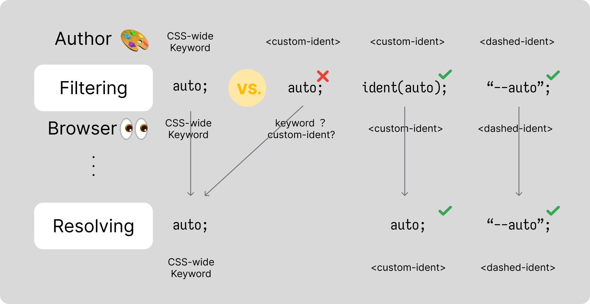

## Table of Contents

## はじめに

CSS で引数を連結して `<custom-ident>` を生成する `ident()` の仕様策定とブラウザでの実装が進んでいます。
`ident()` は昨年のこの時期くらいから Chrome で実装が始まりました。

- The `ident()` function - Chrome Platform Status
  - https://chromestatus.com/feature/6230159413477376

しかし、固まっていない仕様は今でも多く、ブラウザでの実装を進めながら、並行して仕様も改善していく動きがみられます。

今回は、その仕様改善の中で面白い提案が取り入れられたため、その紹介も兼ねて背景を解説しようと思います。

## おさらい

`ident()` は `<string>` `<integer>` `<ident>` のデータ型を一つ以上受け取り、それらを連結して `<custom-ident>` 型として返却するものです。

```
<ident()> = ident( <ident-arg>+ )
<ident-arg> = <string> | <integer> | <ident>
```

- CSS Values and Units Module Level 5
  - https://drafts.csswg.org/css-values-5/#ident

昨今の CSS においては、 特定のプロパティをカスタムな名前の値でラベリングし、固有の位置関係や動きを紐づけ可能にするといったことが増えてきました。その紐付けに利用する名前が、仕様でいうところの `<custom-ident>` や `<dashed-ident>` です。これらを利用するプロパティの一例を挙げるとしたら以下のようなものでしょうか。

- `container-name`
- `view-transition-name`
- `animation-timeline`
- `view-timeline`
- `scroll-timeline`
- `anchor-name`
- `position-anchor`
- ...

特に大規模な開発でこうしたカスタムな名前が保守に耐えうるには、その名前をある程度一位に、動的につけられると非常に助かることは容易に想像できると思います。
クラス名一つ一つを手作業で管理可能であれば良いですが、大規模開発ではバンドラを使って一位なクラス名を動的に生成できると嬉しい、そういう感覚に近いです。

最初の提案からも分かる通り、`ident()` はこうした需要を満たすために提案されました。

- [css-values] A way to dynamically construct custom-ident and dashed-ident values · Issue #9141 · w3c/csswg-drafts
  - https://github.com/w3c/csswg-drafts/issues/9141

`ident()` は、同時期に仕様が策定されていた `sibling-index()` などと併用することで、ある程度動的な `<custom-ident>` や `<dashed-ident>` の生成が可能になります。

```css
.item {
  /* vtl-1, vtl-2, vtl-3, … */
  view-timeline-name: ident("vtl-" sibling-index());
}
```

## `ident()` 早期評価の提案

`ident()` では、早期評価または楽観的パースの手法が検討されました。

- [css-values-5] Can `ident()` bypass dashed-ident requirements? · Issue #12206 · w3c/csswg-drafts
  - https://github.com/w3c/csswg-drafts/issues/12206

具体的にどういう提案かをみていきます。

例えば `scroll-timeline-name` は通常 `--timeline-name` のような `<dashed-ident>` しか受付けません。しかし提案は、`ident()` を噛ませて `scroll-timeline-name: ident(timeline-name);` と指定すれば、それも有効で良いのではないか？という主張でした。

言い換えると、`ident()` で計算した結果、`scroll-timeline-name: timeline-name;` となっても良いのではないかということです。つまり、 `scroll-timeline-name`が `<dashed-ident>`（`--`） ではなく `<custom-ident>` を受け取れるようになるということになります。

筆者は当初、仕様では `<dashed-ident>` しか許容しないと言っているのに、なぜその定義に沿わない（`<custom-ident>` でも許容するという）提案をしているのだろう？と思いました。

しかし、そもそもなぜ `<dashed-ident>`なのか？ということを考えると、これがかなり合理的な提案に見えてきます。

## dashed-ident

CSS でカスタムの識別子（タイムライン名やコンテナ名）を決めるとき、`<dashed-ident>`（`--` で始まる識別子）が要求されるのは、「**CSS のキーワードとユーザ定義のカスタム識別子が衝突するのを防ぐため**」 です。

例えば、もし `scroll-timeline-name: none;` と書いたとき、これが「`none` というカスタムの識別子」なのか「CSS キーワードの `none`」なのか、ブラウザは区別がつきません。

つまり、よく考えずにカスタムな名前に使ったら、将来 CSS に新機能や新しいキーワードが同じ名前で追加されたとき、そのサイトの表示が崩れてしまう危険が生まれるでしょう。

もしそうしたカスタム名がポリフィルなどで多用されてしまった場合、既存のウェブサイトの互換性を重視して、そのキーワードをウェブ標準で利用できず、仕様側としても非常に苦しい思いをすることになります。

こうしたトラブルを避けるために、「ユーザーが自由に命名していい名前空間として `--` あげるから、これ使ってね」というルール（`<dashed-ident>`）があるのです。

## `ident()` を利用した競合の回避

CSS は大体以下のような手順で処理されます。そして、その結果得られる値には対応する名前が付いています。

1. **Filtering** → Declared Values
2. Cascading → Cascaded Values
3. Defaulting (e.g. Inheritance) → Specified Values
4. **Resolving** → Computed Values
5. ...

- CSS Cascading and Inheritance Level 5
  - https://www.w3.org/TR/css-cascade-5/#value-stages

プロパティと指定した値のペアが、文法的に正しいかどうかの静的検証は「Filtering」フェーズで行われます。

この Filtering での検証には、CSS キーワードとの比較も含まれます。`<custom-ident>` を想定して指定した値がすでにあるキーワードとマッチしてしまった場合、それは `<custom-ident>` ではなく、**キーワードとして評価され、ブラウザ内で扱われる**ことになります。
例えば、著者側が `<custom-ident>` を意図して `auto` を利用しても、著者がそれをキーワードを意図してるのか `<custom-ident>` を意図してるのかは、ブラウザは判断できません。よって、ブラウザは `auto` **キーワードとして解釈**します。
このように Filtering 時に値が意図せずキーワードとして評価されることを防ぐため、`<dashed-ident>` である必要があるのです。

しかし、`ident()` を用いた場合はどうでしょうか？

`ident()` は `<custom-ident>` を返す仕様です。 つまり、**`ident()` を使えば、その値はキーワードではなく `<custom-ident>` だと明示したことになります**。たとえ `ident(auto)` でも、ブラウザは `<custom-ident>` として解釈できます。
よって、ブラウザはキーワードか `<custom-ident>` かを混同せずに、安全に `<custom-ident>` と判断して処理できるのです。



これが、Working Group に提案された `ident()` が `<custom-ident>` を示せることを利用した、dashed-ident の利用を必須としない提案だったのです。

- [css-values-5] Can `ident()` bypass dashed-ident requirements? · Issue #12206 · w3c/csswg-drafts
  - https://github.com/w3c/csswg-drafts/issues/12206

単に `<custom-ident>` 型を返すだけでなく、`ident()` を**キーワードとカスタムの識別子の棲み分けに利用する**、つまり`ident()` が `<dashed-ident>` の代わりになる、新たなユースケースの提案だったです。

## 任意代入関数 と Invalid at computed value time

`ident()` で `<dashed-ident>` を一律バイバスする案には他にもメリットがあります。

`ident()` では例えば以下のような書き方を許可しています。

```css
html {
  --nondash-value: nondash;
}
.class {
  scroll-timeline-name: ident(
    var(--nondash-value)
  ); /* scroll-timeline-name: nondash; INVALID!! */
}
```

`scroll-timeline-name` は `<dashed-ident>` しか受け付けないため、現状の `ident()` ではこれは無効です。

しかし CSS では「無効」と判断されるタイミングにも良し悪しがあり、この例はあまり好まれないタイミングでの無効評価です。この「良し悪し」を説明するために、「任意代入関数」と 「IACVT (Invalid at computed value time)」 について知る必要があります。

### 任意代入関数

`var()`, `env()`, Custom Function などの中の識別子は、**パース時点ではとにかくなんでもありのただのトークン列**として扱われる関数です。覚える必要は全くないですが、中の識別子は「なんでもあり」なので、[Arbitrary Substitution Functions](https://drafts.csswg.org/css-values-5/#arbitrary-substitution) (任意代入関数, arb-sub functions) と呼ばれたりします。

ではこれらの関数中の識別子がいつ計算・評価されるのかというと、それが「Resolving」です。Resolving の結果、 Computed Values が導出されるので、このタイミングはしばしば 「Computed-value time」 と呼ばれます。

1. **Filtering** → Declared Values
2. Cascading → Cascaded Values
3. Defaulting (e.g. Inheritance) → Specified Values
4. **Resolving** → Computed Values
5. ...

`var()` や `env()` はその中の値の有効無効に関わらず、一旦 Filtering をパスさせなければなりません。値を評価する上で、 Cascading や Defaulting(Inheritance) といった「スタイルシート全体のコンテキストを要する動的な計算」が必要だからです。Filtering のような静的な処理だけでは、`var()` が有効か無効かは判別できません。

```css
html {
  --🦄✨: rebeccapurple;
}

.class {
  --🦄✨: #ff00ff;
  color: var(--🦄✨); /* Cascade の結果 --🦄✨ は #ff00ff で値が確定する */
}
```

これらは、Computed-value time で初めて実際の値が代入される関数です。つまり、Computed-value time で失敗したら無効化（invalidate）される値になります。
「Conputed-value time で弾かれるなら、別に何も問題ないんじゃないの？」となるかもしれませんが、実はそうでもない話です。
「Filtering（構文チェック）をパスしたものが、後からやっぱり無効になる」挙動を可能な限り避けたいのは、主に以下の理由からです。

#### フォールバック

CSS の強力な機能として、「未知の構文はパース時点で無視し、前の行の指定にフォールバックする」という仕組みがあります。
新機能を安定した機能の後に書き、「サポート環境では新しい機能を、未サポート環境でも最低限の機能を提供できる」という、プログレッシブエンハンスメントを CSS が実現できるのもこのおかげです。

```css
color: #ff0000; /* OKLCH が未サポートならこっち */
color: oklch(0.7 0.32 328.37 1); /* OKLCH がサポートされてるならこっち */
```

しかし、Conputed-value time で弾かれる場合、このフォールバック挙動は機能しないというのは、見落とされがちなポイントです。

```css
view-transition-name: fallback-name; /* Cascade で棄却される */
view-transition-name: ident(
  "-ua" -2 "-name"
); /* 計算時に無効とみなされる IACVT!! -> unset */
```

どちらも構文的には正しいので Filtering をパスし、Cascading で前に書かれた宣言が後の宣言に上書きされます。その後、Resolving で `-ua-2-name` になってから「やっぱり無効」となるため、結果として何も適用されない `unset` が適用されます。

1. **Filtering** → Declared Values
2. Cascading → Cascaded Values
3. Defaulting (e.g. Inheritance) → Specified Values
4. **Resolving** (Computed-Value Time) → Computed Values
5. ...

もし置き換えた後の値がそのプロパティの構文として不正だった場合、そのプロパティは計算時（Computed-time）に無効と判断されるため、しばしば **IACVT**（Invalid at Computed-Value Time：計算値時点での無効）と呼ばれます。

IACVT になるとフォールバックが効かないだけでなく、DevTools でのデバッグも非常にしにくいです。ブラウザエンジン的には、計算時までメモリを確保し、Cascade や Defaulting の処理にも影響するので、パフォーマンス的にも避けたい話です。

それゆえ、できるだけ IACVT にならないよう、つまりパース時点で構文の有効・無効を検知できるような力学が自ずと仕様に働きます。

---

`ident()` で `<dashed-ident>` を一律バイバスする案では、これまで IACVT になっていた以下のような宣言を有効とみなせます。

```css
html {
  --nondash-value: nondash;
}
.class {
  scroll-timeline-name: ident(
    var(--nondash-value)
  ); /* ident() を挟んでいるので有効値 */
}
```

IACVT になる可能性を少しでも狭められるなら、仕様的にはその提案を受け入れる価値があるのです。

しかし、現時点ではこの提案は受け入れることは難しいと判断されています。その理由が「シリアライズの難しさ」です。

## シリアライズ

CSS エンジンはざっくり以下のような手順で値を扱います。

1. Parsing
2. Representation
3. Evaluation
4. Serialization

ブラウザは、CSSを読み込むとテキストのまま保持するのではなく、内部表現に変換します。エンジンによって呼び方に違いはあると思いますが、構文をパース（Parse）し、内部表現に変換（Representation）するといいます。その内部表現を用いて計算（Evaluation）された結果が、レンダリングに利用されます。

ざっくりいうと、この内部表現を、再び CSS の構文に則った人間の読めるテキストに戻す作業が「シリアライズ」です。シリアライズは JS でスタイルを取得するときや、DevTools で値を確認するときに必要な処理です。

ここでもし、もし `scroll-timeline-name: ident("none")` を許可して、ブラウザ内部で `<custom-ident>` として保持したとします。これを JS で取得しようとしたとき、ブラウザは何を返すべきでしょうか？

単に `"none"` と返すと、 `none`（キーワード）と区別がつきません。つまり、シリアライズ結果がパース結果と一致しない可能性があります。
もし、ブラウザが良かれと思って特殊な変換を施した結果、それをシリアライズした時に別の意味に解釈され、シリアライズ結果と、パース結果が異なることがあってはなりません（シリアライズとパースで Round-trip 可能でなければならない）。

提案においてキーワードと `<custom-ident>` をきちんと区別してシリアライズするには、`<custom-ident>` の場合は `ident("none")` という形で返してあげる必要があります。

この変換はおそらく非常にバグが生まれやすいです。
例えば `<dashed-ident>` でなければならないが、なぜか `<custom-ident>` で渡ってきているものに対して全て `ident()` を付与してシリアライズしてあげる必要があります。
また、キーワードのシリアライズに至っては、元の構文（`ident()` 経由だったか、リテラルだったか）の区別をシリアライズ時まで引き回すために、本来不要なメタデータをブラウザで保持し続けなければならなくなります。少し考えただけでも、実装が非常に複雑になることがわかるくらいです。

シリアライズの複雑さを主な理由に、`ident()` で `<dashed-ident>` を一律バイバスする案は白紙に戻りました。

## Mock evaluation

それでも、 IACVT になることはでできるだけ避けるのが望ましいです。

そこで出た画期的な案が「**Mock evaluation**」でした。これは「**数値ならば 0 としてパースしてしまおう**」という、数値に関して非常に楽観的な見方をするパースです。

例えば、以下のように `ident()` を関数と組み合わせた場合、その関数の結果はパース時点では不明なので、宣言の評価ができません。もし計算の結果無効だった場合は、IACVT にするしかなくなります。

```css
scroll-timeline-name: ident(
  "timeline-" sibling-index()
); /* <dashed-ident> でないので IACVT */
```

ここで、**`<number>` を `0` とみなせば、パース時の評価が可能になる**のでは？というのが Mock Evaluation のアイディアです。

```css
scroll-timeline-name: ident(
  "timeline-" 0
); /* <number> を返すものは 0 をダミーとして置換する */
```

これにより、**`<number>` が入る部分はとりあえず 0** であると仮定して、全体が有効な識別子のルール（`--` で始まっているか等）を満たすかパース時にチェックできます。
つまり、**`<number>` を返す関数に限っては、IACVT になることを防げる**のです。

まだ実装は途中段階ですが、WebKit はこの [RESOLUTION](https://github.com/w3c/csswg-drafts/issues/12206#issuecomment-3998743769) に準拠して、ダミーデータを利用した値の早期評価を行っています。

```cpp
// WebKit/Source/WebCore/css/values/primitives/CSSCustomIdent.cpp
...
        [&](const IdentFunction& function) {
            // Build the identifier with every <integer> argument treated as "0", then test the prefix.
            // https://github.com/w3c/csswg-drafts/issues/12206#issuecomment-3998743769
            StringBuilder builder;
            for (auto& argument : function.parameters) {
                WTF::switchOn(argument,
                    [&](const IdentFunctionIdent& ident) { builder.append(ident.value); },
                    [&](const String& string) { builder.append(string.value); },
                    [&](const Integer<>&) { builder.append('0'); }
                );
            }
            return StringView { builder }.startsWith(prefix);
        }
...
```

> RESOLVED: only allow literal strings and idents, and `<number>`s. for validity purposes, pretend the `<number>`s are "0".
> RESOLVED: リテラル文字列と識別子、および`<number>`のみを許可します。有効性を確認するため、**`<number>`は「0」であるとみなします**。

## まとめ

キーワードと `<custom-ident>` が混同されないよう、これまでユーザには `<dashed-ident>` での名前空間の隔離を求めてきました。
しかし、 `ident()` が `<custom-ident>` を返すことを活かして、キーワードとカスタムの識別子の棲み分けに利用する、つまり`ident()` を `<dashed-ident>` の代わりに利用できるようにする。最終的にはシリアライズの複雑さから白紙に戻りましたが、個人的にはとても面白い発想だなと思いましたし、そこから学ぶことも多くありました。

CSS では、計算時に値が無効になることはできるだけ避けられます。これに対して IACVT という名前がつくほど、仕様策定の際には IACVT を防ぐ努力がなされます。

こうした背景から、`ident()` で `<dashed-ident>` を一律バイバスする案が実現されなくても、Mock Evaluation による早期評価により、IACVT を防ぐ仕組みが検討されました。

しかし、Mock Evaluation によって期待しない挙動になる可能性もあると個人的には考えています。

例えば、`<number>` を一律で 0 とみなしてしまうと、主に符号が絡んだ時に構文解釈のずれが生じる可能性があります。

```css
scroll-timeline-name: ident("-" -1); /* Parsed as "-0" and it's not valid!*/
```

このように、本来は `"--1"` となり正しいはずの記述が、`"-0"` に Mock Evaluate されて無効とみなされます。

逆に、本来無効にすべき不正な記述をすり抜けてしまう可能性もあります。
以下の例では Mock evaluation しなければ `-ua-2-name` となるため、本来であればパース時に `-ua-` から始まるため無効にできます。

```css
view-transition-type: ident("-ua" -2 "-name"); /* Parsed as "-ua0-name" */
```

しかし、Mock evaluation により `-ua0-name` としてパース時評価されるため、逆にパース時に無効性を検知できず、結果として計算時無効、IACVT にせざるを得ません。

という懸念は残るものの、現状は Working Group の RESOLUTION を反映し、多くのケースにおける IACVT を防ぎつつ、将来的にエッジケースも含めて改善できれば良いのかなと思います。
