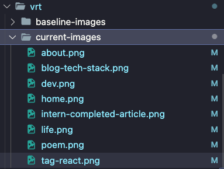
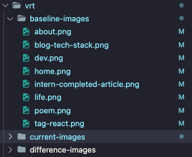
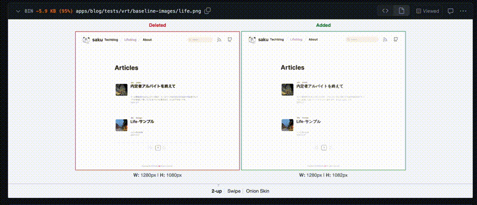
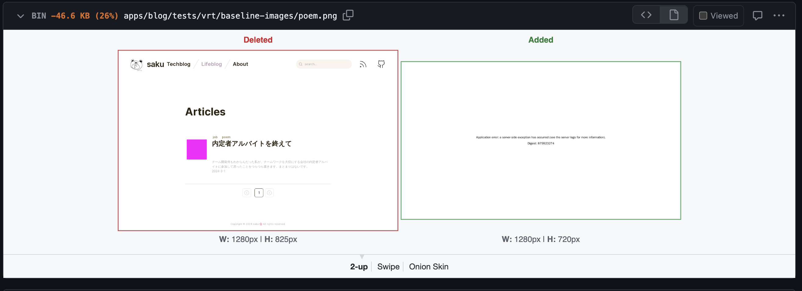

## Table of Contents

## はじめに

2 月に開催された[#vrt4選](https://twitter.com/hashtag/VRT4%E9%81%B8)という勉強会に参加した際、その中で紹介されていた Lost Pixel というツールに興味を持ちました。

👇該当のスライド

<https://speakerdeck.com/aiji42/vrtturunodakuhosu-lost-pixelwoshao-jie-sitai>

普段は専ら[Chromatic](https://www.chromatic.com/)ユーザなのですが、個人開発の際、無料枠の上限にヒットして痛い目にあった過去があるので、今回個人ブログでは Lost Pixel で VRT を行うことにしてみました💸

[#vrt4選](https://twitter.com/hashtag/VRT4%E9%81%B8)では詳細な実装や VRT の一連の流れまで述べられていなかったかつ、Lost Pixel はまだあまり普及しておらず、発表者の方のスライド以外で使用例があまり見つからなかったため、今回は Lost Pixel を用いた具体的な VRT の運用方法をまとめてみました。

## 前提

前提として、Next.js 製のブログアプリを含むモノリポ構成でできている、このブログアプリの`/apps/blog`マイクロサービスに VRT を施していきます。

ブログアプリの全体像は次の通りです。

<https://blog.sakupi01.com/dev/articles/blog-tech-stack>

### Lost Pixelとは

Lost Pixel とは、VRT(Visual Regression Test, ビジュアル回帰テスト)を行うためのツールです。

<https://www.lost-pixel.com/>

簡単に、VRT とは、コードベースの変更の前後でビジュアル的な（ここでは Web UI に対して）意図せぬ変化が生じていないかを検知するテストです。

VRT は Unit テストや Integration テストを代替するものではなく、これらのテストに加えて、人間が目視で認識しにくい部分のデグレでも、機械的に自動で見た目の正当性を担保するためのテストです。

VRT に関するより詳細な説明は以下を参照ください。

<https://www.lost-pixel.com/blog/visual-regression-testing-101>

VRT を実現するためのツールは、Chromatic, storycap でのスナップショット+reg-suit での差分比較**など**が挙げられますが、Lost Pixel の OSS モードを使用すると、私がこれまで使用した範囲では次のような利点がありました。

⭐️メリット

- OSS モードだと、Github をフル活用することで、無料で VRT できる基盤が作れる
- Storybook や Ladle, Histoire, ページ単位のスクリーンショット、Cypress や Playwright を用いたスクリーンショットなど様々な撮影方法が可能
- VRT での差分チェックを GIthub での PR レビューに組み込める
- マスキング機能があり、コントロールが難しいランダムな要素を差分チェックから除外でき、本質的な部分の検証が容易
- ズレの閾値やスクリーンショットを撮るまでの待機時間、networkRequest やページロードのタイムアウト時間を細かく設定できる
- config ファイルが TypeScript で書ける

重複した説明が発生するため、ここでは簡単な説明に止めて詳細は[スライド](https://speakerdeck.com/aiji42/vrtturunodakuhosu-lost-pixelwoshao-jie-sitai)や[Zennの記事](https://zenn.dev/aiji42/articles/6656072a954a9b)に譲りたいと思います。

## セットアップ

ページ単位のスクリーンショットのため、次のドキュメントの Page shots 部分を参照します。

<https://docs.lost-pixel.com/user-docs/setup/project-configuration/modes#page-shots>

ベースは上記の通りですが、今回はモノリポかつ CI の使用ということを加味して、次のように変更を加えています。

<details>

```ts showLineNumbers {7} title="lostpixel.config.ts"
import { CustomProjectConfig } from "lost-pixel";

export const config: CustomProjectConfig = {
  pageShots: {
    pages: [
      { path: "/", name: "home" },
      { path: "/about", name: "about" },
      { path: "/dev", name: "dev" },
      { path: "/dev/articles/blog-tech-stack", name: "blog-tech-stack" },
      { path: "/dev/tag/react", name: "tag-react" },
      {
        path: "/life", // 🟢スクリーンショットを撮るページのpath
        name: "life", // 🟢スクリーンショットの名前
        threshold: 0.004, // 🟢閾値。どのくらいのズレまで許容するか
        mask: [{ selector: ".eye-catch" }], // 🟢マスクをかけるセレクタ
      },
      {
        path: "/life/articles/intern-completed-aritcle",
        name: "intern-completed-article",
        mask: [{ selector: ".thumbnail" }],
      },
      {
        path: "/life/tag/poem",
        name: "poem",
        threshold: 0.006,
        mask: [{ selector: ".eye-catch" }],
      },
    ],
    // 🟢ローカルで実行するときのIPはlocalhostで、Github Actionで実行するときのIPは172.17.0.1に設定する
    baseUrl: process.env.LOCAL
      ? "http://localhost:3000"
      : "http://172.17.0.1:3000",
  },
  waitBeforeScreenshot: 5000,// 🟢
  timeouts: {
    loadState: 50000, // 🟢
    networkRequests: 50000, // 🟢
  },
  
  // OSS mode
  // 🟢モノリポの場合、Github Actionで実行するときのパスはプロジェクトのrootからのパスを設定する
  imagePathBaseline: process.env.LOCAL // 🟢baselineイメージの格納先。ここに格納されているスクリーンショットが比較基準
    ? "./tests/vrt/baseline-images"
    : "./apps/blog.sakupi01.com/tests/vrt/baseline-images",
  imagePathCurrent: process.env.LOCAL // 🟢currentイメージの格納先。現状のスクリーンのキャプチャで、baselineと比較される
    ? "./tests/vrt/current-images"
    : "./apps/blog.sakupi01.com/tests/vrt/current-images",
  imagePathDifference: process.env.LOCAL // 🟢differenceイメージの格納先。currentImageとbaselineImageの差分画像
    ? "./tests/vrt/difference-images"
    : "./apps/blog.sakupi01.com/tests/vrt/difference-images",
  generateOnly: true,

  // 🟢baselineとcurrentに差分がある時は実行結果をfailとしてマーク
  failOnDifference: true,
};
```

</details>

## プロジェクトに適用

### 運用シナリオ

早速、プロジェクトに Lost Pixel を適用していく手順を見ていきます👀

まず、今回の運用シナリオは以下とすることにします。

- モノリポの`apps/blog`で実装されているブログアプリのマイクロサービスに対して、**ページ単位のスクリーンショット**を撮ることで UI 差分比較
- デフォルトブランチを`main`, Lost Pixel を取り入れるためのブランチを`feat/lost-pixel`とする
- feature ブランチ`feat/lost-pixel`の PR チェック時に Github Actions で Lost Pixel OSS モードを用いた VRT を行う
- 差分が検出された場合は`/update-vrt`と PR にコメントを入れることで、ベースライン画像の更新 PR`lost-pixel-update/[base-pr-name]`を元ブランチ`feat/lost-pixel`から新たに作成する
- `lost-pixel-update/[base-pr-name]`のベースライン画像の差分を Image Diff を用いて確認・レビューし、マージする
- 元ブランチ`feat/lost-pixel`上で VRT が再度走り、チェックが pass する

おおまかな流れを掴んだところで、実際に手順を確認していきましょう🏋🏻

### ローカルで確認

#### 0. ローカルで差分確認する

`package.json`に次のコマンドを追加します。
[セットアップ](https://blog.sakupi01.com/dev/articles/lost-pixel-practice#セットアップ)で設定した`lostpixel.config.ts`の内容をよく見ると、環境変数の値によって設定値を変えている部分があるので、そこを加味したスクリプトにします。

```json showLineNumbers {5, 6} title="./apps/blog.sakupi01.com/package.json"
{
    ...
    "scripts": {
        ...,
        "lost-pixel": "LOCAL=true lost-pixel",
        "lost-pixel:update": "LOCAL=true lost-pixel update",
        ...
    }
    ...
}
```

上記のように`LOCAL=true`としているのは、npm scripts を使用して実行するのはローカルだけで、CI では[lost-pixelのアクション](https://github.com/lost-pixel/lost-pixel)を使用するので、この scripts の LOCAL 環境変数は`true`に設定しておいて問題ないです。

次のコマンドで、手元の環境で差分を確認してみると、わたしのプロジェクトでは次のようにスナップショットが出力されます。

```bash
bun lost-pixel
```


*lost-pixel初回実行の出力*

#### 1. baselineをupdateする

ところが、初めて実行すると、次のように、「baseline のスクショがないから比較できないよ〜」の例外がスローされます。

```bash {6, 8, 10, 13, 14}
Screenshots done!
Creating shots took 20.902 seconds
🔍 Checking differences
Comparing 8 screenshots using 'pixelmatch' as compare engine
[1/8] Comparing 'home' (home)
[1/8] Baseline image missing. Will be treated as addition. (home)
[2/8] Comparing 'about' (about)
[2/8] Baseline image missing. Will be treated as addition. (about)
[3/8] Comparing 'dev' (dev)
[3/8] Baseline image missing. Will be treated as addition. (dev)
...
Comparison done!
👋 Exiting process with 0 found differences & 8 baselines to update
Sending anonymized telemetry data.
error: script "lost-pixel" exited with code 1
```

なので、ベースラインとなる画像をアップデートして、比較基準を生成してあげます。

```bash
bun lost-pixel:update
```

すると、次のように baseline-images にベースライン画像が格納されていることが確認できます。

*ベースライン画像が生成される*

しかし、baseline-images と current-images の比較がベースライン画像のアップデートよりも先に行われている可能性があるからか、またもや例外がスローされます。

```bash {12, 13}
Screenshots done!
Creating shots took 13.659 seconds
🔍 Checking differences
Comparing 8 screenshots using 'pixelmatch' as compare engine
[1/8] Comparing 'home' (home)
[1/8] Baseline image missing. Will be treated as addition. (home)
[2/8] Comparing 'about' (about)
[2/8] Baseline image missing. Will be treated as addition. (about)
...
Comparison done!
Removing 0 files from ./tests/vrt/baseline-images
👋 Exiting process with 0 found differences & 8 baselines to update
Sending anonymized telemetry data.
error: script "lost-pixel:update" exited with code 1
```

#### 2. もう一度差分確認をする

とはいえ、base-images の更新はできているようなので、もう一度差分の確認をします。

```bash
bun lost-pixel
```

すると、今回は例外はスローされずにプロセスが完了しました🎉

```bash {9, 10, 11}
Screenshots done!
Creating shots took 12.356 seconds
🔍 Checking differences
Comparing 8 screenshots using 'pixelmatch' as compare engine
[1/8] Comparing 'home' (home)
[2/8] Comparing 'about' (about)
[3/8] Comparing 'dev' (dev)
...
[1/8] No difference found. (home)
[2/8] No difference found. (about)
[3/8] No difference found. (dev)
...
Comparison done!
⏱  Checking differences took 0.014 seconds
⏱  Lost Pixel run took 12.371 seconds
Sending anonymized telemetry data.
```

この流れを CI 上でもおこない、PR マージの際に自動チェックしていきましょう🏌🏻‍♀️

### 運用の準備

#### 3. Workflowを作成する

Github Actions を用いて CI として動かすための Workflow ファイルを作成していきます。

[運用シナリオ](https://blog.sakupi01.com/dev/articles/lost-pixel-practice#運用シナリオ)で述べた次の流れを実現するために、次からの項目で`vis-reg-test.yml`と`update-lostpixel.yml`を作成します。
>
> - featureブランチ`feat/lost-pixel`のPRチェック時にGithub ActionsでLost Pixel OSSモードを用いたVRTを行う
> - 差分が検出された場合は`/update-vrt`とPRにコメントを入れることで、ベースライン画像の更新PR`lost-pixel-update/> [base-pr-name]`を元ブランチ`feat/lost-pixel`から新たに作成する
> - `lost-pixel-update/[base-pr-name]`のベースライン画像の差分をImage Diffを用いて確認・レビューし、マージする
> - 元ブランチ`feat/lost-pixel`上でVRTが再度走り、チェックがpassする

（P.S. この CI workflow を作成するのに多くの時間を消費しました。私は CI にとても弱いです。（CI スパスパ作れる人々かっこいい。。。））

##### 3.1 差分確認のためのWorkflow(vis-reg-test.yml)

`vis-reg-test.yml`の役割は[lost-pixel/lost-pixelというアクション](https://github.com/lost-pixel/lost-pixel)を利用した単純な差分チェックです。

ワークフローの各ステップの内容は`# 🟢...`で示しています。

<details>

```yaml showLineNumbers {7} title="vis-reg-test.yml"
name: Visual Regression Test

on: [push]

jobs:
  build:
    runs-on: ubuntu-latest
    env:
      TURBO_TOKEN: ${{ secrets.TURBO_TOKEN }}
      TURBO_TEAM: ${{ vars.TURBO_TEAM }}
    steps:　# 🟢依存関係のインストールとキャッシュ
      - name: Checkout Commit
        uses: actions/checkout@v4
        with:
          fetch-depth: 2

      - name: Setup Bun
        uses: oven-sh/setup-bun@v1
        with:
          bun-version: latest

      - name: Install dependencies
        run: bun install

      - name: Cache bun dependencies
        uses: actions/cache@v3
        id: bun-cache
        with:
          path: node_modules
          key: ${{ runner.os }}-bun-${{ hashFiles('**/bun.lockb') }}
          restore-keys: ${{ runner.os }}-bun
  lost-pixel:
    needs: build
    runs-on: ubuntu-latest
    strategy:
        matrix: 
          config:
            # 🟢 将来的にVRTしたいマイクロサービスが増えたらここに追加する
            - {
                package: "apps/blog.sakupi01.com",
                name: "Lost Pixel for blog page",
                command: "bun run start",
              }
    
    # 🟢stepが利用するデフォルトのディレクトリを上記${{ matrix.config.package }}の値にする
    defaults: 
        run:
            working-directory: ${{ matrix.config.package }}
    env:
      TURBO_TOKEN: ${{ secrets.TURBO_TOKEN }}
      TURBO_TEAM: ${{ vars.TURBO_TEAM }}
    steps:
      - name: Checkout Commit
        uses: actions/checkout@v4
        with:
          fetch-depth: 2
      
      # 🟢.envを作成し、ビルド時に必要な環境変数を登録する
      - name: Create .env file 
        run: |
            touch .env
            echo "ZENN_URL=${{ secrets.ZENN_URL }}" >> .env
            echo "ZENN_BASE_URL=${{ secrets.ZENN_BASE_URL }}" >> .env

      - name: Setup Bun
        uses: oven-sh/setup-bun@v1
        with:
          bun-version: latest

      - name: Restore bun dependencies
        id: bun-cache
        uses: actions/cache@v3
        with:
          path: node_modules
          key: ${{ runner.os }}-bun-${{ hashFiles('**/bun.lockb') }}
          restore-keys: ${{ runner.os }}-bun
      
      - name: Build UI
        working-directory: ./packages/ui
        run: bun run build 

      # 🟢 ブログアプリのビルド
      - name: Build App
        run: cd ../../ && bun run build 

      # 🟢 サーバの立ち上げ。コマンドは${{ matrix.config.command }}の値を利用
      - name: Start App
        run: cd . && ${{ matrix.config.command }} &
       
       # 🟢 Lost Pixelを用いたVRT
      - name: Lost Pixel
        id: lostpixel
        uses: lost-pixel/lost-pixel@v3.16.0
        env:
            LOST_PIXEL_DISABLE_TELEMETRY: 1
            LOST_PIXEL_CONFIG_DIR: ${{ matrix.config.package }}
```

</details>

##### 3.2 baseline更新のためのWorkflow(update-vrt.yml)

<details>

```yaml showLineNumbers {7} title="update-vrt.yml"
# 🟢 https://zenn.dev/aiji42/articles/6656072a954a9b を大変参考にさせていただきました！🙇🏻
name: Visual Regression Testing Update By PR Comment

on:
  issue_comment:
    types: [created, edited]

jobs:
  lost-pixel:
  # 🟢 PRに`/update-vrt`という文字列から始まるコメントがcreate OR editされたらジョブがスタートする
    if: contains(github.event.comment.html_url, '/pull/') && startsWith(github.event.comment.body, '/update-vrt')
    name: 📸 Lost Pixel Baseline Update By PR Comment
    runs-on: ubuntu-latest
    env:
      TURBO_TOKEN: ${{ secrets.TURBO_TOKEN }}
      TURBO_TEAM: ${{ vars.TURBO_TEAM }}
    
    # 🟢 GIthub ActionsにPRの作成のための権限を付与
    permissions:
      contents: write
      pull-requests: write
    
    # 🟢 モノリポの各サービスで運用するための設定
    strategy:
      matrix:
        config: 
          - { package: "apps/blog.sakupi01.com", name: "Lost Pixel for blog page", command: "bun run start" }
    
    # 🟢 stepが利用するデフォルトのディレクトリを上記${{ matrix.config.package }}の値にする
    defaults:
      run:
        working-directory: ${{ matrix.config.package }}

    steps:
      # 🟢 stepが利用するデフォルトのディレクトリを上記${{ matrix.config.package }}の値にする
      - name: Get branch name
        uses: xt0rted/pull-request-comment-branch@v2
        id: comment-branch
        with:
          repo_token: ${{ secrets.GITHUB_TOKEN }}

      # 🟢 指定のブランチをチェックアウトする
      - name: Checkout Commit
        uses: actions/checkout@v3
        with:
          ref: ${{ steps.comment-branch.outputs.head_ref }}
          fetch-depth: 0

      # 🟢 .envファイルを作成し、ビルド時に必要な環境変数を設定する        
      - name: Create .env file
        run: |
              touch .env
              echo "ZENN_URL=${{ secrets.ZENN_URL }}" >> .env
              echo "ZENN_BASE_URL=${{ secrets.ZENN_BASE_URL }}" >> .env

      # 🟢 Gitの設定を行う
      - name: Setup Git User
        run: |
          git config --global user.name 'GitHub Actions'
          git config --global user.email 'github-actions@github.com'

      - name: Setup Bun
        uses: oven-sh/setup-bun@v1
        with:
          bun-version: latest

      # 🟢 依存関係をインストールする
      - name: Install dependencies
        run: cd ../../ && bun install

      - name: Build UI
        working-directory: ./packages/ui
        run: bun run build

      # 🟢 ブログアプリケーションをビルドする
      - name: Build App
        run: cd ../../ && bun run build

      # 🟢 アプリサーバを起動する
      - name: Start App
        run: cd . && ${{ matrix.config.command }} &

      # 🟢 Lost Pixelを使用してベースラインを更新する
      # 🟢 (point)比較はベースライン更新前に行われるため、必ず例外がスローされる仕組みになっている
      - name: Lost Pixel Update
        id: lostpixel
        uses: lost-pixel/lost-pixel@v3.16.0
        env:
          LOST_PIXEL_MODE: update
          LOST_PIXEL_DISABLE_TELEMETRY: 1
          LOST_PIXEL_CONFIG_DIR: ${{ matrix.config.package }}

      # ☑️ Lost Pixel Updateで例外スローの場合
      # 🟢 git add するファイルに対して権限を与える
      - name: Give Permission to untracked files
        if: ${{ failure() && steps.lostpixel.conclusion == 'failure' }}
        run: sudo chown -R $USER:$USER .
      
      # 🟢 既存のLost Pixel PRがあるかどうかを確認する
      - name: Check existing Lost Pixel PR
        id: check-pr
        run: |
          existing_pr=$(gh pr list --base ${{ steps.comment-branch.outputs.head_ref }} --label update-lost-pixel --json number,head.ref --jq '.[] | select(.head.ref | startswith("lost-pixel-update/")) | .number')
          echo "::set-output name=pr_number::$existing_pr"

      # ☑️ Lost Pixel Updateで例外スローの場合
      # 🟢 新しいブランチ(lost-pixel-update/[`/update-vrt`がコメントされたブランチ名])を作成する
      - name: Create new branch
        if: ${{ failure() && steps.lostpixel.conclusion == 'failure' && steps.check-pr.outputs.pr_number == '' }}
        run: |
          git checkout -b lost-pixel-update/${{ steps.comment-branch.outputs.head_ref }}

      # ☑️ Lost Pixel Updateで例外スローの場合
      # 🟢 既存のPRブランチをチェックアウトして新しいブランチ(lost-pixel-update/[`/update-vrt`がコメントされたブランチ名])にいく
      - name: Checkout existing PR branch
        if: ${{ failure() && steps.lostpixel.conclusion == 'failure' && steps.check-pr.outputs.pr_number != '' }}
        run: |
          git checkout lost-pixel-update/${{ steps.comment-branch.outputs.head_ref }}

      # ☑️ Lost Pixel Updateで例外スローの場合
      # 新しいブランチ(lost-pixel-update/[`/update-vrt`がコメントされたブランチ名])に
      # 🟢 変更されたファイルを追加する
      - name: Add untracked files
        if: ${{ failure() && steps.lostpixel.conclusion == 'failure' }}
        run: |
          git add .

      # ☑️ Lost Pixel Updateで例外スローの場合
      # 新しいブランチ(lost-pixel-update/[`/update-vrt`がコメントされたブランチ名])に
      # 🟢 コミットを作成する
      - name: Create commit
        if: ${{ failure() && steps.lostpixel.conclusion == 'failure' }}
        run: |
          git commit -m "Update VRT baseline images" || echo "No changes to commit"

      # ☑️ Lost Pixel Updateで例外スローの場合
      # 新しいブランチ(lost-pixel-update/[`/update-vrt`がコメントされたブランチ名])に
      # 🟢 変更をプッシュする
      - name: Push changes
        if: ${{ failure() && steps.lostpixel.conclusion == 'failure' }}
        run: |
          git push origin HEAD:lost-pixel-update/${{ steps.comment-branch.outputs.head_ref }} --force

      # ☑️ Lost Pixel Updateで例外スローの場合
      # 新しいブランチ(lost-pixel-update/[`/update-vrt`がコメントされたブランチ名])の
      # 🟢 PRを`/update-vrt`がコメントされたブランチに対して作成する
      - name: Create Pull Request
        if: ${{ failure() && steps.lostpixel.conclusion == 'failure' && steps.check-pr.outputs.pr_number == '' }}
        run: |
          gh pr create --base ${{ steps.comment-branch.outputs.head_ref }} \
                       --head lost-pixel-update/${{ steps.comment-branch.outputs.head_ref }} \
                       --label update-lost-pixel \
                       --title 'Lost Pixel Update
```

</details>

#### 4. update-vrt.ymlをmainブランチに取り込む

実際に feat/lost-pixel ブランチの PR を作成して`vis-reg-test.yml`のワークフローを回す前に、運用の下準備として`update-vrt.yml`を main ブランチに取り込んでおきましょう。

feat/lost-pixel ブランチにそのまま`update-vrt.yml`をコミットしたい気持ちですが、このままでは PR に`/update-vrt`をコメントしてもワークフローはトリガーされません。

`update-vrt.yml`のトリガーは「PR に`/update-vrt`をコメントする」ことで、pull request のコメントが作成、編集されたときにワークフローを実行するために、`issue_comment`を利用しています。(`update-vrt.yml`の内容を参照)

ここで気をつけたいのが、**トリガーするイベントが`issue_comment`のワークフローファイルがデフォルトブランチに存在しないと、PRにコメントしてもワークフローはトリガーされない**ということです。

<https://docs.github.com/ja/actions/using-workflows/events-that-trigger-workflows#issue_comment>

:::note{.info}
注: このイベントは、ワークフローファイルがデフォルト ブランチにある場合にのみワークフローの実行をトリガーします。
:::

したがって、前もって`update-vrt.yml`を main ブランチにコミットしておきます。

### 運用する

#### 6. vis-reg-test.ymlを回す

`feat/lost-pixel`の PR を作成して`vis-reg-test.yml`で定義されているワークフローを回します。

次の 6.**のステップで、ワークフローの実行結果によってとる行動を示します。

##### 6.1 Failのとき

**`/update-vrt`とPRにコメント**します。すると、先ほど定義した`update-vrt.yml`のワークフローがトリガーされます。

これにより、baseline の update をするためのブランチ lost-pixel-update/[base-pr-name]がコメントを入れた PR から生える形で作成されます。

***

次に、タイトルが「Lost Pixel Update -[base-branch-name]」PR も作成されます。

早速、作成された PR を見ていきましょう👀

PR の Changes 部分を確認することで、Github 上で視覚的に見た目の変化を捉えることができます。

👇微々たる変化。この場合、キャプチャタイミングや実行環境の差異が原因であると思われる。

*フォントによるズレ(環境の差異として今回は許容)*

→[ステップ6.1.1へ](https://blog.sakupi01.com/dev/articles/lost-pixel-practice#611-許容可能な見た目の変化のとき)

👇見た目の大きな変化。この場合、コードベースに何らかの問題があると思われる。

*zennの記事を表示する変更を加えた際、定義した環境変数が正しく読み込まれていなかったことによる不整合*
→[ステップ6.1.2へ](https://blog.sakupi01.com/dev/articles/lost-pixel-practice#612-許容不可能な見た目の変化のとき)

<br />

###### 6.1.1 許容可能な見た目の変化のとき

PR の差分を確認した結果、許容可能な見た目の変化の時は、コメント元のブランチ(feat/lost-pixel)に 6.1 で生成された PR をマージしたいです。

そうすることで、コメント元のブランチの baseline 画像がアップデートされ、`vis-reg-test.yml`のワークフローのテストを pass することができるはずです。

許容可能な見た目の変化だと確認できたら、6.1 の PR をマージしましょう！

すると、コメント元のブランチ(feat/lost-pixel)でもう一度`vis-reg-test.yml`のワークフローが周り、今度は update された baseline との比較が行われるため、テストを pass することができます

→[ステップ6.2へ](https://blog.sakupi01.com/dev/articles/lost-pixel-practice#62-successのとき)

<br />

###### 6.1.2 許容不可能な見た目の変化のとき

コメント元のブランチ(feat/lost-pixel)に戻って、見た目を揃えるための修正コミットを加え、再度 push します。

→[ステップ6へ](https://blog.sakupi01.com/dev/articles/lost-pixel-practice#6-vis-reg-testymlを回す)

##### 6.2 Successのとき

おめでとうございます！これで見た目が確認された変更をマージできます💯

***

### まとめ

Lost Pixel と Github Actions を使用して VRT を運用するプロセスを具体例ベースでまとめました。

日本語文献どころか、英語文献ですら具体的なユースケースが出てきにくい Lost Pixel の使用で詰まってしまうところも多かったので、備忘録としての役目も兼ねて書きました。

今回はページ単位でのキャプチャの差分比較でしたが、Storybook を用いたコンポーネント単位のユースケースも考えられ、コストフリーで VRT をする場合、Lost Pixel は有力な候補になりそうです。

CI の workflow 部分上手く書けている気がしないので、私の周りの CI つよつよエンジニアの方からのアドバイスお待ちしています笑📨
