## Table of Contents

## はじめに

2026/9/12 (土) に開催された Frontend Conference Fukuoka 2026（以下 FECF）を主催しました。 今回が筆者にとって初めてのカンファレンス主催経験となりました。いろいろとこだわり、失敗しながら創りあげていった部分もありました。せっかくなので、非公式な個人の感想としてブログに残しておこうと思います。

公式としての開催報告は後ほど出る予定なので、諸々にはそちらを参照されたいです。

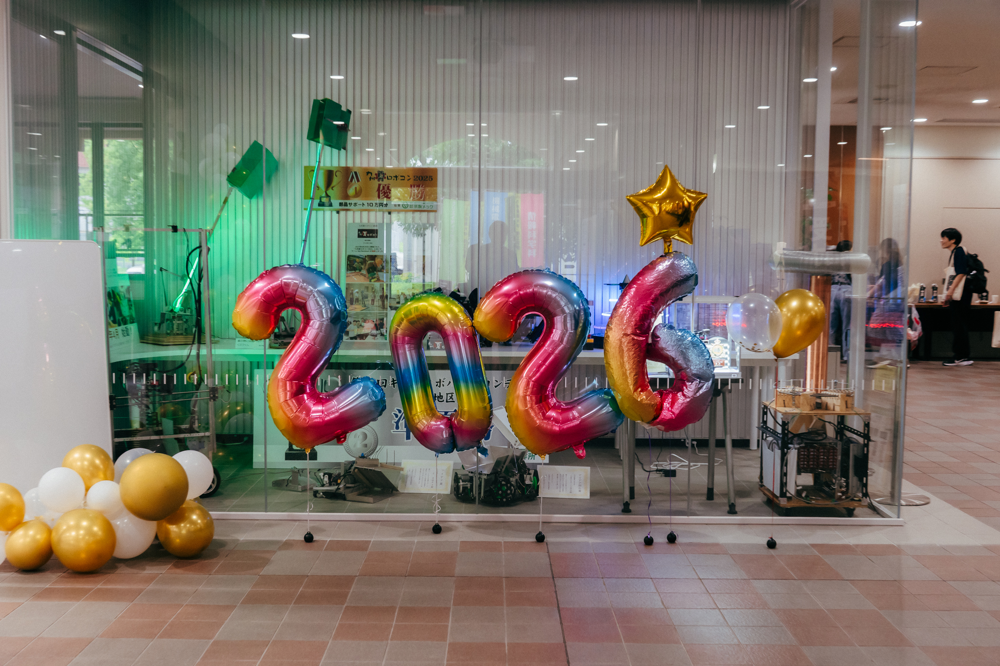

## きっかけ

強いていうなら、FEC Tokyo 2025 （2025/9/21）での雑談がきっかけだったんじゃないかなと思います。
去年あたりくらいからフロントエンドカンファレンスが地方で開催されるようになり、「福岡は？」みたいなことを Chot の小島さんがちょうどつぶやいていました。

https://x.com/yoshikikoji/status/1968593341148536955?s=46&t=ZKHFW4mhn8K-sTNo_SVqMQ

小島さんと某先輩と FEC Tokyo で雑談するうち「saku は FEC Fukuoka やんないの？」「やるならスポンサーするよ」と、一応きっかけらしいものが生まれたタイミングではありました。

fukuoka.ts などの小さい勉強会の開催を何度か（本当に何度か、3回とか？）帰省のタイミングに合わせてやってきたものの、個人的な活動スタイルとしてのカンファレンスは登壇が中心でした。

主催なんて最初から大変だとわかってるし、正直カンファレンスの生態系維持に特段責任感があったわけでもないし、運営とかは慣れてないし、カンファレンスにはプレイヤーとして関わる方が合ってると思っていました。

## 運営メンバー・体制

そんな中、「福岡でやるなら協力する」と名乗りを上げてくれた方々が現れました。気づいたら数日後には mtg をして、discord のサーバをローンチして、もう後戻りできない状態になっていました。

自分はカンファレンスの運営経験がほとんどなく、最初から自分一人で主催できるなんて思っていませんでした。したがって、コアメンバーは経験豊富な頼れるメンバーで固め、彼らには最初から最後まで本当に本当にお世話になりました。

前回の実行委員長だった [@puku0x](https://x.com/puku0x) さん、福岡で熱心にコミュニティ活動をされている [@hoshi110](https://x.com/hoshi110) さん、[@alt9800](https://github.com/alt9800) さん、YAPC::Fukuoka の実行委員長だった [@BkNkbot](https://x.com/BkNkbot)、FEC Hokkaido 実行委員長経験のある [@n13u](https://x.com/_n13u_) と [@0yu](https://x.com/yud0uhu) さん、TSKaigi などで運営経験豊富な [@magcho](https://x.com/magcho0527) さん。そのほかにもこちらからの声をかけさせていただき、快く引き受けてくださった非常に頼もしい方々で構成されました。コアメンバーも当日スタッフも公募することはなく、信頼できる少数精鋭で構成した形です。

蓋を開けてみたらそれぞれ自律的に動いてくれており、会計もノベルティもスポンサー対応も広報も、ここまでスムーズに運営できていたのは本当に他の運営メンバーのおかげでした。そもそも、最初に「協力させてほしい」と名乗りを上げてくれたメンバーがいなかったら、 FECF 2026 は形になっていませんでした。「実行委員長」なんて責任集約点のラベルなだけだったなー。運営メンバーには本当に感謝してもしきれません。

## コンセプト

福岡でやるからには、わざわざ福岡に来てもらうだけの魅力を出す必要がありました。運営としても、せっかくならワクワクしながらやっていきたい。

自分は、「ここでしか聞けない登壇」と「ここでしか築けないネットワーキング」にワクワクしながらカンファレンスに参加します。やるならば、最初からそういうクオリティにゲージを振り切るつもりでした。いうならば、業後に手弁当で開催するにはちょっと大変な「クオリティの高い”勉強会”」を目指す、という感じでしょうか。

仕組み上、カンファレンスには少し「お祭り感」が足されることが多いです。
でっかい会場を借りて、予算を組んでスポンサーを募り、豪華なノベルティや軽食が出されます。どこをとっても丸一日楽しめるようなスケジューリングと会場設計は、まさしく学祭を想起させるものです。背景には、お金を払って来てくれる参加者のニーズを満たすと同時に、「チケットが売れなければ会場費すら払えない」事態を防ぐ「コモディティとしての工夫」が事情があったりもするでしょう。

しかし、自分はこういう「The カンファレンス」の設計は得意じゃないだろうなーという感覚がありました。参加者の期待を意識しすぎ（全員の期待に添えるなんて最初から思えなかった）、前回・次回開催を意識しすぎ、カンファレンスのステレオタイプに乗っかりすぎるほど、多分疲弊してワクワクできない気がしました。何より、主催と運営が楽しめないカンファレンスの空気感は、きっと登壇者にも参加者にも伝搬し、それが一番望ましくないことでした。

代わりに、その年にそのカンファレンスを主催する各メンバーのカラーを出していった方が、各々が熱量高く取り組め、新しい風が吹き、福岡に来てもらうに値するクオリティになる気がしました。「クオリティの高い勉強会」としてのカンファレンスなら、自分はワクワクできそうです。せっかくなら、これまで自身に影響を与えてくれた人との繋がりを活かし、普段話せないような人と話し、全員が知的好奇心を掻き立てられるような場にすることが、至上命題でした。

「未来のフロントエンドと徹底的に向き合う」

- Frontend Conference Fukuoka 2026 を開催します
  - https://note.com/sakupi01/n/n4e997b62c825

このコンセプトを最初に軸として打ち出せたことが、最大の成功だったと言っても過言ではありません。運営・登壇・会場・参加者の質、全ての意思決定のベースにこのコンセプトがありました。だからこそ、受け身ではなく自発的に参加する人が多く、「人のクオリティ」も上がっていたと思うし、「おもてなし要素」への期待はいい意味でそもそも低く保てたのではないかと思います。

## 会場

ハードなコンセプトなうえに福岡で開催しようとなると、スポンサーや参加者の集客が思うようにいかず、資金難になる懸念がありました。

カンファレンスの大きな支出といえば会場費です。ここを前回からのつながりで、九州産業大学にお願いできたことは非常にありがたいことでした。

大学の設備とカンファレンスは非常に相性が良いです。講義用の録画システムや音響設備があったり、自販機やトイレのキャパも十分でした。

そして、ネットワークに関しては九産大と福女大の学生が丸っと NOC を担当してくれました。担当の先生の研究室が偶然ネットワーク関係だったのが幸運でした。当日の WiFi 環境は大変良好で、こちらから観測している限りは大きなトラブルはなく、参加者からの評判も良かったように思います。

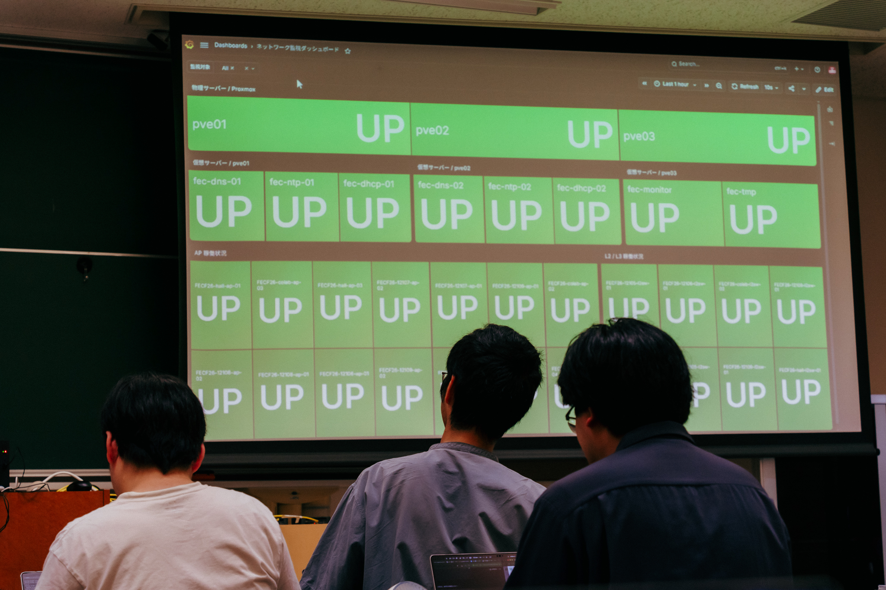

## スケジューリング

カンファレンスの当日までに、参加者、スポンサー、登壇者、それぞれがかなりのチェックポイントを経ることになります。スケジューリングをミスられると CFP を出しにくかったり、チケットを買いにくかったりはこれまでの経験からあったので、事前に防げる事故は潰しておきたいところでした。

まず、大学の夏休みの時期に会場が空いている週末で、かつ福岡で大きなイベントがないタイミングを見計らって開催日を決めました。大きな祭りや前日デブサミ周りは不安でしたが、それ以外の日程の方がもっと現実的じゃなかったので、消去法で日程は決まりでした。

地方のイベントなので、飛行機や新幹線で来て宿を取る人のことも考えると、チケット販売は遅くても２ヶ月前にはしておきたいです。

チケットが販売されるならば、そのタイミングでタイムテーブルがなければ、流石に買うのは難しいでしょう。

となると、公募プロポーザルの選考をそれまでに終わらせる必要があります。ならば、その１ヶ月前には CFP を開始し、公募枠確定のために、ゲストの登壇可否を確定させなければなりません。

また、チケットの金額と販売数を決めるには、スポンサーを確定させ、集まる金額の目処を立てておきたいです。

そんなふうに逆算していった結果を、カンファレンス開催宣言時から公開しました。参加者・登壇者的には、ざっくりでもいいのでその時点で決まっている情報はできるだけ出してもらえた方が嬉しかったりします（自分はそう）。とはいえ、スケ変があった場合更新する手間は運営側にかかるので、Google Calendar と連携して gCal を SSoT にアプデされる仕組みにしました。

福岡の夏場は台風がままなりません。直前までずっと不安でしたが、台風も来ず、雨も降らず、でっかい祭りの影響も思ったよりなく、総合的にはラッキーだったと思います。
スケジューリングに関してはポジティブな FB をもらったので、機会があれば今後も徹底していきたいです。

## スピーカー・場づくり

コンセプトを死守するために、今回最もこだわったのはスピーカーでした。
タイムテーブルは、「終わった後、録画を全部見たいと思えるタイテ」を作ることを目指しました。

今回は、「自分たちが聞きたいトークをしてくれる人」を中心に、18枠中14枠をゲストスピーカーとして依頼しました。ありがたいことに、各々がキーノートでも正直全然おかしくない顔ぶれでした。

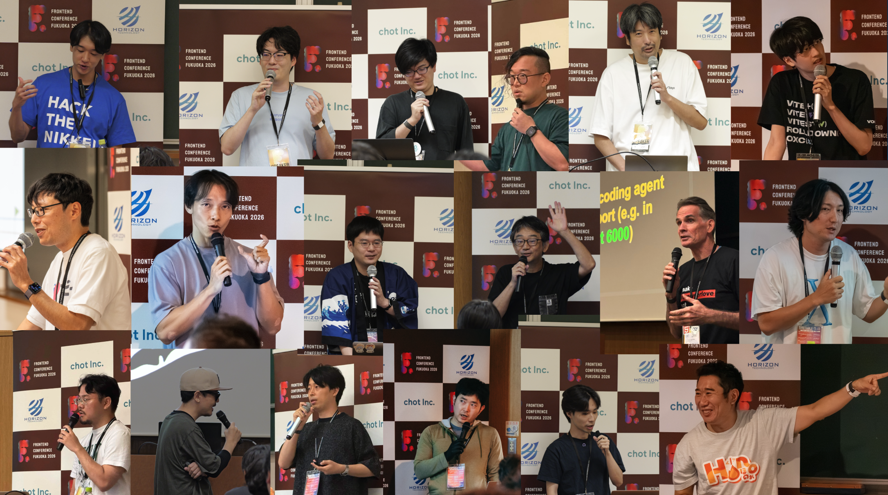

今回個人的に特に印象深いのは、 [@rniwa](https://rniwa.com/) さんの登壇でした。
niwa さんとは、去年 W3C の TPAC で初めてリアルでお話ししました。その時から、現場で何十年にもわたってブラウザを支え、ウェブ標準を議論してきた niwa さんだからこその話を、もっと生で聞きたいと思っていました。
しかし、niwa さんが公の場でトークする機会は非常に限られており、ましてや日本語での登壇が実現するならばこれが初めてというハードルの高さでした。話せる内容もセンシティブなため、会社で何重ものチェックが入り、ただでさえ多忙な時間を割いて SF から来日していただくことにもなります。

しかし、そういった表に出にくいところにこそ、コミュニティと共有され、コミュニティから FB を受け取ることに価値があると思います。話は少し広がりますが、W3C にスポンサーをお願いしたのも、ウェブに対してコミュニティと意見交換できる稀有な場になるかもしれないと思ったからです。目先のカンファレンスは、まずその前例となり、この先の何かに繋げられる機会になり得ました。そう思って、niwa さんには重ねて登壇をお願いしました。

当日は、登壇者・参加者双方が同じ場に入り混じって、多くの議論や質疑が勃発していたように思います。会場にはテーブルと軽食をばら撒き、ネットワーキングしやすい雰囲気になるように心がけていました。

ちなみに、今回の会場設計のアイディアは CSSDay や TPAC から着想を得ているところが大きいです。国際的なカンファレンスでは、あちこちで参加者同士のコミュニケーション（Hallway Conversation）が発生しやすい印象があり、そうした偶発的な会話からこそ得られるものが大きかったりします。Hallway Conversation の起こりやすさは、もちろん参加者の特性によるところもあると思いますが、意外と会場設計の仕方に左右される、運営が仕組んでいるところもあるなと思っていました。今回はまさにそんなスタイルを目指したかったです。

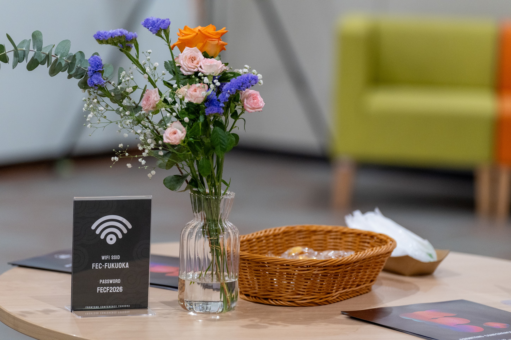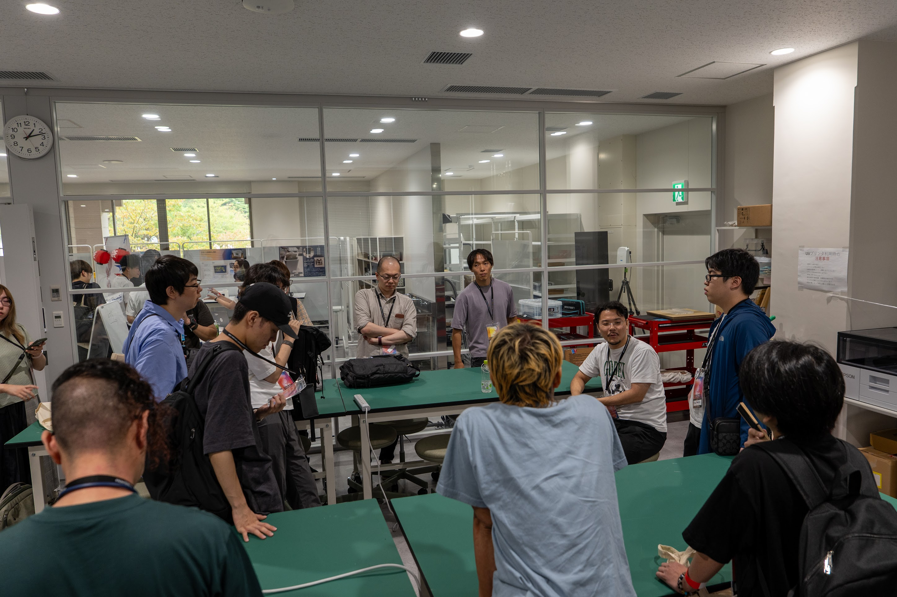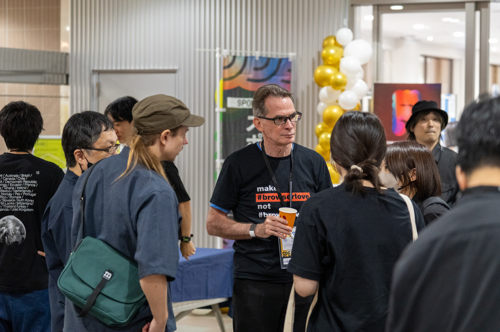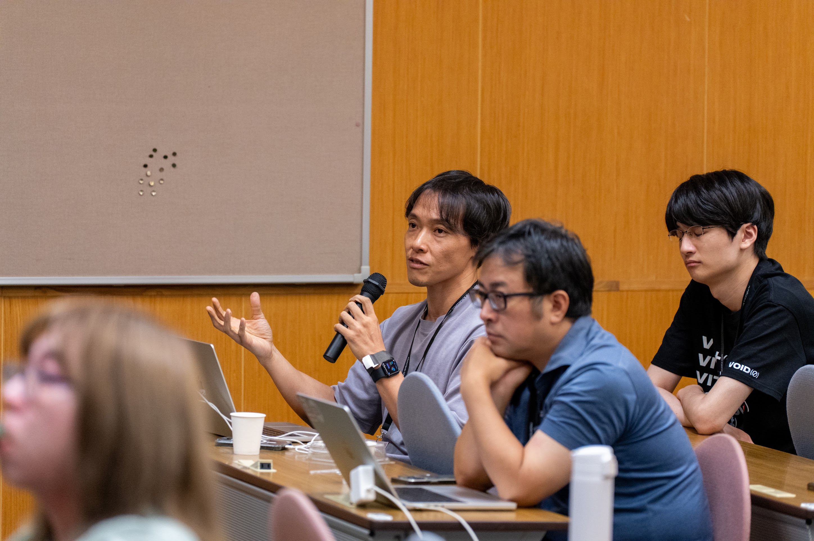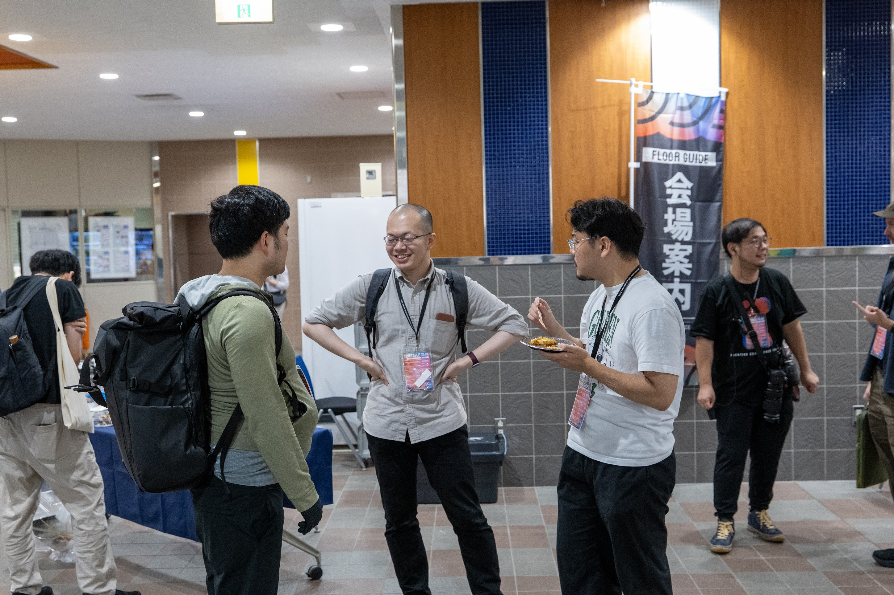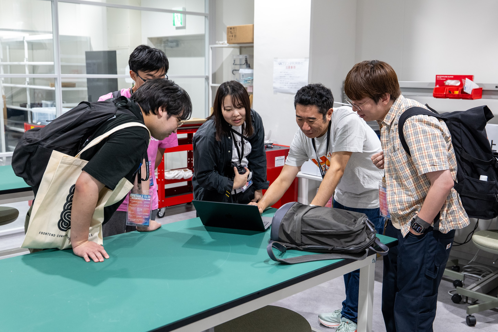

## CFP

公募枠は GitHub の Issue を立ててもらう形で募集しました。

- Issues · fec-fukuoka/frontend-conf.fukuoka.jp
  - https://github.com/fec-fukuoka/frontend-conf.fukuoka.jp/issues?q=is%3Aissue+label%3A2026-proposal%3Ageneral

カンファレンス全体を通して、GitHub をフル活用したのですが、一度仕組みを作れば運営としては非常に楽で、かなり良い方法だったように思います。 GitHub 運用には主に以下の点で効果を感じました。

- AI フレンドリー
- 応募者が好きなタイミングで内容を編集可能
- パブリック OK な会話はコメントでできる。コミュニケーションの場が集約される（採択理由の通知など）
- 履歴、差分、Closed Issue、etc が毎年１ヶ所に残っていく
- 「GitHub アカウント持っている」というステータスが、ある程度フィルターとして機能してたかも、、？
- GitHub 使ってる人なら操作に困ることはなさそう（問い合わせはなかった）
- CI 構築したり運用を固める必要だけあるが、一度作れば楽だし、ガワはカンファレンスの要件によって好きにカスタマイズ可能
- 「このリポジトリを参考に、カンファレンス運用リポジトリを作って」と AI に投げたら他でもいい感じにやってくれそうで、再現性がある
- クローズドな内容（選考者の点数、運営の会話）などは、プライベートリポジトリでカバーし、相互に参照できる
- 無料

一般公募は、応募枠 4枠という狭き門の中、60以上ものプロポーザルが集まりました。ゲストの選択は公募プロポーザルのクオリティのベースアップとしても見込んでいましたが、予想通りハイクオリティなプロポーザルが多かったです。

採択方法や採択・不採択結果については極力開示するように努めました。全部自分が書いたのでお手紙を書く感じで割と大変な作業でしたが、選ばれる側としては気になるところなのでその辺はきちんと、という感じです。

- フロントエンドカンファレンス福岡 2026 公募プロポーザル採択結果・選考プロセスの開示
  - https://frontend-conf.fukuoka.jp/2026/news/2026-06-22-cfp_result_disclosure

## タイムテーブル

当日は午前 11:00 から 6連続 3平行 1h セッションを 10分休憩で行いました。
自分達が聴きたい話をしてくれる人に、時間を気にせず心ゆくまで語ってもらい、余った時間は議論に使ってもらう形式にしました。
「非常に濃かった」「硬い椅子に座りっぱなしで疲れた」「スポンサーブースを見にいけなかった」「もっと休憩を、、」などいろんなベクトルの感想をもらいましたが、主催としては今回はストロングスタイルを貫いたので、全部想定通りの感想です（本当にお疲れ様でした）。

昼休憩を用意する気は元からありませんでしたが、セッションルームで飲食 OK、軽食はお菓子と別に出る、休憩はセルフマネジメントで好きなだけ自由にとってくれ、という点はもう少し強めにアナウンスしても良かったかも、、と思います。

## 前日

いわゆる蟹工船と言われるもの（ノベルティを詰める作業）が全く終わらず、ただでさえ忙しい当日に並行して単純作業に時間を取られたのが最大の失敗です。

14~15:00 くらいに集まり、10人くらいで会場と 300人分の物品を準備したので、圧倒的に人手と時間不足でした。

## スピーカーディナー

当日運営で忙しくてトークも聞けない代わり、前日のスピーカーディナーは、普段できない話ができる貴重な時間になりました。

前々日に思いつきで「なんかよくある誕生日プレートみたいなの、できたらお願いします」と TEL したら、当日でっかい「Frontend Conference Fukuoka やっていき！」が書かれた盃が出て来てびっくりしました。そのうえ、ジンジャーエールを入れて ~~飲まされて~~ 飲んで、何かの洗礼を浴びた気がした。

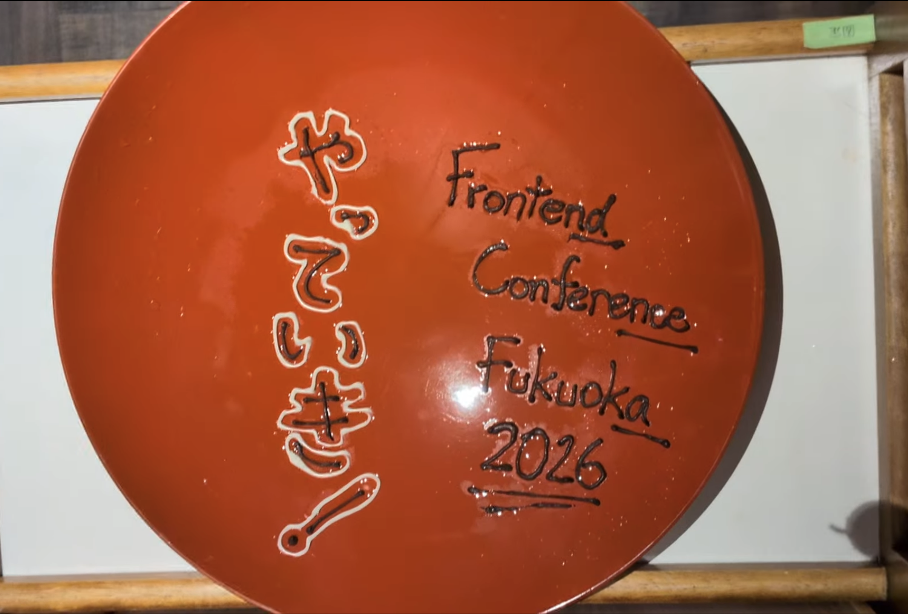

## 当日

先日運営で振り返りをしたところですが、当日は特段大きなトラブルなく完遂することができたと思います。自分がざっくりとした指示しかできてなかったせいで、持ち場で臨機応変にカバーしてくれたところも多く、改めてこの安定感を作ってくれたメンバーには頭が上がりません。

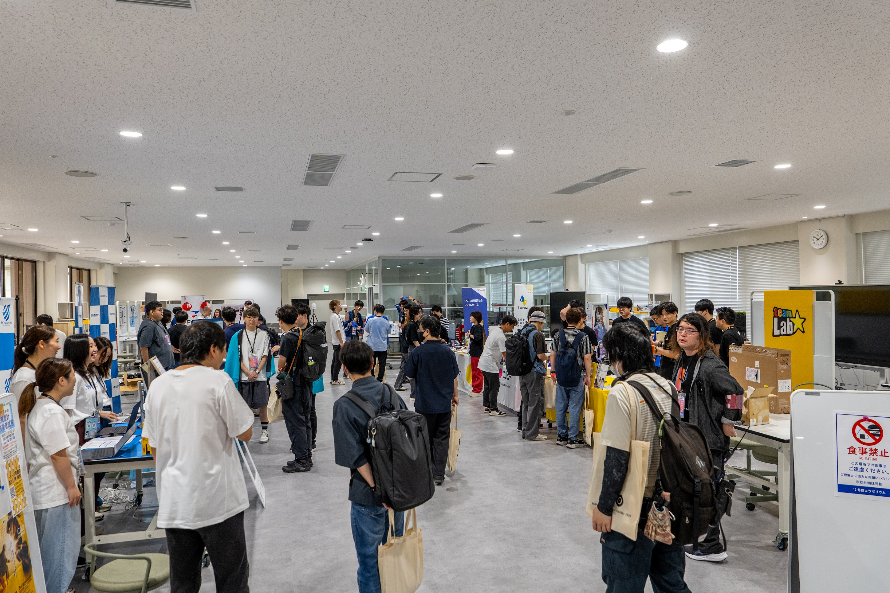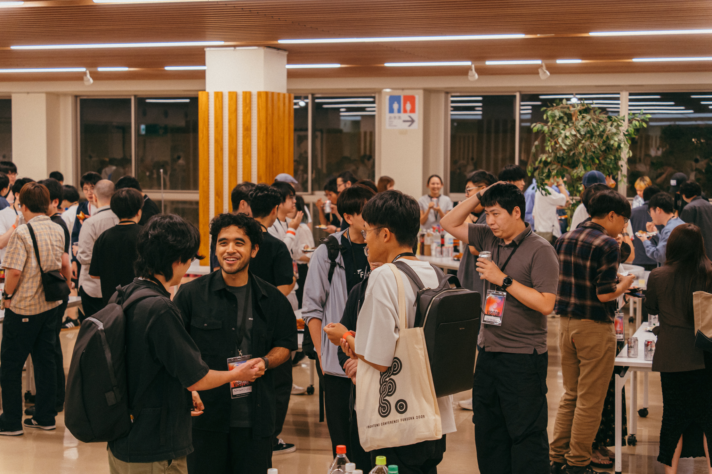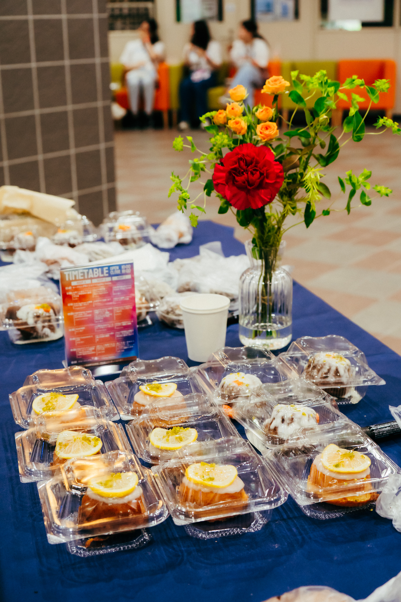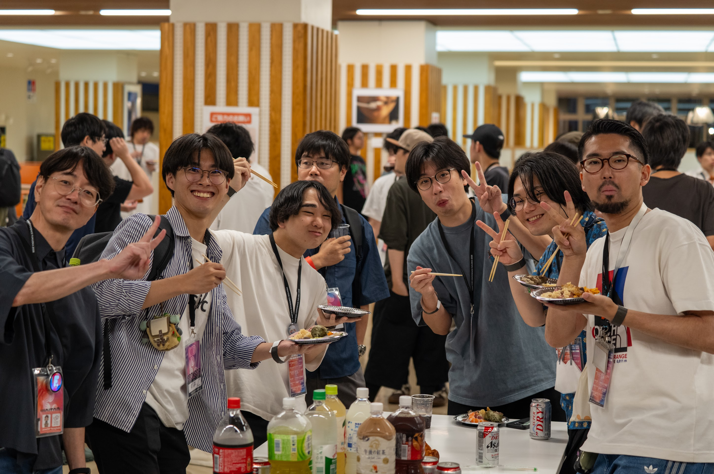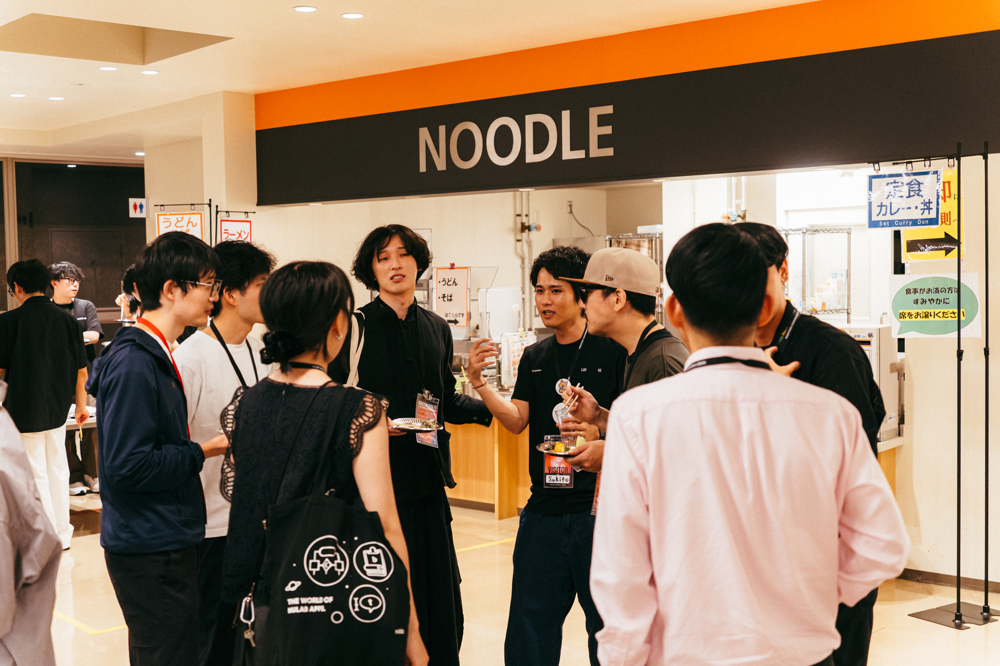

### トラブル

外から見て一番大きなトラブルは、個人的には Room C の録画が一部撮れていなかったことかと思います。
[ポッドキャスト](https://mozaic.fm/episodes/215/drive-talk-fecf.html)では「C が全部まるっと撮れてなかった」 と喋ったけど、実際に取れていなかったのは Room C の最初の50分だったようでした。

運営的にトラブったのは、軽食の手配周りかなという感じです。これまた私のわがままで「軽食はダコメッカのパンを用意する」ことにしたばっかりに、当日買い出しのためにメンバーが２時間ほど抜ける事態が発生しました。買い出しが予定より伸び、13:00 をすぎると、参加者からもちらほら「あれ、軽食ないの？」「お腹すいた、、」みたいな雰囲気になり始めました。次の 10分休憩で軽食が届かなければ、また 1h 待つ羽目になり、結構フラストレーションが溜まる可能性がありました。そのため、軽食が届くまで急遽10分間休憩を延長し、後のタイムテーブルが 10分ずれ込む形になりました。
タイテの変更は何かと混乱を招くので、飲食物は時間管理の効く方法で配送が望ましそうです。

また、当日の実況をする SNS 運営の係を設けていなかったことも改善点ではあります。

あとは、Discord だけだと余裕がなくて連携トラブっていたと思うので、トランシーバーがあって本当によかった。

## イベント後

イベント後にもやることはまあまあたくさんありますが、できるところから後始末を始めています。

### アーカイブのアップ

大学の先生が2日後にはデータをくれたので、その日のうちに公開しました。

- Room A: https://youtu.be/HqmZmqVROzM
- Room B: https://youtu.be/r4JCSTBeze4
- Room C: https://youtu.be/Itn_tBeE41E

セッションごとに切り分け、編集を凝って、スピーカーの資料を回収し終わってからアップするようにしていたら、平気で２ヶ月先とかになってしまいそうだったので、多少雑でも鉄は熱いうちに打っておく方を優先しました。

サムネの挿入と、最低限のセッション間のカット、そして description にタイムスタンプの添付くらいしかしていません。これなら一人で半日あれば終わるし、ほとんどはアップロードにかかる時間なので、究極的に内容が大事ならば個人的にはこれで需要は満たせています。

今回は大学の録画・録音設備が優秀すぎたこともあり、編集しなくても十分すぎるクオリティのデータがあったことも大きいです。

## 今後

「来年もやるんですか？」と度々聞いていただけますが、現時点では全く目処は立っていません。
毎年開催することを目的に再起動したわけではないので、無条件に来年もという話はできていません。

個人的には、話を聞きたい登壇者や技術のターニングポイントが揃ったタイミングで、自然と開催したくなるタイミングが来ると思います。また自分がやるなら、そういう時にやるくらいがあっている気がしてます。

ただ、「福岡でカンファレンスがしたい」「継続的にやっていきたい」という方がいれば、FECF という箱が使えない理由はありませんので、一報いただけるとありがたいです。

## 謝辞

最後になりますが、改めて今回の経験は個人的に大変貴重なものになりました。

この機会を一緒に作り上げてくださった、登壇者の皆様、スポンサーの皆様、そして参加者の皆様に、心から感謝申し上げます。

そして何より、長い人は約1年間、当日のために一緒に走り続けて来てくれた運営メンバーのみなさん。こんな会にしたい！こんな人の話聞きたい！お花用意したい！花瓶がいる！風船欲しい！ヘリウムガスがいる！パン！etc... たくさんわがままを詰め込めたのも、全部皆さんの寛容さのおかげです。本当に本当にありがとうございました。一生思い出に残るような素敵な時間でした。

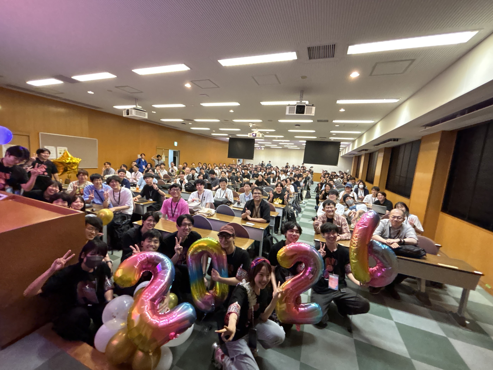
