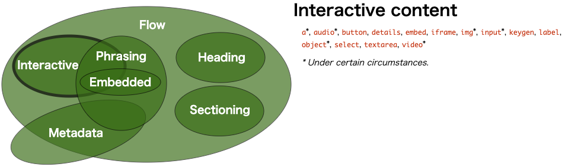
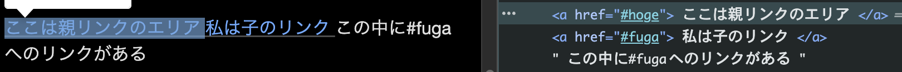
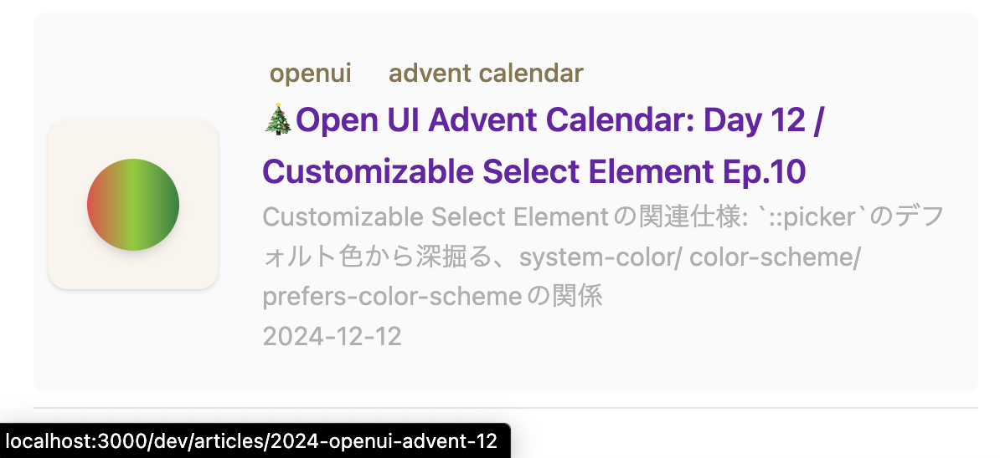
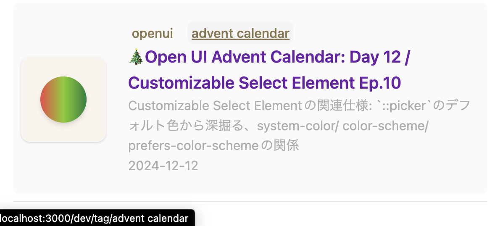
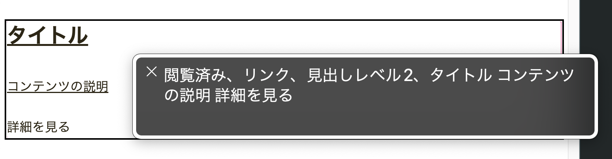

## Table of Contents

## はじめに

:::note{.message}
🎄 この記事は[アクセシビリティ Advent Calendar 2024](https://adventar.org/calendars/9957)の 16 日目の記事です。
:::

[Open UI Community Group](https://open-ui.org/)で、仕様の策定が検討されている Proposal の一つに、[Link Area Delegation](https://open-ui.org/components/link-area-delegation-explainer/)があります。

本エントリでは、Link Area Delegation の仕様がどのような背景から検討され、何が可能となり、これから私たちがどのように利用していけるのかを紹介します。

## Link Area Delegationとは

Link Area Delegation（= リンク領域の委譲）Proposal は、コンテナがインタラクティブな領域を特定の要素に委譲することで、コンテナを「クリッカブル」にする機能を標準的に導入しようとする試みです。

例えば、提案されている手法のひとつである、**`linkarea`属性**と **`defaultlink`属性**を使用すると、Link Area Delegation は次のように表現されます。

次の例では、`linkarea`属性のつく`<div>`を Click することで、`defaultlink`属性を持つ最初の子孫要素、つまりこの場合は、**最初の`<a>`が活性化**されます。

```html
<div class="card" linkarea>
  <a href="/post?id=123" defaultlink>Post Title</a>
  
  <button>Join</button>
  <button>Share</button>
</div>
```

## Link Area Delegation 提案の背景 - マークアップの制限

歴史的背景から、`<a>`や`<button>`のような[インタラクティブな要素](https://html.spec.whatwg.org/multipage/dom.html#interactive-content-2)をネストした UI を実装することは、開発者にとって難しい課題でした。

インタラクティブな要素同士を子孫関係におくことができない旨は仕様に明記されており、例えば`<a>`の Content Model であれば次のように定義されています。

> Transparent, but there must be no interactive content descendant, a element descendant, or descendant with the tabindex attribute specified.
>
> 透明、しかしインタラクティブなコンテンツの子孫、a要素の子孫、tabindex属性が指定された子孫が存在してはならない。
> <https://html.spec.whatwg.org/multipage/text-level-semantics.html#the-a-element>

`<a>`はインタラクティブな要素であるゆえ、`<a>`の中に`<a>`をネストすることはできません。`<button>`もインタラクティブな要素なので、`<a>`の中に`<button>`をネストすることもできませんし、その逆も然りです。


*インタラクティブな要素 - 出典: [HTML Standard - Kinds of content](https://html.spec.whatwg.org/multipage/dom.html#kinds-of-content)*

もし仮に、次のように`<a>`の中に`<a>`をネストした場合、それぞれは兄弟関係のリンクとしてパースされます。

```html
<a href="#hoge">
    ここは親リンクのエリア
    <a href="#fuga"> 私は子のリンク </a>
    この中に#fugaへのリンクがある
</a>
```


*兄弟関係のa tagになる*

このように、HTML パーサは期待通りのインタラクティブな要素の解釈をしてくれないため、私たちは Nested Links を実現するために、さまざまな Hack をしてきました。

### クリッカブルなコンテナを実現する既存の方法

ネストされたインタラクティブな要素の代表的なユースケースとして、Card コンポーネントが挙げられるでしょう。

例えば、本ブログの記事一覧ページでも、Card コンポーネントを使用しています。

| Card本体をホバー | Card内tagをホバー |
| ---- | ---- |
| *Card本体をホバーした時、記事へのURLに変わる* | *Card内のtagをホバーした時、tagのURLに変わる* |

この Card コンポーネントは、`<a>`タグのネスティングを使用せず、CSS の Subgrid を使用して、クリッカブルなエリアを拡張しています。

<baseline-status featureId="subgrid"></baseline-status>

実装を簡略化すると、次のようなマークアップとスタイリングをすることで、上記の Card コンポーネントの実現が可能です。

```html
<div class="card">
  <a class="link" href="https://blog.sakupi01.com/dev/articles/2024-openui-advent-12">
    <h2>🎄Open UI Advent Calendar: Day 12 / Customizable Select Element Ep.10</h2>
    <p>Customizable Select Elementの関連仕様: `::picker`のデフォルト色から深掘る、system-color/ color-scheme/ prefers-color-schemeの関係</p>
  </a>
  <p class="tags">
    <a href="https://blog.sakupi01.com/dev/tag/openui">openui</a>
    <a href="https://blog.sakupi01.com/dev/tag/advent%20calendar">advent calendar</a>
  </p>
</div>
```

```css
.card {
  display: grid;
}

.link {
  grid-row: 1 / 3;
  grid-column: 1;
  display: grid;
  grid-template-rows: subgrid;
}

.tags {
  grid-row: 3 / 3;
  grid-column: 1;
}
```

しかし、CSS の Subgrid が全てのブラウザで実装されたのは 2023/9/15 と比較的最近で、それ以前はさまざまなワークアラウンドが取られてました。

この Subgrid の例も含め、HTML のバリデーションを通過するようにしつつ、CSS や JavaScript を使ってリンクやボタンのクリッカブルな領域を拡張する方法はさまざまにあります。こうした Hacky な方法は、標準化された方法ではなく、UX やアクセシビリティの観点からさまざまな問題を引き起こす可能性があります。

### 既存方法とその問題

「クリッカブル」なコンテナを実現するための既存方法とそのトレードオフを、もう少し細かく見てみましょう👀

#### `<a>`でコンテンツをラップする

クリック可能にしたいコンテンツ全体を`<a>`でラップする方法です。

```html title="e.g. 1"
<a href="https://example.com">
  <div class="card">
    <h2>タイトル</h2>
    <p>コンテンツの説明</p>
    <button>詳細を見る</button>
  </div>
</a>
```

```html title="e.g. 2"
<table>
  <tr>
    <a href="https://example.com">
      <td>hoge</td>
      <td>fuga</td>
    </a>
  </tr>
</table>
```

##### トレードオフ

- ネストされたインタラクティブ要素は仕様に反する: 先にも述べたように、インタラクティブな要素をネストすることは、HTML の Content Model で禁止されています。
- 冗長なアクセシブルネームになる: e.g.1 のようなマークアップをすると、リンクのアクセシブルネームが冗長になり、`<h2>`と`<p>`と`<button>`のテキストをすべて読み上げる可能性があります。これにより、支援技術を使うユーザーにとって理解しづらくなることがあります。


*リンクに対して必要以上の情報を読み上げてしまう*

- 特定の要素でサポートされない: e.g. 2 に示すような、`<a>`でテーブルの行`<tr>`をラップするマークアップは、[HTMLの仕様](https://html.spec.whatwg.org/multipage/tables.html#the-tr-element)で許可されていません。HTML パーサはこのような構造を検出した場合に、リンクを削除してしまいます。

#### 2. CSSでインタラクティブな要素の配置を調整する

重複したリンクやコンテナのアクションを `::before` や `::after` に配置し、コンテナサイズまで広げる方法です。

```html
<div class="card">
  <a class="link" href="#title">
    <h1>タイトル</h1>
  </a>
  <p>コンテンツ</p>
  <p class="tags">
    <a href="#hoge">#hoge</a>
    <a href="#fuga">#fuga</a>
  </p>
</div>
```

```css
.card {
  /* elevate the links up */
  position: relative;
  a {
    position: relative;
    z-index: 1;
  }
  .link {
    position: static;
    /* expand the pseudo-element to cover the post area */
    &::before {
      content: "";
      position: absolute;
      inset: 0;
    }
  }
  .tags a {
    position: relative;
  }
}
```

##### トレードオフ

- 標準化されていない: 実装方法が標準化されておらず、重複したリンクがキーボードやスクリーンリーダーユーザーに冗長さを生むことがあります。
- テキストの選択が難しい: CSS により、リンクで静的テキストがラップされているので、カード内部のテキストを選択できません。

#### 3. JavaScriptでクリックをキャプチャする

JavaScript を使って、コンテナ要素がクリックをキャプチャし、メインリンクに委譲する方法です。

```html
<div class="card" onclick="handleClick(event)">
  <h2>タイトル</h2>
  <p>コンテンツの説明</p>
  <a>詳細を見る</a>
</div>

<script>
  function handleClick(event) {
    if (!event.target.closest('a')) {
      window.location.href = 'https://example.com';
    }
  }
</script>
```

##### トレードオフ

- JavaScript の使用: JS の使用を避けたい開発者にとっては、大きなトレードオフとなります。
- UX の問題: mouosedonwn での活性化や、ネストされたリンクの考慮漏れにより、支援技術での操作保証が難しいです。
- ブラウザデフォルトの動作との競合: [Context Menu](https://en.wikipedia.org/wiki/Context_menu)などと競合する可能性があります。

***

Link Area Delegation は、こうしたワークアラウンドによる問題を解決するために、インタラクティブな要素のネスティングに関する新しいガイドラインや標準を設けることを目指しています。

## 現状検討されている4つの実装方法

上記を満たす Link Area Delegation の提案として、現時点では次の 4 つの実装方法が検討されています。

### 1. Link delegation attributes

HTML で表現する方法の一つとして、`linkarea`属性と`defaultlink`属性を使用する方法が提案されています。

冒頭の例と重複しますが、次のように`linkarea`属性を持つ`<div>`をクリックすることで、`defaultlink`属性を持つ最初の子孫要素が活性化されます。つまり、`linkarea`属性は、クリッカブルな領域を拡張するためのコンテナを示し、`defaultlink`属性は、そのコンテナのクリックイベント委譲先となります。

```html
<div class="card" linkarea>
  <a href="/post?id=123" defaultlink>Post Title</a>
  
  <button>Join</button>
  <button>Share</button>
</div>
```

`defaultlink`属性を持つ最初の子孫要素だけではなく、ID によって`linkarea`属性を持つコンテナと紐づけられた、特定の子孫要素を活性化することも可能です。

次の例では、最初の`<a>`がページ内パーマリンクとして機能し、コンテナクリックで発火されるアクションは「Learn More」のリンクになります。

```html
<section class="card" linkarea="card123-cta">
  <h2><a href="#topic-123" id="card123-title">Post Title</a></h2>
  
  <p>...</p>
  <a href="/post?id=123" id="card123-cta" aria-labelledby="card123-cta card123-title">Learn More</a>
  <button>Join</button>
  <button>Share</button>
</section>
```

この提案が採用された場合、ARIA in HTML 仕様に新しいルールを追加し、この属性が使用される要素に許可される役割を制限する必要があるかもしれません。例えば、`<div role=button linkarea>`のような場合、現在では div に任意の ARIA ロールを設定できますが、このインスタンスでは何らかの検証メッセージを生成するべきだと述べられています。

### 2. `<linkarea>` Element

`linkarea`属性の代わりに、`<linkarea>`を導入する方法も提案されています。

```html
<section class="card">
  <linkarea>
    <a href="/post?id=123" defaultlink>Post Title</a>
    
    <button>Join</button>
    <button>Share</button>
  </linkarea>
</section>
```

しかし、HTML 要素の柔軟性を考えると、この方法は望ましくありません。

例えば、次のようなマークアップを実現するには、`<tr>`が新しい要素タイプを含むよう、HTML パーサを変更する必要があり、ブラウザ側からすると、基本的には避けたい実装です。また、全てのブラウザで`<linkarea>`実装による HTML パーサ変更の実装が完了しない限り、[`<tr>`のContent Model](https://html.spec.whatwg.org/multipage/tables.html#the-tr-element)に反して挙動が壊れる可能性があり、段階的なサポートが難しいです。

```html
<table>
  <tr>
    <linkarea>
      <th><a href="/details?id=1" defaultlink>Title</a></th>
      <td>...</td>
      <td>...</td>
      <td><button>Edit</button></td>
    </linkarea>
  <tr>
</table>
```

一方、属性を用いた手法では、UA はポリフィルを通じて段階的に新しい動作をサポートするよう実装でき、パースの問題を軽減できます。

### 3. Use CSS `pointer-area` Property

HTML ではなく CSS を使用する方法も考えられています。HTML 属性の代わりに、新しい CSS プロパティを提供することで、クリッカブルな領域を拡張する方法です。

```html
<section class="card">
  <a href="/post?id=123">Post Title</a>
  
  <button>Join</button>
  <button>Share</button>
</section>
```

```css
.card { pointer-area: contain; }
.card a:nth-child(1) { pointer-area: expand; }
```

この方法では、事前に与えられた HTML の構造に CSS を適用することでクリッカブルな領域が決定されます。つまり、動的に HTML 構造が変更された場合は対応が複雑になる可能性があります。

### 4. Use Invokers

現在、Open UI で別 Proposal として検討が進んでいる、[Invoker Commands](https://open-ui.org/components/invokers.explainer/)を使用する方法も提案されています。

[`command`](https://developer.mozilla.org/en-US/docs/Web/API/HTMLButtonElement/command)では、`click`・`contextmenu`・`touch`・`keypress`などの[CommandEvent](https://developer.mozilla.org/en-US/docs/Web/API/CommandEvent)を Dispatch し、[`commandfor`](https://developer.mozilla.org/en-US/docs/Web/HTML/Element/button#commandfor)では、CommandEvent を受け取る ID を持つ要素との関連付けをします。

- [Invoker Commands API - Web APIs | MDN](https://developer.mozilla.org/en-US/docs/Web/API/Invoker_Commands_API)

```html
<section class="card" commandfor="card123-title" command="click">
  <a href="/post?id=123" id="card123-title">Post Title</a>
  
  <button>Join</button>
  <button>Share</button>
</section>
```

この手法を使用するには、属性を２つ宣言する必要があり、かつ ID を頻繁に宣言する必要も出てくる可能性があります。
とはいえ、この手法を用いると、クリックを「リンク」以外の要素、例えば、`<button>`に委譲することも可能なため、前向きに検討されているようです。

## おわりに

今回は、Link Area Delegation の全体像について、広く浅く紹介しました。

筆者自身が、以前カードコンポーネントを実装する際、Nested Links を実現したく、その時に読んだ[Sara Soueidan](https://x.com/sarasoueidan)の記事がとても勉強になりました。

<https://www.sarasoueidan.com/blog/nested-links/>

その後、Link Area Delegation が Open UI で提案され、自分した Hacky な実装を標準的な方法で解決する仕様策定が検討されていることを知って興味をもっていたのが、本エントリ執筆の背景です。

[Open UI Advent Calendar](https://adventar.org/calendars/10293)では、[Customizable Select Element](https://open-ui.org/components/customizableselect/#keyboard-behavior) を中心に、さらに詳しく Open UI に関する記事を書いているので、そちらも読んでいただけると嬉しいです🤸🏻‍♀️

Thank you for reading!⛄

### Appendix

- [Nested Links](https://kizu.dev/nested-links/)
- [Nested Links Without Nesting Links](https://www.sarasoueidan.com/blog/nested-links/)
- [WAI: Large Links, Buttons, and Controls](https://www.w3.org/WAI/perspective-videos/controls/)
- [WCAG 2.2: Target Size (Minimum) Level AA requirement](https://www.w3.org/WAI/WCAG22/Understanding/target-size-minimum.html)
