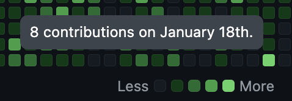
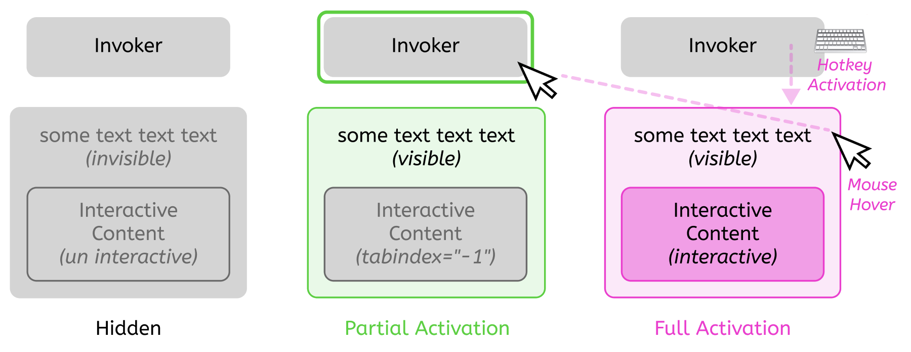
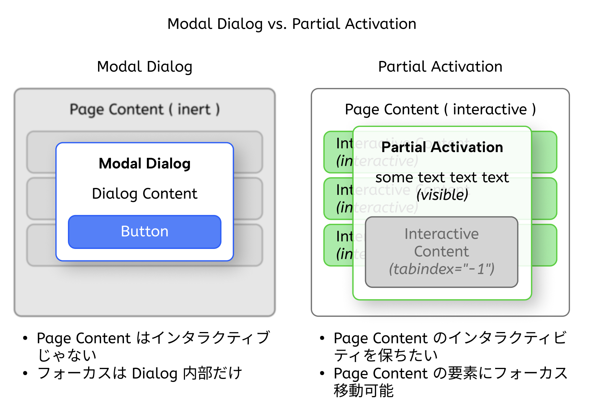

## Table of Contents

## はじめに

:::note{.message}
この記事で紹介する仕様は現在策定段階であり、これから変更される可能性があることに注意してください
:::

[Open UI Community Group](https://open-ui.org/)で仕様の策定が検討されているProposalの一つに、[Interest Invokers](https://open-ui.org/components/interest-invokers.explainer/)があります。

本エントリでは、Interest Invokers がどのような仕様で、何が可能となるのかという概要は素より、Interest Invokers の仕様に決着をつける上で欠かせない、 HIDs (Human Interface Devices)、特に Keyboard 操作を取り巻く「Show Interest」の議論と現時点での仕様を解説します。

## Interest Invokers

[Interest Invokers Proposal](https://open-ui.org/components/interest-invokers.explainer/) は、ユーザーが要素に「興味を示す（interested な）」行為を標準化するAPIです。<br />
身近な例としては、Tooltip や 排他的な Popover などが挙げられます。


*GitHub の草に hover した際に出現する Tooltip*

*"Interest"* を示した際にアクションが呼び出され、トリガーされる要素を Interest Target とし、これは id 属性を持つものとします。
これに対して、Invoker 要素（トリガーする要素）から `interesttarget` 属性（IDREF）を用いて Interest Target を参照すると、Interest Target に対してアクションが *"Invoke"* されます。

```html
<a interesttarget="my-hovercard" href="...">Hover to show the hovercard</a>

<span popover=hint id="my-hovercard">This is the hovercard</span>
```

似たような機能を持つ API として、Chrome 135 Stable （今日（2025/03/26）リリース！）では、`command`/`commandfor` （Invoker Commands）のサポートが開始されています。

- [Invoker Commands; the command and commandfor attributes - Chrome Platform Status](https://chromestatus.com/feature/5142517058371584>)

<baseline-status featureId="invoker-commands"></baseline-status>

Invoker Commands は `click` イベントなどで *"Activate"* されることで発火するのに対し、Interest Invokers はあくまでも *"Show Interest"* した段階で Interest Target に対してアクションを発火するのが特徴です。

## What the f&*% is "Show Interest" ?

Invoker Commands の [CommandEvent](https://html.spec.whatwg.org/multipage/interaction.html#the-commandevent-interface) は、DOM でいうところの [activation behavior](https://dom.spec.whatwg.org/#eventtarget-activation-behavior) で発火されます。

しかし、[Interest Invokers の Explainer](https://open-ui.org/components/interest-invokers.explainer/) では、Interest Target は *"Show Interest"* や *"Lighter Touch Way"* で発火されるといった表現が用いられており、明確な発火のアルゴリズムが記載されていません。<br />
これは、Interest Invokers の示す *"Show Interest"* が、ユーザの利用する入力デバイスによって異なることに起因します。

例えば、キーボードやモバイルデバイスでの操作には「hover」という概念がありません。<br />
キーボードやモバイルデバイスは数ある入力デバイスのうちのひとつに過ぎず、マウス、キーボードはもちろんのこと、タッチスクリーンや音声コントロール、アイトラッキング、ペンタッチなど、世の中には私たちが想像し得ないほどの様々な入力デバイスが存在します。<br />
それゆえ、 *"Show Interest"* する具体的な操作は、それぞれの入力デバイスに応じて多岐に渡ります。

そこに、その多様な操作を抽象的に示す *"Show Interest"* という概念を意図的に導入することで、これまでは **多様な入力デバイスに対して同等な *"Show Interest"* の挙動（e.g. hover）を実装することは極めて困難** でしたが、**多様な入力デバイスに応じた適切な *"Show/Lose Interest"* の仕組みを、ブラウザが肩代わりして標準化する** ことを見据えています。

> However, as mentioned above, “showing” and “losing” interest are intentional abstractions that do not refer to specific actions such as “hover” or “long press”. This is on purpose: the developer should not have to worry about handling all of the various input modalities specifically, in the same way that a `<button>` element can be activated in various ways such as tapping, clicking, or hitting Enter on the keyboard. The user agent provides this functionality “for free”: developers don’t need think about HIDs.
>
> [Interest Invokers (Explainer) | Open UI](https://open-ui.org/components/interest-invokers.explainer/#hids-and-interest)

## Keyboard Matter

こうした目論見が Interest Invokers にはあることから、多くのユーザが利用している Keyboard での *"Show Interest"* をどのように定義するかという議論は、Interest Invokers の仕様策定において重要になってきます。

- [[Interest invokers] Keyboard inputs · Issue #1133 · openui/open-ui](https://github.com/openui/open-ui/issues/1133)

当初は単純な「フォーカス時に *"Show Interest"* する」という案が検討されていましたが、ユーザーがページ内をタブで移動するだけで、次々と要素が表示され、ノイズになる可能性が否めません。<br />
特に、Interest Target が Popover の場合は、Popover 内部に別の `interesttarget` となる要素がネストされている可能性がある場合を考慮すると、Popover の Auto Focus Managementにより、ユーザの意図に反して連続的に内部の Interest がトリガーされ、非常にノイジーになる可能性があります。<br />
このように、UA による、 **ユーザにとって「不本意なフォーカス遷移」** が行われることは避けたいです。

## Time-Delayed Display - `interest-target-show-delay` & `interest-target-hide-delay`

こうした問題への最初のアプローチとして、上記の Issue では「遅延フォーカス」が提案されます。<br />
これは、要素にフォーカスした後、一定時間（`interest-target-show-delay` 秒）が経過してから Interest Target を表示するというものです。<br />
同様に、`interest-target-hide-delay` は、フォーカスが外れてから Interest Target が非表示になるまでの遅延時間を制御します。

:::note{.memo}

`interest-target-show-delay` & `interest-target-hide-delay`のショートハンドとして、`interest-target-delay` が提案されています。

:::

これらの遅延時間は、 **ユーザが「意図的に Interest を示したのか」それとも「意図せず Interest を示した状態になってしまったのか」を判断するための重要な定数値** です。

例えば、遅延なしのマウス hover で Interest Target が表示されると、ユーザーが画面上で単にマウスを移動させているだけで Interest Target が表示されることになり、非常に煩わしい可能性があります。（もちろんそういうユースケースもあるとは思いますが）<br />
また、例えば、hover 解除ですぐに Interest Target が消えると、ユーザーがリンクからカードに移動しようとした際に、その間の gap で hover カードが消えてしまうといったケースも考えられます。

このように、ユースケースもエッジケースも千差万別で、一概に UA で決定できるものではありません。<br />
そのため、`interest-target-show-delay` と `interest-target-hide-delay` は、Author スタイルシートから明示的な数値で上書きが可能です。

- [Add "show interest" and "lose interest" hover delays to CSS · Issue #9236 · w3c/csswg-drafts](https://github.com/w3c/csswg-drafts/issues/9236)

しかし、この遅延アプローチだけでは、UA による「不本意なフォーカス遷移」の問題は解決されません。

## Partial Activation

フォーカス遷移問題への打開策として、Facebook の事例を参考に、 **"Partial Activation"** という概念が提案されます。

この概念により、Interest Target の「表示」と「操作性」を分離することが可能になります。<br />
Partial Activation と `interest-target-show-delay` & `interest-target-hide-delay` を組み合わせてできた Interest Target の状態遷移は以下のようになります。

```md
1. 非表示 → フォーカス（`interest-target-show-delay` 秒後）→ Partial Activation（表示されるが操作不可）
2. Partial Activation → Hotkey 押下 → Full Activation（表示され操作可能）
3. いずれの状態からでも → フォーカス喪失（`interest-target-hide-delay` 秒後）またはESC → Interest Target 非表示
```

Partial Activationは、「Interest Target は表示されるが、**内部要素は操作不能な状態**」になります。これにより、タブ順序が UA の管理から外れるため、「フォーカス de Show Interest」で問題だった、**UA の Auto Focus Management による「不本意なフォーカス遷移」を回避**できます。

対して、Full Activation では 内部要素は操作不能な状態から離脱して、完全に操作可能になり、**内部の要素にタブ遷移でフォーカスできる**ようになります。

この Partial Activation から Full Activation へ状態遷移は、Hotkey の押下や、[### Device Unification](#device-unification) で示す方法で可能です。


*Partial Activation から Full Activation への状態遷移のイメージ*

### Device Unification

Full Activation への遷移は、Hotkey でのみならず、入力デバイスに応じた状態遷移方法が定義されています。
現状ではそれぞれ以下のような仕様です。

- マウス：
  - Partial Activation 発動：トリガー上へのマウス hover （`interest-target-show-delay` 秒後）
  - Partial Activation 解除 & Full Activation 遷移：Interest Target 上への hover
  - Interest Target 非表示：トリガーとターゲットの両方からの hover 解除（`interest-target-hide-delay` 秒後）
- キーボード：
  - Partial Activation 発動：フォーカス（`interest-target-show-delay` 秒後）
  - Partial Activation 解除 & Full Activation 遷移：Hotkey の押下
  - Interest Target 非表示：フォーカス喪失（`interest-target-hide-delay` 秒後）またはESC
- タッチデバイス：
  - Partial Activation 発動：ロングプレス
  - Partial Activation 解除 & Full Activation 遷移：タップ
  - Interest Target 非表示：Light-Dismiss

### Implementation - `inert` or `tabindex="-1"` ?

Partial Activation 状態の初版では、「内部要素は操作不能な状態」は `inert` を用いて実装されることになっていました。

しかし、単純に `inert` を使うと、`Pointer Events` も無効化されてしまい、マウスで Full Activation への遷移ができなくなります。

そのため、 **Interest Target 内のネストされたすべての子要素について `tabindex="-1"`** （フォーカス不可だが`Pointer Events`は有効）**を適用するような CSS の新しい機能が必要**なのではないか、という議論がされています。

「ネストされたすべての子要素について `tabindex="-1"`」を表現する CSS として、現状では `interactivity: not-keyboard-focusable` としてExplainer に表記され、提案されています。

### Styling and Accessibility Concerns

さらに、`interactivity: not-keyboard-focusable` を指定するために Partial Activated な要素を CSS で示す必要があり、そのためにの新しい疑似クラスが必要です。

加えて、 Hotkey を定義するとなると、流石に何らかの手段で、「どんなキーが割り当てられているのか」をユーザに示さねばなりません。

これらのスタイル・アクセシビリティ的な要件を満たすための現時点での提案は以下のようになっています。

- `:target-has-partial-interest`: Partial Activation 状態の Invoker Target を示す
- `:target-has-partial-interest { interactivity: not-keyboard-focusable }`: Partial Activation 状態の Invoker Target 内の**ネストされたすべての子要素について `tabindex="-1"` であることを表現するスタイル**
- `:target-has-partial-interest::after { content: "Press Alt-UpArrow to activate this content" }`: **Hotkey のヒントを表示するためのスタイル**

`:target-has-partial-interest` の他にも、遅延時間や Partial / Full Activation 状態を示すための疑似クラスは存在します。

- `:has-interest`: Full Activation 状態の Invoker を示す
- `:has-partial-interest`: Partial Activation 状態の Invoker を示す
- `:target-has-interest`: Full Activation 状態の Interest Target を示す

## Partial Activation in Modal Dialogs ?

Partial Activation とそれを取り巻く革新的な仕様の提案により、何とか「デバイスに対応したShow Interest」を実現できそうに思えます。<br />
しかし、Dialog 以外のページ全体（`::backdrop`）に `inert` が適用され、すべてのインタラクティブな要素が無効化される「 Modal な Dialog 」についてはどうでしょうか？

Partial Activation が導入された背景に遡ると、Partial Activation と Modal Dialog の機能矛盾が見えてきます。<br />
`element.showModal()` でトリガーされる Modal Dialog は、Dialog 以外のページ全体を `inert` にして、ユーザーが Dialog 以外の要素を操作できないようにするものです。<br />
しかし、Partial Activation の目的は、「ページ全体を `inert` にしないまま、ユーザーがページ内の他の要素を操作できるようにする余地を残すこと」です。
Partial Activatable な Modal Dialog 、つまり「ページ内の他の要素を操作できるようにする余地を残した Modal Dialog」は、Modal の定義そのものと相反することになります。


*Modal Dialog と Partial Activation の機能的な矛盾*

このため、現時点の仕様では、`<dialog popover />` を含む Popover は Light-Dismiss 可能なため、Partial Activation の対象としながらも、Modal Dialog は対象外とされています。

## おわりに

本エントリでは Interest Invokers の概念と、特に Keyboard 操作を取り巻く「Show Interest」の議論と仕様の現状を解説しました。

遅延フォーカスやPartial Activation という新しい概念、それらを実現可能にするさまざまな仕様によって、多様な入力デバイス間で一貫した「Show Interest」体験を提供する技術の標準化が進められています。

従来は  hover やフォーカスは然り、数ある PointerEvents や MouseEvents, TouchEvents の中から "適切かもしれない" イベントを自前でハンドリングして、Tooltip のような UI であれば、JS を使って一定時間経過後に要素を Invoke する、こうした手法が取られてきました。<br />
Popover API や `command`/`commandfor` の登場により、こうした UI の「 Target が "Activate" された時に要素を Invoker する」という挙動は without JS で実装可能になります。<br />
しかし、完全に "Activate" されていない状態の場合を *デバイス間で UX の遜色なく* 表現するイベントの選択や、UA による Auto Focus Management をケアしながらの実装、一定時間経過後の実現には依然として Declarative な方法がないことなどが、Tooltip のような UI を Web 標準で実装する際の主な課題となっていました。

Interest Invokers は、こうした Popover API や `command`/`commandfor` で足りていなかった機能を補填する、新しいプリミティブな機能だと言えます。

### Appendix

- [Interest Invokers - Chrome Platform Status](https://chromestatus.com/feature/4530756656562176)
- [Add the `interesttarget` attribute by foolip · Pull Request #11006 · whatwg/html](https://github.com/whatwg/html/pull/11006)
- [[css-ui-4] Name of `interactivity` property is ambiguous · Issue #11849 · w3c/csswg-drafts](https://github.com/w3c/csswg-drafts/issues/11849#issuecomment-2707058600)
- [MouseEvent - Web API | MDN](https://developer.mozilla.org/ja/docs/Web/API/MouseEvent)
- [TouchEvent - Web API | MDN](https://developer.mozilla.org/ja/docs/Web/API/TouchEvent)
- [PointerEvent - Web API | MDN](https://developer.mozilla.org/ja/docs/Web/API/PointerEvent)
