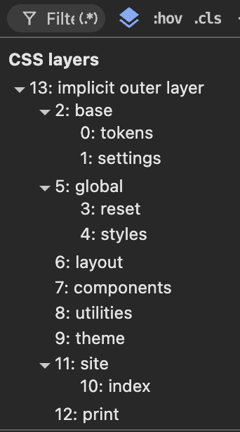
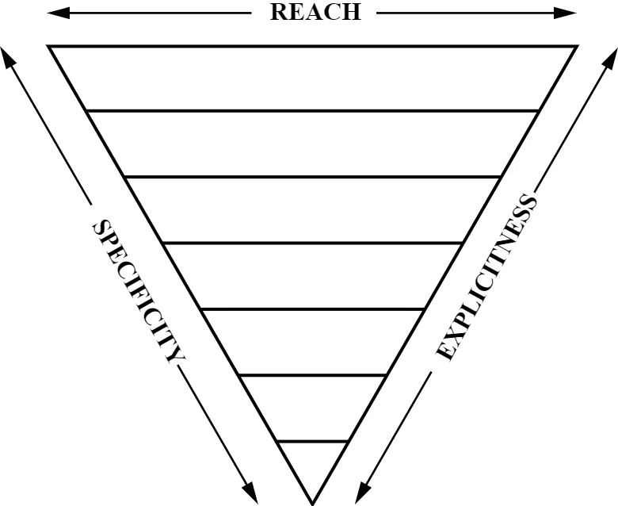
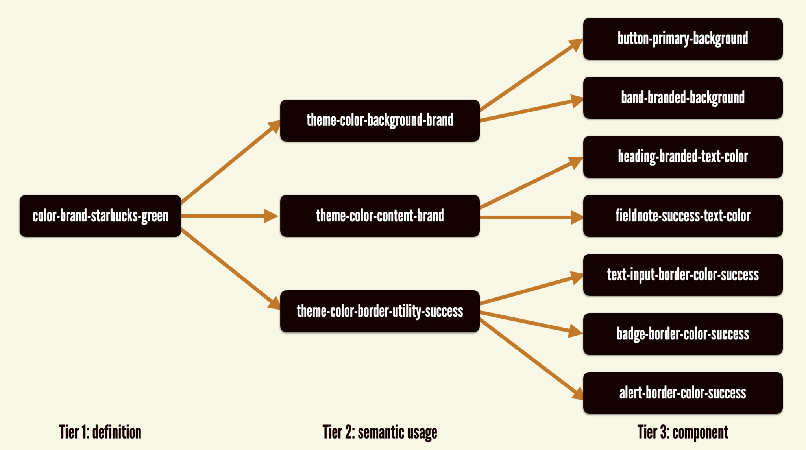

## Table of Contents

## はじめに

ここ最近で本サイトの UI のプラクティスについて個人的に聞かれることが何度かあり、その度に断片的な説明をするのも良くないと思い始めたので書き起こすことにしました。
せっかくなのでこれを機に少しリファクタリングをしようと思い立ったのですが、思いの外それが捗ってしまい、気づいた頃にはかなり大規模な改造になってました。
さすがに一つにまとめられなくなったので、ささやかな連載形式で本サイトの Web UI におけるプラクティスを紹介できればと思います。

もちろん一般的なプラクティスとして語られるものも多く含まれていますが、これから述べる設計・判断基準はあくまでも本サイトのデザインの意図に対して最適化されたものです。むしろこの規模の個人サイトにしては少し Too Much な部分もある認識ですが、このドメインは専ら色々なウェブの機能を試すために利用しているので、そもそも筆者自身が特に抑えようとしていない点をご了承いただければと思います。
つまり、本連載の内容は本サイト以外で最適なプラクティスであるとは限らないという点はご留意ください。

また連載全体を通して、筆者が特に意識して採用している機能や設計判断に絞って紹介します。筆者視点で大半の人が知っていそうな機能や概念そのもの（Cascade Layers とは何か、 Container Query とは何か、デザイントークンとは何か、 etc）に関しては、本連載の対象外としています。

---

本エントリでは CSS 設計の全体像と、基盤となるスタイルについて紹介します。 レイアウトやタイポグラフィ、その他工夫している点は、それぞれのエントリで個別に紹介します。

## Cascade Layering System

本サイトでは CSS Cascade Layers を用いてスタイルの優先度をコントロールしています。
全ての基盤レイヤは [`layers.css`](https://github.com/sakupi01/sakupi01.com/blob/main/packages/style/src/css/layer.css) にまとめて一元管理しています。

```css
@layer base, global, layout, components, utilities, theme, site, print;
```

また、必要に応じて基盤レイヤの配下でさらにレイヤを切っています。最終的に、DevTools を参照すると以下のレイヤ構造ができあがっていることがわかります。

:::figure[DevTools で確認できるレイヤ構造]

:::

- base: CSS 変数定義のみを置く基盤レイヤ
  - tokens: Primitive (`--p-`) と Semantic (`--s-`) を定義
  - settings: トークンより運用寄りのカスタムプロパティ（measure、focus 値など）
- global: HTML 要素に直接効くスタイル
  - reset: リセットスタイル
  - styles: 要素セレクタによる既定のデザイン
- layout: Every Layout パターンの実践やページ骨格などのスタイル
- components: 再利用可能な UI コンポーネントのスタイル
- utilities: 目的が単一のユーティリティクラス
- theme: `color-scheme` / `text-scale` などテーマとして上書き可能なスタイル
- site: 各サイト固有のドメインスタイル
- print: 印刷用スタイル

[Harry Roberts の ITCSS](https://www.xfive.co/blog/itcss-scalable-maintainable-css-architecture) や [Andy Bell の CUBE CSS](https://cube.fyi/)をご存知の方はわかると思いますが、レイヤの構造はこれらにかなり影響を受けています。命名や規則を完璧に踏襲しているわけではありませんが、かなり設計の参考にしています。
具体的には、詳細度が低く影響度・一般性の高いスタイルについては下位のレイヤに配置し、詳細度が高く影響範囲が限定的なスタイルについては上位のレイヤに配置するようにしています。

:::figure[ITCSS の Inverted Triangle と影響度・詳細度・明確度の関係]



:::

加えて、これはかなり私の美観というか認知の偏りが影響しているとは思いますが、「CSS変数の定義＝ base レイヤ」と記憶したかったので、敢えて tokens と settings をバラしてフラットにせずに base にまとめてネストしています。
同じ理由で、global や site もそれぞれに関係あるレイヤをまとめて管理するために敢えてネストしています。

このレイヤ設定を含めた、抽象的なスタイルの基盤となるエントリポイントを [`style/src/css/index.css`](https://github.com/sakupi01/sakupi01.com/blob/main/packages/style/src/css/index.css) にまとめ上げています。これを `@import` して使うのが基本的なプラクティスです。この `index.css` を読み込めば、優先度を制御された状態で最低限のスタイルが全て読み込まれます。

```css
/*
----------------------------------------------------------------------------
NOTE:

DO NOT EDIT 'index.css' directly.

CSS Cascade Layers.
----------------------------------------------------------------------------
*/
@import "layer.css";

/*
----------------------------------------------------------------------------
Design tokens (primitives + semantic)
----------------------------------------------------------------------------
*/
@import "tokens/index.css" layer(base.tokens) screen;

/*
----------------------------------------------------------------------------
Base style settings
----------------------------------------------------------------------------
*/
@import "base/index.css" layer(base.settings) screen;

/*
----------------------------------------------------------------------------
Reset
----------------------------------------------------------------------------
*/
@import "reset/index.css" layer(global.reset) screen;

/*
----------------------------------------------------------------------------
Global styles
----------------------------------------------------------------------------
*/
@import "global/index.css" layer(global.styles) screen;

/*
----------------------------------------------------------------------------
Layout patterns
----------------------------------------------------------------------------
*/
@import "layout/index.css" layer(layout) screen;

/*
----------------------------------------------------------------------------
Forms and components
----------------------------------------------------------------------------
*/
@import "components/index.css" layer(components) screen;

/*
----------------------------------------------------------------------------
Utilities
----------------------------------------------------------------------------
*/
@import "utilities/index.css" layer(utilities) screen;

/*
----------------------------------------------------------------------------
Theme overrides
----------------------------------------------------------------------------
*/
@import "theme/index.css" layer(theme) screen;

/*
----------------------------------------------------------------------------
Print styles.
----------------------------------------------------------------------------
*/
@import "print/index.css" layer(print) print;
```

site レイヤはここに定義していませんが、それぞれのサイトで限定的に適用したいスタイルは、読み込み時に site レイヤに配置することとします。site レイヤに配置するファイルのパスはそのプロジェクト固有のパス指定に依存するため、敢えて前述の共通 `index.css` に含めていません。

例えば、[`sakpi01.com`](https://sakupi01.com/) の全てのサブドメインで共通の上書きスタイルは site レイヤに定義しています。

```css
@import "https://sakupi01.github.io/sakupi01.com/css/layer.css";

/*
----------------------------------------------------------------------------
Site-specific styles (index)
----------------------------------------------------------------------------
*/
@import "./base/url.css" layer(base) screen;
@import "./base/font-faces.css" layer(base) screen;
@import "./site/index.css" layer(site.index) screen;
```

その上で、ブログサイト（[`blog.sakupi01.com`](https://blog.sakupi01.com/)）ではマークダウン特有のスタイルを加味して別途 site に定義しオーバーライドしています。

```css
@import "https://sakupi01.github.io/sakupi01.com/css/layer.css";

/*
----------------------------------------------------------------------------
Site-specific styles (markdown)
----------------------------------------------------------------------------
*/
@import "./site/markdown.css" layer(site) screen;
```

さらに、基盤スタイルはスライドページ（[`sakupi01.github.io/slides`](https://sakupi01.github.io/slides/ja/)）でも活用できています。 `sakupi01.github.io/slides` は全く別のリポジトリかつドメインで、`sakupi01.com` 視点では完全にサードパーティの類です。
しかし、基盤スタイルで用意された上書き用のレイヤーを活かし、スライドページ独自のスタイルで安全に上書きできます。

```css
@import url("https://sakupi01.github.io/sakupi01.com/css/index.css");
@import url("https://cdnjs.cloudflare.com/ajax/libs/font-awesome/6.3.0/css/all.min.css")
  layer(site.base) screen;
@import url("../../_fonts/fonts.css") layer(site.base) screen;
@import url("./typography.css") layer(site.base) screen;
@import url("./slides.css") layer(site) screen;

/*
----------------------------------------------------------------------------
Deck-wide settings
----------------------------------------------------------------------------
*/
html {
  color-scheme: light dark;

  /* --rem is a fluid unit (calc(1.25em + 0.5cqi)).
    Using it as the root font-size cascades responsive typography through every slide. */
  font-size: var(--rem);
}
```

「サイト固有のスタイルは site レイヤとして宣言する」という共通ルールさえ `layer.css` で握れていれば、 `layer(site)` として `@import` するだけで、そのスタイルシートがどこから読み込まれたとしても、 site レイヤのスタイルとして挿入されます。 読み込み順序に優先度が依存しないというのは、 Cascade Layer を使っているからこそ受けられる恩恵です。

## Token System

デザイントークンは、基本的には Brad Frost の [A three-tiered token architecture](https://bradfrost.com/blog/post/the-many-faces-of-themeable-design-systems/) を参考にしています。仕事の関係で日頃から馴染みがある構成で取り入れやすかったため、個人的にも採用しています。

:::figure[A three-tiered token architectureの例, 出典：[A three-tiered token architecture](https://bradfrost.com/blog/post/the-many-faces-of-themeable-design-systems/) ]

:::

ただし Tier 3 の 「Component Token」 は意図的に省いており、 Primitive (Definition) と Semantic のみで構成しています。これだと例えば、ヘッダー Nav の　Current Link と TOC の `:target-current` のハイライト色を別のタイミングで変更したいという場合に破綻しますが、本サイトでは現状でそういったユースケースを確認していないため採用もしていません。
もっと言うと、コンポーネントレベルに意味・変更範囲を閉じたい場面が少なく、むしろ Component Token を意識しすぎて、汎用的な変更がしにくくなる方が懸念だという話もあります。重要なことは、余計なコストを増やさずに、意味的に正しいデザイントークンを使うことで、スピーディーかつ正確にデザインを作るということです。その意味で現状では Component Token は本サイトでは使い所が少なかったため、採用を見送っています。

### Primitive Tokens

Primitive Tokens は最も基盤となるトークンを示し、この CSS 変数には「このプロジェクトはこれらのトークンのいずれかからのみ構成される」ことを示す以外には特に何の意味もありません。 Tailwind CSS の素のユーティリティクラスのような、プリミティブなものです。
それぞれのトークンの構成の詳細については、後のエントリに委ねます。

```css
@property --p-color-green-hue {
  inherits: true;
  initial-value: 130;
  syntax: "<number>";
}

/* --l-200, --l-300, --l-400, --l-500 も同様に @property で定義 */
@property --l-300 {
  inherits: true;
  initial-value: 0.85;
  syntax: "<number>";
}

--p-color-green-200: oklch(from var(--p-color-green-500) var(--l-200) 0.05 h);
--p-color-green-300: oklch(from var(--p-color-green-500) var(--l-300) 0.09 h);
--p-color-green-400: oklch(from var(--p-color-green-500) var(--l-400) 0.14 h);
--p-color-green-500: oklch(var(--l-500) 0.21 var(--p-color-green-hue));
```

Primitive Tokens には `--p-` プレフィクスをつけることにしています。

### Semantic Tokens

Semantic Tokens は実際に参照し利用するトークンで、Primitive と紐づいたものになっています。
つまり、Primitive Tokens は **Semantic Token 以外から参照されない**ものです。プロジェクトで利用するときは、特別な理由がない限り Semantic Token を利用し、対応する Semantic Token がない場合は順次追加し Primitive に紐付けます。

Semantic は Primitive と違って、デザインの「意味」を持ちます。例えば、Semantic Token はそのデザインのコンテキスト（テーマや利用箇所など）に応じた色を返す作りや命名になっています。

```css
--s-color-message: var(--p-color-green-500);
--s-color-message-bg: light-dark(
  var(--p-color-green-200),
  var(--p-color-green-800)
);
--s-color-message-text: light-dark(
  var(--p-color-green-700),
  var(--p-color-green-200)
);
```

Semantic Tokens には `--s-` プレフィクスをつけることにしています。

### Settings

一般的なトークン設計にはあまり含まれないものとして、本サイトでは Settings トークンを定義しています。

ここでは後のレイヤで利用する、サイト全体のユーザビリティを保証する・上げる設定となる変数を定義して一元管理しています。

サイト全体のレイアウトを決める値は、別の場所で別の値が定義されて参照されると一気に全体が一貫しなくなるため、一箇所にまとめて定義しています。

それぞれの設定意図は文脈ごとに説明した方が筋が通るためのちに各所で説明します。

そのほかにも、Settings には [scrollbar](https://github.com/sakupi01/sakupi01.com/blob/main/packages/style/src/css/base/scrollbar.css) や [table](https://github.com/sakupi01/sakupi01.com/blob/main/packages/style/src/css/base/table.css) で利用する変数設定を含みます。以下はサイト全体で一元管理したい変数を一挙にまとめる [config.css](https://github.com/sakupi01/sakupi01.com/blob/main/packages/style/src/css/base/config.css) の例です。

```css
/*
----------------------------------------------------------------------------
Config settings.
----------------------------------------------------------------------------
*/
:where(html) {
  /* Layout */
  --base-site-max-width: null; /* set per site */
  --base-main-max-width: null; /* set per site */
  --base-article-max-width: null; /* set per site */
  --base-header-height: null; /* set per site */

  /* :focus-visible.
        - Uses transparent outline so high contrast mode works.
        - See https://css-tricks.com/the-focus-visible-trick/.
    */
  --base-focus-shadow: null; /* set per site */
  --base-focus-outline: null; /* set per site */

  /* :hover and :active */
  --base-hover-opacity: null; /* set per site */
  --base-active-transform: null; /* set per site */

  /* Images */
  --base-media-aspect-ratio: 16 / 9;
  --base-image-path: "../BASE_IMAGE_PATH";

  /* Fonts */
  --base-font-size: 100%;
  --base-font-size-2k: 110%; /* 2K screens */
  --base-font-size-4k: 150%; /* 4K screens */

  /* ----------------------------------------------------------------------------
   Max line-length (aka measure) to improve readability of editorial content

   The optimal line length for comfortable reading is around 45~75 characters(24~40 in CJK characters).
      However, the 'ch' unit depends on the font's character width and can vary.
      Assuming 1em ≈ 2 characters, we use 35em to approximate 70 characters per line.
   See:
   https://terkel.jp/archives/2015/08/line-length/
   https://www.smashingmagazine.com/2014/09/balancing-line-length-font-size-responsive-web-design/
   ---------------------------------------------------------------------------- */
  &:lang(ja) {
    --base-max-line-length: 40em;
  }

  &:lang(en) {
    --base-max-line-length: 30em;
  }
}
```

## Reset & Global Styles

著名な Reset CSS を参考に、昨今のブラウザ事情を加味して多少アレンジして利用しています。[reset/index.css](https://github.com/sakupi01/sakupi01.com/blob/main/packages/style/src/css/reset/index.css)

- [Eric Meyer](https://meyerweb.com/eric/tools/css/reset/)
- [Andy Bell](https://andy-bell.co.uk/a-more-modern-css-reset/)
- [Josh Comeau](https://www.joshwcomeau.com/css/custom-css-reset/)
- [Kilian Valkhof](https://kilianvalkhof.com/2022/css-html/your-css-reset-needs-text-size-adjust-probably/)

以下では、それぞれの Reset から何を採用し、何を採用しなかったかで採った主要な判断を残しておきます。

### `:where()` `:is()` のプラクティス

`:where()` や `:is()` には selectors-4 で新しく加わった "[forgiving selector list](https://drafts.csswg.org/selectors-4/#forgiving-selector)" と呼ばれる特性があります。
中に未対応の selector が混じっても、対応している selector は生き残って全体としてはパースが成功する、というものです。
普通の selector list では未実装の要素などを書くと selector list 全体が無効になってしまいます。
これを `:is()` や `:where()` でラップするだけで、 Progressive enhancement させたい比較的新しい要素を含んでいるセレクタを構成可能になることは、あまり知られていないのではないでしょうか。

```css
:is(a.current, :target-current) {
  /* :target-current がサポートされていないブラウザでも他のセレクタはスタイルされる */
}
```

`:where()` `:is()` の差分として、 `:is(A, B, C)` は引数のうち最も高い詳細度を取り、`:where(A, B, C)` は常に 0 になります。

この特性から、特に `:where()` は詳細度を低く保ちたい Reset 系 CSS で大変都合よく活躍してくれます。昨今の Reset 系 CSS 界隈ではこのプラクティスが割とスタンダードになってきている実感があります。

本サイトでも後から自由に上書きされることを前提にしたルールは `:where()` でラップしています。単純なクラス 1 つでも確実に勝てるように、詳細度を 0 に潰しておく意図です。

```css
:where(*, *::after, *::before) {
  box-sizing: border-box;
}
:where([type="submit"], label, summary) {
  cursor: pointer;
}
```

### `text-size-adjust: none;`

これは iOS Safari で portrait → landscape で向きを変えると本文の文字サイズを拡大してくれる挙動に対応するものです。

```css
html {
  /* Remove automatic text size adjustment on iOS for better cross-platform consistency.
     See: https://kilianvalkhof.com/2022/css-html/your-css-reset-needs-text-size-adjust-probably/ */
  -moz-text-size-adjust: none;
  -webkit-text-size-adjust: none;
  text-size-adjust: none;
}
```

これはもともとレスポンシブ非対応の古いページを読みやすくするために対応された iOS Safari の[仕様](https://developer.apple.com/library/archive/documentation/AppleApplications/Reference/SafariWebContent/AdjustingtheTextSize/AdjustingtheTextSize.html)で、iPhone では `-webkit-text-size-adjust` のデフォルトが `auto` で、この自動調整が有効になっています。

しかし、モバイル向けに設計された現代のサイトでは、本文だけ肥大化して見出しとの階層が崩れるなどの副作用が出る可能性が否めないため、これをリセットで一律オフにしています。[^text-size-adjust]

[^text-size-adjust]: Your CSS reset needs text-size-adjust (probably) - https://kilianvalkhof.com/2022/css-html/your-css-reset-needs-text-size-adjust-probably/

---

余談ですが、 `:root` は特別な理由がない限り利用していません。 筆者の主観ですが、`:root` はしばしば `html` を意図して利用されることがありますが、 `:root` が指すものには HTML 文書の `html` だけでなく、SVG 文書の `svg` や XML 文書のルート要素も含まれます。対象を明確にし、意図しないスタイルの適用を防ぐためにも、 `html` のみを意図するのであればセレクタに `:root` を使うべきではないでしょう。

### `box-sizing: border-box` は継承しない

`box-sizing: border-box` は多くの Reset に入っている常連のスタイルですが、書き方には大きく 2 パターンがあります。
そして、B の方の書き方は、昨今では基本的に推奨されません。[^no-inheritance-boxsize][^css-protips]

[^no-inheritance-boxsize]: c.f. [Don't Inherit the Box Model | OddBird](https://www.oddbird.net/2025/09/04/box-model/)

[^css-protips]: CSS Protips では B の書き方が推奨されているようですが、、、[AllThingsSmitty/css-protips: ⚡️ A collection of tips to help take your CSS skills pro 🦾](https://github.com/allthingssmitty/css-protips#inherit-box-sizing)

```css
/* A: すべての要素に直接指定 */
* {
  box-sizing: border-box;
}

/* B: html に指定して継承 */
html {
  box-sizing: border-box;
}
*,
*::before,
*::after {
  box-sizing: inherit;
}
```

B はもともと、`border-box` 以前に `content-box` 前提で書かれたレガシーなコンポーネントを `border-box` を中心としたプロジェクトに組み込むために生まれました。B のように継承を利用すると、 プロジェクト全体は `border-box` でもレガシー部分だけ `content-box` にすれば、グローバルの継承を利用して子要素すべてが `content-box` にロールバックされる、という使い方で知られていました。

しかし、今ではそもそもそういう前提が当てはまりづらくなっているでしょう。

:::note{.memo}
📝 継承すべきプロパティと継承すべきでないプロパティ

「`border-box` はなぜそもそもデフォルトが `inherit` ではないのか」と言う論点からも、継承の是非の説明を試みます。

Web Platform Design Principlesでは、新しいCSSプロパティの継承の是非を判断するための基準が記されています[^6]。

[^6]: c.f. [4.2. Make appropriate choices for whether CSS properties are inherited | Web Platform Design Principles](https://www.w3.org/TR/design-principles/#css-inherited-or-not)

子孫要素で同じプロパティを設定したとき、祖先のスタイルを「上書き」するのか、それとも「追加」するのかというものです。

> If setting the property on a descendant element needs to **override** (rather than add to) the effect of setting it on an ancestor, then the property should probably be inherited.
> If setting the property on a descendant element is a separate effect that **adds** to setting it on an ancestor, then the property should probably not be inherited.
>
> 子孫での設定が祖先の効果を上書きする必要があるなら、そのプロパティは継承されるべき
> 子孫での設定が祖先の効果とは別の効果をもたらすなら、そのプロパティは継承されるべきでない

例えば `font-size` は継承プロパティです。親要素に設定された `font-size` は子孫に流れ、子孫で別の `font-size` を指定すれば上書きされます。もしこれが非継承プロパティならば、毎回指定せねばならず、初期値として「祖先を遡って値を持つ要素を探す」という振る舞いが欲しくなるでしょう。
Design Principlesではこれを、プロパティが本来継承されるべきだったことを示す「Code Smell」と表現しています。

逆に `background-image` は非継承プロパティです。もしこれが継承されたら、半透明の背景画像が子孫要素ごとに繰り返し重なって表示されるのを防ぐため「親要素と同じ値であれば無視する」といった特殊な仕様が欲しくなるでしょう。これは逆に、プロパティが本来継承されるべきでないことを示す「Code Smell」だと解釈できます。

さらにDesign Principlesでは「テキストに影響を与えるプロパティは、ほぼ常に継承されるべきだ」としています。この原則により、テキストの見た目はデフォルトで周囲と一体化されることになっています。

もし `display: block` や `padding` が継承されてしまったらどうでしょうか。親の `padding` がすべての子に伝播すれば、入れ子が深くなるほどパディングが累積し、レイアウトが崩壊してしまうでしょう。

子孫要素で `box-sizing` を別に指定しても、祖先の box のスタイルを上書きするわけではありません。Design Principles に準じれば「子孫での設定が祖先の効果とは別の効果をもたらす」側にあたります。それゆえ非継承プロパティとして設計されているのは意図的であり、言語設計としては継承しない方が自然なのです。

必ずしも正しいとは限りませんが、感覚的に「継承されてもデザインが自然に保たれ、大きなレイアウト崩れが発生しないもの」は継承されるプロパティだという感覚を持っておくと、便利かもしれません。

:::

こうした背景から、 `border-box` は継承していません。これも`:where()` で詳細度を 0 にすることで、状況に応じて `content-box` に戻すのを容易にしています。

```css
:where(*, *::after, *::before) {
  box-sizing: border-box;
}
```

### `list-style-type` は `none` せず空文字を渡す

WebKit には、`list-style: none` が適用されたリストをアクセシビリティツリー上で list として露出しない挙動があります。これは長年知られている挙動で、 Bug も上がっています。

- 170179 – VoiceOver does not announce a list for groups of links when `list-style: none;`
  - https://bugs.webkit.org/show_bug.cgi?id=170179

Bugzilla のやりとりを見るとわかりますが、「挙動は意図的」として却下されており、修正される見込みはなさそうです。
2023 年以降は特定の場合においてはセマンティクスが保たれるように多少緩和されているようです[^4]が、それでも対応しきれないケースは残る状態です。

[^4]: c.f. ["Fixing" Lists | scottohara.me](https://www.scottohara.me/blog/2019/01/12/lists-and-safari.html)

これに対して、 リスト利用箇所に`role="list"` を付け足すことが対応としてありましたが、（本来なら）ネイティブ要素で済む場面で role を補足していたり、リンタに警告されがちであったため、忌避されていた節があります。

本サイトでは`list-style-type: ""` でマーカーを消しつつセマンティクスを保つテクニック[^5]を利用して諸問題を回避しています。

[^5]: Removing list styles without affecting semantics. - https://www.matuzo.at/blog/2023/removing-list-styles-without-affecting-semantics

```css
:is(ol, ul)[class] {
  list-style-type: "";
}
```

`[class]` 付きにしているのは、クラスが付いたリストは装飾目的、素のリストはスタイルをつけない、という想定を実現する用途です。

### `:target` に対するスクロールパディング

本サイトは、見出しと紐づく URL フラグメントのアンカーリンクを踏むと、該当見出しまでスクロールします。本サイトのヘッダは現時点で `position: sticky` ではありませんが、将来的にそうなる可能性も否めませんし、一般的にはそういったデザインも多いはずです。こうしたヘッダで該当見出しまでスクロールする URL を踏むと、要素がヘッダーの裏に隠れて読めないという問題が起こりえます。

そこで、本サイトではあらかじめ `:target` に `scroll-margin-block` を指定して、アンカースクロール時にその分の余白が自動で確保されるようにしています。

```css
:target {
  scroll-margin-block: var(--base-header-height);
}
```

### `prefers-reduced-motion: reduce` への対応は一元管理しておく

Lint ツールを噛ませていれば指摘してくれるのですが、いちいち各所で書くのも面倒だし、抜けや漏れもゼロではないでしょう。そのため、各所に書くのではなく、Reset で全要素の animation / transition / scroll-behavior をまとめて無効化しています。

```css
/* Remove all animations & transitions for people that prefer not to see them */
@media (prefers-reduced-motion: reduce) {
  * {
    animation-duration: 0.01ms !important;
    animation-iteration-count: 1 !important;
    scroll-behavior: auto !important;
    transition-duration: 0.01ms !important;
  }
}
```

また、今回のように「絶対に上書きされないスタイルである」という明確な意図を持つ場合に限り、`!important` の利用を正当化しています。ほかにも、`.visually-hidden` のような確実にそのスタイルが効いて欲しい場面では `!important` の利用は正しいと言えるでしょう。

### Logical properties

本サイトのスタイルでは、物理方向のプロパティ(`height``、width`、`margin-left`、`padding-top`、など)ではなく、Writing Modes に依存しない logical property を優先して使っています。 Reset でも例えば、以下のような指定の仕方をしています。

```css
img {
  block-size: auto;
  max-inline-size: 100%;
}

:is(ol, ul):not([class]) {
  padding-inline-start: var(--s-space-gutter-lg);
}

:target {
  scroll-margin-block: var(--base-header-height);
}

:is(html, body) {
  min-block-size: 100svb;
}
```

現状 `ltr-tb` の本サイトで対応することは見方によってはやりすぎかもしれませんが、日本語コンテンツである以上、将来的に `writing-mode: vertical-rl` で縦書きレイアウトを試してみる余地を残しておきたい、という思惑がそれなりになくもないためそうしています。
また、 LTR / RTL の違いにも強くなるので、例えば記事中にアラビア語やヘブライ文字の引用を書くような場面でも、`padding-left` ではなく `padding-inline-start` であれば正しく「先頭」の余白として解釈されます。直接的に実用性があるというよりは 「CSS の今後の潮流がそちら寄りなので、せっかくなら乗っておく」 という類のものです。[^7]

[^7]: それぞれのプロパティを Logical 対応する仕様変更案をしたならば、どの CSS プロパティ/値がその変更の影響を受けるのかに関しては、現在も地道な調査が続いているよう：[Support Logical Shorthands in CSS | OddBird](https://www.oddbird.net/2025/03/20/logical-shorthand/), [Physical/logical properties, keywords, and functions](https://css.oddbird.net/logical/properties/)
