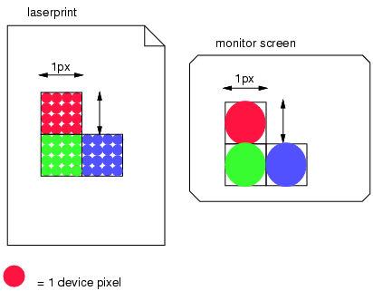
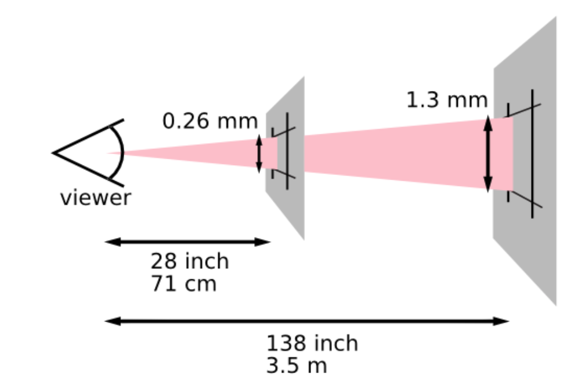
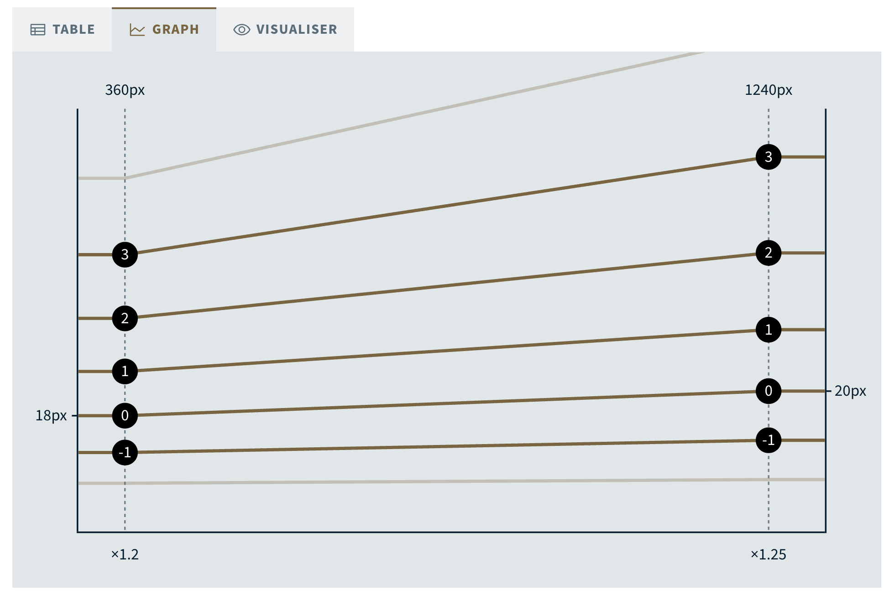
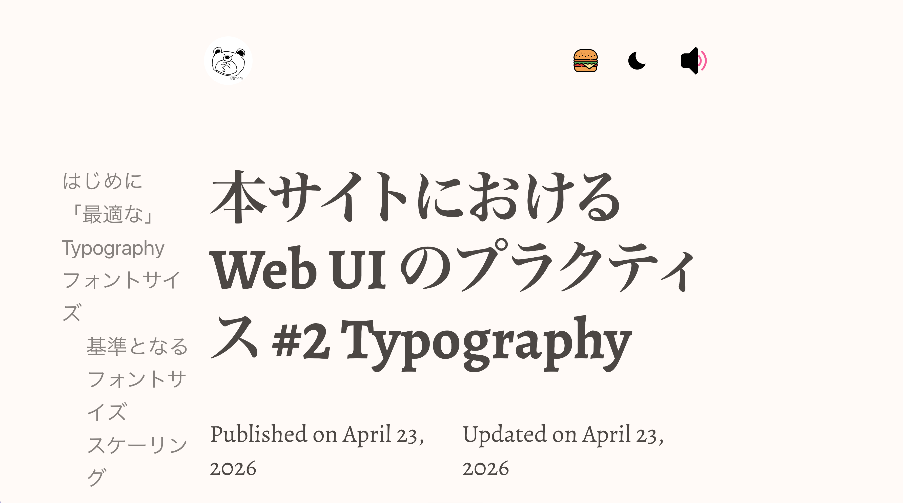
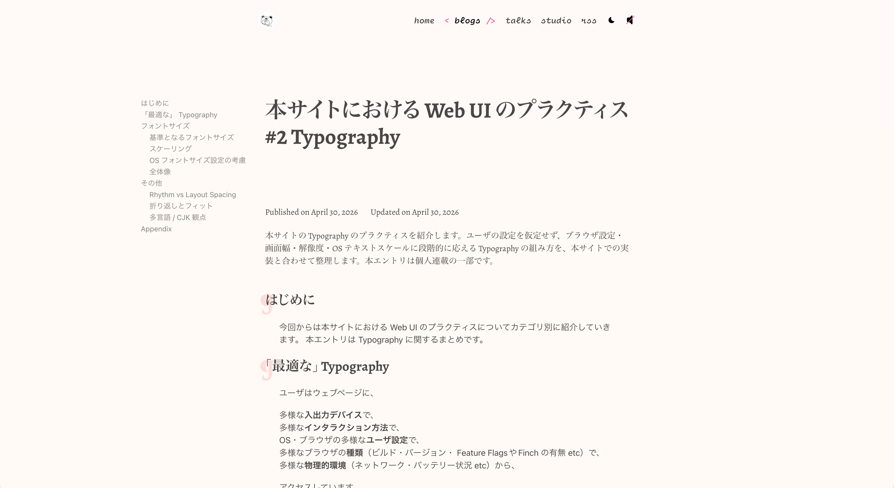
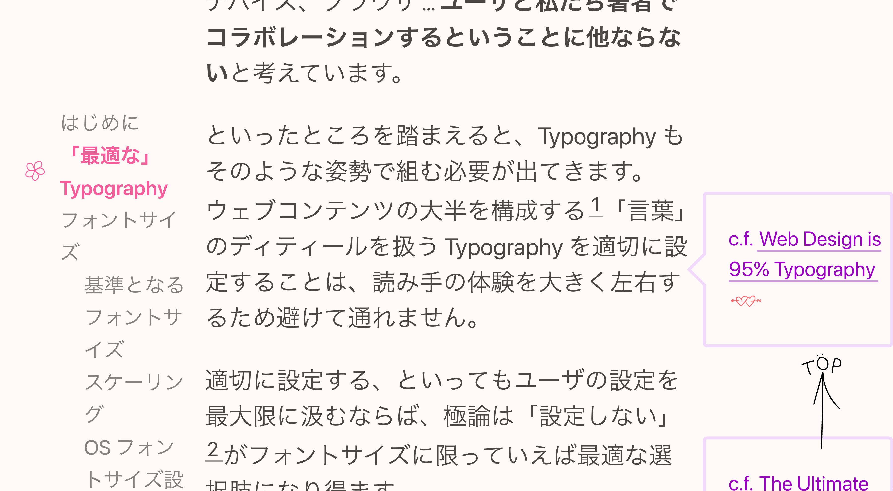
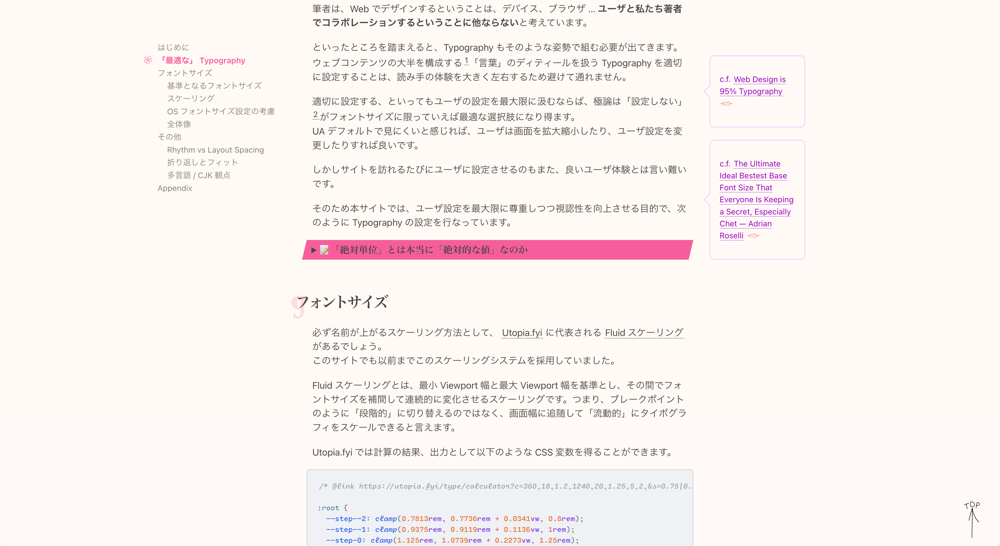

## Table of Contents

## はじめに

今回からは本サイトにおける Web UI のプラクティスについてカテゴリ別に紹介していきます。 本エントリは Typography に関するまとめです。

## 「最適な」 Typography

本題に入る前に、Typography のスタイルを組むにあたって、筆者が軸として据えていた考え方を展開しておきます。

ユーザはウェブページに、

多様な**入出力デバイス**で、
多様な**インタラクション方法**で、
OS・ブラウザの多様な**ユーザ設定**で、
多様なブラウザの**種類**（ビルド・バージョン・ Feature FlagsやFinch の有無 etc）で、
多様な**物理的環境**（ネットワーク・バッテリー状況 etc）から、

アクセスしています。

フォントサイズに話を限定する方向で考えた場合、ユーザは、

多様な**ディスプレイ**で、
Retina や 4K/2K など多様な**解像度**で、
多様な**画面幅**で、
OS・ブラウザの多様な**ユーザ設定**で、
多様な画面の**拡大率**で、
さらには多様な物理的な**距離**を介して、

私たちのページを閲覧している、といった表現ができるでしょう。

この他にももっと多様な変数が存在するでしょうし、その変数がこれから減っていくことは基本的には無いでしょう。むしろ、VR や AR などを筆頭に、ウェブにアクセスする手段や環境はこれからも多様化すると考えるのが自然です。

つまり、Web でのデザインを絶対的なものとして捉えるのは大変に困難です。

筆者は、ウェブデザインにおけるウェブを「**無限に広がる未知のキャンバス**」であると捉えてきました。

そのキャンバスのコンテキストを全て持ち、内部で HTML や CSS を解釈・計算してデザインの結果を出力できる代表的なソフトウェアが、いうまでもなく「**ウェブブラウザ**」です。そして、デザインの段階でブラウザの持つコンテキストや処理を考慮しきるのは、現状では難しいところがあります。

デザインツールは、ある時点のデザインの仮定を「デザインのスナップショット」としてピクセル単位で正確に表現できるところに一つ強みがあります。
「デザインのスナップショット」をブラウザが解釈できる形に翻訳する場合、HTML や CSS を利用することになります。
HTML や CSS を用いて、ブラウザはユーザ設定などコンテキストの実態に則したデザインを出力します。つまり、ブラウザは HTML や CSS で伝えられた「デザインの意図」を解釈し、ユーザコンテキストの実態に則して「デザインのスナップショット」を補間し、「レンダリング結果」として最終的に画面に出力します。

要するに、**デザインツール**は「デザインの結果」ではなく、**ユーザコンテキストを仮定した「デザインのスナップショット」を表現**し、 **ブラウザ**は「デザインのスナップショット」ではなく、**ユーザコンテキストを含めた「デザインの結果」** を出力するというそれぞれの役割があります。

その中で、 HTML や CSS は「**“デザインの意図” をウェブブラウザに対して“提案”可能にしているメカニズム**」だと個人的には解釈しています。
つまり、HTML や CSS 自体に、「デザインの結果」を「強制」する能力はありません。

多様な変数の上に成り立つ「未知のキャンバス」、「ウェブ」の上で、デザインの最終決定権を持つのは、ユーザコンテキストを操作可能な**ユーザ**です。デザイナーやサイト製作者自身は CSS でデザインを「提案」することはできても、それを完全に制御し、強制しきる仕組みには、ブラウザ自身がなっていません。

個人的には、詳細まで緻密に詰められたデザインのスナップショットを Web で実現することを、最初から諦めています。
という言い方をするとネガティブに聞こえるかもしれませんが、こうした Web の特性を踏まえると、Web でデザインするということは、**ユーザと私たち著者の間でコラボレーションすること**だと捉えられるでしょう。

といったところを踏まえると、Typography もそのような姿勢で組む必要が出てきます。
ウェブコンテンツの大半を構成する[^95%]「言葉」のディティールを扱う Typography を適切に設定することは、読み手の体験を大きく左右するものであり、避けて通れません。

[^95%]: c.f. [Web Design is 95% Typography](https://ia.net/topics/the-web-is-all-about-typography-period)

適切に「設定する」、といってもユーザの意図を最大限に汲む姿勢で望むならば、極論は「設定しない」ことがフォントサイズに限っていえば最適な選択肢になり得ます。
UA デフォルトで見にくいと感じれば、ユーザは画面を拡大縮小したり、ユーザ設定を変更したりすれば良いです。

しかしサイトを訪れるたびにユーザに設定させるのもまた、良いユーザ体験とは言い難いです。

そのため本サイトでは、ユーザ設定を最大限に尊重しつつ視認性を向上させる目的で、次のように Typography の設定を行なっています。

<details>
  <summary>📝 「絶対単位」とは本当に「絶対的な値」なのか</summary>

ウェブでのデザインは絶対的なものとして捉えきれない（コンテキストに依存する）と述べた反面、CSS には「絶対単位」が存在します。私たちがよく利用する「px （ピクセル）」もまたその一つです。

- [5.2. Absolute Lengths: the cm, mm, Q, in, pt, pc, px units --
  CSS Values and Units Module Level 3](https://www.w3.org/TR/css-values-3/#absolute-lengths)

ところで、CSS で絶対単位とされる `px` は、本当に絶対的な値なのでしょうか？

CSSの仕様策定が行われていた 1990年代当時、ディスプレイの解像度は 70〜90 DPI 程度で、デザインはデバイスピクセル単位で行われていました。しかしプリンター（300〜600 DPI）や、その後の高解像度ディスプレイなど、DPI が大きく異なるデバイスが普及すると、デバイスピクセルを直接使う設計では媒体ごとに見た目のサイズが大きくぶれる問題が生じました。

:::figure[高解像度のデバイスでは、1ピクセル×1ピクセルの領域をカバーするために、低解像度のデバイス（視聴距離が同じ程度）よりも多くのデバイスピクセル（ドット）が必要であることを示しています [CSS Values and Units Module Level 3](https://www.w3.org/TR/css-values-3/#anchor-unit)]


:::

そこで px は物理画素ではなく、 「腕を伸ばした距離（71cm 相当）から見た 96 DPI モニターにおける 1 ピクセルの視角」を基準とする「Reference Pixel（参照ピクセル）」として再定義されました。

:::figure[視距離が長くなるとピクセルが大きくならなければならないことを示す [CSS Values and Units Module Level 3](https://www.w3.org/TR/css-values-3/#absolute-lengths)]

:::

このため、スマートフォンや PC モニターでは 1px ≒ 0.26mm（1/96 インチ）ですが、3.5m 離れて見る大型ディスプレイでは 1px ≒ 1.3mm 相当になります。つまり **px は仕様上「人間の目にどう映るか」を基準とした相対的な単位**として定義されており、この仕様の恩恵を受けてのちに Retina などの高解像度ディスプレイへの対応も可能になりました。

ただしスクリーン上では互換性の都合から 1px = 1/96 インチの比率がほぼ保たれており、実質的にはほぼ固定比率として扱って差し支えありません。

</details>

## フォントサイズ

必ず名前が上がるスケーリング方法として、 [Utopia.fyi](https://utopia.fyi/) に代表される [Fluid スケーリング](https://utopia.fyi/type/calculator) があるでしょう。
このサイトでも以前までこのスケーリングシステムを採用していました。

Fluid スケーリングとは、最小 Viewport 幅と最大 Viewport 幅を基準とし、その間でフォントサイズを補間して連続的に変化させるスケーリングです。つまり、ブレークポイントのように「段階的」に切り替えるのではなく、画面幅に追随して流動的にタイポグラフィをスケールするため、この名がついています。

Utopia.fyi を利用すると、出力として以下のような CSS 変数を得ることができます。

```css
/* @link https://utopia.fyi/type/calculator*/

:root {
  --step--2: clamp(0.7813rem, 0.7736rem + 0.0341vw, 0.8rem);
  --step--1: clamp(0.9375rem, 0.9119rem + 0.1136vw, 1rem);
  --step-0: clamp(1.125rem, 1.0739rem + 0.2273vw, 1.25rem);
  --step-1: clamp(1.35rem, 1.2631rem + 0.3864vw, 1.5625rem);
  --step-2: clamp(1.62rem, 1.4837rem + 0.6057vw, 1.9531rem);
  --step-3: clamp(1.944rem, 1.7405rem + 0.9044vw, 2.4414rem);
  --step-4: clamp(2.3328rem, 2.0387rem + 1.3072vw, 3.0518rem);
  --step-5: clamp(2.7994rem, 2.384rem + 1.8461vw, 3.8147rem);
}
```

しかし、Utopia 等のツールは 1rem == 16px と仮定し、px→rem を換算しています。
つまり、ブラウザ設定で font-size = 24px ならば、 Utopia の出力は想定より 1.5 倍拡大されたものとなります。
ユーザーが望んだのは「24px」であり、著者は「16px」を前提として計算しているにもかかわらず、そのいずれの意図とも合致しない値が出てしまうわけです。

:::figure[Graph showing font size of step 0 and surrounding steps between min and max viewports [Fluid type scale calculator | Utopia](https://utopia.fyi/type/calculator)]

:::

Fluid スケーリングの強みは画面幅にレスポンシブなことです。しかしそれと同時に、`rem` を固定値と見做して最終的にマジックナンバーを算出している点で、実はユーザの設定に「前提」をおいているスケーリング方法でもあります。

本サイトでは、 そうした「前提」を極力排除した、「ユーザの設定/事実を最大限に利用した」フォントサイズの設定を試みます。

### 基準となるフォントサイズ

フォントサイズにおいて、ユーザの設定をそのまま踏襲するとなると、極端な話以下のようになります。

```css
html {
  /* 1em = user setting */
}
```

「何も設定しない」というのが、最もユーザの設定を正確に適用できるでしょう。

#### ブラウザ設定の考慮

ただ、何も設定しないとかえって読みづらかったり、何よりサイトのデザインを表現できなかったりします。多くの場合流石にそれは望ましくありません。

そのためここでは、 **`1em` をユーザ設定を表した「変数」** と見做します。
`1em` という基準に対して、サイトの「推奨サイズ」を「提案」するというスタンスを取ると、以下のように指定できます。

```css
html {
  font-size: max(1em, 18px);
}
```

ポイントは `1rem` を `16px` と**仮定して `1.125em` に変換しない**ことです。 ここでやりたいのは、あくまでもユーザの設定を比較関数にそのまま渡してブラウザに判断させることです。
ユーザ設定が小さければ `18px` が優先され、大きければユーザが優先されます。

#### 画面幅の考慮

さらに、Fluid Typography のように Viewport の幅に応じてサイズを伸縮させたいとなると、 Viewport に対してレスポンシブになる単位を利用することになります。

ここで一つ重要なポイントとして「**画面幅を尊重すればするほど、zoom しにくくなる**」ということを説明しておきます。

小さい画面サイズであれば、入る CSS ピクセル数は少なくなります。画面を zoom すると、CSS ピクセルひとつひとつが拡大されるため、画面内に入る CSS ピクセル数が減少します。つまり画面を小さくするのと、ピクセルひとつあたりのサイズを拡大するのとでは、 CSS ピクセル数は近似して考えられます。

要するに、画面に入る CSS ピクセル数は zoom と画面幅によって決まります。そのため、`1vw` からすると両者は区別できません。
リサイズで画面幅が半分になっても、zoom で CSS ピクセルが 2 倍に拡大されても、`1vw` のピクセル数は同じように変化します。
これを物理サイズで考えた場合も、zoom でCSS ピクセル 1 つの物理サイズが 2 倍になっても数が半分になるので、相殺されて画面全体としての幅は変わりません。
つまり、`1vw` で指定した要素は zoom しても物理的な大きさが変わらないため、**画面幅を基準にしていては zoom に応じることができません**。

そのため、Viewport 単位は単体で利用せず、必ず `px` と足し合わせて利用します[^svi]。
定数としての推奨サイズに対して、伸縮係数として Viewport 単位を利用する形です。
伸縮係数として Viewport 単位を利用するのは Utopia でも同じですが、ここでは定数値をユーザ設定を仮定して定数値を逆算していません。

[^svi]: `vi` / `lvi` ではなく `svi` を選んでいるのは、モバイル Safari でアドレスバーの開閉によって viewport が伸縮しても基準サイズが揺れないようにするためです。c.f. [The large, small, and dynamic viewports](https://www.bram.us/2021/07/08/the-large-small-and-dynamic-viewports/)

```css
html {
  font-size: max(1em, 18px + 0.05svi);
}
```

画面幅が小さい場合は、定数である `px` をベースにフォントサイズが決まるため、zoom にも問題なく対応します。
しかし、画面幅が大きくなればなるほど、フォントサイズは Viewport 単位に依存するところが大きくなります。つまり、zoom が効きづらくなるということです。

よって、Viewport 依存の値を極端に大きくし過ぎると、WCAG でいうところの [Resize Text 1.4.4](https://www.w3.org/WAI/WCAG21/Understanding/resize-text)（テキストは 200% まで拡大可能でなければならない）に抵触するので、控えめに止めるのが良いでしょう。

ただし `max()` だけだと、`svi` の伸縮係数が際限なく増え、ユーザ設定から大きく乖離してしまう可能性が生じます。
そのため、上限を設けて clamp しておきます。

```css
--p-text-base: clamp(1em, 18px + 0.05svi, 1.125em);
```

`clamp` の最大値は `em` であればなんでも良いのですが、**最大値/最小値 <= 2.5**となるようにだけ注意しておきたいです。

画面幅が大きくなるほど、zoom に反応しない `svi` 単位の影響が支配的になり、zoom が効きづらくなります。

これは、以下の経験則によると、`最大/最小 ≤ 2.5` を満たしていれば、最大 zoom (通常 500%)で 200% の拡大が必ず可能になるとされています。[^zoom]

[^zoom]: （再掲） WCAG 1.4.4 で 「テキストを支援技術なしで 200% まで拡大できること」が要求されているため。[Understanding Success Criterion 1.4.4: Resize Text | WAI | W3C](https://www.w3.org/WAI/WCAG21/Understanding/resize-text)

> If the maximum font size is less than or equal to 2.5 times the minimum font size, then the text will always pass WCAG SC 1.4.4, at least on all modern browsers.
>
> -- [Addressing Accessibility Concerns With Using Fluid Type](https://www.smashingmagazine.com/2023/11/addressing-accessibility-concerns-fluid-type/)

今回採用する `1.125em` という `clamp` の最大値はこの 2.5 の範囲内のため、WCAG 的にも問題ありません。

---

ここで定義した `--p-text-base: clamp(1em, 18px + 0.05svi, 1.125em);` をサイト全体の root のフォントサイズとして利用します。
ユーザ設定である `1em` を尊重しつつ、流動的なスケーリングを適切な範囲で適用する基準サイズを、サイト全体の基準として用います。

### スケーリング

基準サイズを起点に、ページ内で使う見出しや本文のサイズを生成していきます。
ここでも「ユーザ設定の仮定をしない」という方針を一貫させたいので、各サイズは**基準フォントサイズに比率を掛け算する方針**で組み立てます。マジックナンバーや px ↔ em の換算は介在させないようにします。

以降ではこの仕組み全体のことを「スケーリング」と呼び、その段階の一つを「ステップ」と呼びます。

#### ブラウザ設定の考慮

スケールは `--p-text-ratio` という共通変数を用いて等比的に決定します。

ここでは極力 Utopia のように rem を仮定せず、ブラウザ設定を活かしたスケーリングを行います。

その一方 Utopia のような等比的なスケーリングをしたいのですが、これは今なら `pow()` を用いて実現可能でしょう[^oddbird-fluid]。

[^oddbird-fluid]: c.f. [Reimagining Fluid Typography | OddBird](https://www.oddbird.net/2025/02/12/fluid-type/)

```css
--p-text-base: clamp(1em, 18px + 0.05svi, 1.125em); /* base font size */

--p-step--1: calc(var(--p-text-base) * pow(var(--p-text-ratio), -1));
--p-step-0: var(--p-text-base);
--p-step-1: calc(var(--p-text-base) * pow(var(--p-text-ratio), 1));
--p-step-2: calc(var(--p-text-base) * pow(var(--p-text-ratio), 2));
/* ... step-6 まで */
```

<baseline-status featureid="exp-functions"></baseline-status>

デフォルトのフォントサイズを仮定することなく、N 段目のサイズは「基準 × 比率^N」として得ることができます。

<iframe
  src="https://sakupi01.github.io/sakupi01.com/iframe.html?globals=&args=&id=design-tokens-primitives--typography&viewMode=story"
  width="100%"
  height="500"
  style="border: none;"
  title="Typography Tokens"
></iframe>

#### 画面幅の考慮

この等比の「比」は、対数スケールで見たときの傾きに相当します。つまり、これが大きければ大きいほど、各ステップの差分が大きくなり、サイズにコントラストが生まれることになります。

狭い Viewport では、できるだけ文字をコンパクトにして情報を多く与えたいです。逆に広い Viewport では、余白がたっぷりある中文字サイズのコントラストが小さいと、メリハリがない印象になってかえって読みにくいです。

そのため、比率を画面幅によって調整する、ということを行います。

```css
--p-text-ratio: 1.125;
@media (width >= 60em) {
  --p-text-ratio: 1.175;
}
```

画面幅 `60em` 未満では major second (1.125)、それ以上では minor third (1.175) を利用します。狭い画面では情報密度を保ちつつ、広い画面では見出しがしっかり見出しらしくなる、という塩梅です[^musical-scale]。

[^musical-scale]: 比率に音楽的な名前を当てるのは Tim Brown の Modular Scale 由来です。1.125 は「全音 (major second)」、1.175 は「短三度 (minor third)」に近く、視覚的にも調和します。c.f. [Modular Scale](https://www.modularscale.com/)

:::note{.info}

ステップ単独でも WCAG 1.4.4 は満たされる

前述した通り、ベース `--p-text-base: clamp(1em, 18px + 0.05svi, 1.125em);` は [Resize Text 1.4.4](https://www.w3.org/WAI/WCAG21/Understanding/resize-text) を満たす基準となっています。
そして、各ステップは `--p-text-base` を参照しながらそれぞれを乗算するため、ステップ単独で見ても最大値/最小値の比は常に 1.125 を保ちます。[^wcag-each]

[^wcag-each]: 例えば step-6 ≒ base × 1.175^6 ≒ base × 3.36 ですが、 base 自身のレンジが (1em, 1.125em) なので、step-6 のレンジは (3.36em, 3.78em)。max/min = 1.125

:::

### 解像度の考慮

2K/4K モニタは CSS ピクセルが多く詰まっている分、基準の文字は相対的に小さく見えます。なので解像度も、画面サイズや zoom で違うサイズで利用している場合と変わらないでしょう。

解像度を考慮してスケールさせたいところですが、CSS から「画面解像度（DPI）」や「物理的な画面サイズ」を直接知る手段はありません[^dpi-query]。そのため代替として、`160em` (=2K 相当) や `240em` (=4K 相当) といった「`em` 単位の超ワイド・ビューポート」を解像度の代理指標として用い、メディアクエリで段階的にスケーリング係数（--p-hd-factor）を切り替える方針を取ります。em ベースなのでユーザ設定と zoom も巻き込んで反応してくれる、という副次的な恩恵もあります。

[^dpi-query]: `@media (resolution: ...)` で `dppx` (device-pixel-ratio) を取得することはできますが、これは「物理画素 / CSS 画素」の比であり、画面そのものの大きさを表すものではありません。Retina の 13" MBP も 4K の 27" モニタも `dppx` は同じ 2 になり得ます。

```css
--p-hd-factor: var(--base-font-size);

@media (width >= 160em) {
  --p-hd-factor: var(--base-font-size-2k);
}

@media (width >= 240em) {
  --p-hd-factor: var(--base-font-size-4k);
}
```

この比率は `font-size` をルートで指定するときの乗算の係数として用います。

```css
html {
  font-size: calc(var(--p-text-base) * var(--p-hd-factor));
}
```

### OS フォントサイズ設定の考慮

OS の設定で文字サイズを最適化しているユーザも多いでしょう。しかし、OS のフォントサイズ設定を Web に反映する手段はこれまで基本的にありませんでした。

昨今 BBC などのメディア系からの働きかけのおかげもあって、OS のフォントサイズ設定を Web に反映する「OS Text-Scale」の仕様策定と一部ブラウザでの先行実装が進んでいます[^text-scale-demo]。

[^text-scale-demo]: 関連する議論の背景と現状を併記したデモ[Preferred Text Scale/OS-level font scale w/ env() and meta | studio.sakupi01.com](https://studio.sakupi01.com/csswg/preterred-text-scale/)

- Preferred Text Scale/OS-level font scale w/ `env()` and meta
  - https://davidsgrogan.github.io/env-explainer.html
- [css-env][css-fonts-5] New `<meta text-scale>` tag to make UA initial font size respond to OS text scale setting · Issue #12380 · w3c/csswg-drafts
  - https://github.com/w3c/csswg-drafts/issues/12380
- csswg-drafts: meta-text-scale explainer
  - https://github.com/w3c/csswg-drafts/blob/main/css-env-1/explainers/env-preferred-text-scale.md
- 2. Text-Scale meta element | CSS Fonts Module Level 5
  - https://drafts.csswg.org/css-fonts-5/#text-scale-meta

しかし、OS のテキストスケールを問答無用で適用してしまうと、もともとそれを想定していないサイトのレイアウトが壊れることは想像に易いです。特に、レイアウトに関連する余白や罫線なども拡大の影響を受けると、本来見やすくなるはずだった文字が潰れて読めなくなる可能性もあります。

そのため Text-Scale は opt-in 方式で用いることになっています[^csswg-maxsize]。
`<meta name="text-scale" content="scale" />` を宣言したページに対してだけ適用されるため、サイト全体にこれを適用します。

[^csswg-maxsize]: opt-in/out の２値のみの制御では、opt-inの場合に拡大の影響が極端になり、レイアウトの崩れを防げないという課題も残っているようです。そこで、`"scale"` で opt-in するだけでなく例えば「何%の拡大まで有効」というふうに上限を設定可能にする案も検討されてはいます。[\[css-fonts-5\] `<meta text-scale>`limits · Issue #13557 · w3c/csswg-drafts](https://github.com/w3c/csswg-drafts/issues/13557)

Text-Scale という名のとおり、これはデフォルトのフォントサイズをスケールさせるものです。ゆえに、 `em` や `rem` であればスケールしますが、 `px` のような**フォントサイズを基準としない単位においてはその影響を受けません**。この点で zoom と Text-Scale は似て非なるものです。

ということを踏まえると、 meta タグの適用によりサイトのフォントサイズはスケールされるはずです。
しかし、本サイトではすでにブラウザの設定や画面幅、解像度を考慮したスケーリングを行ってきました。

```css
html {
  font-size: calc(var(--p-text-base) * var(--p-hd-factor));
}
```

よって、OS Text-Scale はこれらに掛け合わせる形で利用します。

OS 設定の文字サイズは `env(preferred-text-scale)` で取得可能なため、それを乗算用の変数として抽出します。

```css
:where(html) {
  --p-text-scale: 1;
}

html:has(meta[name="text-scale"]) {
  --p-text-scale: env(preferred-text-scale, 1);
}
```

なお、モバイルブラウザには `text-size-adjust` という別系統の文字拡張が可能ですが、これは reset で off にしてあります。 OS Text-Scale と合わせて モバイル UA の text autosizer によるテキスト拡大が二重に効いて、想定の倍率を超えてフォントが拡大されるのを避けるためです[^text-size-adjust]。

[^text-size-adjust]: c.f. [Your CSS reset needs text-size-adjust (probably) | Kilian Valkhof](https://kilianvalkhof.com/2022/css-html/your-css-reset-needs-text-size-adjust-probably/)

```css
html {
  text-size-adjust: none;
}
```

### 全体像

フォントサイズの決定に利用するファクターをまとめると、以下のようになります。

- ユーザ設定を基準にした Fluid フォントサイズ（`--p-text-base`）
- 画面幅を考慮したステップ等比率（`--p-text-ratio`）
- 解像度を考慮したスケーリング（`--p-hd-factor`）
- OS フォントサイズを反映した Text-Scale（`--p-text-scale`）

```css
html {
  --p-hd-factor: var(--base-font-size);

  @media (width >= 160em) {
    --p-hd-factor: var(--base-font-size-2k);
  }

  @media (width >= 240em) {
    --p-hd-factor: var(--base-font-size-4k);
  }

  font-size: calc(
    var(--p-text-base) * var(--p-text-scale) * var(--p-hd-factor)
  );
}
```

OS Text-Scale に関しては、現時点では Chrome Canary で `--blink-settings=accessibilityFontScaleFactor=2` のフラグ付きで実験的に利用可能です。

- e.g. `${PATH_TO}/Google\ Chrome\ Canary \ --blink-settings=accessibilityFontScaleFactor=2.0 \ --enable-experimental-web-platform-features`

本サイトで確認したところ、適用している場合としていない場合とで以下のような効果が確認できています。

| Text-Scale 適用                                                                       | Text-Scale 未適用                                                                             |
| ------------------------------------------------------------------------------------- | --------------------------------------------------------------------------------------------- |
|     |     |
|  |  |

## その他

これまでにフォントサイズに関する検討事項を列挙してきましたが、それ以外に本サイトで実施している Typography の実装をざっと記します。

### Rhythm vs Layout Spacing

フォントサイズの話題と切り離せないのが、テキスト周りのスペーシングです。本サイトでは用途に応じた３つのスペーシングを使い分けています。

#### Spacing

**何を基準としてスケールさせるか**という判断軸に応じて、スペーシングを以下の通り大別しています。

- Gutter：`lh`
  - 用途：段落・見出し・リストなど、テキスト間の余白
- Gap：`rlh`
  - 用途：セクション間・コンポーネント間など、ドキュメントレベルのリズム
- Layout：`px` Clamp
  - 用途：パディング・グリッドギャップなど全体に関わるレイアウト

ユーザがテキストサイズを拡大した場合に「何がスケールすべきで、何がスケールすべきでないか」という基準でこれらの用途を分けています。

例えば、Gutter は `lh` を用います。`lh` はその要素自身の行の高さを `1` とした単位です。段落の `margin-block` に `0.75lh` を使うと、段落直下のテキストの高さに比例した余白が得られます。つまり、見出しのような本文よりフォントサイズが大きく行の高さも大きい部分ではマージンを大きく取りたいです。`lh` にしておけば見出しのマージンは自然と広がり、本文のマージンは控えめに保たれます。つまり、 **`lh` を使っておけば、レベル別に手動でマージンを調整する必要がありません**。

```css
:where(
  h1,
  h2,
  h3,
  h4,
  h5,
  h6,
  p,
  ul:not(li > ul),
  ol:not(li > ol),
  figure,
  blockquote
):not([class]) {
  margin-block: var(--s-space-gutter-xs); /* 0.75lh */
}
```

Gap は `rlh` を用います。`rlh` はルート要素（`html`）の行の高さを `1` とした単位です。ページ内の異なるフォントサイズのブロック間でも一貫した垂直リズムを保てます。セクションの区切りや各コンポーネント間の `gap` のように、**テキストサイズの文脈に依存せず、一定のリズム**が求められる場面で使えるでしょう。

Layout には `px` で `clamp()` に制限設けます。ボタンのパディング、カードの内余白、グリッドの `gap` のようなレイアウト関連の余白をテキストに連動させると、ユーザがテキストサイズを 200% にした場合にレイアウト自体も膨張してスクロールが発生しかねません。レイアウト系のスペーシングを `px` でクランプすることで、**いくらテキストが大きくなっても安定したレイアウトを保つ**ことができます。

以上を踏まえて、 Spacing の全体像は以下のようになります。

```css
/* Gutter: lh ベース。テキストと共にスケールする */
--s-space-gutter-xs: var(--p-rhythm-xs); /* 0.75lh */
--s-space-gutter-sm: var(--p-rhythm-s); /* 1lh */

/* Gap: rlh ベース。ドキュメント全体で一貫させる */
--s-space-gap-sm: 1rlh;
--s-space-gap-md: 1.5rlh;

/* Layout: px ベース。テキストスケールの影響を受けない */
--s-space-layout-sm: clamp(16px, 16px + 0.21svi, 18px);
--s-space-layout-md: clamp(24px, 24px + 0.42svi, 28px);
```

この 3 つを適切に使い分ければ、「テキストを拡大したときにテキストの周囲は適切に広がるが、レイアウトは壊れない」という挙動を担保できるはずです。

#### `margin-trim`

コンテナに `padding` があり最初の子要素に `margin-block-start` がある場合、両者が合算されて意図より広い余白が生じるケースがあります。これまで `:first-child` で打ち消すのが定石でしたが、`margin-trim: block` を使えばコンテナ側の宣言一つで先頭と末尾の子要素の余白を除去できます。詳細は [WebKit Blog](https://webkit.org/blog/16854/margin-trim/) に詳しいです。

```css
:where(article, section, aside) {
  margin-trim: block;
}

@supports not (margin-trim: block) {
  :where(article, section, aside) {
    > :first-child {
      margin-block-start: 0;
    }
    > :last-child {
      margin-block-end: 0;
    }
  }
}
```

### 折り返しとフィット

#### `text-wrap`

見出しには `text-wrap: pretty` を適用しています。

```css
:where(h1, h2, h3, h4, h5, h6) {
  text-wrap: pretty;
}
```

`text-wrap` には改行の最適化方針として `pretty` と `balance` の 2 つの値が存在します。これらは段落全体を見渡してから改行位置を決定するものです。
組版ソフトではこうした複数行アルゴリズムが古くから利用されてきましたが、ブラウザに同等の機構が入ってきたのはここ最近のことです。特に `pretty` では、パフォーマンス上の制約から、一部のブラウザでは評価可能な行数に制約があることで知られています[^pretty-blog]。

[^pretty-blog]: WebKit は段落全体を評価しますが、Chromium は最後の 4 行のみに評価対象を制限しています。これは 仕様の "user agent dependent" 条項を解釈の余地として活用した結果です [Better Typography with text-wrap: pretty | WebKit](https://webkit.org/blog/16547/better-typography-with-text-wrap-pretty/)

今回見出しに `balance` を採用しなかったのは、すべての行を均す性質がゆえに、コンテナ幅を使い切らず、段落が寄ったように見えることがあるためです。
現時点では、コンテナを最大限活かしつつ orphan やハイフネーションを整える `pretty` の方が安定すると判断しました。

#### `text-fit`

直近で長年議論されていた `text-fit` の仕様が追加されました[^background-fit-to-width]。プロトタイプが始まり、仕様が降りたらタイトルに使いたいと兼ねてより思っていたため、プログレッシブエンハンスメント的に採用してみました。

[^background-fit-to-width]: モチベーションと議論の背景はこちらに詳しいです：[Fit-to-Width Discussions & Feedback — Roma’s Unpolished Posts](https://blog.kizu.dev/fit-to-width-discussions-and-feedback/)

- CSS Text Module Level 4
  - https://drafts.csswg.org/css-text-4/#text-fit-property
- explainers-by-googlers/css-fit-text
  - https://github.com/explainers-by-googlers/css-fit-text
- [css-fonts-5] Feature for making text always fit the width of its parent · Issue #2528 · w3c/csswg-drafts
  - https://github.com/w3c/csswg-drafts/issues/2528
- Implementation status of fit-width text - Google Docs
  - https://docs.google.com/document/d/1qFtLRuZcQN8p4UmMO1n6nLw71MW-93C7CPwS1M6jas4/edit?tab=t.0#heading=h.cijh2jsvcjh9

```css
.title {
  text-fit: grow consistent;
}
```

ざっくり、`text-fit` はコンテナの幅に対してテキストがピッタリ収まるように、フォントサイズを自動調整するプロパティです。
ブログのタイトルのように、コンテンツの長さが不定だが常にコンテナいっぱいにインパクトを持たせたい場面で有効に働いてくれるでしょう。
これまでは JavaScript でフォントサイズを計算するライブラリに頼るケースが多かったですが、CSS ネイティブで実現可能になりつつあることで採用しやすくなったデザインでもあります。

今回は、`grow` はテキストを拡大方向にのみフィットさせ、`consistent` は複数行にわたって視覚的に均一なサイズを維持する設定にしています。

### 多言語 / CJK 観点

本サイトの大半の文字は日本語で記述されています。CJK テキストに好ましい Typography 設定を加えているので、いくつか抜粋して紹介します。

#### `text-autospace`

```css
body {
  text-autospace: normal;
}
```

`text-autospace: normal` は、表意文字（漢字・ひらがな・カタカナ）と非表意文字（ラテン文字・数字）の間に自動でスペースを挿入する指定です。日本語の文中に英単語や数字が混在する場面で、手動でスペースを入れなくてもブラウザが適切な字間を確保してくれます。

これまでは Markdown 上で日本語と英語の間に手動でスペースを入れていましたが、`text-autospace` に対応したブラウザではその必要がなくなります。手動スペースは非対応ブラウザに対するフォールバックとして引き続き残してはいますが、いずれ不要になるでしょう。

#### ぶら下げ・詰め・区切り

CJK のテキスト組版には、約物のぶら下げ、句読点の詰め、行の区切りルールなど、ラテン文字組版にはない固有の考慮事項があります。

```css
:where(html) {
  hanging-punctuation: first allow-end last;
}

:lang(ja) {
  text-spacing-trim: trim-start;
  word-break: auto-phrase;
  line-break: strict;
}

:lang(en) {
  hyphens: auto;
}
```

`hanging-punctuation: first allow-end last` は、行頭・行末の括弧や句読点をテキスト領域の外にはみ出させます。テキストの左端が視覚的に揃い、行頭の字下げが括弧によって崩れるのを防ぐ目的です。

`text-spacing-trim: trim-start` は、全角幅で持っている開き約物を、行頭でだけ半角幅にする指定です。これにより、行頭の括弧類が必要以上に下がって見えるのを防ぎます。なお連続する約物（例: 」「）の詰めはデフォルト `normal` の挙動として有効です。

`word-break: auto-phrase` は、日本語テキストの改行位置をフレーズ（文節）単位で決定するものです。日本語にはスペースによる単語区切りが無いため、通常はどの文字間でも改行が許可されます。ここでは、`auto-phrase` でブラウザの言語解析によってフレーズの切れ目で優先的に改行されるようにしています。

`line-break: strict` は、の改行制限を最も厳しく適用する設定です。小書き仮名（ぁぃぅ）、長音符、繰り返し記号、中黒などの前での改行を禁止します。

`hyphens: auto` は英語テキストに対して自動ハイフネーションを有効にします。特にモバイルのような狭い画面では、英語の長い単語が折り返せず横溢する可能性があるためです。`lang=”en”` 属性と組み合わせることでブラウザが辞書ベースのハイフネーション規則を適用します。

#### 読みやすいコンテンツ幅

視点の移動を考慮すると、一般に欧文は 45〜75 文字、和文は 24〜40 文字（全角）程度が読みやすいとされています[^line-length]。

[^line-length]: c.f. [Balancing Line Length And Font Size In Responsive Web Design](https://www.smashingmagazine.com/2014/09/balancing-line-length-font-size-responsive-web-design/), c.f. [日本語のコンテンツの可読性を考慮した行文字数 | terkel.jp](https://terkel.jp/archives/2015/08/line-length/)

```css
:where(html) {
  &:lang(ja) {
    --base-max-line-length: 40em;
  }
  &:lang(en) {
    --base-max-line-length: 30em;
  }
}

:where(:is(p, li):not([class]), dd, small) {
  max-inline-size: var(--base-article-max-width);
  margin-inline: auto;
}
```

`ch` 単位で指定する方法もありますが、`ch` はフォントの `0` の幅に依存するため、フォントが変わると行あたりの文字数も変わることになります。
和文では全角文字が主体であることを考えると、 `1em ≈ 1文字` と見做せるため、`em` での指定の方が安定できるでしょう。則して、和文の設定は`40em ≈ 40文字` としています。

`:lang()` で言語別に切り替えているのは、和文と欧文で「読みやすい文字数」が異なるためです。
欧文は半角なので、60文字を指す場合、`30em`前後ということになります。

これらは `max-inline-size` を段落セクションに適用することで、親コンテナ幅が広くても行が長くなりすぎないように制御しています。

---

末筆ですが、筆者が Typography に関して学ぶ際して、非常に参考になった書籍を紹介しておきます。

Clearleft の共同創業者 Richard Rutter 氏によって書かれた「[Web Typography](https://book.webtypography.net/)」は、個人的にこれまで出会ったタイポグラフィ系の書籍の中で最も包括的かつ本質的な部分から、その生態系からプラクティスまでをカバーしていた書籍として印象に深いです。

あるきっかけで fantasai に紹介してもらって知った本だったのですが、よく調べもせずに欧文しかないと思いこんでいたら邦訳も存在し、もちろん内容も秀逸でした。

ちなみに、欧文はこちらから拝読可能なようです。

- The Elements of Typographic Style Applied to the Web – a practical guide to web typography
  - https://webtypography.net/

邦訳には和文に向けた付録や補足が随所にあり、CJK 特有の事情が考慮されていた点も実践に嬉しいです。

機会があれば手に取って損はない、おすすめの書籍です。
