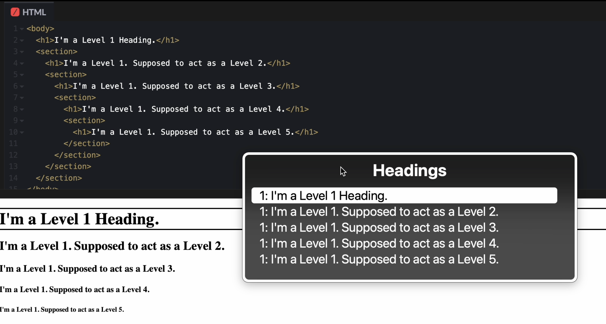
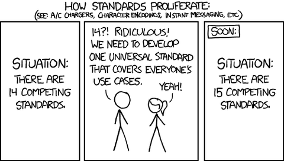

## Table of Contents

### 目次

## はじめに

Document Outline Algorithm は、文書の構造を動的に定義するためのアルゴリズムとして、長い間仕様に記載され、標準とされてきました。
しかし、このアルゴリズムはどのブラウザでも実装されておらず、実際には存在しないものでした。

本エントリは、このアルゴリズムが夢見ていた世界をその歴史から振り返り、Outline Algorithm の UA Style が Remove されようとしている今、その Intent が私たちに示唆するところを解釈していきたいと思います。

最後に、その後継として実現が検討されている Heading Level Concept についての現状も記します。

## Structure? - Skip it for now

Brian Kardell の主張（[Headings and the Seinfeld Pitch](https://bkardell.com/blog/On-Headings.html)）を拝借するのであれば、HTML は当初「フラットな構造のマークアップ言語」として設計されました。

例えば、初期のHTMLでは、特に段落(`<p>`)などの特定要素については、閉じタグが省略可能でした。これは、HTMLの起源である GML というマークアップ言語の影響によるものとされています。（実際には GML は h0-6 で、今のレベルになったのは後継の SGML から）

> From these rules, it may be inferred that we do not need to mark the ends of stanzas or lines explicitly. From rule 2 it follows that we do not need to mark the end of the title---it is implied by the start of the first stanza. Similarly, from rules 3 and 1 it follows that we need not mark the end of the poem: since poems cannot occur within poems but must occur within anthologies, the end of a poem is implied by the start of the next poem, or by the end of the anthology.
>
> ー [Guidelines for Electronic Text Encoding and Interchange (TEI P3)](https://quod.lib.umich.edu/cgi/t/tei/tei-idx?type=HTML&rgn=DIV2&byte=83013)

閉じタグの省略を許容していたことは、当時のHTMLが文書を本質的に平面的な構造として捉えており、「”文書の構造” は見た目から読者が理解する ”視覚的な構造” にのみ依存していた」ことに由来するひとつの特徴と言えます。閉じタグ省略は、 [HTML 1.0](https://www.w3.org/MarkUp/draft-ietf-iiir-html-01.txt) や [RFC 1866（HTML 2.0仕様）](https://datatracker.ietf.org/doc/html/rfc1866)でも確認できます。

大きなフォントのテキストを見れば「見出し」と認識し、その後に続く通常サイズのテキストを「その見出しに属する本文」と理解してもらうことのみを達成できれば良かったわけです。
極端な例だと、実際には見出しではない要素を、見た目上は見出しのように表示させることができれば、何の問題もありませんでした。

## Structure is _CRUCIAL_ for the Modern Web

「見た目から受け取る情報」から構築される「視覚的な Semantics」が、「構造的な Semantics」と必ずしも一致しないことは、HTML の黎明期では問題にはなりませんでした。しかし、現代の Web が DOM を中心とした ”構造的な Document Model” へと進化し、DOM を利用した展開が進むにつれて、そうはいかなくなります。

HTML の黎明期では考慮の余地がなかった、アクセシビリティツリーや検索エンジンなどの **”プログラム的な利用における構造解釈の重要性”** が現代の Web では表面に現れ、これは DOM 構造に強く依存します。私たちが「視覚的な Semantics」と「構造的な Semantics」の間に不整合が生じることは、避けなければなりません。

こうした事情により、見出し要素を ”セマンティックに” 利用してもらうことが、喫緊の課題になりました。

## The Birth of Utopia - Defining Structural Content

HTML Headings は、ネストされた DOM 構造において、ネストに相当した見出しレベルを持つことが推奨されます。<br />
しかし、`<ol>` 中の `<li>` などとは異なり、文書のネスト構造を見出しレベルに自動反映する仕組みは存在しません。見出しレベルの適切なハンドリングは、完全に開発する側に委ねられています。

その「見出しレベルの自動ハンドリング」を実現するために考案されたのが、Sectioning であり、Document Outline Algorithm です。

### Sectioning & Document Outline Algorithm

Document Outline Algorithm は、2007 年の TPAC における HTML5 の仕様の議論過程で初めて提案があったとされています。

- [TPAC 2007: Agenda for the W3C Combined Technical Plenary / Advisory Committee Meeting](https://www.w3.org/2007/11/07-TechPlenAgenda.html)

この HTML5 で導入された Document Outline Algorithm は、文書を `<section>` や `<article>` などといった [Sectioning Root](https://web.archive.org/web/20220305000915/https://html.spec.whatwg.org/multipage/semantics.html#sectioning-root) または [Sectioning Content](https://web.archive.org/web/20220305000915/https://html.spec.whatwg.org/multipage/dom.html#sectioning-content-2) Element で分割（俗に ”Sectioning” ）することなどで、 ”Outline” という「Heading を持った Section で構成される枠」を生成するものでした。<br />

当時の仕様によると、Sectioning は主に以下の場合に行われます。

- `<section>` や `<article>` などの Sectioning Content Element を使用して **Sectioning** する場合
- h1-6 の見出し要素を使用して作成された、「**暗黙のセクション**」を使用する場合
- **`<hgroup>` 要素**を使用してグループ化したセクションの見出しを使用する場合

この Sectioning を利用して階層構造を決定するアルゴリズムが、実に「Document Outline Algorithm」です。

Outline Algorithm の登場で、「フラットな構造」を基本としていた HTML に、**階層構造を表現する**という画期的なアイディアが持ち込まれることになります。

> The outline for a sectioning content element or a sectioning root element consists of a list of one or more potentially nested sections. A section is a container that corresponds to some nodes in the original DOM tree. Each section can have one heading associated with it, and can contain any number of further nested sections. The algorithm for the outline also associates each node in the DOM tree with a particular section and potentially a heading.
>
> 4.4 Sections — HTML 5.1 Nightly <https://web.archive.org/web/20121214011658/http://www.w3.org/html/wg/drafts/html/master/sections.html#outlines>

_「Subsequent headings of equal or higher rank start new (implied) sections, headings of lower rank start implied subsections that are part of the previous one. (同等以上のランクの見出しは、新しい（暗黙の）セクションを開始し、よりランクの低い見出しは、前のセクションの一部である暗黙のサブセクションを開始する) 」_
<br /> ー Document Outline Algorithm を含む Sectioning Contents により、 HTML5.1 では当初、見出し要素（h1-6, `<hgroup>`）の順序は重要ではない（意訳）と述べられていました。

> Sections may contain headings of any rank, but authors are strongly encouraged to **either use only h1 elements**, or to use elements of the appropriate rank for the section's nesting level.
>
> セクション内には任意のランクを含めることができますが、著者は**h1 要素のみを使用するか**、セクションのネストに応じたランクの見出しを記述することを推奨します。
>
> 4.3 Sections — HTML 5.1 Nightly <https://web.archive.org/web/20121214011658/http://www.w3.org/html/wg/drafts/html/master/sections.html#headings-and-sections>

例えば、以下のようなマークアップは Sectioning で正とされます。 「as-is」のようなマークアップをしても、「to-be」で示した Heading Level で支援技術に伝わるというのが、Sectioning と Outline Algorithm の主たる産物です。

```html
<!-- as-is -->
<body>
  <h4>Apples</h4>
  <p>Apples are fruit.</p>
  <section>
    <h2>Taste</h2>
    <p>They taste lovely.</p>
    <h6>Sweet</h6>
    <p>Red apples are sweeter than green ones.</p>
    <h1>Color</h1>
    <p>Apples come in various colors.</p>
  </section>
</body>

<!-- to-be -->
<body>
  <h1>Apples</h1>
  <p>Apples are fruit.</p>
  <section>
    <h2>Taste</h2>
    <p>They taste lovely.</p>
    <section>
      <h3>Sweet</h3>
      <p>Red apples are sweeter than green ones.</p>
    </section>
  </section>
  <section>
    <h2>Color</h2>
    <p>Apples come in various colors.</p>
  </section>
</body>
```

これによって `<section>` 内では `<h1>` から始めても良く、「全部 `<h1>` でも OK じゃない？ ブラウザが全部自動でレベル付けしてくれるなら、むしろ Author が変にいじる必要ないのでは・・・？」といった都市伝説が広まりました。

- [The Truth About Multiple H1 Tags in the HTML5 Era | Envato Tuts+](https://webdesign.tutsplus.com/the-truth-about-multiple-h1-tags-in-the-html5-era--webdesign-16824a)
- [`<h1>`–`<h6>`: The HTML Section Heading elements - HTML: HyperText Markup Language | MDN](https://developer.mozilla.org/en-US/docs/Web/HTML/Reference/Elements/Heading_Elements#avoid_using_multiple_h1_elements_on_one_page)

Sectioning と Outline Algorithm が登場したことにより、我々は「見出しレベルを自動調整する」、という夢のような世界を手に入れたように思えました。

## "The Algorithm" was only fiction

ブラウザはこの「夢」を全く具現化しなかったわけではありません。

`<section>` や `<article>`、`<nav>` といった Sectioning Content Element を実装し、Section のネストレベルに応じた UA Style を提供しました。
これによって、Section のネストが深くなるほど `margin` と `font-size` が小さくなるようなスタイルが適用され、**見た目上は**「見出しレベルが自動調整」されるようになりました。

<p class="codepen" data-height="300" data-default-tab="html,result" data-slug-hash="Pwozwve" data-pen-title="Untitled" data-user="sakupi01" style="height: 300px; box-sizing: border-box; display: flex; align-items: center; justify-content: center; border: 2px solid; margin: 1em 0; padding: 1em;">
  <span>See the Pen <a href="https://codepen.io/sakupi01/pen/Pwozwve">
  Untitled</a> by saku (<a href="https://codepen.io/sakupi01">@sakupi01</a>)
  on <a href="https://codepen.io">CodePen</a>.</span>
</p>
<script async src="https://public.codepenassets.com/embed/index.js"></script>

<br />

しかし、Document Outline Algorithm は仕様上は存在しながらも、なかなかブラウザに実装されない「机上の空論」状態が続きます。<br />
故に、以下のように Sectioning を駆使したマークアップをしても、Outline Algorithm 自体は実装されていないので、支援技術には伝わりません。


_Sectioning を用いたマークアップでも、アクセシビリティツリーには露出されない_

この空論を前提としたマークアップが現実世界に俄かに広がってしまうことは、防がなければなりません。さもなければ、Sectioning Contents の作り出す「見た目（視覚的な構造）」と実際の「セマンティクス構造」の間に不一致が生じてしまう。<br />
それゆえ、「セマンティクス構造」を見た目に合わせてもらう方向で解決しようと、W3C では、Sectioning Content Element と組み合わせて使う場合の見出し要素レベルの重要性の主張や、仕様から Document Outline Algorithm を前提とした記述を削除する議論が繰り返されました。

- [revisiting heading advice from Steve Faulkner on 2014-01-05 (<public-html@w3.org> from January 2014)](https://lists.w3.org/Archives/Public/public-html/2014Jan/0004.html)
- [Do not recommend using nested sections with h1 · Issue #169 · w3c/html](https://github.com/w3c/html/issues/169)

> Sections may contain headings of any rank, and authors are strongly encouraged to use headings of the appropriate rank for the section’s nesting level.
>
> セクション内には任意のランクを含めることができますが、著者は ~h1 要素のみを使用するか~、セクションのネストに応じたランクの見出しを記述することを推奨します。
>
> 4.3 Sections — HTML 5.1 Nightly <https://web.archive.org/web/20131223104911/http://www.w3.org/html/wg/drafts/html/master/sections.html#headings-and-sections>

そして、HTML5.2 では、明示的に、 Outline Algorithm を前提としないよう、警告が記されます。

> **⚠Warning!** There are currently no known native implementations of the outline algorithm in graphical browsers or assistive technology user agents, although the algorithm is implemented in other software such as conformance checkers and browser extensions. Therefore the outline algorithm cannot be relied upon to convey document structure to users. Authors should use heading rank (h1-h6) to convey document structure.
>
> ー [HTML 5.2: 4.3. Sections](http://w3c.github.io/html/sections.html#creating-an-outline)

しかし、この間は HTML の標準が W3C の HTML5.x から WHATWG の Living Standard に変遷していった期間でもあり、Living Standard になる段階でこの注意書きが削除されてしまっていました。

- [4.3.11.1 Creating an outline | HTML Standard](https://web.archive.org/web/20220326144219/https://html.spec.whatwg.org/multipage/sections.html#outlines)

それに対して [Steve Faulkner](https://github.com/stevefaulkner) が 2015 年に Issue を立て、Living Standard の仕様から Outline Algorithm に関して誤解を招く記述を削除する PR を提出し、これが約 7 年間も議論されることになります。
WHATWG での議論は、仕様と矛盾した警告を載せるのではなく、アルゴリズム自体を消すか実装するかの問題になっており、これが議論を難航させる原因になったのだと思います。

- [Suggest adding a warning about outline algorithm · Issue #83 · whatwg/html](https://github.com/whatwg/html/issues/83#issuecomment-1089073624)

:::note{.memo}
📝 [Using HTML sections and outlines - Developer guides | MDN](https://developer.mozilla.org/en-US/docs/Web/HTML/Reference/Elements/Heading_Elements)

MDN には掲載されているので、Living Standard 時代でもそれなりに周知されてはいたのだと思いますが......
:::

## Web Standards Fantasy 🧚

「Outline Algorithm は一向に実装されないが、Structural なコンテンツは現代の Web にとって欠かせない。ならば、別の手段で Structural な意味を HTML に持たせることはできないか？」
として考えられた提案が存在します。

それが、`<h>` や、Heading Levels です。

### Over 34 year's old, yet brand-new: `<h>`

`<h>` というアイディア自体は、実は [Tim Berners-Lee](https://x.com/timberners_lee) が Web を始めたばかりの 1991 年から存在したものでした。

> I would in fact prefer, instead of `<H1>`, `<H2>` etc for headings [those come from the AAP DTD] to have a nestable `<SECTION>..</SECTION>` element, and a generic `<H>..</H>` which at any level within the sections would produce the required level of heading.
>
> ー [www-talk from September to October 1991: Re: status. Re: X11 BROWSER for WWW](https://lists.w3.org/Archives/Public/www-talk/1991SepOct/0003.html)

`<h>` は、既に実装済みの Sectioning Content Elements と組み合わせ、**Outline Algorithm によって**、**Section のコンテキストに応じた**見出しレベルを自動的に決定するために提案された要素です。

```html
<section>
  <h>I can be any Level depending on the section context!</h>
  <p>paragraph</p>
</section>
```

2004 年の XHTML2.0 の仕様にはこれが含まれることになりますが、最終的に後方互換性を捨てた XHTML2.0 では、それ以外の Headings を deprecated 候補とし、
代わりに Sectioning Content Elements と `<h>` を用いて、見出しレベルの設定を UA 側に委ねる状態にした時期すらありました。

- [XHTML Block Text Module](https://web.archive.org/web/20030621072307/http://www.w3.org/TR/xhtml2/mod-block-text.html#sec_8.5.)

しかし、結局 h1-6 は残されたままで、それどころか XHTML 2.0 自体も放置され、謎だらけのまま終わってしまいます。<br />
その後、HTML5 でも Document Outline Algorithm の問題を解決するもののひとつとして、 `<h>` の追加が提案されることになりますが、
**これは本質的な問題への解となる提案ではありませんでした。**

- [Add `<h>` element · Issue #774 · w3c/html](https://github.com/w3c/html/issues/774)
- [Do not recommend using nested sections with h1 · Issue #169 · w3c/html](https://github.com/w3c/html/issues/169#issuecomment-210681765)

もちろん、`<h>` が解決しようとしていたことは他にもあったように読み取れますが、HTML として ”課題” だったのは「Outline Algorithm が実装されないこと」だったのに、
結果として出た ”解決策” は「Outline Algorithm を利用した新規方法」という、自己矛盾の典型とも言えるものでした。
これに関しては、[Jake Archibald](https://github.com/jakearchibald/) が自身のブログで詳細に説明しています。

<https://jakearchibald.com/2017/do-we-need-a-new-heading-element/>

### The Imaginary Heading Level Concept

今度は、「Outline Algorithm で Outline を生成すること」ではなく「Sectioning Content 内の見出しレベルを調整すること」に焦点が当てられました。
それが、[Anne van Kesteren](https://annevankesteren.nl/about) を中心に動きのあった 「Heading Level Concept」 です。

Anne は 過去（2014年）の[James Craig の主張](https://www.w3.org/Bugs/Public/show_bug.cgi?id=25003#c12)をきっかけに、Heading Level に関する [Polyfill](https://github.com/annevk/html-heading-level-polyfill) を作成します。
そして、このコメントを皮切りに、滞り気味だった Outline Algorithm 廃止の議論が再燃していくことになります。

<https://github.com/whatwg/html/issues/83#issuecomment-359871505>

この Polyfill のアルゴリズムは非常にシンプルで、`<h1>` か `<hgroup>` の Sectioning Content をたどり、ネストされる毎にレベルを加算して `aria-level` 属性に設定するというものです。

```js
// https://github.com/annevk/html-heading-level-polyfill/blob/main/polyfill.js
function determineLevel(el) {
  let level = 1;
  // Arguably the parentNode being null check can be removed as it will never be null when this and
  // the function below are run on a document, as is the case.
  //
  // This is "sectioning content" and "sectioning roots"
  while (
    el.parentNode &&
    (el = el.parentNode.closest(
      "article,aside,nav,section,blockquote,details,dialog,fieldset,figure,td"
    ))
  ) {
    level += 1;
  }
  return level;
}
```

Outline Algorithm という机上の空論を主張し続けるのではなく、 ”プログラム的な利用における構造解釈の重要性” という今の Web が、支援技術を利用するユーザが、
喫緊で必要としているものにアプローチするという点で、Heading Level Concept は非常に筋の通った提案だったように思います。

Heading Level Concept の特徴を仕様の [PR](https://github.com/whatwg/html/pull/3499) を元にまとめると、以下のようなものだったことがわかります。

- Heading 要素と Heading Level Concept を導入
- Outline Algorithm を Document Headings Concept に置き換え
- Document Headings は見出しレベルをスキップせず、見出しレベル 1 から始まることを要求
- `:heading` 疑似クラスを導入
- `:heading(level)` 関数型疑似クラスを導入
- Section Concept を廃止（h1/hgroup の見出しレベルに影響を与える場合を除く）
- Section Roots を廃止

現代の Web が抱える課題にニーズが合致しており、「これぞ顧客が本当に求めていたもの」感がありますが、悲しいことに、この構想は後方互換の問題により、実装が頓挫してしまいます。

> Unfortunately, this was not a success (too many h1s got adjusted to be h2s) so we've removed this code and abandoned this particular plan for dealing with heading levels in HTML: <https://bugzilla.mozilla.org/show_bug.cgi?id=1590366>.
>
> ー [Intent to prototype: heading levels](https://groups.google.com/g/mozilla.dev.platform/c/SdnMKYwWxzU/m/U-v_b8c2BwAJ?pli=1)

[#83 (comment)](https://github.com/whatwg/html/issues/83#issuecomment-531520522)
[#3499 (comment)](https://github.com/whatwg/html/pull/3499#issuecomment-544876110)
[#3499 (comment)](https://github.com/whatwg/html/pull/3499#issuecomment-577866180)

---

とはいえ、Heading Level Concept によって、長年滞っていた Outline Algorithm の議論にメスが入り、これが Sectioning の概念を廃止する PR につながりました。

- [replace current outline algorithm with one based on heading levels by stevefaulkner · Pull Request #7829 · whatwg/html](https://github.com/whatwg/html/pull/7829)

### Three Obsolete Approaches

Outline Algorithm を使用から削除するまでに辿った3つのアプローチを整理しておきます。

1. **Flat Content**: フラットな構造のマークアップ言語。元来の HTML の形であり、Outline Algorithm が消滅した今もこれにあたる。
2. **Document Outline Algorithm**: 机上の空論。Sectioning や「暗黙のセクション」、`<hgroup>`要素によって、見出しレベルを自動調整する。
3. **Heading Level Concept**: Outline Algorithm を Document Headings Concept に置き換え、Sectioning Content Element のネストに応じた見出しレベルを自動調整しようとしたもの。

Brian Kardell が以下に動作する Demo を用意しているので、ぜひ参考にされたいです。

- [Use case | bkardell.com](https://bkardell.com/outline/compare.html)



:::note{.message}
Oh, there's a forgotten `hgroup` 🫢

<details>

<summary>さて、ここまでの話で何度か出てきたにも関わらず何も説明していなかった、hgroup について簡単に触れておこうと思います。</summary>

<br />

`<hgroup>` は、見出し要素をグループ化するための要素です。この要素は HTML5.1 で廃止されたものの、
WHATWG Living Standard では 2025年現在に至るまで、その根を強く張りつづけています。
とはいえ、これは Outline Algorithm のためにあったような要素なので、現在は、というか Outline Algorithm が実装されたことがなかった今、
[元来の仕様](https://web.archive.org/web/20211207033850/https://html.spec.whatwg.org/multipage/sections.html#the-hgroup-element)通りに機能していたことは一度もなかった要素だといえるでしょう。

---

`<hgroup>` は Outline Algorithm によって、意図しないサブセクションが生成されるのを防ぐために考案されました。

```html
<!-- hgroup は、見出し（h2など）がOutlineアルゴリズム内で独立したセクションを作成するのを防ぎ、代わりにサブ見出しとしてグループ化して表示する
 これにより複数の見出し要素を論理的に一つのまとまりとして扱える -->
<hgroup>
  <h1>The reality dysfunction</h1>
  <h2>Space is not the only void</h2>
</hgroup>
```

これは Outline Algorithm 関係なく、巷では、「小見出しを表現する用途」で使われることがしばしばあります（大抵は `<div>` が使われると思いますが）。
これが Outline Algorithm 時代に期待されていた本来の市民権を得るとなると、**今まで複数認識された見出しが単一の見出しとして扱われます。**

特に、Anne が提案した Heading Level Concepts は `<hgroup>` と `<h1>` と同等に扱うアプローチでした。
要素に `role="heading"` と `aria-level="n"` を追加し、`<h1>` の見出しと同じように ARIA で調整するといった具合です。
つまり、下記のような `<hgroup>` だと、見出しレベル 1 として扱われることになります。

```html
<!-- ↓ role="heading", aria-level="1" ↓ -->
<hgroup>
  <h2>This is Level 1 like Heading.</h2>
  <h3>This is Level 1 like Heading as well.</h3>
</hgroup>
```

`<h1>` は Sectioning の肝となる要素で、それが `<hgroup>` に入るケースがある以上、`<h1>` 相応の扱いをすることは肯けますが、
それでは「`<h1>` 以外の小見出し」の表現ができません。
`<hgroup>` の扱いについては、様々な意見が交わされ、論点は「”`<h1>` 以外の小見出し” をどう解釈するか」でした。

- [Alternative take on hgroup · Issue #5002 · whatwg/html](https://github.com/whatwg/html/issues/5002)
  - 子に `<h1>` があれば `<hgroup>` そのものを `<h1>` として扱い、それ以外はそれぞれの見出しレベルを保つ。
  - `<hgroup>` そのものを無視する。中の見出しと小見出しを含めてそのままにしてしまう。
  - 子から最上位の見出しを `aria-level="n"` で調整し、他の見出しに `role="generic"` を付ける。

特に最後の項目は、メインの見出しレベルのみに調整が及び、後方互換性のメリットがあるため、前向きに捉えられていました。

```html title={hgroup 内の小見出しを表現する方法}
<!-- as-is -->
<hgroup>
  <h2>Primary text</h2>
  <h3>a subheading</h3>
  <p>I'm not supposed to be here</p>
  <h3>Another section of content</h3>
  <p>Clearly I don't validate my code</p>
</hgroup>

<!-- to-be -->
<hgroup>
  <h2 role="heading" aria-level="2">Primary text</h2>
  <h3 role="generic">a subheading</h3>
  <p>I'm not supposed to be here</p>
  <h3 role="generic">Another section of content</h3>
  <p>Clearly I don't validate my code</p>
</hgroup>
<!-- https://github.com/whatwg/html/issues/5002#issuecomment-542647846 -->
```

こうした過去がありましが、結局 [Outline Algorithm が頓挫したタイミング](https://github.com/whatwg/html/pull/7829/)で `<hgroup>` の仕様も塗り替えられ、
現在は「任意の**ひとつの** h1-6 とひとつ以上の`<p>`を包含可能な要素」として振る舞うよう規定されています。
これにより、過去に議論されていた「”`<h1>` 以外の小見出し” をどう解釈するか」問題は仕様で握られたことになります。

> The hgroup element represents a heading and related content. The element may be used to group an h1–h6 element with one or more p elements containing content representing a subheading, alternative title, or tagline.
>
> ー [4.3.7 The hgroup element | HTML Standard](https://html.spec.whatwg.org/multipage/sections.html#the-hgroup-element)

- [Obsolete `<hgroup>` by sideshowbarker · Pull Request #6462 · whatwg/html](https://github.com/whatwg/html/pull/6462)

</details>
:::

こうして、長い間多くの標準側の人々の注目の的となっていた Outline Algorithm は、それに関連した記述も含めて、2022年に HTML Living Standard から削除され、
「Outline Algorithm を利用して Sectioning Content Element のネストに応じた見出しレベルを自動調整する」という夢は夢で終わってしまうこととなります。

ところが、それでもなお、Outline Algorithm の血を引く仕様と実装がまだ Web には残っていました。

## Stop doing sh!t styling in sections

Outline Algorithm は実装されなかったものの、ブラウザは Sectioning Content Element 内の Heading Element に対して、
ネストレベルに応じた`font-size`と`margin`を適用するスタイルを実装していました。
これにより、**見た目上は**「見出しレベルを自動調整」されているように見えたままでした。

```css
In the following CSS block, x is shorthand for the following selector: :is(article, aside, nav, section)

@namespace "http://www.w3.org/1999/xhtml";

x h1 { margin-block: 0.83em; font-size: 1.50em; }
x x h1 { margin-block: 1.00em; font-size: 1.17em; }
x x x h1 { margin-block: 1.33em; font-size: 1.00em; }
x x x x h1 { margin-block: 1.67em; font-size: 0.83em; }
x x x x x h1 { margin-block: 2.33em; font-size: 0.67em; }
```

[15.3.6 Sections and headings | HTML Standard](https://html.spec.whatwg.org/multipage/rendering.html#sections-and-headings)

長年、Sectioning Contents の作り出す「見た目（視覚的な構造）」と実際の「セマンティクス構造」の間に不一致を生み出していたことが課題だったことは変わりありません。
ただこれまでは、それを「セマンティクス構造」を見た目に合わせる方向で解決しようと、Outline Algorithm 実装の議論や Anne の Heading Level Concept が提案されてきました。<br />
しかし、それらが頓挫し、Outline Algorithm が仕様から削除され、再び見た目とセマンティクスに不整合が生じたままになっていました。
無論、この不整合による課題は、以前 Outline Algorithm を議論していた頃と同じものです。

- 視覚的には階層化された見出しに見えるが、アクセシビリティツリーでは全て同じレベルの `<h1>` として解釈される
- 開発者が「全部 `<h1>` でも OK」という誤解を持ったまま実装する

もし、Outline Algorithm の夢が実現していたら、この UA Style は適切だと言えたでしょう。しかし、Outline Algorithm が消滅した今、残されたのは「見た目（視覚的な構造）」をセマンティクス構造に合わせる方向での解決策であり、それが今回の変更にあたります。

- [Remove UA style for h1-h6 in section (et. al.) and hgroup · Issue #7867 · whatwg/html](https://github.com/whatwg/html/issues/7867)
- [Remove UA styles for h1 in article, aside, nav, section by zcorpan · Pull Request #11102 · whatwg/html](https://github.com/whatwg/html/pull/11102)
- [Intent to Deprecate and Remove: Deprecate special font size rules for H1 within some elements](https://groups.google.com/a/chromium.org/g/blink-dev/c/OWd80XhwHrI)
- [Intent to unship: UA styles for h1 in article, aside, nav, section](https://groups.google.com/a/mozilla.org/g/dev-platform/c/CzG_pVa7pws/m/Ab3Bwsg2BQAJ)

2025年3月から、Firefox と Chrome は Sectioning 内の `<h1>` に対する特別な UA Style の段階的な削除を開始しました。変更の影響と対応は、以下のブログが参考になります。

- [Default styles for h1 elements are changing | MDN Blog](https://developer.mozilla.org/en-US/blog/h1-element-styles/)

この Intent が出た今、ようやく Document Outline Algorithm 最後の痕跡が消え去ろうとしています。

## We've been living in a Flat Document Structure the whole time at the end

[CERN で Tim Berners-Lee が HTML を開発した当初から存在](https://info.cern.ch/hypertext/WWW/MarkUp/Tags.html#15)し、いわば HTML Element の初期メンのブルーくらいのポジションであった Heading。
にも関わらず、30 年以上も仕様と実装と顧客のニーズが交わることなく、幾度となく誤解や誤実装を生み続けてきました。

Outline Algorithm が実装されなかった理由がどこかに明記されていたわけではありませんが、関与した人物のコメントを見るに、単にその実装の複雑さが唯一かつ最大の理由だったのかなと思います。

> Determining the level of any given heading requires traversing through its previous siblings and their descendants, its parent and the previous siblings and descendants of that, et cetera. That is too much complexity and optimizing it with caches is evidently not deemed worth it for such a simple feature.
>
> ー Anne van Kesteren

> - The accessibility part was given low priority & no one got round to it.
> - The outline algorithm significantly impacts performance.
> - By the time browsers got round to it, developers were using sections incorrectly, and adding the outline would have a negative impact on users.
>
> ー Jake Archibald

---

ところで、Outline Algorithm を取り巻く 30 余年の中で、何がどう変わったんでしょうか？

30 年以上前に 「フラットなマークアップ」として設計された HTML の本質は、結局のところ今も変わっていません。
我々が使い続けていたのは、常にフラットな文書構造だったという事実が残っただけです。

では、Outline Algorithm を失った今、我々は何をすべきなのでしょうか？
今回の UA Style Removal 勧告は、「"セマンティックに” 正しい HTML を書くこと」の重要性を再確認させてくれるものだと思います。

- 見出しレベルを適切に使用する：h1 から順に階層的に使い、レベルをスキップしない
- 見た目ではなく構造で考える：CSSで見た目を調整するのは自由だが、まずは意味的に正しい構造を構築する
- アクセシビリティを念頭に置く：スクリーンリーダーなどの支援技術が正しく解釈できる文書構造の構築をする

Outline Algorithm に関する一連の歴史的背景は、Web 標準の発展が必ずしも直線的には進まず、時に優れたアイデアでさえも即座に採用されないことをまざまざと表しています。

## [WIP!] Mechanism for opting-in for Heading Level Concept

:::note{.message}
この章で紹介する仕様は現在策定段階であり、これから変更される可能性があることに注意してください
:::

Outline Algorithm 廃止の過程で提案された Heading Level Concept は後方互換性の問題により頓挫したかのように思えましたが、実はその議論中で Heading Level Concept を実現する新たな解決策がコメントされていました。それが **`headinglevelstart`** です。

- [#3499 (comment)](https://github.com/whatwg/html/pull/3499#issuecomment-544745912)

`headinglevelstart`は、Heading Level Concept が抱えていた後方互換性の問題を、属性値によるオプトインで解決しようとするものです。この提案コメントは非常に積極的に捉えられ、Anne の Heading Level Concept を実現する手段として切り出されて提案されます。

- [Consider adding a `headinglevelstart` attribute · Issue #5033 · whatwg/html](https://github.com/whatwg/html/issues/5033)

### "additive model" (where multiple containers accumulate) vs "absolute model" (find the nearest and use that value)

`headingstart`は、提案当初、「直近の`headingstart`のみを見て、子要素の Heading Level を決定する」(**"absolute model"**: 直近の `headinglevelstart` を見て絶対的に値が決め打ちされる) という設計でした。

```html
<body>
  <h1>Heading Level 1</h1>
  <h2>Heading Level 2</h2>
  <div>
    <article headinglevelstart="3">
      <h1>Heading Level 3</h1>
      <h2>Heading Level 4</h2>
      <div headinglevelstart="1">
        <h2>Heading Level 1</h2>
        <h3>Heading Level 2</h3>
        <h3>Heading Level 2</h3>
        ...
      </div>
    </article>
  </div>
</body>

// ref: https://github.com/whatwg/html/issues/5033#issuecomment-1735089196
```

これは、`<ol start="6">`と指定して、`<li>`が 6 から始まるようにハンドリングされるようなものです。
つまり、`headinglevelstart`を含む要素がネストされていても、そのネストの継承を考慮せず、**直近の親要素の `headinglevelstart`属性値のみを参照して Heading Level が考慮されます**。

しかし、議論中の Jake のコメントから、「`headinglevelstart`のレベルは累積加算すべきではないか」という話になります。例えば、以下のように`headinglevelstart`がネストされた場合、「World」の部分は、ネストされた`headinglevelstart`の値全てを加算して Heading Level 3 とするのが妥当ではないかという主張です。

```html
<div headinglevelstart="2">
  <h1>Hello</h1>

  <div headinglevelstart>
    <h1>World</h1>
  </div>
</div>
```

> Where `<h1>`World`</h1>` would be level 3, since the auto value of `headinglevelstart` would be +1 of the parent `headinglevelstart`.
> <https://github.com/whatwg/html/issues/5033#issuecomment-1733292070>

これが、Heading Level を継承する(**"additive model"**: ネストされた `headinglevelstart` を累積加算して値を決める) 提案の発端となります。

Heading Level Concept を提案した [Anne の主張](https://github.com/whatwg/html/issues/5033#issuecomment-1733945754:~:text=If%20you%20add%20some%20kind%20of%20inheritance%20it%27s%20no%20longer%20really%20%22start%22%20semantics%20and%20we%20might%20also%20run%20into%20performance%20issues.%20I%20would%20suggest%20we%20start%20out%20really%20simple%20and%20if%20this%20is%20something%20we%20need%20to%20build%20upon%20we%20can%20consider%20it%20in%20a%20future%20iteration.)は、パフォーマンス問題への懸念から、"additive model" は避けた方が良いのではないか（そして "start" という命名も適切ではない）という意見が出て、初期の実装では "additive model" は実装せず、将来的に考慮するという主張でした。

しかし、"additive model" で実装しないとなると、例えば以下のマークアップでは見出し構造が h3 > h2 となって崩壊し、「ブラウザが見出しの自動調整をする」という本来の目的が損なわれてしまいます。

```html
<div headinglevelstart="3">
  <h1>Heading Level 3</h1>
  <div headinglevelstart="2">
    <h1>Heading Level 2 ?!</h1>
  </div>
</div>
// ref: https://github.com/whatwg/html/issues/5033#issuecomment-1738469735
```

[Tab Atkins](https://github.com/tabatkins) は、Heading Level Concept を実現するのであればレベルの累積加算は必須で、伴って、`headinglevelstart` の命名も変更すべきだと強く主張し続けます。

> I think if we don't do inheritance, it defeats the original point of the attribute, which is that you can include black-box HTML and have the headings Just Work. Without inheritance, if that black-box HTML includes uses headinglevelstart for its own reasons, then those double-nested headings will be broken relative to the outer page. That seems pretty bad?
> <https://github.com/whatwg/html/issues/5033#issuecomment-1736066647>

### `headinglevelstart` -> `headingoffset` & `headingreset` with `:heading`&`:heading(N)`

そんな中、[Keith Cirkel](https://github.com/keithamus) が "additive model" を取り入れた`headinglevelstart`の Prototype を Chromium に実装し、"additive model" を実装してもせずとも実装的には僅差（"additive model" で実装したからといって、大きくパフォーマンスを低下させることはない）と報告します。

> From an implementation standpoint either model is trivial (we tree walk, and we either stop at, or accumulate, on each node with the attribute).
> <https://github.com/whatwg/html/issues/5033#issuecomment-2049295979>

この Prototype を受けて、"additive model" の `headinglevelstart` が `headingoffset` と改名されて実装されます。

### Heading Level in Different UI Context - What about Modal Dialog?

ページ内の要素でありながら、別コンテキストとして表現したい UI 要素があります。

例えば、Modal Dialog は、太古の昔には [showModalDialog という同期 API が存在した](https://web.archive.org/web/20240610131102/https://dev.opera.com/blog/showmodaldialog/)り、Light Dismiss できなかったり、"Modal" というその名の通り、モードが異なるコンテキストでコンテンツを表示することが期待されている UI の代表です。

しかし、`headingoffset`の "additive model" だと、ページ内で「コンテキストに応じた Heading Level の調整」ができず、「コンテキストの切り替わり」をセマンティックに表現できません。

- [#5033 (comment)](https://github.com/whatwg/html/issues/5033#issuecomment-2104911322)

```html
<main headingoffset="0">
  <h1>Settings</h1>
  <section headingoffset="1">
    <h1>Account</h1>
    <!-- h2として解釈 -->

    <button onclick="openDialog()">Delete Account</button>

    <dialog id="confirmDialog">
      <!-- h2になってしまう (0+1+1) -->
      <h1>Confirmation</h1>
      <p>You cannot re-do this action. Do you want to proceed?</p>
    </dialog>
  </section>
</main>
```

こうした「ページ内で別コンテキストを持つ UI コンポーネント」に対処するため、見出しレベルをリセットする `headingreset` が導入されることになります。

```html
<dialog id="confirmDialog" headingreset>
  <h1>Confirmation</h1>
  <!-- `headingreset` があるため、h1として解釈される -->
  <p>You cannot re-do this action. Do you want to proceed?</p>
</dialog>
```

別コンテキストで表現したい UI 要素として、用途は Modal Dialog に限らず、例えばカルーセル内のスライドやタブパネルなど、UIの中で「独立したコンテキスト」を持たせたい場合に応用できそうです。

---

現時点での、`headingoffset`や`headingreset`を含む、一連の Heading Level Concept に関する仕様とアルゴリズムは以下で確認できます。

- [implement headingoffset & headingreset attributes by keithamus · Pull Request #11086 · whatwg/html](https://github.com/whatwg/html/pull/11086)

### Selecting Heading Level N in CSS

Heading Level Concept により、見出しレベルが h1~6 に限られなくなり、CSS でも「見出しレベル N の要素をセレクトする」必要が出てきます。（支援技術の実装との兼ね合いで、[N = 9 が現状での最大値とされている模様](https://github.com/whatwg/html/issues/5033#issuecomment-1725883623)ですが）

そのため、CSS 側では `:heading` および `:heading()` 疑似クラスの導入が検討されています。

- [CSS pseudo-selector for h1-h6? · Issue #1008 · w3c/csswg-drafts](https://github.com/w3c/csswg-drafts/issues/1008)
- [[css-selectors-5] add `:heading`, `:heading(An+B)` pseudo classes by keithamus · Pull Request #11836 · w3c/csswg-drafts](https://github.com/w3c/csswg-drafts/pull/11836)
- [[selectors] Adding a `:heading()` selector for headingoffset? · Issue #10296 · w3c/csswg-drafts](https://github.com/w3c/csswg-drafts/issues/10296)

---

以下に Demo を用意しました。`headingoffset`, `headingreset` attributes に関しては、Chrome Dev 136 以上のビルドで動作が確認できます。

- [Heading Level Concept | studio.sakupi01.com](https://studio.sakupi01.com/whatwg/headingoffset/)
- [5445406: Prototype 'headingoffset'/`headingreset` attributes on HTMLElement.](https://chromium-review.googlesource.com/c/chromium/src/+/5445406)

Outline Algorithm 亡き今、Heading Level Concept による見出しの自動調整へ、期待が高まります。

## Appeendix

- [Suggest adding a warning about outline algorithm · Issue #83 · whatwg/html](https://github.com/whatwg/html/issues/83)
- [replace current outline algorithm with one based on heading levels by stevefaulkner · Pull Request #7829 · whatwg/html](https://github.com/whatwg/html/pull/7829)
- [Roundup of Recent Document Outline Chatter | CSS-Tricks](https://css-tricks.com/roundup-of-recent-document-outline-chatter/)
- [The Truth about “The Truth About Multiple H1 Tags” — Adrian Roselli](https://adrianroselli.com/2013/12/the-truth-about-truth-about-multiple-h1.html)
- [The HTML5 Document Outline - TPGi](https://www.tpgi.com/html5-document-outline/)
- [What to do about the document outline? · Issue #33 · w3c/html](https://github.com/w3c/html/issues/33)
- [A decade + a year of heading backwards – HTML Accessibility](https://html5accessibility.com/stuff/2021/03/21/a-decade-a-year-of-heading-backwards/)
- [A decade of heading backwards by steve faulkner on CodePen](https://codepen.io/stevef/post/a-decade-of-heading-backwards)
- [Do we need a new heading element? We don't know - JakeArchibald.com](https://jakearchibald.com/2017/do-we-need-a-new-heading-element/)
- [Headings and the Seinfeld Pitch](https://bkardell.com/blog/On-Headings.html)
- [bkardell/outline](https://github.com/bkardell/outline)
- [Heading levels — Anne’s Blog](https://annevankesteren.nl/2019/10/heading-levels)
- [12 years beyond a HTML joke – HTML Accessibility](https://html5accessibility.com/stuff/2022/04/05/12-years-beyond-a-html-joke/)
- [There Is No Document Outline Algorithm — Adrian Roselli](https://adrianroselli.com/2016/08/there-is-no-document-outline-algorithm.html)
- [The Document Outline Dilemma | CSS-Tricks](https://css-tricks.com/document-outline-dilemma/)
- [Level Up Your Headings Game · Matthias Ott](https://matthiasott.com/notes/level-up-your-headings-game)
- [Why the HTML Outlining Algorithm was removed from the spec? the truth will shock you! | Bruce Lawson's personal site](https://brucelawson.co.uk/2022/why-the-html-outlining-algorithm-was-removed-from-the-spec-the-truth-will-shock-you/)
- [whatwg-headinglevelstart.pdf](https://github.com/whatwg/meta/files/12617290/whatwg-headinglevelstart.pdf)
- [HTML2.0 の仕様では閉じタグが必須でない要素が存在した e.g; `<!ELEMENT P     - O (%text)*>`](https://datatracker.ietf.org/doc/html/rfc1866)
