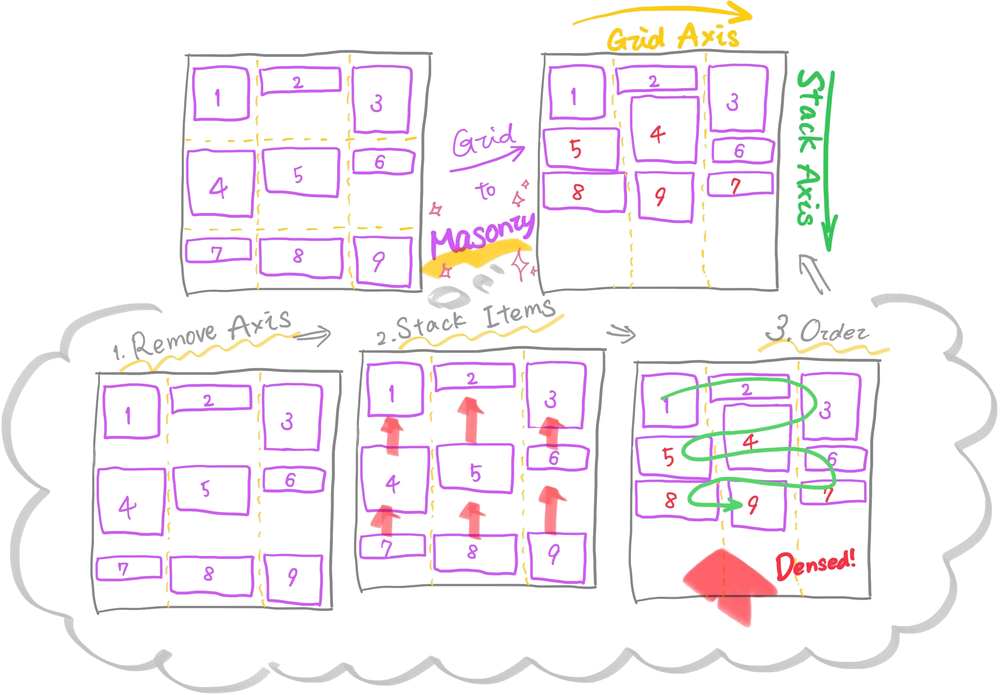
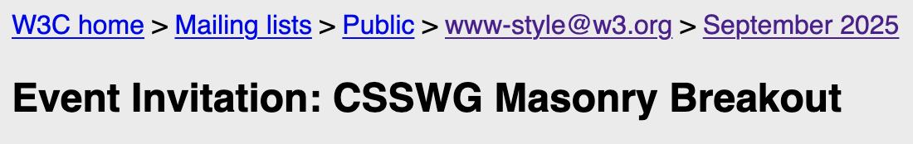
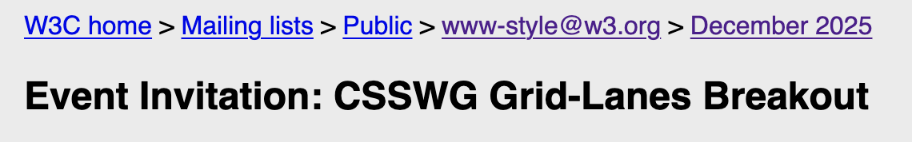
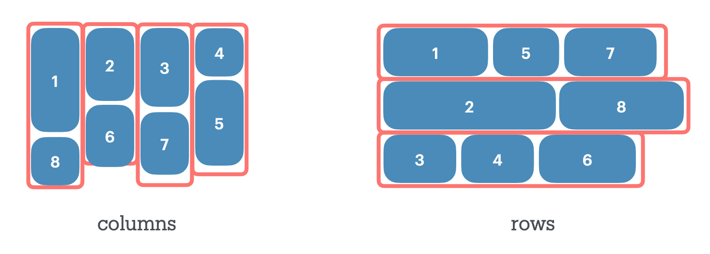
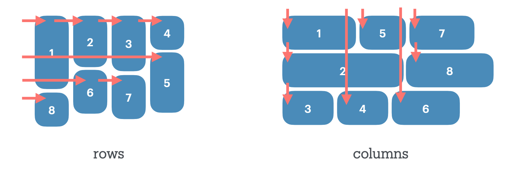

<link rel="preload" as="image" href="important.png" fetchpriority="high">

## Table of Contents

## はじめに

2025 年は、Pinterest に代表される「Masonry レイアウト」の仕様の策定が、大きな進展を見せた年だったように思います。

Grid 以降で初めて本格的に最重要概念の「レイアウト」に手を加えた提案として、我々にとっては無視し難いトピックの一つでありながら、CSS Masonry は議論が本格化してから比較的長期に続いているプロジェクトでもあります。

しかし、その議論の長期戦はあるべくして起こったものであり、そこから学び取れる示唆も少なからずあったと筆者は考えています。

今ここで一度何があったかを整理して理解した上で今後の動向を正しく追っていくために、ここにまとめを記します。

（※ 本エントリは「Masonry のそもそも」やユースケースを説明する趣旨ではないので紹介は割愛します。 既出の記事を参照ください。 e.g, ["What is masonry layout?" - Help us invent CSS Grid Level 3, aka “Masonry” layout | WebKit](https://webkit.org/blog/15269/help-us-invent-masonry-layouts-for-css-grid-level-3/)）

:::note{.message}
📝 Terminology

[CSS Grid Layout Module Level 3](https://www.w3.org/TR/css-grid-3/#masonry-model) で定義される Masonry レイアウトの用語を以下に示します。 今後の記事内でも使用するので、はじめに一度軽く紹介しておきます。

Pinterest のようなレイアウトは **Column Masonry**（Waterfall Layout）と呼ばれ、横方向に Masonry Item が流れ込み（Flow）、縦方向に積み上がる（Stack）レイアウトです。 一方、横方向に積まれるものは **Row Masonry**（Brick Layout）と呼ばれ、それぞれ以下の用語で説明されます。

<div style="display: grid; grid-template-columns: repeat(auto-fit, minmax(200px, 1fr)); gap: 16px; margin-block: var(--gutter-l);">
  <div></div>
  <div></div>
</div>

- **Masonry Container**: Masonry レイアウトのコンテンツを持つ Box。`display` 値で設定される親要素。
- **Masonry Item**: Masonry Container の直接の子要素。通常の Grid Item と同様に blockify(display が強制的に block レベル化) される。
- **Masonry Track**: Grid Axis 上の Row または Column で、全て等しい長さを持つ。 `grid-template-[columns | rows]` で定義される。
- **Stack Axis**: Grid Item が自由に積み重なる軸。Flex Layout のようにアイテムが流れ込む方向。
- **Grid Axis**: 事前定義された等しい長さの Masonry Track が存在する軸。通常の Grid Layout と同様の Track Sizing と配置が行われる。
- **Column Masonry** (Waterfall Layout, Modular Grids): Stacking Axis が Block 軸（縦方向）の Masonry レイアウト。Waterfall Layout。
- **Row Masonry** (Brick Layout, Columnar Grids): Stacking Axis が Inline 軸（横方向）のMasonryレイアウト。Brick Layout。


:::

## CSS Masonry を振り返る

今回の Masonry レイアウトの始まりは、以下の提案が WG に持ちかけられたときと捉えることにします。

- \[css-grid\]\[css-flexbox\] Pinterest/Masonry style layout support · Issue #945 · w3c/csswg-drafts
  - <https://github.com/w3c/csswg-drafts/issues/945>

当時、Grid Layout の第一人者である Rachel Andrew が、「Pinterest のようなレイアウトを CSS でやりたい」という開発者側の声を CSS WG に届けたのがきっかけだったようです。

### CSS Houdini Layout API

この提案が出たあたりは、ブラウザがまだサポートしていないレイアウト（Masonry 含む）は開発者自身で作れるようにする、CSS Houdini の Layout API が夢の技術として期待されていました。

- Intent to Implement: CSS Layout API
  - <https://groups.google.com/a/chromium.org/g/blink-dev/c/gVvtbIjE2J4/m/0KWy4Ew2CQAJ>
- CSS Layout API - Issue #224 - w3ctag/design-reviews
  - <https://github.com/w3ctag/design-reviews/issues/224>

しかし、 パフォーマンスや Houdini の成熟度の観点から、 Masonry は Gridの一部としてネイティブにサポートされるべき、 という方向へ話が流れることになります。

### Grid ベースとして黎明したネイティブ CSS Masonry / `grid-template-*: masonry;` & `masonry-auto-flow`

Layout API の文脈から外れて、 CSS Masonry の標準化作業が始まったのは、以下の Issue が最初でした。

- [css-grid] Masonry layout · Issue #4650 · w3c/csswg-drafts
  - <https://github.com/w3c/csswg-drafts/issues/4650>

「CSS Grid の**一軸を通常の Grid**（行や列がある）: **Grid Axis** とし、**もう一方の軸を Masonry**（行や列の概念がなく、詰めて配置）: **Stacking Axis** にする」というのが、 初期 Masonry レイアウトの考え方です。
よって、初期では **Grid（`display: grid | inline-grid`）をベースとしながら、 Masonry を有効化する**方法が提案されていました。軸を取り消すための `masonry` キーワードを `grid-template-[rows | columns]` へ追加し、これを指定すると Masonry にスイッチする提案です。



例えば、高さや幅が一定の Grid Axis（e.g, Columns）を `grid-template-columns` で定義し、高さや幅が一定でない Stacking Axis（e.g, Rows） には `masonry` （要素を敷き詰め）を指定すると、 Pinterest のようなレイアウトが実現できます。
加えて、 `masonry-auto-flow: [ pack | next ] || [definite-first | ordered ]` で、アイテムの積み上げ方を制御する案も出されていました。

これを最初に定義したドラフト（CSS Masonry Layout Module）が、 Wayback Machine で一件だけヒットしたため、記録として掲載しておきます。

- [CSS Masonry Layout Module](https://web.archive.org/web/20201101071822/https://raw.githack.com/mozilla/gecko-dev/master/layout/docs/css-grid-3/Overview.html)

もちろん文法は全く異なりますが、2025年現在の CSS Grid Layout Module Level 3 はこのドラフトに記載の概念をかなり踏襲していることが分かります。

実装としては、以下のようなものが想定されていました。

```html
<style>
.masonry {
  display: grid;
  grid: masonry / repeat(3, 2ch);
  /* ↑ same as below ↓ */
  /* grid-template-rows: masonry; */
  /* grid-template-columns: repeat(3, 2ch); */
  border: 1px solid;
  masonry-auto-flow: pack;
}

.item { background: rebeccapurple }
</style>
<div class="masonry">
  <div class="item">1</div>
  <div class="item">2</div>
  ...
</div>
```

このように、 `display` Grid をベースとして、 `grid-template-*` で Masonry にスイッチするというのが基本的な考え方でした。よって、ここからは便宜上、こうした Masonry 仕様を 「**Grid ベース**」 と表記します。

そして、[議論](https://github.com/w3c/csswg-drafts/issues/4650#issuecomment-713128263)の結果、この案は CSS Grid Layout Module Level 3 の一部として作業が進められていくことになります。

- Grid ベースの仕様
  - 2020年時点での [CSS Grid Layout Module Level 3](https://web.archive.org/web/20201101020912/https://drafts.csswg.org/css-grid-3/#masonry-auto-flow)

### Firefox でのフラグ付き実装と Safari TP での実装

これを受けて、 Firefox では 2020 年にフラグ（`grid-template-masonry-value`）付きで Masonry レイアウトが実装されていました。
この時点で実装されていたのは、 Grid ベース Masonry です。

- Intent to Prototype: CSS Masonry layout
  - <https://groups.google.com/g/mozilla.dev.platform/c/iBKhDXB89OA/m/3NZ_7UGjAAAJ>

その後、 Safari TP でも実装が入ることになります。ただ、これが Stable に落ちてくることはなかったということになります。

- Release Notes for Safari Technology Preview 163
  - <https://webkit.org/blog/13839/release-notes-for-safari-technology-preview-163/>
  - Masonry Layout
    - Enabled Masonry layout by default (258694@main, 259308@main)
    - Added the initial support for `align-tracks` and `justify-tracks` (258544@main)

---

ここまでで、Grid ベース として Masonry の仕様策定が進み、 Firefox と Safari TP の 2 ブラウザで実装が進んでいる状態でした。「このまま Grid Level 3 としてリリースされる」と思われていた矢先、風向きが変わることになります。

### 「Grid ベース」 か 「`display: masonry`」 か - “Just Use Grid” or “New Masonry Layout”?

2023 年 7 月、Chrome の Ian Kilpatrick が、Grid ベースではなく独立した `display: masonry` を提案する Issue を立ち上げました。

- Alternative masonry path forward · Issue #9041 · w3c/csswg-drafts
  - <https://github.com/w3c/csswg-drafts/issues/9041>

提案された構文は以下のようなものです。

```css
display: masonry;
masonry-template: repeat(auto-fill, auto);
masonry-direction: column-reverse;
masonry-span: 2;
masonry-threshold: 2px;
```

提案の背景としては、Grid と Masonry の Sizing 計算の違いにありました。
Grid は子要素を 2D Grid に配置してからサイズを決定します。つまり、詰めるモノも詰める場所も決まっているので、 問題なく内在サイズを計算できます。一方 Masonry は詰める場所が詰めるモノのサイズに依存し、詰めるモノの内在サイズは詰める場所によって決まるというニワトリタマゴの状態になり得ます。

:::note{.message}
\> There are potential workarounds to deal with this issue

この実装上の問題はワークアラウンドを取れば解決できるということも併記されており、のちに以下の issue で策が講じられることになりました。

[#10266](https://github.com/w3c/csswg-drafts/issues/10266) - Performance concerns wrt intrinsic track sizing in grid axis
[#9326](https://github.com/w3c/csswg-drafts/issues/9326) - variable track sizes + dense packing has poor performance
[#10053](https://github.com/w3c/csswg-drafts/issues/10053) - intrinsic track sizing algorithm for masonry can go exponential in complexity
:::

Rachel Andrew もこの提案を支持し、「Grid に Masonry を含めることに賛成したことはない。新しい Grid 機能を追加するたびに、それが Masonry でどう動くかを永遠に考え続けなければならなくなる」といったコメントをしています。

一方で、Masonry を Grid から分離すると、 Track 幅の可変性や Subgrid といった Grid の恩恵を受けられなくなります。

そして、この提案を契機に陣営の明確化が始まります。

#### WebKit: Grid ベース Masonry

この議論の進捗に対して、WebKit として初めて見解が出たのが、以下の記事です。

- Help us invent CSS Grid Level 3, aka "Masonry" layout
  - <https://webkit.org/blog/15269/help-us-invent-masonry-layouts-for-css-grid-level-3/>
- Help us choose the final syntax for Masonry in CSS | WebKit
  - <https://webkit.org/blog/16026/css-masonry-syntax/>

主張を簡単にまとめると以下のようになります。

- `grid-template-*` や `gap` など、開発者がすでに知っている Grid プロパティをそのまま使えて良い
- Subgrid を生かしたカスタマイズも実現できる
- 独立させると `masonry-template-tracks` のような重複した新プロパティも大量に導入することになり、CSS が肥大化する

Masonry はあくまで 「Grid レイアウトの一形態（一方の軸を定義しない 「Grid」）」 とすることで Grid の特性を活かせるようにすべき、と位置づけたのが WebKit 陣営の主張でした。

#### Chrome: `display: masonry`

そこに切り返すように、Chrome から出たブログが以下です。

- An alternative proposal for CSS masonry
  - <https://developer.chrome.com/blog/masonry>
- Feedback needed: How should we define CSS masonry?
  - <https://developer.chrome.com/blog/masonry-syntax>
- Masonry and good defaults – Rachel Andrew
  - <https://rachelandrew.co.uk/archives/2024/09/21/masonry-and-good-defaults/>

> ... implementing it as part of the CSS Grid specification as proposed in the recent WebKit post would be a mistake.
> ... this post aims to explain why we at Chrome have concerns about implementing masonry as part of the CSS Grid Layout specification, and clarify exactly what the alternate proposal enables.

WebKit の主張は間違っており、WebKit が捉えた Chrome の立場も正確ではないため、この場を以て訂正する、といったものでした。

主張を簡単にまとめると以下のようになります。

- Grid は「2D（Row&Column）の配置」に対し、Masonry は「1D（軸）＋詰め込み」。挙動もメンタルモデルも根本的なものが異なるので、別物として扱うべき
- 何より、Grid にない内在サイズやその他パフォーマンス問題がある
- `display: grid` を拡張する場合、Grid の初期値を引き継がなければならない。しかし、独立していれば `display: masonry` と書くだけで Masonry に最適化されたデフォルトを定義できる

つまり、無理に Grid に統合して沸き立つ複雑さや誤解を避け、専用のプロパティセットを持つクリーンな仕様を提案すべきというのが Chrome 側の主張でした。

##### Chrome の実装

そして、 この主張を取り入れた `display: masonry` を試験的に提供し始めることになります。開発者フィードバックを得るための材料として必要な実装だったことは、直後に出されたブログ記事からも読み取れます。

- Prototype: CSS Masonry
  - <https://groups.google.com/a/chromium.org/g/blink-dev/c/27RxGVTrlrU>
- CSS Masonry (alt proposal)
  - <https://tabatkins.github.io/specs/css-masonry/>
- Brick by brick: Help us build CSS Masonry
  - <https://developer.chrome.com/blog/masonry-update>

---

Syntax に関する議論は膠着状態となり、TAG のデザインレビューを交えた WG でのディスカッションや、 Telecon でのプレゼンが繰り返されます。

- [css-grid-3][masonry] Masonry Syntax Debate · Issue #11243 · w3c/csswg-drafts
  - <https://github.com/w3c/csswg-drafts/issues/11243>

- CSS WG Blog – Minutes Telecon 2024-12-04
  - <https://www.w3.org/blog/CSS/2024/12/05/minutes-2024-12-04/>
  - [Minutes Telecon 2024-12-04 Masonry as a separate display type PDF](https://lists.w3.org/Archives/Public/www-archive/2024Dec/att-0002/Masonry_presentation_to_CSSWG_____Dec_4_2024.pdf)
  - [Alison's Masonry Syntax Slides from fantasai on 2024-12-04 (www-archive@w3.org from December 2024)](https://lists.w3.org/Archives/Public/www-archive/2024Dec/0003.html)

外から見ると、Jen Simmons と Rachel Andrew という、ともに Grid を主導してきた二人の対立に映ったかもしれません。
しかしこれは、レイアウトの未来を真剣に考えるからこその、建設的な議論であり、この議論がなければ今の Masonry のデザインは生まれなかった、然るべきリソースの投入だったと筆者は考えています。

「レイアウト」という CSS 根幹のメンタルモデルに対するスタンスの表明は、市場にも相当なインパクトをもたらすものです。そういった類の議論が、特に慎重に何重もの検討を重ねられ、時間をかけて熟されてきたことは、Flexbox や Grid に重なる部分があります。
最初のモダンレイアウトアルゴリズムとして登場し、今ではほとんどの Web サイトが利用していると言ってもいい Flexbox でも、複数の異なる構文が同時に存在した時期を経験しています。その後の Grid は、Flexbox で下された設計判断の多くを見直す機会にもなりました。
Flexbox Level1 が何度も [Revision](https://www.w3.org/standards/history/css-flexbox-1/) を重ねていることは、その証左でしょう。

Masonry はこの 15 年以上にわたるレイアウトの蓄積から恩恵を受け、またより良い設計に進化させるための触媒にもなり得ます。だからこそ、議論の焦点が単に仕様の曖昧さを埋めることにとどまらず、より高いレベルの設計議論へと移っていったのはある意味自然な流れです。
Flexbox と Grid の特性を統合する **「Item Flow」** というアイデアが生まれたのは、この蓄積があるからこそ生まれたものなのだと思います。

### ItemFlow という転換点

議論が膠着状態の中、TAG のデザインレビューを経て、新たな概念として浮上したのが、「Item Flow」です。

簡単にいうと、Item Flow は、Flexbox の `flex-flow` と Grid の `grid-auto-flow` を統一する新しいプロパティ群です。これにより、Flexbox、Grid、Masonry という 3 つのレイアウトモデルを、共通の語彙で説明できるようになります。

- CSS Masonry Layout · Issue #1003 · w3ctag/design-reviews
  - <https://github.com/w3ctag/design-reviews/issues/1003#issuecomment-2489688718>
- [css-flexbox][css-grid] Unifying `grid-auto-flow` and `flex-flow` · Issue #11480 · w3c/csswg-drafts
  - <https://github.com/w3c/csswg-drafts/issues/11480>

具体的には、以下の概念で構成されます。

- Item Direction: アイテムが Flow する方向
- Item Wrap: 折り返しの有無
- Item Pack: 敷き詰め方（dense packing、balanced packing、collapsed packing）
- Item Slack: Track 間の「たるみ」の許容度

詳しくは、以下の WebKit ブログ記事に写真付きで解説されています。

- Item Flow, Part 1: A new unified concept for layout | WebKit
  - <https://webkit.org/blog/16587/item-flow-part-1-a-new-unified-concept-for-layout/>

Masonry は、この Item Flow の観点から見ると「行または列を collapse（崩す）するレイアウト」として表現できます。`display: masonry` という新しい値を導入するのではなく、既存の Grid に `item-flow: row collapse` を指定することで Masonry レイアウトを実現する、という発想です。

```css
.masonry {
  display: grid;
  grid-template-columns: repeat(auto-fill, minmax(14rem, 1fr));
  item-flow: row collapse;
  gap: 1rem;
}
```

Flexbox と Grid でバラバラに存在していた `flex-flow` と `grid-auto-flow` を統一し、さらに Masonry という新しいレイアウトモデルまで包含して、より抽象度の高い設計への転換する。単なる妥協案だとは捉え難い素晴らしい提案だと思います。

そして、Item Flow は Masonry だけのものではありません。Flexbox にも `item-pack: dense`（前の行の空きスペースに Item を詰める）や `item-pack: balance`（`text-wrap: balance` のように各行の Item 数を均等化）といった待望の機能が検討されています。Grid も `item-wrap: nowrap`（折り返さない単一行 Grid）が可能になります。

蓋を開けると、Chrome と WebKit の対立は、Item Flow という新しい概念を生み出す触媒になっていました。どちらの提案が「勝った」ということはなく、議論を通じてより良い道が見えた、というのが現時点での状況です。

## The State of CSS ~Masonry~ Grid-Lanes

ここまでの議論の結果、 Masonry に関して決着がついたこと、ついていないことそれぞれあるので、まとめておきます。

### ✅ Item Flow の導入

Item Flow という概念は、結果として WG でも採用され、これによって **Masonry Item の Flow を定義する**ことが決まりました。

- [css-flexbox][css-grid] Unifying `grid-auto-flow` and `flex-flow` · Issue #11480 · w3c/csswg-drafts
  - <https://github.com/w3c/csswg-drafts/issues/11480>

前述しましたが、 Item Flow によって、Flexbox、Grid、Masonry 含むあらゆる 「Items-in-container」のモデルを、共通の語彙で説明できることが目標とされています。

> RESOLVED: Continue to work on the `item-*` props as a set of switches for all items-in-container layout modes
> RESOLVED: Put it in grid-3 for now, with intention to move
> <https://github.com/w3c/csswg-drafts/issues/11480#issuecomment-2628118101>

ただし、 Item Flow の構文はについてはまだ決着がついておらず、それは[後述](#rows-vs-columns-flex-flow--grid-auto-flow-and-masonry-layout)します。

#### ✅ Item Flow と既存の `flex-flow` や `grid-auto-flow` との関係

Item Flow と既存の `flex-flow` や `grid-auto-flow` との関係をどう整理するかが議論され、これはすでに結論が出ています。

- [css-grid-3][masonry] Longhand shorthand relationships of item-flow · Issue #12804 · w3c/csswg-drafts
  - <https://github.com/w3c/csswg-drafts/issues/12804>

「1. 互いにエイリアスとして振る舞うよう扱う」「2. Item Flow を他の Shorthand として扱う」「3. Item Flow をMasonry 専用の Shorthand として扱う」 が検討された結果、**Option 2: Flex + Grid/Masonry Longhands** が採用されています。

つまり、Flex/Grid 既存のプロパティは互いにエイリアスとして機能する訳ではなく、Masonry 専用のプロパティセット（`masonry-flow` など）を新たに導入することもなくなりました。

### ✅ `css-grid-3` に含め、`grid-*` 構文を利用する

Item Flow の採用と同時に、 Masonry 専用のレイアウトモデルを新規に作成することはなくなり、Masonry の Syntax には `grid-*` 記法を利用することで合意が取られました。

- [css-grid-3][masonry] Masonry Syntax Debate · Issue #11243 · w3c/csswg-drafts
  - <https://github.com/w3c/csswg-drafts/issues/11243>

> RESOLVED: Re-use grid templating and placement properties for masonry layout
> <https://github.com/w3c/csswg-drafts/issues/11243#issuecomment-2627998471>

#### ✅ Masonry Container を定義する `grid-template-[rows | columns]`

ということで、`grid-template-[rows | columns]` を **Masonry の Templating を定義**することにも再利用します。

再掲ですが、`grid-template-rows: masonry` など新しいキーワードが生まれるわけではなく、 `grid-template-rows: repeat(auto-fill, <track-size>)` のように、既存の Grid の記法で Masonry コンテナを定義することになります。

### ✅ `display: grid-lanes` で Masonry を有効化

ただし、 2020年当時検討＆一部実装されていた `display: grid` の Grid ベースを「そのまま」 利用するわけではありません。
`grid-template-*` など Grid のプロパティセットを活かしつつ、 「Masonry は Grid のような完全な２次元モデルではない」という Google 側の主張を取り入れ、 Masonry 用の `display` キーワードを導入して切り替えることになりました。（ただし、Grid との乖離を生まないよう、キーワードに `grid` を含めることが条件）

> RESOLVED: Switch for masonry will be a new display type. Display type must include the word grid in the name. We will open an issue for the exact name.
> <https://github.com/w3c/csswg-drafts/issues/12022#issuecomment-3200131437>

- [css-grid-3] Masonry Switch Syntax
  - <https://github.com/w3c/csswg-drafts/issues/12022>

Poll の結果 `grid-lanes` が選ばれ、これで Flexbox でも Grid でもない**新しいレイアウトモデルが誕生**したことになります。

- Masonry Bikeshedding Materials from fantasai on 2025-10-27
  - <https://lists.w3.org/Archives/Public/www-style/2025Oct/0013.html>
- Poll Response:
  - <https://docs.google.com/forms/d/e/1FAIpQLSdAqh74IyRa_YM81XPj0rjJCDuC4rO-k8krT7TBlEUu2c4QOA/viewanalytics>

> RESOLVED: masonry switch will be`display: grid-lanes`
> <https://github.com/w3c/csswg-drafts/issues/12022#issuecomment-3525043825>

ここは少し筆者の解釈が入りますが、grid-**lanes** という命名について説明しておきます。Masonry レイアウトは一方に等幅の [track](http://blog.sakupi01.com/dev/articles/the-state-of-css-masonry#grid-%E7%B5%B1%E5%90%88-%E3%81%8B-display-masonry-%E3%81%8B---just-use-grid-or-new-masonry-layout:~:text=%E5%8C%96\)%20%E3%81%95%E3%82%8C%E3%82%8B%E3%80%82-,Masonry%20Track,-%3A%20Grid%20Axis%20%E4%B8%8A%E3%81%AE) を持つという特徴がありました。つまり、通常の Grid が 2D のセル構造を持つのに対し、**Masonry は 単軸 Grid の「レーン」構造**とイメージすることができます。

> A basic masonry layout with **consistent track sizes** and no spanning can look a lot like a flex layout, but the layout system we're designing here is really**a "one-axis grid" system**.
> <https://github.com/w3c/csswg-drafts/issues/12022#issuecomment-3597670490>

この概念と最も一致していたのが `grid-lanes` だったため、筆者もこれに vote しました。


*道路の車線（レーン）に Masonry の track を見立てる: picture source - [Brick by brick: Help us build CSS Masonry  |  Blog  |  Chrome for Developers](https://developer.chrome.com/blog/masonry-update)*

この名称がどこまで適用されていくのかは不明ですが、 WG 内で 「Masonry」 と呼ばれていたものは今後「Grid-Lanes」として扱われるようになっていくのかもしれません。





世間一般としてこの名称が浸透していくかはわかりませんが、仕様に基づいた言及が尊重される局面においては、「Grid-Lanes」を使うようにしようと思います。

---

ここまでで諸々の方針が決まりましたが、重要な Item Flow の詳細詰めがまだできていません。
これからの主要な Masonry の議論は、 Item Flow の議論と言ってもよくなってきているため、 Item Flow の現状についてまとめておきます。

:::note{.message}
Masonry に残された議論項目の Overview は基本的に以下の Issue にまとまっています（パフォーマンスなど実装に強く紐づいた Issue はここにまとめられていません）

- **[css-grid-3][masonry] Discussion overview for masonry syntax discussions · Issue #11593 · w3c/csswg-drafts**
  - <https://github.com/w3c/csswg-drafts/issues/11593>

:::

### Rows vs Columns: `flex-flow` + `grid-auto-flow` and masonry layout

Flexbox と Grid だけではなく、 Masonry もカバーするということで、Item Flow の `row` と `column` の解釈が一筋縄ではいかないというのが、最初にして最大の論点となっています。

- [css-grid-3][masonry] `item-flow` row vs. column in masonry layouts
  - <https://github.com/w3c/csswg-drafts/issues/12803>

Flexbox では、`flex-flow: row wrap` は「アイテムが横方向に並び、折り返す」レイアウトを意味します。Grid でも `grid-auto-flow: row` は行方向への自動配置を指します。つまり、どちらも下図で言うレイアウトの「Shape」と「Flow」が一致しています。 Row の Flow であれば、 Row の Shape、 Column の Flow であれば Column の Shape ということです。

しかし Masonry では事情が異なります。Pinterest では、見た目「Shape」は「縦」に積み上がる「Column」ですが、アイテムの「Flow」は各カラムの一番短いところへ横向きの「Row」に次々と配置されていきます。


*Shape of Layout: source - [Masonry & item-flow](https://lists.w3.org/Archives/Public/www-archive/2025Oct/att-0013/CSSWG_2025_October_Masonry_Item_Flow.pdf)*


*Flow of Layout: source - [Masonry & item-flow](https://lists.w3.org/Archives/Public/www-archive/2025Oct/att-0013/CSSWG_2025_October_Masonry_Item_Flow.pdf)*

**では、この waterfall レイアウトは `item-flow: row` なのか `item-flow: column` なのか？**「Shape」で考えれば Columns、「Flow」で考えれば Rowとなります。

この「Shape」と「Flow」が一致しないのが Masonry の特徴でもあり、 この解釈の違いが Item Flow の議論のブロッカーとなっています。逆にいうと、これが決着すれば芋蔓式に解決する問題が残っているのが現状です。

この Issue 内で整理されなかればならないポイントは以下の 3 点です。

> 1. Whether we're re-using grid-auto-flow or adding a new masonry-specific set of properties for this.
> 2. What the values map to.
> 3. Naming the initial automatic value that flips depending on grid-template-*.
> <https://github.com/w3c/csswg-drafts/issues/12803#issuecomment-3528390437>

#### ✅ 3. 初期値の定義

3 番目の`grid-lanes` の初期値の定義については、最近決着がついています。

> RESOLVED: Whatever property controls the orientation of grid-lanes, its initial value is 'normal' and it resolves to waterfall or brick layout depending on whether grid-template-columns or grid-template-rows was set (respectively), defaulting to waterfall if both or neither are set.

つまり、方向を制御するプロパティの初期値は `normal` で、これは `grid-template-columns` が設定されていれば Waterfall Masonry、`grid-template-rows` が設定されていれば Brick Masonry になる、ということを示します。

#### 1/2. Grid or Grid-Lanes specific? そして、direction の定義決め

ただし、`normal` で `grid-template-[columns | rows]` のレイアウトが決まったからといって、それが **direction を決めたわけではない**ことに注意したいです。`normal` は単にデフォルト挙動または direction を決めなくても動作させるための応急処置という立ち位置だと考えて良さそうです。direction に関しては、Shape を見るのか Flow を見るのかが引き続き検討されています。

direction 決めの議論には、現時点で２つの立場があり、ざっくりと Google 側と WebKit 側の主張が分かれているように見てとれます。

既存の `grid-auto-flow` を活かす、つまり **Grid と整合性を持たせるためには、 Flow が方向を決定する必要がある**、というのが WebKit 側の主張です。`grid-auto-flow: column` は上から下（ブロック方向）に Flow しますが、 Waterfall レイアウトはインライン方向に Flow するレイアウトです。もし Shape が方向を決定するのであれば、`grid-auto-flow: column` はインライン方向に Flow し、既存の Grid の挙動と矛盾します。

一方で、「Shape が方向の決定権を持っているのであれば column が Waterfall レイアウトを作る」性質と、「`grid-template-columns` が指定されている場合 Waterfall をになる」という決定が自然に合致します。つまり、「column = Waterfall」という言葉の定義を使いたい。しかし、既存の `grid-auto-flow` とは矛盾するのも事実です。それゆえ、**新しいプロパティ（`grid-lanes-direction`）を作って、そこで column と定義しよう**、というのが Google 側の主張です。

この議論に関しては、現在 Poll が行われて議論中です。

- <https://github.com/w3c/csswg-drafts/issues/12803#issuecomment-3643948079>

### Reversing: `column/row-reverse` vs `wrap-reverse`

Masonry には「Grid Axis」（Track が定義されている軸）と「Stacking Axis」（Item が積み上がる軸）があります。

Flexbox では `flex-direction: row-reverse` と `flex-wrap: wrap-reverse` という 2 種類の reverse があります。Item Flow でこれを統一する際、Masonry ではどちらの軸が反転するのでしょうか。

- [css-grid-3] Does reversing reverse placement only or also line/track ordering? · Issue #12971 · w3c/csswg-drafts
  - <https://github.com/w3c/csswg-drafts/issues/12971>

`row-reverse` / `column-reverse` は Grid 軸を反転させるのか、それとも Stacking 軸を反転させるのか。`wrap-reverse` はどちらなのか。

Flexbox や Grid では直感的に理解できた 「reverse」の挙動が、Masonry の **「Shape と Flow の不一致」** という特性により、定義が難しくなっていることがわかります。

### Property Names

プロパティの命名についても複数の選択肢が検討されています。

- Longhand
  - Option A: `-direction` / `-wrap`（Flexbox の `flex-direction` / `flex-wrap` に合わせる）
  - Option B: `-track` / `-cross`（「レイアウトの Shape」を強調する命名）
- Prefix
  - Option A: `item-`（`item-flow`, `item-direction`, `item-wrap` など）
  - Option B: `flow-`（`flow`, `flow-direction`, `flow-wrap` など）

- [css-grid-3][masonry] item-flow row vs. column in masonry layouts
  - <https://github.com/w3c/csswg-drafts/issues/12803>

やはり、これも Rows vs Columns の決着によって動く類の議論であり、 `item-flow` というプロパティ名自体も大いに変わる可能性があります。

:::note{.memo}
Note📝: Grid-Lanes のパフォーマンス

Grid-Lanes の処理性能について気になったので問い合わせ、個人的に fantasai から回答をもらったので共有しておきます。
結論としては、「Grid-Lanesは `text-wrap: balance` のような重いアルゴリズムにはなっていないから、パフォーマンスの心配はいらない」といった回答をくれました。

例えば `text-wrap: balance | pretty` のように、は、最適な改行位置を見つけるために、計算コストの高い処理を行っています。

`text-wrap: pretty` ではスコアベースのアルゴリズムを採用しているらしく、理論上の計算量が `$O(n!)$`（階乗）になる可能性がある非常に高コストなものです。そのため Blink では、ブラウザがフリーズするのを防ぐため「段落の最後の4行のみを計算対象とする」という制約を設けることで `pretty` を実現しています。`balance` も同様に、行数が増えると計算コストが増大するため、適用される行数に制限があります。
詳細は、Blink の design doc に記されているとおりです。

- [Score-based Paragraph-level Line Breaking - Google Docs](https://docs.google.com/document/d/1jJFD8nAUuiUX6ArFZQqQo8yTsvg8IuAq7oFrNQxPeqI/edit?tab=t.0)

一方、Grid-Lanes では「アイテムのレイアウトを循環させないアルゴリズムになっている」 と返信がありました。 つまり、balance のように「配置してみて計算し、結果を評価して配置し直す」という計算ループを含まず、単に配置場所を決定する効果的なアルゴリズムを見つけられれば良いとのことです。そのため、既存の Grid Layout と同等か、それ以上のパフォーマンスで動作が期待できるそうです。

:::

## Demo

変わる可能性は大いにありますが、現状を反映したデモを用意しています。

- [CSS Grid-Lanes aka. Masonry | studio.sakupi01.com](https://studio.sakupi01.com/csswg/css-grid-lanes)

Chromium では `grid-lanes` がすでに実装されており、Canary で `#enable-experimental-web-platform-features` フラグを有効化して試せます。（2025年12月07日現在）
また、 Safari の Stable でも近日中に `grid-lanes` が有効化される予定です。

各エンジンの実装状況については、以下の bug から確認できます。

- **Chromium**
  - [Implement CSS Grid Lanes (aka Masonry) \[343257585\] - Chromium](https://issues.chromium.org/issues/343257585)
- **Gecko**
  - [1981604 - (masonry) \[css-grid-3\] \[META\] Implement css-grid-3 masonry](https://bugzilla.mozilla.org/show_bug.cgi?id=1981604)
- **WebKit**
  - [302618 – Enable grid-lanes on stable](https://bugs.webkit.org/show_bug.cgi?id=302618)

:::note{.memo}
FUN FACT💡: 関連する仕様（CSS Gap Decorations & Reading Flow）

Grid-lanes レイアウトの仕様策定と並行して、 Gap Decorations や Reading Flow といった仕様の策定も進んできました。
今回大々的に取り上げることはしませんでしたが、 重要な付加価値を与える機能でもあるため、軽く触れておきます。

**Gap Decorations**

`column-rule` を拡張し、横方向用に `row-rule` を新設することで、Container-Item レイアウトでも縦横不問の Separator を実現する仕様です。Grid や Flexbox のみならず、将来的には Masonry などでも使えるようにするもので、Item 間に仕切り線を入れたい場合などに活用できます。

- CSS Gap Decorations Module Level 1
  - <https://www.w3.org/TR/css-gaps-1/>
- A new way to style gaps in CSS  |  Blog  |  Chrome for Developers
  - <https://developer.chrome.com/blog/gap-decorations>

**Reading Flow**

CSS における論理的な読み順を定義する仕様です。Masonry のように Shape と Flow が一致しないレイアウトにおいては、キーボードフォーカスやスクリーンリーダーの読み上げ順を制御するために特に重要な仕様になるはずです。

- CSS Display Module Level 4
  - <https://www.w3.org/TR/css-display-4/#reading-flow>
- Use CSS reading-flow for logical sequential focus navigation  |  Blog  |  Chrome for Developers
  - <https://developer.chrome.com/blog/reading-flow>
- Masonry and reading order - Rachel Andrew
  - <https://rachelandrew.co.uk/archives/2024/05/26/masonry-and-reading-order/>

:::

## おわりに

Grid-Lanes の議論を振り返ると、機能が互いに影響し合いながら進化していくの過程を垣間見ることができます。

Flexbox が最初のモダンレイアウトアルゴリズムとして多くの試行錯誤を経験し、その教訓が Grid に活かされ、そして今、Grid-Lanes はその 15 年以上の蓄積の上に立っています。
「Flexbox のときは理にかなっていたような多くの設計判断が、より一般に適用しようとすると変更が必要になった」ことは、今まさに Item Flow で起きていることと重なります。

そしてその過程には必ずと言っていいほど対立する意見が存在し、合意形成のために莫大なリソースが注がれます。しかし、その過程がなければより良い設計は生まれなかったこともまた事実で、これこそが、標準化プロセスを経る価値なのだと思います。
Masonry だけだった議論が、Masonry を包含した概念を産んだことで、まだ Web で見なかったレイアウトが生まれてくる可能性があってもおかしくないのです。

まだ名前が決まったわけではありませんが、Item Flow がブラウザに実装された暁には、あのとき「Pinterest のようなレイアウトを CSS でやりたい！」と声を上げた人と、その声を WG に届けた Rachel のことを思い出してしまう気がします。

## Appendix

- **Specs**
  - [CSS Grid Layout Module Level 3](https://www.w3.org/TR/css-grid-3/)
- **Unofficial Draft**
  - [CSS Masonry Layout Module](https://web.archive.org/web/20201101071822/https://raw.githack.com/mozilla/gecko-dev/master/layout/docs/css-grid-3/Overview.html)
  - [CSS Masonry (alt proposal) by tabatkins](https://tabatkins.github.io/specs/css-masonry/)
- **Key Issues**
  - [\[css-grid\]\[css-flexbox\] Pinterest/Masonry style layout support · Issue #945 · w3c/csswg-drafts](https://github.com/w3c/csswg-drafts/issues/945)
  - [\[css-grid\] Masonry layout · Issue #4650 · w3c/csswg-drafts](https://github.com/w3c/csswg-drafts/issues/4650)
  - [Alternative masonry path forward · Issue #9041 · w3c/csswg-drafts](https://github.com/w3c/csswg-drafts/issues/9041)
  - [\[css-grid-3\] Designer/developer feedback on masonry layout · Issue #10233 · w3c/csswg-drafts](https://github.com/w3c/csswg-drafts/issues/10233)
  - [\[css-grid-3\] FPWD for Masonry Layout · Issue #8195 · w3c/csswg-drafts](https://github.com/w3c/csswg-drafts/issues/8195#issuecomment-2344098078)
  - [[css-grid-3][masonry] Masonry Syntax Debate · Issue #11243 · w3c/csswg-drafts](https://github.com/w3c/csswg-drafts/issues/11243)
  - Current status and future overview:
    - <https://github.com/w3c/csswg-drafts/issues/11243#issuecomment-2762201581>
  - Key Issue: [[css-grid-3][masonry] Discussion overview for masonry syntax discussions · Issue #11593 · w3c/csswg-drafts](https://github.com/w3c/csswg-drafts/issues/11593)
    - [[css-grid-3] Masonry Switch Syntax · Issue #12022 · w3c/csswg-drafts](https://github.com/w3c/csswg-drafts/issues/12022)
    - [[css-flexbox][css-grid] Unifying grid-auto-flow and flex-flow · Issue #11480 · w3c/csswg-drafts](https://github.com/w3c/csswg-drafts/issues/11480)
    - [[css-grid-3][masonry] item-flow row vs. column in masonry layouts · Issue #12803 · w3c/csswg-drafts](https://github.com/w3c/csswg-drafts/issues/12803)
    - [[css-grid-3][masonry] Adjustments/additions to \`grid\` shorthanding · Issue #12023 · w3c/csswg-drafts](https://github.com/w3c/csswg-drafts/issues/12023)
- **Minutes**
  - [CSSWG] Minutes Virtual F2F 2020-04-30 Part III: CSS Snapshot, Masonry Layout, CSS Backgrounds, Foldable & dual-screen devices [snapshot-2020] [css-backgrounds-4]
    - <https://lists.w3.org/Archives/Public/www-style/2020May/0013.html>
  - [CSSWG] Minutes TPAC F2F 2020-10-20 Part I: Masonry Layout, CSS Contain [css-grid] [css-contain]
    - <https://lists.w3.org/Archives/Public/www-style/2020Oct/0021.html>
  - Cascading Style Sheets (CSS) Working Group Teleconference – 22 October 2025
    - <https://www.w3.org/2025/10/22-css-minutes.html>
- **Slides**
  - [Three Topics For Jan 2020 CSSWG Meeting](https://talks.jensimmons.com/QOEOYT/three-topics-for-jan-2020-csswg-meeting#sDbwdpG)
  - [BlinkOn 19 - The Trials and Tribulations of Implementing Masonry - Google Slides](https://docs.google.com/presentation/d/1bsGv9tTvaNF4Lno9rhHkaLj52TxLwdCbdgVPiWX3-Q4/edit?slide=id.g2f87bb2d5eb_0_4#slide=id.g2f87bb2d5eb_0_4)
  - [The Trials and Tribulations of Implementing Masonry \[BlinkOn 19\] - YouTube](https://www.youtube.com/watch?v=4CY58cyBwCA)
  - [Minutes Telecon 2024-12-04 Masonry as a separate display type PDF](https://lists.w3.org/Archives/Public/www-archive/2024Dec/att-0002/Masonry_presentation_to_CSSWG_____Dec_4_2024.pdf)
  - [Alison's Masonry Syntax Slides from fantasai on 2024-12-04 (www-archive@w3.org from December 2024)](https://lists.w3.org/Archives/Public/www-archive/2024Dec/0003.html)
  - [CSSWG 2025 October Masonry Item Flow PDF](https://lists.w3.org/Archives/Public/www-archive/2025Oct/att-0013/CSSWG_2025_October_Masonry_Item_Flow.pdf)
- **Intents**
  - **Blink**
    - [Implement: CSS Layout API](https://groups.google.com/a/chromium.org/g/blink-dev/c/gVvtbIjE2J4/m/0KWy4Ew2CQAJ)
    - [Prototype: CSS Masonry](https://groups.google.com/a/chromium.org/g/blink-dev/c/27RxGVTrlrU/m/RjVBoDylAwAJ)
    - [Ready for Developer Testing: CSS Masonry](https://groups.google.com/a/chromium.org/g/blink-dev/c/EVXdUNT7Nak/m/woQJ90NXDAAJ)
- **TAG Review**
  - CSS Layout API - Issue #224 - w3ctag/design-reviews
    - <https://github.com/w3ctag/design-reviews/issues/224>
- **Impl**
  - **WebKit**
    - `grid-template-[rows | columns]: masonry`
      - [Fix and reintroduce initial implementation of CSS Grid Masonry. by sammygill · Pull Request #6940 · WebKit/WebKit](https://github.com/WebKit/WebKit/pull/6940)
    - [302618 – Enable grid-lanes on stable](https://bugs.webkit.org/show_bug.cgi?id=302618)
  - **Chromium**
    - [Implement CSS Grid Lanes (aka Masonry) \[343257585\] - Chromium](https://issues.chromium.org/issues/343257585)
  - **Gecko**
    - [1981604 - (masonry) \[css-grid-3\] \[META\] Implement css-grid-3 masonry](https://bugzilla.mozilla.org/show_bug.cgi?id=1981604)
- **Blog Posts**
  - **2017**
    - [CSS Grid. One layout method not the only layout method – Rachel Andrew](https://rachelandrew.co.uk/archives/2017/01/18/css-grid-one-layout-method-not-the-only-layout-method/)
  - **2020**
    - [Does masonry belong in the CSS Grid specification? – Rachel Andrew](https://rachelandrew.co.uk/archives/2020/05/05/does-masonry-belong-in-the-css-grid-specification/)
    - [Native CSS Masonry Layout In CSS Grids – Rachel Andrew — Smashing Magazine](https://www.smashingmagazine.com/native-css-masonry-layout-css-grid/)
  - **2024**
    - [Help us invent CSS Grid Level 3, aka “Masonry” layout | WebKit](https://webkit.org/blog/15269/help-us-invent-masonry-layouts-for-css-grid-level-3/)
    - [An alternative proposal for CSS masonry  |  Blog  |  Chrome for Developers](https://developer.chrome.com/blog/masonry)
    - [Masonry and reading order – Rachel Andrew](https://rachelandrew.co.uk/archives/2024/05/26/masonry-and-reading-order/)
    - [Feedback needed: How should we define CSS masonry?  |  Blog  |  Chrome for Developers](https://developer.chrome.com/blog/masonry-syntax)
    - [Masonry and good defaults – Rachel Andrew](https://rachelandrew.co.uk/archives/2024/09/21/masonry-and-good-defaults/)
    - [Help us choose the final syntax for Masonry in CSS | WebKit](https://webkit.org/blog/16026/css-masonry-syntax/)
  - **2025**
    - [Minding the gaps: A new way to draw separators in CSS - Microsoft Edge Blog](https://blogs.windows.com/msedgedev/2025/03/19/minding-the-gaps-a-new-way-to-draw-separators-in-css/)
    - [CSS WG Blog – CSS Grid: Level 1 & 2 updated, Level 3 (masonry layout) reworked](https://www.w3.org/blog/CSS/2025/03/28/css-grid-1-2-3-updated/)
    - [Brick by brick: Help us build CSS Masonry  |  Blog  |  Chrome for Developers](https://developer.chrome.com/blog/masonry-update)
    - [Item Flow, Part 1: A new unified concept for layout | WebKit](https://webkit.org/blog/16587/item-flow-part-1-a-new-unified-concept-for-layout/)
    - [Item Flow – Part 2: next steps for Masonry | WebKit](https://webkit.org/blog/17219/item-flow-part-2-next-steps-for-masonry/)
    - [CSS WG Blog – Masonry Spec Update and Open Issues](https://www.w3.org/blog/CSS/2025/09/18/masonry-update-issues/)
- **Others**
  - [Masonry Bikeshedding Materials from fantasai on 2025-10-27](https://lists.w3.org/Archives/Public/www-style/2025Oct/0013.html)
  - [\[CSSWG\]\[css-grid-3\] CSS Grid Level 3 (masonry layout) updated WD](https://lists.w3.org/Archives/Public/www-style/2025Mar/0029.html)
  - [Removal of `align-tracks` and `justify-tracks`](https://developer.mozilla.org/en-US/docs/Mozilla/Firefox/Releases/128)
  - [State of CSS 2024: CSS Usage](https://2024.stateofcss.com/en-US/usage/#css_missing_features)
