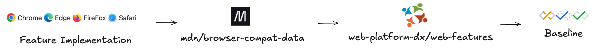
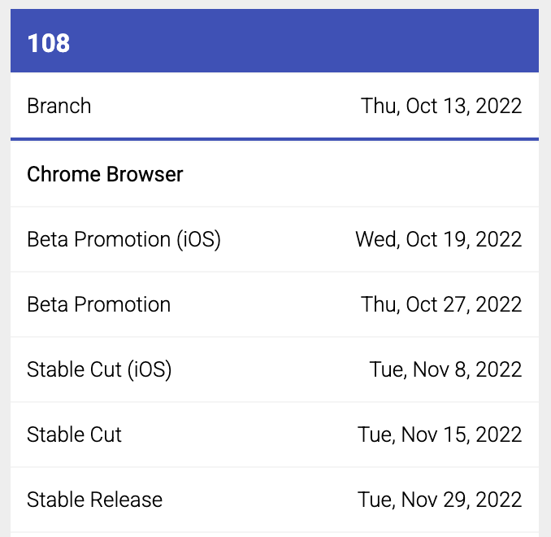
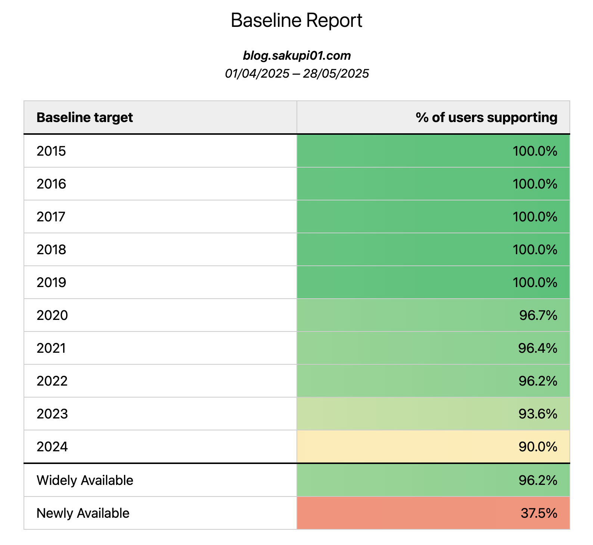

## Table of Contents

## はじめに

昨今の Web は著しい進化を遂げています。

2022 年に MS が IE のサポートを切り、Interop や Baseline といったプラットフォームが牽引する Interoperability のための素晴らしい取り組みが根を張り、互換性の向上に貢献する多くの標準化団体やコミュニティグループの活発化が進み、Test262 や WPT などの互換性を測る様々なテストスイートが広く利用され、こうした取り組みが相互に関係しあって、相乗効果を発揮することで、Web プラットフォーム全体の進化は確実に後押しされています。 
ブラウザ戦争や互換性の問題に悩まされていた時代から、Web は大きな変革期を迎えていると思います。

こうした進化の恩恵を無為にせず、乗り遅れず、Web 標準をフルに活用したいものです。 
プラットフォームの機能が活用され、コミュニティからのフィードバックを募ることができれば、Web を取り巻くコミュニティ全体としてフィードバックサイクルが形成され、その後は互換性を保ちながら仕様策定/実装するプロセスが整い始めている。自律分散的で堅牢な Web 標準の進化が期待できます。コミュニティから関心が持たれ、機能を使ってもらえるということは、World Wide Web の発展にとって非常に重要なことだと思います。

---

互換性を示す指標の一つとして、W3C の CG（Community Group） である [WebDX CG](https://web-platform-dx.github.io/web-features/) の主導する **「Baseline」** という指標があります。

この指標をプロダクトでうまく活用できれば、開発時に特定の Web 標準の機能が主要ブラウザでどの程度サポートされているかを把握しやすくなり、より良いプロダクト価値を迅速かつ安全に提供する意思決定を行う際の参考になります。最近では、静的解析ツールや RUM（[Real User Monitoring](https://en.wikipedia.org/wiki/Real_user_monitoring)）でも Baseline の活用が進んでおり、これらを活用することでより効率的かつ安全に Web 標準の機能をプロダクトの開発プロセスに組み込むことができるでしょう。

とはいえ、プラットフォームの主導する指標が、どの程度プロダクトに適用可能なのかはまた別の話なように思います。

最近、Baseline という指標はどの程度プロダクト開発で活用可能なのか、活用前段にどんな制約や条件があるのか、うまく運用していくにはどうしたら良いのか、、、考えていたので、備忘録も兼ねてまとめておきます。

なお、今回の話は自分の中でもまだ結論が出ていない、かつ実運用しているものでもないので、あくまで個人的な「考察」として捉えていただければと思います。

## A Little Background about Baseline

2023年の Google I/O にて「特定の Web 標準の機能が、主要ブラウザで利用可能かを示す単一の指標」として発表され、その後[コミュニティからのニーズ](https://web.dev/blog/baseline-definition-update)を受け、 **「特定の Web 標準の機能群が、主要ブラウザでどのくらい安定的に使用可能かを示す段階的な指標」** となり、現在の形に至ります。

<https://web.dev/blog/introducing-baseline>

以前は Google の Chrome チームが主導権を握っていましたが、Baselineとしてパブリックになった段階では、W3C のコミュニティグループである WebDX CG が主導しており、現在、さまざまな企業や個人の貢献により成り立っています。

この WebDX CG が推進するweb-features project 内の取り組みとして、 Baseline は位置づけられます。

[web-features project](https://github.com/web-platform-dx/web-features/blob/main/GOVERNANCE.md) はBaseline に”より細かな段階”をつける「web-features」を作成するプロジェクトで、現在の Baseline はこの web-features の情報に基づいて作成されます。

web-features は、「特定の機能実装を達成するために必要なプリミティブな機能の集合」で、そのプリミティブな機能は mdn の管理する [browser-compat-data](https://github.com/mdn/browser-compat-data) に基づきます。

web-features は、現時点では、browser-compat-data の更新を見ながら[手動で yaml ファイルを更新](https://github.com/web-platform-dx/web-features/pull/1914)する形で運用されており、次年の Baseline 開始までにできるだけ browser-compat-data の網羅率をあげることを目指します。

この「機能のまとまり」である web-features をソースとして Baseline は存在します。

_Web の新機能と Baseline の関係_

:::note{.memo}
more about Baseline

Baseline の SSOT は、以下のweb-features projectで定義されるspec です。Baseline がどのようにして始まり、何を or どういう層をターゲットとしていて、それによって何が便利になり、将来的にどういうことをしたいかまでもが書かれています。

- [web-features/docs/baseline.md at main · web-platform-dx/web-features](https://github.com/web-platform-dx/web-features/blob/main/docs/baseline.md)

:::

:::note{.message}
Column: Accessibility Baseline ...? 🫢

Baseline は Web の機能の互換性を示す指標ですが、アクセシビリティという観点は Baseline やそのもとデータとなる BCD で担保できていないのが現状です

APG に依存しない、アクセシビリティに関する支援技術\*ブラウザ間の相互互換性を担保するための指標が必要であるとして、ARIA には以下のようなプロポーザルが出されています。

- [Accessibility Compat Data Deep Dive Proposal · Issue #2538 · w3c/aria](https://github.com/w3c/aria/issues/2538)

APG に依存した ARIA の互換性を測る取り組みとしては [aria-at](https://aria-at.w3.org) が存在し、[WPT のテストケース](https://github.com/web-platform-tests/interop-accessibility)も存在しますが、より一般的な指標として活用可能なものが検討されていく可能性があります。

:::

## Some Basics about Baseline

Baseline を利活用する上で最低限知っておくべきことは、主に対象ブラウザと、ステータスの2つです。

### Browsers

- Apple Safari (macOS and iOS)
- Google Chrome (desktop and Android)
- Microsoft Edge (desktop)
- Mozilla Firefox (desktop and Android)

### Statuses

 <strong style="color: #E56910;">Limited Availability</strong>

Newly available の前の段階で、対象ブラウザの一部でのみ利用可能、つまりクロスブラウザでのサポートがされていない機能。

 <strong style="color: #1D7AFC;"> Newly Available</strong>

すべての対象ブラウザの最新の安定版でサポートが開始された機能。

 <strong style="color: #22A06B;"> Widely Available</strong>

Newly availableのステータスから2.5年（30ヶ月）以上が経過し、十分な実績と安定性が確認された機能。

例えば、2025 年になって主要ブラウザの最新安定版でサポートが揃った Popover API には、以下のように Baseline2025 _Newly Available_ の称号が与えられました。

- [popover - HTML: HyperText Markup Language | MDN](https://developer.mozilla.org/en-US/docs/Web/HTML/Reference/Global_attributes/popover)

また、2022 年から主要ブラウザの最新安定版でサポートが開始された HTML Dialog Element に関しては、それから 2.5年以上が経過しているので、Baseline _Widely Available_ です。

- [`<dialog>`: The Dialog element - HTML: HyperText Markup Language | MDN](https://developer.mozilla.org/en-US/docs/Web/HTML/Reference/Elements/dialog)

## Baseline とプロダクトの指標

Baseline 以前は、多くの場合において、 「IE11 をサポートすることが最低保証ライン」になっていたため、「他のブラウザがどのバージョンでどんな機能をサポートしているのか」について考えなくても問題になりにくい節がありました。 
しかし、2022 年に MS が IE11 サポートを終了し、最低保証ラインが消滅したことによって、どのブラウザのどのバージョンまでをサポートするのかを決めないと、どの Web の機能が利用できてどの機能が利用できないのかを判断できなくなりました。伴って、主要ブラウザのリリースサイクルも加速していったため、増々特定のブラウザバージョンに合わせて機能を実装することが難しくなりました。

### Baseline's Hope

「ひとつの指標であったIE のサポート切れと、それに伴う主要ブラウザの機能実装スピードへの判断追従が困難」という問題を解決すべく、「意味を持った指標を設けることで、どの機能がその状況下で安全に利用可能か判断可能にする」、そのアンサーが **Baseline** という指標です。

web-features project を推進する WebDX CG としても、Baseline が世の中のプロダクトがサポートブラウザバージョンを決める際の基準になることを期待しており、一見これを使わない手はないように思えます。

> When talking to developers we realized that until fairly recently many of you used Internet Explorer as a baseline for browser support. The site needed to work in IE11, therefore you would only use features supported in IE11. **With Internet Explorer going away, and browsers on ever-faster release cycles aligning to particular browser versions became much harder.**
>
> **Therefore Baseline was designed to be a line showing when features could be deemed ready to use, based on being available across all browsers.**
>
> You can use Baseline to:
>
> - **Make decisions about what web platform features to use in your sites and applications**
> - Tell others whether features work across browsers
>
> ー [Baseline  |  Articles  |  web.dev](https://web.dev/baseline/overview)
> ー [Baseline in your project | Baseline](https://web-platform-dx.github.io/web-features/use-baseline/)

## So, can we REALLY use Baseline?

例えば、Container Size Queries は 2023 年に全ての主要ブラウザで実装が完了し、Baseline 2023 Newly Available となりました。caniuse を確認すると、2025 年 5 月末現在で *92.55% のユーザにとって利用可能*であることもわかります。

<baseline-status featureId="container-queries"></baseline-status>

- [Using container size and style queries - CSS: Cascading Style Sheets | MDN](https://developer.mozilla.org/en-US/docs/Web/CSS/CSS_containment/Container_size_and_style_queries)
- [CSS Container Queries (Size) | Can I use... Support tables for HTML5, CSS3, etc](https://caniuse.com/css-container-queries)

この ”92.55%” という数値は、caniuse が内部的に利用している [statcounter](https://gs.statcounter.com/browser-market-share) というアナリティクスツールから fetch したデータをもとにしており、statcounter は 150万を超える世界中のサイトで利用されているツールです。この 150万を超えるサイトは、様々な業種や言語にわたるとされているため、caniuse が一般的な指標として参照するデータとしては妥当なものでしょう。

しかし、Container Size Queries が ”92.55% のユーザにとって利用可能”という statcounter のデータは、 ”そのプロダクトで” Container Size Queries が利用可能であることを意味するのでしょうか？

例えば、次の表は、利用されているブラウザの割合を statcounter からのグローバルなデータと、このブログのアクセスデータで比較したもので、最右のカラムは 2 値の差分を示しています。

| Browser | Global(statcounter) | sakupi01.com | delta (sakupi01.com - Global) |
| ------- | ------------------- | ------------ | ----------------------------- |
| Chrome  | 66.19%              | 78.5%        | **+12.31**                    |
| Safari  | 17.25%              | 10.5%        | **-6.75**                     |
| Edge    | 5.2%                | 5.5%         | +0.3                          |
| Firefox | 2.55%               | 3.5%         | +0.95                         |
| Opera   | 2.23%               | 0.5%         | **-1.73**                     |
| IE      | 2.08%               | **0%**       | -2.08                         |
| Other   | 4.5%                | 1.5%         | -3.0                          |

このように、caniuse などが提供するグローバルな統計データと個々のプロダクトの統計には乖離があり、必ずしも実際のユーザー層を反映しているとは限りません。

Baseline に関しても、あくまで「主要 4 ブラウザでのサポート状況」を示すものかつ、特定のプロダクトやサイトにおけるアクティブユーザー層の利用状況を必ずしも反映しているわけではありません。

> We know this widely available line can never be accurate for everyone. However, when looking into the available data on adoption of browser versions we learned that for most features it takes no more than 30 months for them to be available to about 95% of users globally.
>
> ー [A definition update for Baseline  |  Blog  |  web.dev](https://web.dev/blog/baseline-definition-update)

「when looking into the available data on adoption of browser versions we learned...」の what は以下の CFP でのディスカッションに詳しいです。

- [Call for positions: Baseline definition · Issue #374 · web-platform-dx/web-features](https://github.com/web-platform-dx/web-features/issues/374)

このように、caniuse や Baseline によって提供されるグローバルな値は、特定のプロダクトにおけるアクティブユーザー層の利用状況を反映している場合もあれば、厳密に反映しきれていない場合もあります。

こうした文脈を踏まえると、もし Baseline というグローバルな指標を採用した場合、「何が過剰/過小に評価され、どのくらいのユーザが切り捨てられることになるのか」事前に把握できており、その切り捨てに対して合理的な許容範囲が決まっていることが重要になってきます。

### Using Baseline Widely Available As A Threshold

2025/05 現在から 30 ヶ月前の 2022/11 に、全主要ブラウザの Latest Stable でサポートされた機能（つまり Newly Available になった機能）は、現在 Baseline Widely Available 扱いになります。

Chrome の文脈だと、Chrome 108 が 2022/11 で Latest Stable になりました。

- [Chromium Dash](https://chromiumdash.appspot.com/schedule)

もし Baseline Widely Available を基準にするのであれば、バージョン 108 以降を利用している Chrome ユーザを対象に動作保証できる可能性があることになります。

| Chrome Version                                         | sakupi01.com |
| ------------------------------------------------------ | ------------ |
| (Dev build) Chrome 139                                 | N/A          |
| (Beta build) Chrome 138                                | 2.8%         |
| **--- ↓ Can-Be Newly Available as of May 2025 ↓ ---**  |              |
| (Latest Stable build) Chrome 137                       | 9.5%         |
| Chrome 136                                             | 29.8%        |
| Chrome 135                                             | 40.0%        |
| Chrome 134                                             | 8.3%         |
| Chrome 133                                             | 0.9%         |
| Chrome 132                                             | 0.3%         |
| Chrome 131                                             | 0.3%         |
| Chrome 130                                             | 0.6%         |
| Chrome 126                                             | 0.3%         |
| Chrome 124                                             | 0.3%         |
| Chrome 120                                             | 0.3%         |
| Chrome 119                                             | 0.0%         |
| Chrome 117                                             | 2.5%         |
| Chrome 108                                             | 0.0%         |
| **--- ↑ Can-Be Widely Available as of May 2025 ↑ ---** |              |
| Chrome 79                                              | 1.2%         |
| Chrome 76                                              | 2.8%         |

逆にいうと、それより前にリリースされたブラウザのバージョンを使い続けているユーザに対しては、**Baseline としてその機能の動作を保証していない**ことになります。もちろん、Chrome の文脈だと、Chrome 108 以前で実装されていれば、Chrome では動作しますが、Baseline は Chrome オンリーの指標ではないため、Baseline としてそれを明示的に保証しているわけではないということです。

今回は sakupi01.com の閲覧に最も利用されていた Chrome ブラウザを対象に調査しましたが、他のブラウザの場合も考えて総合的に保証対象外となるユーザの割合を算出せねばなりません。

何が言いたいかというと、**Baseline は Newly も Widely もどちらも「全ての主要ブラウザで揃ったタイミング」を基準とした指標であり、「揃ったタイミング」である Newly より前のブラウザバージョンに対しては何の関心も持っていない、保証できていない**ということです。

Widely Available を基準にする場合、現時点から 30 ヶ月以前のブラウザバージョンに関しては、Baseline として機能が実装されてるかされてないか何の保証もできていない状態なので、その動作保証対象外のユーザの割合を知りたければ、機能の利用可能状況をブラウザ \* バージョン毎に確認する必要があり、非常に骨の折れる作業になりかねません。

---

話がややこしくなってきましたが、私たちが欲しいのは「全ての主要ブラウザで実装が完了している」ことを示す **「意味付けされたラベル」** ではなく、「全ての主要ブラウザで実装が完了している機能を全てサポートしている、プロダクト利用者のブラウザ」の **「年ごとの割合」** です。

この割合が分かりさえすれば、年単位でどのくらいのユーザのブラウザをサポートできるのかを把握でき、許容範囲の判断はプロダクトに責任を持つひとたちで行えるため、**「私たちの Baseline Newly Available Year」** を定義することができます。

「ブラウザ」が主語の「実装状況」による「ラベリング」ではなく、「私たちのプロダクトを利用するユーザ」が「この年に実装完了した機能ならどのくらいサポートできている」のかを知るための、「割合」が欲しいです。

## The Path To "Our" Baseline Newly Available

ということを考えていたら、Google が、Google Analytics ユーザ向けに [Google Analytics Baseline Checker](https://chrome.dev/google-analytics-baseline-checker/) という便利ツールを提供開始しました。

Google Analytics Baseline Checker は、Google Analytics を利用しているサイトのアクティブユーザのデータを用いて、そのサイトのアクティブユーザのブラウザのどのくらいの割合が、その年（これを Baseline Target Year といいます）において、主要ブラウザで実装完了している全ての機能をサポートしているかを可視化してくれるツールです。

Google Analytics Baseline Checker を利用してみたところ、sakupi01.com では以下のような結果が得られました。

_sakupi01.com 訪問者の Baseline Target Year ごとのサポート割合_

これぞまさに顧客が求めていたもの。

このサイトのアクティブユーザであれば、2019 年に主要ブラウザで実装が完了した機能であれば 100% の割合でサポートされていることがわかります。100% のユーザに互換性のある体験を提供すると定義するのであれば、2019 年がこのサイトの Baseline Newly Available Year になります。

また、2020 年をターゲットとするならば、3.3% のユーザのサポートを落としつつも、多少新しい機能を利用して、残りの 96.7% のユーザに対してより良い体験を提供できるでしょう。

---

このサイトではたまたま Google Analytics を利用しているので、Baseline Checker を利用することができましたが、Google Analytics を利用していないサイトでは、さくっとツールを利用することができません。

仕事で扱っているプロダクトでは、そもそも 3rd Party スクリプトをプロダクションコードに入れることに制限があり、Google Analytics や RUM Vision のようなツールは利用できない、、、というところもあるのではと思います。

ただ、障害や問い合わせがあった時のためになど、さすがに何らかの形でユーザを識別できない形でアクセスログをとっているところが多いのではないでしょうか。アクセスログを取るだけならセルフホストしているところもあると思うので、Baseline Checker で必要な Google Analytics の出力結果になるよう、アクセスログをパースして加工できる可能性があります。

- fwiw: [ua-parser-js - npm](https://www.npmjs.com/package/ua-parser-js)

### Reach Out To The Team And Spread

指標を決めても、チームで使ってもらわなければ意味がありません。
Baseline やそもそも Web 標準の利用に対する関心度合いや、新しく利用可能な機能を自発的に判断しようと思える人は、チームによってまちまちです。

こちらとしては、メンバーが強く意識しなくても自動的に Baseline に則ったコードベースになる仕組みをつくればよく、その打って付けの手段としてコンパイラ・プリプロセッサや静的解析が存在します。

#### Downpile To The Baseline Target

[Browserslist](https://browsersl.ist/)や [esbuild target](https://esbuild.github.io/api/#target) は、サポートしたいブラウザを特定するためによく使われる方法です。これらをサポートするビルドツールやプリプロセッサを用いると、指定した Baseline Target に合わせて特定のコード部分をダウンパイルしたり、ポリフィルする必要があるかどうかを判断してくれます。

- Browserslist 形式
  - e.g, [webpack](https://webpack.js.org/configuration/target/), [Rsbuild](https://rsbuild.dev/guide/advanced/browserslist), [Babel](https://babeljs.io/docs/babel-preset-env#browserslist-integration), [autoprefixer](https://github.com/postcss/autoprefixer), [eslint](https://github.com/amilajack/eslint-plugin-compat) …

- esbuild 形式
  - e.g, [Vite](https://vite.dev/guide/build#browser-compatibility)

- browserslist to esbuild 形式 : [marcofugaro/browserslist-to-esbuild](https://github.com/marcofugaro/browserslist-to-esbuild)

ツールが Browserslist や esbuild ビルド target の設定をによるダウンパイルをサポートしているのであれば、 Baseline Target をクエリに指定することで、選択した Baseline Target に応じてコードが変換されるようになります。

- [Use Baseline with Browserslist  |  Articles  |  web.dev](https://web.dev/articles/use-baseline-with-browserslist)

#### Statically Analyze

CSS においては、最近、ESlint や Stylelint などの静的解析ツールで Baseline をもとにしたルールやプラグインが充実してきました。これらを活用することで、Baseline に則ったコードかどうか、実装時点で自動的に気付けるようになります。

eslint/css や stylelint のプラグインでは、 ”newly” や “widely“ のみならず、機能の「available year単位」で指定可能です。

> set to a numeric baseline year, such as 2023, to allow features that became Baseline newly available that year, or earlier
>
> ー [css/docs/rules/use-baseline.md at main · eslint/css](https://github.com/eslint/css/blob/main/docs/rules/use-baseline.md)

- eslint: [css/docs/rules/use-baseline.md at main · eslint/css](https://github.com/eslint/css/blob/main/docs/rules/use-baseline.md)
- stylelint: [ryo-manba/stylelint-plugin-use-baseline: A Stylelint plugin that enforces Baseline CSS features.](https://github.com/ryo-manba/stylelint-plugin-use-baseline)

---

サイトのアクティブユーザの利用ブラウザに基づいた Baseline Target Year を Baseline Checker などで取得できれば、ビルドツールや Linter ツールで Baseline を活用でき、開発プロセスに Baseline を組み込むことができます。

### The Fallback Experience

ターゲットとする年を決める上で、「その機能が使えなかったらどうするのか」を考慮に入れることも重要です。

例えば、CSS Subgrid は Baseline 2023 で Newly Available となりましたが、もしプロダクトで 2023 年を Baseline Target として指定できないのであれば、CSS Subgrid を直接利用することはできないように思えます。

しかし、多少煩雑にはなりますが、Subgrid は既存の CSS で同等の体験が再現可能なため、Subgrid が利用できないブラウザに対しては、既存の方法を利用して実装を提供することができます。

- [The new CSS Sub-Grid with fallback](https://codepen.io/elad2412/pen/KKaXOPG)

こういった、「既存方法で煩雑だったから、標準化したよ」な機能は多く存在するため、既存の方法と併用で利用できないかを検討し、段階的な導入のきっかけにすることができます。

---

また、Customizable Select Element のように、そもそも既存の Select Element から `appearance: base-select;` でオプトインする形で提供し、`appearance: base-select;` に関しても Progressive Enhancement となるように仕様が策定され、未実装のブラウザに対しては元の Select Element にフォールバックする、というように、標準側で一定のフォールバック体験が組み込まれているものもあります。

こういったフォールバック機能が、ユーザの体験を損なわない程度の安全なフォールバックであるという判断ならば、利用可能なユーザが基準を下回っても機能を利用する、という判断ができるかもしれません。

---

また、Anchor Positioning のような機能は、Popover API と組み合わせて利用したいという希望が大きいものだと思いますが、いまだに主要ブラウザでの実装は揃っていません。しかし、Interop の Focus Areaの一つとして、今年度中の実装が見込まれています。 
こうした「費用対効果の高い先行きの見える機能」については、ベンダの position を確認しながら、利用できないユーザの体験を十分に設計し、導入を視野に入れても良いのかもしれません。信頼できる提供元の Polyfill の利用を考えるのもひとつの手段でしょう。

個人的に Polyfill を検討する際に特に意識していることは、「Polyfill のサイズ」と「仕様が十分に固まっているか」です。

サイズについてはバンドルサイズ増大の観点から自明ですが、仕様の fix 具合に関しては特に注意しておく必要があります。
W3C が管理している仕様であれば、[Recommendation Track](https://www.w3.org/policies/process/#rec-track) に従い、それぞれの段階に応じて仕様の安定性が担保されます。Working Draft になると、Editor の手から離れて W3C のプロセスに組み込まれた仕様になり、3ヶ月に一回のペースで更新され、仕様の安定性が増していきます。

例えば、Anchor Positioning は2023年に First Public Working Draft となってから、さまざまな構文変更や改良が繰り返され、2025/05 最新の WD には比較的マイナーな変更のみが含まれており、これは仕様が安定してきていることを示します。

- [[CSSWG][css-anchor-position-1] Updated WD of CSS Anchor Positioning L1 from fantasai on 2025-05-12](https://lists.w3.org/Archives/Public/www-style/2025May/0003.html)

逆に、Bad なケースとして最近盛り上がったのが、Scoped Custom Element Registries の Polyfill です。Scoped Custom Element Registries は仕様が十分に固まっていない段階の機能にも関わらず、こうした Polyfill が公開されてしまったことで、仕様の策定に影響を与える可能性があり、反発の声が上がりました。

- [manolakis/scoped-registries: Scoped Custom Element Registry Polyfill](https://github.com/manolakis/scoped-registries)

<https://bsky.app/profile/annevk.nl/post/3lj5nvcf25k2g>

## Baseline Is A Way To Reasonably Control Product's Accessibility

どのブラウザのどのバージョンをサポートするかの意思決定に責任を持つことは、プロダクトが「どのくらいのユーザからアクセス可能で、どのくらいのユーザからアクセス可能でないか」、つまりアクセシビリティに責任を持つための要素だと思ってます。

完璧なユーザ体験を設計し、アクセシビリティチェックが最新ブラウザで完璧に Pass していても、その HTML が、 CSS が、 ARIA が、 JS が、ユーザのブラウザでそもそもサポートされていなければ、それは ”その Web 標準が機能するバージョンを使っているユーザ” という **”超限定的な範囲”** で Accessible さを保証しているに過ぎません。 
今自分たちが使おうとしている Web の機能を、どのくらいのユーザが確実にサポートできているか把握することは、そのプロダクトのアクセシビリティに責任を持つことにつながります。
逆に、どのくらいのユーザが切り捨てられることになるのかわからないということは、切り捨てられるユーザに対して責任を放棄するスタンスをとることになりかねません。

そんな大事な意思決定を、正しく、合理的に、そしてプロダクトに関わる人全員で責任を持っておこなうためにどうしたら良いのか。

個人的なアンサーは、「わたしたちの Baseline」を決めて、それを取り巻くツールを用いてみんながサポート機能を意識できるフレームワークを組むことかな〜と思っていますが、実際のところは、プロダクトやユーザの特性、チームの文化によっても変わると思っていて、結論が出ていないというのが結論です。

「ブラウザのサポートバージョン」、みなさんのところではどう運用していますか？ Thoughts Are Appreciated!

## Appendix

- [How to choose your Baseline target  |  Articles  |  web.dev](https://web.dev/articles/how-to-choose-your-baseline-target)
- [How to think about Baseline and polyfills  |  Articles  |  web.dev](https://web.dev/articles/baseline-and-polyfills)
- [AT Interop Reports | ARIA-AT](https://aria-at.w3.org/reports)
- [RUM Archive - RUM Insights](https://rumarchive.com/insights/#baseline)
