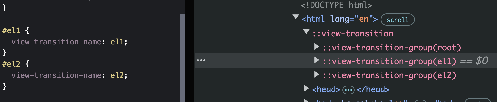

## Table of Contents

## はじめに

※ 本エントリは、View Transition API の知識を前提としています。View Transition API の基本的な情報に関しては、[こちら](https://developer.chrome.com/docs/web-platform/view-transitions/)が参考になります。

View Transition API は、DOM 要素変更間でのシームレスなアニメーションを提供する API です。

この API を使用するにあたって、`view-transition-name`プロパティを使用することがしばしばあります。`view-transition-name`プロパティは、View Transition される要素に任意の名前（`<custom-ident>`）を指定することで要素を独立したものとしてキャプチャし、`::view-transition`ツリー内で独立した遷移要素として扱うための CSS プロパティです。

- [2.1. Tagging Individually Transitioning Subtrees: the view-transition-name property | CSS View Transitions Module Level 1](https://drafts.csswg.org/css-view-transitions/#view-transition-name-prop)


_::view-transitionツリー内で独立した要素としてキャプチャされ、遷移できる_

本エントリでは、[Safari 18.2でShipされた`view-transition-name: auto;`](https://webkit.org/blog/16301/webkit-features-in-safari-18-2/#:~:text=WebKit%20for%20Safari%2018.2%20adds%20support%20for%20view%2Dtransition%2Dname%3A%20auto)と、それを私たちがどう捉えるべきかについて述べます。

## Quick Wrap Up What `view-transition-name` Is & What's Desired

`view-transition-name`は、次のように CSS を適用することで、View Transition API を使用する際に要素を独立したものとしてキャプチャし、遷移できるようにします。
これにより、視覚的には"要素単位での遷移"が可能となります。


_::view-transitionツリー内で独立した要素としてキャプチャされ、遷移できる_

:::note{.memo}

📝 視覚的には"要素単位での遷移"が可能

DOM 的な遷移単位は、あくまでも`::view-transition`ツリーです。DOM 的にも遷移要素を独立させ、View Transition の範囲（`::view-transition`ツリー）を任意の要素に限定して扱いたいという要望に対しては、Scoped View Transition が提案されています。

- [Intent to Prototype: Scoped view transitions](https://groups.google.com/a/chromium.org/g/blink-dev/c/AGligmIYZfM/m/1czQfry5AQAJ)
- [view-transitions/scoped-transitions.md at main · WICG/view-transitions](https://github.com/WICG/view-transitions/blob/main/scoped-transitions.md)

:::

`view-transition-name`の使用にあたって注意したいのが、`view-transition-name`は DOM の[id](https://dom.spec.whatwg.org/#ref-for-dom-element-id%E2%91%A0)属性のように、View Transition 内で一意である必要があるという点です。これは、遷移前のキャプチャ(`::view-transition-old(<custom-ident>)`)と遷移後のキャプチャ(`::view-transition-new(<custom-ident>)`)で同一の`view-transition-name`を持つことで、遷移前後の要素を関連付けて遷移するためです。


_view-transition-name重複時のエラー_

そのため、`view-transition-name`を多くの要素に対して適用したい場合、次のように、`view-transition-name`を要素の数だけ重複なく指定する必要があります。

<p class="codepen" data-height="300" data-default-tab="html,result" data-slug-hash="VwBprqL" data-pen-title="View Transitions like IsotopeJS" data-user="jaffathecake" style="height: 300px; box-sizing: border-box; display: flex; align-items: center; justify-content: center; border: 2px solid; margin: 1em 0; padding: 1em;">
  <span>See the Pen <a href="https://codepen.io/jaffathecake/pen/VwBprqL">
  View Transitions like IsotopeJS</a> by Jake Archibald (<a href="https://codepen.io/jaffathecake">@jaffathecake</a>)
  on <a href="https://codepen.io">CodePen</a>.</span>
</p>
<script async src="https://public.codepenassets.com/embed/index.js"></script>

<br />

こうした問題を解決するために、`view-transition-name`の自動生成が提案されています。

## `view-transition-name`を自動生成する提案

まず、自動生成に関する`view-transition-name`の新たなキーワードは、「① HTML `id`属性を参照するもの」「② Element の識別子を参照するもの」「③ `id`属性を参照できなかったら、Element の識別子にフォールバックするもの」に大別して話が進められます。

> RESOLVED: Add three keywords, one for ID attribute, one for element identity, and one that does fallback between the two.
> <https://github.com/w3c/csswg-drafts/issues/8320#issuecomment-2344208387>

そして、実際には、それぞれ次のように実現される運びです。

① HTML `id`属性を参照するもの：`attr(id ident)` <br />
② Element の識別子を参照するもの：`match-element` <br />
③ `id`属性を参照できなかったら、Element の識別子にフォールバックするもの：`auto`

- [[css-view-transitions-2] view-transition-name determined by element · Issue #8320 · w3c/csswg-drafts](https://github.com/w3c/csswg-drafts/issues/8320)

つまり、③の`auto`は①と②を組み合わせた、`attr(id ident, match-element)`のシンタックスシュガーのようなイメージです。

今回は、この`auto`が仕様的な問題を抱えたまま WebKit に実装されたことが、議論の的となります。

## `view-transition-name: auto;`

まず、執筆時点の仕様では、`view-transition-name: auto;`は、次のような挙動をすることになっています。

> To make this easier, setting the view-transition-name to auto would generate a view-transition-name for the element, or take it from the element’s id if present.
>
> `id`属性が存在する場合は`id`属性を参照し、`id`属性が存在しない場合は、Elementの識別子を生成する
>
> ー [6. Determining view-transition-name automatically | CSS View Transitions Module Level 2](https://www.w3.org/TR/css-view-transitions-2/#auto-vt-name)

`view-transition-name: auto;`を使うと、これまで要素ごとに`view-transition-name`を指定していたものが、HTML の id 属性を参照するか、フォールバックして UA によって自動で生成されることになります。

```html showLineNumbers {20}
<ul>
  <li>Item 1</li>
  <li>Item 2</li>
  <li>Item 3</li>
  <li>Item 4</li>
  ...
</ul>
<style>
  /* これが */
  li:nth-child(1) {
    view-transition-name: item1;
  }
  li:nth-child(2) {
    view-transition-name: item2;
  }
  li:nth-child(3) {
    view-transition-name: item3;
  }
  li:nth-child(4) {
    view-transition-name: item4;
  }
  ...

/* こうなる */
li {
    view-transition-name: auto;
  }
</style>
```

`auto`の実現には、フォールバック時に「Element の識別子を生成する仕様」が追加で必要になります。それが、`view-transition-name: match-element;`です。そして、この`match-element`の提案が、`auto`の懸念を浮き彫りにする議論へと発展します。

> RESOLVED: [Pending async confirmation] `auto` will match elements using their ID attributes, falling back to element identity; `match-element` will only use element identity.
> <https://github.com/w3c/csswg-drafts/issues/10995#issuecomment-2447567969>

- [[css-view-transitions-2] Allow an auto-generated `view-transition-name` that doesn't default to ID · Issue #10995 · w3c/csswg-drafts](https://github.com/w3c/csswg-drafts/issues/10995)

## Allow an auto-generated `view-transition-name` that doesn't default to ID

`match-element`により、「`id`属性が存在する場合は`id`属性を参照し、`id`属性が存在しない場合は、Element の識別子を生成する」という`auto`の挙動は再現できるかのように思えますが、アプリケーションによっては`auto`の挙動に差異が生じることになります。

Element に対して ID を生成する`match-element`は、ページ遷移で Element が全く別のものに挿し替わると、それぞれの Element に一意の ID を割り振ります。つまり、MPA のような、ページ遷移にサーバへのリクエストを伴うアプリケーションにおいては、`match-element`では View Transition ができません。これは、Cross-Document View Transition では、`auto`が使えないことを意味します。

その反面、SPA のような、ページ遷移にサーバへのリクエストを伴わず、DOM の削除/追加によってページ遷移を擬似的に実現するアプリケーションにおいては、`match-element`での View Transition は可能でしょう。

これらを踏まえると、`view-transition-name: auto;`は、「`id`属性が存在する場合は`id`属性を参照し、`id`属性が存在しない場合は、Element の識別子を生成する」ことで`view-transition-name`を自ら指定しなくてよくなる、という当初の目的に反した挙動の差異を生む可能性を孕んでいます。

- HTML id 属性が存在する場合：`auto`は動作する
- HTML id 属性が存在しない場合
  - SPA（Same-Document View Transition / Scoped View Transitions）: `match-element`が動作するので、`auto`は動作する
  - MPA（Cross-Document View Transition）: `match-element`が動作しないので、`auto`は動作しない

:::note{.memo}

📝 SPA（Same-Document View Transition / Scoped View Transitions）

現在策定が進んでいる Scoped View Transitions は、Same-Document View Transition に限定された機能のため、`auto`を用いた View Transition が可能と表記しています。
:::

もし、要素に`id`属性を持たせていたとしても、その要素の`::before`や`::after`などの擬似要素には`id`属性がないため、それらを Cross-Document View Transition したい場合、`auto`は動作しません。

Same-Document View Transition においては、一貫して動作しますが、Cross-Document View Transition においては、一貫した動作が保証されない。こうした`match-element`の挙動差異を`auto`でというキーワードで握りつぶして提供することは、「`auto`は動く時もあるけど、動かない時もある」という最もデバッグしにくく、不安定な状態を生むことになりかねません。

## Safari 18.2で`view-transition-name: auto;`がShip

View Transition API は比較的新しい機能で、まだ十分に機能を理解して利用できている人も多くないのではと思います。

「要素数が多くても、`view-transition-name`プロパティを自動で生成できますよ！」という提案のリリースノートは、`view-transition-name`の扱いをシンプルにしてくれるものとして、非常に魅力的なものとして受け取る人も多いはずです。そんな中、文末の「**if**」の意味をきちんと理解し、「**`view-transition-name: auto;`は、`id`属性を持たない要素のCross-Document View Transitionに対しては使えない**」と咀嚼できる人はどれほどなのでしょうか。

> WebKit for Safari 18.2 adds support for view-transition-name: auto. This means you won’t have to individually name potentially hundreds of different content items **if you are applying transitions to the content on a single page.**
>
> ー [WebKit Features in Safari 18.2 | WebKit](https://webkit.org/blog/16301/webkit-features-in-safari-18-2/)

## Appendix

- [[css-view-transitions-1][css-view-transitions-2] Add view-transition-name: match-element by noamr · Pull Request #11393 · w3c/csswg-drafts](https://github.com/w3c/csswg-drafts/pull/11393/files)
