## Table of Contents

## はじめに

2025年は公私共に良くも(!)悪くも思った方向に転びまくらない年でした。
初めて丸１年東京で過ごした年だったこともあってか、本当にたくさんの（想像もしてなかったような）出会いや機会に恵まれ、「手をつけたからにはやるぞ！」の精神でなんとか乗り切ってきたら、想定してた自分とは全く違う自分になっていた気がします。
だからこそ、今年は去年よりもたくさんの人たちの顔と思い出が浮かんだ状態で Year in Review を書きはじめることになりました。泣ける。

そんな感じで、 Super-Hyper-Adventurous 2025 の振り返り、やってき！

  <h2 class="year-in-reviews__title">Year in Reviews</h2>
  <ul class="year-in-reviews__grid">
    <li class="year-in-reviews__item"><a href="https://blog.sakupi01.com/life/articles/2024-lookback" class="year-in-reviews__link">2024</a></li>
    <li class="year-in-reviews__item"><a href="https://blog.sakupi01.com/life/articles/2025-in-review" class="year-in-reviews__link">2025</a></li>
  </ul>

## Career Stuff

活動するチームが変わりました。というか、いわゆる社内転職をしました。2024年はキラキラ新卒フロントエンドエンジニアとして kintone のフロントエンド刷新をしていましたが、今年は５月くらいからプロダクトデザイン部でデザインテクノロジストとして kintone のデザインシステム開発に携わっています。

マネージャーには去年の時点から「デザインテクノロジストになりたい。本腰入れてデザインシステムやってきたい。」と話していました。
でも、入社して間もないのに職能変更とか言い出してるわけで、まさかこんなに早く実現してくれるとは思っていなかったです。そういう柔軟性のある会社のシステムと、理解とスピード感のある人がマネージャーでいてくれて本当に恵まれていると思っています。

デザインテクノロジストとしてのお仕事は、ギュッとすると「横断組織」という点で FE チームにいた頃とは別の難しさがありました。
FE は自チームに任された領域とタスクがあるため、基本的にチーム内で議論が完結していました。でも、デザインシステムはプロダクトチーム横断で、デザイナー・FE・Writer・etc など幅広いチーム・職能から利用されるため、関係者が自ずと「プロダクトのユーザ体験に関わる全チーム」になります。
だからこそ、それぞれのチームの「[デザイン的な | 機能的な | アクセシビリティなど非機能的な | 開発プロセス的な] 重要度や緊急度」、そこから決まる「優先度」、プロダクトひいては会社に「今求められていること」、そしてもちろんデザインシステムの「開発難易度や工数」がそれに見合うか、などなどたくさんのパラメータを総合的に評価して、現状の「最適解」を捉え続けることが、デザインシステムの理想的な成長に直結します。
それゆえ、特に技術の専門性を持った状態でこういう環境に入ると、「ウェブ標準的には〜」「アクセシビリティ的には〜」で Formal Objection したくなる「最適解」が無限にあって、でもそれが全体最適なんだという理性も働くので、専門性を抑える類のしんどさを FE にいた時以上に味わう機会が増えました。というか、そういう総合的な判断をすること自体が専門性の職能になりました。
単一の観点から「正しい」ことだけを主張するのではなく、たくさんの関係者の状況を理解し、合意形成を図るのが、視野の広さを問われるし、議論だし、説明の連続で、日々勉強になる...むずいっ...！と感じております。
こういう難しさって標準化の議論の中にもたくさんあって、ウェブ標準って広義のデザインシステムなんじゃない？😃と思ったりもします（雑な論理展開なので異論は認めています）。
そんな感じなので、結局は人。いい感じにやる力。要はバランス。いわゆるシゴデキ。-- より複雑な Tier でこれらが求められるようになり、伸び代を痛感した１年でした。

### Writings

- Customizable Select ElementにおけるParser RelaxationのアップデートとShipの背景 | @sakupi01.com
  - <https://blog.sakupi01.com/dev/articles/customizable-select-element-parser-relaxation>
- Safari 18.2 「`view-transition-name: auto;`」への警鐘 | @sakupi01.com
  - <https://blog.sakupi01.com/dev/articles/view-transition-name-auto>
- Standardizing User Intent with Interest Invokers ! (... and it's complicated) | @sakupi01.com
  - <https://blog.sakupi01.com/dev/articles/standardizing-user-intent-with-interest-invokers>
- The Outline Algorithm Utopia | @sakupi01.com
  - <https://blog.sakupi01.com/dev/articles/the-history-of-outline-algorithm>
- Unlocking Parent Style Inheritance✨/ Nested で Dynamic で Adoptive なスタイルを実現する `inherit()` | @sakupi01.com
  - <https://blog.sakupi01.com/dev/articles/css-inherit>
- [Thoughts Are Appreciated!] Baseline という指標の活用可能性に関する考察 | @sakupi01.com
  - <https://blog.sakupi01.com/dev/articles/thoughts-on-our-baseline>
- プロダクト開発の基準に Baseline を取り入れるまで
  - <https://blog.cybozu.io/entry/practical-baseline>
- Zenn
  - <https://zenn.dev/s_a_k_u>
  - CSSDay 2025 Report
    - <https://zenn.dev/cybozu_frontend/articles/css-day-2025>
  - ウェブ標準動向 2025年9月版
    - <https://zenn.dev/cybozu_frontend/articles/web_standards_monthly_202509>
  - ウェブ標準動向 2025年10月版
    - <https://zenn.dev/cybozu_frontend/articles/web_standards_monthly_202510>
  - etc

今年もいろいろ書きました。特に、社内プロジェクトの延長で書いた Baseline の記事は割と読まれて、社外からの反響もあって、最終的には web.dev に載るといった稀有な経験ができました。web.dev で記事を書ける人生になるとは１mm も思ってなかったので単純に嬉しかったです。会社のグローバル露出、増やしていきたい。

- How Cybozu eliminated browser compatibility overhead with Baseline  |  web.dev
  - <https://web.dev/case-studies/cybozu-baseline>

ちょっとした裏話を添えておくと、めちゃくちゃ丁寧にレビューいただけて、195件以上ものコメントをいただきました。ゴリゴリの修正量には吹いた。

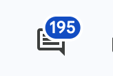

...

そして、今年もアドベントカレンダーというやつを**書いてしまいました**。

- 計 25 記事 : 2025/8/1 〜 25 CSS Advent Calendar
  - <https://blog.sakupi01.com/dev/articles/2025-css-advent-0>

今年は CSS という、どう考えても 25 日で収まるわけない壮大なテーマで書いてしまったことが最大の反省です。結局抽象的な話ばっかりして、十分に具体で説明を補えなかった、感。
そもそもなんで CSS で書こうと思ったんだろう、いつのタイミングで今年は CSS にフォーカスしようと思ったんだろうというのを少し思い返したのですが、やっぱ CSSDay に参加したのが大きかった。それ前の自分を振り返ってみると、「ウェブ標準」という軸はありつつ、「Web の UI テクノロジー」というところで割とふわふわしていた形跡があります。デザインテクノロジストにもなるしと思って、割と思い立って CSSDay にいくことを決め、その土俵に立つために文献を漁って考古学的なことをして抽象概念をめちゃくちゃ整理してインプットするみたいな時期がありました。その後に Day に参加して現場と人を知り、実際に仕様を直したりして当事者意識を持てるようになり、そういう一連の流れがアドカレの背景だったとしか思えません。

> 諸々、非常に貴重な経験だったんですが、**多分もう二度とやらない**。
> -- [2024 In Review | @sakupi01.com](https://blog.sakupi01.com/life/articles/2024-lookback)

非常に貴重な経験だったことには今年もやはりなんの異論もないのですが、「多分」じゃなくて「確固たる意志」が必要そうでした。

### Speakings

- Slide Archives | ./slides/ja/
  - <https://sakupi01.github.io/slides/ja/>

今年はいろいろしゃべる年でした（前年比）。
BuriKaigi（やばい！2026 もある！何もスライド作ってない、やばい！）では「Web プラットフォームの Interoperabilityを実現する！ Open UIのあゆみとこれから」というタイトルで話しました（タイトルがまだ日本語時代）。去年の 12月に書いた Open UI の Select Element Proposal に関するアドカレをベースにしました。HTML の Form Controls がどういう課題を持っていて、Customizable Select Element がどういう背景で設計され、それらの機能を使ってどういう問題を解決しているのかを解説しました。
フロントエンドカンファレンスにも、北海道と東京に登壇しました。北海道では「Designing on the Web」、東京で「CSS Ecosystem Meets Standards, now?」というタイトルでのトークでした。２つで１つのセットになっていて、北海道ではWeb でデザインするということを CSS や HTML の設計思想から説明した割と「抽象論」を、東京ではそれを踏まえて実際に標準側のソリューションとツール側のソリューションにどういう差分があって、どういう未来が考えられるのかという割と「実践的な内容」を話しました。
このフロントエンドカンファレンス２つの登壇は割と思想というか抽象的な話をしてしまったのですが、反響は大きく、「アドカレ書いててよかったなあ」という感じでした（来年も書くとはいってない）。

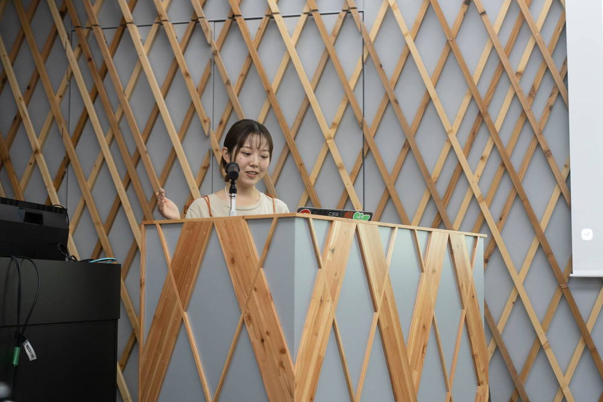

#### Google Developer Experts

そいういう活動をしていたところ、10月くらい（？）にお声がけをいただき、11月の半ばくらいに GDE になりました。びっくりしました。Web の GDE の方たちは前々から一方的に知っている方も多く、情報源にさせてもらっていたりして、すごく尊敬しているし、そんな方たちと同じ肩書きで活動していることが単純にまだ身の丈に合わない感じがしてならないです。

- Google Developer Experts にジョインしました | @sakupi01.com
  - <https://blog.sakupi01.com/dev/articles/join-in-gde>

GDE になってから１週間経たないうちに DevFest での登壇でした。「Web UI 2025 Updates & What's Coming!」というタイトルで、Container Queries や Customizable Select とそれに紐づいた 2025年の Web UI の主要アップデートを話しました。

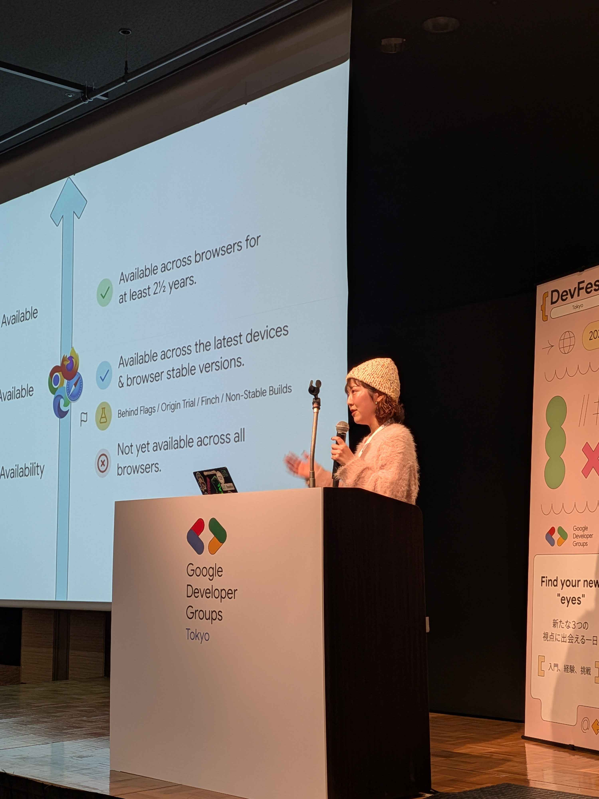

11月は TPAC → YAPC → JSConf → DevFest 、、、というカンファレンストライアスロンだったので、単純に体力がやばかったです。後半体調は悪かったけど、風邪を引かなかったのは奇跡。

---

そのほかにもいろいろ喋っていたようで、年間を通して７回の登壇でした。

### Podcasts

- mozaic.fm Monthly Platform 2025/1~
  - <https://mozaic.fm/>
- サイボウズフロントエンド通信
  - [#13](https://open.spotify.com/episode/0IkH5kPDBLb9xC2yshqRzt) サイボウズの新卒エンジニアってどんなことやってるの？〜2024入社編〜
  - [#17](https://open.spotify.com/episode/6p3LvUalBsCaJz0ZlyNqzM) kintone のフロントエンド開発との関わり方

今年から mozaic.fm の Monthly Platform に出演していました。昨年アドベントカレンダーを個人的にレビューいただいていた @Jxck さんから、お誘いを受けたのがきっかけです。毎月月末に「今月のウェブプラットフォーム」を話しています。
mozaic.fm は入社した直後くらいに、おすすめのポッドキャストとして同期に紹介されて知った記憶があります。そこからできるだけ毎月楽しく聴かせてもらっていました。フロントエンドエンジニアだったので、Monthly Ecosystem の方は割と解像度高く理解できている感覚がありましたが、Platform の方はいわゆる「一般的なフレームワークユーザランド」からすると割とハイコンテキストだし、知らないことの方が多く、程よく置いてけぼりにされながら聴いていました。そんな中のオファーだったので、リスナーだったポッドキャストのゲストになれる嬉しさ以上に「私にウェブプラットフォーム、、、語れるんか？？？Jxck さんと Yakura さんが話してる中に入れるわけがなさすぎる・・・」正直そう思っていて、めちゃくちゃビビりながら初回...なんなら半年くらい...なんなら今でもずっとビビってます（こんなこと言うと「もうちょっと自覚持て」って引っ叩かれそうですが）。
ウェブ標準って、その特性上エコシステムと比べて歴史とか構造とかメンタルモデルとか人を知らないことが、理解の大きな壁になる -- ポッドキャストの前からそう感じていました。今年の活動の大半でその部分のインプットにフォーカスしていたというのは、そういう理由もあったりします。
あと、私は主に UI の話をするので、これ伝わってるかな〜音声で見た目説明するのむずいな〜などと思ったり、時々、「これ絶対説明間違ってるでしょ！！」「説明長すぎ！！」とかで、絶望することもあります。来年は主に「ビジュアル言語化力」「話す前に立ち止まる勇気」「リスナーの視点に立ってみよう」の３点セットで成長をお送りしたいです。

### Interviews

- 「ノーコード？」エンジニアはコードが書けるのにぶっちゃけどう思ってる？ サイボウズの若手技術者に聞いてみた | サイボウズ式
  - <https://cybozushiki.cybozu.co.jp/articles/m006256.html>
- ［W3Cテックリードに聞く(前編)］ W3Cとは？Web標準ってどうやって作られているの？ - Cybozu Inside Out
  - <https://blog.cybozu.io/entry/w3c-interview-part1>
- ［W3Cテックリードに聞く(後編)］TPACとは？ブレイクアウトセッションって？10年後のWebはどうなるの？ - Cybozu Inside Out
  - <https://blog.cybozu.io/entry/w3c-interview-part2>

インタビューもいくつか受けました。一つは広報ブログで、簡単にいうと「イキがいいから」という理由で同じくイキが良すぎる同期とインタビューを受けました。この選定に関しては今でも納得いっていません。また、至ってナチュラルに発した「なんでですか？」が切り取られ、「質問攻めしてるの、脳内再生が容易だった」などといった悪質なコメントにより拡散され、社内で [meme](https://cybozushiki.cybozu.co.jp/articles/m006256.html#:~:text=saku-,%E3%81%AA%E3%82%93%E3%81%A7%E3%81%A7%E3%81%99%E3%81%8B%EF%BC%9F,-saku%E3%80%82%E9%96%8B%E7%99%BA%E6%9C%AC%E9%83%A8) 化したことも、全然腑に落ちていません。なんでですか？？？

W3C 関連で２つインタビューをしたことも貴重な経験でした。思い返せば、今年は「W3C に加入したい」などとほざき始めたことからスタートしました。結果、様々な方の理解とご尽力によって加入が実現しました。その流れで W3C から、「今度 PLH さんくるから誰かディスカッションして」といった依頼があり、「留学してたんやし、saku いけるやろ。せっかくやし記事にもしとこか（意訳）」といった非常に雑なアサインで、 W3C テックリードへのインタビューが決定しました。私にもっと知識と英語力があれば、もっと深い議論ができたのではと悔やまれて仕方ないですが、 あちらもこういう場には慣れていてガンガン伝えてくれたので、結果として１本に収まらず２本の記事になるボリュームの会話はできました。

記事を書いたり、インタビューをしたり、国際カンファレンスに参加したり... 社会人になってこんなに英語を使うことになるとは正直思っていなかった...。一応留学に行っていたのでなんとかなりましたが、ブランクで失ったもののデカさに絶望しました...本当にやばすぎる。。。来年はもっとグローバルに活動したいので、英語、コツコツ本気出してく。

### Events

- fukuoka.ts #3
  - <https://fukuoka-ts.connpass.com/event/347048/>
- 〜エンジニア視点で議論する〜 次世代デザインシステムへの現在地
  - <https://connpass.com/event/368658/>

fukuoka.ts は一回しかできませんでした。やっぱ東京いるときつい。幸い、「引き継ぎたい」といってくれている人がいるので、来年はバトンタッチしてちゃんと開催できればと思います。
というのも、来年のフォーカスの一つとして、 FEC Fukuoka 2026 の実行委員長業があり、福岡のエンジニアコミュニティにその啓蒙もせねばらならいためです。建前は「コミュニティへの貢献」、本音は「実行委員のエゴいっぱいであってもいいよね」という思想のもと、「技術的な充実度」には特に妥協をしたくなくて、FEC Fukuoka 2026 は招待公演を厚めにし、すでに基調講演レベルの方々に登壇いただけることになっています（ありがたい・・・）。もう、「運営業丸投げしてずっとセッションハシゴしていたい」そう思えるカンファレンスにしたいです。そして、せっかくそういった人たちが福岡に集まるので、何かしたい。アイディア〜〜〜。

- Frontend Conference Fukuoka 2026 を開催します
  - <https://note.com/sakupi01/n/n4e997b62c825>

#### TPAC 2025

- TPAC 2025 @Kobe Diary | @sakupi01.com
  - <https://blog.sakupi01.com/dev/articles/tpac-2025-diary>

2025年を語る上で最も外せないイベントは間違いなく TPAC でした。
ここで書くには余白が足りなさすぎるし、あらゆるところでアウトプットしてるので敢えて何も言いませんが、ここで出会った人たちや彼らから伝えてもらったことは、一生の宝物になりそうです。TPAC に参加する前、CSSDay 参加後くらいからちょこちょこ Spec を書いたり、標準化の議論に参加していたこともあり、「今年の TPAC 日本だし、 CSS の mtg 参加しない？」と、 Alan や Tim や fantasai から個人的に声をかけてもらっていました。そのこともあり、彼らとは会期中たくさん話すことができて、今でも連絡を取り合う仲になれたことが本当に嬉しいです。来年以降はもっと積極的に彼らや WG に関わっていく方面に力を入れていきたい。

来年も絶対に TPAC 行く。私費でも、行く。

## Life Stuff

Instagram を振り返れば良いと思ったのですが、今年は本当に何も投稿しなさすぎてました。去年までは呼吸するかのように毎日投稿していたのに・・・。

出張含めいろいろな場所に足を運びました。実家にも４回くらい帰っていたかも。今年は兄弟も実家にいる時間が減って、家がすんごい寂しい感じ。家族みんな揃ってたあの頃はもう戻ってこないんだろうな〜と思うとそれぞれ大人になったな〜って感じするし、寂しいし、帰省できる時はしっかり帰省して賑やかしに行きたい。

### Going Somewhere

 <figure>

  <figcaption>同期旅行 in 大阪</figcaption>
</figure>
 <figure>

  <figcaption>アムステルダムの街並み</figcaption>
</figure>

   <figure>

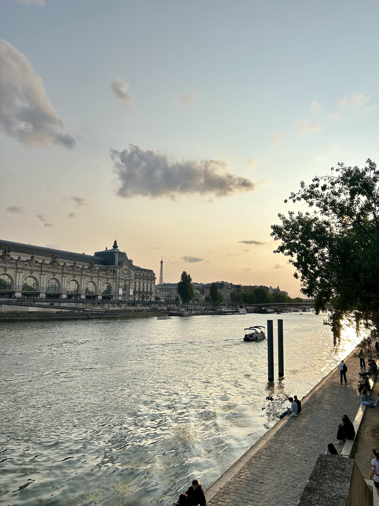

  <figcaption>セーヌ川</figcaption>
</figure>
<figure>

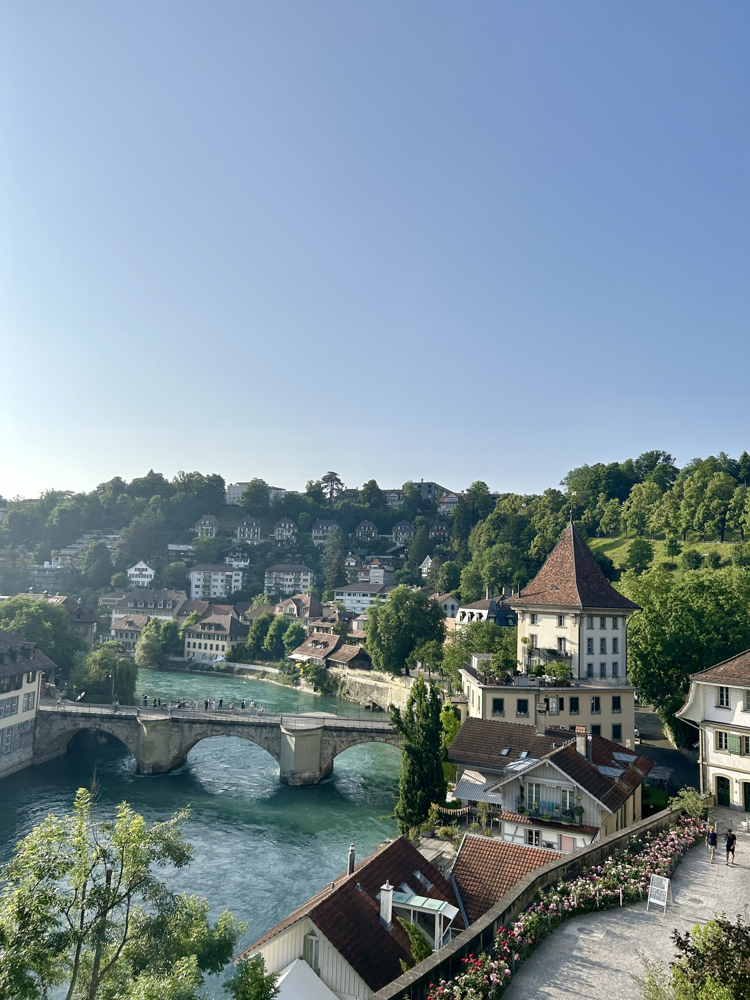

  <figcaption>Aare 川</figcaption>
</figure>

<figure>

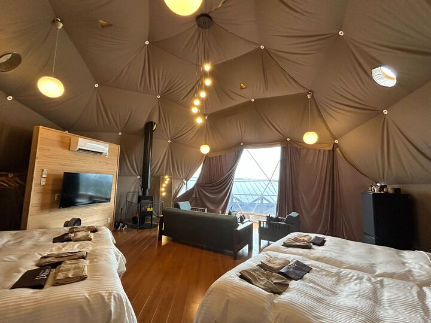

  <figcaption>グランピング</figcaption>
</figure>

 <figure>

  <figcaption>北海道小樽</figcaption>
</figure>
 <figure>

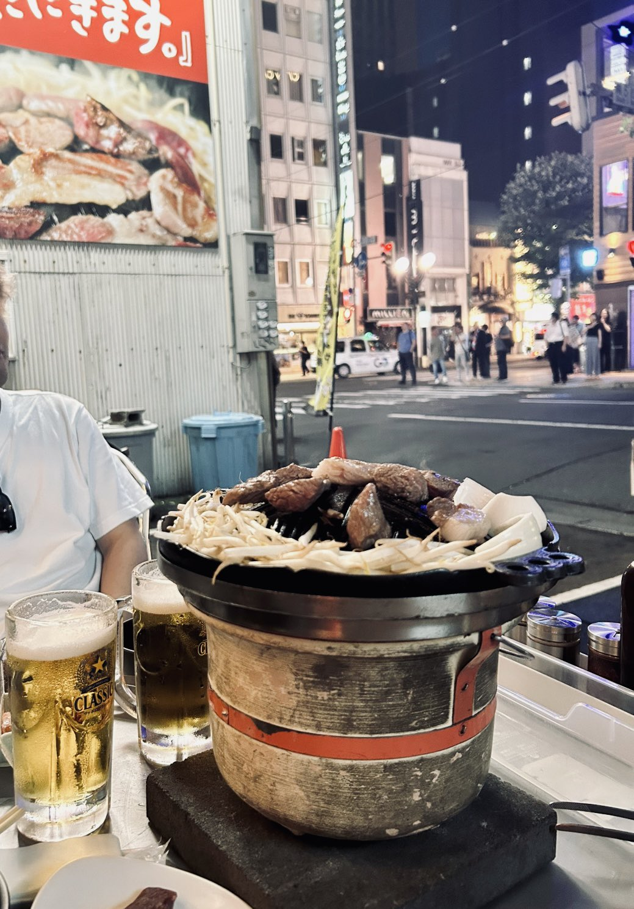

  <figcaption>ジンギスカン</figcaption>
</figure>
 <figure>

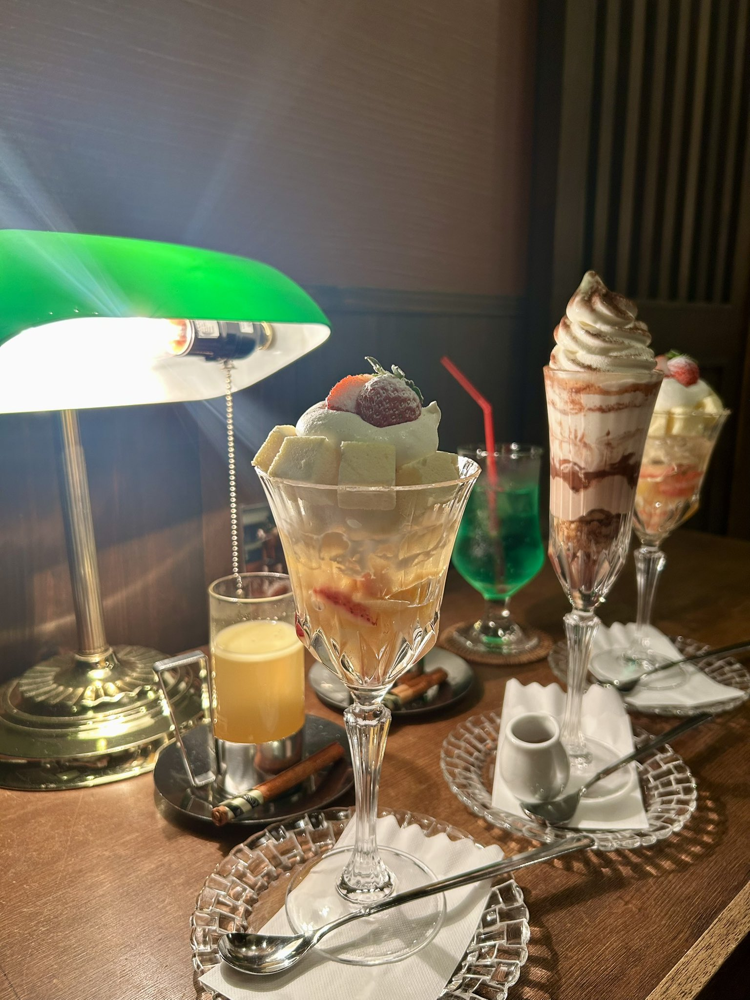

  <figcaption>締めパフェ</figcaption>
</figure>

 <figure>

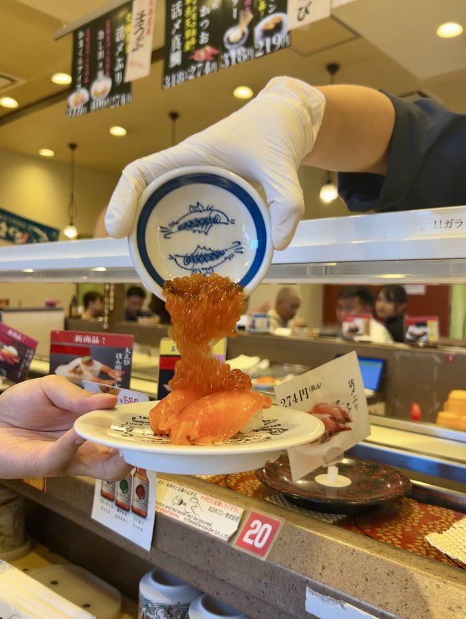

  <figcaption>いくら雪崩</figcaption>
</figure>

 <figure>

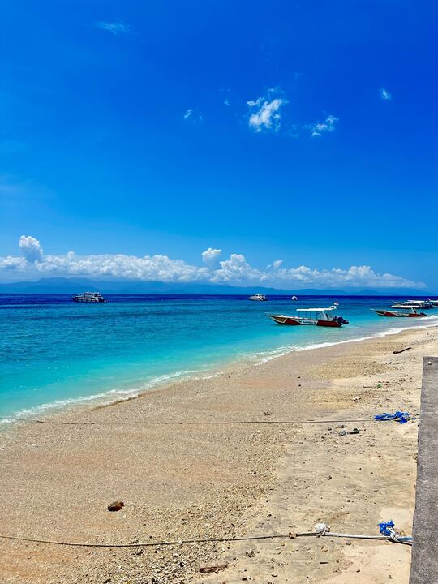

  <figcaption>Penida 島, Bali</figcaption>
</figure>

 <figure>

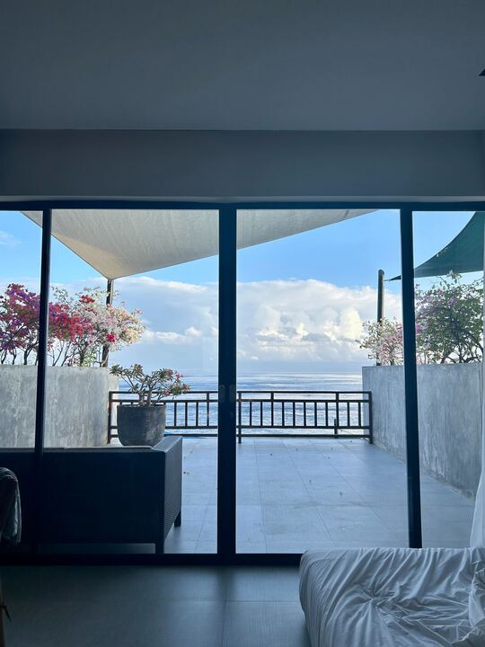

  <figcaption>Penida 島のホテルがよかった</figcaption>
</figure>
 <figure>

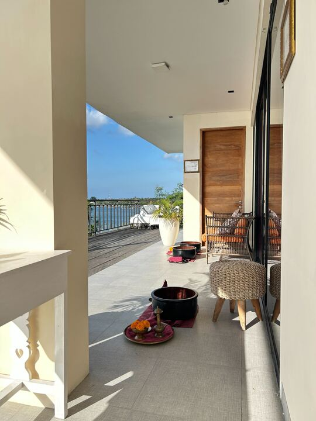

  <figcaption>Penida 島のホテルがよかった2</figcaption>
</figure>

 <figure>

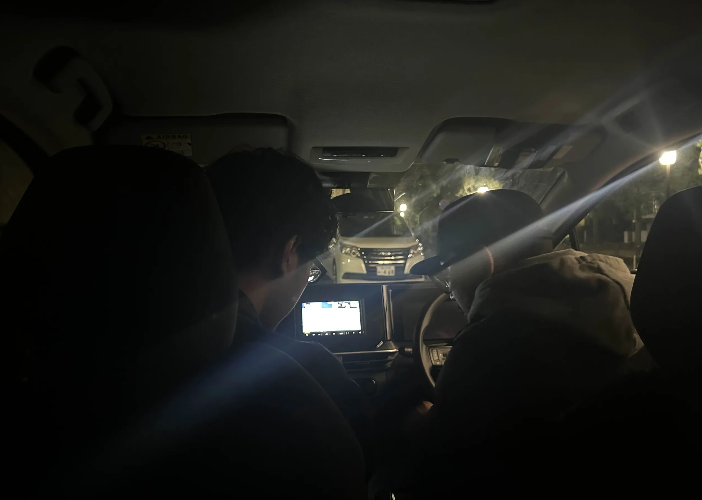

  <figcaption>神戸 to 大阪ドライブ</figcaption>
</figure>

 <figure>

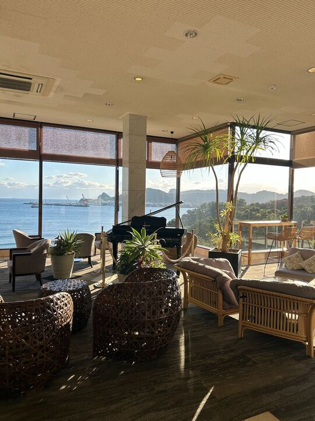

  <figcaption>鹿児島のホテルがよかった</figcaption>
</figure>

 <figure>

  <figcaption>鹿児島</figcaption>
</figure>

 <figure>

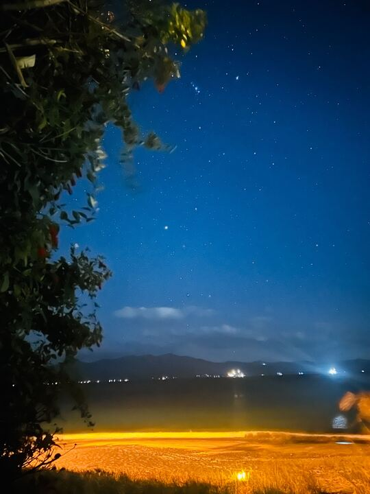

  <figcaption>海辺の星空がめっちゃ綺麗だった</figcaption>
</figure>

### Reading

技術書以外で読んだ本たち。今年は移動時間を使ったりして、結構読んだかも。
センスとか哲学とか抽象的な話を選びがちだったし、言語化とか言葉自体にも執拗な興味があった。うまくなりたい。

- [生きる言葉](https://amzn.asia/d/dC4wy0B)
- [「話が面白い人」は何をどう読んでいるのか](https://amzn.asia/d/4U2u98m)
- [現代思想入門](https://amzn.asia/d/j1Iief7)
- [スマホ時代の哲学](https://amzn.asia/d/gmv92e4)
- [20代で得た知見](https://amzn.asia/d/05ReJRe)
- [センスの哲学](https://amzn.asia/d/fm5tSkR)
- [センスは知識から始まる](https://amzn.asia/d/ilVOZWl)
- [「好き」を言語化する技術](https://amzn.asia/d/a9WjrTO)
- [アルジャーノンに花束を](https://amzn.asia/d/a9WjrTO)
- [アルケミスト](https://amzn.asia/d/i41A5Dw)
- [WHAT SHE SAID](https://amzn.asia/d/8rTvKrH)

来年はまず TBL の新刊を読むところからだ。

## 2025年の振り返りと2026年に向けて

[2024年終わりに目標にしていたこと](https://blog.sakupi01.com/life/articles/2024-lookback#2025%E5%B9%B4%E3%81%AB%E5%90%91%E3%81%91%E3%81%A6)が以下で、それに対する2025年の Result。

- 👀 デザインの勉強
  - Result: あまりできなかった。ただ、業務でデザインと関わる機会が増え、自然と毎日勉強になることが多かった。そういう意味では、ちゃんとインプットはしていた。
- 😵 英語の勉強
  - Result: できなかったし全然ダメだったと思う。たとえば、TPAC のあの WG の議論で、他の参加者と同じくらいのスピードで理解し、思考して、発言できるようになりたい。
- 👀 ブラウザやプラットフォームの勉強
  - Result: 「追うだけじゃなくて、入っていけたら百点満点」と目標していたところを、半分くらい達成できたのかもしれない。Servo にまじで小さな patch を投げたり CSS の仕様を書けたりはしたけど、全然コンスタントにできてるわけじゃない。Form Control Styling なんか今が一番面白い時期なので、来年はこの辺を本格的に頑張っていってみたい。
- ✅ sakupi01.com のリファクタ
  - Result: Done.
- ✅ 家族や友達との時間を大切に過ごす
  - Result: 増えた。充実してた。
- 👀 旅に出る
  - Result: 外には出たけど、なんかもうちょっとその土地の「文化」に身を置く、みたいなことをしたい。この歳だからこそできることをやりたい。バックパッカーとかは、もう無理なんかなあ。

---

2026の TODO

- デザインの勉強
  - 本腰入れてやる
- ブラウザ・標準
  - 標準化にもっと関わる
  - レンダリングにちゃんとコミットしていく
- FEC Fukuoka 成功させる
- 登壇はもっと減らしていいが、やる時は断らずにやってく
- 調整力を伸ばす
  - 横断組織、いい感じにやっていき。自分がいることで、ほとんどの仕事が安定してスムーズに進むか？
- （留学を視野に入れてみたい）

## Fin!

今年は本当に尊敬できる先輩やすごい後輩たちに囲まれて生きてきた実感があって、皆さんのおかげで今年の私がありました。
@Jxck さんがポッドキャストをはじめたくさんの機会をこんな若手に与えてくれたのは謎なくらいありがたかったし、@sakito さんほど自分の専門性を近くで見てくれてる先輩がマネージャなんて普通はあり得ないことだし、@mugi @nus @saji さんみたいな本当に尊敬している先輩たちが会社にはたくさんだし、@daiki みたいななんでも相談できる同期がいてまじで幸せだし、@n13u や @bikiniki や @0yu さん @shinpuku さんみたいな FECF のメンバーもすごく協力的で絶対成功させたいと思えるし、もうここでメンションしちゃっていいのかわからない社内外の先輩や後輩、同期、多分みんなにおんなじくらい感謝の言葉を伝えられる。
この場を借りて、本当にありがとうございました。

そんな人たちに囲まれていたからこそ、すごく頑張れた。「自分の能力が足りてないから」っていうのが理由で拒否したくなる瞬間は正直何回もあったけど、頑張れないわけなかったな〜。

今年の振り返りはめっちゃ仕事の分量が多いけど、きっとこれを読んでいないであろう人たちにもたくさんたくさん支えられてきました。みんなありがとうありがとう〜〜;-;

2026年も引き続き、何かをちょっとだけよくすることを目標に頑張っていきたいです！
「今日より若い日はない！」って誰かが言ってたし。

待ってろ 2026！
