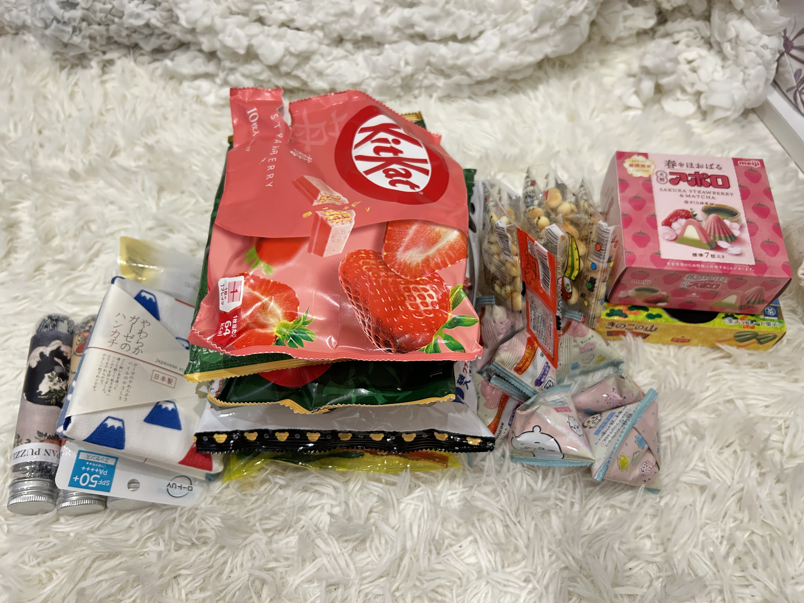
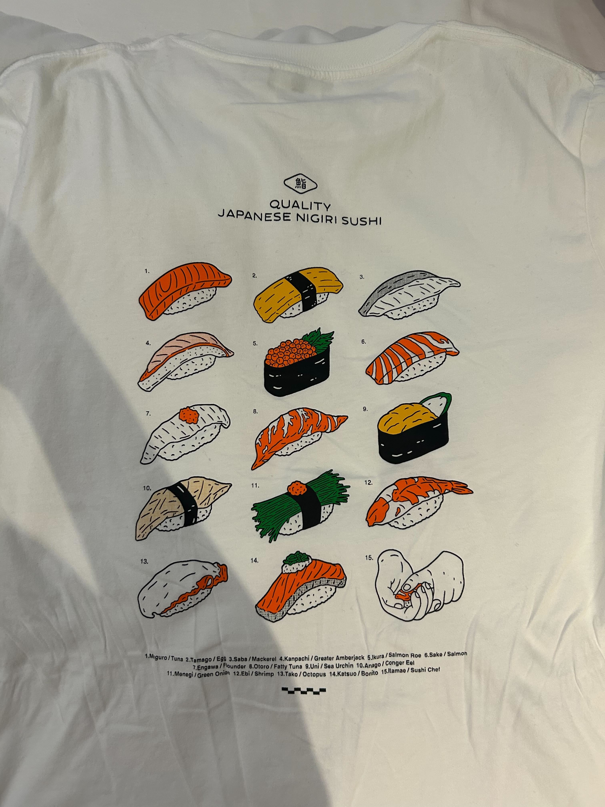
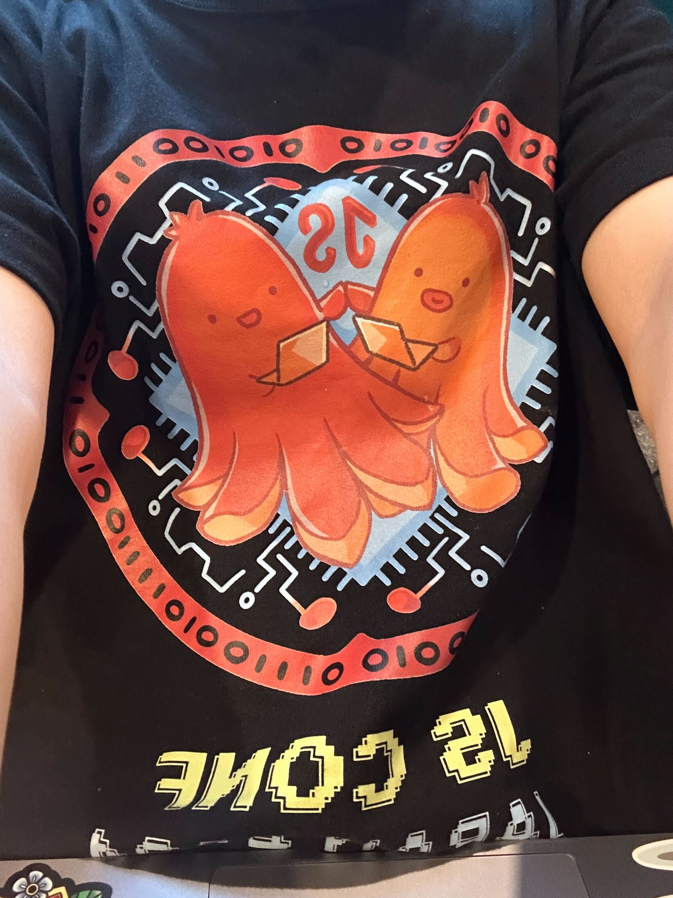
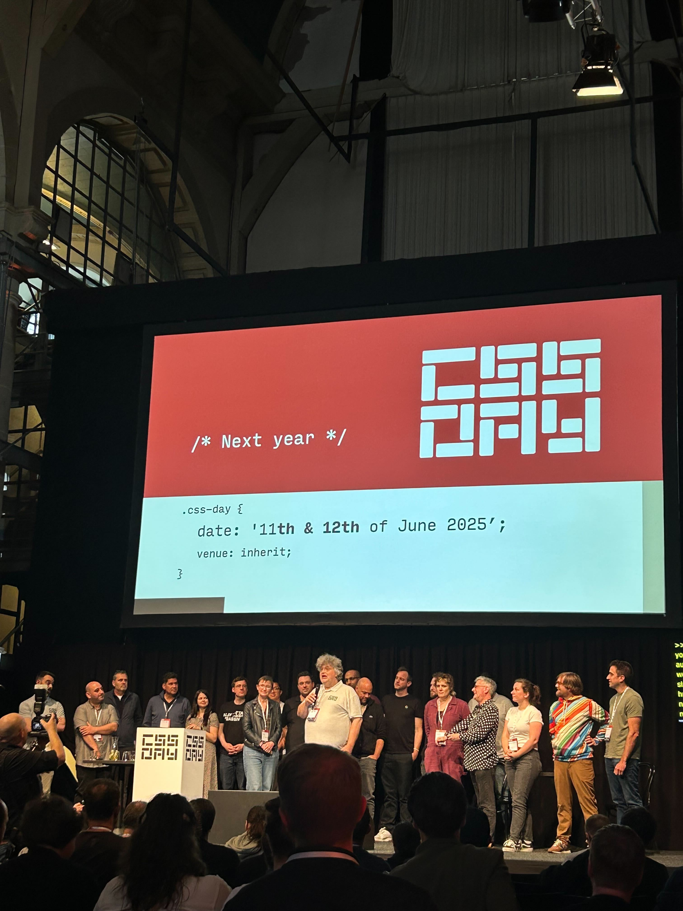

## Table of Contents

## Welcome

2 週間ほど日本を離れてあれこれしてきます。何も残さないのもアレなので、一旦随時更新する感じでつらつらとここに。 
CSS Day への参加がメインイベント、その他は旧友を訪ねたりしています。 
CSS Day に関しては、後日記事にきちんとおこすのでそれを参照されたいです。ここにあまり有益な情報はないので悪しからず。

Welcome to my 7 Hours Behind Diary!

:::note{.memo}
"🌸" ?

Ah, meaning current pointer xD
:::

ここからは唐突のである調で〜

## Day 0, 02/06/2025

### The Day Before The Departure

出発前日。体調がすこぶる良くないので 14:00 で仕事を切り上げる。

きのうテーマパークで体を酷使したのを悔いる。年を重ねるとは。。。

準備が微妙に終わってなかったので準備。日本のお土産をたくさん買った。話のきっかけづくりという意図もある。

*お土産（KitKat が味見されている）*

あとは明日身支度で使うものを入れたらおしまいの状態にする。このパソコンも。

外貨の管理は [Wise](https://wise.com/) のデビットでやっている。3 年前くらいから使っているが、非常に使い勝手が良く、今回も Wise で日本円をユーロに両替しておいた。
オンラインなので手数料が安いし、いい為替のタイミングを見計らって両替できるので、めっちゃ便利。基本的にデビッドで通用するが、キャッシュが必要な時も来るので、着いたら現地 ATM で Wise デビッドから引き出す。日本で換金するよりもお得。

SIM は事前に Amazon で購入しておいた。忘れないようにパスポートケースに入れる。SIM ピンを忘れそうで危なかった。2週間ちょっとで 10GB。ホテルやカンファレンス施設には Wi-Fi があるので、このくらいで十分でしょう。

ひとつ目のハプニング発生。飛行機のオンラインチェックインができなかった。初めて中国南方航空を利用するが、オンラインチェックインできなさそう？だった。（してそうだったけど、会員だけっぽくて、会員になる手順もよくわからなかった）国内線でも前日にオンラインチェックインを済ませる派だが、今回はできなかったので、明日早く空港に行って確認しなきゃ。国際線でこれやりたくなかったなあ。

現地の友達と電話。天候やプランの良し悪しを確認する。今の時期のヨーロッパってワンチャン日本より暑いのか〜。Ams は滞在期間中雨のよう。友人曰く Ams はコースト付近で very windy だそうなので、気温はそこそこだがレイヤリングできる服装で行くといいとのこと。ジャケットを入れる。

電話してたら 23:00 過ぎてしまった。。。明日ちゃんと体調回復してるか、チェックインできるかだけ心配。

## 🌸 Day 1, 03/06/2025

### The Departure Day

羽田に 11:00 手前くらいについて、10分くらい待ってすんなりチェックイン完了。オンラインチェックインできてればこんな早く来ることもなかったけど、すんなり行ったからいいか〜。 
特にすることもなかったので、さっとセキュリティとイミグレーションを済ませて出国！（ここで土地的には日本だけど、外国にいる気分になる）

めっちゃ早く出国したのでラウンジで作業。全然お腹が空かないけど最後の日本食食べとかなきゃと思って、選ばれたのは牛丼でした。（意外とガッツリじゃないか...）

仕事に集中してしまい、ボーディングのファイナルコールのアナウンスが聞こえたので、ゲートにダッシュでなんとか間に合う。

15:40、ここから広州まで約 5 時間のフライト。着席して 1 時間後くらい、毎度恒例意味のわからないタイミングでの機内食。まだ牛が胃の中で鳴いてるよ〜〜って。

雑なググりで酷評だった中国南方航空の機内食とその他サービスは、期待以上だった。ワインが出たり xxゲンダッツが出たり。機内食のチョイスは「Beef with Rise」か「Chicken with Rise」だったけど、前者は明らか「ほぼ牛丼」な気がしたので、チキンで。

*名もなき料理*

広州空港に着陸。Transfer 手続きを済ませる。トランジットエリアのカフェに入る。ここで2つ、ハプニング発生。

Air Port Free Wifi が使えない。。。しんどい。。。まあこれは、いいや、、、ローカルでできることやるし。。。

ふたつめ、換金しておいた💰を使うための Wise デビッドカードがない。忘れてきた。マジか........................................。これは全く予想してなかった。。。てか財布にいないなら家のどこにいるのかわからないのも二重にしんどい。。。 
まあ、どのみち AUS の銀行残高から使っていく予定だったので、現地の友達と会うまでは AUD から使って、友達と会ったら立て替えてもらって Wise でオンライン送金するか？いや、めんどくさいから普通に日本のクレカ使い始めそう。

23:40 のボーディング開始時刻までカフェにステイ。そういえばフロカンのプロポーザル考えてみるか〜、など。

### Schedule

- 15:40(Haneda, Tokyo)
- 19:25(Guangzhou Baiyun, China)

### Stay

Flight Layover

## Day 2, 04/06/2025

### Arrival & Pre-Conference Day

00:20 発のフライトから始まる。ギリギリまでパソコン触っていた。のんびりゲートに行ったら「待ってたよ！！」と。まさかの最終乗客コールされていたらしい。ごめんなさい。

ここからアムステルダムまで 11 時間の耐久フライト。海外本当に若いうちしか行ける自信ない・・・
多分日本時間で 3:00AM くらい。第一次機内食提供。もうもはや何食なのかもわからない時間に出される名のない料理を特にお腹も空いてない胃袋に詰め込む虚無感が、長時間フライトの醍醐味だよなあ〜などとくだらないポジティブシンキングを巡らせる。

*オムレツらしい料理*

マジで寝れないので、QP コーワゴールドαや各種薬を飲んで、今日の体調を危惧する。

着陸 1 時間前くらいに、2 回目の機内食。これも名のない魚料理。お腹は空いてないけど、食べる。

Amsterdam が見えてきた〜〜！無事着陸！

EU へイミグレーションする。入国審査官とのコミュニケーションがウケた。

The Guy: "The purpose of your visit?" 
Me: "For the conference." 
The Guy: "Which conference?" 
Me: "CSS Day conference. It's a conference about CSS." 
The Guy: "What's that?" 
Me: "It's Cascading Style Sheet. It's used in Web browsers to make the Web more stylish!" 
The Guy: "Oh, Okay... How long are you staying here?" 
...

ニヤニヤしながら晴れて入国！baggage belt に行った瞬間荷物がきた。タイミング神。

事前に呼んでおいた Taxi でホテルへ向かう。せっかくなのでいろんな情報を聞く。観光地とか、スーパーとか、食べ物とか、交通周りとか、英語の割合とか、夜外出ていいかとか、聞いておいた。街の建物の歴史なんかも教えてくれた。

アムステルダムはカンファレンスメインなので、観光はあんまりできない。交通はチャリが目立つ。多くない？って聞いたら、彼曰く、やたらとレンタサイクルとかもあって、交通事故防止のために一時期そうしたら一気に増えたらしい。なんかマジで高速2ケツで走ってるし、橋の周りほぼチャリだらけだし、歩行者の人権ないくらいなので、流石に試してみたくなってきた。

*色々教えてくれた気さくな運転手さん*

ホテルに着く。7:30AM くらい。まだ部屋の準備ができてないので、カフェで作業するかと思ったけど、まだ開いてないらしい。「私がコーヒー淹れてあげるからロビーでくつろいでいいわよ！なんのコーヒーにする？」と、Reception の人がめっちゃ気がきくこと言ってくれたので、カフェがあくまでロビーで少し仕事。11時間フライト後、さすがに眠すぎる頭痛すぎる、、、

*優しいコーヒーと待ちに待ったベッド*

8:30 AM くらい、部屋の掃除が終わったから入っていいよと、優しい受付嬢から。部屋に入る、シャワー浴びる、short nap を2時間くらいする。めっちゃ晴れててもったい、かつお腹が空いたので起きてサイクリングを試みる。
今夜は pre-con のイベントがあるので、1日自転車を借りることにした。18ユーロ、予想以上のお値段だったけど、ホテルで断りにくかったしまあいいや。

*一日お世話になるチャリ*

街をサイクリングして、Dutch Pancakes を食べて、運河下りをする。アムステルダムめっちゃ運河の街。ベネチア...？そして建築が本当にヨーロピアンでみてるだけで楽しめる。薄っぺらいのが特徴の Dutch Pancakes もおいしかった。ビールでお馴染みハイネケンミュージアムが運河下の Meeting Point の目の前だったのでチラ見できた。

*アムステルダムの街並み*

*Duch Pancakes*

本当は Anne Frank House と Van Gogh Museum に行きたかったけど、どちらも事前予約が必要で売り切れてた、かつ時間がなかった。またくる理由ができたということで。

そのあとは pre-con のイベント会場へ。会場はアムステルダム中央からおよそ 5km ほど離れた郊外で、チャリで 20 分くらいかかった。太ももパンパン。

*pre-conference・無限に並ぶハイネケン*

*20:30 くらい。信じられないくらい明るい*

そういえば今日は中国にいたところから始まり、アムスに到着し、全力で町中をチャリで駆け回り、カンファレンス前夜祭にいるんだった、、、流石に疲れた。

### Schedule

- 00:20(Guangzhou Baiyun, China)
- 06:35(Amsterdam, Netherlands)
- [`::before{content: "CSS Day"}`](https://www.meetup.com/coven-of-wisdom-amsterdam/events/307063681/attendees/)

### Stay

Amsterdam

## Day 3, 05/06/2025

### CSS Day 1

7:00 AM くらい起床。身支度して朝食へ。今日の服はコレにチュールスカート🧚

*SUSHI T-shirt*

ホテルの朝食めっちゃおいしかった。これがヨーロッパクオリティ・・・？？？ Sourdough Bread 日本にも普通に売ってて欲しいんだよなあ、、、

*Breakfast*

いよいよ待ちに待ったカンファレンスへ！！！

会場くらいにいったので、一旦その辺にいた人たちと話す。French と Swiss の銀行でデザインシステム作ってる人たちだった。デザインシステムの重要性わかってもらうの難しいよね、みたいな話をしてた気がする。

トークとか、その感想とかメモはあとで別記事にまとめるので、ここでは割愛。

現地参加した何よりの理由、ここでしかできない話をすること。気合い入れて話すことリストみたいなの作って行ってたけど、割と自然にいっぱいディスカッションできて最高だった〜！！
今日話してくれた人たち。

- Una Kravets(Chrome の CSS 系 DevRel。I/O で Web UI の発表してたり)
- Rachel Andrew(Chrome の CSS 系 DevRel. Baseline。multicol や reading-flow など Layout 系の標準化)
- Sacha Greif（State of なんとかの作者）
- Eric Leese (devtools のひと)
- Philip Walton（baseline-checker の作者）
- Miriam Suzanne（Sass. CascadeLayers, Container Queries. if/function/mixin）
- Brecht De Ruyte（OpenUI, Customizable Range）
- Tim Nguyen（Form Control FPWD issuer, WebKit, Dialog Element, Popover API, View Transition API implementer）

*（左から）Una, Sacha, Mia*

写真をちゃんと撮らなきゃ。話した内容忘れたくなくて、速攻仲良くなった人たちにアウトプットしに行ったり、メモに走るから写真撮ってもらうの忘れる。

Mia とのやりとり忘れたくなさすぎて、懇親会一旦抜けてパソコンしてたら、”Are you playing something with CSS?” って Brecht から話しかけにきてくれた・・・！！！そんなことある？！

こっからがすごくて、今日のトークのこととか、OpenUI での Range の proposal が難しいっていう話とか CSS Carousels の A11y の話とかしてたら、登壇者限定のバッジとステッカー、登壇者が選んだ人だけにあげれるんだけど、きみにあげるよ！って言ってくれた！嬉しかった〜〜！

*Brecht がくれたステッカーとバッジ*

### Schedule

- CSS Day Conference Day1: <https://cssday.nl/>

### Stay

Amsterdam

## Day 4, 06/06/2025

### CSS Day 2

流石にめっちゃ疲れた感じの朝だった。毎日 QP コーワゴールドα を飲んでるけど、効いてるのかどうかわからない。とりあえず、身支度してカンファレンスへ。
今日はタコさん T-shirt にジーンズ。

*タコさん T-shirt*

今日はこんな人たちと話せた〜！

- Brad Frost （Atomic Design, Global Design System）
- Tim Nguyen（Form Control FPWD issuer, WebKit, Dialog Element, Popover API, View Transition API implementer）
- Josh Tumath（OS-level font scaleのenvやってる, BBC Design System）
- Bramus（Google の DevRel。 Scroll Driven Animation, View Transition。 I/O でアニメーション系の発表してたり）

*（左から）Brad Frost, Brecht と Ian Frost, Bramus*

Tech 的にお腹が満たされた話は、しかるべきブログでまた。Tim とはめっちゃいい話できたなあ〜〜。Brecht ともめっちゃ仲良くなって、次の行き先のおすすめスポット教えてくれたりした。

とりあえず、そんな感じで、今日はちゃんとブログ残せた。えらい。寝る。CSS Day 最高だった。仕様作ったり、実装したり、Web をゴリゴリ作ってる人たちと、こんな近くで生でたくさんディスカッションできるなんて正直思ってなかった。
本当に行って良かった〜〜〜。実現してくれた会社の人たちに感謝しかない。

*The End of CSS Day*

### Schedule

- CSS Day Conference Day2: <https://cssday.nl/>

### Stay

Amsterdam

## Day 5, 07/06/2025

### Post-Conference Day & Move To Brussels

...

### Schedule

- [CSS Cafe](https://www.meetup.com/css-cafe/events/305756748/)
- 17:03 Amsterdam to Brussels 19:03

### Stay

Brussels

## Day 6, 08/06/2025

### Today's Summary

...

### Schedule

...

### Stay

...

## Day 7, 09/06/2025

### Today's Summary

...

### Schedule

...

### Stay

...

## Day 8, 10/06/2025

### Today's Summary

...

### Schedule

...

### Stay

...

## Day 9, 11/06/2025

### Today's Summary

...

### Schedule

...

### Stay

...

## Day 10, 12/06/2025

### Today's Summary

...

### Schedule

...

### Stay

...

## Day 11, 13/06/2025

### Today's Summary

...

### Schedule

...

### Stay

...

## Day 12, 14/06/2025

### Today's Summary

...

### Schedule

...

### Stay

...

## Day 13, 15/06/2025

### Today's Summary

...

### Schedule

...

### Stay

...

## Day 14, 16/06/2025

### Today's Summary

...

### Schedule

- 15:40(Geneva, Switzerland)
- 10:40(London, England)
- 19:25(London, England)

### Stay

Flight Layover

### Today

## Day 15, 17/06/2025

### Today's Summary

...

### Schedule

- 05:40(Beiging, China)
- 09:05(Beiging, China)
- 13:40(Narita, Tokyo)

### Today

ARRIVAL!!!

## Overall
