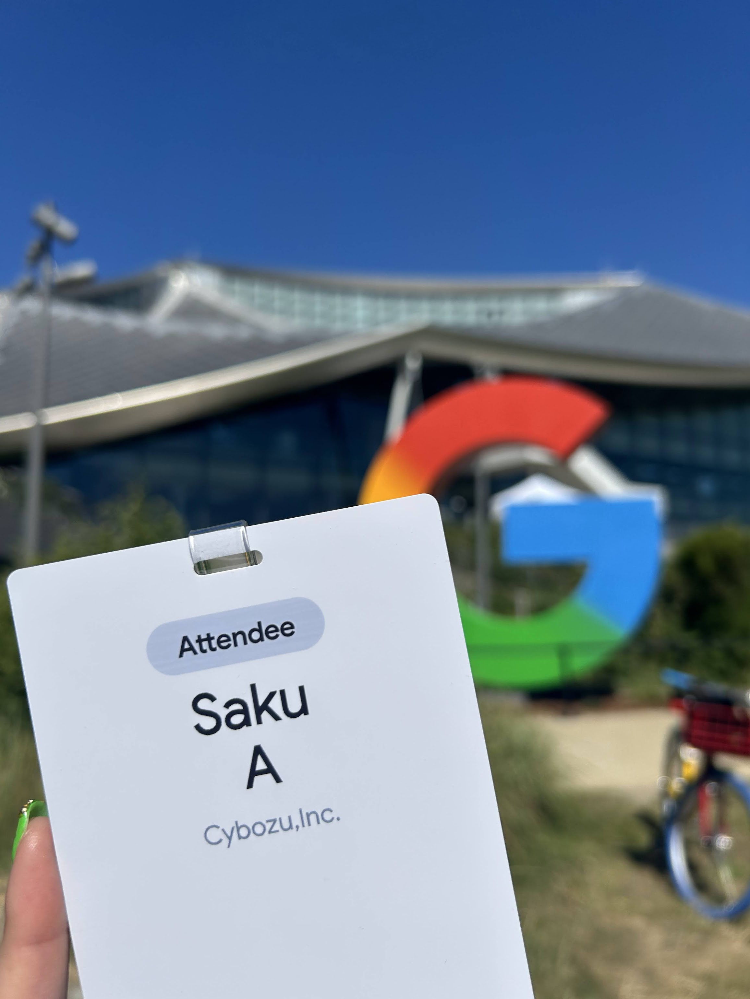
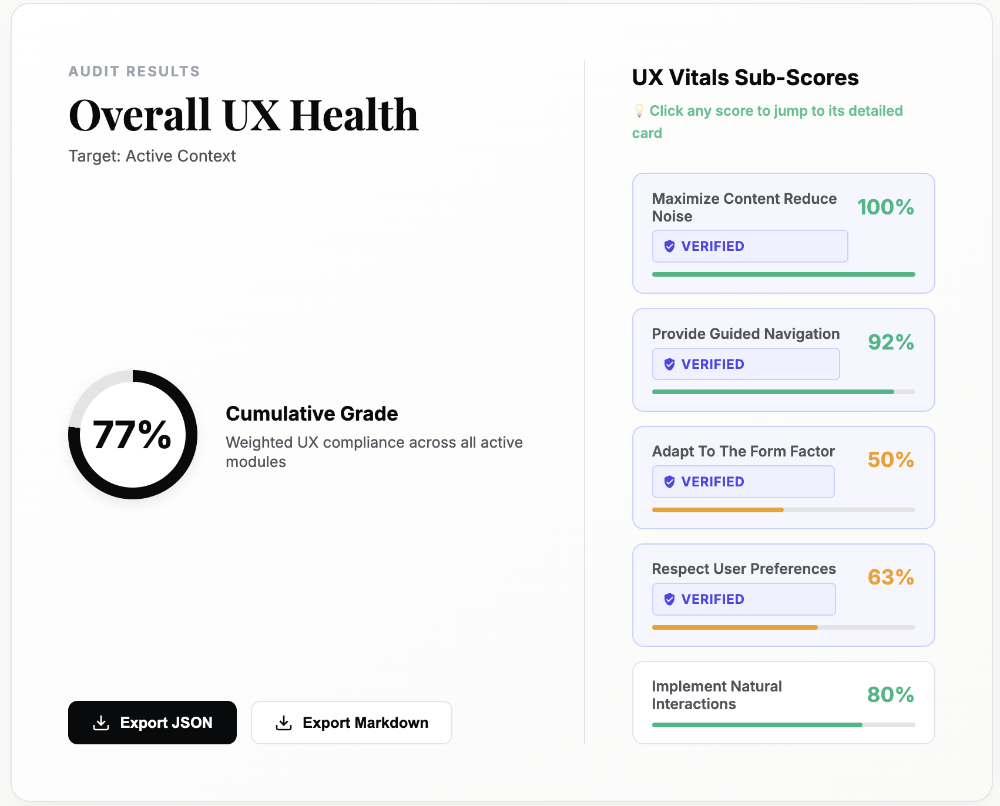
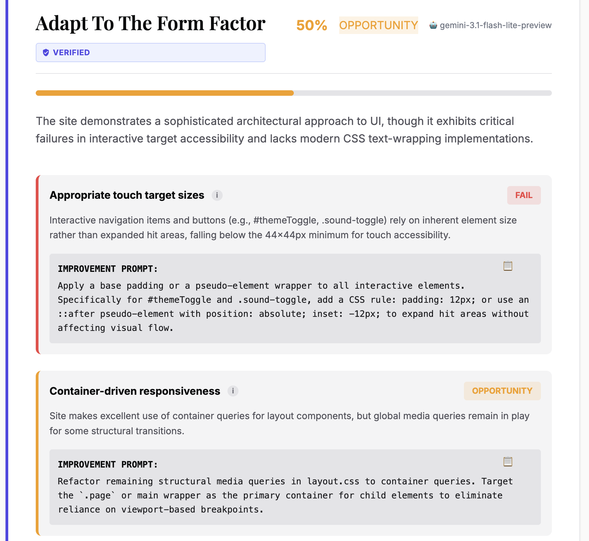
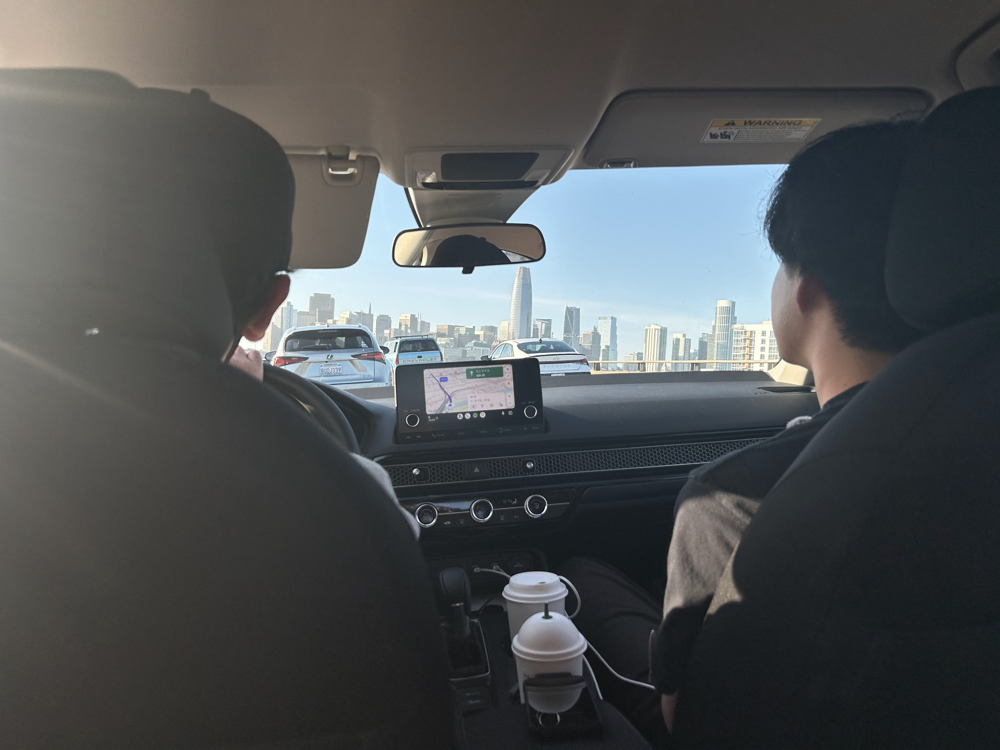
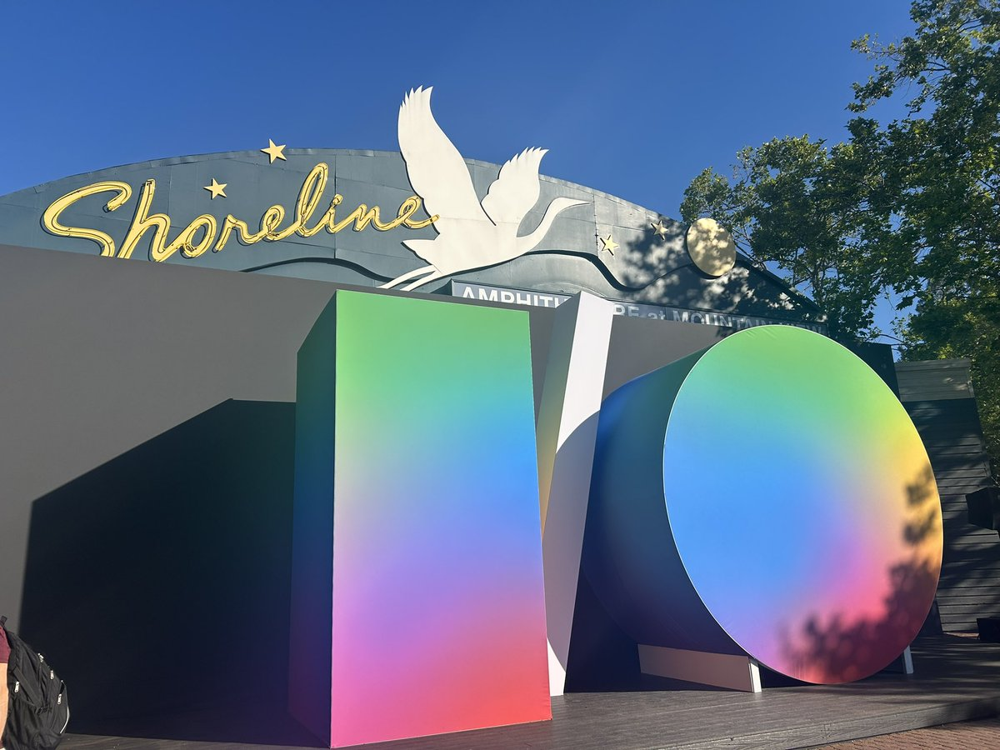

## Table of Contents

## Welcome!

1 週間ほど日本を離れてあれこれしてきます。何も残さないのもアレなので、一旦随時更新する感じでつらつらとここに。
メインで参加するイベントは Google I/O ですが、そのほかにも色々と徒然なることをまとめておこうと思います。後で見返して面白いので。
きちんとしたものは、また会社のブログにでも書くと思います。多くの人にはそちらを参照されたいです。

San Francisco と日本は時差が 16 時間もあるので日付が重複して書きにくい！

## Day 1, 17/05/2026

### The Departure Day & The Arrival Day

今回は割と短めの海外なので準備をギリギリまで甘く見ていたら、案の定色々と膨れ上がり、結局前日は１日かけて準備をする羽目に。兄弟が家に泊まりにきていたりで、結構バタバタな出だしになってしまいました。
ESTA の印刷なども念の為しておきたかったので時間に余裕を持って出たら、予定よりも早く空港に着いてしまいました。「物価安いうちに Subway でエンジョイしよう！」と思ってゆったりしていたら、余裕で私が一番遅いことになりました。やれやれな出だしです😅

チェックインでなかなか顔認証ができずに大変だったのですが、メンツと合流して余裕を持ってセキュリティとイミグレーションを通過。
今回は５人くらいで一緒に行動します！めちゃくちゃ不安が少ないです！海外は色々と経験がありますが、アメリカは初めてということで、めちゃくちゃ楽しみ！

システム名は忘れてしまったのですが、今は顔認証でチェックインができるところもあるみたいですね。めちゃくちゃスムーズでした。

今回は国際線で初めて国産エアラインを利用します。機内のアナウンスが日本語で安心感半端なかったです。
あと、日本発国産エアラインなだけあって機内食が全部美味しい。

今回は9時間25分の旅。トランジットがなく追い風なので、早いです。
本を読んで、ご飯を食べてぐっすり寝ようと思ったのですが、なんかずっと足がふわふわして気になってしまい、結局全然寝れませんでした😭
代わりに本を一冊読めたのと、ウィキッドの後編を観れたので、それは良かったです。

そして、北アメリカ大陸が見えた時の感動！！やっぱ到着直前にその国の生命の営みが見えたときは「あ〜、世界にはこんなにも広くて、私はまだそのほんのちょっとも知らないなあ」という感られて、めちゃくちゃ泣きそうになってしまいます、、、

日本とサンフランシスコの時差は16時間もあります。日本を日曜日の PM4:20 に出発したのですが、着いたのはサンフランシスコ時間の日曜 AM9:45 でした。１日が２回くる感じで、大変きついです。

知り合いの Googler の人と合流して、レンタカーを借りてみんなで Mountain View 付近まで移動します。SFO は Mountain View から離れていて、高速使って1hかからない程度です。サンフランシスコでは無人車「WAYMO」が走っていました。上のセンサーがぶんぶん回っている。

まずは腹ごしらえということで、Amphitheatre 近くの「IN-N-OUT Burger」に行きました！全然知らなかったんですが、アメリカで有名なバーガー屋さんみたいですね。店内は現地の人でも賑わっていました。
バーガー・ポテト・ドリンクのコンボを買ったのですが、ドリンクはセルフサービスで注いでね、という感じでした。これやったら何杯でもそそげてしまうやん、、、。

コストコを見ながらピクニック形式で食べる IN-N-OUT は、The アメリカンでめっちゃ美味しかったです！ところで、アメリカのバーガーはどこでもバンズがカリカリですね。これめっちゃ好きなので、日本でもやってほしい・・・！バンズカリ化！

そのあとは Google, Apple のビジターセンターに行きました。Google 本社ついに〜！信号機まで「Google」で、本当に一つの「街」ですね。

:::figure[Google と Apple のビジターセンター]

:::

:::figure[Google HQ のドロイドくん・Google 信号機など]

:::

The Internship という映画で見たことがあった Gbike（リアル）を見れたときは、結構テンション上がりました。Google HQ を初めて見た時は「こんなオフィスでかかったら、移動大変で出社したくなくなってしまう、、」が率直な感想だったんですが、まあよく考えなくとも大学もこんなんですね笑

Google も Apple もビジターセンター以外には入れる感じではありませんでした。

そのあとはトレジャージョーズという現地のスーパーを一瞬見て、ブラックブレッドっぽいのがあったので自分用のお土産として購入しました。海外行くとブラックブレッドが手に入って嬉しいです。
疲れたので、みんなで夜ご飯のサンドイッチを買ってホテルへ〜。

部屋の広さは申し分なかったのですが、めっちゃ寒いのとめっちゃシャワーが出ないのとで結構困りました。
あと、サンドイッチのボリュームがめちゃくちゃあってびっくりしました。さすが3500円分なだけある。食べきれなくて半分冷蔵庫へ、、、（その後食べられることはなかった）

そのあとは結構すぐ寝て、10時間くらい寝ました。おかげで時差ボケは完璧になおりました！

## Day 2, 18/05/2026

めっちゃ早く寝たのでめっちゃ早く起きました。6:30起きです。ご飯を食べ、軽く作業をしてみんなを待ちます。
自分で焼くワッフルがめっちゃもちもちで美味しかったです。この素何処かで売ってたら買いたいな〜。

今日は I/O の Early Check-in をします。当日やると結構混むので、前日にやるのが基本っぽいです。受付わくわくします！

:::figure[Find Your Way の看板と受付を済ませたらもらえる I/O pass]

:::

ノベルティも回収しました。前年参加している人曰く、品が薄くなったようです。かっこいいいタンブラーとかわいい謎の紐が入ってて、個人的にはめっちゃ嬉しかったです！

登録を済ませたら、新型の Gbike がいっぱいあったので乗って、案内してもらいながら Google のメインビルディング（名前忘れた）まで一周！この Gbike ライド体験も去年はなかったらしく、ラッキーでした🚲💨✨
Mountain が見渡せて、the 「Mountain View」だな〜という感じの爽快なサイクリングでした。
ビルディングは閉まっててかつ社員を連れてないと入れなかったのですが、それっぽい写真はたくさん撮れて良かったです。

:::figure[GBike でサイクリング！]

:::

そのあと Intel Museum に行きました！本当は Computer History Museum にいく予定だったけど、休業日らしかったです。道中には、「the シリコンバレー」みたいな企業の HQ がたくさんありました。MS、Meta、LinkedIn、Digicert、etc.

Google の Cafe に戻って昼食を済ませます。
急遽当日に Chrome チームが集まるパーティーのお誘いがあり、前々から約束していた予定をキャンセルしてそっちにいくことになりました。先約が大変に融通をきかせてくれたおかげで、予定は水曜夜に延期になりました。大変、大変ありがたかったです。

そのあとは Stanford University にいってきました！見所が多くて、大きな広場や教会、ショップなどがありました。暇だったら行きたいな〜くらいだったのですが、本当に行っておいて良かっ場所の一つです！

:::figure[スタンフォード大学。めちゃくちゃ綺麗で見どころが多い]

:::

そのあとは、Amphitheatre 周辺に戻って Chrome チームのパーティーでした。Chrome の PM を中心に 50 人くらいがいたんじゃないかなと思います。

Una や Bramus もいて、たくさんしゃべれて良かったです！！
そのほかにも Kadir とは翌日発表がある Modern Web Guidance の話や Baseline の話をしたり、Philip Walton と Baseline の話をしたり、挨拶とかまで含めると、いつも dcc や web.dev でお世話になっている本当にいろんな人と話ができました。

Paul Irish とは、彼が昨年から I/O に向けてリードをしていた Modern Web Guidance について話していました。現状 Google 内や Google が呼びかけた個人に限定された知見を大半ににガイドのスキルが作成されていますが、それでは Google 社内のみの知見に頭打ちされるし、仕様や MDN などにも潤沢なリソースはあるはず。ガイドを育てる対象が一般に開かれることで、より多様なユースケースに対応した質の高いものができるのでは？また、日進月歩で進化するウェブに、このガイドがどうやって追随していくのか？Chrome Platform Status にガイドの更新を同梱する展望もある。そんな議論をしていました。

- modern-web-guidance-src/CONTRIBUTING.md at main · GoogleChrome/modern-web-guidance-src
  - https://github.com/GoogleChrome/modern-web-guidance-src/blob/main/CONTRIBUTING.md

色々な人といろんなテーマで喋っていましたが、結局 Paul と一番喋っていた気がします。

あ、Nour Nabil ともわりと話していました。彼は Privacy Sandbox などをフォーカスしてやっていたみたいです。自分はそのあたりは詳しくないので話せなかったのですが、Privacy Snadbox が終わった今は Web UX 周りの仕事をやっているみたいでした。そこで、まだ大々的に公開されてはいないものですが、彼が今作っている UX Vitals Auditor をチラ見せしてもらいました。AIの文脈で機械可読に焦点が当たる昨今において、ヒューマンユーザの体験を測る新しい概念「UX Vitals」。どういう文脈で Google がこういう取り組みをやっているのかは聞きそびれましたが、「ウェブではヒューマンユーザにとってのコンテンツのクオリティを守る」という姿勢を感じられるもので、とても良い取り組みだと思いました。これが SEO のスコアに繋がる未来になるのかも、と考えるのは邪推しすぎでしょうか。

UX Vitals Auditor はサイトの UX スコアと改善点を出してくれます。改善プロンプトを出力してくれ、お手元の Agent にお願いするだけで指摘事項を改善してくれる優れものです。手軽に漏れている点を改善できて良さそうでした。

:::figure[blog.sakupi01.com で試した総合評価（77%）。欠陥を指摘し、改善ようプロンプトを出してくれる]

:::

今なら Gemini API キーなしで使えるようにしてあるらしいので、ぜひ。

- UX Vitals Auditor - Premium Quality Insights
  - https://chrome.dev/ux-vitals-auditor/

その後、少数チームでの Sushi 会にも誘われたのでいってきました。が、予定より人数が増えてしまって別席になってしまいました😂
Mountain View のお寿司は高いけど、とてもクオリティが高くて美味しかったです。さすが $44 って感じでした。いちいち金額覚えるのやめたいです。

帰りはナビをしたのですが、下手くそすぎて文句しか言われなかったのもいい思い出です😚（そこから一回も助手席のせてもらえなくてぴえん）

まだ I/O 始まっていませんが、ここまででこんなにたくさんの人と会ってディスカッションできて、相当な充実度からの疲弊が半端なかったです。やっぱ現地は最高です。

## Day 3, 19/05/2026 (Google I/O Day1)

Google I/O １日目！！🥳
朝の戦略はこちらです：

7:00 / ホテル出発（朝食は会場で摂る予定）
7:30 / 会場到着。セキュリティチェックなどを済ませ、開場を待つ。
8:00 / 開場。朝食が並んでいるので摂る。キーノートの列に並ぶ。
9:00 / キーノート開場のメインテントに入る
10:00 / キーノート
Followed by schedule...

- Google I/O 2026
  - https://io.google/2026/

I/O 当日は、レンタカーや Uber で道と駐車場の激混みが予想されたので、朝食も取らずに結構早めにホテルを出ます。
この時間帯に出ると道はまだそこまで混んではおらず、比較的スムーズに到着できましたが、駐車場にはもうすでに車がいっぱいでした。あ、駐車場はただっ広い草原なので、場所をどうにかして記憶しておかないと帰りに結構つらいことになります。
I/O の入り口はセキュリティが強固な感じになっていました。抜けると、Amphitheatre が・・・！でっかい I/O の文字がチラ見えして、いよいよテンション上がりますね・・・！🤩
入場３０分くらい前？についたのですが、結構人が並んでいました。

Breakfast は結構簡易な感じだったので、次の日はホテルで食べてこようとなりました。

キーノートの列に30分くらい並びます。Keynote pre-show というのが待ち時間の暇つぶしをしてくれます。YouTuber みたいな人たちがゲームをしていました。

そんなこんなで、CEO Sundar Pichai の登場から始まる Keynote で I/O 2026 がキックオフ！配信で見てた世界が目の前に現れるの、流石に感動すごいよ・・・！

今年も Gemini 関連の新機能・新プロダクトの発表が主でした。やっぱそうだよね〜というのと、検索＆Antigravity は結構面白嬉しいなと思いました。値段次第なとこありますが、Intelligent Eyewear ほし〜！

- Google I/O 2026: Sundar Pichai’s opening keynote
  - https://blog.google/innovation-and-ai/sundar-pichai-io-2026/

メインステージでの席は、まず文字起こしが見えやすい左前を選びました。文字起こしは右前でもされてそうでしたね。見え心地はこんな感じで、ちょっとスピーカーから遠くて画角が急かもしれません。Developer Keynote は中央付近から聴講しました。

Developer Keynote では Antigravity とそのほか AI 関連の機能が feature されている感じでした。その中で唯一ピュアな Web の機能として feature された HTML-in-Canvas はやっぱめっちゃ注力してやってたんだなと思いました。

ウェブ的に一番嬉しいのはやっぱり Modern Web Guidance かな〜。プラットフォームが頑張って、新しいウェブの機能がでても、AI から利用されるには時間的なギャップがあったり、CSS や HTML のような Web UI を作る言語はどうしても AI が弱かったり、昨今プロダクションに新しい機能を採用するには Baseline のようなプラットフォーム固有の事情や知識が必要だったりします。AI 開発時代、ここがかなり AI の弱点だなと思い続けてきました。
そこで出てきた Modern Web Guidance は求めていたものだったし、標準側にも利がありそうな話で、互助のきっかけになって欲しいな〜！と思います。
各自必須の skills として入れておいて損はなさそうです。

Modern Web Guidance 含め、Agentic Web Development tools としては以下がアナウンスされましたね：

**✨ WebMCP**: Webページを Agent 向けのツール提供側として機能させる
**✨ Chrome DevTools for Agents**: Devtools の情報を用いてデバッグ・自動操作を可能にするためのツールセット
**✨ Modern Web Guidance**: エキスパートの知見をギュッと詰め込んだ、モダンウェブ開発のベストプラクティススキルセット

- 15 updates from Google I/O 2026: Powering the agentic web with new capabilities, tools, and features in Chrome  |  Blog  |  Chrome for Developers
  - https://developer.chrome.com/blog/chrome-at-io26
- WebMCP  |  AI on Chrome  |  Chrome for Developers
  - https://developer.chrome.com/docs/ai/webmcp
- Modern Web Guidance  |  Chrome for Developers
  - https://developer.chrome.com/docs/modern-web-guidance
- Chrome DevTools for agents  |  Chrome for Developers
  - https://developer.chrome.com/docs/devtools/agents

そのあとはテントを回りながら Chrome Session を聴いていました。Chrome テントではまた Paul Irish がいて、立ち話をしていました。特に AI Agent への対応とモバイルデバイスへの対応の関連については、かなり建設的な議論ができて印象的でした。

:::figure[晴れであることを前提にした設備たち・AI Sandbox]

:::

:::figure[Chrome/Android/AIテント]

:::

こんな感じで Chrome, Cloud, AI, Android のテント, AI Sandbox などがあり、それぞれのdemoを体験できたり Googler とキャッチアップができたりします。未公開製品を扱う AI Sandbox は waitlist 制で、順番が来ても中で一時間くらい待つそうです。自分は今回は体験できませんでした（泣）

なんかめっちゃいい感じの配信ルームがあったので、ポッドキャストを撮りに行きました。キーノート直後のお昼は、報道関係の人がいっぱいいて利用できなかったのですが、帰る直前に行ったら撮れました。蒸し風呂みたいでめっちゃ暑かったです。生まれて初めて肉まんの気持ちになりました👯‍♀️

帰ります。Eureka! というところでディナーをしました。後日聞いたのですが、結構有名なチェーンらしく、おしゃれでとってもおいしかったです！

:::figure[Eureka! でのディナー]

:::

死んだように寝たかったのですが、上の階から軋む音がめっちゃしてゼンゼン寝れませんでした。辛い。

## Day 4, 20/05/2026 (Google I/O Day2)

I/O 2日目！☀️ 空は飽きずに朝からガンガン晴れてます。
1日目のようにキーノートはなく、並ぶ必要がなさそうだったので、ホテルで朝食をとって会場に向かいました。AM 10:00 からセッションがスタートのところ、9:45 くらいに到着だったので結構ギリでした。

2日目は待ちに待った「**What's new in Web UI**」でした！例年わりと Una が一人でやっているのですが、今年は Bramus と二人でした。

そして今年はなんと、会社の事例をセッションで取り上げてもらいました！！！🎉こうやって名誉あるグローバルな場で、会社の事例を取り上げてもらえるなんて思っていなかったので、嬉しかったです・・・！
そういえば、昨日の Chrome パーティーの時に Una に感謝を伝えたら、「調査レポートが詳細で助かったよ〜！私たちもつかてもらえて嬉しい、ありがとう！」と言ってくれました。

https://x.com/sakupi01/status/2057152818877014410?s=20x

https://www.youtube.com/watch?v=uT7MVcCQ4rw

- Introducing the HTML-in-Canvas API origin trial  |  Blog  |  Chrome for Developers
  - https://developer.chrome.com/blog/html-in-canvas-origin-trial
- Declarative partial updates  |  Blog  |  Chrome for Developers
  - https://developer.chrome.com/blog/declarative-partial-updates

お昼ご飯を食べて、Addy の 「A fireside chat on the evolution of the developer craft」 を聴講に。AI時代、ものづくりが民主化され、エンジニアとしてなにを「Reskill」し、なにを「Deskill」するのか。Deskillする上で「Cognitive Surrender」をすることなく、AI と人間が「Mutual Amplification」をするにはどうしたら良いのか。このあたりが主に議論されていた気がします。
I/O 全体を通して頭っから AI 激推しでしたが、ここで唯一、我々の目線に立った AI の批判的解釈（いい意味で）が聞けた気がしました。AI 開発時代、開発者としてのマインドの持ちようを改めて整理できた時間でした。Addy はこういう話を最近ずっと Blog に書いてくれていますが。

https://www.youtube.com/watch?v=VTYx7Ex-0bA

この日はセッションがそんなになかったので、早めに引き上げて Computer History Museum に行きました！「ENIAC Programer とか、かっこよすぎて言ってみたいよねw」などと話していたら、デモセッションで横になったおばあちゃんが「私はこのプログラムを書いてたんだよ」と、言っていてまじでびっくりしましたw
デモセッションはパンチカード計算機について学ぶものでした。当時こうした職業に就く人には女性が多かったことから、「誰か女の人でアシスタントやってくれない？」となりました。めっちゃ近くにいたせいで選ばれてしまったので、みんなの前で体験してきました😂 こんなに typo しないか緊張したのは初めてでした笑

喋りながらゆっくりみていたせいで、パーソナルコンピュータ以降で閉店時間が来てしまい、それ以降きちんと見れませんでしたが、来年また来る理由ができました！CHM はとっても良かったです。

めっちゃ歩いて疲れたので、スタバに行って円換算したくないほど高いコーヒーをグラブして、SF でのご飯会に向かいます。
道中で I/O 感想戦ポッドキャストを収録します。お昼ご飯の時にかなるんさんがサングラスをかけた犬の話をしていて、当時はそんなに笑えなかったけど、このとき聴くとなぜか面白くて実はちょっとツボに入っていました😂

<!-- リンク -->

SF の駐車事情は難しいですね。困惑しながらも、niwa さんに予約してもらったレストランに到着。

- Everything You Need to Know About Parking Your Car In San Francisco | San Francisco Travel
  - https://www.sftravel.com/info/everything-you-need-to-know-about-parking-your-car-san-francisco

すごく素敵なレストランで、「ここだけの話」がたくさんできたとても良い時間でした。niwa さん本当にありがとうございます。

:::figure[Dinner with niwa-san]

:::

そのあと、アザラシを見に行きました（私のわがままを聞いてくれまして🥲）！！！
SF の Pier 39 にはこんなふうにめっちゃアザラシがいます。鳴き声も含めて、キモかわいくて最高でした！でもそれ以上にカモメが飛んでいて、フンの落下がこわくてダッシュしたのもいい思い出です。

Mountain View に戻る車中では、眠気覚ましに「ここには間違っても書けない話」を順にしゃべっていきました。誰も録音していないと信じています。

## Day 5, 21/05/2026

早朝から SFO へ出発です✈️
4泊を共にした Best Western Silicon Valley ともお別れ。帰り道はいつもちょっと寂しいです。邦楽の、朝っぽい車内 BGM として選ばれたのはミセスでした！

５日間お世話になったレンタカーを返却して、出発ロビーへ向かいます。初日に書き忘れてたのですが、 SFO では Air Train が走っていて、ターミナル間を電車で移動します。
スムーズにキャリーをチェックインして、セキュリティへ。私としたことがお水を捨て忘ていて、人生で初めて保安委員に連れ戻されました。
出発まで時間があったのでお土産を買います。SFO は結構お土産屋さんがある方だと思いますが、スーパーで売ってそうはお菓子屋酒類などは売っていなかったので、もうちょっとちゃんとスーパー行っておけば良かった、、、。
これを書いたり、仕事をしたりしながら、出発までの時間を過ごします。
機内で思い出に浸りたかったので、アルバムをキャッシュに残しておきます。今回は向かい風なこともあり 11h の空の旅です。一本で 11h は人生最長レベルで、耐えられるか。。。

_See you San Francisco!_

## Day 6, 22/05/2026

ARRIVAL!!!

## 🌸 Overall

いっぱい詰まりすぎて、長かったようで一瞬だったな〜。楽しかった、すごい充実でした。
また来年もみんなで行けるように、頑張りたいものです✊

