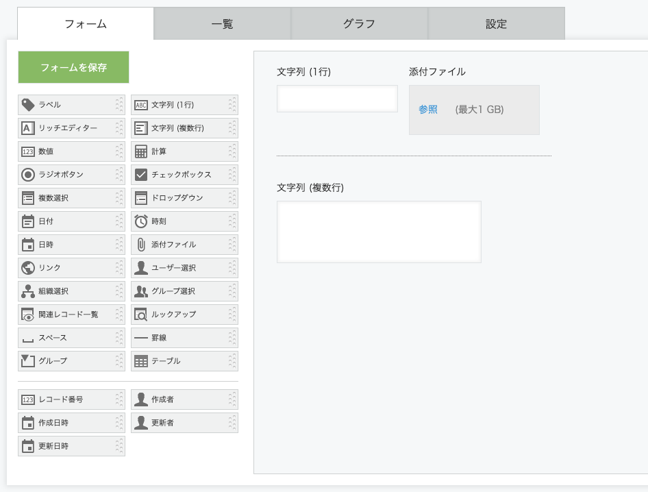
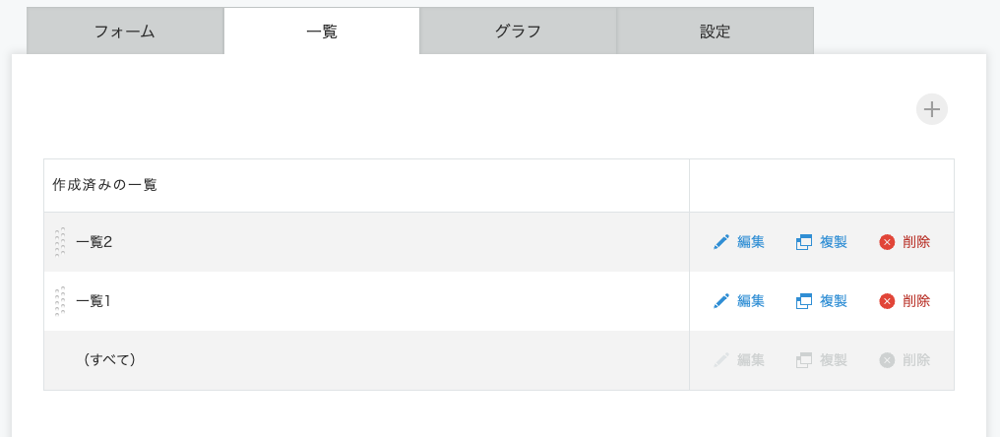

## Table of Contents

## はじめに

24 卒としてサイボウズに内定をもらってから、フロントエンドエンジニアとして内定者アルバイトをしていました。

期間は 2023/10/1~2024/2/29 までの 5 か月間。

本当はせっかくだし少し踏み込んだこと書こうと思って、アルバイト最終日に「どの辺からグレーゾーンなんですかね？ここって社外秘ですか？」とか聞いてましたが、最終日だし、わざわざレビューしてもらうのもなんかな...と思ったので、
踏み込まずに感想ベースで個人ブログにだらだらとまとめました。

## 背景

早く働きたい！と思った動機として一応書きますが、本質ではないことも話しています。

[ジョインする](https://blog.sakupi01.com/life/articles/intern-completed-aritcle#ジョインする)からがアルバイト体験記です😌

### 就活
<!-- textlint-disable -->
私は 2022/8~2023/5 月末まで、[University of Technology Sydney(UTS)](https://www.uts.edu.au/)に 2 セメスター交換留学しており、Information Technology を専攻していました。
<!-- textlint-enable -->

就活期間はその期間内でした。
<br/>
<br/>
<!-- textlint-disable -->
留学当初は生活に慣れるので精一杯だったり、バックパッカーしてたりで（詳細は後日（？））、

「まー、インターンも実務経験もないし、就活とか無理だし、帰国したら院進しようかな。過去問取り寄せなきゃ。」と考えていました。一応研究室の先生に相談したところ、
<!-- textlint-enable -->

先生：「どうせ M1 になっても就活あるんだから、経験としてやっといてもいいんじゃない？」

私：「🫡」

という流れで晴れて就活生活がスタートしました。(この時点で 2023/1 なので、今考えると 24 卒インターン経験なしとしては😱。当時はそんなことも知らない。)
<br/>
<br/>
:::note{.info}
ℹ️ Info
<br/>
留学中に日本企業の就活ができたのは、渡航国と日本との時差が 2 時間(サマータイム)しかなかった＆IT エンジニアとして就活してたのでオンラインで内定承諾まで完結できたからです。加えて、留学先では 11~2 月までが Summer Holiday だったので、就活に集中できる時間が確保できたこともラッキーな要因でした。
<!-- textlint-disable -->
:::

それからは自己分析と企業研究を並行しながら、サポーターズに登録して、企業を提案してもらって、合いそうなとこを受けていく流れでした。（留学中まともに日本語を喋ってなくて、めちゃくちゃ思考力が落ちていた（[外国語副作用](https://ja.wikipedia.org/wiki/%E5%A4%96%E5%9B%BD%E8%AA%9E%E5%89%AF%E4%BD%9C%E7%94%A8)）気がしたので、急いで日本人の友達を作ったり、面談や受ける企業数を増やして慣れていたという点で少し特殊な手法をとっていたかもです）
<br/>
<br/>

とはいえ就活生としての技術力はほぼなかったので、いろんな企業が公開している技術試験をやったり、以前 Vue.js で作っていたアプリを React に書き換えたりして、就活駆動開発していました。
<br/>
<br/>
それから 1 か月半〜2 か月、色々(住んでいた家を追い出される、新学期が始まるなど)ありましたが、就活を続け、2023/3 初旬に第一志望だったサイボウズの内定を承諾して就活を終えました。
<!-- textlint-enable -->
<br/>
<br/>
どうしてサイボウズなのかは自分のなかで諸説ありますが、パッとふわっと出てくるのは、なぜか面接が楽しくて、素の自分で話してるなと感じられたからです。

### 実務経験が欲しいぞ

とはいえ、内定をもらってからの方が将来に対する不安が込み上げてきました。

インターン経験・実務経験ないしはチーム開発経験も薄い私がこのまま来年から社会の波にのまれるのは非常に好ましくないと思いました。
<br/>
<br/>
<!-- textlint-disable -->
サイボウズでは、定期的に内定者が集まれるイベントがオン・オフラインで用意されています。
<!-- textlint-enable -->

そのなかで同じフロントエンド職能として内定をもらっている同期と話す機会があり、「内定者バイトとかないんかねー？」という話題になりました。
<br/>
<br/>
そんな"ほざき"を人事の方に相談してみたところ、「現状では考えていないですが、検討してみます！」と議論の場に持っていってくださり、チームに受け入れ体制を整えてもらって、働くことができるようになりました。

学生の希望を真摯に聞き入れてくださった人事の方やチームには感謝でいっぱいです。

## ジョインする

たくさんの協力があって実現したサイボウズでの内定者アルバイトは 2023/10/1~始まりました🌷
<br/>
<br/>
サイボウズではさまざまなグループウェア製品のプロジェクトが進行しているのですが、私は[kintone](https://kintone.cybozu.co.jp/)というグループウェア製品の開発チームに配属されました。

<https://kintone.cybozu.co.jp/>

フロントエンド職能採用であったため、そのなかでもフロントエンドリアーキテクチャチーム（通称：フロリア）という、現状 Closure Tools で書かれている kintone のフロントエンド実装を React+TypeScript に刷新するチームへ配属されました。

:::note{.message}
📝 Memo
<br/>
実際は刷新だけではなく、他にも kintone のフロントエンドを継続的に開発可能にしていく取り組み(テスト拡充、アクセシビリティ改善、パフォーマンス計測など)が行なわれている
:::
<https://blog.cybozu.io/archive/category/%E3%83%95%E3%83%AD%E3%83%AA%E3%82%A2>

<https://blog.cybozu.io/entry/2022/02/04/171154>

フロリア内でもチームはさらに細分化されており、中でも kintone 内でアプリを作成する画面(以下参照)の刷新をする Reactone チームで働くことになりました。


*アプリ作成画面*

kintone のような大規模プロダクトの刷新でも、このようにページ単位でチームが細分化されているため、各チームがしっかりオーナーシップを持っており、技術選定やアーキテクチャ設計に対する議論を活発にしながら開発できるのはいいなと感じました。

## 取り組んだこと

私が内定者期間中に携わった具体的な刷新項目は以下でした。

- 一覧画面の刷新(追加・編集・複製・削除・DnD など)

*一覧画面*
- フォーム画面(アプリ作成画面の図参照)の一部フィールドの刷新

## チームでの開発

### スクラム開発

開発サイクルは木~水 1 週間を 1Sprint とするスクラム開発で、大体次のような感じでした。

1. 火：バックログリファインメント
2. 水：スプリントレビュー、レトロスペクティブ、スプリントプランニング
3. 木：スプリント開始
3. 毎日：朝会（デイリースクラム）

PBI の管理には Github Projects を使っていましたが、途中から ZenHub を使用していました。
基本的にカンバン方式なのは GH Projects と一緒なのですが、ZenHub では消化 SP に基づいてベロシティーが計測されたり消化 PBI の変化がわかりやすかったり、データの可視化の面で優れているなと思いました。
（稼働日的にスクラムイベントめちゃくちゃ参加できたわけではないですが......）

### 役割とPBIの進め方

チームは PG(3~4 人)、QA(2 人)、SM(1 人)から構成されていて、それぞれがドメイン知識を活かして PBI 消化にコミットしており、とても贅沢な開発環境だったと思います。

以下は取っていた PBI 消化までのサイクルです。

1. スプリントプランニングで PBI が決まる
2. PBI に基づいてタスクを箇条書きし、Issue を作る
3. Issue の機能実装をする(ペアやモブプロで実装する。場合によってはソロ)
4. QA の方と自動テスト観点のすり合わせをする（`Integration Test`, `Browser Test`, `E2E`, `VRT`がある。Issue の種類によってどの観点でどのテストをどのくらいやるかが異なるので、そこを擦り合わせる）
5. 自動テストを実装する
    - `Integration`: Jest+Testing Library
    - `Browser`: Storybook+Playwright
    - `E2E`: Selenium
    - `VRT`: Storybook+Chromatic
6. セルフレビューをする
7. PG レビューに出す
8. レビュー修正をする->Accepted
9. QA の方に手動テストをしてもらう
10. 手動テストクリアしたら晴れてマージ💯

機能の実装には必ず適切な種類と粒度のテストが伴うようになっています。

### 学び・感想

毎回多くのことを学んだのですが、アルバイト期間を通して特に印象に残っている部分をピックアップします。

#### PRの出し方

先に述べたように、私はチーム開発の経験が薄かったので、最初はこうしたサイクルを覚えること、PR を出すときの振る舞いなどにとても不安がありました。（チーム開発に対する不安を解消するためにアルバイトをしたかったまである）

最初の方に先輩 PG の方にべったりペアプロしていただいたことで開発フローを掴むことができ、だんだんソロやモブプロできる時間が増えてきました。

また、社内ドキュメントや ADR が非常に充実しているため、ソロプロで困ったときはよく活用していました。
<br/>
<br/>
レビュアーに伝わりやすい PR を出すために気をつけていたことは、PR のテンプレートを用意することと、セルフレビューを挟んでからレビューしてもらうことです。

PR テンプレートは個人のリポジトリなら用意するようにしているのですが、社内リポジトリのテンプレートを新たに作るのもちょっと気がひけったので、私は Chrome 拡張機能を使用して次のような PR テンプレートのスニペットとして登録しています。

PR のテンプレートがあることで、毎回均一な情報濃度の PR を作成できます。

<https://blaze.today/>

```
## 🏁 Outline

## 🔗 References

## 📝 Description

## 📸 Image

## ✅ Test
```

セルフレビューに関しては、実装できたら自分でコード差分を読まずにレビュアーをアサインしてしまっていました。

そのため、コード差分がわかりにくそうな部分にはコメントをつけてからレビュー依頼するように心がけています。

そうすることで、無駄な差分やミスに気づけますし、実装中にした小さな意思決定を相手に伝えられるのでレビューコストの削減が期待できました。

#### テスト実装

技術的な面では、React+TypeScript, Redux は面識が濃かったですし、Storybook や Chromatic も個人的に使用していたので知識を活かせました。
<br/>
<br/>
しかし、当初はテスト実装の経験が薄く、Integration テスト項目１つ Pass するにも業務時間の半分近くかかったりしてました。

そもそも、 **「どんなテストを」「どのように」「どの方法で」「どのくらい」** 実装するのかがわかっていなかったため、前述した「QA の方と自動テスト観点のすり合わせ」というプロセスやテスト設計の ADR がとても勉強になりました。

QA の方と自動テスト観点のすり合わせを行なうときは、QA の方が事前に用意してくれている各テスト項目に関して次のような点を中心に QA<->PG 間ですり合わせます。

- どんなテストを: 期待結果の確認
<!-- textlint-disable -->
- どのように: そもそも実装可能か・実装手順の確認

    1. XX のボタンを押してダイアログを開く-> 2. 文字列を入力する-> 3. 保存ボタンを押す-> 4.画面を再読み込みする-> 5. 値が保存されていることを確認するなど
<!-- textlint-enable -->
- どの方法で: `Integration Test`, `Browser Test`, `E2E`, `VRT`の選定基準 ADR を参考に
- どのくらい: 他のテスト項目と本質的に重複していないか・本当に実装の必要があるか

また、テストを書くようになったことで、アクセシビリティツリーを意識した実装や、テストコードを書きやすくするための適切な抽象化の粒度・コード設計を考慮できるようになりました✅

:::note{.message}
📝 Memo
<br/>
抽象化やコード設計に関してはデザインパターンが大きく関与しており、すべてではないですが、Zenn で書いた[Reactデザインパターンについての記事](https://zenn.dev/cybozu_frontend/articles/design-patterns-in-react)でまとめています。
<!-- textlint-disable -->
:::
<!-- textlint-enable -->

※TS で書ける Integration や Browser テストは割と手がさくさく動くようになりましたが、Java のコードを触って Selenium で動かす E2E テストは今でも苦手です🤮

## イベント

内定者同期とのイベントも含めて、たくさんの社内イベントの参加も経験させてもらいました。

- 社内勉強会：React ドキュメントを読む会

    23 新卒の先輩方がやっていた社内勉強会に 24 卒内定者が途中から参加する形でした。
    内容は[https://ja.react.dev/learn](https://ja.react.dev/learn)を回しで読んでいく形で、React に対する理解を深めることができました。

- ブログ Week

    社内で技術探求やブログを書く時間が設けられている週があり、その期間は業務としてブログ記事を書いていました。

    好きな内容で探求活動をして良かったので、私は React におけるデータフェッチ方法を調査して[記事](https://zenn.dev/cybozu_frontend/articles/f1f03e69946177)にまとめました。
    はじめてブログなんて書くのでとても不安だったのですが、フロントエンドエキスパートチーム(FEE)の方たちから技術的な指摘や日本語面でのアドバイスをいただくことができ、心理的安全性の高さを感じました。

- Reactone ミートアップ

    普段一緒にお仕事をしている Reactone のメンバーとオフラインで会える最初の機会でした🌟

    今回は各地から福岡オフィスに集まってのミートアップでした🍜

<!-- textlint-disable -->
- [Cybozu Days](https://days.cybozu.co.jp/)

    開発に携わっているプロダクトが個人や他企業にどのような影響を与えているのかを知ることができました。刷新プロジェクトであまりユーザーからのフィードバックが得られない中、貴重なイベントだったと思います。
<!-- textlint-enable -->
- 内定者オフラインイベント@東京オフィス

- [Advent Calendar](https://adventar.org/calendars/9255)

- 開運祭り、Cybozu Frontend Day 2024

    開発本部・運用本部のメンバーが東京オフィスに集まって、LT や OST を通して交流する機会でした。一方的に認知していたあんな方やこんな方と会えたり、直接話す機会をがあったり、終始 Wow でした🫢

## まとめ

サイボウズで内定者アルバイトをした感想をまとめました。

誰かに伝える目的<記憶の保存という感じの書き方でだらだらとなってしまいましたが、この記事がチーム開発に関する解像度を少しでもあげるものになれば幸いです。

学生時代にこんなに恵まれた環境を経験できたことをとても幸せに感じていますし、４月から入社したらもっともりもり頑張っていきたいと思います🐣🔥

新人研修で他の同期と会えたり、開発本部の講座受けられるのも楽しみ！

それまで、学生としての余生を楽しむ旅に出ようと思います。(To be continued...)
